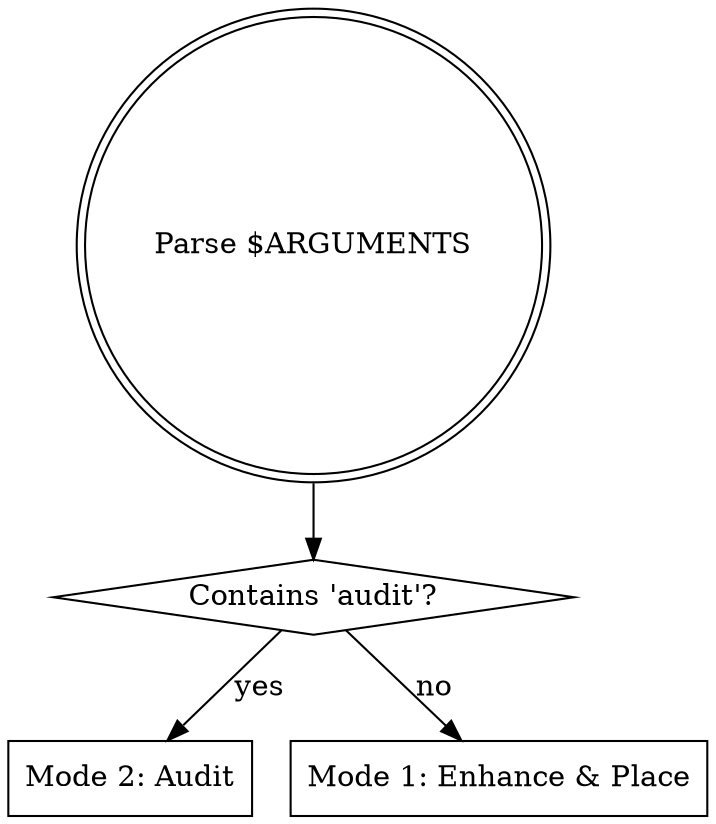
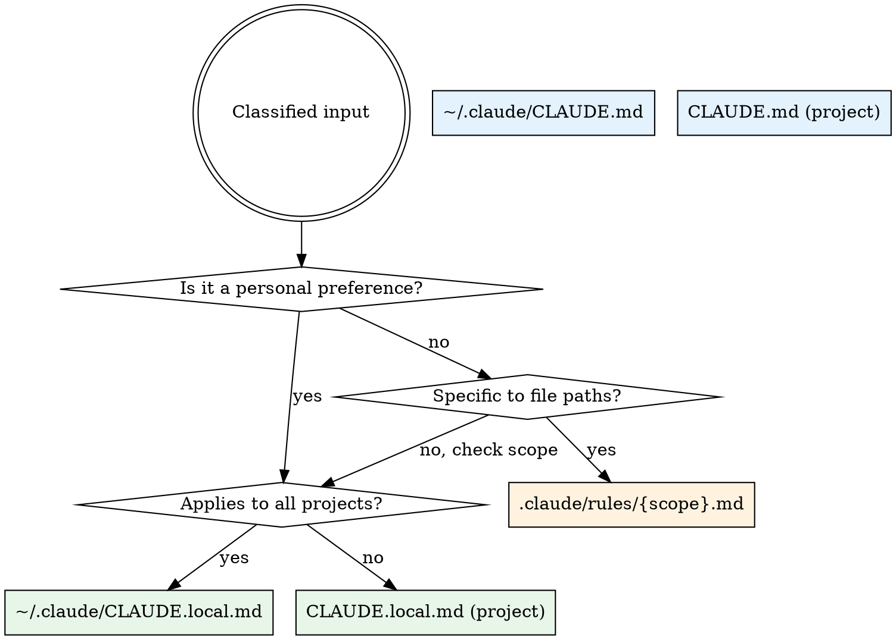

# Claude Guardian — Config Rule Placement & Audit

Enhance rough rule ideas into well-structured rules and place them in the correct config file.
Audit all config files to catch accidental deletions, misplacements, and protected section violations.

**Arguments:** $ARGUMENTS

---

## MODE SELECTION



- `$ARGUMENTS` contains `audit` -> **Mode 2: Audit & Guard**
- Otherwise -> **Mode 1: Enhance & Place** (treat `$ARGUMENTS` as the rough rule text)

---

## CONFIG FILE LOCATIONS

| File | Scope | Content Type | Examples |
|------|-------|-------------|---------|
| `~/.claude/CLAUDE.md` | ALL projects globally | Generic cross-project rules | "Always use forward slashes in bash" |
| `~/.claude/CLAUDE.local.md` | All projects globally (private) | Personal preferences for all projects | "I prefer verbose test output" |
| `CLAUDE.md` (project root) | This project only | Project-specific rules, architecture, commands | "Use Hilt for DI", "5-location model import rule" |
| `CLAUDE.local.md` (project root) | This project only (private) | Local dev preferences, env config | "Backend runs at localhost:8000" |
| `.claude/rules/*.md` | Path-scoped within project | Rules for specific file patterns | "Backend tests must use `client` fixture" |

**Resolution:** Global files apply everywhere. Project files override globals. Path-scoped rules load only when editing matching files.

---

## MODE 1: ENHANCE & PLACE

### Step 1: Parse & Classify Input

Read the rough rule text from `$ARGUMENTS` and classify it:

| Classification | Signal Words / Patterns | Target File |
|---------------|------------------------|-------------|
| RULE | "always", "never", "must", imperative verbs | Depends on scope |
| CONVENTION | "prefer", "use X for Y", naming patterns | Depends on scope |
| WORKFLOW | "before doing X", "after Y, run Z", multi-step process | Depends on scope |
| PREFERENCE | "I like", "I prefer", first-person statements | `*.local.md` |

### Step 2: Determine Correct Placement



**Scope decision heuristic:**
- Mentions specific technologies/patterns unique to this project (Hilt, Room, FastAPI, RasoiAI) -> **project**
- Generic programming practice (bash syntax, git conventions, code style) -> **global**
- References specific directories or file types (`backend/tests/`, `*.kt`) -> **path-scoped rule**
- "I prefer", "I like", environment-specific -> **local (private)**

### Step 3: Check for Duplicates & Conflicts

Search ALL config files for existing rules that overlap:

```bash
# Search all config locations for related content
for f in \
  "$HOME/.claude/CLAUDE.md" \
  "$HOME/.claude/CLAUDE.local.md" \
  "CLAUDE.md" \
  "CLAUDE.local.md" \
  .claude/rules/*.md; do
  [ -f "$f" ] && echo "=== $f ===" && grep -in "{keywords}" "$f" 2>/dev/null
done
```

Extract 2-3 distinctive keywords from the rough rule. If matches found:
- **Exact duplicate** -> Report and STOP. Do not add.
- **Partial overlap** -> Suggest merging or updating the existing rule instead.
- **Contradiction** -> Flag the conflict, show both rules, ask user which to keep.

### Step 4: Enhance the Rule

Transform the rough input into a well-structured rule:

**Enhancement checklist:**
- [ ] Clear, imperative language (not passive voice)
- [ ] Specific — no ambiguous terms ("appropriate", "relevant")
- [ ] Actionable — Claude can follow it mechanically
- [ ] Concise — one rule per statement, no filler
- [ ] Consistent with existing rule style in the target file

**Format by type:**

| Type | Format |
|------|--------|
| Single rule | `- **Rule Name**: Description with specifics` |
| Table row | Add to existing table if one exists for this category |
| Multi-step | Numbered list under a heading |
| Convention | `| Pattern | Convention | Example |` table row |

### Step 5: Present for Approval

Show the user:

```
## Claude Guardian: Rule Placement

**Input:** {original rough text}
**Classification:** {RULE/CONVENTION/WORKFLOW/PREFERENCE}
**Target file:** {full path}
**Placement:** {section heading or "new section: {name}"}

### Enhanced Rule:
{formatted rule text}

### Duplicate Check: {CLEAN / OVERLAP: {details} / CONFLICT: {details}}

Approve? (The rule will be inserted into the target file)
```

**CRITICAL:** Do NOT write to any file until the user explicitly approves.

### Step 6: Save (After Approval Only)

1. Read the target file
2. Find the correct section (or create a new one at the appropriate location)
3. **NEVER insert inside `<!-- PROTECTED SECTION -->` blocks**
4. Use Edit tool to add the rule
5. Confirm: `"Rule saved to {file}:{line_number}"`

---

## MODE 2: AUDIT & GUARD

Run a comprehensive audit of all config files. Perform ALL checks below and produce a consolidated report.

### Check 1: Deletion Detection

```bash
# Compare working tree against last commit for each config file
for f in CLAUDE.md CLAUDE.local.md; do
  [ -f "$f" ] && git diff HEAD -- "$f" 2>/dev/null | grep "^-[^-]" | head -20
done
```

**Flag if:**
- Any line removed from a `<!-- PROTECTED SECTION -->` block
- Any rule (line starting with `-`, `|`, or numbered list) was deleted
- Net line count decreased significantly (>10 lines removed without additions)

### Check 2: Protected Section Integrity

```bash
# Verify protected sections have matching open/close markers
python3 -c "
import re, sys
files = ['CLAUDE.md', 'CLAUDE.local.md']
for f in files:
    try:
        with open(f) as fh:
            content = fh.read()
        opens = len(re.findall(r'<!-- PROTECTED SECTION', content))
        closes = len(re.findall(r'<!-- ={10,} -->', content))
        if opens != closes:
            print(f'VIOLATION: {f} has {opens} PROTECTED opens but {closes} closes')
        elif opens > 0:
            print(f'OK: {f} has {opens} protected section(s) intact')
    except FileNotFoundError:
        pass
"
```

### Check 3: Misplacement Detection

Read each config file and scan for content that belongs elsewhere:

| Pattern Found In | Misplacement Signal | Should Be In |
|-----------------|---------------------|--------------|
| `~/.claude/CLAUDE.md` | References project-specific tech (Hilt, Room, FastAPI) | Project `CLAUDE.md` |
| `~/.claude/CLAUDE.md` | "I prefer", "my setup", personal env paths | `~/.claude/CLAUDE.local.md` |
| Project `CLAUDE.md` | Generic bash/git/coding rules with no project context | `~/.claude/CLAUDE.md` |
| Project `CLAUDE.md` | Personal preferences, local paths, env-specific | `CLAUDE.local.md` |
| `CLAUDE.local.md` | Rules that should apply to all contributors | Project `CLAUDE.md` |
| `.claude/rules/*.md` | Rules not scoped to a file pattern | Project `CLAUDE.md` |

```bash
# Example: Check if project CLAUDE.md has generic rules
grep -n "forward slash\|always use\|never commit\|prefer.*over" CLAUDE.md 2>/dev/null | \
  grep -iv "hilt\|room\|rasoiai\|fastapi\|android\|backend" | head -10
```

### Check 4: Orphaned Rules

Find rules referencing files or paths that no longer exist:

```bash
# Extract file paths mentioned in rules, check if they exist
python3 -c "
import re, os
files = ['CLAUDE.md', 'CLAUDE.local.md'] + [f'.claude/rules/{r}' for r in os.listdir('.claude/rules') if r.endswith('.md')]
for f in files:
    try:
        with open(f) as fh:
            content = fh.read()
        paths = re.findall(r'[\`]([a-zA-Z0-9_/.-]+\.[a-zA-Z]{1,4})[\`]', content)
        for p in set(paths):
            if p.startswith(('http', '#', '.')) or '...' in p:
                continue
            if not os.path.exists(p) and not os.path.exists(p.lstrip('/')):
                print(f'ORPHAN: {f} references \`{p}\` — file not found')
    except FileNotFoundError:
        pass
"
```

### Check 5: Duplicate Rules (Cross-File)

Search for rules that appear in multiple files:

```bash
# Extract rule-like lines from all config files, find duplicates
python3 -c "
import os, re
rules = {}
files = ['CLAUDE.md', 'CLAUDE.local.md']
if os.path.isdir('.claude/rules'):
    files += [f'.claude/rules/{r}' for r in os.listdir('.claude/rules') if r.endswith('.md')]
for gh in [os.path.expanduser('~/.claude/CLAUDE.md'), os.path.expanduser('~/.claude/CLAUDE.local.md')]:
    if os.path.exists(gh):
        files.append(gh)
for f in files:
    try:
        with open(f) as fh:
            for i, line in enumerate(fh, 1):
                stripped = line.strip()
                if stripped.startswith(('- **', '| ')) and len(stripped) > 20:
                    key = re.sub(r'[^a-z0-9 ]', '', stripped.lower())[:60]
                    rules.setdefault(key, []).append(f'{f}:{i}')
    except FileNotFoundError:
        pass
for key, locs in rules.items():
    if len(locs) > 1:
        print(f'DUPLICATE: \"{key[:40]}...\" found in: {\" | \".join(locs)}')
"
```

### Audit Report Format

```
## Claude Guardian: Audit Report

### Summary
| Check | Status | Issues |
|-------|--------|--------|
| Deletion detection | PASS/WARN | {count} |
| Protected sections | PASS/FAIL | {details} |
| Misplaced rules | PASS/WARN | {count} |
| Orphaned references | PASS/WARN | {count} |
| Duplicate rules | PASS/WARN | {count} |

### Issues Found
{detailed list of each issue with file:line and recommended action}

### Recommended Actions
1. {action with exact command or edit to fix}
2. ...

Fix these issues? (I'll apply the changes with your approval)
```

**CRITICAL:** Do NOT auto-fix any issues. Present the report and wait for user approval before making changes.

---

## PROTECTED SECTION RULES

When placing rules (Mode 1) or fixing issues (Mode 2):

- **NEVER** insert content inside `<!-- PROTECTED SECTION -->` blocks
- **NEVER** modify lines between `<!-- PROTECTED SECTION -->` and `<!-- ========== -->` markers
- **NEVER** delete protected sections even if they appear redundant
- Place new content BEFORE or AFTER protected sections, never inside

---

## QUICK REFERENCE

| Mode | Trigger | Reads | Writes | User Approval Required |
|------|---------|-------|--------|----------------------|
| Enhance & Place | `/claude-guardian <rule text>` | All 5 config locations | One target file | Yes, before save |
| Audit & Guard | `/claude-guardian audit` | All 5 config locations | None (report only) | Yes, before fixes |

| Step (Mode 1) | Action |
|---------------|--------|
| 1 | Parse & classify input |
| 2 | Determine target file |
| 3 | Check duplicates/conflicts |
| 4 | Enhance into structured rule |
| 5 | Present for approval |
| 6 | Save after approval |

| Check (Mode 2) | What It Catches |
|----------------|----------------|
| Deletion detection | Removed rules, shrunk protected sections |
| Protected integrity | Broken open/close markers |
| Misplacement | Rules in wrong config file |
| Orphaned refs | References to deleted files |
| Duplicates | Same rule in multiple files |
