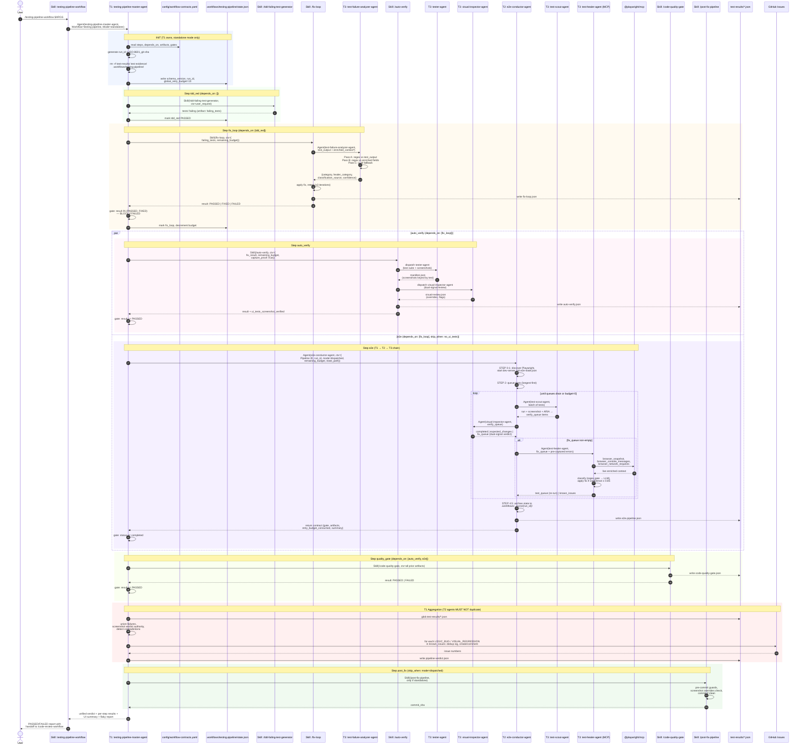
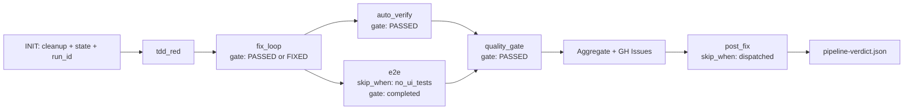

# Sequence Diagram — /testing-pipeline-workflow

Synthesized from:
- `core/.claude/skills/testing-pipeline-workflow/SKILL.md` (dispatch wrapper)
- `config/workflow-contracts.yaml` → `workflows.testing-pipeline` (step DAG, gates, artifacts)
- `core/.claude/agents/testing-pipeline-master-agent.md` (T1 orchestration protocol)
- `core/.claude/agents/test-pipeline-agent.md` (T2 sub-orchestrator)
- `core/.claude/agents/e2e-conductor-agent.md` (T2 sub-orchestrator, post PR #10)
- `core/.claude/agents/test-failure-analyzer-agent.md` (T3 leaf, post PR #9)
- `core/.claude/rules/agent-orchestration.md` (tier model, context passing)

Last verified against merged PRs #3–#11.

---

## Mermaid sequence diagram

---

## Supporting DAG view (parallel branches)

---

## Key contracts (non-obvious behavior)

- **Tier rule:** T1 dispatches T2 via `Agent()`, T2 dispatches T3 via `Agent()`, T3 leaves use `Skill()` only. Max depth 4 per `agent-orchestration.md` rule #2.
- **Retry budget:** T1 owns the shared `global_retry_budget` (default 15). Every `Agent()` dispatch context includes `remaining_budget`; T2 decrements and returns `retry_budget_consumed`.
- **Screenshot authority:** Any UI test with `verdict_source: "screenshot"` + `FAILED` is blocking regardless of exit code. Applies at T1 aggregation AND at T2 conductor gate.
- **Cleanup ownership:** T1 wipes `test-results/` + `test-evidence/` at INIT in **standalone only**. Dispatched mode leaves that to T0.
- **Aggregation ownership:** Only T1 runs `pipeline_aggregator.py`. T2 agents write per-stage JSON but MUST NOT union-aggregate.
- **Enriched context (PR #9):** T2 conductor / T3 healer capture `browser_console_messages`, `browser_network_requests`, `dom_snapshot` via `@playwright/mcp` and pass them to `test-failure-analyzer-agent` in the dispatch prompt — the analyzer stays a T3 leaf with no MCP grants.
- **State archive (PR #10):** After step completion, canonical state is copied to `runs/{run_id}/` for audit; canonical path stays.

---

## Step-by-step mapping to `workflow-contracts.yaml`

| Step        | Skill / Agent                     | depends_on            | Gate expression                       | skip_when              |
|-------------|-----------------------------------|-----------------------|---------------------------------------|------------------------|
| tdd_red     | `/tdd-failing-test-generator`     | —                     | —                                     | —                      |
| fix_loop    | `/fix-loop` (dispatches analyzer) | [tdd_red]             | `fix_result.result IN (PASSED, FIXED)`| —                      |
| auto_verify | `/auto-verify`                    | [fix_loop]            | `verification.result == PASSED`       | —                      |
| e2e         | `e2e-conductor-agent` (T2)        | [fix_loop]            | `e2e_state.status == completed`       | `no_ui_tests == true`  |
| quality_gate| `/code-quality-gate`              | [auto_verify, e2e]    | `quality.result == PASSED`            | —                      |
| post_fix    | `/post-fix-pipeline`              | [quality_gate]        | —                                     | `mode == 'dispatched'` |

---

## Artifacts written per step

| Step        | Path                                                   | Schema            |
|-------------|--------------------------------------------------------|-------------------|
| tdd_red     | `tests/`                                               | `test_files_v1`   |
| fix_loop    | `test-results/fix-loop.json`                           | `test_result_v1`  |
| auto_verify | `test-results/auto-verify.json`                        | `test_result_v1`  |
| e2e         | `.workflows/testing-pipeline/e2e-state.json` (+ archive under `runs/{run_id}/`) | `e2e_v1` |
| quality_gate| `test-results/code-quality-gate.json`                  | `quality_gate_v1` |
| post_fix    | commit SHA (git only)                                  | `git_sha`         |
| Final       | `test-results/pipeline-verdict.json`                   | unified verdict   |

---

## Handoff

On `quality_gate == PASSED` the master agent suggests `/code-review-workflow` per the contract's `handoff_suggestions` — tests passing + quality verified means ready for review.
