# Workflow Documentation

> Auto-generated by `scripts/generate_workflow_docs.py` | Last updated: 2026-06-16 18:20 UTC

## Workflows

| Workflow | Skills | Agents | Rules | Description |
|----------|--------|--------|-------|-------------|
| [_Needs Manual Review](_needs-manual-review.md) | 43 | 1 | 19 | Patterns that could not be auto-assigned. Requires manual review. |
| [Code Review](code-review.md) | 18 | 11 | 1 | Creating, requesting, and acting on code reviews. |
| [Debugging Loop](debugging-loop.md) | 23 | 4 | 1 | Targeted bug diagnosis and structured resolution. |
| [Development Loop](development-loop.md) | 47 | 14 | 3 | The core build cycle: ideate, plan, implement, verify, commit. |
| [Documentation](documentation.md) | 14 | 10 | 0 | Documentation generation, structure enforcement, and maintenance. |
| [Hub Sync](hub-sync.md) | 4 | 0 | 0 | Hub-specific pattern management: provisioning, syncing, contributing. |
| [Learning Self Improvement](learning-self-improvement.md) | 18 | 3 | 1 | Session analysis, pattern detection, knowledge accumulation, and skill auto-generation. |
| [Loop Engineering](loop-engineering.md) | 28 | 8 | 5 | Autonomous self-* meta-loop: discover, plan, execute (maker), verify (independent checker), ship or self-heal, learn each cycle. |
| [Session Continuity](session-continuity.md) | 9 | 2 | 1 | Start, save, resume, and hand over between sessions. |
| [Skill Authoring](skill-authoring.md) | 26 | 21 | 7 | Creating, validating, and maintaining skills, agents, and rules. |
| [Testing Pipeline](testing-pipeline.md) | 92 | 24 | 13 | Test execution, verification, quality enforcement, and the fix-verify-commit chain. |

## Cross-Workflow Connections

```mermaid
graph TD
    development_loop[Development Loop]
    loop_engineering[Loop Engineering]
    testing_pipeline[Testing Pipeline]
    debugging_loop[Debugging Loop]
    learning_self_improvement[Learning Self Improvement]
    session_continuity[Session Continuity]
    skill_authoring[Skill Authoring]
    code_review[Code Review]
    documentation[Documentation]
    hub_sync[Hub Sync]
    _needs_manual_review[_Needs Manual Review]
    skill_authoring --> documentation
    development_loop --> documentation
    testing_pipeline --> documentation
    skill_authoring --> loop_engineering
    skill_authoring --> testing_pipeline
    documentation --> skill_authoring
    documentation --> loop_engineering
    documentation --> testing_pipeline
    development_loop --> skill_authoring
    development_loop --> loop_engineering
    development_loop --> testing_pipeline
    testing_pipeline --> skill_authoring
    testing_pipeline --> loop_engineering
    loop_engineering --> development_loop
    loop_engineering --> testing_pipeline
    loop_engineering --> code_review
    loop_engineering --> skill_authoring
    development_loop --> code_review
    code_review --> loop_engineering
    code_review --> development_loop
    code_review --> testing_pipeline
    code_review --> skill_authoring
    loop_engineering --> learning_self_improvement
    development_loop --> learning_self_improvement
    code_review --> learning_self_improvement
    testing_pipeline --> debugging_loop
    testing_pipeline --> development_loop
    testing_pipeline --> code_review
    debugging_loop --> loop_engineering
    debugging_loop --> development_loop
    debugging_loop --> testing_pipeline
    debugging_loop --> code_review
    debugging_loop --> skill_authoring
    development_loop --> debugging_loop
    documentation --> development_loop
    loop_engineering --> debugging_loop
    loop_engineering --> documentation
    skill_authoring --> development_loop
    skill_authoring --> code_review
    testing_pipeline --> learning_self_improvement
    skill_authoring --> learning_self_improvement
    development_loop --> _needs_manual_review
    testing_pipeline --> _needs_manual_review
    documentation --> debugging_loop
    documentation --> code_review
    code_review --> debugging_loop
    documentation --> hub_sync
    documentation --> session_continuity
    documentation --> learning_self_improvement
    loop_engineering --> hub_sync
    loop_engineering --> session_continuity
    testing_pipeline --> hub_sync
    testing_pipeline --> session_continuity
    code_review --> hub_sync
    code_review --> session_continuity
    code_review --> documentation
    development_loop --> session_continuity
    session_continuity --> learning_self_improvement
    session_continuity --> testing_pipeline
    _needs_manual_review --> testing_pipeline
    debugging_loop --> session_continuity
    debugging_loop --> learning_self_improvement
    debugging_loop --> hub_sync
    debugging_loop --> documentation
    development_loop --> hub_sync
    skill_authoring --> session_continuity
    skill_authoring --> debugging_loop
    _needs_manual_review --> debugging_loop
    _needs_manual_review --> loop_engineering
    learning_self_improvement --> loop_engineering
    learning_self_improvement --> debugging_loop
    learning_self_improvement --> development_loop
    learning_self_improvement --> testing_pipeline
    learning_self_improvement --> code_review
    learning_self_improvement --> skill_authoring
    loop_engineering --> _needs_manual_review
    debugging_loop --> _needs_manual_review
    code_review --> _needs_manual_review
    skill_authoring --> _needs_manual_review
    _needs_manual_review --> skill_authoring
    _needs_manual_review --> documentation
    _needs_manual_review --> development_loop
    learning_self_improvement --> session_continuity
    documentation --> _needs_manual_review
    session_continuity --> skill_authoring
    session_continuity --> loop_engineering
    learning_self_improvement --> hub_sync
    learning_self_improvement --> documentation
    session_continuity --> development_loop
    session_continuity --> debugging_loop
    session_continuity --> hub_sync
    session_continuity --> code_review
    session_continuity --> documentation
    skill_authoring --> hub_sync
    learning_self_improvement --> _needs_manual_review
```

## Orphan Patterns

These patterns are not assigned to any workflow group.
Add them to `config/workflow-groups.yml` if they belong to a workflow.

- apply-selections (skill)
- pattern-quality (skill)
- provision-report (skill)
- scan-discovery-report (skill)
- scan-repo (skill)
- scan-url (skill)
- ssot-workflow-audit (skill)
- synthesize-hub (skill)
- workflow-doc-reviewer (skill)
