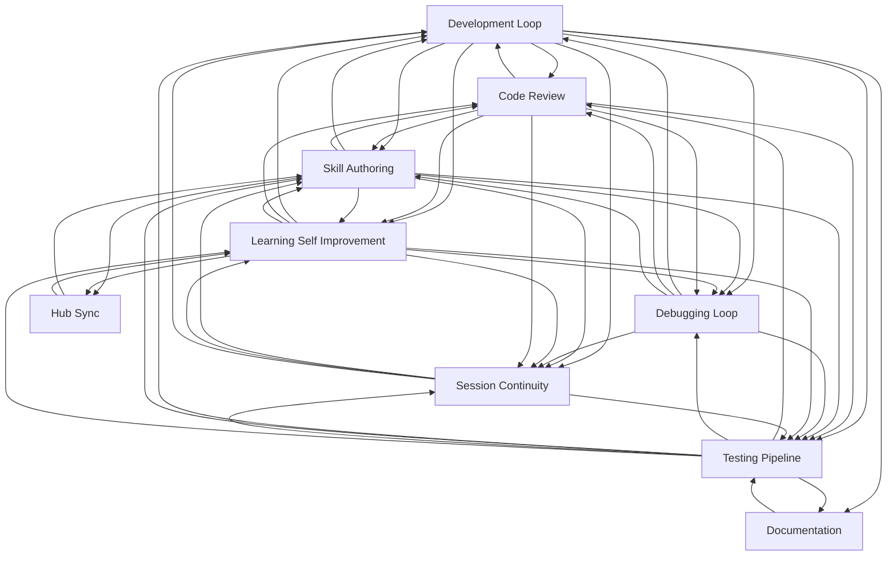

# Workflow Documentation

> Auto-generated by `scripts/generate_workflow_docs.py` | Last updated: 2026-03-24 16:26 UTC

## Workflows

| Workflow | Skills | Agents | Rules | Description |
|----------|--------|--------|-------|-------------|
| [Code Review](code-review.md) | 13 | 2 | 0 | Creating, requesting, and acting on code reviews. |
| [Debugging Loop](debugging-loop.md) | 7 | 2 | 0 | Targeted bug diagnosis and structured resolution. |
| [Development Loop](development-loop.md) | 12 | 2 | 1 | The core build cycle: ideate, plan, implement, verify, commit. |
| [Documentation](documentation.md) | 6 | 1 | 0 | Documentation generation, structure enforcement, and maintenance. |
| [Hub Sync](hub-sync.md) | 4 | 0 | 0 | Hub-specific pattern management: provisioning, syncing, contributing. |
| [Learning Self Improvement](learning-self-improvement.md) | 12 | 2 | 1 | Session analysis, pattern detection, knowledge accumulation, and skill auto-generation. |
| [Session Continuity](session-continuity.md) | 6 | 1 | 1 | Start, save, resume, and hand over between sessions. |
| [Skill Authoring](skill-authoring.md) | 15 | 1 | 6 | Creating, validating, and maintaining skills, agents, and rules. |
| [Testing Pipeline](testing-pipeline.md) | 19 | 6 | 2 | Test execution, verification, quality enforcement, and the fix-verify-commit chain. |

## Cross-Workflow Connections

## Orphan Patterns

These patterns are not assigned to any workflow group.
Add them to `config/workflow-groups.yml` if they belong to a workflow.

- a11y-audit (skill)
- agent-orchestration (rule)
- ai-gemini-api (skill)
- android (rule)
- android-adb-test (skill)
- android-arch (skill)
- android-build-fixer-agent (agent)
- android-compose-agent (agent)
- android-compose-ui (rule)
- android-gradle (skill)
- android-kotlin (rule)
- android-kotlin-reviewer-agent (agent)
- android-mvi-scaffold (skill)
- android-run-e2e (skill)
- android-run-tests (skill)
- android-test-patterns (skill)
- anthropic-agent-orchestration-guide (skill)
- apply-selections (skill)
- batch (skill)
- branching (skill)
- bun-elysia (rule)
- bun-elysia-test (skill)
- change-risk-scoring (skill)
- chaos-resilience (skill)
- ci-cd-setup (skill)
- claude-behavior (rule)
- compose-ui (skill)
- configuration-ssot (rule)
- cross-platform-visual (skill)
- d3-viz (skill)
- dast-scan (skill)
- db-migrate (skill)
- deploy-strategy (skill)
- disaster-recovery (skill)
- docker-optimize (skill)
- drizzle-orm (skill)
- expo-dev (skill)
- fastapi-api-tester-agent (agent)
- fastapi-backend (rule)
- fastapi-database (rule)
- fastapi-database-admin-agent (agent)
- fastapi-db-migrate (skill)
- fastapi-deploy (skill)
- fastapi-run-backend-tests (skill)
- feature-flag (skill)
- firebase (rule)
- firebase-ai (skill)
- firebase-data-connect (skill)
- firebase-dev (skill)
- firebase-test (skill)
- flutter (rule)
- flutter-dart-agent (agent)
- flutter-dev (skill)
- flutter-e2e-test (skill)
- git-worktrees (skill)
- hono-backend (skill)
- html-prototype (skill)
- iac-deploy (skill)
- incident-response (skill)
- integration-test (skill)
- jest-dev (skill)
- k8s-deploy (skill)
- mcp-server-builder (skill)
- merge-strategy (skill)
- middleware-test (skill)
- mobile-a11y-test (skill)
- mock-server (skill)
- monitoring-setup (skill)
- monorepo (skill)
- nextjs-dev (skill)
- node-backend-dev (skill)
- nuxt-dev (skill)
- obsidian (skill)
- parallel-worktree-orchestrator-agent (agent)
- pg-query (skill)
- pipeline-orchestrator (skill)
- playwright (skill)
- pm2-deploy (skill)
- prd-parser (skill)
- prisma-orm (skill)
- project-manager-agent (agent)
- project-scaffold (skill)
- prompt-auto-enhance-rule (rule)
- provision-report (skill)
- pytest-dev (skill)
- react-native-dev (skill)
- react-native-e2e (skill)
- react-nextjs (rule)
- react-test-patterns (skill)
- redis-patterns (skill)
- remotion-video (skill)
- research-mode (skill)
- scan-discovery-report (skill)
- scan-repo (skill)
- scan-url (skill)
- schema-designer (skill)
- semgrep-rules (skill)
- solidity-audit (skill)
- ssot-audit (skill)
- strategic-architect (skill)
- supply-chain-audit (skill)
- tailwind-dev (skill)
- test-data-management (skill)
- trace-test (skill)
- twitter-x (skill)
- ui-ux-pro-max (skill)
- vitest-dev (skill)
- vue (rule)
- vue-dev (skill)
- vue-test (skill)
- web-quality (skill)
- web-research-specialist-agent (agent)
- web-scraper (skill)
- websocket-patterns (skill)
- workflow-change-verification (rule)
- workflow-doc-reviewer (skill)
- workflow-docs-sync (rule)
- workflow-quality-gate (rule)
- xml-to-compose (skill)
