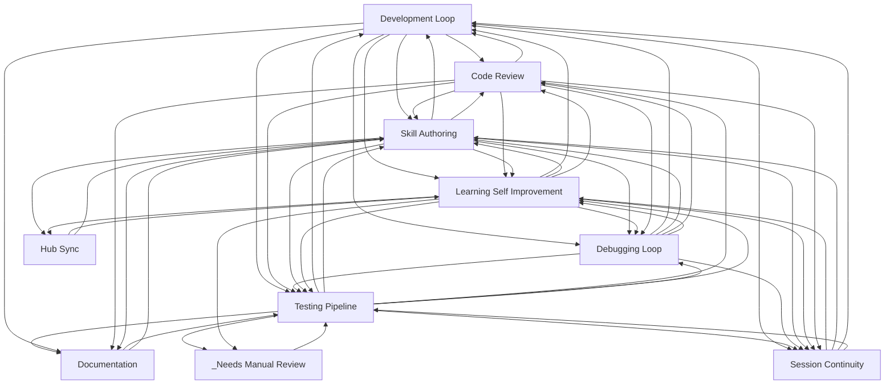

# Workflow Documentation

> Auto-generated by `scripts/generate_workflow_docs.py` | Last updated: 2026-04-01 06:58 UTC

## Workflows

| Workflow | Skills | Agents | Rules | Description |
|----------|--------|--------|-------|-------------|
| [_Needs Manual Review](_needs-manual-review.md) | 39 | 1 | 10 | Patterns that could not be auto-assigned. Requires manual review. |
| [Code Review](code-review.md) | 16 | 5 | 0 | Creating, requesting, and acting on code reviews. |
| [Debugging Loop](debugging-loop.md) | 18 | 3 | 1 | Targeted bug diagnosis and structured resolution. |
| [Development Loop](development-loop.md) | 39 | 9 | 1 | The core build cycle: ideate, plan, implement, verify, commit. |
| [Documentation](documentation.md) | 9 | 3 | 0 | Documentation generation, structure enforcement, and maintenance. |
| [Hub Sync](hub-sync.md) | 5 | 0 | 0 | Hub-specific pattern management: provisioning, syncing, contributing. |
| [Learning Self Improvement](learning-self-improvement.md) | 18 | 3 | 1 | Session analysis, pattern detection, knowledge accumulation, and skill auto-generation. |
| [Session Continuity](session-continuity.md) | 8 | 2 | 1 | Start, save, resume, and hand over between sessions. |
| [Skill Authoring](skill-authoring.md) | 18 | 15 | 7 | Creating, validating, and maintaining skills, agents, and rules. |
| [Testing Pipeline](testing-pipeline.md) | 54 | 18 | 5 | Test execution, verification, quality enforcement, and the fix-verify-commit chain. |

## Cross-Workflow Connections

## Orphan Patterns

These patterns are not assigned to any workflow group.
Add them to `config/workflow-groups.yml` if they belong to a workflow.

- provision-report (skill)
- scan-repo (skill)
- scan-url (skill)
- ssot-workflow-audit (skill)
- workflow-change-verification (rule)
- workflow-doc-reviewer (skill)
- workflow-docs-sync (rule)
- workflow-quality-gate (rule)
