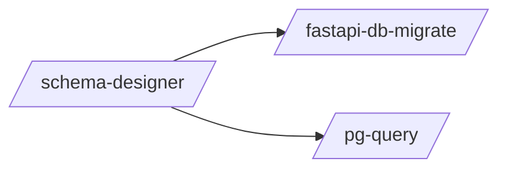

# _Needs Manual Review

> Patterns that could not be auto-assigned. Requires manual review.

> Auto-generated by `scripts/generate_workflow_docs.py` | Last updated: 2026-04-01 06:58 UTC

## Overview



## Detailed Flow

Step-level flow showing gates (diamonds), delegations (dashed), and artifacts (cylinders).

```mermaid
graph TD
    subgraph android_arch_sub["Android Arch"]
        android_arch_s1["Step 1: Clean Architecture — Layers & Modules"]
        android_arch_s2["Step 2: Hilt Dependency Injection"]
        android_arch_s1 --> android_arch_s2
        android_arch_s3["Step 3: ViewModel & State Management"]
        android_arch_s2 --> android_arch_s3
        android_arch_s4["Step 4: Offline-First Data Layer"]
        android_arch_s3 --> android_arch_s4
        android_arch_s5["Step 5: Kotlin Coroutines & Structured Concurrency"]
        android_arch_s4 --> android_arch_s5
        android_arch_s6["Step 6: Accessibility"]
        android_arch_s5 --> android_arch_s6
        android_arch_s7{{Step 7: ADB Debugging}}
        android_arch_s6 --> android_arch_s7
    end

    subgraph android_gradle_sub["Android Gradle"]
        android_gradle_s1["Step 1: Convention Plugins (build-logic/)"]
        android_gradle_s2["Step 2: Version Catalog (libs.versions.toml)"]
        android_gradle_s1 --> android_gradle_s2
        android_gradle_s3["Step 3: Build Performance Optimization"]
        android_gradle_s2 --> android_gradle_s3
        android_gradle_s4{{Step 4: CI/CD Build Optimization}}
        android_gradle_s3 --> android_gradle_s4
    end

    subgraph android_mvi_scaffold_sub["Android Mvi Scaffold"]
        android_mvi_scaffold_s1["Step 1: Analyze Existing Project"]
        android_mvi_scaffold_s2["Step 2: Generate Feature Structure"]
        android_mvi_scaffold_s1 --> android_mvi_scaffold_s2
        android_mvi_scaffold_s3{{Step 3: Generate Contract File}}
        android_mvi_scaffold_s2 --> android_mvi_scaffold_s3
        android_mvi_scaffold_s4{{Step 4: Generate ViewModel}}
        android_mvi_scaffold_s3 --> android_mvi_scaffold_s4
        android_mvi_scaffold_s5{{Step 5: Generate Screen Composable}}
        android_mvi_scaffold_s4 --> android_mvi_scaffold_s5
        android_mvi_scaffold_s6["Step 6: Generate Domain + Data Layers"]
        android_mvi_scaffold_s5 --> android_mvi_scaffold_s6
        android_mvi_scaffold_s7["Step 7: Generate DI Module"]
        android_mvi_scaffold_s6 --> android_mvi_scaffold_s7
        android_mvi_scaffold_s8{{Step 8: Verify}}
        android_mvi_scaffold_s7 --> android_mvi_scaffold_s8
    end

    subgraph batch_sub["Batch"]
        batch_s1["Step 1: Codebase-Wide Impact Analysis"]
        batch_s2["Step 2: Change Decomposition"]
        batch_s1 --> batch_s2
        batch_s3["Step 3: Parallel Execution"]
        batch_s2 --> batch_s3
        batch_s4["Step 4: Consistency Verification"]
        batch_s3 --> batch_s4
        batch_s5["Step 5: Auto-Simplify"]
        batch_s4 --> batch_s5
        batch_s6["Step 6: PR Strategy"]
        batch_s5 --> batch_s6
        batch_s7["Step 7: Rollback Safety"]
        batch_s6 --> batch_s7
        batch_s8["Step 8: Common Change Patterns"]
        batch_s7 --> batch_s8
        batch_s9["Step 9: Dry Run Mode & Progress Tracking"]
        batch_s8 --> batch_s9
    end

    subgraph compose_ui_sub["Compose Ui"]
        compose_ui_s1["Step 1: State Hoisting"]
        compose_ui_s2["Step 2: Modifiers"]
        compose_ui_s1 --> compose_ui_s2
        compose_ui_s3["Step 3: Theming"]
        compose_ui_s2 --> compose_ui_s3
        compose_ui_s4["Step 4: Previews"]
        compose_ui_s3 --> compose_ui_s4
        compose_ui_s5["Step 5: Performance"]
        compose_ui_s4 --> compose_ui_s5
        compose_ui_s6["Step 6: Compose Navigation"]
        compose_ui_s5 --> compose_ui_s6
        compose_ui_s7{{Step 7: Coil Image Loading}}
        compose_ui_s6 --> compose_ui_s7
    end

    subgraph cross_platform_visual_sub["Cross Platform Visual"]
        cross_platform_visual_s1["Step 1: Identify Target Screens"]
        cross_platform_visual_s2["Step 2: Capture Screenshots Per Platform"]
        cross_platform_visual_s1 --> cross_platform_visual_s2
        cross_platform_visual_s3["Step 3: Normalize Screenshots"]
        cross_platform_visual_s2 --> cross_platform_visual_s3
        cross_platform_visual_s4["Step 4: Visual Comparison"]
        cross_platform_visual_s3 --> cross_platform_visual_s4
        cross_platform_visual_s5["Step 5: Report"]
        cross_platform_visual_s4 --> cross_platform_visual_s5
        cross_platform_visual_s6["Step 6: Baseline Storage"]
        cross_platform_visual_s5 --> cross_platform_visual_s6
    end

    subgraph d3_viz_sub["D3 Viz"]
        d3_viz_s1["Step 1: Detect Chart Type"]
        d3_viz_s2["Step 2: Standard Workflow"]
        d3_viz_s1 --> d3_viz_s2
        d3_viz_s3["Step 3: Chart Templates"]
        d3_viz_s2 --> d3_viz_s3
        d3_viz_s4["Step 4: Interactions"]
        d3_viz_s3 --> d3_viz_s4
        d3_viz_s5["Step 5: Transitions & Animation"]
        d3_viz_s4 --> d3_viz_s5
        d3_viz_s6["Step 6: Responsive Design"]
        d3_viz_s5 --> d3_viz_s6
        d3_viz_s7["Step 7: Framework Integration"]
        d3_viz_s6 --> d3_viz_s7
        d3_viz_s8["Step 8: Data Loading & Formatting"]
        d3_viz_s7 --> d3_viz_s8
        d3_viz_s9["Step 9: Color & Design"]
        d3_viz_s8 --> d3_viz_s9
        d3_viz_s10["Step 10: Verify"]
        d3_viz_s9 --> d3_viz_s10
    end

    subgraph deploy_strategy_sub["Deploy Strategy"]
        deploy_strategy_s1["Step 1: Assess Current State"]
        deploy_strategy_s2["Step 2: GitOps Setup"]
        deploy_strategy_s1 --> deploy_strategy_s2
        deploy_strategy_s3["Step 3: Progressive Delivery"]
        deploy_strategy_s2 --> deploy_strategy_s3
        deploy_strategy_s4["Step 4: Zero-Downtime Database Migrations"]
        deploy_strategy_s3 --> deploy_strategy_s4
        deploy_strategy_s5["Step 5: Production Readiness Review (PRR)"]
        deploy_strategy_s4 --> deploy_strategy_s5
        deploy_strategy_s6["Step 6: Deployment Runbook"]
        deploy_strategy_s5 --> deploy_strategy_s6
        deploy_strategy_s7["Step 7: Secret Rotation Strategy"]
        deploy_strategy_s6 --> deploy_strategy_s7
        deploy_strategy_s8["Step 8: CDN & Edge Caching Strategy"]
        deploy_strategy_s7 --> deploy_strategy_s8
        deploy_strategy_s9["Step 9: Mobile App Deployment"]
        deploy_strategy_s8 --> deploy_strategy_s9
    end

    subgraph docker_optimize_sub["Docker Optimize"]
        docker_optimize_s1["Step 1: Assess Current State"]
        docker_optimize_s2["Step 2: Multi-Stage Builds"]
        docker_optimize_s1 --> docker_optimize_s2
        docker_optimize_s3["Step 3: Layer Caching"]
        docker_optimize_s2 --> docker_optimize_s3
        docker_optimize_s4["Step 4: Image Size Reduction"]
        docker_optimize_s3 --> docker_optimize_s4
        docker_optimize_s5["Step 5: Security Hardening"]
        docker_optimize_s4 --> docker_optimize_s5
        docker_optimize_s6["Step 6: Health Checks"]
        docker_optimize_s5 --> docker_optimize_s6
        docker_optimize_s7["Step 7: Docker Compose"]
        docker_optimize_s6 --> docker_optimize_s7
        docker_optimize_s8["Step 8: Build Arguments and Multi-Platform"]
        docker_optimize_s7 --> docker_optimize_s8
        docker_optimize_s9["Step 9: Performance Tuning"]
        docker_optimize_s8 --> docker_optimize_s9
        docker_optimize_s10["Step 10: Common Anti-Patterns"]
        docker_optimize_s9 --> docker_optimize_s10
        docker_optimize_s11["Step 11: Language-Specific Patterns"]
        docker_optimize_s10 --> docker_optimize_s11
        docker_optimize_s12["Step 12: Apply Optimizations"]
        docker_optimize_s11 --> docker_optimize_s12
    end

    subgraph fastapi_db_migrate_sub["Fastapi Db Migrate"]
        fastapi_db_migrate_s1["Step 1: New Model Mode"]
        fastapi_db_migrate_s2["Step 2: Check Mode"]
        fastapi_db_migrate_s1 --> fastapi_db_migrate_s2
        fastapi_db_migrate_s3["Step 3: Status Mode"]
        fastapi_db_migrate_s2 --> fastapi_db_migrate_s3
    end

    subgraph fastapi_deploy_sub["Fastapi Deploy"]
        fastapi_deploy_s1["Step 1: Pre-flight Checks"]
        fastapi_deploy_s2["Step 2: Run Migrations (unless --skip-migrate)"]
        fastapi_deploy_s1 --> fastapi_deploy_s2
        fastapi_deploy_s3["Step 3: Seed Data (unless --skip-seed)"]
        fastapi_deploy_s2 --> fastapi_deploy_s3
        fastapi_deploy_s4["Step 4: Start/Restart Server"]
        fastapi_deploy_s3 --> fastapi_deploy_s4
        fastapi_deploy_s5["Step 5: Health Check"]
        fastapi_deploy_s4 --> fastapi_deploy_s5
    end

    subgraph feature_flag_sub["Feature Flag"]
        feature_flag_s1["Step 1: Assess Flag Need"]
        feature_flag_s2{{Step 2: Choose Flag Type}}
        feature_flag_s1 --> feature_flag_s2
        feature_flag_s3["Step 3: Implement the Flag"]
        feature_flag_s2 --> feature_flag_s3
        feature_flag_s4["Step 4: Test Both Paths"]
        feature_flag_s3 --> feature_flag_s4
        feature_flag_s5["Step 5: Document the Flag"]
        feature_flag_s4 --> feature_flag_s5
        feature_flag_s6["Step 6: Plan Cleanup"]
        feature_flag_s5 --> feature_flag_s6
    end

    subgraph html_prototype_sub["Html Prototype"]
        html_prototype_s1["Step 1: Parse PRD/Spec for Screens"]
        html_prototype_s2["Step 2: Build the Shared Design System"]
        html_prototype_s1 --> html_prototype_s2
        html_prototype_s3["Step 3: Generate Screen Files"]
        html_prototype_s2 --> html_prototype_s3
        html_prototype_s4["Step 4: Create the Index Page"]
        html_prototype_s3 --> html_prototype_s4
        html_prototype_s5["Step 5: Create Implementation Mapping Doc"]
        html_prototype_s4 --> html_prototype_s5
        html_prototype_s6["Step 6: Apply Nielsen's 10 Heuristics"]
        html_prototype_s5 --> html_prototype_s6
        html_prototype_s7["Step 7: Add PRD Traceability Annotations"]
        html_prototype_s6 --> html_prototype_s7
        html_prototype_s8{{Step 8: Walkthrough Summary}}
        html_prototype_s7 --> html_prototype_s8
    end

    subgraph monitoring_setup_sub["Monitoring Setup"]
        monitoring_setup_s1["Step 1: Assess Current State"]
        monitoring_setup_s2["Step 2: Prometheus Metrics"]
        monitoring_setup_s1 --> monitoring_setup_s2
        monitoring_setup_s3["Step 3: Golden Signals"]
        monitoring_setup_s2 --> monitoring_setup_s3
        monitoring_setup_s4["Step 4: SLO/SLI Definition"]
        monitoring_setup_s3 --> monitoring_setup_s4
        monitoring_setup_s5["Step 5: Alerting Rules"]
        monitoring_setup_s4 --> monitoring_setup_s5
        monitoring_setup_s6["Step 6: Grafana Dashboards"]
        monitoring_setup_s5 --> monitoring_setup_s6
        monitoring_setup_s7["Step 7: Log Aggregation"]
        monitoring_setup_s6 --> monitoring_setup_s7
        monitoring_setup_s8["Step 8: Distributed Tracing"]
        monitoring_setup_s7 --> monitoring_setup_s8
        monitoring_setup_s9["Step 9: Application Instrumentation Patterns"]
        monitoring_setup_s8 --> monitoring_setup_s9
        monitoring_setup_s10["Step 10: Infrastructure Monitoring"]
        monitoring_setup_s9 --> monitoring_setup_s10
        monitoring_setup_s11["Step 11: Stack-Specific Dashboard Templates"]
        monitoring_setup_s10 --> monitoring_setup_s11
        monitoring_setup_s12["Step 12: Anti-Patterns to Avoid"]
        monitoring_setup_s11 --> monitoring_setup_s12
    end

    subgraph obsidian_sub["Obsidian"]
        obsidian_s1["Step 1: Detect Action"]
        obsidian_s2["Step 2: Locate Vault"]
        obsidian_s1 --> obsidian_s2
        obsidian_s3["Step 3: Execute Action"]
        obsidian_s2 --> obsidian_s3
        obsidian_s4["Step 4: Obsidian CLI Integration"]
        obsidian_s3 --> obsidian_s4
        obsidian_s5["Step 5: Automation Hooks"]
        obsidian_s4 --> obsidian_s5
        obsidian_s6{{Step 6: Verify & Report}}
        obsidian_s5 --> obsidian_s6
    end

    subgraph remotion_video_sub["Remotion Video"]
        remotion_video_s1["Step 1: Detect Action"]
        remotion_video_s2["Step 2: Project Setup"]
        remotion_video_s1 --> remotion_video_s2
        remotion_video_s3["Step 3: Core Patterns"]
        remotion_video_s2 --> remotion_video_s3
        remotion_video_s4["Step 4: Animation"]
        remotion_video_s3 --> remotion_video_s4
        remotion_video_s5["Step 5: Media"]
        remotion_video_s4 --> remotion_video_s5
        remotion_video_s6["Step 6: Advanced Features"]
        remotion_video_s5 --> remotion_video_s6
        remotion_video_s7["Step 7: Rendering"]
        remotion_video_s6 --> remotion_video_s7
        remotion_video_s8["Step 8: Fonts & Styling"]
        remotion_video_s7 --> remotion_video_s8
        remotion_video_s9["Step 9: Preview & Debug"]
        remotion_video_s8 --> remotion_video_s9
        remotion_video_s10["Step 10: Verify"]
        remotion_video_s9 --> remotion_video_s10
    end

    subgraph scan_discovery_report_sub["Scan Discovery Report"]
        scan_discovery_report_s1["Step 1: Gather Scan Results"]
        scan_discovery_report_s2["Step 2: Load Hub Baseline"]
        scan_discovery_report_s1 --> scan_discovery_report_s2
        scan_discovery_report_s3["Step 3: Classify Each Discovery"]
        scan_discovery_report_s2 --> scan_discovery_report_s3
        scan_discovery_report_s4["Step 4: Evaluate Replacement Candidates"]
        scan_discovery_report_s3 --> scan_discovery_report_s4
        scan_discovery_report_s5["Step 5: Generate the Report"]
        scan_discovery_report_s4 --> scan_discovery_report_s5
        scan_discovery_report_s6["Step 6: Output Format Selection"]
        scan_discovery_report_s5 --> scan_discovery_report_s6
        scan_discovery_report_s7["Step 7: Archive the Report"]
        scan_discovery_report_s6 --> scan_discovery_report_s7
        scan_discovery_report_s8["Step 8: Post-Report Actions"]
        scan_discovery_report_s7 --> scan_discovery_report_s8
    end

    subgraph schema_designer_sub["Schema Designer"]
        schema_designer_s1["Step 1: Gather Requirements"]
        schema_designer_s2["Step 2: Entity-Relationship Design"]
        schema_designer_s1 --> schema_designer_s2
        schema_designer_s3{{Step 3: Index Design}}
        schema_designer_s2 --> schema_designer_s3
        pg_query_ext([/pg-query/])
        schema_designer_s3 -.-> pg_query_ext
        schema_designer_s4["Step 4: Evolution Strategy"]
        schema_designer_s3 --> schema_designer_s4
        schema_designer_s5["Step 5: API Contract Alignment"]
        schema_designer_s4 --> schema_designer_s5
        schema_designer_s6["Step 6: Multi-Tenancy Design"]
        schema_designer_s5 --> schema_designer_s6
        schema_designer_s6b["Step 6b: Multi-Database Considerations"]
        schema_designer_s6 --> schema_designer_s6b
        schema_designer_s7{{Step 7: Output Artifacts}}
        schema_designer_s6b --> schema_designer_s7
        fastapi_db_migrate_ext([/fastapi-db-migrate/])
        schema_designer_s7 -.-> fastapi_db_migrate_ext
        schema_designer_s8{{Step 8: Review Checklist}}
        schema_designer_s7 --> schema_designer_s8
        schema_designer_s8 -.-> pg_query_ext
    end

    subgraph strategic_architect_sub["Strategic Architect"]
        strategic_architect_s1["Step 1: Diagnose Mode"]
        strategic_architect_s2{{Step 2: Constraint Identification}}
        strategic_architect_s1 --> strategic_architect_s2
        strategic_architect_s3["Step 3: Strategic Report"]
        strategic_architect_s2 --> strategic_architect_s3
        strategic_architect_s4{{Step 4: Check-In Mode}}
        strategic_architect_s3 --> strategic_architect_s4
        strategic_architect_s5["Step 5: Reassess Mode"]
        strategic_architect_s4 --> strategic_architect_s5
    end

    subgraph twitter_x_sub["Twitter X"]
        twitter_x_s1["Step 1: Read Post"]
        twitter_x_s2["Step 2: Compose Tweet"]
        twitter_x_s1 --> twitter_x_s2
        twitter_x_s3["Step 3: Viral Potential Scoring"]
        twitter_x_s2 --> twitter_x_s3
        twitter_x_s4["Step 4: Search & Discover"]
        twitter_x_s3 --> twitter_x_s4
        twitter_x_s5["Step 5: Post & Engage"]
        twitter_x_s4 --> twitter_x_s5
        twitter_x_s6{{Step 6: Follower & Social Management}}
        twitter_x_s5 --> twitter_x_s6
        twitter_x_s7["Step 7: Account Health & Growth"]
        twitter_x_s6 --> twitter_x_s7
        twitter_x_s8["Step 8: Keyword Monitoring"]
        twitter_x_s7 --> twitter_x_s8
        twitter_x_s9["Step 9: Content Strategy & Planning"]
        twitter_x_s8 --> twitter_x_s9
    end

    subgraph ui_ux_pro_max_sub["Ui Ux Pro Max"]
        ui_ux_pro_max_s1["Step 1: Analyze User Requirements"]
        ui_ux_pro_max_s2["Step 2: Generate Design System (REQUIRED)"]
        ui_ux_pro_max_s1 --> ui_ux_pro_max_s2
        ui_ux_pro_max_s2b["Step 2b: Persist Design System (Master + Overrides Pattern)"]
        ui_ux_pro_max_s2 --> ui_ux_pro_max_s2b
        ui_ux_pro_max_s3["Step 3: Supplement with Detailed Searches (as needed)"]
        ui_ux_pro_max_s2b --> ui_ux_pro_max_s3
        ui_ux_pro_max_s4["Step 4: Stack Guidelines (Default: html-tailwind)"]
        ui_ux_pro_max_s3 --> ui_ux_pro_max_s4
    end

    subgraph web_quality_sub["Web Quality"]
        web_quality_s1["Step 1: Identify Audit Scope"]
        web_quality_s2["Step 2: Core Web Vitals Audit"]
        web_quality_s1 --> web_quality_s2
        web_quality_s3["Step 3: Accessibility Audit (WCAG 2.1 AA)"]
        web_quality_s2 --> web_quality_s3
        web_quality_s4["Step 4: SEO Audit"]
        web_quality_s3 --> web_quality_s4
        web_quality_s5["Step 5: Progressive Enhancement"]
        web_quality_s4 --> web_quality_s5
        web_quality_s6["Step 6: Responsive Design Audit"]
        web_quality_s5 --> web_quality_s6
        web_quality_s7["Step 7: Performance Budget Audit"]
        web_quality_s6 --> web_quality_s7
        web_quality_s8{{Step 8: Run the Full Audit}}
        web_quality_s7 --> web_quality_s8
        web_quality_s9{{Step 9: Generate Audit Report}}
        web_quality_s8 --> web_quality_s9
        web_quality_s10{{Step 10: Common Anti-Patterns Reference}}
        web_quality_s9 --> web_quality_s10
    end

    subgraph xml_to_compose_sub["Xml To Compose"]
        xml_to_compose_s1["Step 1: Analyze the XML Layout"]
        xml_to_compose_s2["Step 2: Plan the Migration"]
        xml_to_compose_s1 --> xml_to_compose_s2
        xml_to_compose_s3["Step 3: Convert Using Mapping Tables"]
        xml_to_compose_s2 --> xml_to_compose_s3
        xml_to_compose_s4["Step 4: Code Examples"]
        xml_to_compose_s3 --> xml_to_compose_s4
        xml_to_compose_s5["Step 5: Interop (Gradual Migration)"]
        xml_to_compose_s4 --> xml_to_compose_s5
        xml_to_compose_s6["Step 6: State Migration"]
        xml_to_compose_s5 --> xml_to_compose_s6
        xml_to_compose_s7{{Step 7: Verify}}
        xml_to_compose_s6 --> xml_to_compose_s7
    end

    schema_designer_s7 ==> fastapi_db_migrate_s1
```

## Skills

| Skill | Version | Description | Calls | Called By |
|-------|---------|-------------|-------|----------|
| `/android-arch` | 1.0.0 | Build Android apps with Clean Architecture using Hilt DI, ViewModel + StateFl... | — | — |
| `/android-gradle` | 1.0.0 | Configure Gradle convention plugins, version catalogs, and build performance ... | — | — |
| `/android-mvi-scaffold` | 1.0.0 | Scaffold a complete MVI (Model-View-Intent) feature module with Contract (Sta... | — | — |
| `/batch` | 1.0.1 | Orchestrate parallel codebase-wide changes including renames, API migrations,... | — | — |
| `/compose-ui` | 1.0.0 | Build Jetpack Compose UIs with state hoisting, modifier chains, Material3 the... | — | — |
| `/cross-platform-visual` | 1.0.0 | Validate visual consistency by capturing the same screen across Android, Web,... | — | — |
| `/d3-viz` | 1.0.0 | Build D3.js data visualizations including bar, line, scatter, pie, heatmap, c... | — | — |
| `/deploy-strategy` | 1.0.0 | Design deployment strategies including GitOps (ArgoCD/Flux), progressive deli... | — | — |
| `/docker-optimize` | 1.0.0 | Optimize Dockerfiles and Docker Compose configurations for production readine... | — | — |
| `/drizzle-orm` | 1.0.0 | Apply Drizzle ORM patterns for schema design, migrations, queries, and relati... | — | — |
| `/fastapi-db-migrate` | 1.0.1 | Generate and manage database migrations for FastAPI + Alembic projects. Creat... | — | `/schema-designer` |
| `/fastapi-deploy` | 1.0.0 | Orchestrate backend deployment for FastAPI projects by running migrations, se... | — | — |
| `/feature-flag` | 1.0.0 | Implement feature toggles for gradual rollout and incomplete feature manageme... | — | — |
| `/firebase-data-connect` | 1.0.0 | Configure Firebase Data Connect (PostgreSQL + GraphQL), Hosting (static sites... | — | — |
| `/github` | 1.0.0 | Search GitHub repositories by stars/topic/language/owner, search code across ... | — | — |
| `/hono-backend` | 1.0.0 | Build TypeScript backends with Hono web framework on Node.js, Bun, Deno, or C... | — | — |
| `/html-prototype` | 1.0.0 | Generate multi-file working HTML prototypes for websites or mobile apps. Prod... | — | — |
| `/incident-response` | 1.0.0 | Manage incident response through detection, triage, severity classification, ... | — | — |
| `/k8s-deploy` | 1.0.2 | Deploy and configure Kubernetes workloads including manifests, services, ingr... | — | — |
| `/middleware-test` | 1.0.1 | Test middleware layers: auth (multi-layer), rate limiting, caching, request v... | — | — |
| `/monitoring-setup` | 1.0.1 | Set up comprehensive monitoring and observability for services. Covers Promet... | — | — |
| `/monorepo` | 1.0.0 | Manage monorepo configurations with npm/pnpm/yarn workspaces, Turborepo, and ... | — | — |
| `/obsidian` | 1.0.0 | Manage Obsidian vaults by creating/editing .md, .base, .canvas files with Obs... | — | — |
| `/pg-query` | 1.0.0 | Execute read-only PostgreSQL queries with schema exploration, EXPLAIN ANALYZE... | — | `/schema-designer` |
| `/pm2-deploy` | 1.0.0 | Configure PM2 process management and deployment for Node.js applications. Use... | — | — |
| `/prisma-orm` | 1.0.0 | Design Prisma ORM schemas, run migrations, write queries, and configure clien... | — | — |
| `/reddit` | 1.0.0 | Manage Reddit interactions: read posts and threads, compose posts and comment... | — | — |
| `/redis-patterns` | 1.0.1 | Apply Redis 7+ patterns for data structure selection, caching strategies, con... | — | — |
| `/remotion-video` | 1.0.0 | Create programmatic videos with React and Remotion covering compositions, seq... | — | — |
| `/scan-discovery-report` | 1.0.0 | Generate structured reports from scan results across GitHub, Reddit, and X/Tw... | — | — |
| `/schema-designer` | 1.0.0 | Design database schemas covering ER modeling, normalization, evolutionary str... | `/fastapi-db-migrate`, `/pg-query` | — |
| `/strategic-architect` | 1.0.1 | Diagnose project health and create strategic plans by identifying bottlenecks... | — | — |
| `/tailwind-dev` | 1.0.0 | Apply Tailwind CSS v3/v4 patterns for setup and configuration, component styl... | — | — |
| `/twitter-x` | 1.0.1 | Manage Twitter/X interactions: read posts, compose tweets and threads, post v... | — | — |
| `/ui-ux-pro-max` | 1.0.1 | Design and implement UI/UX across 9 stacks (React, Next.js, Vue, Svelte, Swif... | — | — |
| `/web-quality` | 1.0.0 | Run a web quality audit covering Core Web Vitals, accessibility (WCAG 2.1 AA)... | — | — |
| `/web-scraper` | 1.0.0 | Build web scrapers using Puppeteer, Cheerio, and data extraction pipelines. U... | — | — |
| `/websocket-patterns` | 1.0.0 | Implement WebSocket patterns for real-time features across frameworks. Use wh... | — | — |
| `/xml-to-compose` | 1.0.0 | Convert Android XML layouts to idiomatic Jetpack Compose. Covers layout/widge... | — | — |

## Agents

| Agent | Description | Dispatched By |
|-------|-------------|---------------|
| `parallel-worktree-orchestrator-agent` | Use this agent to coordinate parallel workstreams using git worktrees. Splits... | — |

## Rules

| Rule | Description |
|------|-------------|
| `android` | Android development rules for Kotlin + Jetpack Compose projects. |
| `android-compose-ui` | Jetpack Compose UI patterns and conventions. |
| `android-kotlin` | Kotlin language idioms, null safety, scope functions, and KMP-specific patter... |
| `bun-elysia` | Bun runtime and ElysiaJS framework patterns and conventions |
| `fastapi-backend` | FastAPI backend development rules and patterns. |
| `fastapi-database` | Database and migration rules for FastAPI + SQLAlchemy + Alembic. |
| `firebase` | Firebase Auth, Firestore, and backend token verification patterns. |
| `flutter` | Flutter/Dart development patterns and conventions. |
| `react-nextjs` | Next.js App Router and React Server Component patterns and conventions. |
| `vue` | Vue 3 Composition API patterns and conventions. |

## Cross-Workflow Connections

**Incoming** (fed by):
- `db-migrate` (skill)
- `self-improve` (skill)

<!-- MANUAL ANNOTATIONS -->
<!-- Add custom notes below this line. They are preserved on regeneration. -->
