# _Needs Manual Review

> Patterns that could not be auto-assigned. Requires manual review.

> Auto-generated by `scripts/generate_workflow_docs.py` | Last updated: 2026-06-26 05:32 UTC

## Overview

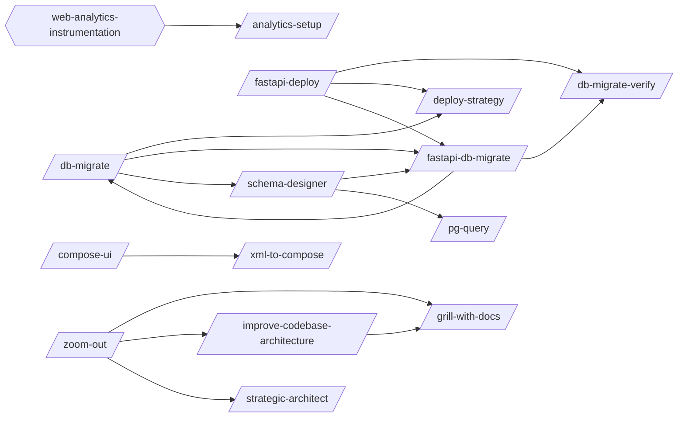

## Skills

| Skill | Version | Description | Calls | Called By |
|-------|---------|-------------|-------|----------|
| `/analytics-setup` | 1.1.0 | Set up Google Analytics 4 (one property per site) via GTM, add explicit GA4 e... | — | — |
| `/android-arch` | 1.0.1 | Build Android apps with Clean Architecture using Hilt DI, ViewModel + StateFl... | — | — |
| `/android-gradle` | 1.0.1 | Configure Gradle convention plugins, version catalogs, and build performance ... | — | — |
| `/android-mvi-scaffold` | 1.0.1 | Scaffold a complete MVI (Model-View-Intent) feature module with Contract (Sta... | — | — |
| `/batch` | 1.0.1 | Orchestrate parallel codebase-wide changes including renames, API migrations,... | — | — |
| `/compose-ui` | 1.1.0 | Build Jetpack Compose UIs with state hoisting, modifier chains, Material3 the... | `/xml-to-compose` | — |
| `/cross-platform-visual` | 1.0.0 | Validate visual consistency by capturing the same screen across Android, Web,... | — | — |
| `/d3-viz` | 1.0.0 | Build D3.js data visualizations including bar, line, scatter, pie, heatmap, c... | — | — |
| `/db-migrate` | 1.0.0 | Generate and verify database migrations across Prisma, Knex, Django, TypeORM,... | `/deploy-strategy`, `/fastapi-db-migrate`, `/schema-designer` | `/fastapi-db-migrate` |
| `/db-migrate-verify` | 1.0.0 | Verify database migrations: run forward, validate schema, run backward, valid... | — | `/fastapi-db-migrate`, `/fastapi-deploy` |
| `/deploy-strategy` | 1.0.0 | Design deployment strategies including GitOps (ArgoCD/Flux), progressive deli... | — | `/db-migrate`, `/fastapi-deploy` |
| `/docker-optimize` | 1.0.0 | Optimize Dockerfiles and Docker Compose configurations for production readine... | — | — |
| `/drizzle-orm` | 1.0.0 | Apply Drizzle ORM patterns for schema design, migrations, queries, and relati... | — | — |
| `/fastapi-db-migrate` | 1.1.0 | Generate and manage database migrations for FastAPI + Alembic projects. Creat... | `/db-migrate`, `/db-migrate-verify` | `/db-migrate`, `/fastapi-deploy`, `/schema-designer` |
| `/fastapi-deploy` | 1.1.0 | Orchestrate backend deployment for FastAPI projects by running migrations, se... | `/db-migrate-verify`, `/deploy-strategy`, `/fastapi-db-migrate` | — |
| `/feature-flag` | 1.0.0 | Implement feature toggles for gradual rollout and incomplete feature manageme... | — | — |
| `/firebase-data-connect` | 1.0.0 | Configure Firebase Data Connect (PostgreSQL + GraphQL), Hosting (static sites... | — | — |
| `/github` | 1.0.0 | Search GitHub repositories by stars/topic/language/owner, search code across ... | — | — |
| `/grill-with-docs` | 1.0.0 | Run a grilling session that challenges a plan against the project's existing ... | — | `/improve-codebase-architecture`, `/zoom-out` |
| `/hono-backend` | 1.0.0 | Build TypeScript backends with Hono web framework on Node.js, Bun, Deno, or C... | — | — |
| `/html-prototype` | 1.0.0 | Generate multi-file working HTML prototypes for websites or mobile apps. Prod... | — | — |
| `/improve-codebase-architecture` | 1.0.0 | Analyze architectural friction and propose deepening opportunities — refactor... | `/grill-with-docs` | `/zoom-out` |
| `/incident-response` | 1.0.0 | Manage incident response through detection, triage, severity classification, ... | — | — |
| `/k8s-deploy` | 1.0.2 | Deploy and configure Kubernetes workloads including manifests, services, ingr... | — | — |
| `/middleware-test` | 1.0.1 | Test middleware layers: auth (multi-layer), rate limiting, caching, request v... | — | — |
| `/monitoring-setup` | 1.0.1 | Set up comprehensive monitoring and observability for services. Covers Promet... | — | — |
| `/monorepo` | 1.0.0 | Manage monorepo configurations with npm/pnpm/yarn workspaces, Turborepo, and ... | — | — |
| `/obsidian` | 1.0.0 | Manage Obsidian vaults by creating/editing .md, .base, .canvas files with Obs... | — | — |
| `/pg-query` | 1.0.0 | Execute read-only PostgreSQL queries with schema exploration, EXPLAIN ANALYZE... | — | `/schema-designer` |
| `/pm2-deploy` | 1.1.0 | Configure PM2 process management and deployment for Node.js and Python applic... | — | — |
| `/prisma-orm` | 1.0.0 | Design Prisma ORM schemas, run migrations, write queries, and configure clien... | — | — |
| `/reddit` | 1.0.0 | Manage Reddit interactions: read posts and threads, compose posts and comment... | — | — |
| `/redis-patterns` | 1.0.1 | Apply Redis 7+ patterns for data structure selection, caching strategies, con... | — | — |
| `/remotion-video` | 1.0.0 | Create programmatic videos with React and Remotion covering compositions, seq... | — | — |
| `/schema-designer` | 1.0.0 | Design database schemas covering ER modeling, normalization, evolutionary str... | `/fastapi-db-migrate`, `/pg-query` | `/db-migrate` |
| `/strategic-architect` | 1.0.1 | Diagnose project health and create strategic plans by identifying bottlenecks... | — | `/zoom-out` |
| `/tailwind-dev` | 1.0.0 | Apply Tailwind CSS v3/v4 patterns for setup and configuration, component styl... | — | — |
| `/twitter-x` | 1.0.1 | Manage Twitter/X interactions: read posts, compose tweets and threads, post v... | — | — |
| `/ui-ux-pro-max` | 2.1.0 | Design, build, review, and optimize UI/UX across 16 stacks (Angular, Astro, F... | — | — |
| `/web-quality` | 1.0.0 | Run a web quality audit covering Core Web Vitals, accessibility (WCAG 2.1 AA)... | — | — |
| `/web-scraper` | 1.0.0 | Build web scrapers using Puppeteer, Cheerio, and data extraction pipelines. U... | — | — |
| `/websocket-patterns` | 1.0.0 | Implement WebSocket patterns for real-time features across frameworks. Use wh... | — | — |
| `/xml-to-compose` | 1.0.0 | Convert Android XML layouts to idiomatic Jetpack Compose. Covers layout/widge... | — | `/compose-ui` |
| `/zoom-out` | 1.0.0 | Generate a one-layer-up map of the surrounding modules, their callers, and ho... | `/grill-with-docs`, `/improve-codebase-architecture`, `/strategic-architect` | — |

## Workflow Steps

### Entry Points

Double-bordered nodes are user-facing entry points (no incoming references). Rounded nodes are agents.

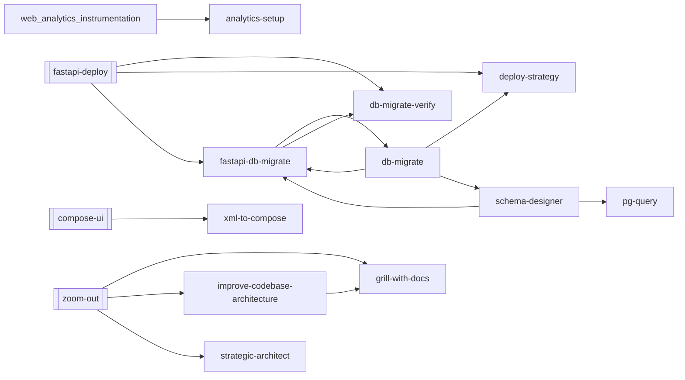

### analytics-setup

```mermaid
graph TD
    s1{{s1: Detect the Stack and Injection Strategy}}
    s2["s2: Confirm the GA4 Property + Measurement ID"]
    s1 --> s2
    s3["s3: Inject the GTM Container (head + body)"]
    s2 --> s3
    s4{{s4: Wire Explicit CTA & Affiliate Events}}
    s3 --> s4
    s4b{{s4b: Blanket Interaction Tracking (OPT-IN — 'every button & link')}}
    s4 --> s4b
    s5{{s5: Configure Google Consent Mode v2 Defaults}}
    s4b --> s5
    s6{{s6: VERIFY a Real Hit (do NOT skip)}}
    s5 --> s6
    playwright_ext([/playwright/])
    s6 -.-> playwright_ext
    verify_screenshots_ext([/verify-screenshots/])
    s6 -.-> verify_screenshots_ext
    s7{{s7: Record in the Analytics Inventory}}
    s6 --> s7
```

| Step | Title | Delegates To | Artifacts | Gates/Decisions |
|------|-------|-------------|-----------|----------------|
| 1 | Detect the Stack and Injection Strategy | — | — | gate |
| 2 | Confirm the GA4 Property + Measurement ID | — | — | decision |
| 3 | Inject the GTM Container (head + body) | — | — | — |
| 4 | Wire Explicit CTA & Affiliate Events | — | — | gate |
| 4b | Blanket Interaction Tracking (OPT-IN — 'every button & link') | — | — | gate |
| 5 | Configure Google Consent Mode v2 Defaults | — | — | gate |
| 6 | VERIFY a Real Hit (do NOT skip) | `/playwright`, `/verify-screenshots` | — | gate, decision |
| 7 | Record in the Analytics Inventory | — | — | gate |

### android-arch

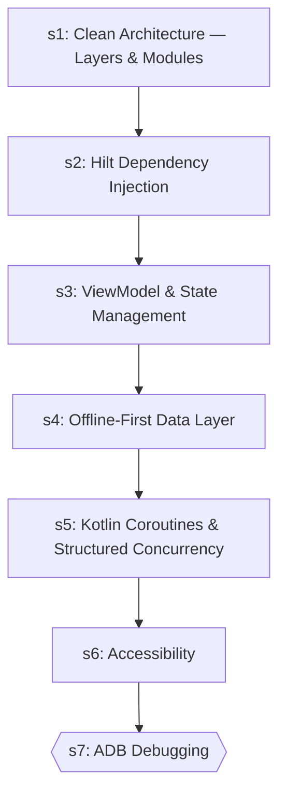

| Step | Title | Delegates To | Artifacts | Gates/Decisions |
|------|-------|-------------|-----------|----------------|
| 1 | Clean Architecture — Layers & Modules | — | — | — |
| 2 | Hilt Dependency Injection | — | — | — |
| 3 | ViewModel & State Management | — | — | — |
| 4 | Offline-First Data Layer | — | — | — |
| 5 | Kotlin Coroutines & Structured Concurrency | — | — | — |
| 6 | Accessibility | — | — | — |
| 7 | ADB Debugging | — | — | gate |

### android-gradle

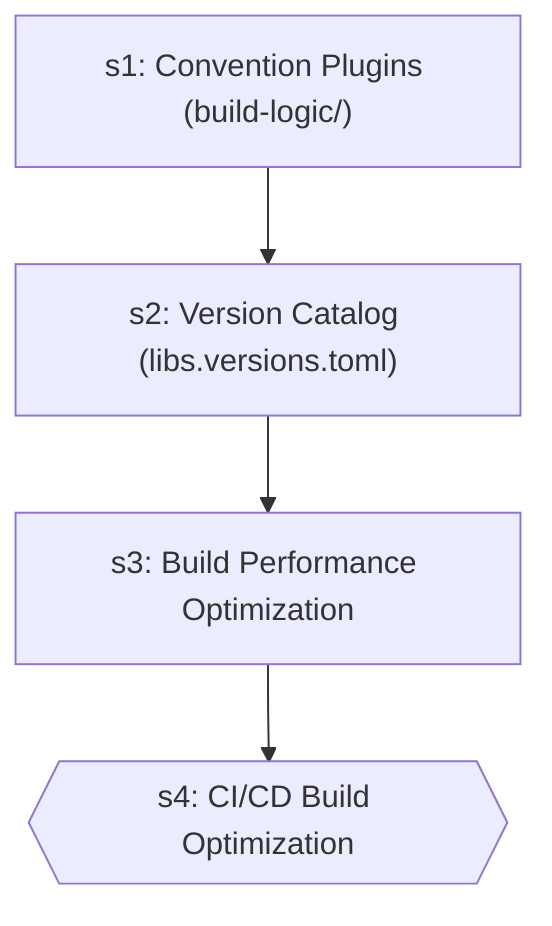

| Step | Title | Delegates To | Artifacts | Gates/Decisions |
|------|-------|-------------|-----------|----------------|
| 1 | Convention Plugins (build-logic/) | — | — | — |
| 2 | Version Catalog (libs.versions.toml) | — | — | — |
| 3 | Build Performance Optimization | — | — | — |
| 4 | CI/CD Build Optimization | — | — | gate |

### android-mvi-scaffold

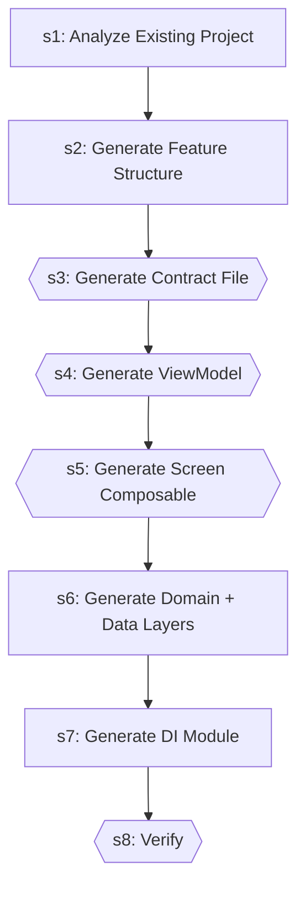

| Step | Title | Delegates To | Artifacts | Gates/Decisions |
|------|-------|-------------|-----------|----------------|
| 1 | Analyze Existing Project | — | — | decision |
| 2 | Generate Feature Structure | — | — | — |
| 3 | Generate Contract File | — | — | gate |
| 4 | Generate ViewModel | — | — | gate |
| 5 | Generate Screen Composable | — | — | gate |
| 6 | Generate Domain + Data Layers | — | — | — |
| 7 | Generate DI Module | — | — | — |
| 8 | Verify | — | — | gate |

### batch

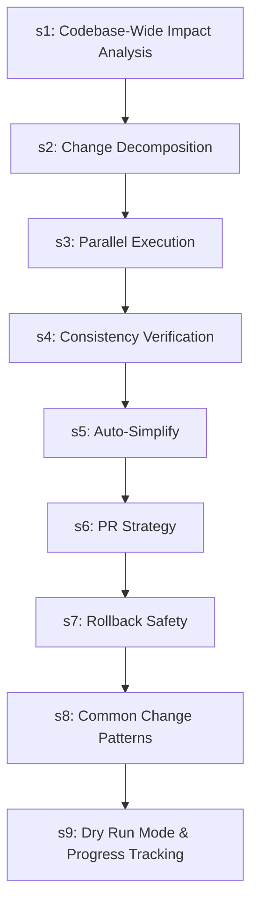

| Step | Title | Delegates To | Artifacts | Gates/Decisions |
|------|-------|-------------|-----------|----------------|
| 1 | Codebase-Wide Impact Analysis | — | — | — |
| 2 | Change Decomposition | — | — | — |
| 3 | Parallel Execution | — | — | — |
| 4 | Consistency Verification | — | — | — |
| 5 | Auto-Simplify | — | — | — |
| 6 | PR Strategy | — | — | — |
| 7 | Rollback Safety | — | — | — |
| 8 | Common Change Patterns | — | — | — |
| 9 | Dry Run Mode & Progress Tracking | — | — | — |

### compose-ui

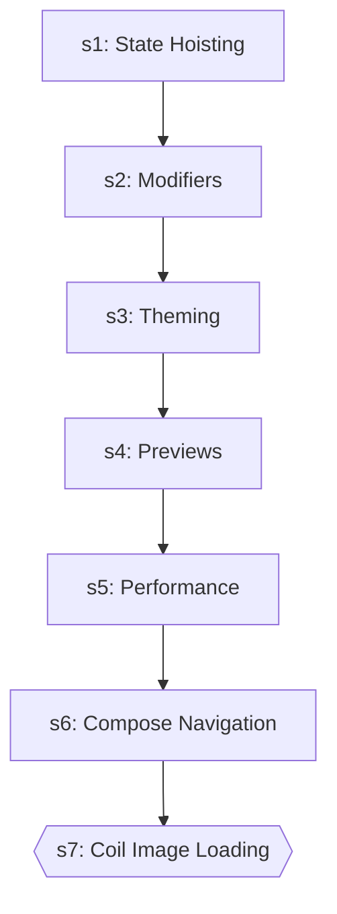

| Step | Title | Delegates To | Artifacts | Gates/Decisions |
|------|-------|-------------|-----------|----------------|
| 1 | State Hoisting | — | — | — |
| 2 | Modifiers | — | — | — |
| 3 | Theming | — | — | — |
| 4 | Previews | — | — | — |
| 5 | Performance | — | — | — |
| 6 | Compose Navigation | — | — | — |
| 7 | Coil Image Loading | — | — | gate |

### cross-platform-visual

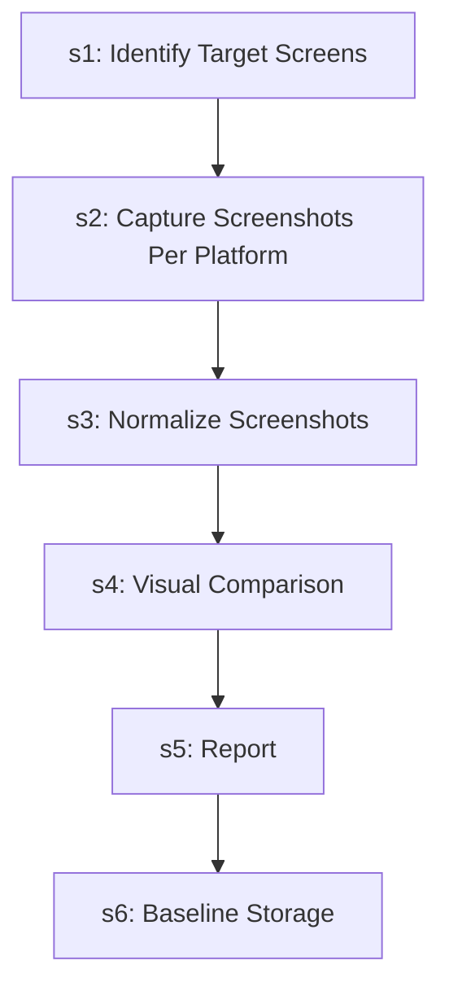

| Step | Title | Delegates To | Artifacts | Gates/Decisions |
|------|-------|-------------|-----------|----------------|
| 1 | Identify Target Screens | — | — | — |
| 2 | Capture Screenshots Per Platform | — | — | — |
| 3 | Normalize Screenshots | — | — | — |
| 4 | Visual Comparison | — | — | — |
| 5 | Report | — | — | — |
| 6 | Baseline Storage | — | — | — |

### d3-viz

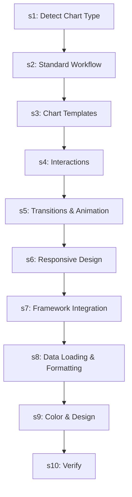

| Step | Title | Delegates To | Artifacts | Gates/Decisions |
|------|-------|-------------|-----------|----------------|
| 1 | Detect Chart Type | — | — | — |
| 2 | Standard Workflow | — | — | — |
| 3 | Chart Templates | — | — | — |
| 4 | Interactions | — | — | — |
| 5 | Transitions & Animation | — | — | — |
| 6 | Responsive Design | — | — | — |
| 7 | Framework Integration | — | — | — |
| 8 | Data Loading & Formatting | — | — | — |
| 9 | Color & Design | — | — | — |
| 10 | Verify | — | — | — |

### db-migrate

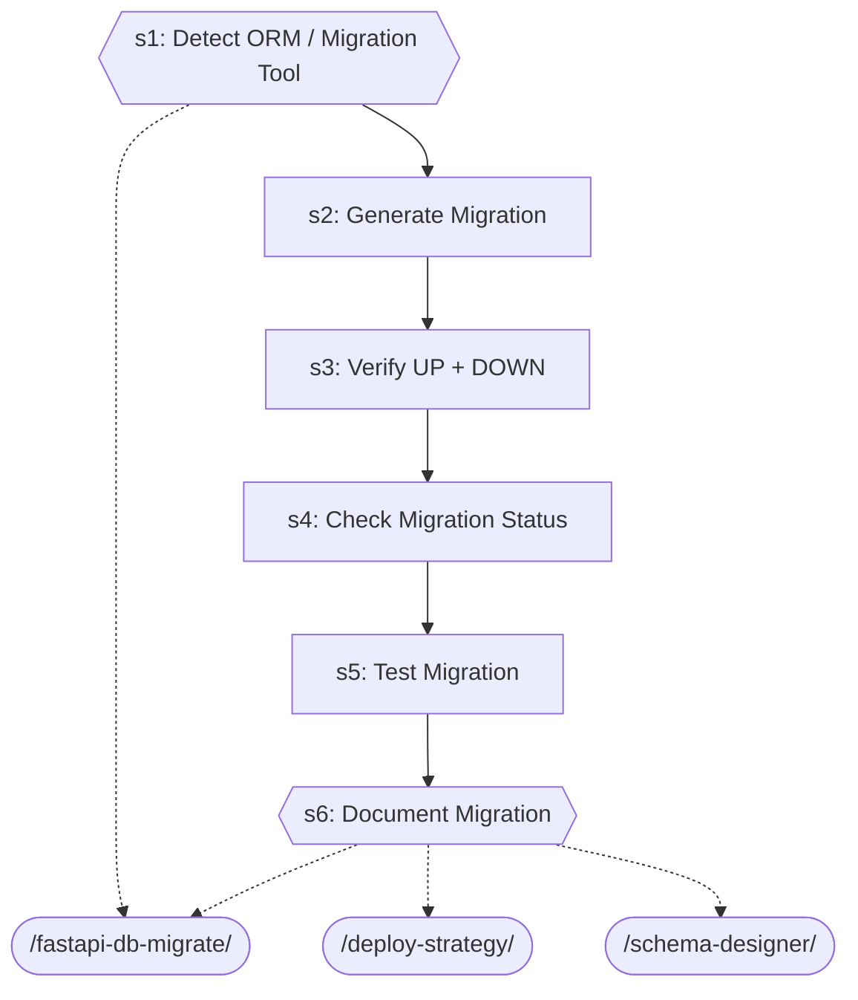

| Step | Title | Delegates To | Artifacts | Gates/Decisions |
|------|-------|-------------|-----------|----------------|
| 1 | Detect ORM / Migration Tool | `/fastapi-db-migrate` | — | gate |
| 2 | Generate Migration | — | — | decision |
| 3 | Verify UP + DOWN | — | — | decision |
| 4 | Check Migration Status | — | — | — |
| 5 | Test Migration | — | — | — |
| 6 | Document Migration | `/deploy-strategy`, `/fastapi-db-migrate`, `/schema-designer` | — | gate, decision |

### db-migrate-verify

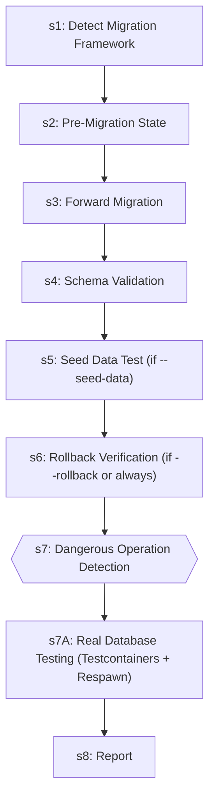

| Step | Title | Delegates To | Artifacts | Gates/Decisions |
|------|-------|-------------|-----------|----------------|
| 1 | Detect Migration Framework | — | — | — |
| 2 | Pre-Migration State | — | — | — |
| 3 | Forward Migration | — | — | — |
| 4 | Schema Validation | — | — | — |
| 5 | Seed Data Test (if --seed-data) | — | — | — |
| 6 | Rollback Verification (if --rollback or always) | — | — | — |
| 7 | Dangerous Operation Detection | — | — | gate, decision |
| 7A | Real Database Testing (Testcontainers + Respawn) | — | — | — |
| 8 | Report | — | — | decision |

### deploy-strategy

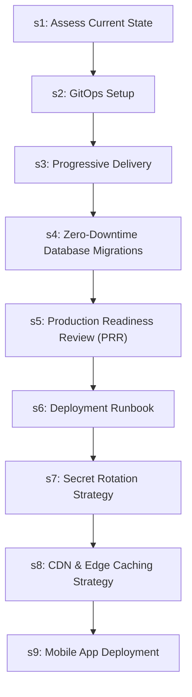

| Step | Title | Delegates To | Artifacts | Gates/Decisions |
|------|-------|-------------|-----------|----------------|
| 1 | Assess Current State | — | — | — |
| 2 | GitOps Setup | — | — | — |
| 3 | Progressive Delivery | — | — | — |
| 4 | Zero-Downtime Database Migrations | — | — | — |
| 5 | Production Readiness Review (PRR) | — | — | — |
| 6 | Deployment Runbook | — | — | — |
| 7 | Secret Rotation Strategy | — | — | — |
| 8 | CDN & Edge Caching Strategy | — | — | — |
| 9 | Mobile App Deployment | — | — | — |

### docker-optimize

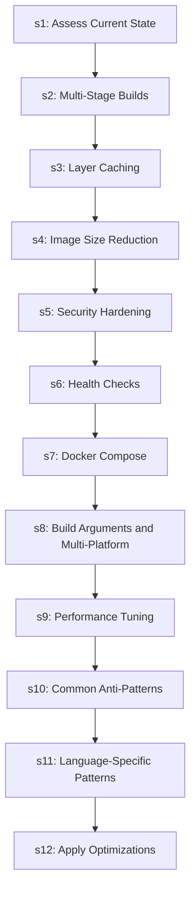

| Step | Title | Delegates To | Artifacts | Gates/Decisions |
|------|-------|-------------|-----------|----------------|
| 1 | Assess Current State | — | — | decision |
| 2 | Multi-Stage Builds | — | — | — |
| 3 | Layer Caching | — | — | — |
| 4 | Image Size Reduction | — | — | — |
| 5 | Security Hardening | — | — | — |
| 6 | Health Checks | — | — | — |
| 7 | Docker Compose | — | — | — |
| 8 | Build Arguments and Multi-Platform | — | — | — |
| 9 | Performance Tuning | — | — | — |
| 10 | Common Anti-Patterns | — | — | — |
| 11 | Language-Specific Patterns | — | — | — |
| 12 | Apply Optimizations | — | — | — |

### fastapi-db-migrate

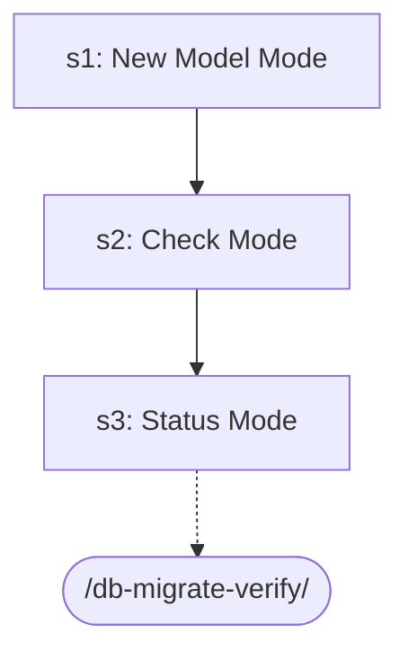

| Step | Title | Delegates To | Artifacts | Gates/Decisions |
|------|-------|-------------|-----------|----------------|
| 1 | New Model Mode | — | — | — |
| 2 | Check Mode | — | — | — |
| 3 | Status Mode | `/db-migrate-verify` | — | — |

### fastapi-deploy

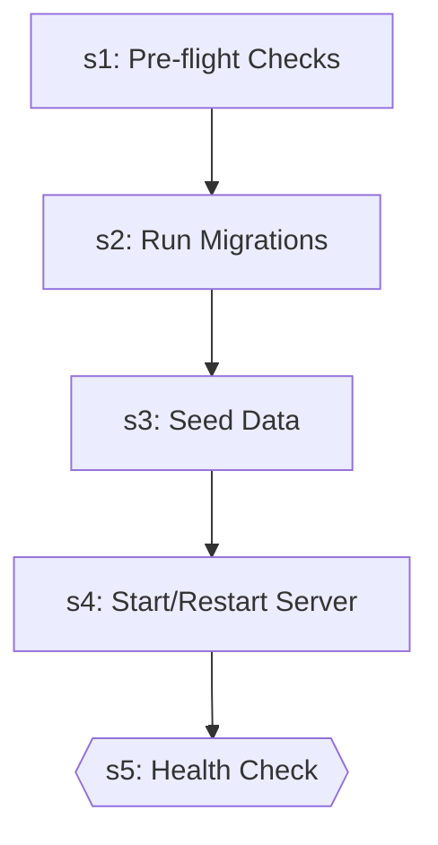

| Step | Title | Delegates To | Artifacts | Gates/Decisions |
|------|-------|-------------|-----------|----------------|
| 1 | Pre-flight Checks | — | — | decision |
| 2 | Run Migrations | — | — | decision |
| 3 | Seed Data | — | — | decision |
| 4 | Start/Restart Server | — | — | — |
| 5 | Health Check | — | — | gate |

### feature-flag

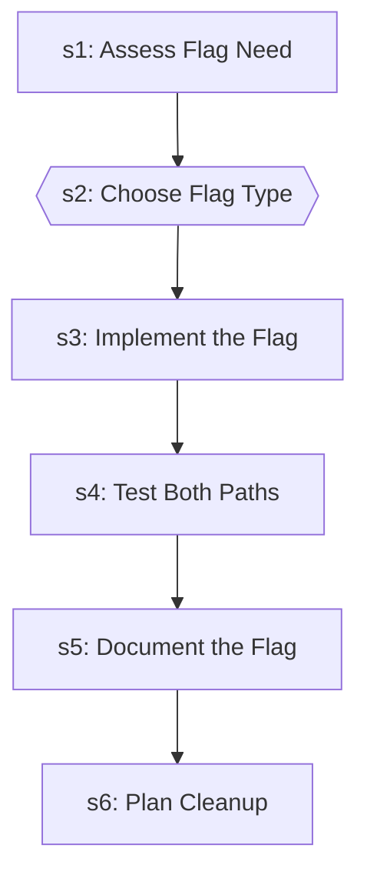

| Step | Title | Delegates To | Artifacts | Gates/Decisions |
|------|-------|-------------|-----------|----------------|
| 1 | Assess Flag Need | — | — | — |
| 2 | Choose Flag Type | — | — | gate |
| 3 | Implement the Flag | — | — | — |
| 4 | Test Both Paths | — | — | — |
| 5 | Document the Flag | — | — | — |
| 6 | Plan Cleanup | — | — | — |

### github

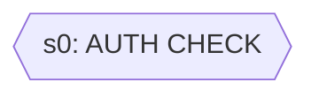

| Step | Title | Delegates To | Artifacts | Gates/Decisions |
|------|-------|-------------|-----------|----------------|
| 0 | AUTH CHECK | — | — | gate, decision |

### grill-with-docs

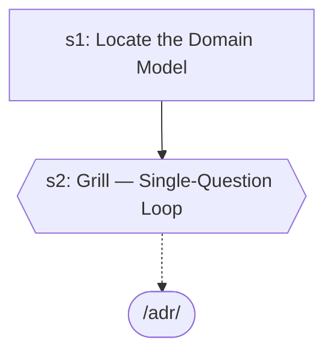

| Step | Title | Delegates To | Artifacts | Gates/Decisions |
|------|-------|-------------|-----------|----------------|
| 1 | Locate the Domain Model | — | — | decision |
| 2 | Grill — Single-Question Loop | `/adr` | — | gate, decision |

### html-prototype

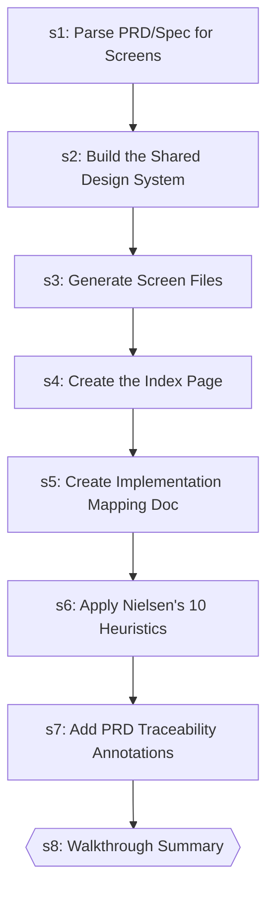

| Step | Title | Delegates To | Artifacts | Gates/Decisions |
|------|-------|-------------|-----------|----------------|
| 1 | Parse PRD/Spec for Screens | — | — | — |
| 2 | Build the Shared Design System | — | — | — |
| 3 | Generate Screen Files | — | — | — |
| 4 | Create the Index Page | — | — | — |
| 5 | Create Implementation Mapping Doc | — | — | — |
| 6 | Apply Nielsen's 10 Heuristics | — | — | decision |
| 7 | Add PRD Traceability Annotations | — | — | — |
| 8 | Walkthrough Summary | — | — | gate |

### improve-codebase-architecture

```mermaid
graph TD
    s1["s1: Explore"]
    grill_with_docs_ext([/grill-with-docs/])
    s1 -.-> grill_with_docs_ext
    s2["s2: Present Candidates as an HTML Report"]
    s1 --> s2
    tmp_ext([/tmp/])
    s2 -.-> tmp_ext
    s3["s3: Grilling Loop"]
    s2 --> s3
    adr_ext([/adr/])
    s3 -.-> adr_ext
    grill_me_ext([/grill-me/])
    s3 -.-> grill_me_ext
    grill_with_docs_ext([/grill-with-docs/])
    s3 -.-> grill_with_docs_ext
```

| Step | Title | Delegates To | Artifacts | Gates/Decisions |
|------|-------|-------------|-----------|----------------|
| 1 | Explore | `/grill-with-docs` | — | decision |
| 2 | Present Candidates as an HTML Report | `/tmp` | — | decision |
| 3 | Grilling Loop | `/adr`, `/grill-me`, `/grill-with-docs` | — | decision |

### monitoring-setup

```mermaid
graph TD
    s1["s1: Assess Current State"]
    s2["s2: Prometheus Metrics"]
    s1 --> s2
    s3["s3: Golden Signals"]
    s2 --> s3
    s4["s4: SLO/SLI Definition"]
    s3 --> s4
    s5["s5: Alerting Rules"]
    s4 --> s5
    s6["s6: Grafana Dashboards"]
    s5 --> s6
    s7["s7: Log Aggregation"]
    s6 --> s7
    s8["s8: Distributed Tracing"]
    s7 --> s8
    s9["s9: Application Instrumentation Patterns"]
    s8 --> s9
    s10["s10: Infrastructure Monitoring"]
    s9 --> s10
    s11["s11: Stack-Specific Dashboard Templates"]
    s10 --> s11
    s12["s12: Anti-Patterns to Avoid"]
    s11 --> s12
```

| Step | Title | Delegates To | Artifacts | Gates/Decisions |
|------|-------|-------------|-----------|----------------|
| 1 | Assess Current State | — | — | — |
| 2 | Prometheus Metrics | — | — | — |
| 3 | Golden Signals | — | — | — |
| 4 | SLO/SLI Definition | — | — | — |
| 5 | Alerting Rules | — | — | — |
| 6 | Grafana Dashboards | — | — | — |
| 7 | Log Aggregation | — | — | — |
| 8 | Distributed Tracing | — | — | — |
| 9 | Application Instrumentation Patterns | — | — | — |
| 10 | Infrastructure Monitoring | — | — | — |
| 11 | Stack-Specific Dashboard Templates | — | — | — |
| 12 | Anti-Patterns to Avoid | — | — | — |

### obsidian

```mermaid
graph TD
    s1["s1: Detect Action"]
    s2["s2: Locate Vault"]
    s1 --> s2
    s3["s3: Execute Action"]
    s2 --> s3
    s4["s4: Obsidian CLI Integration"]
    s3 --> s4
    s5["s5: Automation Hooks"]
    s4 --> s5
    s6{{s6: Verify & Report}}
    s5 --> s6
```

| Step | Title | Delegates To | Artifacts | Gates/Decisions |
|------|-------|-------------|-----------|----------------|
| 1 | Detect Action | — | — | — |
| 2 | Locate Vault | — | — | — |
| 3 | Execute Action | — | — | decision |
| 4 | Obsidian CLI Integration | — | — | — |
| 5 | Automation Hooks | — | — | — |
| 6 | Verify & Report | — | — | gate |

### remotion-video

```mermaid
graph TD
    s1["s1: Detect Action"]
    s2["s2: Project Setup"]
    s1 --> s2
    s3["s3: Core Patterns"]
    s2 --> s3
    s4["s4: Animation"]
    s3 --> s4
    s5["s5: Media"]
    s4 --> s5
    s6["s6: Advanced Features"]
    s5 --> s6
    s7["s7: Rendering"]
    s6 --> s7
    s8["s8: Fonts & Styling"]
    s7 --> s8
    s9["s9: Preview & Debug"]
    s8 --> s9
    s10["s10: Verify"]
    s9 --> s10
```

| Step | Title | Delegates To | Artifacts | Gates/Decisions |
|------|-------|-------------|-----------|----------------|
| 1 | Detect Action | — | — | — |
| 2 | Project Setup | — | — | — |
| 3 | Core Patterns | — | — | — |
| 4 | Animation | — | — | — |
| 5 | Media | — | — | — |
| 6 | Advanced Features | — | — | — |
| 7 | Rendering | — | — | — |
| 8 | Fonts & Styling | — | — | — |
| 9 | Preview & Debug | — | — | — |
| 10 | Verify | — | — | — |

### schema-designer

```mermaid
graph TD
    s1["s1: Gather Requirements"]
    s2["s2: Entity-Relationship Design"]
    s1 --> s2
    s3{{s3: Index Design}}
    s2 --> s3
    pg_query_ext([/pg-query/])
    s3 -.-> pg_query_ext
    s4["s4: Evolution Strategy"]
    s3 --> s4
    s5["s5: API Contract Alignment"]
    s4 --> s5
    s6["s6: Multi-Tenancy Design"]
    s5 --> s6
    s6b["s6b: Multi-Database Considerations"]
    s6 --> s6b
    s7{{s7: Output Artifacts}}
    s6b --> s7
    fastapi_db_migrate_ext([/fastapi-db-migrate/])
    s7 -.-> fastapi_db_migrate_ext
    s8{{s8: Review Checklist}}
    s7 --> s8
    pg_query_ext([/pg-query/])
    s8 -.-> pg_query_ext
```

| Step | Title | Delegates To | Artifacts | Gates/Decisions |
|------|-------|-------------|-----------|----------------|
| 1 | Gather Requirements | — | — | decision |
| 2 | Entity-Relationship Design | — | — | — |
| 3 | Index Design | `/pg-query` | — | gate |
| 4 | Evolution Strategy | — | — | — |
| 5 | API Contract Alignment | — | — | — |
| 6 | Multi-Tenancy Design | — | — | — |
| 6b | Multi-Database Considerations | — | — | — |
| 7 | Output Artifacts | `/fastapi-db-migrate` | — | gate, decision |
| 8 | Review Checklist | `/pg-query` | — | gate |

### strategic-architect

```mermaid
graph TD
    s1["s1: Diagnose Mode"]
    s2{{s2: Constraint Identification}}
    s1 --> s2
    s3["s3: Strategic Report"]
    s2 --> s3
    s4{{s4: Check-In Mode}}
    s3 --> s4
    s5["s5: Reassess Mode"]
    s4 --> s5
```

| Step | Title | Delegates To | Artifacts | Gates/Decisions |
|------|-------|-------------|-----------|----------------|
| 1 | Diagnose Mode | — | — | — |
| 2 | Constraint Identification | — | — | gate |
| 3 | Strategic Report | — | — | — |
| 4 | Check-In Mode | — | — | gate |
| 5 | Reassess Mode | — | — | — |

### twitter-x

```mermaid
graph TD
    s1["s1: Read Post"]
    s2["s2: Compose Tweet"]
    s1 --> s2
    s3["s3: Viral Potential Scoring"]
    s2 --> s3
    s4["s4: Search & Discover"]
    s3 --> s4
    s5["s5: Post & Engage"]
    s4 --> s5
    s6{{s6: Follower & Social Management}}
    s5 --> s6
    s7["s7: Account Health & Growth"]
    s6 --> s7
    s8["s8: Keyword Monitoring"]
    s7 --> s8
    s9["s9: Content Strategy & Planning"]
    s8 --> s9
```

| Step | Title | Delegates To | Artifacts | Gates/Decisions |
|------|-------|-------------|-----------|----------------|
| 1 | Read Post | — | — | — |
| 2 | Compose Tweet | — | — | — |
| 3 | Viral Potential Scoring | — | — | — |
| 4 | Search & Discover | — | — | — |
| 5 | Post & Engage | — | — | — |
| 6 | Follower & Social Management | — | — | gate |
| 7 | Account Health & Growth | — | — | — |
| 8 | Keyword Monitoring | — | — | — |
| 9 | Content Strategy & Planning | — | — | — |

### ui-ux-pro-max

```mermaid
graph TD
    s1["s1: Analyze User Requirements"]
    s2["s2: Generate Design System (REQUIRED)"]
    s1 --> s2
    s2b["s2b: Persist Design System (Master + Overrides Pattern)"]
    s2 --> s2b
    s3["s3: Supplement with Detailed Searches (as needed)"]
    s2b --> s3
    s4["s4: Stack Guidelines"]
    s3 --> s4
```

| Step | Title | Delegates To | Artifacts | Gates/Decisions |
|------|-------|-------------|-----------|----------------|
| 1 | Analyze User Requirements | — | — | — |
| 2 | Generate Design System (REQUIRED) | — | — | — |
| 2b | Persist Design System (Master + Overrides Pattern) | — | — | decision |
| 3 | Supplement with Detailed Searches (as needed) | — | — | — |
| 4 | Stack Guidelines | — | — | — |

### web-quality

```mermaid
graph TD
    s1["s1: Identify Audit Scope"]
    s2["s2: Core Web Vitals Audit"]
    s1 --> s2
    s3["s3: Accessibility Audit (WCAG 2.1 AA)"]
    s2 --> s3
    s4["s4: SEO Audit"]
    s3 --> s4
    s5["s5: Progressive Enhancement"]
    s4 --> s5
    s6["s6: Responsive Design Audit"]
    s5 --> s6
    s7["s7: Performance Budget Audit"]
    s6 --> s7
    s8{{s8: Run the Full Audit}}
    s7 --> s8
    s9{{s9: Generate Audit Report}}
    s8 --> s9
    s10{{s10: Common Anti-Patterns Reference}}
    s9 --> s10
```

| Step | Title | Delegates To | Artifacts | Gates/Decisions |
|------|-------|-------------|-----------|----------------|
| 1 | Identify Audit Scope | — | — | — |
| 2 | Core Web Vitals Audit | — | — | — |
| 3 | Accessibility Audit (WCAG 2.1 AA) | — | — | — |
| 4 | SEO Audit | — | — | — |
| 5 | Progressive Enhancement | — | — | — |
| 6 | Responsive Design Audit | — | — | — |
| 7 | Performance Budget Audit | — | — | — |
| 8 | Run the Full Audit | — | — | gate |
| 9 | Generate Audit Report | — | — | gate |
| 10 | Common Anti-Patterns Reference | — | — | gate |

### xml-to-compose

```mermaid
graph TD
    s1["s1: Analyze the XML Layout"]
    s2["s2: Plan the Migration"]
    s1 --> s2
    s3["s3: Convert Using Mapping Tables"]
    s2 --> s3
    s4["s4: Code Examples"]
    s3 --> s4
    s5["s5: Interop (Gradual Migration)"]
    s4 --> s5
    s6["s6: State Migration"]
    s5 --> s6
    s7{{s7: Verify}}
    s6 --> s7
```

| Step | Title | Delegates To | Artifacts | Gates/Decisions |
|------|-------|-------------|-----------|----------------|
| 1 | Analyze the XML Layout | — | — | — |
| 2 | Plan the Migration | — | — | — |
| 3 | Convert Using Mapping Tables | — | — | — |
| 4 | Code Examples | — | — | — |
| 5 | Interop (Gradual Migration) | — | — | — |
| 6 | State Migration | — | — | — |
| 7 | Verify | — | — | gate |


## Agents

| Agent | Description | Dispatched By |
|-------|-------------|---------------|
| `parallel-worktree-orchestrator-agent` | Use this agent to coordinate parallel workstreams using git worktrees. Splits... | — |

## Rules

| Rule | Description |
|------|-------------|
| `android` | Android development rules for Kotlin + Jetpack Compose projects. |
| `android-compose-ui` | Jetpack Compose UI patterns and conventions. |
| `android-kotlin` | Kotlin language idioms, null safety, scope functions, and KMP-specific patter... |
| `ba-discovery-checklist` |  |
| `bun-elysia` | Bun runtime and ElysiaJS framework patterns and conventions |
| `code-readability` |  |
| `cross-project-context-capture` |  |
| `design-principles` |  |
| `design-ssot` |  |
| `dod-verbs` |  |
| `environment-validation` |  |
| `error-handling` |  |
| `fastapi-backend` | FastAPI backend development rules and patterns. |
| `fastapi-database` | Database and migration rules for FastAPI + SQLAlchemy + Alembic. |
| `firebase` | Firebase Auth, Firestore, and backend token verification patterns. |
| `flutter` | Flutter/Dart development patterns and conventions. |
| `full-space-first` |  |
| `goal-anchored-decisions` |  |
| `human-approval-gates` |  |
| `notifier-integration` |  |
| `output-plausibility-verification` |  |
| `react-nextjs` | Next.js App Router and React Server Component patterns and conventions. |
| `vue` | Vue 3 Composition API patterns and conventions. |
| `web-analytics-instrumentation` | Web analytics instrumentation standard — every site ships GA4 (one property p... |

## Cross-Workflow Connections

**Outgoing** (this workflow feeds into):
- `adr` (skill)
- `grill-me` (skill)
- `playwright` (skill)
- `verify-screenshots` (skill)

**Incoming** (fed by):
- `ci-cd-setup` (skill)
- `engineering-roles` (rule)
- `fix-loop` (skill)
- `git-collaboration` (rule)
- `prompt-auto-enhance` (rule)
- `self-improve` (skill)
- `to-prd` (skill)
- `vps-deploy` (skill)

<!-- MANUAL ANNOTATIONS -->
<!-- Add custom notes below this line. They are preserved on regeneration. -->
