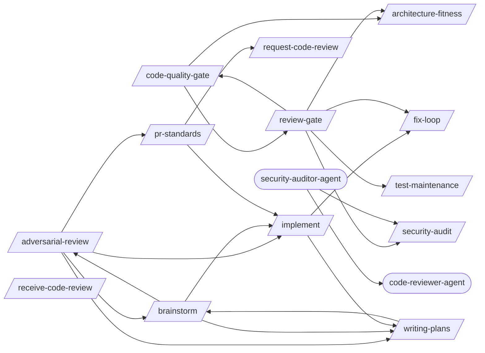

# Code Review

> Creating, requesting, and acting on code reviews.

> Auto-generated by `scripts/generate_workflow_docs.py` | Last updated: 2026-03-24 07:36 UTC

## Overview



## Detailed Flow

Step-level flow showing gates (diamonds), delegations (dashed), and artifacts (cylinders).

```mermaid
graph TD
    subgraph adversarial_review_sub["Adversarial Review"]
        adversarial_review_s0{{Step 0: Determine Review Mode and Gather Context}}
        brainstorm_ext([/brainstorm/])
        adversarial_review_s0 -.-> brainstorm_ext
        implement_ext([/implement/])
        adversarial_review_s0 -.-> implement_ext
        pr_standards_ext([/pr-standards/])
        adversarial_review_s0 -.-> pr_standards_ext
        writing_plans_ext([/writing-plans/])
        adversarial_review_s0 -.-> writing_plans_ext
        adversarial_review_s1["Step 1: Applicability Check"]
        adversarial_review_s0 --> adversarial_review_s1
        adversarial_review_s2["Step 2: Launch Adversarial Reviewer Subagent"]
        adversarial_review_s1 --> adversarial_review_s2
        adversarial_review_s3["Step 3: Round 1 — Reviewer Critique"]
        adversarial_review_s2 --> adversarial_review_s3
        adversarial_review_s4["Step 4: Round 2 — Author Response"]
        adversarial_review_s3 --> adversarial_review_s4
        adversarial_review_s5["Step 5: Round 2 — Reviewer Follow-Up"]
        adversarial_review_s4 --> adversarial_review_s5
        adversarial_review_s6["Step 6: Round 3 — Final Resolution (If Needed)"]
        adversarial_review_s5 --> adversarial_review_s6
        adversarial_review_s7["Step 7: Generate Review Report"]
        adversarial_review_s6 --> adversarial_review_s7
        adversarial_review_s8{{Step 8: Apply Final Fixes and Verify}}
        adversarial_review_s7 --> adversarial_review_s8
        adversarial_review_s8 -.-> brainstorm_ext
    end

    subgraph architecture_fitness_sub["Architecture Fitness"]
        architecture_fitness_s1["Step 1: Detect Architecture Style"]
        architecture_fitness_s2["Step 2: Dependency Direction Validation"]
        architecture_fitness_s1 --> architecture_fitness_s2
        architecture_fitness_s3["Step 3: Circular Dependency Detection"]
        architecture_fitness_s2 --> architecture_fitness_s3
        architecture_fitness_s4["Step 4: Coupling & Cohesion Metrics"]
        architecture_fitness_s3 --> architecture_fitness_s4
        architecture_fitness_s5["Step 5: Module Size & Boundary Analysis"]
        architecture_fitness_s4 --> architecture_fitness_s5
        architecture_fitness_s6{{Step 6: ADR Lifecycle Review}}
        architecture_fitness_s5 --> architecture_fitness_s6
        architecture_fitness_s7{{Step 7: Fitness Report}}
        architecture_fitness_s6 --> architecture_fitness_s7
    end

    subgraph brainstorm_sub["Brainstorm"]
        brainstorm_s1["Step 1: Understand Intent"]
        brainstorm_s2{{Step 2: Deep Research}}
        brainstorm_s1 --> brainstorm_s2
        brainstorm_s3["Step 3: Propose Approaches"]
        brainstorm_s2 --> brainstorm_s3
        brainstorm_s4["Step 4: Design in Sections"]
        brainstorm_s3 --> brainstorm_s4
        brainstorm_s5["Step 5: Write Spec Document"]
        brainstorm_s4 --> brainstorm_s5
        brainstorm_s6["Step 6: Handoff"]
        brainstorm_s5 --> brainstorm_s6
        adversarial_review_ext([/adversarial-review/])
        brainstorm_s6 -.-> adversarial_review_ext
        brainstorm_s6 -.-> implement_ext
        plan_to_issues_ext([/plan-to-issues/])
        brainstorm_s6 -.-> plan_to_issues_ext
        brainstorm_s6 -.-> writing_plans_ext
    end

    subgraph code_quality_gate_sub["Code Quality Gate"]
        code_quality_gate_s1["Step 1: Identify Changed Files"]
        code_quality_gate_s2{{Step 2: Cyclomatic Complexity}}
        code_quality_gate_s1 --> code_quality_gate_s2
        code_quality_gate_s3{{Step 3: Duplication Detection}}
        code_quality_gate_s2 --> code_quality_gate_s3
        code_quality_gate_s4["Step 4: SOLID Principles Checklist"]
        code_quality_gate_s3 --> code_quality_gate_s4
        code_quality_gate_s5{{Step 5: Clean Architecture Layer Validation}}
        code_quality_gate_s4 --> code_quality_gate_s5
        architecture_fitness_ext([/architecture-fitness/])
        code_quality_gate_s5 -.-> architecture_fitness_ext
        review_gate_ext([/review-gate/])
        code_quality_gate_s5 -.-> review_gate_ext
        code_quality_gate_s6["Step 6: Structured Logging Audit"]
        code_quality_gate_s5 --> code_quality_gate_s6
        code_quality_gate_s7{{Step 7: Error Handling Strategy Audit}}
        code_quality_gate_s6 --> code_quality_gate_s7
        code_quality_gate_s8{{Step 8: Coverage Diff Analysis}}
        code_quality_gate_s7 --> code_quality_gate_s8
        code_quality_gate_s9["Step 9: TDD Refactor Phase"]
        code_quality_gate_s8 --> code_quality_gate_s9
        code_quality_gate_s10{{Step 10: Dead Code Detection}}
        code_quality_gate_s9 --> code_quality_gate_s10
        code_quality_gate_s11{{Step 11: Quality Report}}
        code_quality_gate_s10 --> code_quality_gate_s11
        code_quality_gate_s12{{Step 12: Structured Output}}
        code_quality_gate_s11 --> code_quality_gate_s12
        code_quality_gate_test_results_code_quality_gate_json[("test-results/code-quality-gate.json")]
        code_quality_gate_s12 -->|writes| code_quality_gate_test_results_code_quality_gate_json
    end

    subgraph fix_loop_sub["Fix Loop"]
        fix_loop_s1{{Step 1: Analyze Failure (via test-failure-analyzer-agent)}}
        test_failure_analyzer_agent_ext((test-failure-analyzer-agent))
        fix_loop_s1 -.-> test_failure_analyzer_agent_ext
        fix_loop_s1A["Step 1A: Flaky Test Detection"]
        fix_loop_s1 --> fix_loop_s1A
        fix_loop_s2["Step 2: Apply Fix"]
        fix_loop_s1A --> fix_loop_s2
        fix_loop_s3["Step 3: Retest (Full Loop mode only)"]
        fix_loop_s2 --> fix_loop_s3
        fix_loop_s4["Step 4: Report"]
        fix_loop_s3 --> fix_loop_s4
        fix_loop_s5{{Step 5: Structured Output}}
        fix_loop_s4 --> fix_loop_s5
        fix_loop_test_results_fix_loop_json[("test-results/fix-loop.json")]
        fix_loop_s5 -->|writes| fix_loop_test_results_fix_loop_json
    end

    subgraph implement_sub["Implement"]
        implement_s1["Step 1: Analyze Requirements"]
        implement_s1 -.-> writing_plans_ext
        implement_s2["Step 2: Create/Update Tests"]
        implement_s1 --> implement_s2
        implement_s3["Step 3: Implement the Feature"]
        implement_s2 --> implement_s3
        implement_s4["Step 4: Run Tests"]
        implement_s3 --> implement_s4
        implement_s5{{Step 5: Fix Loop (if tests fail)}}
        implement_s4 --> implement_s5
        fix_loop_ext([/fix-loop/])
        implement_s5 -.-> fix_loop_ext
        implement_s6{{Step 6: Verification (Mandatory Gate)}}
        implement_s5 --> implement_s6
        post_fix_pipeline_ext([/post-fix-pipeline/])
        implement_s6 -.-> post_fix_pipeline_ext
        implement_s7["Step 7: Post-Implementation (Optional)"]
        implement_s6 --> implement_s7
        executing_plans_ext([/executing-plans/])
        implement_s7 -.-> executing_plans_ext
        implement_s8{{Step 8: Structured Output}}
        implement_s7 --> implement_s8
        implement_test_results_implement_json[("test-results/implement.json")]
        implement_s8 -->|writes| implement_test_results_implement_json
    end

    subgraph pr_standards_sub["Pr Standards"]
        pr_standards_s0["Step 0: Parse Arguments and Determine Mode"]
        pr_standards_s1["Step 1: Extract and Parse the PR Diff"]
        pr_standards_s0 --> pr_standards_s1
        pr_standards_s2{{Step 2: Load Standards and Rules}}
        pr_standards_s1 --> pr_standards_s2
        pr_standards_s3["Step 3: Built-in Default Rules"]
        pr_standards_s2 --> pr_standards_s3
        pr_standards_s4{{Step 4: Run Standards Engine}}
        pr_standards_s3 --> pr_standards_s4
        pr_standards_s5["Step 5: Classify Violations by Severity"]
        pr_standards_s4 --> pr_standards_s5
        pr_standards_s6["Step 6: Generate Auto-Fixes"]
        pr_standards_s5 --> pr_standards_s6
        pr_standards_s7["Step 7: Generate Standards Report"]
        pr_standards_s6 --> pr_standards_s7
        pr_standards_s8["Step 8: Diff-Aware Analysis Patterns"]
        pr_standards_s7 --> pr_standards_s8
        pr_standards_s9["Step 9: Pipeline Integration"]
        pr_standards_s8 --> pr_standards_s9
        pr_standards_s10{{Step 10: Team Standards Evolution}}
        pr_standards_s9 --> pr_standards_s10
        pr_standards_s10 -.-> implement_ext
        request_code_review_ext([/request-code-review/])
        pr_standards_s10 -.-> request_code_review_ext
    end

    subgraph receive_code_review_sub["Receive Code Review"]
        receive_code_review_s0{{Step 0: Fetch Review Comments}}
        receive_code_review_s1{{Step 1: Triage Comments}}
        receive_code_review_s0 --> receive_code_review_s1
        receive_code_review_s2{{Step 2: Address Must-Fix Comments (P0)}}
        receive_code_review_s1 --> receive_code_review_s2
        receive_code_review_s3["Step 3: Evaluate Suggestions (P1)"]
        receive_code_review_s2 --> receive_code_review_s3
        receive_code_review_s4["Step 4: Answer Questions (P2)"]
        receive_code_review_s3 --> receive_code_review_s4
        receive_code_review_s5["Step 5: Batch Nits (P3)"]
        receive_code_review_s4 --> receive_code_review_s5
        receive_code_review_s6["Step 6: Handle Disagreements"]
        receive_code_review_s5 --> receive_code_review_s6
        receive_code_review_s7{{Step 7: Multi-Reviewer Coordination}}
        receive_code_review_s6 --> receive_code_review_s7
        receive_code_review_s8["Step 8: Review Thread Resolution"]
        receive_code_review_s7 --> receive_code_review_s8
        receive_code_review_s9["Step 9: Generate Re-Review Summary"]
        receive_code_review_s8 --> receive_code_review_s9
        receive_code_review_s10["Step 10: Review Iteration Protocol"]
        receive_code_review_s9 --> receive_code_review_s10
        receive_code_review_s11{{Step 11: Learning Extraction}}
        receive_code_review_s10 --> receive_code_review_s11
    end

    subgraph request_code_review_sub["Request Code Review"]
        request_code_review_s1["Step 1: Assess the Change Set"]
        request_code_review_s2["Step 2: Classify Changes by Risk Level"]
        request_code_review_s1 --> request_code_review_s2
        request_code_review_s3["Step 3: Detect Breaking Changes"]
        request_code_review_s2 --> request_code_review_s3
        request_code_review_s4["Step 4: Annotate Diff with Intent"]
        request_code_review_s3 --> request_code_review_s4
        request_code_review_s5["Step 5: Generate Review Questions"]
        request_code_review_s4 --> request_code_review_s5
        request_code_review_s6["Step 6: Pre-Review Self-Check"]
        request_code_review_s5 --> request_code_review_s6
        request_code_review_s7["Step 7: Suggest Reviewers"]
        request_code_review_s6 --> request_code_review_s7
        request_code_review_s8["Step 8: Generate PR Description"]
        request_code_review_s7 --> request_code_review_s8
        request_code_review_s9["Step 9: Create the Pull Request"]
        request_code_review_s8 --> request_code_review_s9
        request_code_review_s10{{Step 10: Dependency and Impact Analysis}}
        request_code_review_s9 --> request_code_review_s10
    end

    subgraph review_gate_sub["Review Gate"]
        review_gate_s0{{Step 0: Parse Arguments and Gather Context}}
        review_gate_s1{{Step 1: Batch A — Code Quality + Architecture (Parallel)}}
        review_gate_s0 --> review_gate_s1
        review_gate_s1 -.-> fix_loop_ext
        review_gate_s2{{Step 2: Batch B — Security + Risk Scoring (Parallel)}}
        review_gate_s1 --> review_gate_s2
        review_gate_s3["Step 3: Batch C — Adversarial Review → PR Standards (Sequential)"]
        review_gate_s2 --> review_gate_s3
        review_gate_s4{{Step 4: Fix Loop (Conditional)}}
        review_gate_s3 --> review_gate_s4
        review_gate_s5{{Step 5: Generate Consolidated Review Report}}
        review_gate_s4 --> review_gate_s5
        review_gate_test_results_review_gate_json[("test-results/review-gate.json")]
        review_gate_s5 -->|writes| review_gate_test_results_review_gate_json
        review_gate_s6{{Step 6: PR Creation (Conditional)}}
        review_gate_s5 --> review_gate_s6
        review_gate_s6 -->|writes| review_gate_test_results_review_gate_json
        review_gate_s7{{Step 7: Post-Review Feedback Loop (Conditional)}}
        review_gate_s6 --> review_gate_s7
        test_maintenance_ext([/test-maintenance/])
        review_gate_s7 -.-> test_maintenance_ext
        review_gate_s7 -->|writes| review_gate_test_results_review_gate_json
    end

    subgraph security_audit_sub["Security Audit"]
        security_audit_s1["Step 1: Reconnaissance"]
        security_audit_s2["Step 2: Static Analysis"]
        security_audit_s1 --> security_audit_s2
        security_audit_s3["Step 3: Variant Analysis"]
        security_audit_s2 --> security_audit_s3
        security_audit_s4["Step 4: Differential Security Review"]
        security_audit_s3 --> security_audit_s4
        security_audit_s5["Step 5: Insecure Defaults Detection"]
        security_audit_s4 --> security_audit_s5
        security_audit_s6{{Step 6: GitHub Actions Security}}
        security_audit_s5 --> security_audit_s6
        security_audit_s7{{Step 7: False-Positive Gating}}
        security_audit_s6 --> security_audit_s7
        security_audit_s8["Step 8: OWASP Top 10 Checklist"]
        security_audit_s7 --> security_audit_s8
        security_audit_s9{{Step 9: Compliance Testing (GDPR / SOC2 / HIPAA)}}
        security_audit_s8 --> security_audit_s9
    end

    subgraph test_maintenance_sub["Test Maintenance"]
        test_maintenance_s1["Step 1: Audit Test Suite"]
        test_maintenance_s2["Step 2: Find Dead Tests"]
        test_maintenance_s1 --> test_maintenance_s2
        test_maintenance_s3["Step 3: Detect Duplicates"]
        test_maintenance_s2 --> test_maintenance_s3
        test_maintenance_s4["Step 4: Identify Slow Tests"]
        test_maintenance_s3 --> test_maintenance_s4
        test_maintenance_s5["Step 5: Improve Readability"]
        test_maintenance_s4 --> test_maintenance_s5
        test_maintenance_s6["Step 6: Optimize Execution"]
        test_maintenance_s5 --> test_maintenance_s6
        test_maintenance_s7["Step 7: Report"]
        test_maintenance_s6 --> test_maintenance_s7
        test_maintenance_s8{{Step 8: Quarantine Age Audit}}
        test_maintenance_s7 --> test_maintenance_s8
    end

    subgraph writing_plans_sub["Writing Plans"]
        writing_plans_s1["Step 1: Understand Scope"]
        writing_plans_s1 -.-> brainstorm_ext
        writing_plans_s2{{Step 2: Decompose into Tasks}}
        writing_plans_s1 --> writing_plans_s2
        writing_plans_s3["Step 3: Add Dependency Graph"]
        writing_plans_s2 --> writing_plans_s3
        writing_plans_s4["Step 4: Review Plan Quality"]
        writing_plans_s3 --> writing_plans_s4
        writing_plans_s5["Step 5: Present for Approval"]
        writing_plans_s4 --> writing_plans_s5
        writing_plans_s6{{Step 6: Save Plan and Companion Files}}
        writing_plans_s5 --> writing_plans_s6
        writing_plans_s7["Step 7: Suggest Next Steps"]
        writing_plans_s6 --> writing_plans_s7
        writing_plans_s7 -.-> plan_to_issues_ext
    end

    adversarial_review_s0 ==> brainstorm_s1
    adversarial_review_s0 ==> implement_s1
    adversarial_review_s0 ==> pr_standards_s0
    adversarial_review_s0 ==> writing_plans_s1
    brainstorm_s6 ==> adversarial_review_s0
    brainstorm_s6 ==> implement_s1
    brainstorm_s6 ==> writing_plans_s1
    code_quality_gate_s5 ==> architecture_fitness_s1
    code_quality_gate_s5 ==> review_gate_s0
    implement_s5 ==> fix_loop_s1
    implement_s1 ==> writing_plans_s1
    pr_standards_s10 ==> implement_s1
    pr_standards_s10 ==> request_code_review_s1
    review_gate_s1 ==> fix_loop_s1
    review_gate_s7 ==> test_maintenance_s1
    writing_plans_s1 ==> brainstorm_s1
```

## Skills

| Skill | Version | Description | Calls | Called By |
|-------|---------|-------------|-------|----------|
| `/adversarial-review` | 1.0.0 | Launch a structured adversarial review using a subagent with a dedicated revi... | `/brainstorm`, `/implement`, `/pr-standards`, `/writing-plans` | `/brainstorm` |
| `/architecture-fitness` | 1.0.0 | Validate architecture conformance including dependency direction, circular de... | — | `/code-quality-gate`, `/review-gate` |
| `/brainstorm` | 1.0.0 | Explore intent through Socratic questioning, propose approaches with trade-of... | `/adversarial-review`, `/implement`, `/writing-plans` | `/adversarial-review`, `/writing-plans` |
| `/code-quality-gate` | 1.2.0 | Enforce code quality standards including cyclomatic complexity, duplication d... | `/architecture-fitness`, `/review-gate` | `/review-gate` |
| `/fix-loop` | 1.2.0 | Analyze failures and iteratively apply minimal fixes, optionally retesting un... | — | `/implement`, `/review-gate` |
| `/implement` | 1.0.0 | Implement a feature or fix following a structured workflow: requirements anal... | `/fix-loop`, `/writing-plans` | `/adversarial-review`, `/brainstorm`, `/pr-standards` |
| `/pr-standards` | 1.0.0 | Enforce team standards against PR diffs by extracting changed lines, checking... | `/implement`, `/request-code-review` | `/adversarial-review` |
| `/receive-code-review` | 1.0.0 | Apply code review feedback by fetching PR comments, categorizing by severity,... | — | — |
| `/request-code-review` | 1.0.0 | Create high-quality, review-optimized pull requests that surface risks, gener... | — | `/pr-standards` |
| `/review-gate` | 2.3.0 | Orchestrate all review sub-skills (code-quality-gate, architecture-fitness, s... | `/architecture-fitness`, `/code-quality-gate`, `/fix-loop`, `/security-audit`, `/test-maintenance` | `/code-quality-gate` |
| `/security-audit` | 1.0.0 | Run security audits covering static analysis with CodeQL and Semgrep, SARIF t... | — | `/review-gate`, `/security-auditor-agent` |
| `/test-maintenance` | 1.2.0 | Audit and optimize test suites by identifying dead tests, duplicates, slow te... | — | `/review-gate` |
| `/writing-plans` | 1.0.0 | Generate detailed implementation plans with bite-sized tasks, exact file path... | `/brainstorm` | `/adversarial-review`, `/brainstorm`, `/implement` |

## Agents

| Agent | Description | Dispatched By |
|-------|-------------|---------------|
| `code-reviewer-agent` | A senior software engineer specializing in comprehensive code quality assessm... | `/security-auditor-agent` |
| `security-auditor-agent` | Use this agent for dedicated security assessments — OWASP Top 10 scanning, th... | — |

## Cross-Workflow Connections

**Outgoing** (this workflow feeds into):
- `contract-test` (skill)
- `db-migrate-verify` (skill)
- `executing-plans` (skill)
- `learn-n-improve` (skill)
- `plan-to-issues` (skill)
- `post-fix-pipeline` (skill)
- `test-failure-analyzer-agent` (agent)
- `verify-screenshots` (skill)

**Incoming** (fed by):
- `android-run-e2e` (skill)
- `android-run-tests` (skill)
- `anthropic-agent-orchestration-guide` (skill)
- `auto-verify` (skill)
- `bun-elysia-test` (skill)
- `claude-behavior` (rule)
- `executing-plans` (skill)
- `fastapi-run-backend-tests` (skill)
- `firebase-test` (skill)
- `fix-issue` (skill)
- `flutter-e2e-test` (skill)
- `pattern-self-containment` (rule)
- `prd-parser` (skill)
- `project-manager-agent` (agent)
- `project-scaffold` (skill)
- `skill-factory` (skill)
- `skill-master` (skill)
- `tdd` (skill)
- `tdd-rule` (rule)
- `test-failure-analyzer-agent` (agent)
- `tester-agent` (agent)

<!-- MANUAL ANNOTATIONS -->
<!-- Add custom notes below this line. They are preserved on regeneration. -->
