# Code Review

> Creating, requesting, and acting on code reviews.

> Auto-generated by `scripts/generate_workflow_docs.py` | Last updated: 2026-04-24 20:06 UTC

## Overview

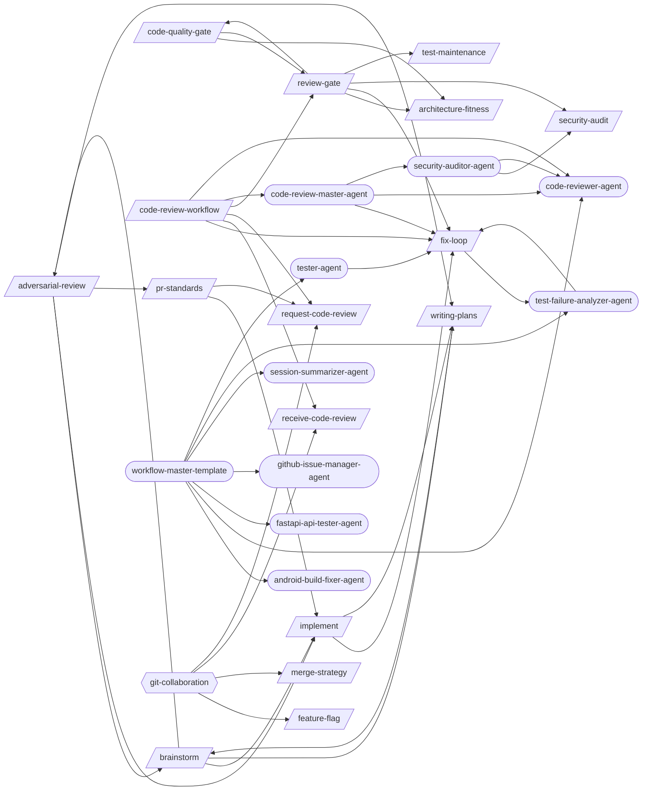

## Detailed Flow

Step-level flow showing gates (diamonds), delegations (dashed), and artifacts (cylinders).

```mermaid
graph TD
    subgraph adversarial_review_sub["Adversarial Review"]
        adversarial_review_s0{{Step 0: Determine Review Mode and Gather Context}}
        brainstorm_ext([/brainstorm/])
        adversarial_review_s0 -.-> brainstorm_ext
        implement_ext([/implement/])
        adversarial_review_s0 -.-> implement_ext
        pr_standards_ext([/pr-standards/])
        adversarial_review_s0 -.-> pr_standards_ext
        writing_plans_ext([/writing-plans/])
        adversarial_review_s0 -.-> writing_plans_ext
        adversarial_review_s1["Step 1: Applicability Check"]
        adversarial_review_s0 --> adversarial_review_s1
        adversarial_review_s2["Step 2: Launch Adversarial Reviewer Subagent"]
        adversarial_review_s1 --> adversarial_review_s2
        adversarial_review_s3["Step 3: Round 1 — Reviewer Critique"]
        adversarial_review_s2 --> adversarial_review_s3
        adversarial_review_s4["Step 4: Round 2 — Author Response"]
        adversarial_review_s3 --> adversarial_review_s4
        adversarial_review_s5["Step 5: Round 2 — Reviewer Follow-Up"]
        adversarial_review_s4 --> adversarial_review_s5
        adversarial_review_s6["Step 6: Round 3 — Final Resolution (If Needed)"]
        adversarial_review_s5 --> adversarial_review_s6
        adversarial_review_s7["Step 7: Generate Review Report"]
        adversarial_review_s6 --> adversarial_review_s7
        adversarial_review_s8{{Step 8: Apply Final Fixes and Verify}}
        adversarial_review_s7 --> adversarial_review_s8
        adversarial_review_s8 -.-> brainstorm_ext
    end

    subgraph architecture_fitness_sub["Architecture Fitness"]
        architecture_fitness_s1["Step 1: Detect Architecture Style"]
        architecture_fitness_s2["Step 2: Dependency Direction Validation"]
        architecture_fitness_s1 --> architecture_fitness_s2
        architecture_fitness_s3["Step 3: Circular Dependency Detection"]
        architecture_fitness_s2 --> architecture_fitness_s3
        architecture_fitness_s4["Step 4: Coupling & Cohesion Metrics"]
        architecture_fitness_s3 --> architecture_fitness_s4
        architecture_fitness_s5["Step 5: Module Size & Boundary Analysis"]
        architecture_fitness_s4 --> architecture_fitness_s5
        architecture_fitness_s6{{Step 6: ADR Lifecycle Review}}
        architecture_fitness_s5 --> architecture_fitness_s6
        architecture_fitness_s7{{Step 7: Fitness Report}}
        architecture_fitness_s6 --> architecture_fitness_s7
    end

    subgraph brainstorm_sub["Brainstorm"]
        brainstorm_s1["Step 1: Understand Intent"]
        brainstorm_s2{{Step 2: Deep Research}}
        brainstorm_s1 --> brainstorm_s2
        brainstorm_s3["Step 3: Propose Approaches"]
        brainstorm_s2 --> brainstorm_s3
        brainstorm_s4["Step 4: Design in Sections"]
        brainstorm_s3 --> brainstorm_s4
        brainstorm_s5["Step 5: Write Spec Document"]
        brainstorm_s4 --> brainstorm_s5
        brainstorm_s6["Step 6: Handoff"]
        brainstorm_s5 --> brainstorm_s6
        adversarial_review_ext([/adversarial-review/])
        brainstorm_s6 -.-> adversarial_review_ext
        brainstorm_s6 -.-> implement_ext
        plan_to_issues_ext([/plan-to-issues/])
        brainstorm_s6 -.-> plan_to_issues_ext
        brainstorm_s6 -.-> writing_plans_ext
    end

    subgraph code_quality_gate_sub["Code Quality Gate"]
        code_quality_gate_s1["Step 1: Identify Changed Files"]
        code_quality_gate_s2{{Step 2: Cyclomatic Complexity}}
        code_quality_gate_s1 --> code_quality_gate_s2
        code_quality_gate_s3{{Step 3: Duplication Detection}}
        code_quality_gate_s2 --> code_quality_gate_s3
        code_quality_gate_s4["Step 4: SOLID Principles Checklist"]
        code_quality_gate_s3 --> code_quality_gate_s4
        code_quality_gate_s5{{Step 5: Clean Architecture Layer Validation}}
        code_quality_gate_s4 --> code_quality_gate_s5
        architecture_fitness_ext([/architecture-fitness/])
        code_quality_gate_s5 -.-> architecture_fitness_ext
        review_gate_ext([/review-gate/])
        code_quality_gate_s5 -.-> review_gate_ext
        code_quality_gate_s6["Step 6: Structured Logging Audit"]
        code_quality_gate_s5 --> code_quality_gate_s6
        code_quality_gate_s7{{Step 7: Error Handling Strategy Audit}}
        code_quality_gate_s6 --> code_quality_gate_s7
        code_quality_gate_s8{{Step 8: Coverage Diff Analysis}}
        code_quality_gate_s7 --> code_quality_gate_s8
        code_quality_gate_s9["Step 9: TDD Refactor Phase"]
        code_quality_gate_s8 --> code_quality_gate_s9
        code_quality_gate_s10{{Step 10: Dead Code Detection}}
        code_quality_gate_s9 --> code_quality_gate_s10
        code_quality_gate_s11{{Step 11: Quality Report}}
        code_quality_gate_s10 --> code_quality_gate_s11
        code_quality_gate_s12{{Step 12: Structured Output}}
        code_quality_gate_s11 --> code_quality_gate_s12
        code_quality_gate_test_results_code_quality_gate_json[("test-results/code-quality-gate.json")]
        code_quality_gate_s12 -->|writes| code_quality_gate_test_results_code_quality_gate_json
    end

    subgraph code_review_workflow_sub["Code Review Workflow"]
        code_review_workflow_s1{{Step 1: INIT}}
        code_review_workflow_s2{{Step 2: QUALITY_GATES}}
        code_review_workflow_s1 --> code_review_workflow_s2
        fix_loop_ext([/fix-loop/])
        code_review_workflow_s2 -.-> fix_loop_ext
        code_review_workflow_s2 -.-> review_gate_ext
        code_review_workflow_test_results_review_gate_json[("test-results/review-gate.json")]
        code_review_workflow_s2 -->|writes| code_review_workflow_test_results_review_gate_json
        code_review_workflow_s2b{{Step 2b: DEEP_AUDIT (optional, --deep-audit flag)}}
        code_review_workflow_s2 --> code_review_workflow_s2b
        code_review_workflow_s3["Step 3: CREATE_PR"]
        code_review_workflow_s2b --> code_review_workflow_s3
        request_code_review_ext([/request-code-review/])
        code_review_workflow_s3 -.-> request_code_review_ext
        code_review_workflow_s4{{Step 4: HANDLE_FEEDBACK}}
        code_review_workflow_s3 --> code_review_workflow_s4
        receive_code_review_ext([/receive-code-review/])
        code_review_workflow_s4 -.-> receive_code_review_ext
        code_review_workflow_s5{{Step 5: REPORT}}
        code_review_workflow_s4 --> code_review_workflow_s5
        code_review_master_agent_ext((code-review-master-agent))
        code_review_workflow_s5 -.-> code_review_master_agent_ext
        code_review_workflow_test_results_code_review_verdict_json[("test-results/code-review-verdict.json")]
        code_review_workflow_s5 -->|writes| code_review_workflow_test_results_code_review_verdict_json
    end

    subgraph feature_flag_sub["Feature Flag"]
        feature_flag_s1["Step 1: Assess Flag Need"]
        feature_flag_s2{{Step 2: Choose Flag Type}}
        feature_flag_s1 --> feature_flag_s2
        feature_flag_s3["Step 3: Implement the Flag"]
        feature_flag_s2 --> feature_flag_s3
        feature_flag_s4["Step 4: Test Both Paths"]
        feature_flag_s3 --> feature_flag_s4
        feature_flag_s5["Step 5: Document the Flag"]
        feature_flag_s4 --> feature_flag_s5
        feature_flag_s6["Step 6: Plan Cleanup"]
        feature_flag_s5 --> feature_flag_s6
    end

    subgraph fix_loop_sub["Fix Loop"]
        fix_loop_s1{{Step 1: Analyze Failure (via test-failure-analyzer-agent)}}
        test_failure_analyzer_agent_ext((test-failure-analyzer-agent))
        fix_loop_s1 -.-> test_failure_analyzer_agent_ext
        fix_loop_s1A["Step 1A: Flaky Test Detection"]
        fix_loop_s1 --> fix_loop_s1A
        fix_loop_s2["Step 2: Apply Fix"]
        fix_loop_s1A --> fix_loop_s2
        fix_loop_s3["Step 3: Retest (Full Loop mode only)"]
        fix_loop_s2 --> fix_loop_s3
        fix_loop_s4["Step 4: Report"]
        fix_loop_s3 --> fix_loop_s4
        fix_loop_s5{{Step 5: Structured Output}}
        fix_loop_s4 --> fix_loop_s5
        fix_loop_test_results_fix_loop_json[("test-results/fix-loop.json")]
        fix_loop_s5 -->|writes| fix_loop_test_results_fix_loop_json
    end

    subgraph implement_sub["Implement"]
        implement_s1["Step 1: Analyze Requirements"]
        implement_s1 -.-> writing_plans_ext
        implement_s2["Step 2: Create/Update Tests"]
        implement_s1 --> implement_s2
        implement_s3["Step 3: Implement the Feature"]
        implement_s2 --> implement_s3
        implement_s4["Step 4: Run Tests"]
        implement_s3 --> implement_s4
        implement_s5{{Step 5: Fix Loop (if tests fail)}}
        implement_s4 --> implement_s5
        implement_s5 -.-> fix_loop_ext
        implement_s6{{Step 6: Verification (Mandatory Gate)}}
        implement_s5 --> implement_s6
        post_fix_pipeline_ext([/post-fix-pipeline/])
        implement_s6 -.-> post_fix_pipeline_ext
        implement_s7["Step 7: Post-Implementation (Optional)"]
        implement_s6 --> implement_s7
        executing_plans_ext([/executing-plans/])
        implement_s7 -.-> executing_plans_ext
        implement_s8{{Step 8: Structured Output}}
        implement_s7 --> implement_s8
        implement_s8 -.-> fix_loop_ext
        implement_test_results_implement_json[("test-results/implement.json")]
        implement_s8 -->|writes| implement_test_results_implement_json
    end

    subgraph mcp_server_builder_sub["Mcp Server Builder"]
        mcp_server_builder_s1["Step 1: Define the Server Scope"]
        mcp_server_builder_s2["Step 2: Choose SDK and Scaffold"]
        mcp_server_builder_s1 --> mcp_server_builder_s2
        mcp_server_builder_s3["Step 3: Implement Tools"]
        mcp_server_builder_s2 --> mcp_server_builder_s3
        mcp_server_builder_s4["Step 4: Implement Resources (if needed)"]
        mcp_server_builder_s3 --> mcp_server_builder_s4
        mcp_server_builder_s5{{Step 5: Configure for Claude Code}}
        mcp_server_builder_s4 --> mcp_server_builder_s5
        mcp_server_builder_s6["Step 6: Test the Server"]
        mcp_server_builder_s5 --> mcp_server_builder_s6
        mcp_server_builder_s7["Step 7: Document and Ship"]
        mcp_server_builder_s6 --> mcp_server_builder_s7
    end

    subgraph merge_strategy_sub["Merge Strategy"]
        merge_strategy_s1["Step 1: Detect Branch Type"]
        merge_strategy_s2["Step 2: Recommend Merge Strategy"]
        merge_strategy_s1 --> merge_strategy_s2
        merge_strategy_s3{{Step 3: Pre-Merge Checklist}}
        merge_strategy_s2 --> merge_strategy_s3
        merge_strategy_s4["Step 4: Execute Merge"]
        merge_strategy_s3 --> merge_strategy_s4
        merge_strategy_s5["Step 5: Post-Merge Smoke Tests"]
        merge_strategy_s4 --> merge_strategy_s5
        merge_strategy_s6["Step 6: Branch Cleanup"]
        merge_strategy_s5 --> merge_strategy_s6
    end

    subgraph pr_standards_sub["Pr Standards"]
        pr_standards_s0["Step 0: Parse Arguments and Determine Mode"]
        pr_standards_s1["Step 1: Extract and Parse the PR Diff"]
        pr_standards_s0 --> pr_standards_s1
        pr_standards_s2{{Step 2: Load Standards and Rules}}
        pr_standards_s1 --> pr_standards_s2
        pr_standards_s3["Step 3: Built-in Default Rules"]
        pr_standards_s2 --> pr_standards_s3
        pr_standards_s4{{Step 4: Run Standards Engine}}
        pr_standards_s3 --> pr_standards_s4
        pr_standards_s5["Step 5: Classify Violations by Severity"]
        pr_standards_s4 --> pr_standards_s5
        pr_standards_s6["Step 6: Generate Auto-Fixes"]
        pr_standards_s5 --> pr_standards_s6
        pr_standards_s7["Step 7: Generate Standards Report"]
        pr_standards_s6 --> pr_standards_s7
        pr_standards_s8["Step 8: Diff-Aware Analysis Patterns"]
        pr_standards_s7 --> pr_standards_s8
        pr_standards_s9["Step 9: Pipeline Integration"]
        pr_standards_s8 --> pr_standards_s9
        pr_standards_s10{{Step 10: Team Standards Evolution}}
        pr_standards_s9 --> pr_standards_s10
        pr_standards_s10 -.-> implement_ext
        pr_standards_s10 -.-> request_code_review_ext
    end

    subgraph receive_code_review_sub["Receive Code Review"]
        receive_code_review_s0{{Step 0: Fetch Review Comments}}
        receive_code_review_s1{{Step 1: Triage Comments}}
        receive_code_review_s0 --> receive_code_review_s1
        receive_code_review_s2{{Step 2: Address Must-Fix Comments (P0)}}
        receive_code_review_s1 --> receive_code_review_s2
        receive_code_review_s3["Step 3: Evaluate Suggestions (P1)"]
        receive_code_review_s2 --> receive_code_review_s3
        receive_code_review_s4["Step 4: Answer Questions (P2)"]
        receive_code_review_s3 --> receive_code_review_s4
        receive_code_review_s5["Step 5: Batch Nits (P3)"]
        receive_code_review_s4 --> receive_code_review_s5
        receive_code_review_s6["Step 6: Handle Disagreements"]
        receive_code_review_s5 --> receive_code_review_s6
        receive_code_review_s7{{Step 7: Multi-Reviewer Coordination}}
        receive_code_review_s6 --> receive_code_review_s7
        receive_code_review_s8["Step 8: Review Thread Resolution"]
        receive_code_review_s7 --> receive_code_review_s8
        receive_code_review_s9["Step 9: Generate Re-Review Summary"]
        receive_code_review_s8 --> receive_code_review_s9
        receive_code_review_s10["Step 10: Review Iteration Protocol"]
        receive_code_review_s9 --> receive_code_review_s10
        receive_code_review_s11{{Step 11: Learning Extraction}}
        receive_code_review_s10 --> receive_code_review_s11
    end

    subgraph request_code_review_sub["Request Code Review"]
        request_code_review_s1["Step 1: Assess the Change Set"]
        request_code_review_s2["Step 2: Classify Changes by Risk Level"]
        request_code_review_s1 --> request_code_review_s2
        request_code_review_s3["Step 3: Detect Breaking Changes"]
        request_code_review_s2 --> request_code_review_s3
        request_code_review_s4["Step 4: Annotate Diff with Intent"]
        request_code_review_s3 --> request_code_review_s4
        request_code_review_s5["Step 5: Generate Review Questions"]
        request_code_review_s4 --> request_code_review_s5
        request_code_review_s6["Step 6: Pre-Review Self-Check"]
        request_code_review_s5 --> request_code_review_s6
        request_code_review_s7["Step 7: Suggest Reviewers"]
        request_code_review_s6 --> request_code_review_s7
        request_code_review_s8["Step 8: Generate PR Description"]
        request_code_review_s7 --> request_code_review_s8
        request_code_review_s9["Step 9: Create the Pull Request"]
        request_code_review_s8 --> request_code_review_s9
        request_code_review_s10{{Step 10: Dependency and Impact Analysis}}
        request_code_review_s9 --> request_code_review_s10
    end

    subgraph review_gate_sub["Review Gate"]
        review_gate_s0{{Step 0: Parse Arguments and Gather Context}}
        review_gate_s1{{Step 1: Batch A — Code Quality + Architecture (Parallel)}}
        review_gate_s0 --> review_gate_s1
        review_gate_s1 -.-> fix_loop_ext
        review_gate_s2{{Step 2: Batch B — Security + Risk Scoring (Parallel)}}
        review_gate_s1 --> review_gate_s2
        review_gate_s3["Step 3: Batch C — Adversarial Review → PR Standards (Sequential)"]
        review_gate_s2 --> review_gate_s3
        review_gate_s4{{Step 4: Fix Loop (Conditional)}}
        review_gate_s3 --> review_gate_s4
        review_gate_s5{{Step 5: Generate Consolidated Review Report}}
        review_gate_s4 --> review_gate_s5
        review_gate_test_results_review_gate_json[("test-results/review-gate.json")]
        review_gate_s5 -->|writes| review_gate_test_results_review_gate_json
        review_gate_s6{{Step 6: PR Creation (Conditional)}}
        review_gate_s5 --> review_gate_s6
        review_gate_s6 -->|writes| review_gate_test_results_review_gate_json
        review_gate_s7{{Step 7: Post-Review Feedback Loop (Conditional)}}
        review_gate_s6 --> review_gate_s7
        test_maintenance_ext([/test-maintenance/])
        review_gate_s7 -.-> test_maintenance_ext
        review_gate_s7 -->|writes| review_gate_test_results_review_gate_json
    end

    subgraph security_audit_sub["Security Audit"]
        security_audit_s1["Step 1: Reconnaissance"]
        security_audit_s2["Step 2: Static Analysis"]
        security_audit_s1 --> security_audit_s2
        security_audit_s3["Step 3: Variant Analysis"]
        security_audit_s2 --> security_audit_s3
        security_audit_s4["Step 4: Differential Security Review"]
        security_audit_s3 --> security_audit_s4
        security_audit_s5["Step 5: Insecure Defaults Detection"]
        security_audit_s4 --> security_audit_s5
        security_audit_s6{{Step 6: GitHub Actions Security}}
        security_audit_s5 --> security_audit_s6
        security_audit_s7{{Step 7: False-Positive Gating}}
        security_audit_s6 --> security_audit_s7
        security_audit_s8["Step 8: OWASP Top 10 Checklist"]
        security_audit_s7 --> security_audit_s8
        security_audit_s9{{Step 9: Compliance Testing (GDPR / SOC2 / HIPAA)}}
        security_audit_s8 --> security_audit_s9
    end

    subgraph test_maintenance_sub["Test Maintenance"]
        test_maintenance_s1["Step 1: Audit Test Suite"]
        test_maintenance_s2["Step 2: Find Dead Tests"]
        test_maintenance_s1 --> test_maintenance_s2
        test_maintenance_s3["Step 3: Detect Duplicates"]
        test_maintenance_s2 --> test_maintenance_s3
        test_maintenance_s4["Step 4: Identify Slow Tests"]
        test_maintenance_s3 --> test_maintenance_s4
        test_maintenance_s5["Step 5: Improve Readability"]
        test_maintenance_s4 --> test_maintenance_s5
        test_maintenance_s6["Step 6: Optimize Execution"]
        test_maintenance_s5 --> test_maintenance_s6
        test_maintenance_s7["Step 7: Report"]
        test_maintenance_s6 --> test_maintenance_s7
        test_maintenance_s8{{Step 8: Quarantine Age Audit}}
        test_maintenance_s7 --> test_maintenance_s8
    end

    subgraph writing_plans_sub["Writing Plans"]
        writing_plans_s1["Step 1: Understand Scope"]
        writing_plans_s1 -.-> brainstorm_ext
        writing_plans_s2{{Step 2: Decompose into Tasks}}
        writing_plans_s1 --> writing_plans_s2
        writing_plans_s3["Step 3: Add Dependency Graph"]
        writing_plans_s2 --> writing_plans_s3
        writing_plans_s4["Step 4: Review Plan Quality"]
        writing_plans_s3 --> writing_plans_s4
        writing_plans_s5["Step 5: Present for Approval"]
        writing_plans_s4 --> writing_plans_s5
        writing_plans_s6{{Step 6: Save Plan and Companion Files}}
        writing_plans_s5 --> writing_plans_s6
        writing_plans_s7["Step 7: Suggest Next Steps"]
        writing_plans_s6 --> writing_plans_s7
        writing_plans_s7 -.-> plan_to_issues_ext
    end

    adversarial_review_s0 ==> brainstorm_s1
    adversarial_review_s0 ==> implement_s1
    adversarial_review_s0 ==> pr_standards_s0
    adversarial_review_s0 ==> writing_plans_s1
    brainstorm_s6 ==> adversarial_review_s0
    brainstorm_s6 ==> implement_s1
    brainstorm_s6 ==> writing_plans_s1
    code_quality_gate_s5 ==> architecture_fitness_s1
    code_quality_gate_s5 ==> review_gate_s0
    code_review_workflow_s2 ==> fix_loop_s1
    code_review_workflow_s4 ==> receive_code_review_s0
    code_review_workflow_s3 ==> request_code_review_s1
    code_review_workflow_s2 ==> review_gate_s0
    implement_s5 ==> fix_loop_s1
    implement_s1 ==> writing_plans_s1
    pr_standards_s10 ==> implement_s1
    pr_standards_s10 ==> request_code_review_s1
    review_gate_s1 ==> fix_loop_s1
    review_gate_s7 ==> test_maintenance_s1
    writing_plans_s1 ==> brainstorm_s1
```

## Skills

| Skill | Version | Description | Calls | Called By |
|-------|---------|-------------|-------|----------|
| `/adversarial-review` | 1.0.0 | Launch a structured adversarial review using a subagent with a dedicated revi... | `/brainstorm`, `/implement`, `/pr-standards`, `/writing-plans` | `/brainstorm` |
| `/architecture-fitness` | 1.0.0 | Validate architecture conformance including dependency direction, circular de... | — | `/code-quality-gate`, `/review-gate` |
| `/brainstorm` | 1.0.0 | Explore intent through Socratic questioning, propose approaches with trade-of... | `/adversarial-review`, `/implement`, `/writing-plans` | `/adversarial-review`, `/writing-plans` |
| `/code-quality-gate` | 1.2.1 | Enforce code quality standards including cyclomatic complexity, duplication d... | `/architecture-fitness`, `/review-gate` | `/review-gate` |
| `/code-review-workflow` | 2.0.0 | Run pre-merge quality gates, create PR, and handle review feedback as a skill... | `/fix-loop`, `/receive-code-review`, `/request-code-review`, `/review-gate`, `/code-review-master-agent`, `/code-reviewer-agent` | — |
| `/feature-flag` | 1.0.0 | Implement feature toggles for gradual rollout and incomplete feature manageme... | — | — |
| `/fix-loop` | 1.4.0 | Analyze failures and iteratively apply minimal fixes, optionally retesting un... | `/test-failure-analyzer-agent` | `/code-review-workflow`, `/implement`, `/review-gate`, `/code-review-master-agent`, `/test-failure-analyzer-agent`, `/tester-agent` |
| `/implement` | 2.2.0 | Implement a feature or fix following a structured workflow: requirements anal... | `/fix-loop`, `/writing-plans` | `/adversarial-review`, `/brainstorm`, `/pr-standards` |
| `/mcp-server-builder` | 1.0.0 | Build MCP (Model Context Protocol) servers that extend Claude Code's capabili... | — | — |
| `/merge-strategy` | 1.0.0 | Recommend the optimal Git merge strategy (squash, merge commit, or rebase) ba... | — | — |
| `/pr-standards` | 1.0.0 | Enforce team standards against PR diffs by extracting changed lines, checking... | `/implement`, `/request-code-review` | `/adversarial-review` |
| `/receive-code-review` | 1.1.0 | Apply code review feedback by fetching PR comments, categorizing by severity,... | — | `/code-review-workflow` |
| `/request-code-review` | 1.1.0 | Create high-quality, review-optimized pull requests that surface risks, gener... | — | `/code-review-workflow`, `/pr-standards` |
| `/review-gate` | 2.3.0 | Orchestrate all review sub-skills (code-quality-gate, architecture-fitness, s... | `/architecture-fitness`, `/code-quality-gate`, `/fix-loop`, `/security-audit`, `/test-maintenance` | `/code-quality-gate`, `/code-review-workflow` |
| `/security-audit` | 1.0.0 | Run security audits covering static analysis with CodeQL and Semgrep, SARIF t... | — | `/review-gate`, `/security-auditor-agent` |
| `/test-maintenance` | 1.3.0 | Audit and optimize test suites by identifying dead tests, duplicates, slow te... | — | `/review-gate` |
| `/writing-plans` | 1.0.0 | Generate detailed implementation plans with bite-sized tasks, exact file path... | `/brainstorm` | `/adversarial-review`, `/brainstorm`, `/implement` |

## Workflow Steps

### Entry Points

Double-bordered nodes are user-facing entry points (no incoming references). Rounded nodes are agents.

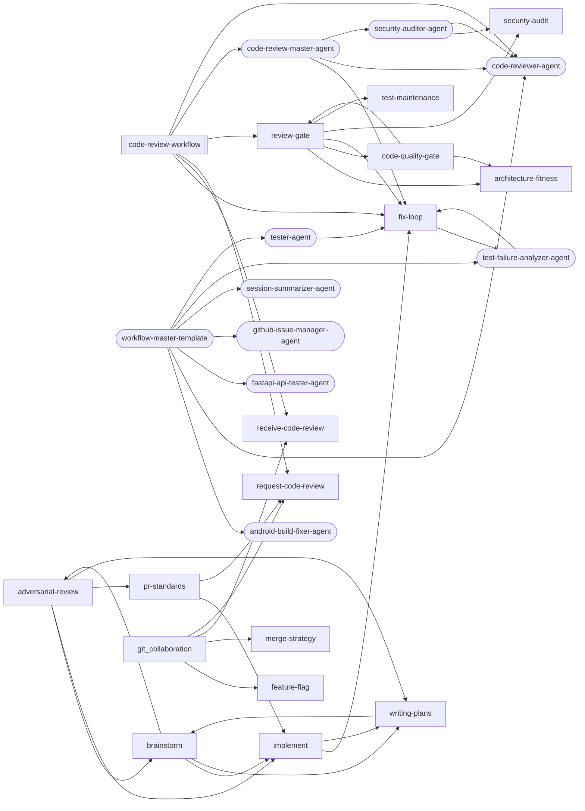

### adversarial-review

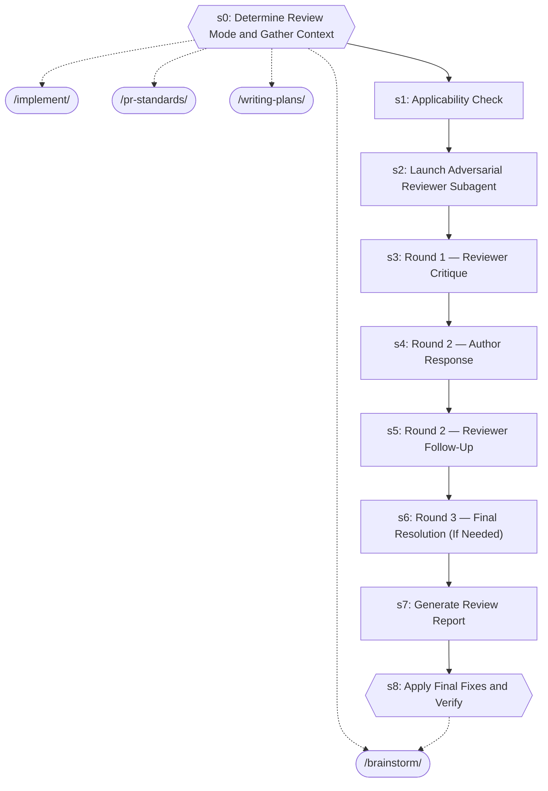

| Step | Title | Delegates To | Artifacts | Gates/Decisions |
|------|-------|-------------|-----------|----------------|
| 0 | Determine Review Mode and Gather Context | `/brainstorm`, `/implement`, `/pr-standards`, `/writing-plans` | — | gate |
| 1 | Applicability Check | — | — | — |
| 2 | Launch Adversarial Reviewer Subagent | — | — | — |
| 3 | Round 1 — Reviewer Critique | — | — | — |
| 4 | Round 2 — Author Response | — | — | — |
| 5 | Round 2 — Reviewer Follow-Up | — | — | — |
| 6 | Round 3 — Final Resolution (If Needed) | — | — | — |
| 7 | Generate Review Report | — | — | — |
| 8 | Apply Final Fixes and Verify | `/brainstorm` | — | gate, decision |

### architecture-fitness

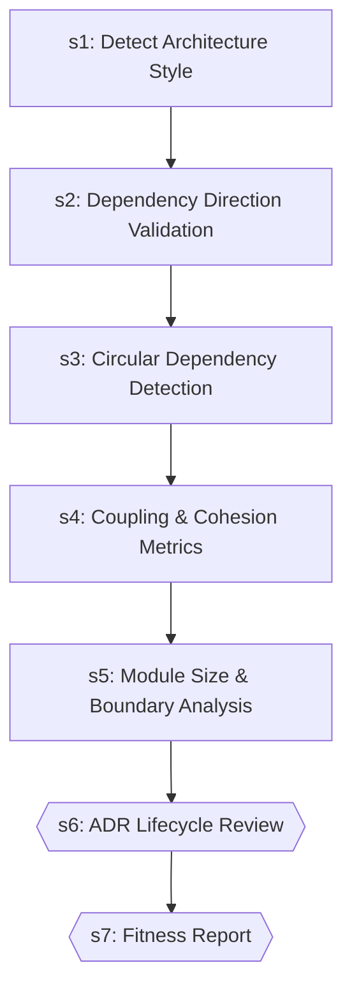

| Step | Title | Delegates To | Artifacts | Gates/Decisions |
|------|-------|-------------|-----------|----------------|
| 1 | Detect Architecture Style | — | — | — |
| 2 | Dependency Direction Validation | — | — | — |
| 3 | Circular Dependency Detection | — | — | — |
| 4 | Coupling & Cohesion Metrics | — | — | — |
| 5 | Module Size & Boundary Analysis | — | — | — |
| 6 | ADR Lifecycle Review | — | — | gate, decision |
| 7 | Fitness Report | — | — | gate, decision |

### brainstorm

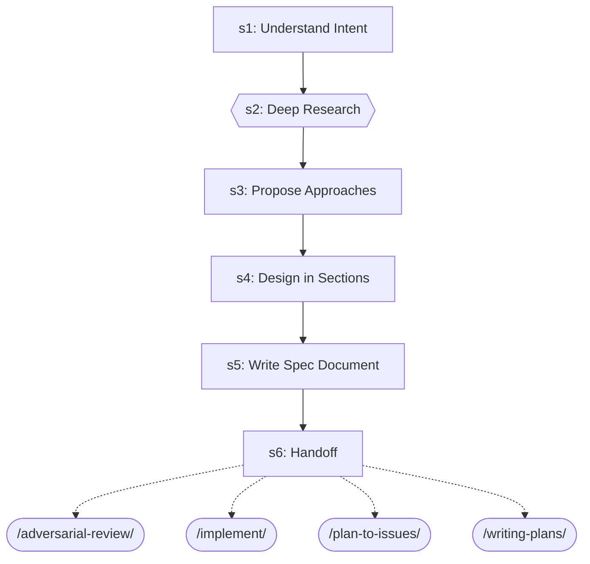

| Step | Title | Delegates To | Artifacts | Gates/Decisions |
|------|-------|-------------|-----------|----------------|
| 1 | Understand Intent | — | — | — |
| 2 | Deep Research | — | — | gate |
| 3 | Propose Approaches | — | — | — |
| 4 | Design in Sections | — | — | — |
| 5 | Write Spec Document | — | — | — |
| 6 | Handoff | `/adversarial-review`, `/implement`, `/plan-to-issues`, `/writing-plans` | — | — |

### code-quality-gate

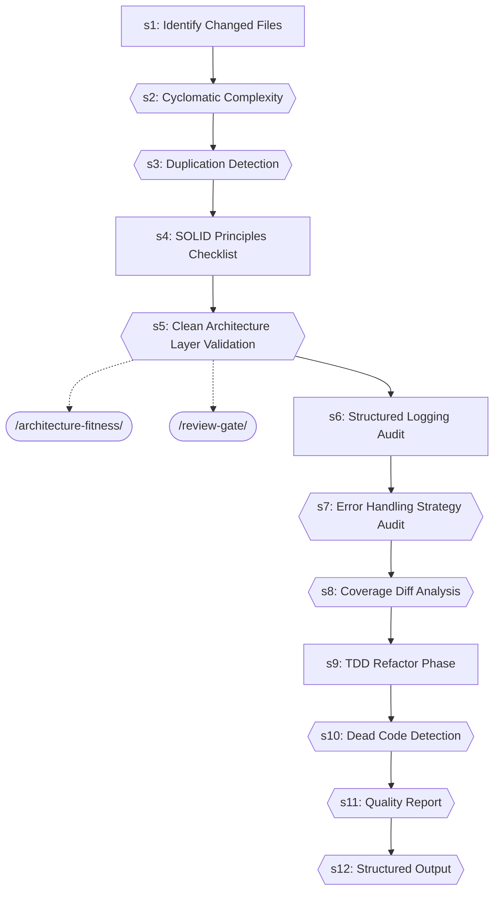

| Step | Title | Delegates To | Artifacts | Gates/Decisions |
|------|-------|-------------|-----------|----------------|
| 1 | Identify Changed Files | — | — | — |
| 2 | Cyclomatic Complexity | — | — | gate |
| 3 | Duplication Detection | — | — | gate |
| 4 | SOLID Principles Checklist | — | — | — |
| 5 | Clean Architecture Layer Validation | `/architecture-fitness`, `/review-gate` | — | gate |
| 6 | Structured Logging Audit | — | — | — |
| 7 | Error Handling Strategy Audit | — | — | gate |
| 8 | Coverage Diff Analysis | — | — | gate |
| 9 | TDD Refactor Phase | — | — | — |
| 10 | Dead Code Detection | — | — | gate |
| 11 | Quality Report | — | — | gate |
| 12 | Structured Output | — | → `test-results/code-quality-gate.json` | gate, decision |

### code-review-workflow

```mermaid
graph TD
    s1{{s1: INIT}}
    s2{{s2: QUALITY_GATES}}
    s1 --> s2
    fix_loop_ext([/fix-loop/])
    s2 -.-> fix_loop_ext
    review_gate_ext([/review-gate/])
    s2 -.-> review_gate_ext
    s2b{{s2b: DEEP_AUDIT (optional, --deep-audit flag)}}
    s2 --> s2b
    s3["s3: CREATE_PR"]
    s2b --> s3
    request_code_review_ext([/request-code-review/])
    s3 -.-> request_code_review_ext
    s4{{s4: HANDLE_FEEDBACK}}
    s3 --> s4
    receive_code_review_ext([/receive-code-review/])
    s4 -.-> receive_code_review_ext
    s5{{s5: REPORT}}
    s4 --> s5
    code_review_master_agent_ext((code-review-master-agent))
    s5 -.-> code_review_master_agent_ext
```

| Step | Title | Delegates To | Artifacts | Gates/Decisions |
|------|-------|-------------|-----------|----------------|
| 1 | INIT | — | — | gate |
| 2 | QUALITY_GATES | `/fix-loop`, `/review-gate` | → `test-results/review-gate.json` | gate |
| 2b | DEEP_AUDIT (optional, --deep-audit flag) | — | — | gate |
| 3 | CREATE_PR | `/request-code-review` | — | decision |
| 4 | HANDLE_FEEDBACK | `/receive-code-review` | — | gate |
| 5 | REPORT | `code-review-master-agent` | → `test-results/code-review-verdict.json` | gate |

### feature-flag

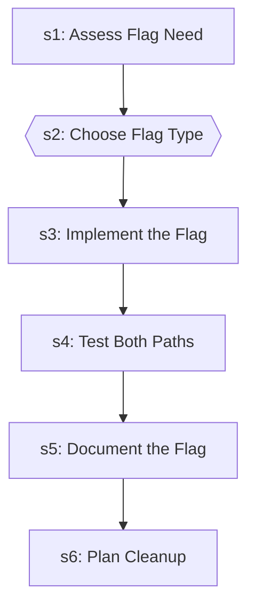

| Step | Title | Delegates To | Artifacts | Gates/Decisions |
|------|-------|-------------|-----------|----------------|
| 1 | Assess Flag Need | — | — | — |
| 2 | Choose Flag Type | — | — | gate |
| 3 | Implement the Flag | — | — | — |
| 4 | Test Both Paths | — | — | — |
| 5 | Document the Flag | — | — | — |
| 6 | Plan Cleanup | — | — | — |

### fix-loop

```mermaid
graph TD
    s1{{s1: Analyze Failure (via test-failure-analyzer-agent)}}
    test_failure_analyzer_agent_ext((test-failure-analyzer-agent))
    s1 -.-> test_failure_analyzer_agent_ext
    s1A["s1A: Flaky Test Detection"]
    s1 --> s1A
    s2["s2: Apply Fix"]
    s1A --> s2
    s3["s3: Retest (Full Loop mode only)"]
    s2 --> s3
    s4["s4: Report"]
    s3 --> s4
    s5{{s5: Structured Output}}
    s4 --> s5
```

| Step | Title | Delegates To | Artifacts | Gates/Decisions |
|------|-------|-------------|-----------|----------------|
| 1 | Analyze Failure (via test-failure-analyzer-agent) | `test-failure-analyzer-agent` | — | gate, decision |
| 1A | Flaky Test Detection | — | — | decision |
| 2 | Apply Fix | — | — | — |
| 3 | Retest (Full Loop mode only) | — | — | decision |
| 4 | Report | — | — | — |
| 5 | Structured Output | — | → `test-results/fix-loop.json` | gate, decision |

### implement

```mermaid
graph TD
    s1["s1: Analyze Requirements"]
    writing_plans_ext([/writing-plans/])
    s1 -.-> writing_plans_ext
    s2["s2: Create/Update Tests"]
    s1 --> s2
    s3["s3: Implement the Feature"]
    s2 --> s3
    s4["s4: Run Tests"]
    s3 --> s4
    s5{{s5: Fix Loop (if tests fail)}}
    s4 --> s5
    fix_loop_ext([/fix-loop/])
    s5 -.-> fix_loop_ext
    s6{{s6: Verification (Mandatory Gate)}}
    s5 --> s6
    post_fix_pipeline_ext([/post-fix-pipeline/])
    s6 -.-> post_fix_pipeline_ext
    s7["s7: Post-Implementation (Optional)"]
    s6 --> s7
    executing_plans_ext([/executing-plans/])
    s7 -.-> executing_plans_ext
    s8{{s8: Structured Output}}
    s7 --> s8
    fix_loop_ext([/fix-loop/])
    s8 -.-> fix_loop_ext
```

| Step | Title | Delegates To | Artifacts | Gates/Decisions |
|------|-------|-------------|-----------|----------------|
| 1 | Analyze Requirements | `/writing-plans` | — | — |
| 2 | Create/Update Tests | — | — | — |
| 3 | Implement the Feature | — | — | — |
| 4 | Run Tests | — | — | decision |
| 5 | Fix Loop (if tests fail) | `/fix-loop` | — | gate |
| 6 | Verification (Mandatory Gate) | `/post-fix-pipeline` | — | gate, decision |
| 7 | Post-Implementation (Optional) | `/executing-plans` | — | — |
| 8 | Structured Output | `/fix-loop` | → `test-results/implement.json` | gate, decision |

### mcp-server-builder

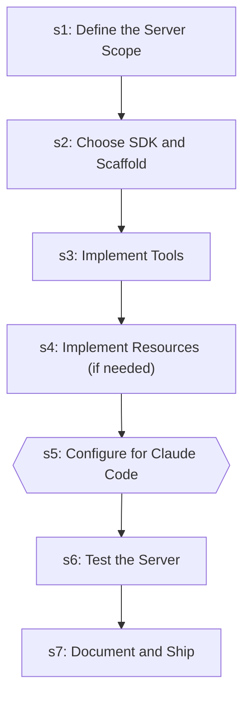

| Step | Title | Delegates To | Artifacts | Gates/Decisions |
|------|-------|-------------|-----------|----------------|
| 1 | Define the Server Scope | — | — | — |
| 2 | Choose SDK and Scaffold | — | — | — |
| 3 | Implement Tools | — | — | — |
| 4 | Implement Resources (if needed) | — | — | — |
| 5 | Configure for Claude Code | — | — | gate |
| 6 | Test the Server | — | — | — |
| 7 | Document and Ship | — | — | — |

### merge-strategy

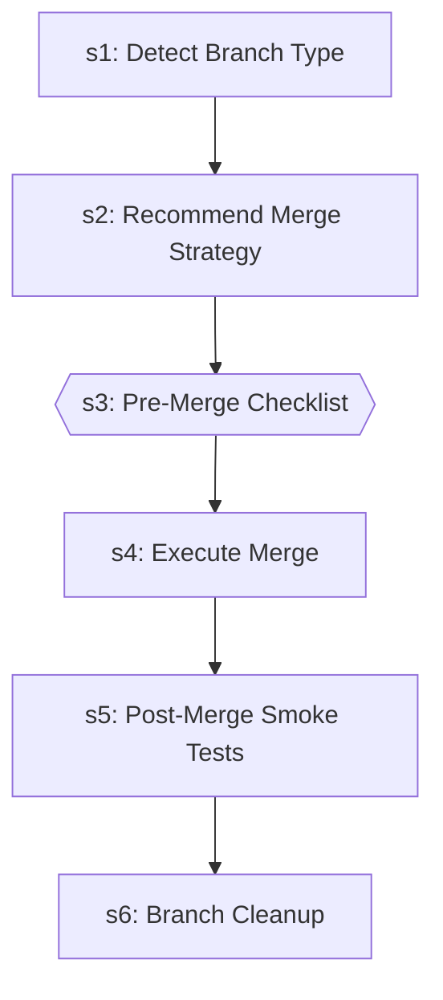

| Step | Title | Delegates To | Artifacts | Gates/Decisions |
|------|-------|-------------|-----------|----------------|
| 1 | Detect Branch Type | — | — | — |
| 2 | Recommend Merge Strategy | — | — | decision |
| 3 | Pre-Merge Checklist | — | — | gate, decision |
| 4 | Execute Merge | — | — | — |
| 5 | Post-Merge Smoke Tests | — | — | decision |
| 6 | Branch Cleanup | — | — | — |

### pr-standards

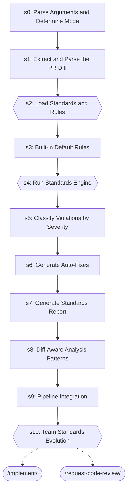

| Step | Title | Delegates To | Artifacts | Gates/Decisions |
|------|-------|-------------|-----------|----------------|
| 0 | Parse Arguments and Determine Mode | — | — | — |
| 1 | Extract and Parse the PR Diff | — | — | — |
| 2 | Load Standards and Rules | — | — | gate |
| 3 | Built-in Default Rules | — | — | — |
| 4 | Run Standards Engine | — | — | gate |
| 5 | Classify Violations by Severity | — | — | — |
| 6 | Generate Auto-Fixes | — | — | — |
| 7 | Generate Standards Report | — | — | — |
| 8 | Diff-Aware Analysis Patterns | — | — | — |
| 9 | Pipeline Integration | — | — | — |
| 10 | Team Standards Evolution | `/implement`, `/request-code-review` | — | gate |

### receive-code-review

```mermaid
graph TD
    s0{{s0: Fetch Review Comments}}
    s1{{s1: Triage Comments}}
    s0 --> s1
    s2{{s2: Address Must-Fix Comments (P0)}}
    s1 --> s2
    s3["s3: Evaluate Suggestions (P1)"]
    s2 --> s3
    s4["s4: Answer Questions (P2)"]
    s3 --> s4
    s5["s5: Batch Nits (P3)"]
    s4 --> s5
    s6["s6: Handle Disagreements"]
    s5 --> s6
    s7{{s7: Multi-Reviewer Coordination}}
    s6 --> s7
    s8["s8: Review Thread Resolution"]
    s7 --> s8
    s9["s9: Generate Re-Review Summary"]
    s8 --> s9
    s10["s10: Review Iteration Protocol"]
    s9 --> s10
    s11{{s11: Learning Extraction}}
    s10 --> s11
```

| Step | Title | Delegates To | Artifacts | Gates/Decisions |
|------|-------|-------------|-----------|----------------|
| 0 | Fetch Review Comments | — | — | gate |
| 1 | Triage Comments | — | — | gate |
| 2 | Address Must-Fix Comments (P0) | — | — | gate |
| 3 | Evaluate Suggestions (P1) | — | — | — |
| 4 | Answer Questions (P2) | — | — | — |
| 5 | Batch Nits (P3) | — | — | — |
| 6 | Handle Disagreements | — | — | — |
| 7 | Multi-Reviewer Coordination | — | — | gate |
| 8 | Review Thread Resolution | — | — | — |
| 9 | Generate Re-Review Summary | — | — | — |
| 10 | Review Iteration Protocol | — | — | — |
| 11 | Learning Extraction | — | — | gate |

### request-code-review

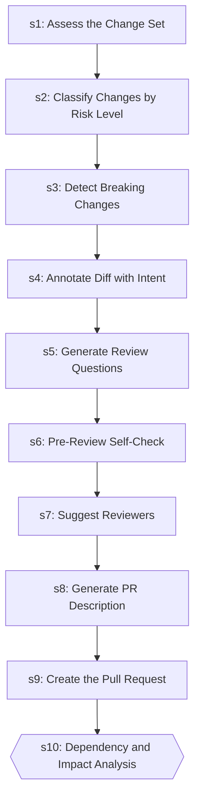

| Step | Title | Delegates To | Artifacts | Gates/Decisions |
|------|-------|-------------|-----------|----------------|
| 1 | Assess the Change Set | — | — | — |
| 2 | Classify Changes by Risk Level | — | — | — |
| 3 | Detect Breaking Changes | — | — | — |
| 4 | Annotate Diff with Intent | — | — | — |
| 5 | Generate Review Questions | — | — | — |
| 6 | Pre-Review Self-Check | — | — | — |
| 7 | Suggest Reviewers | — | — | — |
| 8 | Generate PR Description | — | — | decision |
| 9 | Create the Pull Request | — | — | — |
| 10 | Dependency and Impact Analysis | — | — | gate |

### review-gate

```mermaid
graph TD
    s0{{s0: Parse Arguments and Gather Context}}
    s1{{s1: Batch A — Code Quality + Architecture (Parallel)}}
    s0 --> s1
    fix_loop_ext([/fix-loop/])
    s1 -.-> fix_loop_ext
    s2{{s2: Batch B — Security + Risk Scoring (Parallel)}}
    s1 --> s2
    s3["s3: Batch C — Adversarial Review → PR Standards (Sequential)"]
    s2 --> s3
    s4{{s4: Fix Loop (Conditional)}}
    s3 --> s4
    s5{{s5: Generate Consolidated Review Report}}
    s4 --> s5
    s6{{s6: PR Creation (Conditional)}}
    s5 --> s6
    s7{{s7: Post-Review Feedback Loop (Conditional)}}
    s6 --> s7
    test_maintenance_ext([/test-maintenance/])
    s7 -.-> test_maintenance_ext
```

| Step | Title | Delegates To | Artifacts | Gates/Decisions |
|------|-------|-------------|-----------|----------------|
| 0 | Parse Arguments and Gather Context | — | — | gate |
| 1 | Batch A — Code Quality + Architecture (Parallel) | `/fix-loop` | — | gate |
| 2 | Batch B — Security + Risk Scoring (Parallel) | — | — | gate |
| 3 | Batch C — Adversarial Review → PR Standards (Sequential) | — | — | — |
| 4 | Fix Loop (Conditional) | — | — | gate |
| 5 | Generate Consolidated Review Report | — | → `test-results/review-gate.json` | gate, decision |
| 6 | PR Creation (Conditional) | — | → `test-results/review-gate.json` | gate |
| 7 | Post-Review Feedback Loop (Conditional) | `/test-maintenance` | → `test-results/review-gate.json` | gate, decision |

### security-audit

```mermaid
graph TD
    s1["s1: Reconnaissance"]
    s2["s2: Static Analysis"]
    s1 --> s2
    s3["s3: Variant Analysis"]
    s2 --> s3
    s4["s4: Differential Security Review"]
    s3 --> s4
    s5["s5: Insecure Defaults Detection"]
    s4 --> s5
    s6{{s6: GitHub Actions Security}}
    s5 --> s6
    s7{{s7: False-Positive Gating}}
    s6 --> s7
    s8["s8: OWASP Top 10 Checklist"]
    s7 --> s8
    s9{{s9: Compliance Testing (GDPR / SOC2 / HIPAA)}}
    s8 --> s9
```

| Step | Title | Delegates To | Artifacts | Gates/Decisions |
|------|-------|-------------|-----------|----------------|
| 1 | Reconnaissance | — | — | — |
| 2 | Static Analysis | — | — | — |
| 3 | Variant Analysis | — | — | — |
| 4 | Differential Security Review | — | — | — |
| 5 | Insecure Defaults Detection | — | — | — |
| 6 | GitHub Actions Security | — | — | gate |
| 7 | False-Positive Gating | — | — | gate |
| 8 | OWASP Top 10 Checklist | — | — | — |
| 9 | Compliance Testing (GDPR / SOC2 / HIPAA) | — | — | gate |

### test-maintenance

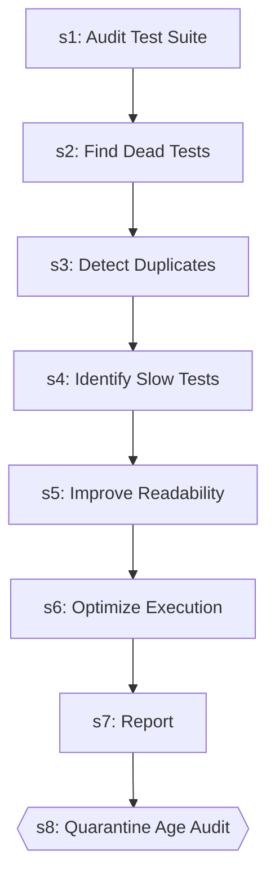

| Step | Title | Delegates To | Artifacts | Gates/Decisions |
|------|-------|-------------|-----------|----------------|
| 1 | Audit Test Suite | — | — | — |
| 2 | Find Dead Tests | — | — | decision |
| 3 | Detect Duplicates | — | — | — |
| 4 | Identify Slow Tests | — | — | — |
| 5 | Improve Readability | — | — | — |
| 6 | Optimize Execution | — | — | — |
| 7 | Report | — | — | — |
| 8 | Quarantine Age Audit | — | — | gate |

### writing-plans

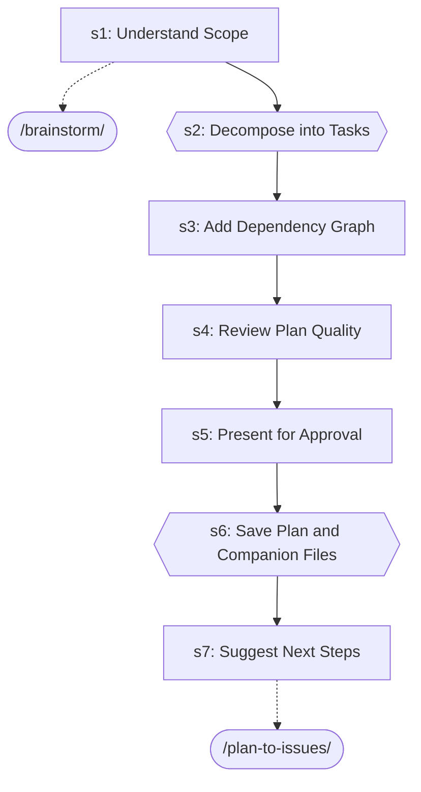

| Step | Title | Delegates To | Artifacts | Gates/Decisions |
|------|-------|-------------|-----------|----------------|
| 1 | Understand Scope | `/brainstorm` | — | decision |
| 2 | Decompose into Tasks | — | — | gate, decision |
| 3 | Add Dependency Graph | — | — | — |
| 4 | Review Plan Quality | — | — | — |
| 5 | Present for Approval | — | — | — |
| 6 | Save Plan and Companion Files | — | — | gate |
| 7 | Suggest Next Steps | `/plan-to-issues` | — | — |


## Agents

| Agent | Description | Dispatched By |
|-------|-------------|---------------|
| `android-build-fixer-agent` | Use proactively to diagnose and fix Android Gradle build failures. Spawn auto... | `/workflow-master-template` |
| `android-kotlin-reviewer-agent` | Use proactively to review Kotlin code for idiomatic patterns, coroutine safet... | — |
| `code-review-master-agent` | DEPRECATED 2026-04-25 (Phase 3.4 of subagent-dispatch-platform-limit remediat... | `/code-review-workflow` |
| `code-reviewer-agent` | Use proactively to review recently changed files for code quality, type safet... | `/code-review-workflow`, `/code-review-master-agent`, `/security-auditor-agent`, `/workflow-master-template` |
| `fastapi-api-tester-agent` | Use this agent when you need to test FastAPI backend endpoints, validate API ... | `/workflow-master-template` |
| `github-issue-manager-agent` | Use proactively to create consolidated GitHub Issues for test failures from t... | `/workflow-master-template` |
| `security-auditor-agent` | Use proactively for security assessments — OWASP Top 10 scanning, threat mode... | `/code-review-master-agent` |
| `session-summarizer-agent` | Use proactively to auto-generate session summary updates at session end. Spaw... | `/workflow-master-template` |
| `test-failure-analyzer-agent` | Use proactively to diagnose test failures — reads test output, classifies by ... | `/fix-loop`, `/workflow-master-template` |
| `tester-agent` | Senior QA engineer specializing in comprehensive testing and quality assuranc... | `/workflow-master-template` |
| `workflow-master-template` | Shared orchestration protocol reference for workflow orchestrators in core/.c... | — |

## Rules

| Rule | Description |
|------|-------------|
| `git-collaboration` |  |

## Cross-Workflow Connections

**Outgoing** (this workflow feeds into):
- `contract-test` (skill)
- `create-github-issue` (skill)
- `db-migrate-verify` (skill)
- `debugging-loop` (skill)
- `development-loop` (skill)
- `e2e-visual-run` (skill)
- `executing-plans` (skill)
- `fix-issue` (skill)
- `learn-n-improve` (skill)
- `plan-to-issues` (skill)
- `post-fix-pipeline` (skill)
- `systematic-debugging` (skill)
- `test-healer-agent` (agent)
- `test-pipeline` (skill)
- `verify-screenshots` (skill)

**Incoming** (fed by):
- `android-run-e2e` (skill)
- `android-run-tests` (skill)
- `anthropic-agent-orchestration-guide` (skill)
- `anthropic-multi-agent-research-system-skill` (skill)
- `auto-verify` (skill)
- `bun-elysia-test` (skill)
- `claude-behavior` (rule)
- `create-github-issue` (skill)
- `debugging-loop` (skill)
- `debugging-loop-master-agent` (agent)
- `development-loop` (skill)
- `documentation-workflow` (skill)
- `e2e-visual-run` (skill)
- `executing-plans` (skill)
- `failure-triage-agent` (agent)
- `fastapi-run-backend-tests` (skill)
- `firebase-test` (skill)
- `fix-issue` (skill)
- `flutter-e2e-test` (skill)
- `learning-self-improvement` (skill)
- `learning-self-improvement-master-agent` (agent)
- `pattern-self-containment` (rule)
- `pattern-structure` (rule)
- `prd-parser` (skill)
- `project-manager-agent` (agent)
- `project-scaffold` (skill)
- `session-continuity` (skill)
- `session-continuity-master-agent` (agent)
- `skill-factory` (skill)
- `skill-master` (skill)
- `systematic-debugging` (skill)
- `tdd` (skill)
- `tdd-rule` (rule)
- `test-healer-agent` (agent)
- `test-pipeline` (skill)
- `test-pipeline-agent` (agent)
- `testing` (rule)
- `testing-pipeline-master-agent` (agent)
- `testing-pipeline-workflow` (skill)
- `verify-screenshots` (skill)

<!-- MANUAL ANNOTATIONS -->
<!-- Add custom notes below this line. They are preserved on regeneration. -->
