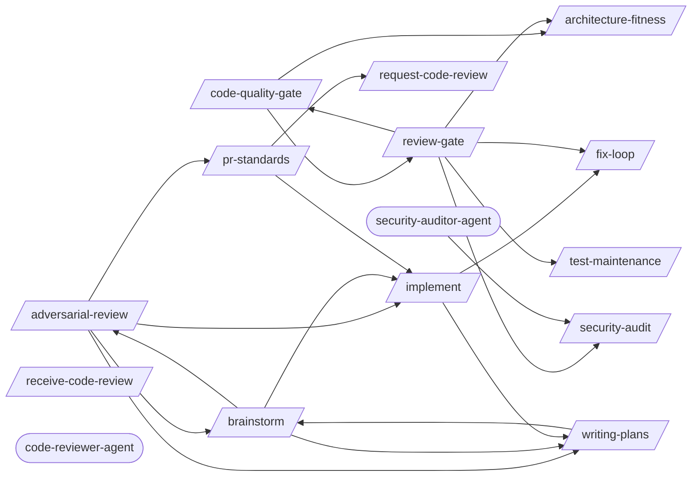

# Code Review

> Creating, requesting, and acting on code reviews.

> Auto-generated by `scripts/generate_workflow_docs.py` | Last updated: 2026-03-21 12:02 UTC

## Flow Diagram

## Skills

| Skill | Version | Description | Calls | Called By |
|-------|---------|-------------|-------|----------|
| `/adversarial-review` | 1.0.0 | Launch a structured adversarial review using a subagent with a dedicated revi... | `/brainstorm`, `/implement`, `/pr-standards`, `/writing-plans` | `/brainstorm` |
| `/architecture-fitness` | 1.0.0 | Automated architecture conformance checks: dependency direction validation, c... | — | `/code-quality-gate`, `/review-gate` |
| `/brainstorm` | 1.0.0 | Socratic questioning phase before planning or implementation. Explores intent... | `/adversarial-review`, `/implement`, `/writing-plans` | `/adversarial-review`, `/writing-plans` |
| `/code-quality-gate` | 1.2.0 | Post-implementation code quality enforcement: cyclomatic complexity, duplicat... | `/architecture-fitness`, `/review-gate` | `/review-gate` |
| `/fix-loop` | 1.2.0 | Iterative fix cycle: analyze failures, apply minimal fixes, optionally retest... | — | `/implement`, `/review-gate` |
| `/implement` | 1.0.0 | Implement a feature or fix following a structured workflow: requirements anal... | `/fix-loop`, `/writing-plans` | `/adversarial-review`, `/brainstorm`, `/pr-standards` |
| `/pr-standards` | 1.0.0 | Proactively enforce team standards against PR diffs before requesting human r... | `/implement`, `/request-code-review` | `/adversarial-review` |
| `/receive-code-review` | 1.0.0 | Consume, triage, and act on code review feedback systematically. Fetches PR r... | — | — |
| `/request-code-review` | 1.0.0 | Create high-quality, review-optimized pull requests that surface risks, gener... | — | `/pr-standards` |
| `/review-gate` | 2.3.0 | Stage 9 orchestrator: sequences all review sub-skills (code-quality-gate, arc... | `/architecture-fitness`, `/code-quality-gate`, `/fix-loop`, `/security-audit`, `/test-maintenance` | `/code-quality-gate` |
| `/security-audit` | 1.0.0 | Comprehensive security audit workflow: static analysis with CodeQL and Semgre... | — | `/review-gate`, `/security-auditor-agent` |
| `/test-maintenance` | 1.2.0 | Audit, clean up, and optimize a test suite. Identifies dead tests, duplicates... | — | `/review-gate` |
| `/writing-plans` | 1.0.0 | Generate detailed implementation plans with bite-sized tasks, exact file path... | `/brainstorm` | `/adversarial-review`, `/brainstorm`, `/implement` |

## Agents

| Agent | Description | Dispatched By |
|-------|-------------|---------------|
| `code-reviewer-agent` | A senior software engineer specializing in comprehensive code quality assessm... | — |
| `security-auditor-agent` | Use this agent for dedicated security assessments — OWASP Top 10 scanning, th... | — |

## Cross-Workflow Connections

**Outgoing** (this workflow feeds into):
- `contract-test` (skill)
- `db-migrate-verify` (skill)
- `executing-plans` (skill)
- `learn-n-improve` (skill)
- `plan-to-issues` (skill)
- `post-fix-pipeline` (skill)
- `verify-screenshots` (skill)

**Incoming** (fed by):
- `android-run-e2e` (skill)
- `android-run-tests` (skill)
- `anthropic-agent-orchestration-guide` (skill)
- `auto-verify` (skill)
- `executing-plans` (skill)
- `fastapi-run-backend-tests` (skill)
- `fix-issue` (skill)
- `pattern-self-containment` (rule)
- `prd-parser` (skill)
- `project-manager-agent` (agent)
- `project-scaffold` (skill)
- `skill-factory` (skill)
- `skill-master` (skill)
- `tdd` (skill)
- `tdd-rule` (rule)
- `test-failure-analyzer-agent` (agent)
- `tester-agent` (agent)

<!-- MANUAL ANNOTATIONS -->
<!-- Add custom notes below this line. They are preserved on regeneration. -->

<!-- Add custom notes below this line. They are preserved on regeneration. -->

<!-- Add custom notes below this line. They are preserved on regeneration. -->
