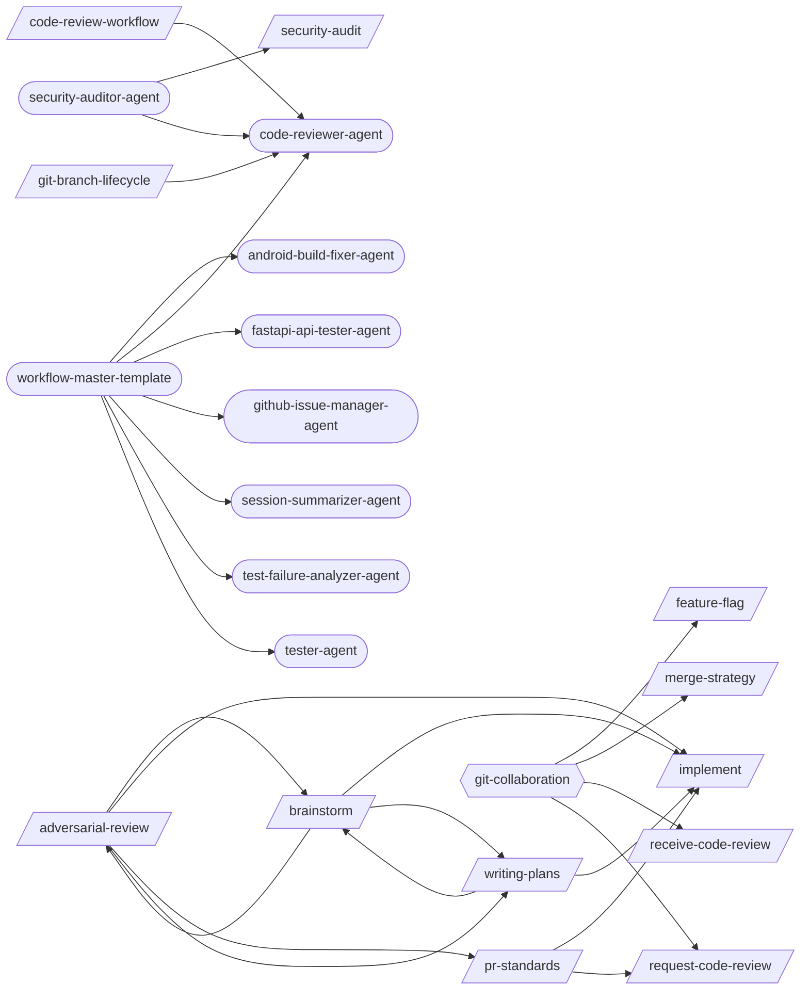
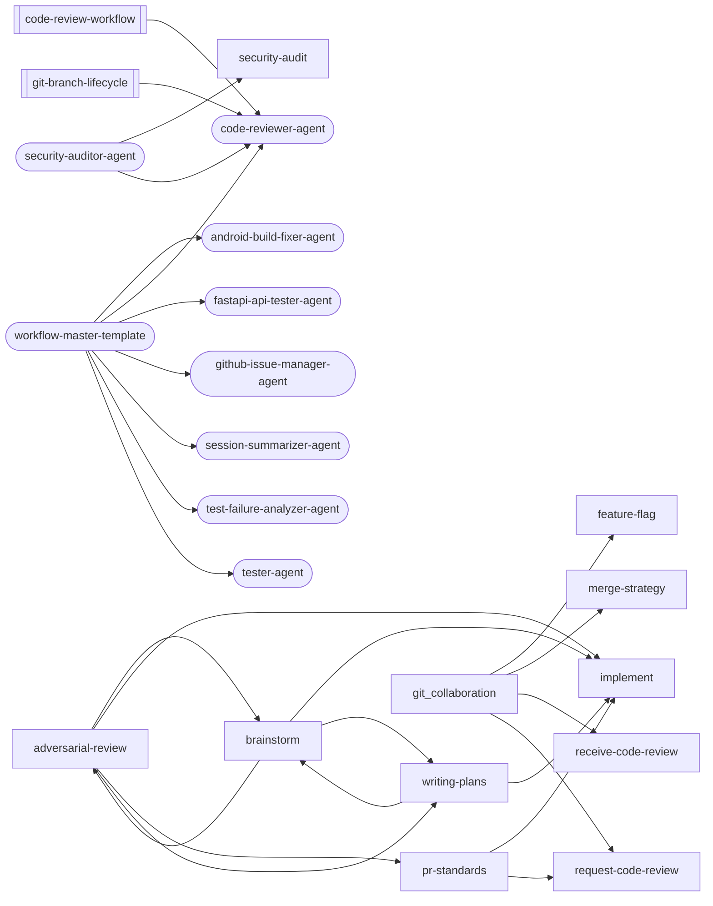
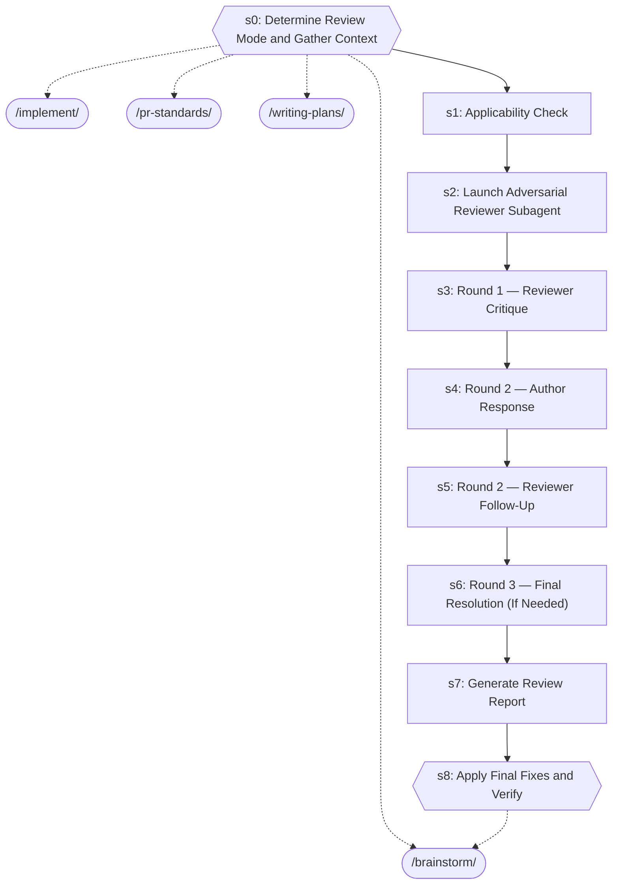
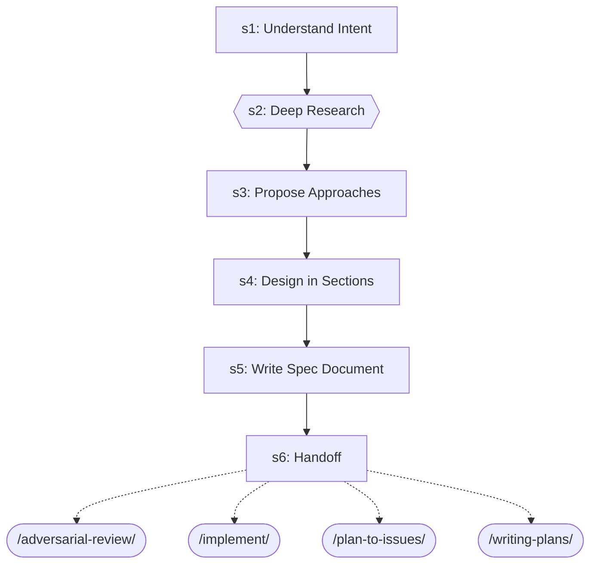
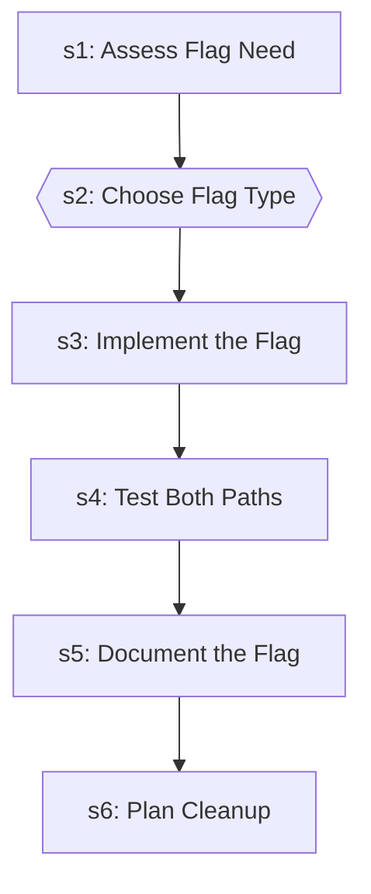
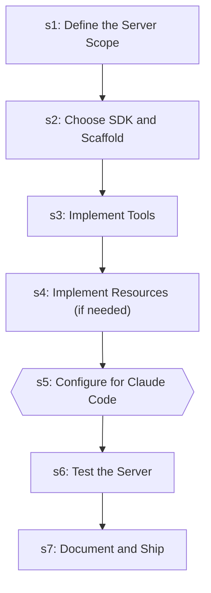
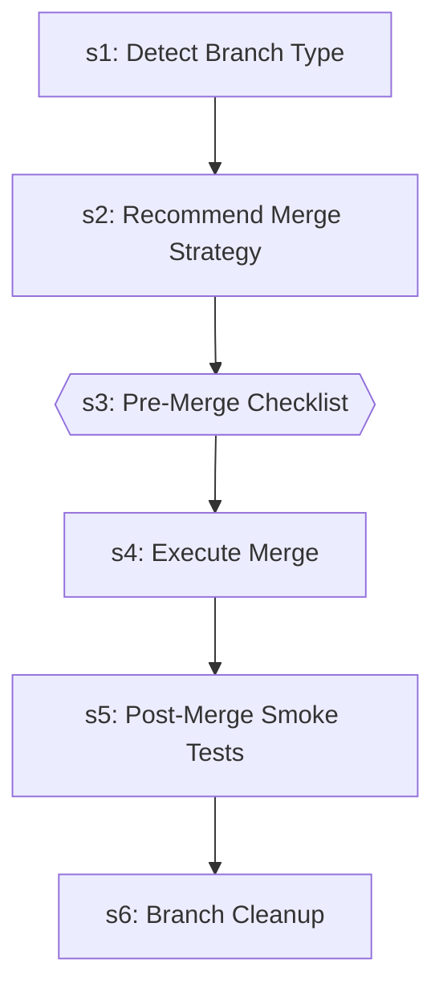
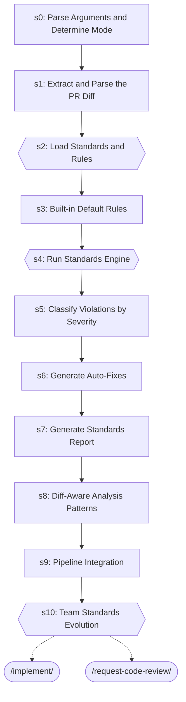
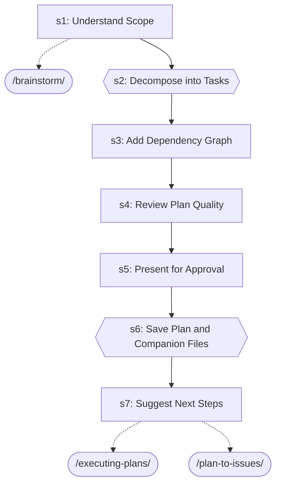

# Code Review

> Creating, requesting, and acting on code reviews.

> Auto-generated by `scripts/generate_workflow_docs.py` | Last updated: 2026-07-15 01:56 UTC

## Overview

```mermaid
graph LR
    adversarial_review[/adversarial-review/]
    brainstorm[/brainstorm/]
    code_review_workflow[/code-review-workflow/]
    feature_flag[/feature-flag/]
    git_branch_lifecycle[/git-branch-lifecycle/]
    implement[/implement/]
    merge_strategy[/merge-strategy/]
    pr_standards[/pr-standards/]
    receive_code_review[/receive-code-review/]
    request_code_review[/request-code-review/]
    security_audit[/security-audit/]
    writing_plans[/writing-plans/]
    android_build_fixer_agent([android-build-fixer-agent])
    code_reviewer_agent([code-reviewer-agent])
    fastapi_api_tester_agent([fastapi-api-tester-agent])
    github_issue_manager_agent([github-issue-manager-agent])
    security_auditor_agent([security-auditor-agent])
    session_summarizer_agent([session-summarizer-agent])
    test_failure_analyzer_agent([test-failure-analyzer-agent])
    tester_agent([tester-agent])
    workflow_master_template([workflow-master-template])
    git_collaboration{{git-collaboration}}
    adversarial_review --> brainstorm
    adversarial_review --> implement
    adversarial_review --> pr_standards
    adversarial_review --> writing_plans
    brainstorm --> adversarial_review
    brainstorm --> implement
    brainstorm --> writing_plans
    code_review_workflow --> code_reviewer_agent
    git_branch_lifecycle --> code_reviewer_agent
    pr_standards --> implement
    pr_standards --> request_code_review
    writing_plans --> brainstorm
    writing_plans --> implement
    security_auditor_agent --> security_audit
    security_auditor_agent --> code_reviewer_agent
    workflow_master_template --> android_build_fixer_agent
    workflow_master_template --> code_reviewer_agent
    workflow_master_template --> fastapi_api_tester_agent
    workflow_master_template --> github_issue_manager_agent
    workflow_master_template --> session_summarizer_agent
    workflow_master_template --> test_failure_analyzer_agent
    workflow_master_template --> tester_agent
    git_collaboration --> feature_flag
    git_collaboration --> merge_strategy
    git_collaboration --> receive_code_review
    git_collaboration --> request_code_review
```

## Detailed Flow

Step-level flow showing gates (diamonds), delegations (dashed), and artifacts (cylinders).

```mermaid
graph TD
    subgraph adversarial_review_sub["Adversarial Review"]
        adversarial_review_s0{{Step 0: Determine Review Mode and Gather Context}}
        brainstorm_ext([/brainstorm/])
        adversarial_review_s0 -.-> brainstorm_ext
        implement_ext([/implement/])
        adversarial_review_s0 -.-> implement_ext
        pr_standards_ext([/pr-standards/])
        adversarial_review_s0 -.-> pr_standards_ext
        writing_plans_ext([/writing-plans/])
        adversarial_review_s0 -.-> writing_plans_ext
        adversarial_review_s1["Step 1: Applicability Check"]
        adversarial_review_s0 --> adversarial_review_s1
        adversarial_review_s2["Step 2: Launch Adversarial Reviewer Subagent"]
        adversarial_review_s1 --> adversarial_review_s2
        adversarial_review_s3["Step 3: Round 1 — Reviewer Critique"]
        adversarial_review_s2 --> adversarial_review_s3
        adversarial_review_s4["Step 4: Round 2 — Author Response"]
        adversarial_review_s3 --> adversarial_review_s4
        adversarial_review_s5["Step 5: Round 2 — Reviewer Follow-Up"]
        adversarial_review_s4 --> adversarial_review_s5
        adversarial_review_s6["Step 6: Round 3 — Final Resolution (If Needed)"]
        adversarial_review_s5 --> adversarial_review_s6
        adversarial_review_s7["Step 7: Generate Review Report"]
        adversarial_review_s6 --> adversarial_review_s7
        adversarial_review_s8{{Step 8: Apply Final Fixes and Verify}}
        adversarial_review_s7 --> adversarial_review_s8
        adversarial_review_s8 -.-> brainstorm_ext
    end

    subgraph brainstorm_sub["Brainstorm"]
        brainstorm_s1["Step 1: Understand Intent"]
        brainstorm_s2{{Step 2: Deep Research}}
        brainstorm_s1 --> brainstorm_s2
        brainstorm_s3["Step 3: Propose Approaches"]
        brainstorm_s2 --> brainstorm_s3
        brainstorm_s4["Step 4: Design in Sections"]
        brainstorm_s3 --> brainstorm_s4
        brainstorm_s5["Step 5: Write Spec Document"]
        brainstorm_s4 --> brainstorm_s5
        brainstorm_s6["Step 6: Handoff"]
        brainstorm_s5 --> brainstorm_s6
        adversarial_review_ext([/adversarial-review/])
        brainstorm_s6 -.-> adversarial_review_ext
        brainstorm_s6 -.-> implement_ext
        plan_to_issues_ext([/plan-to-issues/])
        brainstorm_s6 -.-> plan_to_issues_ext
        brainstorm_s6 -.-> writing_plans_ext
    end

    subgraph feature_flag_sub["Feature Flag"]
        feature_flag_s1["Step 1: Assess Flag Need"]
        feature_flag_s2{{Step 2: Choose Flag Type}}
        feature_flag_s1 --> feature_flag_s2
        feature_flag_s3["Step 3: Implement the Flag"]
        feature_flag_s2 --> feature_flag_s3
        feature_flag_s4["Step 4: Test Both Paths"]
        feature_flag_s3 --> feature_flag_s4
        feature_flag_s5["Step 5: Document the Flag"]
        feature_flag_s4 --> feature_flag_s5
        feature_flag_s6["Step 6: Plan Cleanup"]
        feature_flag_s5 --> feature_flag_s6
    end

    subgraph git_branch_lifecycle_sub["Git Branch Lifecycle"]
        git_branch_lifecycle_s0["Step 0: Route on the sub-command"]
        git_branch_lifecycle_s1{{Step 1: status — show the live picture}}
        git_branch_lifecycle_s0 --> git_branch_lifecycle_s1
        git_branch_lifecycle_s2["Step 2: work <name> — isolated parallel workstream (own worktree)"]
        git_branch_lifecycle_s1 --> git_branch_lifecycle_s2
        git_branch_lifecycle_s3{{Step 3: finish [branch] — land it NOW, with an independent agent review first}}
        git_branch_lifecycle_s2 --> git_branch_lifecycle_s3
        code_reviewer_agent_ext((code-reviewer-agent))
        git_branch_lifecycle_s3 -.-> code_reviewer_agent_ext
        git_branch_lifecycle_s4{{Step 4: cleanup — RECONCILE every branch (merged→prune, unmerged→land-or-escalate)}}
        git_branch_lifecycle_s3 --> git_branch_lifecycle_s4
        git_branch_lifecycle_s4 -.-> code_reviewer_agent_ext
    end

    subgraph mcp_server_builder_sub["Mcp Server Builder"]
        mcp_server_builder_s1["Step 1: Define the Server Scope"]
        mcp_server_builder_s2["Step 2: Choose SDK and Scaffold"]
        mcp_server_builder_s1 --> mcp_server_builder_s2
        mcp_server_builder_s3["Step 3: Implement Tools"]
        mcp_server_builder_s2 --> mcp_server_builder_s3
        mcp_server_builder_s4["Step 4: Implement Resources (if needed)"]
        mcp_server_builder_s3 --> mcp_server_builder_s4
        mcp_server_builder_s5{{Step 5: Configure for Claude Code}}
        mcp_server_builder_s4 --> mcp_server_builder_s5
        mcp_server_builder_s6["Step 6: Test the Server"]
        mcp_server_builder_s5 --> mcp_server_builder_s6
        mcp_server_builder_s7["Step 7: Document and Ship"]
        mcp_server_builder_s6 --> mcp_server_builder_s7
    end

    subgraph merge_strategy_sub["Merge Strategy"]
        merge_strategy_s1["Step 1: Detect Branch Type"]
        merge_strategy_s2["Step 2: Recommend Merge Strategy"]
        merge_strategy_s1 --> merge_strategy_s2
        merge_strategy_s3{{Step 3: Pre-Merge Checklist}}
        merge_strategy_s2 --> merge_strategy_s3
        merge_strategy_s4["Step 4: Execute Merge"]
        merge_strategy_s3 --> merge_strategy_s4
        merge_strategy_s5["Step 5: Post-Merge Smoke Tests"]
        merge_strategy_s4 --> merge_strategy_s5
        merge_strategy_s6["Step 6: Branch Cleanup"]
        merge_strategy_s5 --> merge_strategy_s6
    end

    subgraph pr_standards_sub["Pr Standards"]
        pr_standards_s0["Step 0: Parse Arguments and Determine Mode"]
        pr_standards_s1["Step 1: Extract and Parse the PR Diff"]
        pr_standards_s0 --> pr_standards_s1
        pr_standards_s2{{Step 2: Load Standards and Rules}}
        pr_standards_s1 --> pr_standards_s2
        pr_standards_s3["Step 3: Built-in Default Rules"]
        pr_standards_s2 --> pr_standards_s3
        pr_standards_s4{{Step 4: Run Standards Engine}}
        pr_standards_s3 --> pr_standards_s4
        pr_standards_s5["Step 5: Classify Violations by Severity"]
        pr_standards_s4 --> pr_standards_s5
        pr_standards_s6["Step 6: Generate Auto-Fixes"]
        pr_standards_s5 --> pr_standards_s6
        pr_standards_s7["Step 7: Generate Standards Report"]
        pr_standards_s6 --> pr_standards_s7
        pr_standards_s8["Step 8: Diff-Aware Analysis Patterns"]
        pr_standards_s7 --> pr_standards_s8
        pr_standards_s9["Step 9: Pipeline Integration"]
        pr_standards_s8 --> pr_standards_s9
        pr_standards_s10{{Step 10: Team Standards Evolution}}
        pr_standards_s9 --> pr_standards_s10
        pr_standards_s10 -.-> implement_ext
        request_code_review_ext([/request-code-review/])
        pr_standards_s10 -.-> request_code_review_ext
    end

    subgraph security_audit_sub["Security Audit"]
        security_audit_s1["Step 1: Reconnaissance"]
        security_audit_s2["Step 2: Static Analysis"]
        security_audit_s1 --> security_audit_s2
        security_audit_s3["Step 3: Variant Analysis"]
        security_audit_s2 --> security_audit_s3
        security_audit_s4["Step 4: Differential Security Review"]
        security_audit_s3 --> security_audit_s4
        security_audit_s5["Step 5: Insecure Defaults Detection"]
        security_audit_s4 --> security_audit_s5
        security_audit_s6{{Step 6: GitHub Actions Security}}
        security_audit_s5 --> security_audit_s6
        security_audit_s7{{Step 7: False-Positive Gating}}
        security_audit_s6 --> security_audit_s7
        security_audit_s8["Step 8: OWASP Top 10 Checklist"]
        security_audit_s7 --> security_audit_s8
        security_audit_s9{{Step 9: Compliance Testing (GDPR / SOC2 / HIPAA)}}
        security_audit_s8 --> security_audit_s9
    end

    subgraph writing_plans_sub["Writing Plans"]
        writing_plans_s1["Step 1: Understand Scope"]
        writing_plans_s1 -.-> brainstorm_ext
        writing_plans_s2{{Step 2: Decompose into Tasks}}
        writing_plans_s1 --> writing_plans_s2
        writing_plans_s3["Step 3: Add Dependency Graph"]
        writing_plans_s2 --> writing_plans_s3
        writing_plans_s4["Step 4: Review Plan Quality"]
        writing_plans_s3 --> writing_plans_s4
        writing_plans_s5["Step 5: Present for Approval"]
        writing_plans_s4 --> writing_plans_s5
        writing_plans_s6{{Step 6: Save Plan and Companion Files}}
        writing_plans_s5 --> writing_plans_s6
        writing_plans_s7["Step 7: Suggest Next Steps"]
        writing_plans_s6 --> writing_plans_s7
        executing_plans_ext([/executing-plans/])
        writing_plans_s7 -.-> executing_plans_ext
        writing_plans_s7 -.-> plan_to_issues_ext
    end

    adversarial_review_s0 ==> brainstorm_s1
    adversarial_review_s0 ==> pr_standards_s0
    adversarial_review_s0 ==> writing_plans_s1
    brainstorm_s6 ==> adversarial_review_s0
    brainstorm_s6 ==> writing_plans_s1
    writing_plans_s1 ==> brainstorm_s1
```

## Skills

| Skill | Version | Description | Calls | Called By |
|-------|---------|-------------|-------|----------|
| `/adversarial-review` | 1.0.0 | Launch a structured adversarial review using a subagent with a dedicated revi... | `/brainstorm`, `/implement`, `/pr-standards`, `/writing-plans` | `/brainstorm` |
| `/brainstorm` | 1.0.0 | Explore intent through Socratic questioning, propose approaches with trade-of... | `/adversarial-review`, `/implement`, `/writing-plans` | `/adversarial-review`, `/writing-plans` |
| `/code-review-workflow` | 3.0.0 | POINTER to the installable cbp-workflows plugin — this capability graduated f... | `/code-reviewer-agent` | — |
| `/feature-flag` | 1.0.0 | Implement feature toggles for gradual rollout and incomplete feature manageme... | — | — |
| `/git-branch-lifecycle` | 1.1.0 | Orchestrate the autonomous branch automation (auto-git.sh + auto-pr.sh hooks)... | `/code-reviewer-agent` | — |
| `/implement` | 3.0.0 | POINTER to the installable cbp-build-test-workflows plugin — this capability ... | — | `/adversarial-review`, `/brainstorm`, `/pr-standards`, `/writing-plans` |
| `/mcp-server-builder` | 1.0.0 | Build MCP (Model Context Protocol) servers that extend Claude Code's capabili... | — | — |
| `/merge-strategy` | 1.0.0 | Recommend the optimal Git merge strategy (squash, merge commit, or rebase) ba... | — | — |
| `/pr-standards` | 1.0.0 | Enforce team standards against PR diffs by extracting changed lines, checking... | `/implement`, `/request-code-review` | `/adversarial-review` |
| `/receive-code-review` | 2.0.0 | POINTER to the installable cbp-workflows plugin — this capability graduated f... | — | — |
| `/request-code-review` | 2.0.0 | POINTER to the installable cbp-workflows plugin — this capability graduated f... | — | `/pr-standards` |
| `/review-gate` | 3.0.0 | POINTER to the installable cbp-workflows plugin — this capability graduated f... | — | — |
| `/security-audit` | 1.0.0 | Run security audits covering static analysis with CodeQL and Semgrep, SARIF t... | — | `/security-auditor-agent` |
| `/writing-plans` | 1.2.0 | Generate detailed implementation plans with bite-sized tasks, exact file path... | `/brainstorm`, `/implement` | `/adversarial-review`, `/brainstorm` |

## Workflow Steps

### Consolidated Step Flow

End-to-end flow across all skills, showing how steps connect via delegations (thick arrows).

```mermaid
graph TD
    subgraph adversarial_review_sub["Adversarial Review"]
        adversarial_review_s0{{Determine Review Mode and Gather Context}}
        adversarial_review_s1["Applicability Check"]
        adversarial_review_s0 --> adversarial_review_s1
        adversarial_review_s2["Launch Adversarial Reviewer Subagent"]
        adversarial_review_s1 --> adversarial_review_s2
        adversarial_review_s3["Round 1 — Reviewer Critique"]
        adversarial_review_s2 --> adversarial_review_s3
        adversarial_review_s4["Round 2 — Author Response"]
        adversarial_review_s3 --> adversarial_review_s4
        adversarial_review_s5["Round 2 — Reviewer Follow-Up"]
        adversarial_review_s4 --> adversarial_review_s5
        adversarial_review_s6["Round 3 — Final Resolution (If Needed)"]
        adversarial_review_s5 --> adversarial_review_s6
        adversarial_review_s7["Generate Review Report"]
        adversarial_review_s6 --> adversarial_review_s7
        adversarial_review_s8{{Apply Final Fixes and Verify}}
        adversarial_review_s7 --> adversarial_review_s8
    end

    subgraph brainstorm_sub["Brainstorm"]
        brainstorm_s1["Understand Intent"]
        brainstorm_s2{{Deep Research}}
        brainstorm_s1 --> brainstorm_s2
        brainstorm_s3["Propose Approaches"]
        brainstorm_s2 --> brainstorm_s3
        brainstorm_s4["Design in Sections"]
        brainstorm_s3 --> brainstorm_s4
        brainstorm_s5["Write Spec Document"]
        brainstorm_s4 --> brainstorm_s5
        brainstorm_s6["Handoff"]
        brainstorm_s5 --> brainstorm_s6
    end

    subgraph feature_flag_sub["Feature Flag"]
        feature_flag_s1["Assess Flag Need"]
        feature_flag_s2{{Choose Flag Type}}
        feature_flag_s1 --> feature_flag_s2
        feature_flag_s3["Implement the Flag"]
        feature_flag_s2 --> feature_flag_s3
        feature_flag_s4["Test Both Paths"]
        feature_flag_s3 --> feature_flag_s4
        feature_flag_s5["Document the Flag"]
        feature_flag_s4 --> feature_flag_s5
        feature_flag_s6["Plan Cleanup"]
        feature_flag_s5 --> feature_flag_s6
    end

    subgraph git_branch_lifecycle_sub["Git Branch Lifecycle"]
        git_branch_lifecycle_s0["Route on the sub-command"]
        git_branch_lifecycle_s1{{status — show the live picture}}
        git_branch_lifecycle_s0 --> git_branch_lifecycle_s1
        git_branch_lifecycle_s2["work <name> — isolated parallel workstream (own worktree)"]
        git_branch_lifecycle_s1 --> git_branch_lifecycle_s2
        git_branch_lifecycle_s3{{finish [branch] — land it NOW, with an independent agent review first}}
        git_branch_lifecycle_s2 --> git_branch_lifecycle_s3
        git_branch_lifecycle_s4{{cleanup — RECONCILE every branch (merged→prune, unmerged→land-or-escalate)}}
        git_branch_lifecycle_s3 --> git_branch_lifecycle_s4
    end

    subgraph mcp_server_builder_sub["Mcp Server Builder"]
        mcp_server_builder_s1["Define the Server Scope"]
        mcp_server_builder_s2["Choose SDK and Scaffold"]
        mcp_server_builder_s1 --> mcp_server_builder_s2
        mcp_server_builder_s3["Implement Tools"]
        mcp_server_builder_s2 --> mcp_server_builder_s3
        mcp_server_builder_s4["Implement Resources (if needed)"]
        mcp_server_builder_s3 --> mcp_server_builder_s4
        mcp_server_builder_s5{{Configure for Claude Code}}
        mcp_server_builder_s4 --> mcp_server_builder_s5
        mcp_server_builder_s6["Test the Server"]
        mcp_server_builder_s5 --> mcp_server_builder_s6
        mcp_server_builder_s7["Document and Ship"]
        mcp_server_builder_s6 --> mcp_server_builder_s7
    end

    subgraph merge_strategy_sub["Merge Strategy"]
        merge_strategy_s1["Detect Branch Type"]
        merge_strategy_s2["Recommend Merge Strategy"]
        merge_strategy_s1 --> merge_strategy_s2
        merge_strategy_s3{{Pre-Merge Checklist}}
        merge_strategy_s2 --> merge_strategy_s3
        merge_strategy_s4["Execute Merge"]
        merge_strategy_s3 --> merge_strategy_s4
        merge_strategy_s5["Post-Merge Smoke Tests"]
        merge_strategy_s4 --> merge_strategy_s5
        merge_strategy_s6["Branch Cleanup"]
        merge_strategy_s5 --> merge_strategy_s6
    end

    subgraph pr_standards_sub["Pr Standards"]
        pr_standards_s0["Parse Arguments and Determine Mode"]
        pr_standards_s1["Extract and Parse the PR Diff"]
        pr_standards_s0 --> pr_standards_s1
        pr_standards_s2{{Load Standards and Rules}}
        pr_standards_s1 --> pr_standards_s2
        pr_standards_s3["Built-in Default Rules"]
        pr_standards_s2 --> pr_standards_s3
        pr_standards_s4{{Run Standards Engine}}
        pr_standards_s3 --> pr_standards_s4
        pr_standards_s5["Classify Violations by Severity"]
        pr_standards_s4 --> pr_standards_s5
        pr_standards_s6["Generate Auto-Fixes"]
        pr_standards_s5 --> pr_standards_s6
        pr_standards_s7["Generate Standards Report"]
        pr_standards_s6 --> pr_standards_s7
        pr_standards_s8["Diff-Aware Analysis Patterns"]
        pr_standards_s7 --> pr_standards_s8
        pr_standards_s9["Pipeline Integration"]
        pr_standards_s8 --> pr_standards_s9
        pr_standards_s10{{Team Standards Evolution}}
        pr_standards_s9 --> pr_standards_s10
    end

    subgraph security_audit_sub["Security Audit"]
        security_audit_s1["Reconnaissance"]
        security_audit_s2["Static Analysis"]
        security_audit_s1 --> security_audit_s2
        security_audit_s3["Variant Analysis"]
        security_audit_s2 --> security_audit_s3
        security_audit_s4["Differential Security Review"]
        security_audit_s3 --> security_audit_s4
        security_audit_s5["Insecure Defaults Detection"]
        security_audit_s4 --> security_audit_s5
        security_audit_s6{{GitHub Actions Security}}
        security_audit_s5 --> security_audit_s6
        security_audit_s7{{False-Positive Gating}}
        security_audit_s6 --> security_audit_s7
        security_audit_s8["OWASP Top 10 Checklist"]
        security_audit_s7 --> security_audit_s8
        security_audit_s9{{Compliance Testing (GDPR / SOC2 / HIPAA)}}
        security_audit_s8 --> security_audit_s9
    end

    subgraph writing_plans_sub["Writing Plans"]
        writing_plans_s1["Understand Scope"]
        writing_plans_s2{{Decompose into Tasks}}
        writing_plans_s1 --> writing_plans_s2
        writing_plans_s3["Add Dependency Graph"]
        writing_plans_s2 --> writing_plans_s3
        writing_plans_s4["Review Plan Quality"]
        writing_plans_s3 --> writing_plans_s4
        writing_plans_s5["Present for Approval"]
        writing_plans_s4 --> writing_plans_s5
        writing_plans_s6{{Save Plan and Companion Files}}
        writing_plans_s5 --> writing_plans_s6
        writing_plans_s7["Suggest Next Steps"]
        writing_plans_s6 --> writing_plans_s7
    end

    adversarial_review_s0 ==> brainstorm_s1
    adversarial_review_s0 ==> pr_standards_s0
    adversarial_review_s0 ==> writing_plans_s1
    adversarial_review_s8 ==> brainstorm_s1
    brainstorm_s6 ==> adversarial_review_s0
    brainstorm_s6 ==> writing_plans_s1
    writing_plans_s1 ==> brainstorm_s1
```

### Entry Points

Double-bordered nodes are user-facing entry points (no incoming references). Rounded nodes are agents.

```mermaid
graph LR
    code_review_workflow[["code-review-workflow"]]
    git_branch_lifecycle[["git-branch-lifecycle"]]
    security_auditor_agent(["security-auditor-agent"])
    workflow_master_template(["workflow-master-template"])
    adversarial_review["adversarial-review"]
    android_build_fixer_agent(["android-build-fixer-agent"])
    brainstorm["brainstorm"]
    code_reviewer_agent(["code-reviewer-agent"])
    fastapi_api_tester_agent(["fastapi-api-tester-agent"])
    feature_flag["feature-flag"]
    github_issue_manager_agent(["github-issue-manager-agent"])
    implement["implement"]
    merge_strategy["merge-strategy"]
    pr_standards["pr-standards"]
    receive_code_review["receive-code-review"]
    request_code_review["request-code-review"]
    security_audit["security-audit"]
    session_summarizer_agent(["session-summarizer-agent"])
    test_failure_analyzer_agent(["test-failure-analyzer-agent"])
    tester_agent(["tester-agent"])
    writing_plans["writing-plans"]
    adversarial_review --> brainstorm
    adversarial_review --> implement
    adversarial_review --> pr_standards
    adversarial_review --> writing_plans
    brainstorm --> adversarial_review
    brainstorm --> implement
    brainstorm --> writing_plans
    code_review_workflow --> code_reviewer_agent
    git_branch_lifecycle --> code_reviewer_agent
    pr_standards --> implement
    pr_standards --> request_code_review
    writing_plans --> brainstorm
    writing_plans --> implement
    security_auditor_agent --> security_audit
    security_auditor_agent --> code_reviewer_agent
    workflow_master_template --> android_build_fixer_agent
    workflow_master_template --> code_reviewer_agent
    workflow_master_template --> fastapi_api_tester_agent
    workflow_master_template --> github_issue_manager_agent
    workflow_master_template --> session_summarizer_agent
    workflow_master_template --> test_failure_analyzer_agent
    workflow_master_template --> tester_agent
    git_collaboration --> feature_flag
    git_collaboration --> merge_strategy
    git_collaboration --> receive_code_review
    git_collaboration --> request_code_review
```

### adversarial-review

```mermaid
graph TD
    s0{{s0: Determine Review Mode and Gather Context}}
    brainstorm_ext([/brainstorm/])
    s0 -.-> brainstorm_ext
    implement_ext([/implement/])
    s0 -.-> implement_ext
    pr_standards_ext([/pr-standards/])
    s0 -.-> pr_standards_ext
    writing_plans_ext([/writing-plans/])
    s0 -.-> writing_plans_ext
    s1["s1: Applicability Check"]
    s0 --> s1
    s2["s2: Launch Adversarial Reviewer Subagent"]
    s1 --> s2
    s3["s3: Round 1 — Reviewer Critique"]
    s2 --> s3
    s4["s4: Round 2 — Author Response"]
    s3 --> s4
    s5["s5: Round 2 — Reviewer Follow-Up"]
    s4 --> s5
    s6["s6: Round 3 — Final Resolution (If Needed)"]
    s5 --> s6
    s7["s7: Generate Review Report"]
    s6 --> s7
    s8{{s8: Apply Final Fixes and Verify}}
    s7 --> s8
    brainstorm_ext([/brainstorm/])
    s8 -.-> brainstorm_ext
```

| Step | Title | Delegates To | Artifacts | Gates/Decisions |
|------|-------|-------------|-----------|----------------|
| 0 | Determine Review Mode and Gather Context | `/brainstorm`, `/implement`, `/pr-standards`, `/writing-plans` | — | gate |
| 1 | Applicability Check | — | — | — |
| 2 | Launch Adversarial Reviewer Subagent | — | — | — |
| 3 | Round 1 — Reviewer Critique | — | — | — |
| 4 | Round 2 — Author Response | — | — | — |
| 5 | Round 2 — Reviewer Follow-Up | — | — | — |
| 6 | Round 3 — Final Resolution (If Needed) | — | — | — |
| 7 | Generate Review Report | — | — | — |
| 8 | Apply Final Fixes and Verify | `/brainstorm` | — | gate, decision |

### brainstorm

```mermaid
graph TD
    s1["s1: Understand Intent"]
    s2{{s2: Deep Research}}
    s1 --> s2
    s3["s3: Propose Approaches"]
    s2 --> s3
    s4["s4: Design in Sections"]
    s3 --> s4
    s5["s5: Write Spec Document"]
    s4 --> s5
    s6["s6: Handoff"]
    s5 --> s6
    adversarial_review_ext([/adversarial-review/])
    s6 -.-> adversarial_review_ext
    implement_ext([/implement/])
    s6 -.-> implement_ext
    plan_to_issues_ext([/plan-to-issues/])
    s6 -.-> plan_to_issues_ext
    writing_plans_ext([/writing-plans/])
    s6 -.-> writing_plans_ext
```

| Step | Title | Delegates To | Artifacts | Gates/Decisions |
|------|-------|-------------|-----------|----------------|
| 1 | Understand Intent | — | — | — |
| 2 | Deep Research | — | — | gate |
| 3 | Propose Approaches | — | — | — |
| 4 | Design in Sections | — | — | — |
| 5 | Write Spec Document | — | — | — |
| 6 | Handoff | `/adversarial-review`, `/implement`, `/plan-to-issues`, `/writing-plans` | — | — |

### feature-flag

```mermaid
graph TD
    s1["s1: Assess Flag Need"]
    s2{{s2: Choose Flag Type}}
    s1 --> s2
    s3["s3: Implement the Flag"]
    s2 --> s3
    s4["s4: Test Both Paths"]
    s3 --> s4
    s5["s5: Document the Flag"]
    s4 --> s5
    s6["s6: Plan Cleanup"]
    s5 --> s6
```

| Step | Title | Delegates To | Artifacts | Gates/Decisions |
|------|-------|-------------|-----------|----------------|
| 1 | Assess Flag Need | — | — | — |
| 2 | Choose Flag Type | — | — | gate |
| 3 | Implement the Flag | — | — | — |
| 4 | Test Both Paths | — | — | — |
| 5 | Document the Flag | — | — | — |
| 6 | Plan Cleanup | — | — | — |

### git-branch-lifecycle

```mermaid
graph TD
    s0["s0: Route on the sub-command"]
    s1{{s1: status — show the live picture}}
    s0 --> s1
    s2["s2: work <name> — isolated parallel workstream (own worktree)"]
    s1 --> s2
    s3{{s3: finish [branch] — land it NOW, with an independent agent review first}}
    s2 --> s3
    code_reviewer_agent_ext((code-reviewer-agent))
    s3 -.-> code_reviewer_agent_ext
    s4{{s4: cleanup — RECONCILE every branch (merged→prune, unmerged→land-or-escalate)}}
    s3 --> s4
    code_reviewer_agent_ext((code-reviewer-agent))
    s4 -.-> code_reviewer_agent_ext
```

| Step | Title | Delegates To | Artifacts | Gates/Decisions |
|------|-------|-------------|-----------|----------------|
| 0 | Route on the sub-command | — | — | STEP 1, STEP 2, STEP 3, STEP 4 |
| 1 | status — show the live picture | — | — | gate |
| 2 | work <name> — isolated parallel workstream (own worktree) | — | — | — |
| 3 | finish [branch] — land it NOW, with an independent agent review first | `code-reviewer-agent` | — | gate |
| 4 | cleanup — RECONCILE every branch (merged→prune, unmerged→land-or-escalate) | `code-reviewer-agent` | — | gate |

### mcp-server-builder

```mermaid
graph TD
    s1["s1: Define the Server Scope"]
    s2["s2: Choose SDK and Scaffold"]
    s1 --> s2
    s3["s3: Implement Tools"]
    s2 --> s3
    s4["s4: Implement Resources (if needed)"]
    s3 --> s4
    s5{{s5: Configure for Claude Code}}
    s4 --> s5
    s6["s6: Test the Server"]
    s5 --> s6
    s7["s7: Document and Ship"]
    s6 --> s7
```

| Step | Title | Delegates To | Artifacts | Gates/Decisions |
|------|-------|-------------|-----------|----------------|
| 1 | Define the Server Scope | — | — | — |
| 2 | Choose SDK and Scaffold | — | — | — |
| 3 | Implement Tools | — | — | — |
| 4 | Implement Resources (if needed) | — | — | — |
| 5 | Configure for Claude Code | — | — | gate |
| 6 | Test the Server | — | — | — |
| 7 | Document and Ship | — | — | — |

### merge-strategy

```mermaid
graph TD
    s1["s1: Detect Branch Type"]
    s2["s2: Recommend Merge Strategy"]
    s1 --> s2
    s3{{s3: Pre-Merge Checklist}}
    s2 --> s3
    s4["s4: Execute Merge"]
    s3 --> s4
    s5["s5: Post-Merge Smoke Tests"]
    s4 --> s5
    s6["s6: Branch Cleanup"]
    s5 --> s6
```

| Step | Title | Delegates To | Artifacts | Gates/Decisions |
|------|-------|-------------|-----------|----------------|
| 1 | Detect Branch Type | — | — | — |
| 2 | Recommend Merge Strategy | — | — | decision |
| 3 | Pre-Merge Checklist | — | — | gate, decision |
| 4 | Execute Merge | — | — | — |
| 5 | Post-Merge Smoke Tests | — | — | decision |
| 6 | Branch Cleanup | — | — | — |

### pr-standards

```mermaid
graph TD
    s0["s0: Parse Arguments and Determine Mode"]
    s1["s1: Extract and Parse the PR Diff"]
    s0 --> s1
    s2{{s2: Load Standards and Rules}}
    s1 --> s2
    s3["s3: Built-in Default Rules"]
    s2 --> s3
    s4{{s4: Run Standards Engine}}
    s3 --> s4
    s5["s5: Classify Violations by Severity"]
    s4 --> s5
    s6["s6: Generate Auto-Fixes"]
    s5 --> s6
    s7["s7: Generate Standards Report"]
    s6 --> s7
    s8["s8: Diff-Aware Analysis Patterns"]
    s7 --> s8
    s9["s9: Pipeline Integration"]
    s8 --> s9
    s10{{s10: Team Standards Evolution}}
    s9 --> s10
    implement_ext([/implement/])
    s10 -.-> implement_ext
    request_code_review_ext([/request-code-review/])
    s10 -.-> request_code_review_ext
```

| Step | Title | Delegates To | Artifacts | Gates/Decisions |
|------|-------|-------------|-----------|----------------|
| 0 | Parse Arguments and Determine Mode | — | — | — |
| 1 | Extract and Parse the PR Diff | — | — | — |
| 2 | Load Standards and Rules | — | — | gate |
| 3 | Built-in Default Rules | — | — | — |
| 4 | Run Standards Engine | — | — | gate |
| 5 | Classify Violations by Severity | — | — | — |
| 6 | Generate Auto-Fixes | — | — | — |
| 7 | Generate Standards Report | — | — | — |
| 8 | Diff-Aware Analysis Patterns | — | — | — |
| 9 | Pipeline Integration | — | — | — |
| 10 | Team Standards Evolution | `/implement`, `/request-code-review` | — | gate |

### security-audit

```mermaid
graph TD
    s1["s1: Reconnaissance"]
    s2["s2: Static Analysis"]
    s1 --> s2
    s3["s3: Variant Analysis"]
    s2 --> s3
    s4["s4: Differential Security Review"]
    s3 --> s4
    s5["s5: Insecure Defaults Detection"]
    s4 --> s5
    s6{{s6: GitHub Actions Security}}
    s5 --> s6
    s7{{s7: False-Positive Gating}}
    s6 --> s7
    s8["s8: OWASP Top 10 Checklist"]
    s7 --> s8
    s9{{s9: Compliance Testing (GDPR / SOC2 / HIPAA)}}
    s8 --> s9
```

| Step | Title | Delegates To | Artifacts | Gates/Decisions |
|------|-------|-------------|-----------|----------------|
| 1 | Reconnaissance | — | — | — |
| 2 | Static Analysis | — | — | — |
| 3 | Variant Analysis | — | — | — |
| 4 | Differential Security Review | — | — | — |
| 5 | Insecure Defaults Detection | — | — | — |
| 6 | GitHub Actions Security | — | — | gate |
| 7 | False-Positive Gating | — | — | gate |
| 8 | OWASP Top 10 Checklist | — | — | — |
| 9 | Compliance Testing (GDPR / SOC2 / HIPAA) | — | — | gate |

### writing-plans

```mermaid
graph TD
    s1["s1: Understand Scope"]
    brainstorm_ext([/brainstorm/])
    s1 -.-> brainstorm_ext
    s2{{s2: Decompose into Tasks}}
    s1 --> s2
    s3["s3: Add Dependency Graph"]
    s2 --> s3
    s4["s4: Review Plan Quality"]
    s3 --> s4
    s5["s5: Present for Approval"]
    s4 --> s5
    s6{{s6: Save Plan and Companion Files}}
    s5 --> s6
    s7["s7: Suggest Next Steps"]
    s6 --> s7
    executing_plans_ext([/executing-plans/])
    s7 -.-> executing_plans_ext
    plan_to_issues_ext([/plan-to-issues/])
    s7 -.-> plan_to_issues_ext
```

| Step | Title | Delegates To | Artifacts | Gates/Decisions |
|------|-------|-------------|-----------|----------------|
| 1 | Understand Scope | `/brainstorm` | — | decision |
| 2 | Decompose into Tasks | — | — | gate, decision |
| 3 | Add Dependency Graph | — | — | — |
| 4 | Review Plan Quality | — | — | — |
| 5 | Present for Approval | — | — | — |
| 6 | Save Plan and Companion Files | — | — | gate |
| 7 | Suggest Next Steps | `/executing-plans`, `/plan-to-issues` | — | — |

## Agents

| Agent | Description | Dispatched By |
|-------|-------------|---------------|
| `android-build-fixer-agent` | Use proactively to diagnose and fix Android Gradle build failures. Spawn auto... | `/workflow-master-template` |
| `android-kotlin-reviewer-agent` | Use proactively to review Kotlin code for idiomatic patterns, coroutine safet... | — |
| `code-reviewer-agent` | Use proactively to review recently changed files for code quality, type safet... | `/code-review-workflow`, `/git-branch-lifecycle`, `/security-auditor-agent`, `/workflow-master-template` |
| `fastapi-api-tester-agent` | Use this agent when you need to test FastAPI backend endpoints, validate API ... | `/workflow-master-template` |
| `github-issue-manager-agent` | Use proactively to create consolidated GitHub Issues for test failures from t... | `/workflow-master-template` |
| `security-auditor-agent` | Use proactively for security assessments — OWASP Top 10 scanning, threat mode... | — |
| `session-summarizer-agent` | Use proactively to auto-generate session summary updates at session end. Spaw... | `/workflow-master-template` |
| `test-failure-analyzer-agent` | Use proactively to diagnose test failures — reads test output, classifies by ... | `/workflow-master-template` |
| `tester-agent` | Senior QA engineer specializing in comprehensive testing and quality assuranc... | `/workflow-master-template` |
| `workflow-master-template` | Shared orchestration protocol reference for workflow orchestrators in core/.c... | — |

## Rules

| Rule | Description |
|------|-------------|
| `git-collaboration` |  |

## Cross-Workflow Connections

**Outgoing** (this workflow feeds into):
- `contract-test` (skill)
- `create-github-issue` (skill)
- `development-loop` (skill)
- `e2e-visual-run` (skill)
- `executing-plans` (skill)
- `fix-github-issue` (skill)
- `fix-loop` (skill)
- `plan-to-issues` (skill)
- `test-healer-agent` (agent)
- `test-pipeline` (skill)

**Incoming** (fed by):
- `agent-orchestration` (rule)
- `android-run-e2e` (skill)
- `anthropic-agent-orchestration-guide` (skill)
- `anthropic-multi-agent-research-system-skill` (skill)
- `auto-verify` (skill)
- `code-quality-gate` (skill)
- `create-github-issue` (skill)
- `decision-authority` (rule)
- `e2e-visual-run` (skill)
- `engineering-roles` (rule)
- `fix-loop` (skill)
- `learning-self-improvement` (skill)
- `pattern-structure` (rule)
- `plan-before-coding` (rule)
- `prd-parser` (skill)
- `project-scaffold` (skill)
- `session-continuity` (skill)
- `skill-master` (skill)
- `tdd` (skill)
- `test-healer-agent` (agent)
- `testing` (rule)
- `to-prd` (skill)
- `untrusted-content-handling` (rule)
- `verify-screenshots` (skill)
- `visual-inspector-agent` (agent)

<!-- MANUAL ANNOTATIONS -->
<!-- Add custom notes below this line. They are preserved on regeneration. -->
