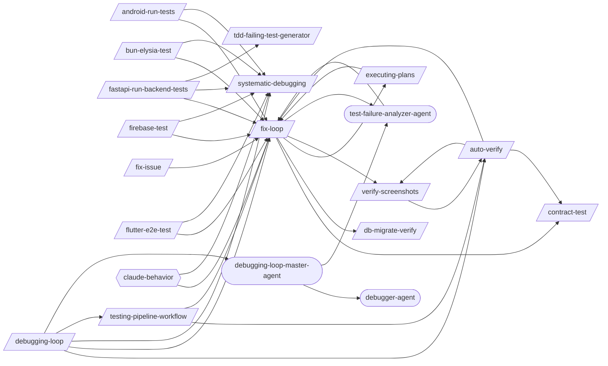

# Debugging Loop

> Targeted bug diagnosis and structured resolution.

> Auto-generated by `scripts/generate_workflow_docs.py` | Last updated: 2026-03-30 14:39 UTC

## Overview



## Detailed Flow

Step-level flow showing gates (diamonds), delegations (dashed), and artifacts (cylinders).

```mermaid
graph TD
    subgraph android_run_tests_sub["Android Run Tests"]
        android_run_tests_s1["Step 1: Detect Android Directory"]
        android_run_tests_s2["Step 2: Resolve Class Name"]
        android_run_tests_s1 --> android_run_tests_s2
        android_run_tests_s3["Step 3: Detect Test Type"]
        android_run_tests_s2 --> android_run_tests_s3
        android_run_tests_s4["Step 4: Verify Prerequisites"]
        android_run_tests_s3 --> android_run_tests_s4
        android_run_tests_s5["Step 5: Execute Tests"]
        android_run_tests_s4 --> android_run_tests_s5
        android_run_tests_s6["Step 6: Analyze Results"]
        android_run_tests_s5 --> android_run_tests_s6
        android_run_tests_s7["Step 7: Suggest Next Actions"]
        android_run_tests_s6 --> android_run_tests_s7
        fix_loop_ext([/fix-loop/])
        android_run_tests_s7 -.-> fix_loop_ext
        android_run_tests_s8{{Step 8: Structured JSON Output}}
        android_run_tests_s7 --> android_run_tests_s8
        android_run_tests_test_results_android_run_tests_json[("test-results/android-run-tests.json")]
        android_run_tests_s8 -->|writes| android_run_tests_test_results_android_run_tests_json
        android_run_tests_s9["Step 9: Auto-Fix and Learn (On Failure Only)"]
        android_run_tests_s8 --> android_run_tests_s9
        android_run_tests_s9 -.-> fix_loop_ext
        systematic_debugging_ext([/systematic-debugging/])
        android_run_tests_s9 -.-> systematic_debugging_ext
    end

    subgraph auto_verify_sub["Auto Verify"]
        auto_verify_s0{{Step 0: Gate Check — Read Upstream Results}}
        test_pipeline_agent_ext((test-pipeline-agent))
        auto_verify_s0 -.-> test_pipeline_agent_ext
        auto_verify_test_results_fix_loop_json[("test-results/fix-loop.json")]
        auto_verify_test_results_fix_loop_json -.->|reads| auto_verify_s0
        auto_verify_s0_block[/BLOCK/]
        auto_verify_s0 -->|FAILED| auto_verify_s0_block
        auto_verify_s1{{Step 1: Map Changes to Tests (via /regression-test)}}
        auto_verify_s0 -->|OK| auto_verify_s1
        regression_test_ext([/regression-test/])
        auto_verify_s1 -.-> regression_test_ext
        tester_agent_ext((tester-agent))
        auto_verify_s1 -.-> tester_agent_ext
        auto_verify_test_results_regression_test_json[("test-results/regression-test.json")]
        auto_verify_test_results_regression_test_json -.->|reads| auto_verify_s1
        auto_verify_s2{{Step 2: Execute Tests (via tester-agent)}}
        auto_verify_s1 --> auto_verify_s2
        verify_screenshots_ext([/verify-screenshots/])
        auto_verify_s2 -.-> verify_screenshots_ext
        auto_verify_s2 -.-> tester_agent_ext
        auto_verify_test_evidence_run_id_manifest_json[("test-evidence/{run_id}/manifest.json")]
        auto_verify_s2 -->|writes| auto_verify_test_evidence_run_id_manifest_json
        auto_verify_test_evidence_run_id_visual_review_json[("test-evidence/{run_id}/visual-review.json")]
        auto_verify_s2 -->|writes| auto_verify_test_evidence_run_id_visual_review_json
        auto_verify_s3{{Step 3: Evaluate Results}}
        auto_verify_s2 --> auto_verify_s3
        auto_verify_s3 -.-> fix_loop_ext
        auto_verify_s4{{Step 4: Quality Gate (if tests pass)}}
        auto_verify_s3 --> auto_verify_s4
        code_quality_gate_ext([/code-quality-gate/])
        auto_verify_s4 -.-> code_quality_gate_ext
        auto_verify_s4A{{Step 4A: Contract Verification (if API changed)}}
        auto_verify_s4 --> auto_verify_s4A
        contract_test_ext([/contract-test/])
        auto_verify_s4A -.-> contract_test_ext
        auto_verify_s4B{{Step 4B: Performance Baseline (if perf-sensitive code changed)}}
        auto_verify_s4A --> auto_verify_s4B
        perf_test_ext([/perf-test/])
        auto_verify_s4B -.-> perf_test_ext
        auto_verify_s5{{Step 5: Report}}
        auto_verify_s4B --> auto_verify_s5
        auto_verify_s6{{Step 6: Structured Output}}
        auto_verify_s5 --> auto_verify_s6
        auto_verify_test_results_auto_verify_json[("test-results/auto-verify.json")]
        auto_verify_s6 -->|writes| auto_verify_test_results_auto_verify_json
    end

    subgraph bun_elysia_test_sub["Bun Elysia Test"]
        bun_elysia_test_s1["Step 1: Detect Bun Project"]
        bun_elysia_test_s2["Step 2: Write Tests Using bun:test Patterns"]
        bun_elysia_test_s1 --> bun_elysia_test_s2
        bun_elysia_test_s3["Step 3: Test Elysia Endpoints with Eden Treaty"]
        bun_elysia_test_s2 --> bun_elysia_test_s3
        bun_elysia_test_s4["Step 4: Test Plugins (Lifecycle Hooks, Decorators)"]
        bun_elysia_test_s3 --> bun_elysia_test_s4
        bun_elysia_test_s5["Step 5: Test WebSocket Handlers"]
        bun_elysia_test_s4 --> bun_elysia_test_s5
        bun_elysia_test_s6["Step 6: Mock Dependencies with bun:test Spy and Mock"]
        bun_elysia_test_s5 --> bun_elysia_test_s6
        bun_elysia_test_s7["Step 7: Run Tests and Collect Results"]
        bun_elysia_test_s6 --> bun_elysia_test_s7
        bun_elysia_test_test_results_raw_output_json[("test-results/raw-output.json")]
        bun_elysia_test_s7 -->|writes| bun_elysia_test_test_results_raw_output_json
        bun_elysia_test_s8{{Step 8: Write Structured JSON Output}}
        bun_elysia_test_s7 --> bun_elysia_test_s8
        bun_elysia_test_test_results_bun_elysia_test_json[("test-results/bun-elysia-test.json")]
        bun_elysia_test_s8 -->|writes| bun_elysia_test_test_results_bun_elysia_test_json
        bun_elysia_test_s9["Step 9: Auto-Fix and Learn (On Failure Only)"]
        bun_elysia_test_s8 --> bun_elysia_test_s9
        bun_elysia_test_s9 -.-> fix_loop_ext
        bun_elysia_test_s9 -.-> systematic_debugging_ext
        bun_elysia_test_s9 -->|writes| bun_elysia_test_test_results_bun_elysia_test_json
    end

    subgraph contract_test_sub["Contract Test"]
        contract_test_s1["Step 1: Identify Consumers and Providers"]
        contract_test_s2["Step 2: Write Consumer Contract Tests"]
        contract_test_s1 --> contract_test_s2
        contract_test_s3["Step 3: Generate Pact Files"]
        contract_test_s2 --> contract_test_s3
        contract_test_s4["Step 4: Run Provider Verification"]
        contract_test_s3 --> contract_test_s4
        contract_test_s5["Step 5: Set Up Pact Broker (Optional)"]
        contract_test_s4 --> contract_test_s5
        contract_test_s6["Step 6: CI Integration"]
        contract_test_s5 --> contract_test_s6
    end

    subgraph db_migrate_verify_sub["Db Migrate Verify"]
        db_migrate_verify_s1["Step 1: Detect Migration Framework"]
        db_migrate_verify_s2["Step 2: Pre-Migration State"]
        db_migrate_verify_s1 --> db_migrate_verify_s2
        db_migrate_verify_s3["Step 3: Forward Migration"]
        db_migrate_verify_s2 --> db_migrate_verify_s3
        db_migrate_verify_s4["Step 4: Schema Validation"]
        db_migrate_verify_s3 --> db_migrate_verify_s4
        db_migrate_verify_s5["Step 5: Seed Data Test (if --seed-data)"]
        db_migrate_verify_s4 --> db_migrate_verify_s5
        db_migrate_verify_s6["Step 6: Rollback Verification (if --rollback or always)"]
        db_migrate_verify_s5 --> db_migrate_verify_s6
        db_migrate_verify_s7{{Step 7: Dangerous Operation Detection}}
        db_migrate_verify_s6 --> db_migrate_verify_s7
        db_migrate_verify_s7A["Step 7A: Real Database Testing (Testcontainers + Respawn)"]
        db_migrate_verify_s7 --> db_migrate_verify_s7A
        db_migrate_verify_s8["Step 8: Report"]
        db_migrate_verify_s7A --> db_migrate_verify_s8
    end

    subgraph executing_plans_sub["Executing Plans"]
        executing_plans_s1{{Step 1: Load and Validate the Plan}}
        executing_plans_s2["Step 2: Pre-Execution Setup"]
        executing_plans_s1 --> executing_plans_s2
        executing_plans_s3["Step 3: Execute Tasks"]
        executing_plans_s2 --> executing_plans_s3
        executing_plans_s4{{Step 4: Handle Failures}}
        executing_plans_s3 --> executing_plans_s4
        executing_plans_s4 -.-> fix_loop_ext
        executing_plans_s5["Step 5: Resume Support"]
        executing_plans_s4 --> executing_plans_s5
        continue_ext([/continue/])
        executing_plans_s5 -.-> continue_ext
        executing_plans_s6["Step 6: Completion Summary"]
        executing_plans_s5 --> executing_plans_s6
        executing_plans_s7["Step 7: Edge Cases and Special Handling"]
        executing_plans_s6 --> executing_plans_s7
    end

    subgraph fastapi_run_backend_tests_sub["Fastapi Run Backend Tests"]
        fastapi_run_backend_tests_s1["Step 1: Detect Backend Directory"]
        fastapi_run_backend_tests_s2["Step 2: Resolve Test Path"]
        fastapi_run_backend_tests_s1 --> fastapi_run_backend_tests_s2
        fastapi_run_backend_tests_s3["Step 3: Run Tests"]
        fastapi_run_backend_tests_s2 --> fastapi_run_backend_tests_s3
        fastapi_run_backend_tests_s4["Step 4: Analyze Results"]
        fastapi_run_backend_tests_s3 --> fastapi_run_backend_tests_s4
        fastapi_run_backend_tests_s5["Step 5: Suggest Next Actions"]
        fastapi_run_backend_tests_s4 --> fastapi_run_backend_tests_s5
        fastapi_run_backend_tests_s5 -.-> fix_loop_ext
        tdd_failing_test_generator_ext([/tdd-failing-test-generator/])
        fastapi_run_backend_tests_s5 -.-> tdd_failing_test_generator_ext
        fastapi_run_backend_tests_s6{{Step 6: Structured JSON Output}}
        fastapi_run_backend_tests_s5 --> fastapi_run_backend_tests_s6
        fastapi_run_backend_tests_test_results_fastapi_run_backend_tests_json[("test-results/fastapi-run-backend-tests.json")]
        fastapi_run_backend_tests_s6 -->|writes| fastapi_run_backend_tests_test_results_fastapi_run_backend_tests_json
        fastapi_run_backend_tests_s7["Step 7: Auto-Fix and Learn (On Failure Only)"]
        fastapi_run_backend_tests_s6 --> fastapi_run_backend_tests_s7
        fastapi_run_backend_tests_s7 -.-> fix_loop_ext
        fastapi_run_backend_tests_s7 -.-> systematic_debugging_ext
    end

    subgraph firebase_test_sub["Firebase Test"]
        firebase_test_s1{{Step 1: Detect Firebase Project Configuration}}
        firebase_test_s2["Step 2: Firebase Emulator Suite Setup and Startup"]
        firebase_test_s1 --> firebase_test_s2
        firebase_test_s3["Step 3: Firestore Security Rules Testing"]
        firebase_test_s2 --> firebase_test_s3
        firebase_test_s4["Step 4: Cloud Functions Unit Testing"]
        firebase_test_s3 --> firebase_test_s4
        firebase_test_s5["Step 5: Auth Trigger Testing"]
        firebase_test_s4 --> firebase_test_s5
        firebase_test_s6["Step 6: Firebase Test Lab Integration for Mobile"]
        firebase_test_s5 --> firebase_test_s6
        firebase_test_s7["Step 7: Test Data Seeding with Emulator"]
        firebase_test_s6 --> firebase_test_s7
        firebase_test_s8["Step 8: Run Tests and Collect Results"]
        firebase_test_s7 --> firebase_test_s8
        firebase_test_test_results_raw_output_json[("test-results/raw-output.json")]
        firebase_test_s8 -->|writes| firebase_test_test_results_raw_output_json
        firebase_test_s9{{Step 9: Write Structured JSON Output}}
        firebase_test_s8 --> firebase_test_s9
        firebase_test_test_results_firebase_test_json[("test-results/firebase-test.json")]
        firebase_test_s9 -->|writes| firebase_test_test_results_firebase_test_json
        firebase_test_s10["Step 10: Tear Down Emulators"]
        firebase_test_s9 --> firebase_test_s10
        firebase_test_s11{{Step 11: Auto-Fix and Learn (On Failure Only)}}
        firebase_test_s10 --> firebase_test_s11
        firebase_test_s11 -.-> fix_loop_ext
        firebase_test_s11 -.-> systematic_debugging_ext
        firebase_test_s11 -->|writes| firebase_test_test_results_firebase_test_json
    end

    subgraph fix_issue_sub["Fix Issue"]
        fix_issue_s1["Step 1: Fetch Issue Details"]
        fix_issue_s2["Step 2: Explore Codebase"]
        fix_issue_s1 --> fix_issue_s2
        fix_issue_s3["Step 3: Plan Implementation"]
        fix_issue_s2 --> fix_issue_s3
        fix_issue_s4["Step 4: Implement Fix"]
        fix_issue_s3 --> fix_issue_s4
        fix_issue_s5{{Step 5: Verify with Tests}}
        fix_issue_s4 --> fix_issue_s5
        fix_issue_s5 -.-> fix_loop_ext
        fix_issue_s6["Step 6: Post-Fix Pipeline"]
        fix_issue_s5 --> fix_issue_s6
        fix_issue_s7["Step 7: Summary"]
        fix_issue_s6 --> fix_issue_s7
    end

    subgraph fix_loop_sub["Fix Loop"]
        fix_loop_s1{{Step 1: Analyze Failure (via test-failure-analyzer-agent)}}
        test_failure_analyzer_agent_ext((test-failure-analyzer-agent))
        fix_loop_s1 -.-> test_failure_analyzer_agent_ext
        fix_loop_s1A["Step 1A: Flaky Test Detection"]
        fix_loop_s1 --> fix_loop_s1A
        fix_loop_s2["Step 2: Apply Fix"]
        fix_loop_s1A --> fix_loop_s2
        fix_loop_s3["Step 3: Retest (Full Loop mode only)"]
        fix_loop_s2 --> fix_loop_s3
        fix_loop_s4["Step 4: Report"]
        fix_loop_s3 --> fix_loop_s4
        fix_loop_s5{{Step 5: Structured Output}}
        fix_loop_s4 --> fix_loop_s5
        fix_loop_test_results_fix_loop_json[("test-results/fix-loop.json")]
        fix_loop_s5 -->|writes| fix_loop_test_results_fix_loop_json
    end

    subgraph flutter_e2e_test_sub["Flutter E2E Test"]
        flutter_e2e_test_s1["Step 1: Project Setup"]
        flutter_e2e_test_s2["Step 2: Writing E2E Tests"]
        flutter_e2e_test_s1 --> flutter_e2e_test_s2
        flutter_e2e_test_s3["Step 3: Test Patterns"]
        flutter_e2e_test_s2 --> flutter_e2e_test_s3
        flutter_e2e_test_s4["Step 4: Visual Regression Testing"]
        flutter_e2e_test_s3 --> flutter_e2e_test_s4
        flutter_e2e_test_s5["Step 5: Monkey / Fuzz Testing"]
        flutter_e2e_test_s4 --> flutter_e2e_test_s5
        flutter_e2e_test_s6["Step 6: Platform-Specific Execution"]
        flutter_e2e_test_s5 --> flutter_e2e_test_s6
        flutter_e2e_test_s7["Step 7: CI/CD Integration"]
        flutter_e2e_test_s6 --> flutter_e2e_test_s7
        flutter_e2e_test_s8{{Step 8: Structured JSON Output}}
        flutter_e2e_test_s7 --> flutter_e2e_test_s8
        flutter_e2e_test_test_results_flutter_e2e_test_json[("test-results/flutter-e2e-test.json")]
        flutter_e2e_test_s8 -->|writes| flutter_e2e_test_test_results_flutter_e2e_test_json
        flutter_e2e_test_s9["Step 9: Auto-Fix and Learn (On Failure Only)"]
        flutter_e2e_test_s8 --> flutter_e2e_test_s9
        flutter_e2e_test_s9 -.-> fix_loop_ext
        flutter_e2e_test_s9 -.-> systematic_debugging_ext
    end

    subgraph mobile_a11y_test_sub["Mobile A11Y Test"]
        mobile_a11y_test_s1["Step 1: Detect Platform"]
        mobile_a11y_test_s2["Step 2: Automated Checks"]
        mobile_a11y_test_s1 --> mobile_a11y_test_s2
        mobile_a11y_test_s3["Step 3: Content Description Audit"]
        mobile_a11y_test_s2 --> mobile_a11y_test_s3
        mobile_a11y_test_s4["Step 4: Touch Target Validation"]
        mobile_a11y_test_s3 --> mobile_a11y_test_s4
        mobile_a11y_test_s5["Step 5: Color Contrast Check"]
        mobile_a11y_test_s4 --> mobile_a11y_test_s5
        mobile_a11y_test_s6{{Step 6: Screen Reader Testing}}
        mobile_a11y_test_s5 --> mobile_a11y_test_s6
        mobile_a11y_test_s7{{Step 7: Report}}
        mobile_a11y_test_s6 --> mobile_a11y_test_s7
    end

    subgraph systematic_debugging_sub["Systematic Debugging"]
        systematic_debugging_s0["Step 0: Search Past Learnings"]
        systematic_debugging_s1["Step 1: Reproduce the Failure"]
        systematic_debugging_s0 --> systematic_debugging_s1
        systematic_debugging_s2["Step 2: Isolate the Failure"]
        systematic_debugging_s1 --> systematic_debugging_s2
        systematic_debugging_s3["Step 3: Form Hypotheses"]
        systematic_debugging_s2 --> systematic_debugging_s3
        systematic_debugging_s4{{Step 4: Gather Evidence}}
        systematic_debugging_s3 --> systematic_debugging_s4
        systematic_debugging_s5["Step 5: Root Cause Analysis"]
        systematic_debugging_s4 --> systematic_debugging_s5
        systematic_debugging_s6["Step 6: Apply a Targeted Fix"]
        systematic_debugging_s5 --> systematic_debugging_s6
        systematic_debugging_s7["Step 7: Verify the Fix"]
        systematic_debugging_s6 --> systematic_debugging_s7
        systematic_debugging_s8["Step 8: Prevent Recurrence"]
        systematic_debugging_s7 --> systematic_debugging_s8
        systematic_debugging_s9["Step 9: Auto-Record Learning (MANDATORY)"]
        systematic_debugging_s8 --> systematic_debugging_s9
    end

    subgraph tdd_failing_test_generator_sub["Tdd Failing Test Generator"]
        tdd_failing_test_generator_s1["Step 1: Parse Sources"]
        coverage_analysis_ext([/coverage-analysis/])
        tdd_failing_test_generator_s1 -.-> coverage_analysis_ext
        tdd_failing_test_generator_s2["Step 2: Detect Test Framework"]
        tdd_failing_test_generator_s1 --> tdd_failing_test_generator_s2
        tdd_failing_test_generator_s3["Step 3: Generate Shared Test Infrastructure"]
        tdd_failing_test_generator_s2 --> tdd_failing_test_generator_s3
        tdd_failing_test_generator_s4["Step 4: Generate Unit Tests"]
        tdd_failing_test_generator_s3 --> tdd_failing_test_generator_s4
        tdd_failing_test_generator_s5["Step 5: Generate API Tests"]
        tdd_failing_test_generator_s4 --> tdd_failing_test_generator_s5
        tdd_failing_test_generator_s6["Step 6: Generate E2E Test Stubs"]
        tdd_failing_test_generator_s5 --> tdd_failing_test_generator_s6
        tdd_failing_test_generator_s7["Step 7: Generate BDD Scenarios"]
        tdd_failing_test_generator_s6 --> tdd_failing_test_generator_s7
        tdd_failing_test_generator_s8["Step 8: Property-Based Tests"]
        tdd_failing_test_generator_s7 --> tdd_failing_test_generator_s8
        tdd_failing_test_generator_s9["Step 9: Coverage Configuration"]
        tdd_failing_test_generator_s8 --> tdd_failing_test_generator_s9
        tdd_failing_test_generator_s10["Step 10: Mutation Testing Setup"]
        tdd_failing_test_generator_s9 --> tdd_failing_test_generator_s10
        tdd_failing_test_generator_s11["Step 11: Snapshot Test Stubs"]
        tdd_failing_test_generator_s10 --> tdd_failing_test_generator_s11
        tdd_failing_test_generator_s12["Step 12: Accessibility Test Stubs"]
        tdd_failing_test_generator_s11 --> tdd_failing_test_generator_s12
        tdd_failing_test_generator_s13{{Step 13: Red Phase Gate Verification}}
        tdd_failing_test_generator_s12 --> tdd_failing_test_generator_s13
        tdd_failing_test_generator_s14{{Step 14: Output Summary & Structured Results}}
        tdd_failing_test_generator_s13 --> tdd_failing_test_generator_s14
        tdd_ext([/tdd/])
        tdd_failing_test_generator_s14 -.-> tdd_ext
        tdd_failing_test_generator_test_results_tdd_failing_test_generator_json[("test-results/tdd-failing-test-generator.json")]
        tdd_failing_test_generator_s14 -->|writes| tdd_failing_test_generator_test_results_tdd_failing_test_generator_json
    end

    subgraph verify_screenshots_sub["Verify Screenshots"]
        verify_screenshots_s1["Step 1: File Validation"]
        verify_screenshots_s1 -.-> tester_agent_ext
        verify_screenshots_s2["Step 2: Content Analysis"]
        verify_screenshots_s1 --> verify_screenshots_s2
        verify_screenshots_s3["Step 3: Before/After Comparison (if applicable)"]
        verify_screenshots_s2 --> verify_screenshots_s3
        verify_screenshots_s4{{Step 4: Report}}
        verify_screenshots_s3 --> verify_screenshots_s4
    end

    android_run_tests_s7 ==> fix_loop_s1
    android_run_tests_s9 ==> systematic_debugging_s0
    auto_verify_s4A ==> contract_test_s1
    auto_verify_s3 ==> fix_loop_s1
    auto_verify_s2 ==> verify_screenshots_s1
    bun_elysia_test_s9 ==> fix_loop_s1
    bun_elysia_test_s9 ==> systematic_debugging_s0
    executing_plans_s4 ==> fix_loop_s1
    fastapi_run_backend_tests_s5 ==> fix_loop_s1
    fastapi_run_backend_tests_s7 ==> systematic_debugging_s0
    fastapi_run_backend_tests_s5 ==> tdd_failing_test_generator_s1
    firebase_test_s11 ==> fix_loop_s1
    firebase_test_s11 ==> systematic_debugging_s0
    fix_issue_s5 ==> fix_loop_s1
    flutter_e2e_test_s9 ==> fix_loop_s1
    flutter_e2e_test_s9 ==> systematic_debugging_s0
```

## Skills

| Skill | Version | Description | Calls | Called By |
|-------|---------|-------------|-------|----------|
| `/ai-gemini-api` | 1.0.1 | Apply Google Gemini API patterns including client setup with google-genai SDK... | — | — |
| `/android-run-tests` | 2.1.0 | Run Android unit, UI, E2E, or journey tests with class name resolution and au... | `/fix-loop`, `/systematic-debugging` | — |
| `/auto-verify` | 3.0.0 | Run a verification pipeline that identifies changed files, maps to targeted t... | `/contract-test`, `/fix-loop`, `/verify-screenshots` | `/debugging-loop`, `/testing-pipeline-workflow`, `/verify-screenshots` |
| `/bun-elysia-test` | 1.1.0 | Run and validate tests for Bun + Elysia applications covering endpoints, plug... | `/fix-loop`, `/systematic-debugging` | — |
| `/contract-test` | 1.1.0 | Implement consumer-driven contract testing with Pact. Write consumer contract... | — | `/auto-verify`, `/fix-loop` |
| `/db-migrate-verify` | 1.0.0 | Verify database migrations: run forward, validate schema, run backward, valid... | — | `/fix-loop` |
| `/debugging-loop` | 1.0.0 | Investigate and resolve bugs through structured diagnosis, root cause isolati... | `/auto-verify`, `/fix-loop`, `/systematic-debugging`, `/testing-pipeline-workflow`, `/debugging-loop-master-agent` | — |
| `/executing-plans` | 1.0.0 | Execute a pre-written implementation plan step by step. Parses tasks from a p... | `/fix-loop` | `/fix-loop` |
| `/fastapi-run-backend-tests` | 2.1.0 | Run backend pytest with smart defaults, short-name resolution, and auto-fix o... | `/fix-loop`, `/systematic-debugging`, `/tdd-failing-test-generator` | — |
| `/firebase-test` | 1.1.1 | Run and validate Firebase application tests across security rules, Cloud Func... | `/fix-loop`, `/systematic-debugging` | — |
| `/fix-issue` | 1.0.0 | Analyze and implement a fix for a specific GitHub Issue. Fetches issue detail... | `/fix-loop` | — |
| `/fix-loop` | 1.2.0 | Analyze failures and iteratively apply minimal fixes, optionally retesting un... | `/contract-test`, `/db-migrate-verify`, `/executing-plans`, `/verify-screenshots`, `/test-failure-analyzer-agent` | `/android-run-tests`, `/auto-verify`, `/bun-elysia-test`, `/debugging-loop`, `/executing-plans`, `/fastapi-run-backend-tests`, `/firebase-test`, `/fix-issue`, `/flutter-e2e-test`, `/testing-pipeline-workflow`, `/test-failure-analyzer-agent` |
| `/flutter-e2e-test` | 1.2.1 | Run Flutter E2E tests across Android, Web, and desktop platforms with MCP-bas... | `/fix-loop`, `/systematic-debugging` | — |
| `/mobile-a11y-test` | 1.0.0 | Run mobile accessibility tests for Android (Compose/XML) and Flutter projects... | — | — |
| `/systematic-debugging` | 1.0.0 | Debug failures methodically using a structured diagnosis workflow: reproduce,... | — | `/android-run-tests`, `/bun-elysia-test`, `/debugging-loop`, `/fastapi-run-backend-tests`, `/firebase-test`, `/flutter-e2e-test` |
| `/tdd-failing-test-generator` | 2.0.0 | Generate test suites from PRD requirements, schema, or API specs. Produces sh... | — | `/fastapi-run-backend-tests` |
| `/testing-pipeline-workflow` | 1.0.0 | Run the complete test verification chain from TDD through quality gates. Use ... | `/auto-verify`, `/fix-loop` | `/debugging-loop` |
| `/verify-screenshots` | 2.0.0 | Validate screenshots against baselines using multimodal content analysis for ... | `/auto-verify` | `/auto-verify`, `/fix-loop` |

## Agents

| Agent | Description | Dispatched By |
|-------|-------------|---------------|
| `debugger-agent` | A senior software engineer specializing in debugging, system analysis, and pe... | `/debugging-loop-master-agent` |
| `debugging-loop-master-agent` | Orchestrate structured bug diagnosis and resolution: systematic debugging, ro... | `/debugging-loop` |
| `test-failure-analyzer-agent` | Use this agent to diagnose test failures — reads test output, classifies by r... | `/fix-loop`, `/debugging-loop-master-agent` |

## Rules

| Rule | Description |
|------|-------------|
| `claude-behavior` | Universal behavioral rules for how Claude should approach all tasks. |

## Cross-Workflow Connections

**Outgoing** (this workflow feeds into):
- `code-quality-gate` (skill)
- `code-review-workflow` (skill)
- `continue` (skill)
- `coverage-analysis` (skill)
- `e2e-conductor-agent` (agent)
- `perf-test` (skill)
- `post-fix-pipeline` (skill)
- `regression-test` (skill)
- `tdd` (skill)
- `test-pipeline-agent` (agent)
- `tester-agent` (agent)
- `testing-pipeline-master-agent` (agent)

**Incoming** (fed by):
- `android-run-e2e` (skill)
- `android-test-patterns` (skill)
- `anthropic-agent-orchestration-guide` (skill)
- `code-review-master-agent` (agent)
- `configuration-ssot` (rule)
- `development-loop` (skill)
- `e2e-best-practices` (skill)
- `e2e-visual-run` (skill)
- `implement` (skill)
- `pattern-self-containment` (rule)
- `project-manager-agent` (agent)
- `regression-test` (skill)
- `review-gate` (skill)
- `skill-factory` (skill)
- `skill-master` (skill)
- `ssot-audit` (skill)
- `subagent-driven-dev` (skill)
- `test-healer-agent` (agent)
- `tester-agent` (agent)
- `testing` (rule)
- `visual-inspector-agent` (agent)

<!-- MANUAL ANNOTATIONS -->
<!-- Add custom notes below this line. They are preserved on regeneration. -->
