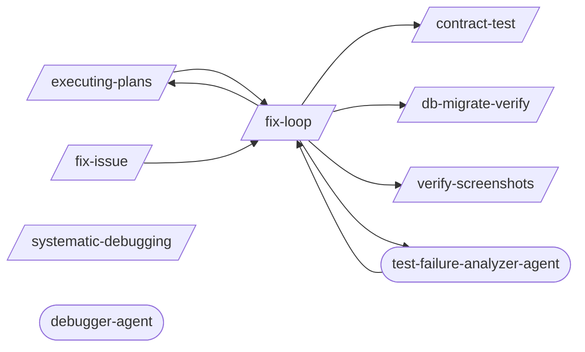

# Debugging Loop

> Targeted bug diagnosis and structured resolution.

> Auto-generated by `scripts/generate_workflow_docs.py` | Last updated: 2026-03-22 15:47 UTC

## Overview



## Detailed Flow

Step-level flow showing gates (diamonds), delegations (dashed), and artifacts (cylinders).

```mermaid
graph TD
    subgraph contract_test_sub["Contract Test"]
        contract_test_s1["Step 1: Identify Consumers and Providers"]
        contract_test_s2["Step 2: Write Consumer Contract Tests"]
        contract_test_s1 --> contract_test_s2
        contract_test_s3["Step 3: Generate Pact Files"]
        contract_test_s2 --> contract_test_s3
        contract_test_s4["Step 4: Run Provider Verification"]
        contract_test_s3 --> contract_test_s4
        contract_test_s5["Step 5: Set Up Pact Broker (Optional)"]
        contract_test_s4 --> contract_test_s5
        contract_test_s6["Step 6: CI Integration"]
        contract_test_s5 --> contract_test_s6
    end

    subgraph db_migrate_verify_sub["Db Migrate Verify"]
        db_migrate_verify_s1["Step 1: Detect Migration Framework"]
        db_migrate_verify_s2["Step 2: Pre-Migration State"]
        db_migrate_verify_s1 --> db_migrate_verify_s2
        db_migrate_verify_s3["Step 3: Forward Migration"]
        db_migrate_verify_s2 --> db_migrate_verify_s3
        db_migrate_verify_s4["Step 4: Schema Validation"]
        db_migrate_verify_s3 --> db_migrate_verify_s4
        db_migrate_verify_s5["Step 5: Seed Data Test (if --seed-data)"]
        db_migrate_verify_s4 --> db_migrate_verify_s5
        db_migrate_verify_s6["Step 6: Rollback Verification (if --rollback or always)"]
        db_migrate_verify_s5 --> db_migrate_verify_s6
        db_migrate_verify_s7{{Step 7: Dangerous Operation Detection}}
        db_migrate_verify_s6 --> db_migrate_verify_s7
        db_migrate_verify_s7A["Step 7A: Real Database Testing (Testcontainers + Respawn)"]
        db_migrate_verify_s7 --> db_migrate_verify_s7A
        db_migrate_verify_s8["Step 8: Report"]
        db_migrate_verify_s7A --> db_migrate_verify_s8
    end

    subgraph executing_plans_sub["Executing Plans"]
        executing_plans_s1{{Step 1: Load and Validate the Plan}}
        executing_plans_s2["Step 2: Pre-Execution Setup"]
        executing_plans_s1 --> executing_plans_s2
        executing_plans_s3{{Step 3: Execute Tasks}}
        executing_plans_s2 --> executing_plans_s3
        executing_plans_s4{{Step 4: Handle Failures}}
        executing_plans_s3 --> executing_plans_s4
        fix_loop_ext([/fix-loop/])
        executing_plans_s4 -.-> fix_loop_ext
        executing_plans_s5["Step 5: Resume Support"]
        executing_plans_s4 --> executing_plans_s5
        continue_ext([/continue/])
        executing_plans_s5 -.-> continue_ext
        executing_plans_s6["Step 6: Completion Summary"]
        executing_plans_s5 --> executing_plans_s6
        learn_n_improve_ext([/learn-n-improve/])
        executing_plans_s6 -.-> learn_n_improve_ext
        executing_plans_s7["Step 7: Edge Cases and Special Handling"]
        executing_plans_s6 --> executing_plans_s7
    end

    subgraph fix_issue_sub["Fix Issue"]
        fix_issue_s1["Step 1: Fetch Issue Details"]
        fix_issue_s2["Step 2: Explore Codebase"]
        fix_issue_s1 --> fix_issue_s2
        fix_issue_s3["Step 3: Plan Implementation"]
        fix_issue_s2 --> fix_issue_s3
        fix_issue_s4["Step 4: Implement Fix"]
        fix_issue_s3 --> fix_issue_s4
        fix_issue_s5{{Step 5: Verify with Tests}}
        fix_issue_s4 --> fix_issue_s5
        fix_issue_s5 -.-> fix_loop_ext
        fix_issue_s6["Step 6: Post-Fix Pipeline"]
        fix_issue_s5 --> fix_issue_s6
        fix_issue_s7["Step 7: Summary"]
        fix_issue_s6 --> fix_issue_s7
    end

    subgraph fix_loop_sub["Fix Loop"]
        fix_loop_s1{{Step 1: Analyze Failure (via test-failure-analyzer-agent)}}
        test_failure_analyzer_agent_ext((test-failure-analyzer-agent))
        fix_loop_s1 -.-> test_failure_analyzer_agent_ext
        fix_loop_s1A["Step 1A: Flaky Test Detection"]
        fix_loop_s1 --> fix_loop_s1A
        fix_loop_s2["Step 2: Apply Fix"]
        fix_loop_s1A --> fix_loop_s2
        fix_loop_s3["Step 3: Retest (Full Loop mode only)"]
        fix_loop_s2 --> fix_loop_s3
        fix_loop_s4["Step 4: Report"]
        fix_loop_s3 --> fix_loop_s4
        fix_loop_s5{{Step 5: Structured Output}}
        fix_loop_s4 --> fix_loop_s5
        fix_loop_test_results_fix_loop_json[("test-results/fix-loop.json")]
        fix_loop_s5 -->|writes| fix_loop_test_results_fix_loop_json
    end

    subgraph systematic_debugging_sub["Systematic Debugging"]
        systematic_debugging_s0["Step 0: Search Past Learnings"]
        systematic_debugging_s1["Step 1: Reproduce the Failure"]
        systematic_debugging_s0 --> systematic_debugging_s1
        systematic_debugging_s2["Step 2: Isolate the Failure"]
        systematic_debugging_s1 --> systematic_debugging_s2
        systematic_debugging_s3["Step 3: Form Hypotheses"]
        systematic_debugging_s2 --> systematic_debugging_s3
        systematic_debugging_s4{{Step 4: Gather Evidence}}
        systematic_debugging_s3 --> systematic_debugging_s4
        systematic_debugging_s5["Step 5: Root Cause Analysis"]
        systematic_debugging_s4 --> systematic_debugging_s5
        systematic_debugging_s6["Step 6: Apply a Targeted Fix"]
        systematic_debugging_s5 --> systematic_debugging_s6
        systematic_debugging_s7["Step 7: Verify the Fix"]
        systematic_debugging_s6 --> systematic_debugging_s7
        systematic_debugging_s8["Step 8: Prevent Recurrence"]
        systematic_debugging_s7 --> systematic_debugging_s8
        systematic_debugging_s9["Step 9: Auto-Record Learning (MANDATORY)"]
        systematic_debugging_s8 --> systematic_debugging_s9
    end

    subgraph verify_screenshots_sub["Verify Screenshots"]
        verify_screenshots_s1["Step 1: File Validation"]
        verify_screenshots_s2["Step 2: Content Analysis"]
        verify_screenshots_s1 --> verify_screenshots_s2
        verify_screenshots_s3["Step 3: Before/After Comparison (if applicable)"]
        verify_screenshots_s2 --> verify_screenshots_s3
        verify_screenshots_s4{{Step 4: Report}}
        verify_screenshots_s3 --> verify_screenshots_s4
    end

    executing_plans_s4 ==> fix_loop_s1
    fix_issue_s5 ==> fix_loop_s1
```

## Skills

| Skill | Version | Description | Calls | Called By |
|-------|---------|-------------|-------|----------|
| `/contract-test` | 1.1.0 | Implement consumer-driven contract testing with Pact. Write consumer contract... | — | `/fix-loop` |
| `/db-migrate-verify` | 1.0.0 | Verify database migrations: run forward, validate schema, run backward, valid... | — | `/fix-loop` |
| `/executing-plans` | 1.0.0 | Execute a pre-written implementation plan step by step. Parses tasks from a p... | `/fix-loop` | `/fix-loop` |
| `/fix-issue` | 1.0.0 | Analyze and implement a fix for a specific GitHub Issue. Fetches issue detail... | `/fix-loop` | — |
| `/fix-loop` | 1.2.0 | Iterative fix cycle: analyze failures, apply minimal fixes, optionally retest... | `/contract-test`, `/db-migrate-verify`, `/executing-plans`, `/verify-screenshots`, `/test-failure-analyzer-agent` | `/executing-plans`, `/fix-issue`, `/test-failure-analyzer-agent` |
| `/systematic-debugging` | 1.0.0 | Debug failures methodically using a structured diagnosis workflow: reproduce,... | — | — |
| `/verify-screenshots` | 1.1.0 | Visual regression testing and screenshot verification. Validates files, uses ... | — | `/fix-loop` |

## Agents

| Agent | Description | Dispatched By |
|-------|-------------|---------------|
| `debugger-agent` | A senior software engineer specializing in debugging, system analysis, and pe... | — |
| `test-failure-analyzer-agent` | Use this agent to diagnose test failures — reads test output, classifies by r... | `/fix-loop` |

## Cross-Workflow Connections

**Outgoing** (this workflow feeds into):
- `auto-verify` (skill)
- `continue` (skill)
- `learn-n-improve` (skill)

**Incoming** (fed by):
- `android-run-e2e` (skill)
- `android-run-tests` (skill)
- `anthropic-agent-orchestration-guide` (skill)
- `auto-verify` (skill)
- `claude-behavior` (rule)
- `fastapi-run-backend-tests` (skill)
- `implement` (skill)
- `pattern-self-containment` (rule)
- `project-manager-agent` (agent)
- `review-gate` (skill)
- `skill-factory` (skill)
- `skill-master` (skill)
- `ssot-audit` (skill)
- `subagent-driven-dev` (skill)
- `tester-agent` (agent)

<!-- MANUAL ANNOTATIONS -->
<!-- Add custom notes below this line. They are preserved on regeneration. -->
