# Debugging Loop

> Targeted bug diagnosis and structured resolution.

> Auto-generated by `scripts/generate_workflow_docs.py` | Last updated: 2026-04-23 14:59 UTC

## Overview

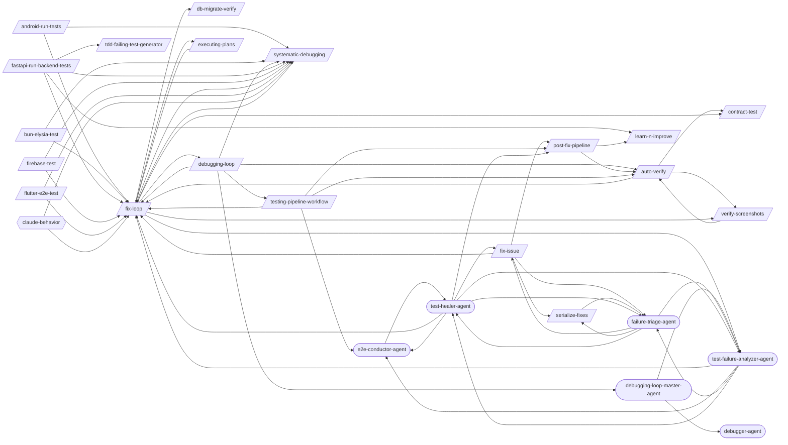

## Detailed Flow

Step-level flow showing gates (diamonds), delegations (dashed), and artifacts (cylinders).

```mermaid
graph TD
    subgraph android_run_tests_sub["Android Run Tests"]
        android_run_tests_s1["Step 1: Detect Android Directory"]
        android_run_tests_s2["Step 2: Resolve Class Name"]
        android_run_tests_s1 --> android_run_tests_s2
        android_run_tests_s3["Step 3: Detect Test Type"]
        android_run_tests_s2 --> android_run_tests_s3
        android_run_tests_s4["Step 4: Verify Prerequisites"]
        android_run_tests_s3 --> android_run_tests_s4
        android_run_tests_s5["Step 5: Execute Tests"]
        android_run_tests_s4 --> android_run_tests_s5
        android_run_tests_s6["Step 6: Analyze Results"]
        android_run_tests_s5 --> android_run_tests_s6
        android_run_tests_s7["Step 7: Suggest Next Actions"]
        android_run_tests_s6 --> android_run_tests_s7
        fix_loop_ext([/fix-loop/])
        android_run_tests_s7 -.-> fix_loop_ext
        android_run_tests_s8{{Step 8: Structured JSON Output}}
        android_run_tests_s7 --> android_run_tests_s8
        android_run_tests_test_results_android_run_tests_json[("test-results/android-run-tests.json")]
        android_run_tests_s8 -->|writes| android_run_tests_test_results_android_run_tests_json
        android_run_tests_s9["Step 9: Auto-Fix and Learn (On Failure Only)"]
        android_run_tests_s8 --> android_run_tests_s9
        android_run_tests_s9 -.-> fix_loop_ext
        systematic_debugging_ext([/systematic-debugging/])
        android_run_tests_s9 -.-> systematic_debugging_ext
    end

    subgraph auto_verify_sub["Auto Verify"]
        auto_verify_s0{{Step 0: Gate Check — Read Upstream Results}}
        test_pipeline_agent_ext((test-pipeline-agent))
        auto_verify_s0 -.-> test_pipeline_agent_ext
        auto_verify_test_results_fix_loop_json[("test-results/fix-loop.json")]
        auto_verify_test_results_fix_loop_json -.->|reads| auto_verify_s0
        auto_verify_s0_block[/BLOCK/]
        auto_verify_s0 -->|FAILED| auto_verify_s0_block
        auto_verify_s1{{Step 1: Map Changes to Tests (via /regression-test)}}
        auto_verify_s0 -->|OK| auto_verify_s1
        regression_test_ext([/regression-test/])
        auto_verify_s1 -.-> regression_test_ext
        tester_agent_ext((tester-agent))
        auto_verify_s1 -.-> tester_agent_ext
        auto_verify_test_results_regression_test_json[("test-results/regression-test.json")]
        auto_verify_test_results_regression_test_json -.->|reads| auto_verify_s1
        auto_verify_s2{{Step 2: Execute Tests (via tester-agent)}}
        auto_verify_s1 --> auto_verify_s2
        verify_screenshots_ext([/verify-screenshots/])
        auto_verify_s2 -.-> verify_screenshots_ext
        auto_verify_s2 -.-> tester_agent_ext
        auto_verify_test_evidence_run_id_manifest_json[("test-evidence/{run_id}/manifest.json")]
        auto_verify_s2 -->|writes| auto_verify_test_evidence_run_id_manifest_json
        auto_verify_test_evidence_run_id_visual_review_json[("test-evidence/{run_id}/visual-review.json")]
        auto_verify_s2 -->|writes| auto_verify_test_evidence_run_id_visual_review_json
        auto_verify_test_results_auto_verify_json[("test-results/auto-verify.json")]
        auto_verify_s2 -->|writes| auto_verify_test_results_auto_verify_json
        auto_verify_s3{{Step 3: Evaluate Results}}
        auto_verify_s2 --> auto_verify_s3
        auto_verify_s3 -.-> fix_loop_ext
        auto_verify_s4{{Step 4: Quality Gate (if tests pass)}}
        auto_verify_s3 --> auto_verify_s4
        code_quality_gate_ext([/code-quality-gate/])
        auto_verify_s4 -.-> code_quality_gate_ext
        auto_verify_s4A{{Step 4A: Contract Verification (if API changed)}}
        auto_verify_s4 --> auto_verify_s4A
        contract_test_ext([/contract-test/])
        auto_verify_s4A -.-> contract_test_ext
        auto_verify_s4B{{Step 4B: Performance Baseline (if perf-sensitive code changed)}}
        auto_verify_s4A --> auto_verify_s4B
        perf_test_ext([/perf-test/])
        auto_verify_s4B -.-> perf_test_ext
        auto_verify_s5{{Step 5: Report}}
        auto_verify_s4B --> auto_verify_s5
        auto_verify_s6{{Step 6: Structured Output}}
        auto_verify_s5 --> auto_verify_s6
        auto_verify_s6 -.-> fix_loop_ext
        auto_verify_s6 -.-> regression_test_ext
        auto_verify_s6 -.-> tester_agent_ext
        auto_verify_s6 -->|writes| auto_verify_test_results_auto_verify_json
    end

    subgraph bun_elysia_test_sub["Bun Elysia Test"]
        bun_elysia_test_s1["Step 1: Detect Bun Project"]
        bun_elysia_test_s2["Step 2: Write Tests Using bun:test Patterns"]
        bun_elysia_test_s1 --> bun_elysia_test_s2
        bun_elysia_test_s3["Step 3: Test Elysia Endpoints with Eden Treaty"]
        bun_elysia_test_s2 --> bun_elysia_test_s3
        bun_elysia_test_s4["Step 4: Test Plugins (Lifecycle Hooks, Decorators)"]
        bun_elysia_test_s3 --> bun_elysia_test_s4
        bun_elysia_test_s5["Step 5: Test WebSocket Handlers"]
        bun_elysia_test_s4 --> bun_elysia_test_s5
        bun_elysia_test_s6["Step 6: Mock Dependencies with bun:test Spy and Mock"]
        bun_elysia_test_s5 --> bun_elysia_test_s6
        bun_elysia_test_s7["Step 7: Run Tests and Collect Results"]
        bun_elysia_test_s6 --> bun_elysia_test_s7
        bun_elysia_test_test_results_raw_output_json[("test-results/raw-output.json")]
        bun_elysia_test_s7 -->|writes| bun_elysia_test_test_results_raw_output_json
        bun_elysia_test_s8{{Step 8: Write Structured JSON Output}}
        bun_elysia_test_s7 --> bun_elysia_test_s8
        bun_elysia_test_test_results_bun_elysia_test_json[("test-results/bun-elysia-test.json")]
        bun_elysia_test_s8 -->|writes| bun_elysia_test_test_results_bun_elysia_test_json
        bun_elysia_test_s9["Step 9: Auto-Fix and Learn (On Failure Only)"]
        bun_elysia_test_s8 --> bun_elysia_test_s9
        bun_elysia_test_s9 -.-> fix_loop_ext
        bun_elysia_test_s9 -.-> systematic_debugging_ext
        bun_elysia_test_s9 -->|writes| bun_elysia_test_test_results_bun_elysia_test_json
    end

    subgraph contract_test_sub["Contract Test"]
        contract_test_s1["Step 1: Identify Consumers and Providers"]
        contract_test_s2["Step 2: Write Consumer Contract Tests"]
        contract_test_s1 --> contract_test_s2
        contract_test_s3["Step 3: Generate Pact Files"]
        contract_test_s2 --> contract_test_s3
        contract_test_s4["Step 4: Run Provider Verification"]
        contract_test_s3 --> contract_test_s4
        contract_test_s5["Step 5: Set Up Pact Broker (Optional)"]
        contract_test_s4 --> contract_test_s5
        contract_test_s6["Step 6: CI Integration"]
        contract_test_s5 --> contract_test_s6
    end

    subgraph db_migrate_verify_sub["Db Migrate Verify"]
        db_migrate_verify_s1["Step 1: Detect Migration Framework"]
        db_migrate_verify_s2["Step 2: Pre-Migration State"]
        db_migrate_verify_s1 --> db_migrate_verify_s2
        db_migrate_verify_s3["Step 3: Forward Migration"]
        db_migrate_verify_s2 --> db_migrate_verify_s3
        db_migrate_verify_s4["Step 4: Schema Validation"]
        db_migrate_verify_s3 --> db_migrate_verify_s4
        db_migrate_verify_s5["Step 5: Seed Data Test (if --seed-data)"]
        db_migrate_verify_s4 --> db_migrate_verify_s5
        db_migrate_verify_s6["Step 6: Rollback Verification (if --rollback or always)"]
        db_migrate_verify_s5 --> db_migrate_verify_s6
        db_migrate_verify_s7{{Step 7: Dangerous Operation Detection}}
        db_migrate_verify_s6 --> db_migrate_verify_s7
        db_migrate_verify_s7A["Step 7A: Real Database Testing (Testcontainers + Respawn)"]
        db_migrate_verify_s7 --> db_migrate_verify_s7A
        db_migrate_verify_s8["Step 8: Report"]
        db_migrate_verify_s7A --> db_migrate_verify_s8
    end

    subgraph executing_plans_sub["Executing Plans"]
        executing_plans_s1{{Step 1: Load and Validate the Plan}}
        executing_plans_s2["Step 2: Pre-Execution Setup"]
        executing_plans_s1 --> executing_plans_s2
        executing_plans_s3["Step 3: Execute Tasks"]
        executing_plans_s2 --> executing_plans_s3
        executing_plans_s4{{Step 4: Handle Failures}}
        executing_plans_s3 --> executing_plans_s4
        executing_plans_s4 -.-> fix_loop_ext
        executing_plans_s5["Step 5: Resume Support"]
        executing_plans_s4 --> executing_plans_s5
        continue_ext([/continue/])
        executing_plans_s5 -.-> continue_ext
        executing_plans_s6["Step 6: Completion Summary"]
        executing_plans_s5 --> executing_plans_s6
        executing_plans_s7["Step 7: Edge Cases and Special Handling"]
        executing_plans_s6 --> executing_plans_s7
    end

    subgraph fastapi_run_backend_tests_sub["Fastapi Run Backend Tests"]
        fastapi_run_backend_tests_s1["Step 1: Detect Backend Directory"]
        fastapi_run_backend_tests_s2["Step 2: Resolve Test Path"]
        fastapi_run_backend_tests_s1 --> fastapi_run_backend_tests_s2
        fastapi_run_backend_tests_s3["Step 3: Run Tests"]
        fastapi_run_backend_tests_s2 --> fastapi_run_backend_tests_s3
        fastapi_run_backend_tests_s4["Step 4: Analyze Results"]
        fastapi_run_backend_tests_s3 --> fastapi_run_backend_tests_s4
        fastapi_run_backend_tests_s5["Step 5: Suggest Next Actions"]
        fastapi_run_backend_tests_s4 --> fastapi_run_backend_tests_s5
        fastapi_run_backend_tests_s5 -.-> fix_loop_ext
        tdd_failing_test_generator_ext([/tdd-failing-test-generator/])
        fastapi_run_backend_tests_s5 -.-> tdd_failing_test_generator_ext
        fastapi_run_backend_tests_s6{{Step 6: Structured JSON Output}}
        fastapi_run_backend_tests_s5 --> fastapi_run_backend_tests_s6
        fastapi_run_backend_tests_test_results_fastapi_run_backend_tests_json[("test-results/fastapi-run-backend-tests.json")]
        fastapi_run_backend_tests_s6 -->|writes| fastapi_run_backend_tests_test_results_fastapi_run_backend_tests_json
        fastapi_run_backend_tests_s7["Step 7: Auto-Fix and Learn (On Failure Only)"]
        fastapi_run_backend_tests_s6 --> fastapi_run_backend_tests_s7
        fastapi_run_backend_tests_s7 -.-> fix_loop_ext
        learn_n_improve_ext([/learn-n-improve/])
        fastapi_run_backend_tests_s7 -.-> learn_n_improve_ext
        fastapi_run_backend_tests_s7 -.-> systematic_debugging_ext
    end

    subgraph firebase_test_sub["Firebase Test"]
        firebase_test_s1{{Step 1: Detect Firebase Project Configuration}}
        firebase_test_s2["Step 2: Firebase Emulator Suite Setup and Startup"]
        firebase_test_s1 --> firebase_test_s2
        firebase_test_s3["Step 3: Firestore Security Rules Testing"]
        firebase_test_s2 --> firebase_test_s3
        firebase_test_s4["Step 4: Cloud Functions Unit Testing"]
        firebase_test_s3 --> firebase_test_s4
        firebase_test_s5["Step 5: Auth Trigger Testing"]
        firebase_test_s4 --> firebase_test_s5
        firebase_test_s6["Step 6: Firebase Test Lab Integration for Mobile"]
        firebase_test_s5 --> firebase_test_s6
        firebase_test_s7["Step 7: Test Data Seeding with Emulator"]
        firebase_test_s6 --> firebase_test_s7
        firebase_test_s8["Step 8: Run Tests and Collect Results"]
        firebase_test_s7 --> firebase_test_s8
        firebase_test_test_results_raw_output_json[("test-results/raw-output.json")]
        firebase_test_s8 -->|writes| firebase_test_test_results_raw_output_json
        firebase_test_s9{{Step 9: Write Structured JSON Output}}
        firebase_test_s8 --> firebase_test_s9
        firebase_test_test_results_firebase_test_json[("test-results/firebase-test.json")]
        firebase_test_s9 -->|writes| firebase_test_test_results_firebase_test_json
        firebase_test_s10["Step 10: Tear Down Emulators"]
        firebase_test_s9 --> firebase_test_s10
        firebase_test_s11{{Step 11: Auto-Fix and Learn (On Failure Only)}}
        firebase_test_s10 --> firebase_test_s11
        firebase_test_s11 -.-> fix_loop_ext
        firebase_test_s11 -.-> systematic_debugging_ext
        firebase_test_s11 -->|writes| firebase_test_test_results_firebase_test_json
    end

    subgraph fix_issue_sub["Fix Issue"]
        fix_issue_s1["Step 1: Fetch and Parse Issue"]
        fix_issue_s2["Step 2: Explore and Diagnose"]
        fix_issue_s1 --> fix_issue_s2
        fix_issue_s3{{Step 3: Implement and Test}}
        fix_issue_s2 --> fix_issue_s3
        fix_issue_s4["Step 4: Finalize"]
        fix_issue_s3 --> fix_issue_s4
        fix_issue_s4 -.-> fix_loop_ext
        post_fix_pipeline_ext([/post-fix-pipeline/])
        fix_issue_s4 -.-> post_fix_pipeline_ext
        serialize_fixes_ext([/serialize-fixes/])
        fix_issue_s4 -.-> serialize_fixes_ext
        failure_triage_agent_ext((failure-triage-agent))
        fix_issue_s4 -.-> failure_triage_agent_ext
        fix_issue_s5["Step 5: Summarize"]
        fix_issue_s4 --> fix_issue_s5
    end

    subgraph fix_loop_sub["Fix Loop"]
        fix_loop_s1{{Step 1: Analyze Failure (via test-failure-analyzer-agent)}}
        test_failure_analyzer_agent_ext((test-failure-analyzer-agent))
        fix_loop_s1 -.-> test_failure_analyzer_agent_ext
        fix_loop_s1A["Step 1A: Flaky Test Detection"]
        fix_loop_s1 --> fix_loop_s1A
        fix_loop_s2["Step 2: Apply Fix"]
        fix_loop_s1A --> fix_loop_s2
        fix_loop_s3["Step 3: Retest (Full Loop mode only)"]
        fix_loop_s2 --> fix_loop_s3
        fix_loop_s4["Step 4: Report"]
        fix_loop_s3 --> fix_loop_s4
        fix_loop_s5{{Step 5: Structured Output}}
        fix_loop_s4 --> fix_loop_s5
        fix_loop_test_results_fix_loop_json[("test-results/fix-loop.json")]
        fix_loop_s5 -->|writes| fix_loop_test_results_fix_loop_json
    end

    subgraph flutter_e2e_test_sub["Flutter E2E Test"]
        flutter_e2e_test_s1["Step 1: Project Setup"]
        flutter_e2e_test_s2["Step 2: Writing E2E Tests"]
        flutter_e2e_test_s1 --> flutter_e2e_test_s2
        flutter_e2e_test_s3["Step 3: Test Patterns"]
        flutter_e2e_test_s2 --> flutter_e2e_test_s3
        flutter_e2e_test_s4["Step 4: Visual Regression Testing"]
        flutter_e2e_test_s3 --> flutter_e2e_test_s4
        flutter_e2e_test_s5["Step 5: Monkey / Fuzz Testing"]
        flutter_e2e_test_s4 --> flutter_e2e_test_s5
        flutter_e2e_test_s6["Step 6: Platform-Specific Execution"]
        flutter_e2e_test_s5 --> flutter_e2e_test_s6
        flutter_e2e_test_s7["Step 7: CI/CD Integration"]
        flutter_e2e_test_s6 --> flutter_e2e_test_s7
        flutter_e2e_test_s8{{Step 8: Structured JSON Output}}
        flutter_e2e_test_s7 --> flutter_e2e_test_s8
        flutter_e2e_test_test_results_flutter_e2e_test_json[("test-results/flutter-e2e-test.json")]
        flutter_e2e_test_s8 -->|writes| flutter_e2e_test_test_results_flutter_e2e_test_json
        flutter_e2e_test_s9["Step 9: Auto-Fix and Learn (On Failure Only)"]
        flutter_e2e_test_s8 --> flutter_e2e_test_s9
        flutter_e2e_test_s9 -.-> fix_loop_ext
        flutter_e2e_test_s9 -.-> systematic_debugging_ext
    end

    subgraph learn_n_improve_sub["Learn N Improve"]
        learn_n_improve_s1{{Step 1: Gather Session Evidence}}
        learn_n_improve_test_results__json[("test-results/*.json")]
        learn_n_improve_s1 -->|writes| learn_n_improve_test_results__json
        learn_n_improve_s2["Step 2: Analyze Outcomes"]
        learn_n_improve_s1 --> learn_n_improve_s2
        learn_n_improve_s3{{Step 3: Build Error→Fix→Lesson Database}}
        learn_n_improve_s2 --> learn_n_improve_s3
        learn_n_improve_s4["Step 4: Update Memory Topics"]
        learn_n_improve_s3 --> learn_n_improve_s4
        learn_n_improve_s5{{Step 5: Pattern Detection (every 10th learning)}}
        learn_n_improve_s4 --> learn_n_improve_s5
        learn_n_improve_s6["Step 6: Report"]
        learn_n_improve_s5 --> learn_n_improve_s6
    end

    subgraph mobile_a11y_test_sub["Mobile A11Y Test"]
        mobile_a11y_test_s1["Step 1: Detect Platform"]
        mobile_a11y_test_s2["Step 2: Automated Checks"]
        mobile_a11y_test_s1 --> mobile_a11y_test_s2
        mobile_a11y_test_s3["Step 3: Content Description Audit"]
        mobile_a11y_test_s2 --> mobile_a11y_test_s3
        mobile_a11y_test_s4["Step 4: Touch Target Validation"]
        mobile_a11y_test_s3 --> mobile_a11y_test_s4
        mobile_a11y_test_s5["Step 5: Color Contrast Check"]
        mobile_a11y_test_s4 --> mobile_a11y_test_s5
        mobile_a11y_test_s6{{Step 6: Screen Reader Testing}}
        mobile_a11y_test_s5 --> mobile_a11y_test_s6
        mobile_a11y_test_s7{{Step 7: Report}}
        mobile_a11y_test_s6 --> mobile_a11y_test_s7
    end

    subgraph post_fix_pipeline_sub["Post Fix Pipeline"]
        post_fix_pipeline_s0{{Step 0: Gate Check — Read Upstream Results}}
        post_fix_pipeline_test_evidence__visual_review_json[("test-evidence/*/visual-review.json")]
        post_fix_pipeline_test_evidence__visual_review_json -.->|reads| post_fix_pipeline_s0
        post_fix_pipeline_test_results_auto_verify_json[("test-results/auto-verify.json")]
        post_fix_pipeline_test_results_auto_verify_json -.->|reads| post_fix_pipeline_s0
        post_fix_pipeline_s0_block[/BLOCK/]
        post_fix_pipeline_s0 -->|FAILED| post_fix_pipeline_s0_block
        post_fix_pipeline_s1{{Step 1: Documentation Updates}}
        post_fix_pipeline_s0 -->|OK| post_fix_pipeline_s1
        docs_manager_agent_ext((docs-manager-agent))
        post_fix_pipeline_s1 -.-> docs_manager_agent_ext
        post_fix_pipeline_s2{{Step 2: Git Commit}}
        post_fix_pipeline_s1 --> post_fix_pipeline_s2
        git_manager_agent_ext((git-manager-agent))
        post_fix_pipeline_s2 -.-> git_manager_agent_ext
        post_fix_pipeline_s3["Step 3: Learning Capture"]
        post_fix_pipeline_s2 --> post_fix_pipeline_s3
        post_fix_pipeline_s4{{Step 4: Structured JSON Output}}
        post_fix_pipeline_s3 --> post_fix_pipeline_s4
        post_fix_pipeline_s4 -.-> learn_n_improve_ext
        post_fix_pipeline_test_results_post_fix_pipeline_json[("test-results/post-fix-pipeline.json")]
        post_fix_pipeline_s4 -->|writes| post_fix_pipeline_test_results_post_fix_pipeline_json
    end

    subgraph serialize_fixes_sub["Serialize Fixes"]
        serialize_fixes_s0["Step 0: Resolve diff list"]
        serialize_fixes_s1["Step 1: Process each diff (three-phase atomic protocol)"]
        serialize_fixes_s0 --> serialize_fixes_s1
        serialize_fixes_s2{{Step 2: Return aggregated contract}}
        serialize_fixes_s1 --> serialize_fixes_s2
    end

    subgraph systematic_debugging_sub["Systematic Debugging"]
        systematic_debugging_s0["Step 0: Search Past Learnings"]
        systematic_debugging_s1["Step 1: Reproduce the Failure"]
        systematic_debugging_s0 --> systematic_debugging_s1
        systematic_debugging_s2["Step 2: Isolate the Failure"]
        systematic_debugging_s1 --> systematic_debugging_s2
        systematic_debugging_s3["Step 3: Form Hypotheses"]
        systematic_debugging_s2 --> systematic_debugging_s3
        systematic_debugging_s4{{Step 4: Gather Evidence}}
        systematic_debugging_s3 --> systematic_debugging_s4
        systematic_debugging_s5["Step 5: Root Cause Analysis"]
        systematic_debugging_s4 --> systematic_debugging_s5
        systematic_debugging_s6["Step 6: Apply a Targeted Fix"]
        systematic_debugging_s5 --> systematic_debugging_s6
        systematic_debugging_s7["Step 7: Verify the Fix"]
        systematic_debugging_s6 --> systematic_debugging_s7
        systematic_debugging_s8["Step 8: Prevent Recurrence"]
        systematic_debugging_s7 --> systematic_debugging_s8
        systematic_debugging_s9["Step 9: Auto-Record Learning (MANDATORY)"]
        systematic_debugging_s8 --> systematic_debugging_s9
    end

    subgraph tdd_failing_test_generator_sub["Tdd Failing Test Generator"]
        tdd_failing_test_generator_s1["Step 1: Parse Sources"]
        coverage_analysis_ext([/coverage-analysis/])
        tdd_failing_test_generator_s1 -.-> coverage_analysis_ext
        tdd_failing_test_generator_s2["Step 2: Detect Test Framework"]
        tdd_failing_test_generator_s1 --> tdd_failing_test_generator_s2
        tdd_failing_test_generator_s3["Step 3: Generate Shared Test Infrastructure"]
        tdd_failing_test_generator_s2 --> tdd_failing_test_generator_s3
        tdd_failing_test_generator_s4["Step 4: Generate Unit Tests"]
        tdd_failing_test_generator_s3 --> tdd_failing_test_generator_s4
        tdd_failing_test_generator_s5["Step 5: Generate API Tests"]
        tdd_failing_test_generator_s4 --> tdd_failing_test_generator_s5
        tdd_failing_test_generator_s6["Step 6: Generate E2E Test Stubs"]
        tdd_failing_test_generator_s5 --> tdd_failing_test_generator_s6
        tdd_failing_test_generator_s7["Step 7: Generate BDD Scenarios"]
        tdd_failing_test_generator_s6 --> tdd_failing_test_generator_s7
        tdd_failing_test_generator_s8["Step 8: Property-Based Tests"]
        tdd_failing_test_generator_s7 --> tdd_failing_test_generator_s8
        tdd_failing_test_generator_s9["Step 9: Coverage Configuration"]
        tdd_failing_test_generator_s8 --> tdd_failing_test_generator_s9
        tdd_failing_test_generator_s10["Step 10: Mutation Testing Setup"]
        tdd_failing_test_generator_s9 --> tdd_failing_test_generator_s10
        tdd_failing_test_generator_s11["Step 11: Snapshot Test Stubs"]
        tdd_failing_test_generator_s10 --> tdd_failing_test_generator_s11
        tdd_failing_test_generator_s12["Step 12: Accessibility Test Stubs"]
        tdd_failing_test_generator_s11 --> tdd_failing_test_generator_s12
        tdd_failing_test_generator_s13{{Step 13: Red Phase Gate Verification}}
        tdd_failing_test_generator_s12 --> tdd_failing_test_generator_s13
        tdd_failing_test_generator_s14{{Step 14: Output Summary & Structured Results}}
        tdd_failing_test_generator_s13 --> tdd_failing_test_generator_s14
        tdd_ext([/tdd/])
        tdd_failing_test_generator_s14 -.-> tdd_ext
        tdd_failing_test_generator_test_results_tdd_failing_test_generator_json[("test-results/tdd-failing-test-generator.json")]
        tdd_failing_test_generator_s14 -->|writes| tdd_failing_test_generator_test_results_tdd_failing_test_generator_json
    end

    subgraph verify_screenshots_sub["Verify Screenshots"]
        verify_screenshots_s1["Step 1: File Validation"]
        verify_screenshots_s1 -.-> tester_agent_ext
        verify_screenshots_s2["Step 2: Content Analysis"]
        verify_screenshots_s1 --> verify_screenshots_s2
        verify_screenshots_s3["Step 3: Before/After Comparison (if applicable)"]
        verify_screenshots_s2 --> verify_screenshots_s3
        verify_screenshots_s4{{Step 4: Report}}
        verify_screenshots_s3 --> verify_screenshots_s4
    end

    android_run_tests_s7 ==> fix_loop_s1
    android_run_tests_s9 ==> systematic_debugging_s0
    auto_verify_s4A ==> contract_test_s1
    auto_verify_s3 ==> fix_loop_s1
    auto_verify_s2 ==> verify_screenshots_s1
    bun_elysia_test_s9 ==> fix_loop_s1
    bun_elysia_test_s9 ==> systematic_debugging_s0
    executing_plans_s4 ==> fix_loop_s1
    fastapi_run_backend_tests_s5 ==> fix_loop_s1
    fastapi_run_backend_tests_s7 ==> learn_n_improve_s1
    fastapi_run_backend_tests_s7 ==> systematic_debugging_s0
    fastapi_run_backend_tests_s5 ==> tdd_failing_test_generator_s1
    firebase_test_s11 ==> fix_loop_s1
    firebase_test_s11 ==> systematic_debugging_s0
    fix_issue_s4 ==> fix_loop_s1
    fix_issue_s4 ==> post_fix_pipeline_s0
    fix_issue_s4 ==> serialize_fixes_s0
    flutter_e2e_test_s9 ==> fix_loop_s1
    flutter_e2e_test_s9 ==> systematic_debugging_s0
    post_fix_pipeline_s4 ==> learn_n_improve_s1
```

## Skills

| Skill | Version | Description | Calls | Called By |
|-------|---------|-------------|-------|----------|
| `/ai-gemini-api` | 1.0.1 | Apply Google Gemini API patterns including client setup with google-genai SDK... | — | — |
| `/android-run-tests` | 2.2.0 | Run Android unit, UI, E2E, or journey tests with class name resolution and au... | `/fix-loop`, `/systematic-debugging` | — |
| `/auto-verify` | 4.0.0 | Run a post-change verification pipeline that maps changed files to targeted t... | `/contract-test`, `/fix-loop`, `/verify-screenshots` | `/debugging-loop`, `/post-fix-pipeline`, `/testing-pipeline-workflow`, `/verify-screenshots` |
| `/bun-elysia-test` | 1.1.0 | Run and validate tests for Bun + Elysia applications covering endpoints, plug... | `/fix-loop`, `/systematic-debugging` | — |
| `/contract-test` | 1.1.0 | Implement consumer-driven contract testing with Pact. Write consumer contract... | — | `/auto-verify`, `/fix-loop` |
| `/db-migrate-verify` | 1.0.0 | Verify database migrations: run forward, validate schema, run backward, valid... | — | `/fix-loop` |
| `/debugging-loop` | 1.1.0 | Orchestrate the full bug resolution cycle by chaining four skills: systematic... | `/auto-verify`, `/fix-loop`, `/systematic-debugging`, `/testing-pipeline-workflow`, `/debugging-loop-master-agent` | `/fix-loop` |
| `/executing-plans` | 1.0.0 | Execute a pre-written implementation plan step by step. Parses tasks from a p... | `/fix-loop` | `/fix-loop` |
| `/fastapi-run-backend-tests` | 2.2.0 | Run backend pytest with smart defaults, short-name resolution, and auto-fix o... | `/fix-loop`, `/learn-n-improve`, `/systematic-debugging`, `/tdd-failing-test-generator` | — |
| `/firebase-test` | 1.1.1 | Run and validate Firebase application tests across security rules, Cloud Func... | `/fix-loop`, `/systematic-debugging` | — |
| `/fix-issue` | 2.6.0 | Analyze and implement a fix for a specific GitHub Issue. Fetches issue detail... | `/fix-loop`, `/post-fix-pipeline`, `/serialize-fixes`, `/failure-triage-agent` | `/failure-triage-agent`, `/test-healer-agent` |
| `/fix-loop` | 1.4.0 | Analyze failures and iteratively apply minimal fixes, optionally retesting un... | `/contract-test`, `/db-migrate-verify`, `/debugging-loop`, `/executing-plans`, `/systematic-debugging`, `/verify-screenshots`, `/test-failure-analyzer-agent` | `/android-run-tests`, `/auto-verify`, `/bun-elysia-test`, `/debugging-loop`, `/executing-plans`, `/fastapi-run-backend-tests`, `/firebase-test`, `/fix-issue`, `/flutter-e2e-test`, `/systematic-debugging`, `/testing-pipeline-workflow`, `/test-failure-analyzer-agent`, `/test-healer-agent` |
| `/flutter-e2e-test` | 1.2.1 | Run Flutter E2E tests across Android, Web, and desktop platforms with MCP-bas... | `/fix-loop`, `/systematic-debugging` | — |
| `/learn-n-improve` | 2.4.0 | Analyze session outcomes and update memory topics (testing-lessons, fix-patte... | — | `/fastapi-run-backend-tests`, `/post-fix-pipeline` |
| `/mobile-a11y-test` | 1.0.0 | Run mobile accessibility tests for Android (Compose/XML) and Flutter projects... | — | — |
| `/post-fix-pipeline` | 3.1.0 | Finalize verified changes by reading the upstream auto-verify gate, updating ... | `/auto-verify`, `/learn-n-improve` | `/fix-issue`, `/testing-pipeline-workflow`, `/test-healer-agent` |
| `/serialize-fixes` | 1.1.0 | Apply a list of unified-diff files sequentially to the working tree using the... | `/failure-triage-agent` | `/fix-issue`, `/failure-triage-agent` |
| `/systematic-debugging` | 1.1.0 | Debug failures methodically using a structured diagnosis workflow: reproduce,... | `/fix-loop` | `/android-run-tests`, `/bun-elysia-test`, `/debugging-loop`, `/fastapi-run-backend-tests`, `/firebase-test`, `/fix-loop`, `/flutter-e2e-test` |
| `/tdd-failing-test-generator` | 2.1.0 | Generate test suites from PRD requirements, schema, or API specs. Produces sh... | — | `/fastapi-run-backend-tests` |
| `/testing-pipeline-workflow` | 1.2.0 | Run the complete test verification chain from TDD through quality gates. Use ... | `/auto-verify`, `/fix-loop`, `/post-fix-pipeline`, `/e2e-conductor-agent` | `/debugging-loop` |
| `/verify-screenshots` | 2.2.0 | Validate screenshots against baselines using multimodal content analysis for ... | `/auto-verify` | `/auto-verify`, `/fix-loop` |

## Workflow Steps

### Entry Points

Double-bordered nodes are user-facing entry points (no incoming references). Rounded nodes are agents.

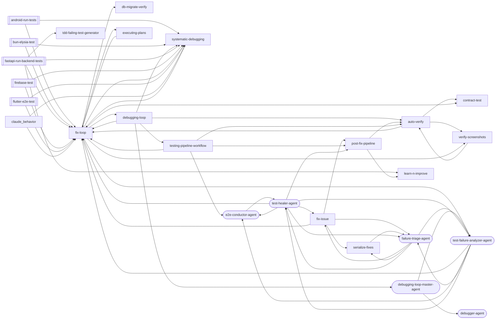

### android-run-tests

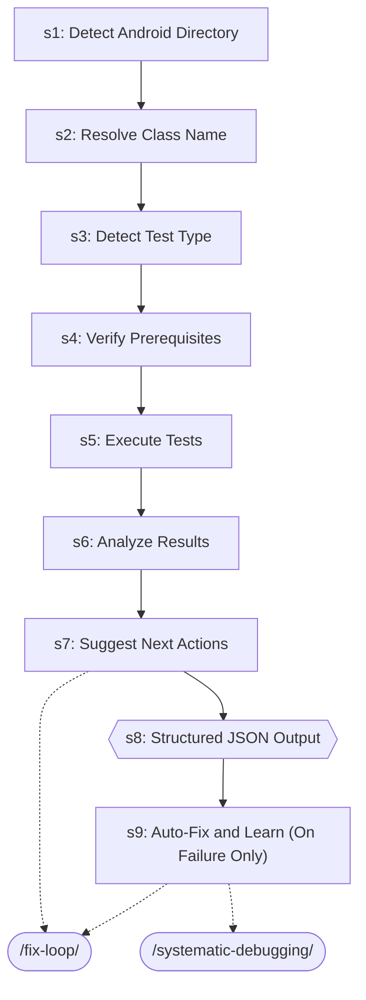

| Step | Title | Delegates To | Artifacts | Gates/Decisions |
|------|-------|-------------|-----------|----------------|
| 1 | Detect Android Directory | — | — | — |
| 2 | Resolve Class Name | — | — | — |
| 3 | Detect Test Type | — | — | — |
| 4 | Verify Prerequisites | — | — | — |
| 5 | Execute Tests | — | — | — |
| 6 | Analyze Results | — | — | — |
| 7 | Suggest Next Actions | `/fix-loop` | — | — |
| 8 | Structured JSON Output | — | → `test-results/android-run-tests.json` | gate, decision |
| 9 | Auto-Fix and Learn (On Failure Only) | `/fix-loop`, `/systematic-debugging` | — | decision |

### auto-verify

```mermaid
graph TD
    s0{{s0: Gate Check — Read Upstream Results}}
    test_pipeline_agent_ext((test-pipeline-agent))
    s0 -.-> test_pipeline_agent_ext
    s0_block[/BLOCK/]
    s0 -->|FAILED| s0_block
    s1{{s1: Map Changes to Tests (via /regression-test)}}
    s0 -->|OK| s1
    regression_test_ext([/regression-test/])
    s1 -.-> regression_test_ext
    tester_agent_ext((tester-agent))
    s1 -.-> tester_agent_ext
    s2{{s2: Execute Tests (via tester-agent)}}
    s1 --> s2
    verify_screenshots_ext([/verify-screenshots/])
    s2 -.-> verify_screenshots_ext
    tester_agent_ext((tester-agent))
    s2 -.-> tester_agent_ext
    s3{{s3: Evaluate Results}}
    s2 --> s3
    fix_loop_ext([/fix-loop/])
    s3 -.-> fix_loop_ext
    s4{{s4: Quality Gate (if tests pass)}}
    s3 --> s4
    code_quality_gate_ext([/code-quality-gate/])
    s4 -.-> code_quality_gate_ext
    s4A{{s4A: Contract Verification (if API changed)}}
    s4 --> s4A
    contract_test_ext([/contract-test/])
    s4A -.-> contract_test_ext
    s4B{{s4B: Performance Baseline (if perf-sensitive code changed)}}
    s4A --> s4B
    perf_test_ext([/perf-test/])
    s4B -.-> perf_test_ext
    s5{{s5: Report}}
    s4B --> s5
    s6{{s6: Structured Output}}
    s5 --> s6
    fix_loop_ext([/fix-loop/])
    s6 -.-> fix_loop_ext
    regression_test_ext([/regression-test/])
    s6 -.-> regression_test_ext
    tester_agent_ext((tester-agent))
    s6 -.-> tester_agent_ext
```

| Step | Title | Delegates To | Artifacts | Gates/Decisions |
|------|-------|-------------|-----------|----------------|
| 0 | Gate Check — Read Upstream Results | `test-pipeline-agent` | → `test-results/fix-loop.json`, ← `test-results/fix-loop.json` | gate, decision, BLOCK, STEP 1 |
| 1 | Map Changes to Tests (via /regression-test) | `/regression-test`, `tester-agent` | → `test-results/regression-test.json`, ← `test-results/regression-test.json` | gate, decision |
| 2 | Execute Tests (via tester-agent) | `/verify-screenshots`, `tester-agent` | → `test-evidence/{run_id}/manifest.json`, → `test-evidence/{run_id}/visual-review.json`, → `test-results/auto-verify.json` | gate, decision, STEP 3, STEP 2 |
| 3 | Evaluate Results | `/fix-loop` | — | gate, STEP 4 |
| 4 | Quality Gate (if tests pass) | `/code-quality-gate` | — | gate, decision |
| 4A | Contract Verification (if API changed) | `/contract-test` | — | gate, decision |
| 4B | Performance Baseline (if perf-sensitive code changed) | `/perf-test` | — | gate, decision |
| 5 | Report | — | — | gate |
| 6 | Structured Output | `/fix-loop`, `/regression-test`, `tester-agent` | → `test-results/auto-verify.json` | gate, decision |

### bun-elysia-test

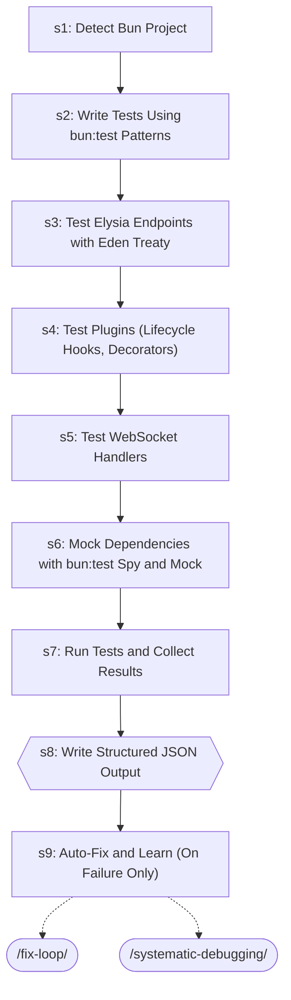

| Step | Title | Delegates To | Artifacts | Gates/Decisions |
|------|-------|-------------|-----------|----------------|
| 1 | Detect Bun Project | — | — | decision |
| 2 | Write Tests Using bun:test Patterns | — | — | — |
| 3 | Test Elysia Endpoints with Eden Treaty | — | — | — |
| 4 | Test Plugins (Lifecycle Hooks, Decorators) | — | — | decision |
| 5 | Test WebSocket Handlers | — | — | — |
| 6 | Mock Dependencies with bun:test Spy and Mock | — | — | — |
| 7 | Run Tests and Collect Results | — | → `test-results/raw-output.json` | — |
| 8 | Write Structured JSON Output | — | → `test-results/bun-elysia-test.json` | gate, decision |
| 9 | Auto-Fix and Learn (On Failure Only) | `/fix-loop`, `/systematic-debugging` | → `test-results/bun-elysia-test.json` | decision |

### contract-test

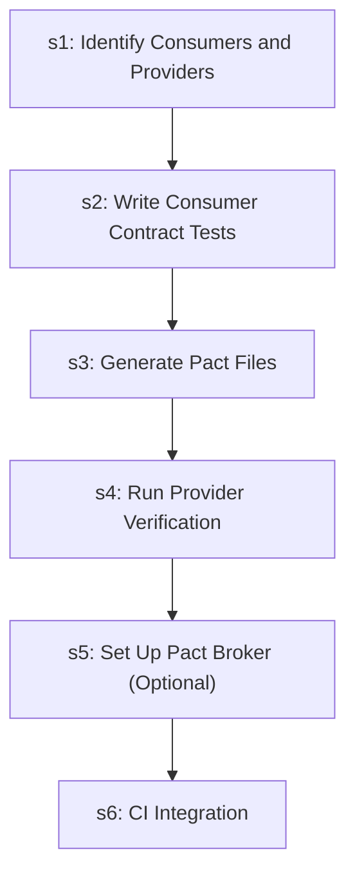

| Step | Title | Delegates To | Artifacts | Gates/Decisions |
|------|-------|-------------|-----------|----------------|
| 1 | Identify Consumers and Providers | — | — | — |
| 2 | Write Consumer Contract Tests | — | — | — |
| 3 | Generate Pact Files | — | — | — |
| 4 | Run Provider Verification | — | — | — |
| 5 | Set Up Pact Broker (Optional) | — | — | — |
| 6 | CI Integration | — | — | decision |

### db-migrate-verify

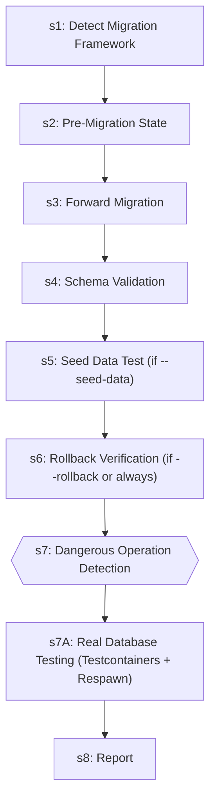

| Step | Title | Delegates To | Artifacts | Gates/Decisions |
|------|-------|-------------|-----------|----------------|
| 1 | Detect Migration Framework | — | — | — |
| 2 | Pre-Migration State | — | — | — |
| 3 | Forward Migration | — | — | — |
| 4 | Schema Validation | — | — | — |
| 5 | Seed Data Test (if --seed-data) | — | — | — |
| 6 | Rollback Verification (if --rollback or always) | — | — | — |
| 7 | Dangerous Operation Detection | — | — | gate, decision |
| 7A | Real Database Testing (Testcontainers + Respawn) | — | — | — |
| 8 | Report | — | — | decision |

### debugging-loop

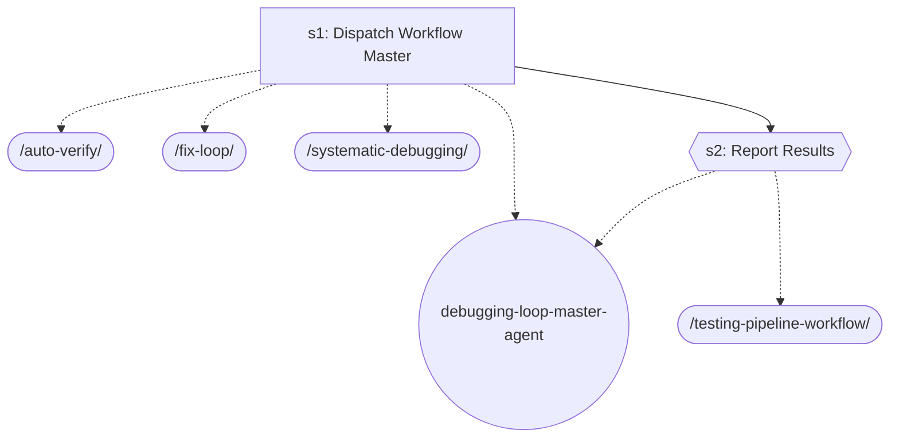

| Step | Title | Delegates To | Artifacts | Gates/Decisions |
|------|-------|-------------|-----------|----------------|
| 1 | Dispatch Workflow Master | `/auto-verify`, `/fix-loop`, `/systematic-debugging`, `debugging-loop-master-agent` | — | decision |
| 2 | Report Results | `/testing-pipeline-workflow`, `debugging-loop-master-agent` | — | gate |

### executing-plans

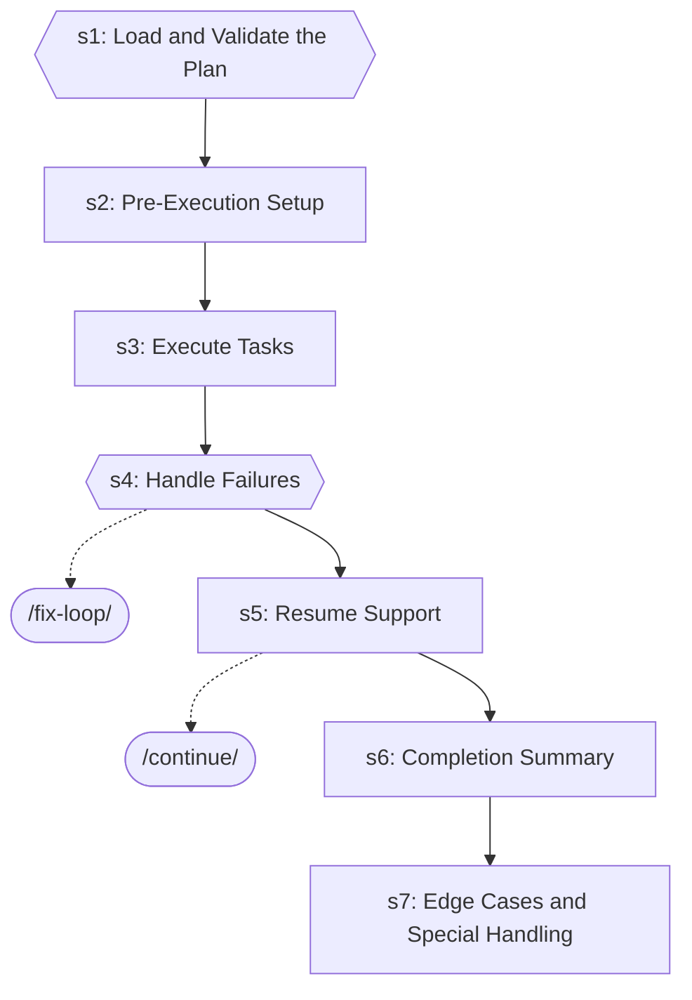

| Step | Title | Delegates To | Artifacts | Gates/Decisions |
|------|-------|-------------|-----------|----------------|
| 1 | Load and Validate the Plan | — | — | gate, decision |
| 2 | Pre-Execution Setup | — | — | — |
| 3 | Execute Tasks | — | — | — |
| 4 | Handle Failures | `/fix-loop` | — | gate, decision |
| 5 | Resume Support | `/continue` | — | decision |
| 6 | Completion Summary | — | — | — |
| 7 | Edge Cases and Special Handling | — | — | decision |

### fastapi-run-backend-tests

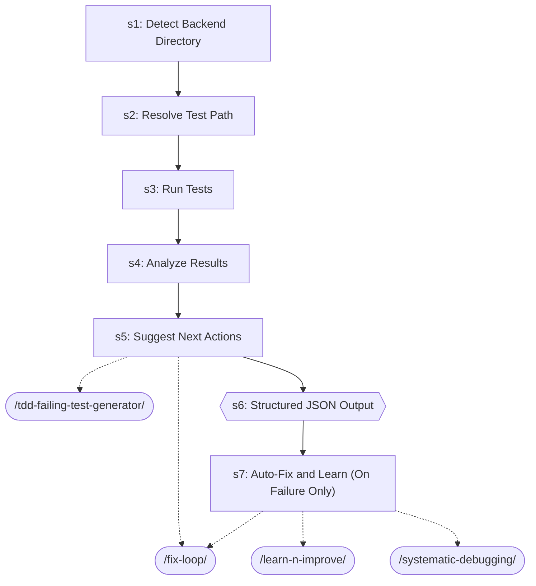

| Step | Title | Delegates To | Artifacts | Gates/Decisions |
|------|-------|-------------|-----------|----------------|
| 1 | Detect Backend Directory | — | — | — |
| 2 | Resolve Test Path | — | — | — |
| 3 | Run Tests | — | — | — |
| 4 | Analyze Results | — | — | — |
| 5 | Suggest Next Actions | `/fix-loop`, `/tdd-failing-test-generator` | — | — |
| 6 | Structured JSON Output | — | → `test-results/fastapi-run-backend-tests.json` | gate, decision |
| 7 | Auto-Fix and Learn (On Failure Only) | `/fix-loop`, `/learn-n-improve`, `/systematic-debugging` | — | decision |

### firebase-test

```mermaid
graph TD
    s1{{s1: Detect Firebase Project Configuration}}
    s2["s2: Firebase Emulator Suite Setup and Startup"]
    s1 --> s2
    s3["s3: Firestore Security Rules Testing"]
    s2 --> s3
    s4["s4: Cloud Functions Unit Testing"]
    s3 --> s4
    s5["s5: Auth Trigger Testing"]
    s4 --> s5
    s6["s6: Firebase Test Lab Integration for Mobile"]
    s5 --> s6
    s7["s7: Test Data Seeding with Emulator"]
    s6 --> s7
    s8["s8: Run Tests and Collect Results"]
    s7 --> s8
    s9{{s9: Write Structured JSON Output}}
    s8 --> s9
    s10["s10: Tear Down Emulators"]
    s9 --> s10
    s11{{s11: Auto-Fix and Learn (On Failure Only)}}
    s10 --> s11
    fix_loop_ext([/fix-loop/])
    s11 -.-> fix_loop_ext
    systematic_debugging_ext([/systematic-debugging/])
    s11 -.-> systematic_debugging_ext
```

| Step | Title | Delegates To | Artifacts | Gates/Decisions |
|------|-------|-------------|-----------|----------------|
| 1 | Detect Firebase Project Configuration | — | — | gate, decision |
| 2 | Firebase Emulator Suite Setup and Startup | — | — | decision |
| 3 | Firestore Security Rules Testing | — | — | — |
| 4 | Cloud Functions Unit Testing | — | — | — |
| 5 | Auth Trigger Testing | — | — | — |
| 6 | Firebase Test Lab Integration for Mobile | — | — | — |
| 7 | Test Data Seeding with Emulator | — | — | — |
| 8 | Run Tests and Collect Results | — | → `test-results/raw-output.json` | — |
| 9 | Write Structured JSON Output | — | → `test-results/firebase-test.json` | gate |
| 10 | Tear Down Emulators | — | — | — |
| 11 | Auto-Fix and Learn (On Failure Only) | `/fix-loop`, `/systematic-debugging` | → `test-results/firebase-test.json` | gate, decision |

### fix-issue

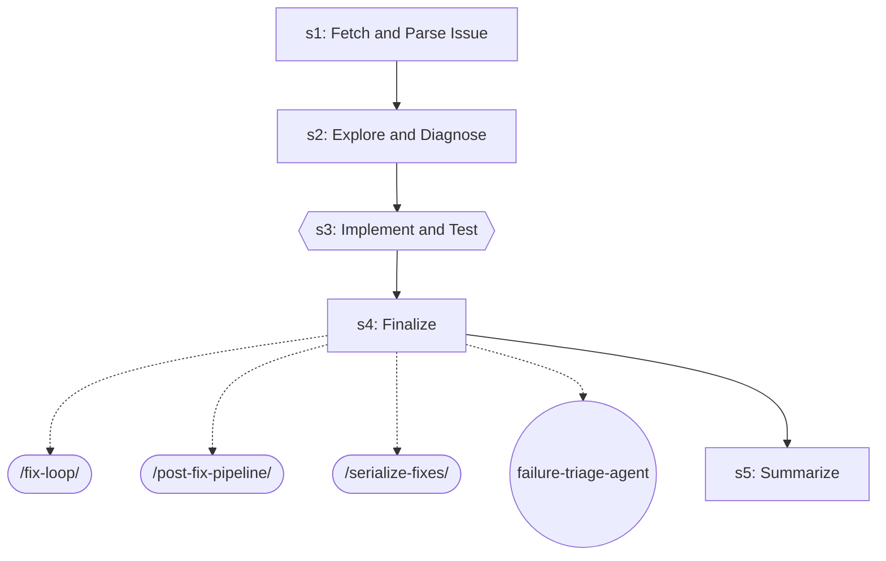

| Step | Title | Delegates To | Artifacts | Gates/Decisions |
|------|-------|-------------|-----------|----------------|
| 1 | Fetch and Parse Issue | — | — | — |
| 2 | Explore and Diagnose | — | — | — |
| 3 | Implement and Test | — | — | gate, decision |
| 4 | Finalize | `/fix-loop`, `/post-fix-pipeline`, `/serialize-fixes`, `failure-triage-agent` | — | — |
| 5 | Summarize | — | — | decision |

### fix-loop

```mermaid
graph TD
    s1{{s1: Analyze Failure (via test-failure-analyzer-agent)}}
    test_failure_analyzer_agent_ext((test-failure-analyzer-agent))
    s1 -.-> test_failure_analyzer_agent_ext
    s1A["s1A: Flaky Test Detection"]
    s1 --> s1A
    s2["s2: Apply Fix"]
    s1A --> s2
    s3["s3: Retest (Full Loop mode only)"]
    s2 --> s3
    s4["s4: Report"]
    s3 --> s4
    s5{{s5: Structured Output}}
    s4 --> s5
```

| Step | Title | Delegates To | Artifacts | Gates/Decisions |
|------|-------|-------------|-----------|----------------|
| 1 | Analyze Failure (via test-failure-analyzer-agent) | `test-failure-analyzer-agent` | — | gate, decision |
| 1A | Flaky Test Detection | — | — | decision |
| 2 | Apply Fix | — | — | — |
| 3 | Retest (Full Loop mode only) | — | — | decision |
| 4 | Report | — | — | — |
| 5 | Structured Output | — | → `test-results/fix-loop.json` | gate, decision |

### flutter-e2e-test

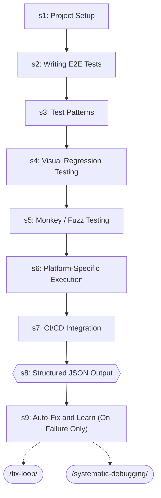

| Step | Title | Delegates To | Artifacts | Gates/Decisions |
|------|-------|-------------|-----------|----------------|
| 1 | Project Setup | — | — | — |
| 2 | Writing E2E Tests | — | — | — |
| 3 | Test Patterns | — | — | — |
| 4 | Visual Regression Testing | — | — | decision |
| 5 | Monkey / Fuzz Testing | — | — | — |
| 6 | Platform-Specific Execution | — | — | — |
| 7 | CI/CD Integration | — | — | — |
| 8 | Structured JSON Output | — | → `test-results/flutter-e2e-test.json` | gate, decision |
| 9 | Auto-Fix and Learn (On Failure Only) | `/fix-loop`, `/systematic-debugging` | — | decision |

### learn-n-improve

```mermaid
graph TD
    s1{{s1: Gather Session Evidence}}
    s2["s2: Analyze Outcomes"]
    s1 --> s2
    s3{{s3: Build Error→Fix→Lesson Database}}
    s2 --> s3
    s4["s4: Update Memory Topics"]
    s3 --> s4
    s5{{s5: Pattern Detection (every 10th learning)}}
    s4 --> s5
    s6["s6: Report"]
    s5 --> s6
```

| Step | Title | Delegates To | Artifacts | Gates/Decisions |
|------|-------|-------------|-----------|----------------|
| 1 | Gather Session Evidence | — | → `test-results/*.json` | gate, decision |
| 2 | Analyze Outcomes | — | — | — |
| 3 | Build Error→Fix→Lesson Database | — | — | gate, decision |
| 4 | Update Memory Topics | — | — | — |
| 5 | Pattern Detection (every 10th learning) | — | — | gate |
| 6 | Report | — | — | — |

### mobile-a11y-test

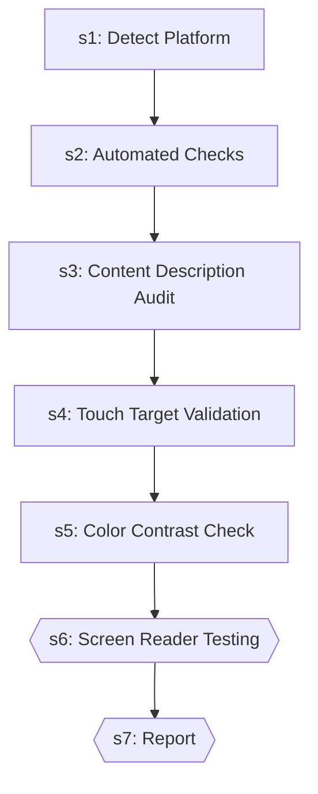

| Step | Title | Delegates To | Artifacts | Gates/Decisions |
|------|-------|-------------|-----------|----------------|
| 1 | Detect Platform | — | — | — |
| 2 | Automated Checks | — | — | — |
| 3 | Content Description Audit | — | — | — |
| 4 | Touch Target Validation | — | — | — |
| 5 | Color Contrast Check | — | — | — |
| 6 | Screen Reader Testing | — | — | gate |
| 7 | Report | — | — | gate |

### post-fix-pipeline

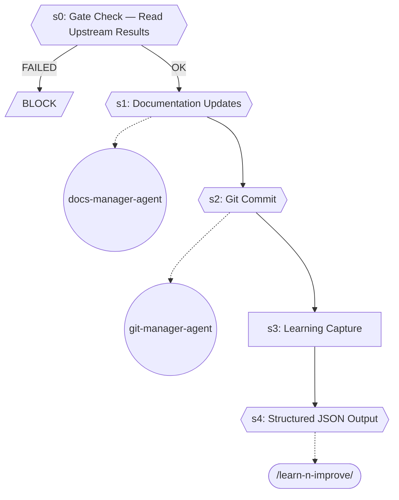

| Step | Title | Delegates To | Artifacts | Gates/Decisions |
|------|-------|-------------|-----------|----------------|
| 0 | Gate Check — Read Upstream Results | — | → `test-evidence/*/visual-review.json`, → `test-results/auto-verify.json`, ← `test-evidence/*/visual-review.json`, ← `test-results/auto-verify.json` | gate, decision, BLOCK |
| 1 | Documentation Updates | `docs-manager-agent` | — | gate |
| 2 | Git Commit | `git-manager-agent` | — | gate, decision |
| 3 | Learning Capture | — | — | — |
| 4 | Structured JSON Output | `/learn-n-improve` | → `test-results/post-fix-pipeline.json` | gate, decision |

### serialize-fixes

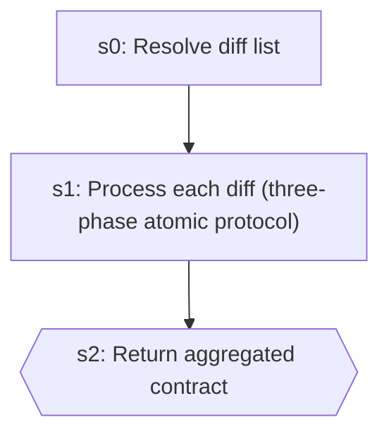

| Step | Title | Delegates To | Artifacts | Gates/Decisions |
|------|-------|-------------|-----------|----------------|
| 0 | Resolve diff list | — | — | decision |
| 1 | Process each diff (three-phase atomic protocol) | — | — | decision |
| 2 | Return aggregated contract | — | — | gate |

### systematic-debugging

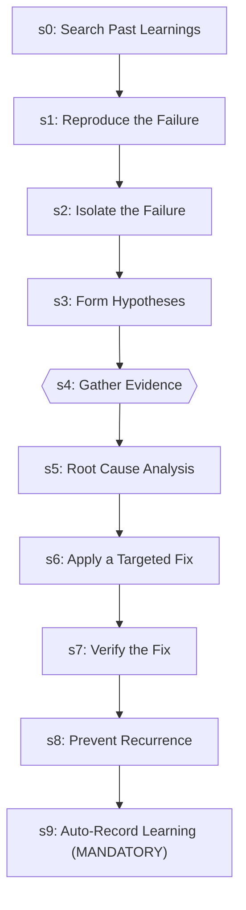

| Step | Title | Delegates To | Artifacts | Gates/Decisions |
|------|-------|-------------|-----------|----------------|
| 0 | Search Past Learnings | — | — | decision |
| 1 | Reproduce the Failure | — | — | decision |
| 2 | Isolate the Failure | — | — | decision |
| 3 | Form Hypotheses | — | — | — |
| 4 | Gather Evidence | — | — | gate |
| 5 | Root Cause Analysis | — | — | — |
| 6 | Apply a Targeted Fix | — | — | — |
| 7 | Verify the Fix | — | — | decision |
| 8 | Prevent Recurrence | — | — | — |
| 9 | Auto-Record Learning (MANDATORY) | — | — | decision |

### tdd-failing-test-generator

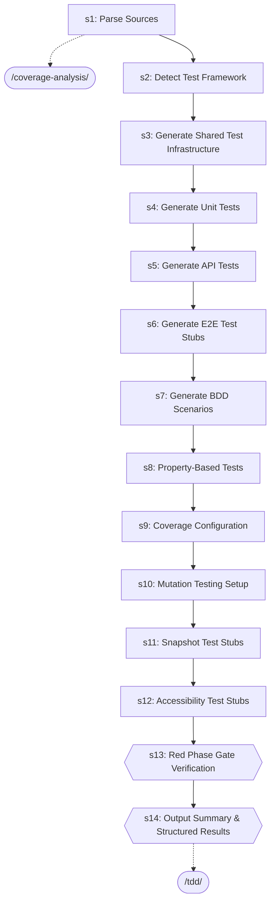

| Step | Title | Delegates To | Artifacts | Gates/Decisions |
|------|-------|-------------|-----------|----------------|
| 1 | Parse Sources | `/coverage-analysis` | — | — |
| 2 | Detect Test Framework | — | — | — |
| 3 | Generate Shared Test Infrastructure | — | — | — |
| 4 | Generate Unit Tests | — | — | — |
| 5 | Generate API Tests | — | — | — |
| 6 | Generate E2E Test Stubs | — | — | — |
| 7 | Generate BDD Scenarios | — | — | — |
| 8 | Property-Based Tests | — | — | — |
| 9 | Coverage Configuration | — | — | — |
| 10 | Mutation Testing Setup | — | — | — |
| 11 | Snapshot Test Stubs | — | — | — |
| 12 | Accessibility Test Stubs | — | — | — |
| 13 | Red Phase Gate Verification | — | — | gate, decision |
| 14 | Output Summary & Structured Results | `/tdd` | → `test-results/tdd-failing-test-generator.json` | gate |

### testing-pipeline-workflow

```mermaid
graph TD
    s1{{s1: Dispatch Workflow Master}}
    auto_verify_ext([/auto-verify/])
    s1 -.-> auto_verify_ext
    code_quality_gate_ext([/code-quality-gate/])
    s1 -.-> code_quality_gate_ext
    fix_loop_ext([/fix-loop/])
    s1 -.-> fix_loop_ext
    post_fix_pipeline_ext([/post-fix-pipeline/])
    s1 -.-> post_fix_pipeline_ext
    tdd_ext([/tdd/])
    s1 -.-> tdd_ext
    e2e_conductor_agent_ext((e2e-conductor-agent))
    s1 -.-> e2e_conductor_agent_ext
    testing_pipeline_master_agent_ext((testing-pipeline-master-agent))
    s1 -.-> testing_pipeline_master_agent_ext
    s2{{s2: Report Results}}
    s1 --> s2
    code_review_workflow_ext([/code-review-workflow/])
    s2 -.-> code_review_workflow_ext
    testing_pipeline_master_agent_ext((testing-pipeline-master-agent))
    s2 -.-> testing_pipeline_master_agent_ext
```

| Step | Title | Delegates To | Artifacts | Gates/Decisions |
|------|-------|-------------|-----------|----------------|
| 1 | Dispatch Workflow Master | `/auto-verify`, `/code-quality-gate`, `/fix-loop`, `/post-fix-pipeline`, `/tdd`, `e2e-conductor-agent`, `testing-pipeline-master-agent` | — | gate |
| 2 | Report Results | `/code-review-workflow`, `testing-pipeline-master-agent` | — | gate, decision |

### verify-screenshots

```mermaid
graph TD
    s1["s1: File Validation"]
    tester_agent_ext((tester-agent))
    s1 -.-> tester_agent_ext
    s2["s2: Content Analysis"]
    s1 --> s2
    s3["s3: Before/After Comparison (if applicable)"]
    s2 --> s3
    s4{{s4: Report}}
    s3 --> s4
```

| Step | Title | Delegates To | Artifacts | Gates/Decisions |
|------|-------|-------------|-----------|----------------|
| 1 | File Validation | `tester-agent` | — | decision |
| 2 | Content Analysis | — | — | — |
| 3 | Before/After Comparison (if applicable) | — | — | — |
| 4 | Report | — | — | gate, decision |


## Agents

| Agent | Description | Dispatched By |
|-------|-------------|---------------|
| `debugger-agent` | Use proactively to diagnose failures, analyze logs, investigate performance i... | `/debugging-loop-master-agent` |
| `debugging-loop-master-agent` | Orchestrate structured bug diagnosis and resolution: systematic debugging, ro... | `/debugging-loop` |
| `e2e-conductor-agent` | Orchestrate Playwright E2E test execution using queue-based dispatch of `test... | `/testing-pipeline-workflow`, `/test-failure-analyzer-agent`, `/test-healer-agent` |
| `failure-triage-agent` | T2B sub-orchestrator for the three-lane test pipeline (PR2). Process the cons... | `/fix-issue`, `/serialize-fixes`, `/test-failure-analyzer-agent`, `/test-healer-agent` |
| `test-failure-analyzer-agent` | Use proactively to diagnose test failures — reads test output, classifies by ... | `/fix-loop`, `/debugging-loop-master-agent`, `/failure-triage-agent`, `/test-healer-agent` |
| `test-healer-agent` | Use proactively to diagnose and fix Playwright E2E test failures from the fix... | `/e2e-conductor-agent`, `/failure-triage-agent`, `/test-failure-analyzer-agent` |

## Rules

| Rule | Description |
|------|-------------|
| `claude-behavior` |  |

## Cross-Workflow Connections

**Outgoing** (this workflow feeds into):
- `code-quality-gate` (skill)
- `code-review-workflow` (skill)
- `continue` (skill)
- `coverage-analysis` (skill)
- `docs-manager-agent` (agent)
- `e2e-visual-run` (skill)
- `escalation-report` (skill)
- `git-manager-agent` (agent)
- `github-issue-manager-agent` (agent)
- `perf-test` (skill)
- `regression-test` (skill)
- `skill-factory` (skill)
- `tdd` (skill)
- `test-pipeline-agent` (agent)
- `test-scout-agent` (agent)
- `tester-agent` (agent)
- `testing-pipeline-master-agent` (agent)
- `visual-inspector-agent` (agent)

**Incoming** (fed by):
- `agent-evaluator` (skill)
- `agent-orchestration` (rule)
- `android-run-e2e` (skill)
- `android-test-patterns` (skill)
- `anthropic-agent-orchestration-guide` (skill)
- `code-review-master-agent` (agent)
- `configuration-ssot` (rule)
- `development-loop` (skill)
- `e2e-best-practices` (skill)
- `e2e-visual-run` (skill)
- `escalation-report` (skill)
- `fastapi-api-tester-agent` (agent)
- `fastapi-db-migrate` (skill)
- `fastapi-deploy` (skill)
- `github-issue-manager-agent` (agent)
- `implement` (skill)
- `pattern-self-containment` (rule)
- `pattern-structure` (rule)
- `project-manager-agent` (agent)
- `regression-test` (skill)
- `review-gate` (skill)
- `save-session` (skill)
- `skill-factory` (skill)
- `skill-master` (skill)
- `ssot-audit` (skill)
- `subagent-driven-dev` (skill)
- `tdd` (skill)
- `test-data-management` (skill)
- `test-knowledge` (skill)
- `test-pipeline` (skill)
- `test-pipeline-agent` (agent)
- `test-scout-agent` (agent)
- `tester-agent` (agent)
- `testing` (rule)
- `testing-pipeline-master-agent` (agent)
- `visual-inspector-agent` (agent)

<!-- MANUAL ANNOTATIONS -->
<!-- Add custom notes below this line. They are preserved on regeneration. -->
