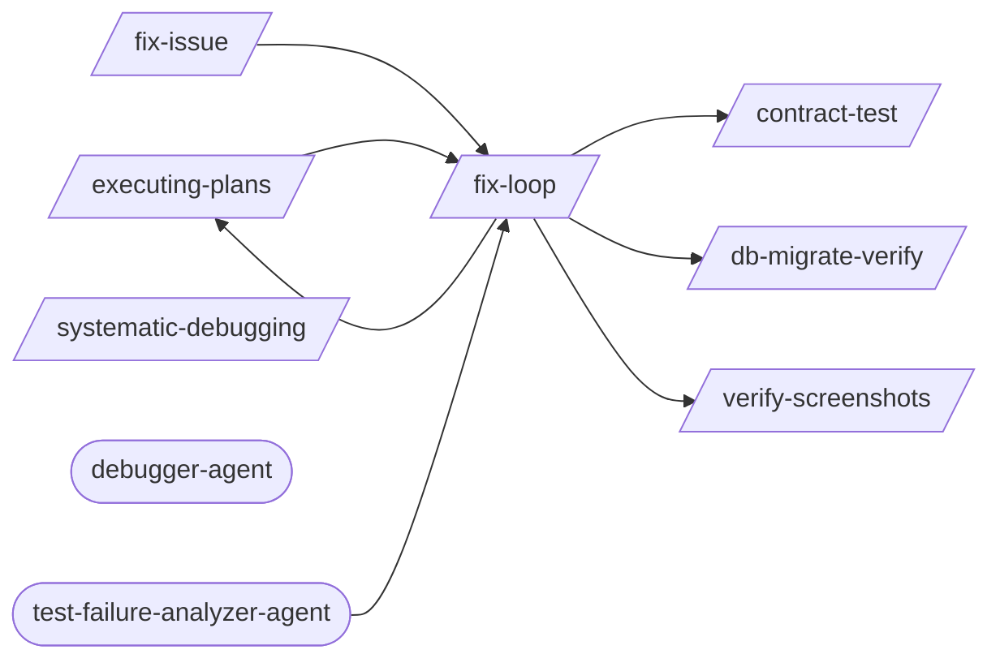

# Debugging Loop

> Targeted bug diagnosis and structured resolution.

> Auto-generated by `scripts/generate_workflow_docs.py` | Last updated: 2026-03-21 11:56 UTC

## Flow Diagram

## Skills

| Skill | Version | Description | Calls | Called By |
|-------|---------|-------------|-------|----------|
| `/contract-test` | 1.1.0 | Implement consumer-driven contract testing with Pact. Write consumer contract... | — | `/fix-loop` |
| `/db-migrate-verify` | 1.0.0 | Verify database migrations: run forward, validate schema, run backward, valid... | — | `/fix-loop` |
| `/executing-plans` | 1.0.0 | Execute a pre-written implementation plan step by step. Parses tasks from a p... | `/fix-loop` | `/fix-loop` |
| `/fix-issue` | 1.0.0 | Analyze and implement a fix for a specific GitHub Issue. Fetches issue detail... | `/fix-loop` | — |
| `/fix-loop` | 1.2.0 | Iterative fix cycle: analyze failures, apply minimal fixes, optionally retest... | `/contract-test`, `/db-migrate-verify`, `/executing-plans`, `/verify-screenshots` | `/executing-plans`, `/fix-issue`, `/test-failure-analyzer-agent` |
| `/systematic-debugging` | 1.0.0 | Debug failures methodically using a structured diagnosis workflow: reproduce,... | — | — |
| `/verify-screenshots` | 1.1.0 | Visual regression testing and screenshot verification. Validates files, uses ... | — | `/fix-loop` |

## Agents

| Agent | Description | Dispatched By |
|-------|-------------|---------------|
| `debugger-agent` | A senior software engineer specializing in debugging, system analysis, and pe... | — |
| `test-failure-analyzer-agent` | Use this agent to diagnose test failures — reads test output, classifies by r... | — |

## Cross-Workflow Connections

**Outgoing** (this workflow feeds into):
- `auto-verify` (skill)
- `continue` (skill)
- `learn-n-improve` (skill)

**Incoming** (fed by):
- `android-run-e2e` (skill)
- `android-run-tests` (skill)
- `anthropic-agent-orchestration-guide` (skill)
- `auto-verify` (skill)
- `fastapi-run-backend-tests` (skill)
- `implement` (skill)
- `pattern-self-containment` (rule)
- `project-manager-agent` (agent)
- `review-gate` (skill)
- `skill-factory` (skill)
- `skill-master` (skill)
- `ssot-audit` (skill)
- `subagent-driven-dev` (skill)
- `tester-agent` (agent)

<!-- MANUAL ANNOTATIONS -->
<!-- Add custom notes below this line. They are preserved on regeneration. -->

<!-- Add custom notes below this line. They are preserved on regeneration. -->
