# Debugging Loop

> Targeted bug diagnosis and structured resolution.

> Auto-generated by `scripts/generate_workflow_docs.py` | Last updated: 2026-07-21 14:39 UTC

## Overview

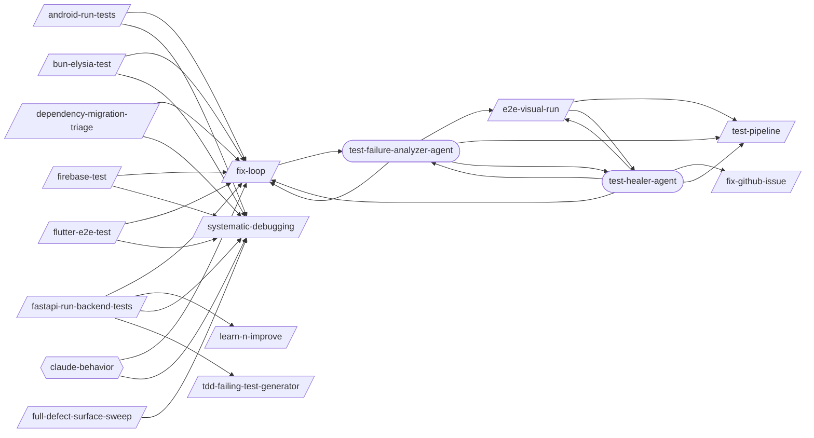
```mermaid
graph LR
    android_run_tests[/android-run-tests/]
    bun_elysia_test[/bun-elysia-test/]
    dependency_migration_triage[/dependency-migration-triage/]
    e2e_visual_run[/e2e-visual-run/]
    fastapi_run_backend_tests[/fastapi-run-backend-tests/]
    firebase_test[/firebase-test/]
    fix_github_issue[/fix-github-issue/]
    fix_loop[/fix-loop/]
    flutter_e2e_test[/flutter-e2e-test/]
    full_defect_surface_sweep[/full-defect-surface-sweep/]
    learn_n_improve[/learn-n-improve/]
    systematic_debugging[/systematic-debugging/]
    tdd_failing_test_generator[/tdd-failing-test-generator/]
    test_pipeline[/test-pipeline/]
    test_failure_analyzer_agent([test-failure-analyzer-agent])
    test_healer_agent([test-healer-agent])
    claude_behavior{{claude-behavior}}
    android_run_tests --> fix_loop
    android_run_tests --> systematic_debugging
    bun_elysia_test --> fix_loop
    bun_elysia_test --> systematic_debugging
    dependency_migration_triage --> fix_loop
    dependency_migration_triage --> systematic_debugging
    e2e_visual_run --> test_pipeline
    e2e_visual_run --> test_healer_agent
    fastapi_run_backend_tests --> fix_loop
    fastapi_run_backend_tests --> learn_n_improve
    fastapi_run_backend_tests --> systematic_debugging
    fastapi_run_backend_tests --> tdd_failing_test_generator
    firebase_test --> fix_loop
    firebase_test --> systematic_debugging
    fix_loop --> test_failure_analyzer_agent
    flutter_e2e_test --> fix_loop
    flutter_e2e_test --> systematic_debugging
    full_defect_surface_sweep --> systematic_debugging
    test_failure_analyzer_agent --> e2e_visual_run
    test_failure_analyzer_agent --> fix_loop
    test_failure_analyzer_agent --> test_pipeline
    test_failure_analyzer_agent --> test_healer_agent
    test_healer_agent --> e2e_visual_run
    test_healer_agent --> fix_github_issue
    test_healer_agent --> fix_loop
    test_healer_agent --> test_pipeline
    test_healer_agent --> test_failure_analyzer_agent
    claude_behavior --> fix_loop
    claude_behavior --> systematic_debugging
```

## Detailed Flow

Step-level flow showing gates (diamonds), delegations (dashed), and artifacts (cylinders).

```mermaid
graph TD
    subgraph android_run_tests_sub["Android Run Tests"]
        android_run_tests_s1["Step 1: Detect Android Directory"]
        android_run_tests_s2["Step 2: Resolve Class Name"]
        android_run_tests_s1 --> android_run_tests_s2
        android_run_tests_s3["Step 3: Detect Test Type"]
        android_run_tests_s2 --> android_run_tests_s3
        android_run_tests_s4["Step 4: Verify Prerequisites"]
        android_run_tests_s3 --> android_run_tests_s4
        android_run_tests_s5["Step 5: Execute Tests"]
        android_run_tests_s4 --> android_run_tests_s5
        android_run_tests_s6["Step 6: Analyze Results"]
        android_run_tests_s5 --> android_run_tests_s6
        android_run_tests_s7["Step 7: Suggest Next Actions"]
        android_run_tests_s6 --> android_run_tests_s7
        fix_loop_ext([/fix-loop/])
        android_run_tests_s7 -.-> fix_loop_ext
        android_run_tests_s8{{Step 8: Structured JSON Output}}
        android_run_tests_s7 --> android_run_tests_s8
        android_run_tests_test_results_android_run_tests_json[("test-results/android-run-tests.json")]
        android_run_tests_s8 -->|writes| android_run_tests_test_results_android_run_tests_json
        android_run_tests_s9["Step 9: Auto-Fix and Learn (On Failure Only)"]
        android_run_tests_s8 --> android_run_tests_s9
        android_run_tests_s9 -.-> fix_loop_ext
        systematic_debugging_ext([/systematic-debugging/])
        android_run_tests_s9 -.-> systematic_debugging_ext
    end

    subgraph bun_elysia_test_sub["Bun Elysia Test"]
        bun_elysia_test_s1["Step 1: Detect Bun Project"]
        bun_elysia_test_s2["Step 2: Write Tests Using bun:test Patterns"]
        bun_elysia_test_s1 --> bun_elysia_test_s2
        bun_elysia_test_s3["Step 3: Test Elysia Endpoints with Eden Treaty"]
        bun_elysia_test_s2 --> bun_elysia_test_s3
        bun_elysia_test_s4["Step 4: Test Plugins (Lifecycle Hooks, Decorators)"]
        bun_elysia_test_s3 --> bun_elysia_test_s4
        bun_elysia_test_s5["Step 5: Test WebSocket Handlers"]
        bun_elysia_test_s4 --> bun_elysia_test_s5
        bun_elysia_test_s6["Step 6: Mock Dependencies with bun:test Spy and Mock"]
        bun_elysia_test_s5 --> bun_elysia_test_s6
        bun_elysia_test_s7["Step 7: Run Tests and Collect Results"]
        bun_elysia_test_s6 --> bun_elysia_test_s7
        bun_elysia_test_test_results_raw_output_json[("test-results/raw-output.json")]
        bun_elysia_test_s7 -->|writes| bun_elysia_test_test_results_raw_output_json
        bun_elysia_test_s8{{Step 8: Write Structured JSON Output}}
        bun_elysia_test_s7 --> bun_elysia_test_s8
        bun_elysia_test_test_results_bun_elysia_test_json[("test-results/bun-elysia-test.json")]
        bun_elysia_test_s8 -->|writes| bun_elysia_test_test_results_bun_elysia_test_json
        bun_elysia_test_s9["Step 9: Auto-Fix and Learn (On Failure Only)"]
        bun_elysia_test_s8 --> bun_elysia_test_s9
        bun_elysia_test_s9 -.-> fix_loop_ext
        bun_elysia_test_s9 -.-> systematic_debugging_ext
        bun_elysia_test_s9 -->|writes| bun_elysia_test_test_results_bun_elysia_test_json
    end

    subgraph db_migrate_verify_sub["Db Migrate Verify"]
        db_migrate_verify_s1["Step 1: Detect Migration Framework"]
        db_migrate_verify_s2["Step 2: Pre-Migration State"]
        db_migrate_verify_s1 --> db_migrate_verify_s2
        db_migrate_verify_s3["Step 3: Forward Migration"]
        db_migrate_verify_s2 --> db_migrate_verify_s3
        db_migrate_verify_s4["Step 4: Schema Validation"]
        db_migrate_verify_s3 --> db_migrate_verify_s4
        db_migrate_verify_s5["Step 5: Seed Data Test (if --seed-data)"]
        db_migrate_verify_s4 --> db_migrate_verify_s5
        db_migrate_verify_s6["Step 6: Rollback Verification (if --rollback or always)"]
        db_migrate_verify_s5 --> db_migrate_verify_s6
        db_migrate_verify_s7{{Step 7: Dangerous Operation Detection}}
        db_migrate_verify_s6 --> db_migrate_verify_s7
        db_migrate_verify_s7A["Step 7A: Real Database Testing (Testcontainers + Respawn)"]
        db_migrate_verify_s7 --> db_migrate_verify_s7A
        db_migrate_verify_s8["Step 8: Report"]
        db_migrate_verify_s7A --> db_migrate_verify_s8
    end

    subgraph dependency_migration_triage_sub["Dependency Migration Triage"]
        dependency_migration_triage_s1["Step 1: Snapshot the Failure Set Before Touching Anything"]
        dependency_migration_triage_s1 -.-> fix_loop_ext
        dependency_migration_triage_s1 -.-> systematic_debugging_ext
        dependency_migration_triage_s2["Step 2: Cluster by Error Signature, Not by Test File"]
        dependency_migration_triage_s1 --> dependency_migration_triage_s2
        dependency_migration_triage_s3["Step 3: Classify Each Cluster"]
        dependency_migration_triage_s2 --> dependency_migration_triage_s3
        dependency_migration_triage_s4{{Step 4: Fix in Waves, Full Suite Between Waves}}
        dependency_migration_triage_s3 --> dependency_migration_triage_s4
        dependency_migration_triage_s5["Step 5: Report Per-Cluster Outcomes"]
        dependency_migration_triage_s4 --> dependency_migration_triage_s5
    end

    subgraph e2e_visual_run_sub["E2E Visual Run"]
        e2e_visual_run_s1{{Step 1: INIT}}
        test_pipeline_ext([/test-pipeline/])
        e2e_visual_run_s1 -.-> test_pipeline_ext
        update_practices_ext([/update-practices/])
        e2e_visual_run_s1 -.-> update_practices_ext
        test_healer_agent_ext((test-healer-agent))
        e2e_visual_run_s1 -.-> test_healer_agent_ext
        test_scout_agent_ext((test-scout-agent))
        e2e_visual_run_s1 -.-> test_scout_agent_ext
        tester_agent_ext((tester-agent))
        e2e_visual_run_s1 -.-> tester_agent_ext
        visual_inspector_agent_ext((visual-inspector-agent))
        e2e_visual_run_s1 -.-> visual_inspector_agent_ext
        e2e_visual_run_test_results_e2e_pipeline_json[("test-results/e2e-pipeline*.json")]
        e2e_visual_run_s1 -->|writes| e2e_visual_run_test_results_e2e_pipeline_json
        e2e_visual_run_s1_block[/BLOCK/]
        e2e_visual_run_s1 -->|FAILED| e2e_visual_run_s1_block
        e2e_visual_run_s2{{Step 2: SCOUT (E2E-specific classification)}}
        e2e_visual_run_s1 -->|OK| e2e_visual_run_s2
        e2e_visual_run_s3{{Step 3: Drain test_queue — Capture Runs}}
        e2e_visual_run_s2 --> e2e_visual_run_s3
        e2e_visual_run_s3 -->|writes| e2e_visual_run_test_results_e2e_pipeline_json
        e2e_visual_run_s4{{Step 4: Drain verify_queue — Dual-Signal Visual Verdict}}
        e2e_visual_run_s3 --> e2e_visual_run_s4
        e2e_visual_run_s5{{Step 5: Drain fix_queue — Confidence-Gated Auto-Heal}}
        e2e_visual_run_s4 --> e2e_visual_run_s5
        e2e_visual_run_s6["Step 6: (reserved — intentionally not numbered in prior versions)"]
        e2e_visual_run_s5 --> e2e_visual_run_s6
        e2e_visual_run_s7["Step 7: First-Run Artifact Detection"]
        e2e_visual_run_s6 --> e2e_visual_run_s7
        e2e_visual_run_s8{{Step 8: Report}}
        e2e_visual_run_s7 --> e2e_visual_run_s8
        e2e_visual_run_s8 -->|writes| e2e_visual_run_test_results_e2e_pipeline_json
    end

    subgraph fastapi_run_backend_tests_sub["Fastapi Run Backend Tests"]
        fastapi_run_backend_tests_s1["Step 1: Detect Backend Directory"]
        fastapi_run_backend_tests_s2["Step 2: Resolve Test Path"]
        fastapi_run_backend_tests_s1 --> fastapi_run_backend_tests_s2
        fastapi_run_backend_tests_s3["Step 3: Run Tests"]
        fastapi_run_backend_tests_s2 --> fastapi_run_backend_tests_s3
        fastapi_run_backend_tests_s4["Step 4: Analyze Results"]
        fastapi_run_backend_tests_s3 --> fastapi_run_backend_tests_s4
        fastapi_run_backend_tests_s5["Step 5: Suggest Next Actions"]
        fastapi_run_backend_tests_s4 --> fastapi_run_backend_tests_s5
        fastapi_run_backend_tests_s5 -.-> fix_loop_ext
        tdd_failing_test_generator_ext([/tdd-failing-test-generator/])
        fastapi_run_backend_tests_s5 -.-> tdd_failing_test_generator_ext
        fastapi_run_backend_tests_s6{{Step 6: Structured JSON Output}}
        fastapi_run_backend_tests_s5 --> fastapi_run_backend_tests_s6
        fastapi_run_backend_tests_test_results_fastapi_run_backend_tests_json[("test-results/fastapi-run-backend-tests.json")]
        fastapi_run_backend_tests_s6 -->|writes| fastapi_run_backend_tests_test_results_fastapi_run_backend_tests_json
        fastapi_run_backend_tests_s7["Step 7: Auto-Fix and Learn (On Failure Only)"]
        fastapi_run_backend_tests_s6 --> fastapi_run_backend_tests_s7
        fastapi_run_backend_tests_s7 -.-> fix_loop_ext
        learn_n_improve_ext([/learn-n-improve/])
        fastapi_run_backend_tests_s7 -.-> learn_n_improve_ext
        fastapi_run_backend_tests_s7 -.-> systematic_debugging_ext
    end

    subgraph firebase_test_sub["Firebase Test"]
        firebase_test_s1{{Step 1: Detect Firebase Project Configuration}}
        firebase_test_s2["Step 2: Firebase Emulator Suite Setup and Startup"]
        firebase_test_s1 --> firebase_test_s2
        firebase_test_s3["Step 3: Firestore Security Rules Testing"]
        firebase_test_s2 --> firebase_test_s3
        firebase_test_s4["Step 4: Cloud Functions Unit Testing"]
        firebase_test_s3 --> firebase_test_s4
        firebase_test_s5["Step 5: Auth Trigger Testing"]
        firebase_test_s4 --> firebase_test_s5
        firebase_test_s6["Step 6: Firebase Test Lab Integration for Mobile"]
        firebase_test_s5 --> firebase_test_s6
        firebase_test_s7["Step 7: Test Data Seeding with Emulator"]
        firebase_test_s6 --> firebase_test_s7
        firebase_test_s8["Step 8: Run Tests and Collect Results"]
        firebase_test_s7 --> firebase_test_s8
        firebase_test_test_results_raw_output_json[("test-results/raw-output.json")]
        firebase_test_s8 -->|writes| firebase_test_test_results_raw_output_json
        firebase_test_s9{{Step 9: Write Structured JSON Output}}
        firebase_test_s8 --> firebase_test_s9
        firebase_test_test_results_firebase_test_json[("test-results/firebase-test.json")]
        firebase_test_s9 -->|writes| firebase_test_test_results_firebase_test_json
        firebase_test_s10["Step 10: Tear Down Emulators"]
        firebase_test_s9 --> firebase_test_s10
        firebase_test_s11{{Step 11: Auto-Fix and Learn (On Failure Only)}}
        firebase_test_s10 --> firebase_test_s11
        firebase_test_s11 -.-> fix_loop_ext
        firebase_test_s11 -.-> systematic_debugging_ext
        firebase_test_s11 -->|writes| firebase_test_test_results_firebase_test_json
    end

    subgraph flutter_e2e_test_sub["Flutter E2E Test"]
        flutter_e2e_test_s1["Step 1: Project Setup"]
        flutter_e2e_test_s2["Step 2: Writing E2E Tests"]
        flutter_e2e_test_s1 --> flutter_e2e_test_s2
        flutter_e2e_test_s3["Step 3: Test Patterns"]
        flutter_e2e_test_s2 --> flutter_e2e_test_s3
        flutter_e2e_test_s4["Step 4: Visual Regression Testing"]
        flutter_e2e_test_s3 --> flutter_e2e_test_s4
        flutter_e2e_test_s5["Step 5: Monkey / Fuzz Testing"]
        flutter_e2e_test_s4 --> flutter_e2e_test_s5
        flutter_e2e_test_s6["Step 6: Platform-Specific Execution"]
        flutter_e2e_test_s5 --> flutter_e2e_test_s6
        flutter_e2e_test_s7["Step 7: CI/CD Integration"]
        flutter_e2e_test_s6 --> flutter_e2e_test_s7
        flutter_e2e_test_s8{{Step 8: Structured JSON Output}}
        flutter_e2e_test_s7 --> flutter_e2e_test_s8
        flutter_e2e_test_test_results_flutter_e2e_test_json[("test-results/flutter-e2e-test.json")]
        flutter_e2e_test_s8 -->|writes| flutter_e2e_test_test_results_flutter_e2e_test_json
        flutter_e2e_test_s9["Step 9: Auto-Fix and Learn (On Failure Only)"]
        flutter_e2e_test_s8 --> flutter_e2e_test_s9
        flutter_e2e_test_s9 -.-> fix_loop_ext
        flutter_e2e_test_s9 -.-> systematic_debugging_ext
    end

    subgraph full_defect_surface_sweep_sub["Full Defect Surface Sweep"]
        full_defect_surface_sweep_s0["Step 0: Confirm the Root Cause Is Actually Isolated"]
        full_defect_surface_sweep_s0 -.-> systematic_debugging_ext
        full_defect_surface_sweep_s1{{Step 1: Abstract the Instance Into a Class}}
        full_defect_surface_sweep_s0 --> full_defect_surface_sweep_s1
        full_defect_surface_sweep_s2["Step 2: Sweep the Whole Repo for the Class"]
        full_defect_surface_sweep_s1 --> full_defect_surface_sweep_s2
        full_defect_surface_sweep_s3["Step 3: Classify Each Hit"]
        full_defect_surface_sweep_s2 --> full_defect_surface_sweep_s3
        full_defect_surface_sweep_s4["Step 4: Fix In-Scope, File Residuals for the Rest"]
        full_defect_surface_sweep_s3 --> full_defect_surface_sweep_s4
        full_defect_surface_sweep_s5{{Step 5: Attach the Sweep Table to the Fix}}
        full_defect_surface_sweep_s4 --> full_defect_surface_sweep_s5
    end

    subgraph mobile_a11y_test_sub["Mobile A11Y Test"]
        mobile_a11y_test_s1["Step 1: Detect Platform"]
        mobile_a11y_test_s2["Step 2: Automated Checks"]
        mobile_a11y_test_s1 --> mobile_a11y_test_s2
        mobile_a11y_test_s3["Step 3: Content Description Audit"]
        mobile_a11y_test_s2 --> mobile_a11y_test_s3
        mobile_a11y_test_s4["Step 4: Touch Target Validation"]
        mobile_a11y_test_s3 --> mobile_a11y_test_s4
        mobile_a11y_test_s5["Step 5: Color Contrast Check"]
        mobile_a11y_test_s4 --> mobile_a11y_test_s5
        mobile_a11y_test_s6{{Step 6: Screen Reader Testing}}
        mobile_a11y_test_s5 --> mobile_a11y_test_s6
        mobile_a11y_test_s7{{Step 7: Report}}
        mobile_a11y_test_s6 --> mobile_a11y_test_s7
    end

    subgraph tdd_failing_test_generator_sub["Tdd Failing Test Generator"]
        tdd_failing_test_generator_s1["Step 1: Parse Sources"]
        coverage_analysis_ext([/coverage-analysis/])
        tdd_failing_test_generator_s1 -.-> coverage_analysis_ext
        tdd_failing_test_generator_s2["Step 2: Detect Test Framework"]
        tdd_failing_test_generator_s1 --> tdd_failing_test_generator_s2
        tdd_failing_test_generator_s3["Step 3: Generate Shared Test Infrastructure"]
        tdd_failing_test_generator_s2 --> tdd_failing_test_generator_s3
        tdd_failing_test_generator_s4["Step 4: Generate Unit Tests"]
        tdd_failing_test_generator_s3 --> tdd_failing_test_generator_s4
        tdd_failing_test_generator_s5["Step 5: Generate API Tests"]
        tdd_failing_test_generator_s4 --> tdd_failing_test_generator_s5
        tdd_failing_test_generator_s6["Step 6: Generate E2E Test Stubs"]
        tdd_failing_test_generator_s5 --> tdd_failing_test_generator_s6
        tdd_failing_test_generator_s7["Step 7: Generate BDD Scenarios"]
        tdd_failing_test_generator_s6 --> tdd_failing_test_generator_s7
        tdd_failing_test_generator_s8["Step 8: Property-Based Tests"]
        tdd_failing_test_generator_s7 --> tdd_failing_test_generator_s8
        tdd_failing_test_generator_s9["Step 9: Coverage Configuration"]
        tdd_failing_test_generator_s8 --> tdd_failing_test_generator_s9
        tdd_failing_test_generator_s10["Step 10: Mutation Testing Setup"]
        tdd_failing_test_generator_s9 --> tdd_failing_test_generator_s10
        tdd_failing_test_generator_s11["Step 11: Snapshot Test Stubs"]
        tdd_failing_test_generator_s10 --> tdd_failing_test_generator_s11
        tdd_failing_test_generator_s12["Step 12: Accessibility Test Stubs"]
        tdd_failing_test_generator_s11 --> tdd_failing_test_generator_s12
        tdd_failing_test_generator_s13{{Step 13: Red Phase Gate Verification}}
        tdd_failing_test_generator_s12 --> tdd_failing_test_generator_s13
        tdd_failing_test_generator_s14{{Step 14: Output Summary & Structured Results}}
        tdd_failing_test_generator_s13 --> tdd_failing_test_generator_s14
        tdd_ext([/tdd/])
        tdd_failing_test_generator_s14 -.-> tdd_ext
        tdd_failing_test_generator_test_results_tdd_failing_test_generator_json[("test-results/tdd-failing-test-generator.json")]
        tdd_failing_test_generator_s14 -->|writes| tdd_failing_test_generator_test_results_tdd_failing_test_generator_json
    end

    fastapi_run_backend_tests_s5 ==> tdd_failing_test_generator_s1
```

## Skills

| Skill | Version | Description | Calls | Called By |
|-------|---------|-------------|-------|----------|
| `/ai-gemini-api` | 1.0.1 | Apply Google Gemini API patterns including client setup with google-genai SDK... | — | — |
| `/android-run-tests` | 2.2.0 | Run Android unit, UI, E2E, or journey tests with class name resolution and au... | `/fix-loop`, `/systematic-debugging` | — |
| `/bun-elysia-test` | 1.1.0 | Run and validate tests for Bun + Elysia applications covering endpoints, plug... | `/fix-loop`, `/systematic-debugging` | — |
| `/db-migrate-verify` | 1.0.0 | Verify database migrations: run forward, validate schema, run backward, valid... | — | — |
| `/debugging-loop` | 3.0.0 | POINTER to the installable loop-engineering plugin — this capability graduate... | — | — |
| `/dependency-migration-triage` | 1.0.0 | Triage the TEST-SUITE failures a dependency upgrade, removal, or framework mi... | `/fix-loop`, `/systematic-debugging` | — |
| `/e2e-visual-run` | 5.1.0 | Run a full Playwright E2E suite as a skill-at-T0 orchestrator with queue-base... | `/test-pipeline`, `/test-healer-agent` | `/test-failure-analyzer-agent`, `/test-healer-agent` |
| `/fastapi-run-backend-tests` | 2.2.0 | Run backend pytest with smart defaults, short-name resolution, and auto-fix o... | `/fix-loop`, `/learn-n-improve`, `/systematic-debugging`, `/tdd-failing-test-generator` | — |
| `/firebase-test` | 1.1.1 | Run and validate Firebase application tests across security rules, Cloud Func... | `/fix-loop`, `/systematic-debugging` | — |
| `/fix-github-issue` | 4.0.0 | POINTER to the installable cbp-workflows plugin — this capability graduated f... | — | `/test-healer-agent` |
| `/fix-loop` | 2.0.0 | POINTER to the installable cbp-workflows plugin — this capability graduated f... | `/test-failure-analyzer-agent` | `/android-run-tests`, `/bun-elysia-test`, `/dependency-migration-triage`, `/fastapi-run-backend-tests`, `/firebase-test`, `/flutter-e2e-test`, `/test-failure-analyzer-agent`, `/test-healer-agent` |
| `/flutter-e2e-test` | 1.2.1 | Run Flutter E2E tests across Android, Web, and desktop platforms with MCP-bas... | `/fix-loop`, `/systematic-debugging` | — |
| `/full-defect-surface-sweep` | 1.0.0 | Enumerate every sibling instance of a just-diagnosed root cause repo-wide BEF... | `/systematic-debugging` | — |
| `/learn-n-improve` | 3.0.0 | POINTER to the installable cbp-learning-workflow plugin — this capability gra... | — | `/fastapi-run-backend-tests` |
| `/mobile-a11y-test` | 1.0.0 | Run mobile accessibility tests for Android (Compose/XML) and Flutter projects... | — | — |
| `/systematic-debugging` | 2.0.0 | POINTER to the installable cbp-build-test-workflows plugin — this capability ... | — | `/android-run-tests`, `/bun-elysia-test`, `/dependency-migration-triage`, `/fastapi-run-backend-tests`, `/firebase-test`, `/flutter-e2e-test`, `/full-defect-surface-sweep` |
| `/tdd-failing-test-generator` | 2.1.0 | Generate test suites from PRD requirements, schema, or API specs. Produces sh... | — | `/fastapi-run-backend-tests` |
| `/test-pipeline` | 4.0.0 | POINTER to the installable cbp-build-test-workflows plugin — this capability ... | — | `/e2e-visual-run`, `/test-failure-analyzer-agent`, `/test-healer-agent` |

## Workflow Steps

### Consolidated Step Flow

End-to-end flow across all skills, showing how steps connect via delegations (thick arrows).

```mermaid
graph TD
    subgraph android_run_tests_sub["Android Run Tests"]
        android_run_tests_s1["Detect Android Directory"]
        android_run_tests_s2["Resolve Class Name"]
        android_run_tests_s1 --> android_run_tests_s2
        android_run_tests_s3["Detect Test Type"]
        android_run_tests_s2 --> android_run_tests_s3
        android_run_tests_s4["Verify Prerequisites"]
        android_run_tests_s3 --> android_run_tests_s4
        android_run_tests_s5["Execute Tests"]
        android_run_tests_s4 --> android_run_tests_s5
        android_run_tests_s6["Analyze Results"]
        android_run_tests_s5 --> android_run_tests_s6
        android_run_tests_s7["Suggest Next Actions"]
        android_run_tests_s6 --> android_run_tests_s7
        android_run_tests_s8{{Structured JSON Output}}
        android_run_tests_s7 --> android_run_tests_s8
        android_run_tests_s9["Auto-Fix and Learn (On Failure Only)"]
        android_run_tests_s8 --> android_run_tests_s9
    end

    subgraph bun_elysia_test_sub["Bun Elysia Test"]
        bun_elysia_test_s1["Detect Bun Project"]
        bun_elysia_test_s2["Write Tests Using bun:test Patterns"]
        bun_elysia_test_s1 --> bun_elysia_test_s2
        bun_elysia_test_s3["Test Elysia Endpoints with Eden Treaty"]
        bun_elysia_test_s2 --> bun_elysia_test_s3
        bun_elysia_test_s4["Test Plugins (Lifecycle Hooks, Decorators)"]
        bun_elysia_test_s3 --> bun_elysia_test_s4
        bun_elysia_test_s5["Test WebSocket Handlers"]
        bun_elysia_test_s4 --> bun_elysia_test_s5
        bun_elysia_test_s6["Mock Dependencies with bun:test Spy and Mock"]
        bun_elysia_test_s5 --> bun_elysia_test_s6
        bun_elysia_test_s7["Run Tests and Collect Results"]
        bun_elysia_test_s6 --> bun_elysia_test_s7
        bun_elysia_test_s8{{Write Structured JSON Output}}
        bun_elysia_test_s7 --> bun_elysia_test_s8
        bun_elysia_test_s9["Auto-Fix and Learn (On Failure Only)"]
        bun_elysia_test_s8 --> bun_elysia_test_s9
    end

    subgraph db_migrate_verify_sub["Db Migrate Verify"]
        db_migrate_verify_s1["Detect Migration Framework"]
        db_migrate_verify_s2["Pre-Migration State"]
        db_migrate_verify_s1 --> db_migrate_verify_s2
        db_migrate_verify_s3["Forward Migration"]
        db_migrate_verify_s2 --> db_migrate_verify_s3
        db_migrate_verify_s4["Schema Validation"]
        db_migrate_verify_s3 --> db_migrate_verify_s4
        db_migrate_verify_s5["Seed Data Test (if --seed-data)"]
        db_migrate_verify_s4 --> db_migrate_verify_s5
        db_migrate_verify_s6["Rollback Verification (if --rollback or always)"]
        db_migrate_verify_s5 --> db_migrate_verify_s6
        db_migrate_verify_s7{{Dangerous Operation Detection}}
        db_migrate_verify_s6 --> db_migrate_verify_s7
        db_migrate_verify_s7A["Real Database Testing (Testcontainers + Respawn)"]
        db_migrate_verify_s7 --> db_migrate_verify_s7A
        db_migrate_verify_s8["Report"]
        db_migrate_verify_s7A --> db_migrate_verify_s8
    end

    subgraph dependency_migration_triage_sub["Dependency Migration Triage"]
        dependency_migration_triage_s1["Snapshot the Failure Set Before Touching Anything"]
        dependency_migration_triage_s2["Cluster by Error Signature, Not by Test File"]
        dependency_migration_triage_s1 --> dependency_migration_triage_s2
        dependency_migration_triage_s3["Classify Each Cluster"]
        dependency_migration_triage_s2 --> dependency_migration_triage_s3
        dependency_migration_triage_s4{{Fix in Waves, Full Suite Between Waves}}
        dependency_migration_triage_s3 --> dependency_migration_triage_s4
        dependency_migration_triage_s5["Report Per-Cluster Outcomes"]
        dependency_migration_triage_s4 --> dependency_migration_triage_s5
    end

    subgraph e2e_visual_run_sub["E2E Visual Run"]
        e2e_visual_run_s1{{INIT}}
        e2e_visual_run_s2{{SCOUT (E2E-specific classification)}}
        e2e_visual_run_s1 --> e2e_visual_run_s2
        e2e_visual_run_s3{{Drain test_queue — Capture Runs}}
        e2e_visual_run_s2 --> e2e_visual_run_s3
        e2e_visual_run_s4{{Drain verify_queue — Dual-Signal Visual Verdict}}
        e2e_visual_run_s3 --> e2e_visual_run_s4
        e2e_visual_run_s5{{Drain fix_queue — Confidence-Gated Auto-Heal}}
        e2e_visual_run_s4 --> e2e_visual_run_s5
        e2e_visual_run_s6["(reserved — intentionally not numbered in prior versions)"]
        e2e_visual_run_s5 --> e2e_visual_run_s6
        e2e_visual_run_s7["First-Run Artifact Detection"]
        e2e_visual_run_s6 --> e2e_visual_run_s7
        e2e_visual_run_s8{{Report}}
        e2e_visual_run_s7 --> e2e_visual_run_s8
    end

    subgraph fastapi_run_backend_tests_sub["Fastapi Run Backend Tests"]
        fastapi_run_backend_tests_s1["Detect Backend Directory"]
        fastapi_run_backend_tests_s2["Resolve Test Path"]
        fastapi_run_backend_tests_s1 --> fastapi_run_backend_tests_s2
        fastapi_run_backend_tests_s3["Run Tests"]
        fastapi_run_backend_tests_s2 --> fastapi_run_backend_tests_s3
        fastapi_run_backend_tests_s4["Analyze Results"]
        fastapi_run_backend_tests_s3 --> fastapi_run_backend_tests_s4
        fastapi_run_backend_tests_s5["Suggest Next Actions"]
        fastapi_run_backend_tests_s4 --> fastapi_run_backend_tests_s5
        fastapi_run_backend_tests_s6{{Structured JSON Output}}
        fastapi_run_backend_tests_s5 --> fastapi_run_backend_tests_s6
        fastapi_run_backend_tests_s7["Auto-Fix and Learn (On Failure Only)"]
        fastapi_run_backend_tests_s6 --> fastapi_run_backend_tests_s7
    end

    subgraph firebase_test_sub["Firebase Test"]
        firebase_test_s1{{Detect Firebase Project Configuration}}
        firebase_test_s2["Firebase Emulator Suite Setup and Startup"]
        firebase_test_s1 --> firebase_test_s2
        firebase_test_s3["Firestore Security Rules Testing"]
        firebase_test_s2 --> firebase_test_s3
        firebase_test_s4["Cloud Functions Unit Testing"]
        firebase_test_s3 --> firebase_test_s4
        firebase_test_s5["Auth Trigger Testing"]
        firebase_test_s4 --> firebase_test_s5
        firebase_test_s6["Firebase Test Lab Integration for Mobile"]
        firebase_test_s5 --> firebase_test_s6
        firebase_test_s7["Test Data Seeding with Emulator"]
        firebase_test_s6 --> firebase_test_s7
        firebase_test_s8["Run Tests and Collect Results"]
        firebase_test_s7 --> firebase_test_s8
        firebase_test_s9{{Write Structured JSON Output}}
        firebase_test_s8 --> firebase_test_s9
        firebase_test_s10["Tear Down Emulators"]
        firebase_test_s9 --> firebase_test_s10
        firebase_test_s11{{Auto-Fix and Learn (On Failure Only)}}
        firebase_test_s10 --> firebase_test_s11
    end

    subgraph flutter_e2e_test_sub["Flutter E2E Test"]
        flutter_e2e_test_s1["Project Setup"]
        flutter_e2e_test_s2["Writing E2E Tests"]
        flutter_e2e_test_s1 --> flutter_e2e_test_s2
        flutter_e2e_test_s3["Test Patterns"]
        flutter_e2e_test_s2 --> flutter_e2e_test_s3
        flutter_e2e_test_s4["Visual Regression Testing"]
        flutter_e2e_test_s3 --> flutter_e2e_test_s4
        flutter_e2e_test_s5["Monkey / Fuzz Testing"]
        flutter_e2e_test_s4 --> flutter_e2e_test_s5
        flutter_e2e_test_s6["Platform-Specific Execution"]
        flutter_e2e_test_s5 --> flutter_e2e_test_s6
        flutter_e2e_test_s7["CI/CD Integration"]
        flutter_e2e_test_s6 --> flutter_e2e_test_s7
        flutter_e2e_test_s8{{Structured JSON Output}}
        flutter_e2e_test_s7 --> flutter_e2e_test_s8
        flutter_e2e_test_s9["Auto-Fix and Learn (On Failure Only)"]
        flutter_e2e_test_s8 --> flutter_e2e_test_s9
    end

    subgraph full_defect_surface_sweep_sub["Full Defect Surface Sweep"]
        full_defect_surface_sweep_s0["Confirm the Root Cause Is Actually Isolated"]
        full_defect_surface_sweep_s1{{Abstract the Instance Into a Class}}
        full_defect_surface_sweep_s0 --> full_defect_surface_sweep_s1
        full_defect_surface_sweep_s2["Sweep the Whole Repo for the Class"]
        full_defect_surface_sweep_s1 --> full_defect_surface_sweep_s2
        full_defect_surface_sweep_s3["Classify Each Hit"]
        full_defect_surface_sweep_s2 --> full_defect_surface_sweep_s3
        full_defect_surface_sweep_s4["Fix In-Scope, File Residuals for the Rest"]
        full_defect_surface_sweep_s3 --> full_defect_surface_sweep_s4
        full_defect_surface_sweep_s5{{Attach the Sweep Table to the Fix}}
        full_defect_surface_sweep_s4 --> full_defect_surface_sweep_s5
    end

    subgraph mobile_a11y_test_sub["Mobile A11Y Test"]
        mobile_a11y_test_s1["Detect Platform"]
        mobile_a11y_test_s2["Automated Checks"]
        mobile_a11y_test_s1 --> mobile_a11y_test_s2
        mobile_a11y_test_s3["Content Description Audit"]
        mobile_a11y_test_s2 --> mobile_a11y_test_s3
        mobile_a11y_test_s4["Touch Target Validation"]
        mobile_a11y_test_s3 --> mobile_a11y_test_s4
        mobile_a11y_test_s5["Color Contrast Check"]
        mobile_a11y_test_s4 --> mobile_a11y_test_s5
        mobile_a11y_test_s6{{Screen Reader Testing}}
        mobile_a11y_test_s5 --> mobile_a11y_test_s6
        mobile_a11y_test_s7{{Report}}
        mobile_a11y_test_s6 --> mobile_a11y_test_s7
    end

    subgraph tdd_failing_test_generator_sub["Tdd Failing Test Generator"]
        tdd_failing_test_generator_s1["Parse Sources"]
        tdd_failing_test_generator_s2["Detect Test Framework"]
        tdd_failing_test_generator_s1 --> tdd_failing_test_generator_s2
        tdd_failing_test_generator_s3["Generate Shared Test Infrastructure"]
        tdd_failing_test_generator_s2 --> tdd_failing_test_generator_s3
        tdd_failing_test_generator_s4["Generate Unit Tests"]
        tdd_failing_test_generator_s3 --> tdd_failing_test_generator_s4
        tdd_failing_test_generator_s5["Generate API Tests"]
        tdd_failing_test_generator_s4 --> tdd_failing_test_generator_s5
        tdd_failing_test_generator_s6["Generate E2E Test Stubs"]
        tdd_failing_test_generator_s5 --> tdd_failing_test_generator_s6
        tdd_failing_test_generator_s7["Generate BDD Scenarios"]
        tdd_failing_test_generator_s6 --> tdd_failing_test_generator_s7
        tdd_failing_test_generator_s8["Property-Based Tests"]
        tdd_failing_test_generator_s7 --> tdd_failing_test_generator_s8
        tdd_failing_test_generator_s9["Coverage Configuration"]
        tdd_failing_test_generator_s8 --> tdd_failing_test_generator_s9
        tdd_failing_test_generator_s10["Mutation Testing Setup"]
        tdd_failing_test_generator_s9 --> tdd_failing_test_generator_s10
        tdd_failing_test_generator_s11["Snapshot Test Stubs"]
        tdd_failing_test_generator_s10 --> tdd_failing_test_generator_s11
        tdd_failing_test_generator_s12["Accessibility Test Stubs"]
        tdd_failing_test_generator_s11 --> tdd_failing_test_generator_s12
        tdd_failing_test_generator_s13{{Red Phase Gate Verification}}
        tdd_failing_test_generator_s12 --> tdd_failing_test_generator_s13
        tdd_failing_test_generator_s14{{Output Summary & Structured Results}}
        tdd_failing_test_generator_s13 --> tdd_failing_test_generator_s14
    end

    fastapi_run_backend_tests_s5 ==> tdd_failing_test_generator_s1
```

### Entry Points

Double-bordered nodes are user-facing entry points (no incoming references). Rounded nodes are agents.

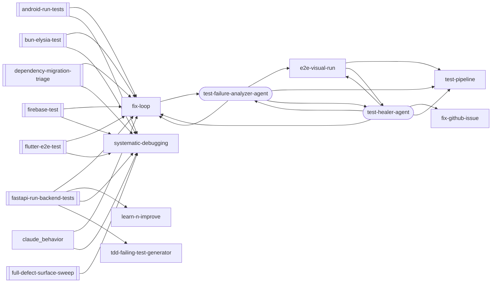
```mermaid
graph LR
    android_run_tests[["android-run-tests"]]
    bun_elysia_test[["bun-elysia-test"]]
    dependency_migration_triage[["dependency-migration-triage"]]
    fastapi_run_backend_tests[["fastapi-run-backend-tests"]]
    firebase_test[["firebase-test"]]
    flutter_e2e_test[["flutter-e2e-test"]]
    full_defect_surface_sweep[["full-defect-surface-sweep"]]
    e2e_visual_run["e2e-visual-run"]
    fix_github_issue["fix-github-issue"]
    fix_loop["fix-loop"]
    learn_n_improve["learn-n-improve"]
    systematic_debugging["systematic-debugging"]
    tdd_failing_test_generator["tdd-failing-test-generator"]
    test_failure_analyzer_agent(["test-failure-analyzer-agent"])
    test_healer_agent(["test-healer-agent"])
    test_pipeline["test-pipeline"]
    android_run_tests --> fix_loop
    android_run_tests --> systematic_debugging
    bun_elysia_test --> fix_loop
    bun_elysia_test --> systematic_debugging
    dependency_migration_triage --> fix_loop
    dependency_migration_triage --> systematic_debugging
    e2e_visual_run --> test_pipeline
    e2e_visual_run --> test_healer_agent
    fastapi_run_backend_tests --> fix_loop
    fastapi_run_backend_tests --> learn_n_improve
    fastapi_run_backend_tests --> systematic_debugging
    fastapi_run_backend_tests --> tdd_failing_test_generator
    firebase_test --> fix_loop
    firebase_test --> systematic_debugging
    fix_loop --> test_failure_analyzer_agent
    flutter_e2e_test --> fix_loop
    flutter_e2e_test --> systematic_debugging
    full_defect_surface_sweep --> systematic_debugging
    test_failure_analyzer_agent --> e2e_visual_run
    test_failure_analyzer_agent --> fix_loop
    test_failure_analyzer_agent --> test_pipeline
    test_failure_analyzer_agent --> test_healer_agent
    test_healer_agent --> e2e_visual_run
    test_healer_agent --> fix_github_issue
    test_healer_agent --> fix_loop
    test_healer_agent --> test_pipeline
    test_healer_agent --> test_failure_analyzer_agent
    claude_behavior --> fix_loop
    claude_behavior --> systematic_debugging
```

### android-run-tests

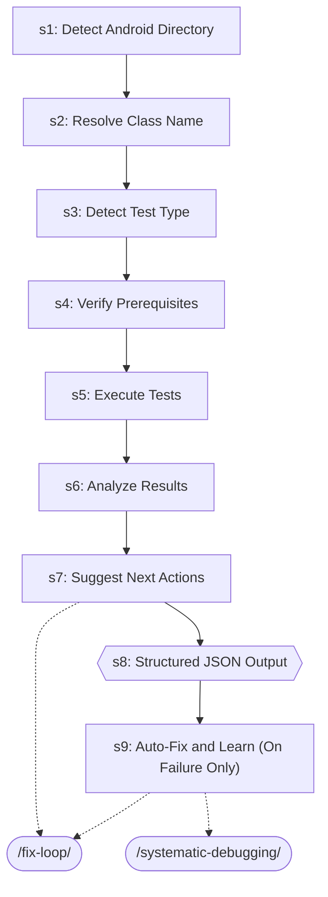
```mermaid
graph TD
    s1["s1: Detect Android Directory"]
    s2["s2: Resolve Class Name"]
    s1 --> s2
    s3["s3: Detect Test Type"]
    s2 --> s3
    s4["s4: Verify Prerequisites"]
    s3 --> s4
    s5["s5: Execute Tests"]
    s4 --> s5
    s6["s6: Analyze Results"]
    s5 --> s6
    s7["s7: Suggest Next Actions"]
    s6 --> s7
    fix_loop_ext([/fix-loop/])
    s7 -.-> fix_loop_ext
    s8{{s8: Structured JSON Output}}
    s7 --> s8
    s9["s9: Auto-Fix and Learn (On Failure Only)"]
    s8 --> s9
    fix_loop_ext([/fix-loop/])
    s9 -.-> fix_loop_ext
    systematic_debugging_ext([/systematic-debugging/])
    s9 -.-> systematic_debugging_ext
```

| Step | Title | Delegates To | Artifacts | Gates/Decisions |
|------|-------|-------------|-----------|----------------|
| 1 | Detect Android Directory | — | — | — |
| 2 | Resolve Class Name | — | — | — |
| 3 | Detect Test Type | — | — | — |
| 4 | Verify Prerequisites | — | — | — |
| 5 | Execute Tests | — | — | — |
| 6 | Analyze Results | — | — | — |
| 7 | Suggest Next Actions | `/fix-loop` | — | — |
| 8 | Structured JSON Output | — | → `test-results/android-run-tests.json` | gate, decision |
| 9 | Auto-Fix and Learn (On Failure Only) | `/fix-loop`, `/systematic-debugging` | — | decision |

### bun-elysia-test

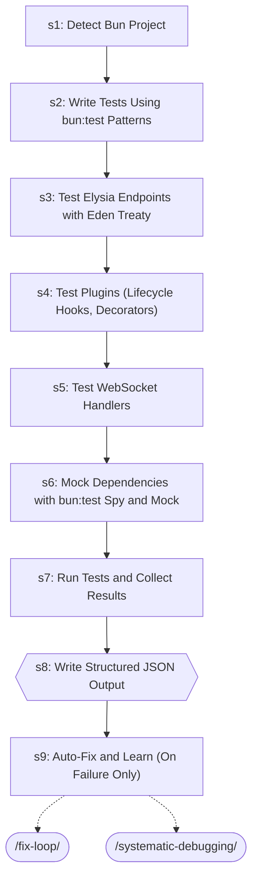
```mermaid
graph TD
    s1["s1: Detect Bun Project"]
    s2["s2: Write Tests Using bun:test Patterns"]
    s1 --> s2
    s3["s3: Test Elysia Endpoints with Eden Treaty"]
    s2 --> s3
    s4["s4: Test Plugins (Lifecycle Hooks, Decorators)"]
    s3 --> s4
    s5["s5: Test WebSocket Handlers"]
    s4 --> s5
    s6["s6: Mock Dependencies with bun:test Spy and Mock"]
    s5 --> s6
    s7["s7: Run Tests and Collect Results"]
    s6 --> s7
    s8{{s8: Write Structured JSON Output}}
    s7 --> s8
    s9["s9: Auto-Fix and Learn (On Failure Only)"]
    s8 --> s9
    fix_loop_ext([/fix-loop/])
    s9 -.-> fix_loop_ext
    systematic_debugging_ext([/systematic-debugging/])
    s9 -.-> systematic_debugging_ext
```

| Step | Title | Delegates To | Artifacts | Gates/Decisions |
|------|-------|-------------|-----------|----------------|
| 1 | Detect Bun Project | — | — | decision |
| 2 | Write Tests Using bun:test Patterns | — | — | — |
| 3 | Test Elysia Endpoints with Eden Treaty | — | — | — |
| 4 | Test Plugins (Lifecycle Hooks, Decorators) | — | — | decision |
| 5 | Test WebSocket Handlers | — | — | — |
| 6 | Mock Dependencies with bun:test Spy and Mock | — | — | — |
| 7 | Run Tests and Collect Results | — | → `test-results/raw-output.json` | — |
| 8 | Write Structured JSON Output | — | → `test-results/bun-elysia-test.json` | gate, decision |
| 9 | Auto-Fix and Learn (On Failure Only) | `/fix-loop`, `/systematic-debugging` | → `test-results/bun-elysia-test.json` | decision |

### db-migrate-verify

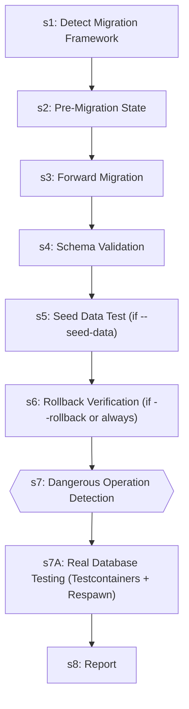
```mermaid
graph TD
    s1["s1: Detect Migration Framework"]
    s2["s2: Pre-Migration State"]
    s1 --> s2
    s3["s3: Forward Migration"]
    s2 --> s3
    s4["s4: Schema Validation"]
    s3 --> s4
    s5["s5: Seed Data Test (if --seed-data)"]
    s4 --> s5
    s6["s6: Rollback Verification (if --rollback or always)"]
    s5 --> s6
    s7{{s7: Dangerous Operation Detection}}
    s6 --> s7
    s7A["s7A: Real Database Testing (Testcontainers + Respawn)"]
    s7 --> s7A
    s8["s8: Report"]
    s7A --> s8
```

| Step | Title | Delegates To | Artifacts | Gates/Decisions |
|------|-------|-------------|-----------|----------------|
| 1 | Detect Migration Framework | — | — | — |
| 2 | Pre-Migration State | — | — | — |
| 3 | Forward Migration | — | — | — |
| 4 | Schema Validation | — | — | — |
| 5 | Seed Data Test (if --seed-data) | — | — | — |
| 6 | Rollback Verification (if --rollback or always) | — | — | — |
| 7 | Dangerous Operation Detection | — | — | gate, decision |
| 7A | Real Database Testing (Testcontainers + Respawn) | — | — | — |
| 8 | Report | — | — | decision |

### dependency-migration-triage

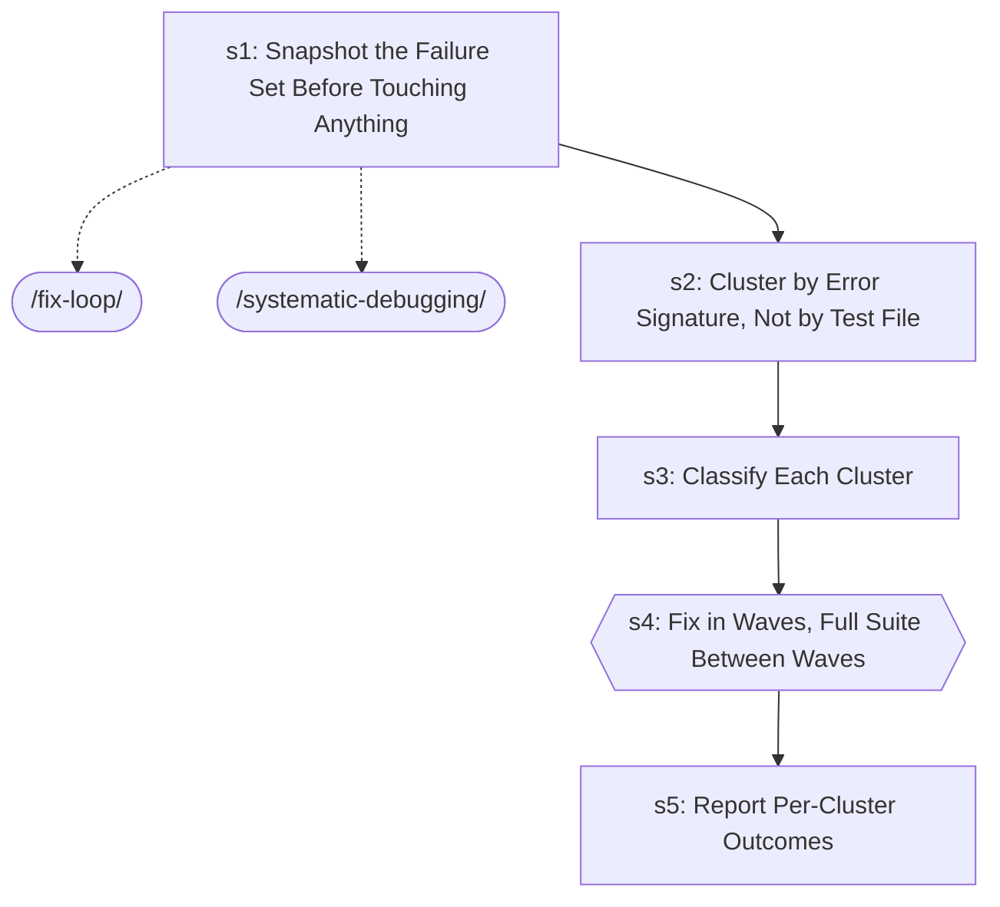
```mermaid
graph TD
    s1["s1: Snapshot the Failure Set Before Touching Anything"]
    fix_loop_ext([/fix-loop/])
    s1 -.-> fix_loop_ext
    systematic_debugging_ext([/systematic-debugging/])
    s1 -.-> systematic_debugging_ext
    s2["s2: Cluster by Error Signature, Not by Test File"]
    s1 --> s2
    s3["s3: Classify Each Cluster"]
    s2 --> s3
    s4{{s4: Fix in Waves, Full Suite Between Waves}}
    s3 --> s4
    s5["s5: Report Per-Cluster Outcomes"]
    s4 --> s5
```

| Step | Title | Delegates To | Artifacts | Gates/Decisions |
|------|-------|-------------|-----------|----------------|
| 1 | Snapshot the Failure Set Before Touching Anything | `/fix-loop`, `/systematic-debugging` | — | — |
| 2 | Cluster by Error Signature, Not by Test File | — | — | — |
| 3 | Classify Each Cluster | — | — | — |
| 4 | Fix in Waves, Full Suite Between Waves | — | — | gate |
| 5 | Report Per-Cluster Outcomes | — | — | — |

### e2e-visual-run

```mermaid
graph TD
    s1{{s1: INIT}}
    test_pipeline_ext([/test-pipeline/])
    s1 -.-> test_pipeline_ext
    update_practices_ext([/update-practices/])
    s1 -.-> update_practices_ext
    test_healer_agent_ext((test-healer-agent))
    s1 -.-> test_healer_agent_ext
    test_scout_agent_ext((test-scout-agent))
    s1 -.-> test_scout_agent_ext
    tester_agent_ext((tester-agent))
    s1 -.-> tester_agent_ext
    visual_inspector_agent_ext((visual-inspector-agent))
    s1 -.-> visual_inspector_agent_ext
    s1_block[/BLOCK/]
    s1 -->|FAILED| s1_block
    s2{{s2: SCOUT (E2E-specific classification)}}
    s1 -->|OK| s2
    s3{{s3: Drain test_queue — Capture Runs}}
    s2 --> s3
    s4{{s4: Drain verify_queue — Dual-Signal Visual Verdict}}
    s3 --> s4
    s5{{s5: Drain fix_queue — Confidence-Gated Auto-Heal}}
    s4 --> s5
    s6["s6: (reserved — intentionally not numbered in prior versions)"]
    s5 --> s6
    s7["s7: First-Run Artifact Detection"]
    s6 --> s7
    s8{{s8: Report}}
    s7 --> s8
    e2e_conductor_agent_ext((e2e-conductor-agent))
    s8 -.-> e2e_conductor_agent_ext
```

| Step | Title | Delegates To | Artifacts | Gates/Decisions |
|------|-------|-------------|-----------|----------------|
| 1 | INIT | `/test-pipeline`, `/update-practices`, `test-healer-agent`, `test-scout-agent`, `tester-agent`, `visual-inspector-agent` | → `test-results/e2e-pipeline*.json` | gate, decision, BLOCK |
| 2 | SCOUT (E2E-specific classification) | — | — | gate, decision |
| 3 | Drain test_queue — Capture Runs | — | → `test-results/e2e-pipeline.json` | gate |
| 4 | Drain verify_queue — Dual-Signal Visual Verdict | — | — | gate, decision, STEP 8 |
| 5 | Drain fix_queue — Confidence-Gated Auto-Heal | — | — | gate |
| 6 | (reserved — intentionally not numbered in prior versions) | — | — | — |
| 7 | First-Run Artifact Detection | — | — | — |
| 8 | Report | `e2e-conductor-agent` | → `test-results/e2e-pipeline.json` | gate, decision |

### fastapi-run-backend-tests

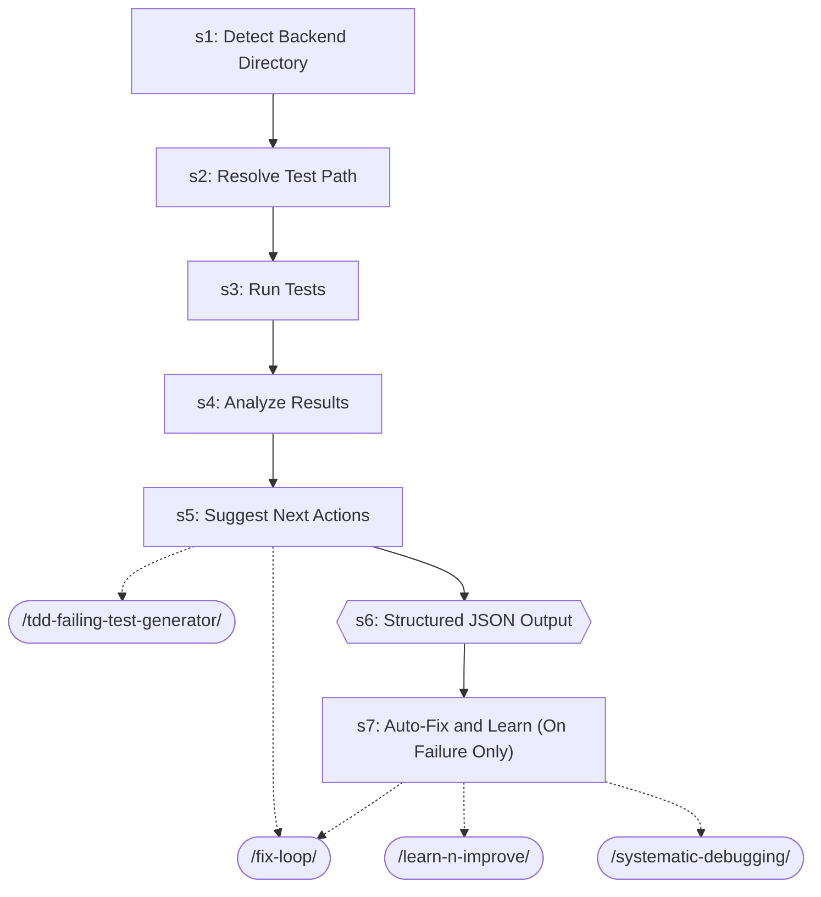
```mermaid
graph TD
    s1["s1: Detect Backend Directory"]
    s2["s2: Resolve Test Path"]
    s1 --> s2
    s3["s3: Run Tests"]
    s2 --> s3
    s4["s4: Analyze Results"]
    s3 --> s4
    s5["s5: Suggest Next Actions"]
    s4 --> s5
    fix_loop_ext([/fix-loop/])
    s5 -.-> fix_loop_ext
    tdd_failing_test_generator_ext([/tdd-failing-test-generator/])
    s5 -.-> tdd_failing_test_generator_ext
    s6{{s6: Structured JSON Output}}
    s5 --> s6
    s7["s7: Auto-Fix and Learn (On Failure Only)"]
    s6 --> s7
    fix_loop_ext([/fix-loop/])
    s7 -.-> fix_loop_ext
    learn_n_improve_ext([/learn-n-improve/])
    s7 -.-> learn_n_improve_ext
    systematic_debugging_ext([/systematic-debugging/])
    s7 -.-> systematic_debugging_ext
```

| Step | Title | Delegates To | Artifacts | Gates/Decisions |
|------|-------|-------------|-----------|----------------|
| 1 | Detect Backend Directory | — | — | — |
| 2 | Resolve Test Path | — | — | — |
| 3 | Run Tests | — | — | — |
| 4 | Analyze Results | — | — | — |
| 5 | Suggest Next Actions | `/fix-loop`, `/tdd-failing-test-generator` | — | — |
| 6 | Structured JSON Output | — | → `test-results/fastapi-run-backend-tests.json` | gate, decision |
| 7 | Auto-Fix and Learn (On Failure Only) | `/fix-loop`, `/learn-n-improve`, `/systematic-debugging` | — | decision |

### firebase-test

```mermaid
graph TD
    s1{{s1: Detect Firebase Project Configuration}}
    s2["s2: Firebase Emulator Suite Setup and Startup"]
    s1 --> s2
    s3["s3: Firestore Security Rules Testing"]
    s2 --> s3
    s4["s4: Cloud Functions Unit Testing"]
    s3 --> s4
    s5["s5: Auth Trigger Testing"]
    s4 --> s5
    s6["s6: Firebase Test Lab Integration for Mobile"]
    s5 --> s6
    s7["s7: Test Data Seeding with Emulator"]
    s6 --> s7
    s8["s8: Run Tests and Collect Results"]
    s7 --> s8
    s9{{s9: Write Structured JSON Output}}
    s8 --> s9
    s10["s10: Tear Down Emulators"]
    s9 --> s10
    s11{{s11: Auto-Fix and Learn (On Failure Only)}}
    s10 --> s11
    fix_loop_ext([/fix-loop/])
    s11 -.-> fix_loop_ext
    systematic_debugging_ext([/systematic-debugging/])
    s11 -.-> systematic_debugging_ext
```

| Step | Title | Delegates To | Artifacts | Gates/Decisions |
|------|-------|-------------|-----------|----------------|
| 1 | Detect Firebase Project Configuration | — | — | gate, decision |
| 2 | Firebase Emulator Suite Setup and Startup | — | — | decision |
| 3 | Firestore Security Rules Testing | — | — | — |
| 4 | Cloud Functions Unit Testing | — | — | — |
| 5 | Auth Trigger Testing | — | — | — |
| 6 | Firebase Test Lab Integration for Mobile | — | — | — |
| 7 | Test Data Seeding with Emulator | — | — | — |
| 8 | Run Tests and Collect Results | — | → `test-results/raw-output.json` | — |
| 9 | Write Structured JSON Output | — | → `test-results/firebase-test.json` | gate |
| 10 | Tear Down Emulators | — | — | — |
| 11 | Auto-Fix and Learn (On Failure Only) | `/fix-loop`, `/systematic-debugging` | → `test-results/firebase-test.json` | gate, decision |

### flutter-e2e-test

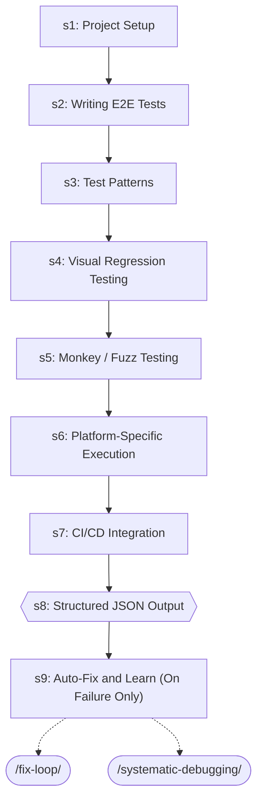
```mermaid
graph TD
    s1["s1: Project Setup"]
    s2["s2: Writing E2E Tests"]
    s1 --> s2
    s3["s3: Test Patterns"]
    s2 --> s3
    s4["s4: Visual Regression Testing"]
    s3 --> s4
    s5["s5: Monkey / Fuzz Testing"]
    s4 --> s5
    s6["s6: Platform-Specific Execution"]
    s5 --> s6
    s7["s7: CI/CD Integration"]
    s6 --> s7
    s8{{s8: Structured JSON Output}}
    s7 --> s8
    s9["s9: Auto-Fix and Learn (On Failure Only)"]
    s8 --> s9
    fix_loop_ext([/fix-loop/])
    s9 -.-> fix_loop_ext
    systematic_debugging_ext([/systematic-debugging/])
    s9 -.-> systematic_debugging_ext
```

| Step | Title | Delegates To | Artifacts | Gates/Decisions |
|------|-------|-------------|-----------|----------------|
| 1 | Project Setup | — | — | — |
| 2 | Writing E2E Tests | — | — | — |
| 3 | Test Patterns | — | — | — |
| 4 | Visual Regression Testing | — | — | decision |
| 5 | Monkey / Fuzz Testing | — | — | — |
| 6 | Platform-Specific Execution | — | — | — |
| 7 | CI/CD Integration | — | — | — |
| 8 | Structured JSON Output | — | → `test-results/flutter-e2e-test.json` | gate, decision |
| 9 | Auto-Fix and Learn (On Failure Only) | `/fix-loop`, `/systematic-debugging` | — | decision |

### full-defect-surface-sweep

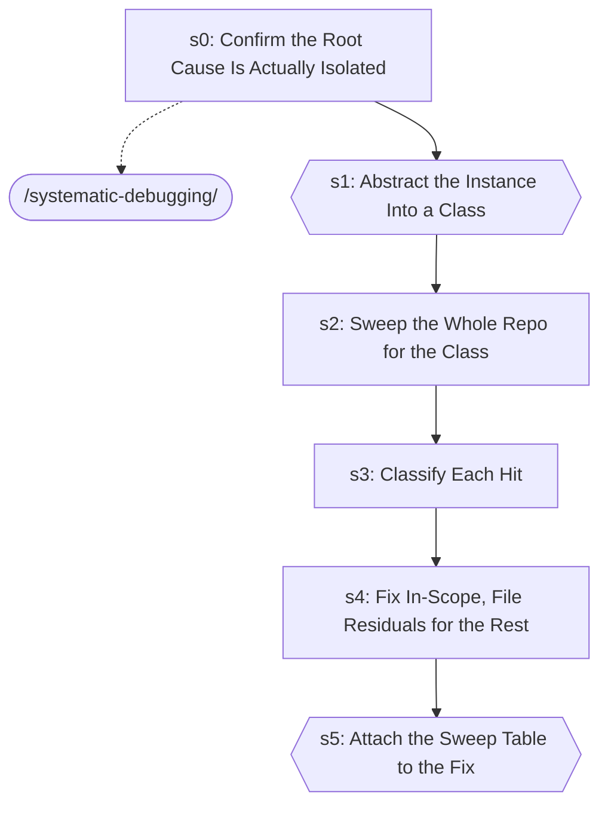
```mermaid
graph TD
    s0["s0: Confirm the Root Cause Is Actually Isolated"]
    systematic_debugging_ext([/systematic-debugging/])
    s0 -.-> systematic_debugging_ext
    s1{{s1: Abstract the Instance Into a Class}}
    s0 --> s1
    s2["s2: Sweep the Whole Repo for the Class"]
    s1 --> s2
    s3["s3: Classify Each Hit"]
    s2 --> s3
    s4["s4: Fix In-Scope, File Residuals for the Rest"]
    s3 --> s4
    s5{{s5: Attach the Sweep Table to the Fix}}
    s4 --> s5
```

| Step | Title | Delegates To | Artifacts | Gates/Decisions |
|------|-------|-------------|-----------|----------------|
| 0 | Confirm the Root Cause Is Actually Isolated | `/systematic-debugging` | — | — |
| 1 | Abstract the Instance Into a Class | — | — | gate |
| 2 | Sweep the Whole Repo for the Class | — | — | — |
| 3 | Classify Each Hit | — | — | — |
| 4 | Fix In-Scope, File Residuals for the Rest | — | — | — |
| 5 | Attach the Sweep Table to the Fix | — | — | gate |

### mobile-a11y-test

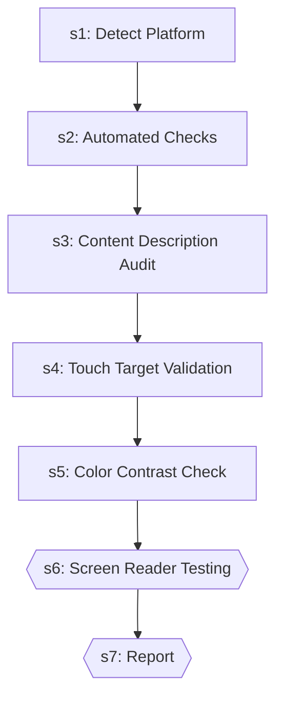
```mermaid
graph TD
    s1["s1: Detect Platform"]
    s2["s2: Automated Checks"]
    s1 --> s2
    s3["s3: Content Description Audit"]
    s2 --> s3
    s4["s4: Touch Target Validation"]
    s3 --> s4
    s5["s5: Color Contrast Check"]
    s4 --> s5
    s6{{s6: Screen Reader Testing}}
    s5 --> s6
    s7{{s7: Report}}
    s6 --> s7
```

| Step | Title | Delegates To | Artifacts | Gates/Decisions |
|------|-------|-------------|-----------|----------------|
| 1 | Detect Platform | — | — | — |
| 2 | Automated Checks | — | — | — |
| 3 | Content Description Audit | — | — | — |
| 4 | Touch Target Validation | — | — | — |
| 5 | Color Contrast Check | — | — | — |
| 6 | Screen Reader Testing | — | — | gate |
| 7 | Report | — | — | gate |

### tdd-failing-test-generator

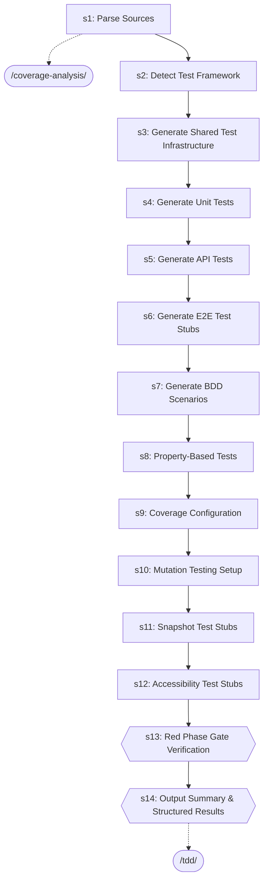
```mermaid
graph TD
    s1["s1: Parse Sources"]
    coverage_analysis_ext([/coverage-analysis/])
    s1 -.-> coverage_analysis_ext
    s2["s2: Detect Test Framework"]
    s1 --> s2
    s3["s3: Generate Shared Test Infrastructure"]
    s2 --> s3
    s4["s4: Generate Unit Tests"]
    s3 --> s4
    s5["s5: Generate API Tests"]
    s4 --> s5
    s6["s6: Generate E2E Test Stubs"]
    s5 --> s6
    s7["s7: Generate BDD Scenarios"]
    s6 --> s7
    s8["s8: Property-Based Tests"]
    s7 --> s8
    s9["s9: Coverage Configuration"]
    s8 --> s9
    s10["s10: Mutation Testing Setup"]
    s9 --> s10
    s11["s11: Snapshot Test Stubs"]
    s10 --> s11
    s12["s12: Accessibility Test Stubs"]
    s11 --> s12
    s13{{s13: Red Phase Gate Verification}}
    s12 --> s13
    s14{{s14: Output Summary & Structured Results}}
    s13 --> s14
    tdd_ext([/tdd/])
    s14 -.-> tdd_ext
```

| Step | Title | Delegates To | Artifacts | Gates/Decisions |
|------|-------|-------------|-----------|----------------|
| 1 | Parse Sources | `/coverage-analysis` | — | — |
| 2 | Detect Test Framework | — | — | — |
| 3 | Generate Shared Test Infrastructure | — | — | — |
| 4 | Generate Unit Tests | — | — | — |
| 5 | Generate API Tests | — | — | — |
| 6 | Generate E2E Test Stubs | — | — | — |
| 7 | Generate BDD Scenarios | — | — | — |
| 8 | Property-Based Tests | — | — | — |
| 9 | Coverage Configuration | — | — | — |
| 10 | Mutation Testing Setup | — | — | — |
| 11 | Snapshot Test Stubs | — | — | — |
| 12 | Accessibility Test Stubs | — | — | — |
| 13 | Red Phase Gate Verification | — | — | gate, decision |
| 14 | Output Summary & Structured Results | `/tdd` | → `test-results/tdd-failing-test-generator.json` | gate |

## Agents

| Agent | Description | Dispatched By |
|-------|-------------|---------------|
| `debugger-agent` | Use proactively to diagnose failures, analyze logs, investigate performance i... | — |
| `test-failure-analyzer-agent` | Use proactively to diagnose test failures — reads test output, classifies by ... | `/fix-loop`, `/test-healer-agent` |
| `test-healer-agent` | Use proactively to diagnose and fix Playwright E2E test failures from the fix... | `/e2e-visual-run`, `/test-failure-analyzer-agent` |

## Rules

| Rule | Description |
|------|-------------|
| `claude-behavior` |  |

## Cross-Workflow Connections

**Outgoing** (this workflow feeds into):
- `coverage-analysis` (skill)
- `post-fix-pipeline` (skill)
- `tdd` (skill)
- `test-scout-agent` (agent)
- `tester-agent` (agent)
- `update-practices` (skill)
- `visual-inspector-agent` (agent)

**Incoming** (fed by):
- `android-run-e2e` (skill)
- `android-test-patterns` (skill)
- `anthropic-agent-orchestration-guide` (skill)
- `continuous-improvement` (rule)
- `create-github-issue` (skill)
- `e2e-best-practices` (skill)
- `end-session` (skill)
- `engineering-roles` (rule)
- `escalation-report` (skill)
- `executing-plans` (skill)
- `fastapi-api-tester-agent` (agent)
- `fastapi-db-migrate` (skill)
- `fastapi-deploy` (skill)
- `github-issue-manager-agent` (agent)
- `learning-self-improvement` (skill)
- `learnings-routing` (rule)
- `pattern-self-containment` (rule)
- `pattern-structure` (rule)
- `project-manager-agent` (agent)
- `serialize-fixes` (skill)
- `ssot-audit` (skill)
- `supervisor-verification` (rule)
- `tdd` (skill)
- `test-data-management` (skill)
- `test-scout-agent` (agent)
- `tester-agent` (agent)
- `testing` (rule)
- `visual-inspector-agent` (agent)
- `weakened-test-hunter` (skill)
- `workflow` (rule)
- `workflow-master-template` (agent)

<!-- MANUAL ANNOTATIONS -->
<!-- Add custom notes below this line. They are preserved on regeneration. -->
