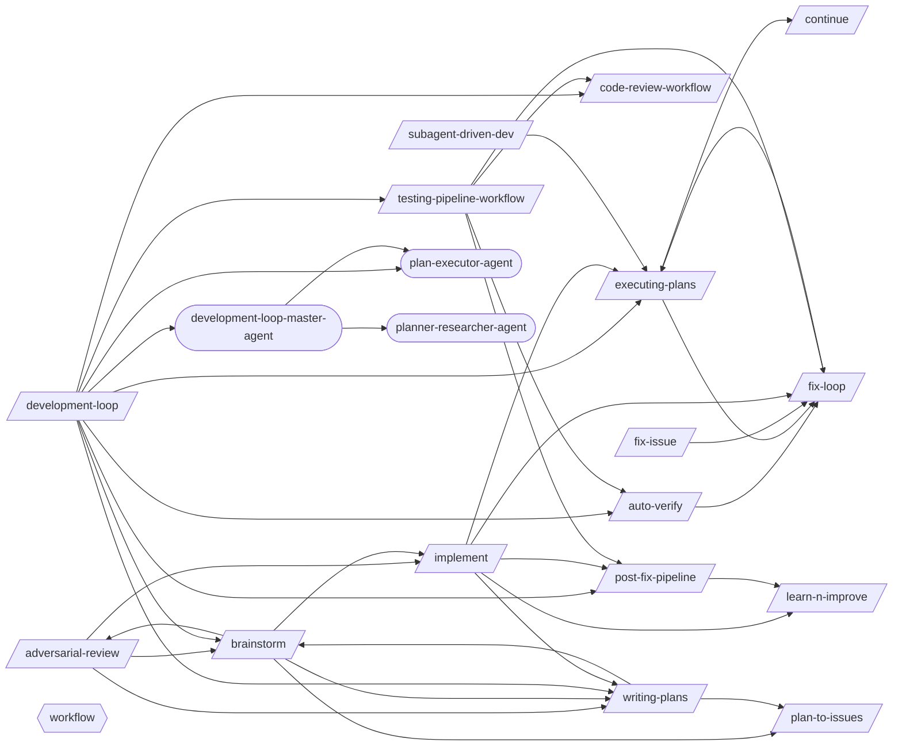

# Development Loop

> The core build cycle: ideate, plan, implement, verify, commit.

> Auto-generated by `scripts/generate_workflow_docs.py` | Last updated: 2026-03-30 13:40 UTC

## Overview



## Detailed Flow

Step-level flow showing gates (diamonds), delegations (dashed), and artifacts (cylinders).

```mermaid
graph TD
    subgraph adversarial_review_sub["Adversarial Review"]
        adversarial_review_s0{{Step 0: Determine Review Mode and Gather Context}}
        brainstorm_ext([/brainstorm/])
        adversarial_review_s0 -.-> brainstorm_ext
        implement_ext([/implement/])
        adversarial_review_s0 -.-> implement_ext
        pr_standards_ext([/pr-standards/])
        adversarial_review_s0 -.-> pr_standards_ext
        writing_plans_ext([/writing-plans/])
        adversarial_review_s0 -.-> writing_plans_ext
        adversarial_review_s1["Step 1: Applicability Check"]
        adversarial_review_s0 --> adversarial_review_s1
        adversarial_review_s2["Step 2: Launch Adversarial Reviewer Subagent"]
        adversarial_review_s1 --> adversarial_review_s2
        adversarial_review_s3["Step 3: Round 1 — Reviewer Critique"]
        adversarial_review_s2 --> adversarial_review_s3
        adversarial_review_s4["Step 4: Round 2 — Author Response"]
        adversarial_review_s3 --> adversarial_review_s4
        adversarial_review_s5["Step 5: Round 2 — Reviewer Follow-Up"]
        adversarial_review_s4 --> adversarial_review_s5
        adversarial_review_s6["Step 6: Round 3 — Final Resolution (If Needed)"]
        adversarial_review_s5 --> adversarial_review_s6
        adversarial_review_s7["Step 7: Generate Review Report"]
        adversarial_review_s6 --> adversarial_review_s7
        adversarial_review_s8{{Step 8: Apply Final Fixes and Verify}}
        adversarial_review_s7 --> adversarial_review_s8
        adversarial_review_s8 -.-> brainstorm_ext
    end

    subgraph auto_verify_sub["Auto Verify"]
        auto_verify_s0{{Step 0: Gate Check — Read Upstream Results}}
        test_pipeline_agent_ext((test-pipeline-agent))
        auto_verify_s0 -.-> test_pipeline_agent_ext
        auto_verify_test_results_fix_loop_json[("test-results/fix-loop.json")]
        auto_verify_test_results_fix_loop_json -.->|reads| auto_verify_s0
        auto_verify_s0_block[/BLOCK/]
        auto_verify_s0 -->|FAILED| auto_verify_s0_block
        auto_verify_s1{{Step 1: Map Changes to Tests (via /regression-test)}}
        auto_verify_s0 -->|OK| auto_verify_s1
        regression_test_ext([/regression-test/])
        auto_verify_s1 -.-> regression_test_ext
        tester_agent_ext((tester-agent))
        auto_verify_s1 -.-> tester_agent_ext
        auto_verify_test_results_regression_test_json[("test-results/regression-test.json")]
        auto_verify_test_results_regression_test_json -.->|reads| auto_verify_s1
        auto_verify_s2{{Step 2: Execute Tests (via tester-agent)}}
        auto_verify_s1 --> auto_verify_s2
        verify_screenshots_ext([/verify-screenshots/])
        auto_verify_s2 -.-> verify_screenshots_ext
        auto_verify_s2 -.-> tester_agent_ext
        auto_verify_test_evidence_run_id_manifest_json[("test-evidence/{run_id}/manifest.json")]
        auto_verify_s2 -->|writes| auto_verify_test_evidence_run_id_manifest_json
        auto_verify_test_evidence_run_id_visual_review_json[("test-evidence/{run_id}/visual-review.json")]
        auto_verify_s2 -->|writes| auto_verify_test_evidence_run_id_visual_review_json
        auto_verify_s3{{Step 3: Evaluate Results}}
        auto_verify_s2 --> auto_verify_s3
        fix_loop_ext([/fix-loop/])
        auto_verify_s3 -.-> fix_loop_ext
        auto_verify_s4{{Step 4: Quality Gate (if tests pass)}}
        auto_verify_s3 --> auto_verify_s4
        code_quality_gate_ext([/code-quality-gate/])
        auto_verify_s4 -.-> code_quality_gate_ext
        auto_verify_s4A{{Step 4A: Contract Verification (if API changed)}}
        auto_verify_s4 --> auto_verify_s4A
        contract_test_ext([/contract-test/])
        auto_verify_s4A -.-> contract_test_ext
        auto_verify_s4B{{Step 4B: Performance Baseline (if perf-sensitive code changed)}}
        auto_verify_s4A --> auto_verify_s4B
        perf_test_ext([/perf-test/])
        auto_verify_s4B -.-> perf_test_ext
        auto_verify_s5{{Step 5: Report}}
        auto_verify_s4B --> auto_verify_s5
        auto_verify_s6{{Step 6: Structured Output}}
        auto_verify_s5 --> auto_verify_s6
        auto_verify_test_results_auto_verify_json[("test-results/auto-verify.json")]
        auto_verify_s6 -->|writes| auto_verify_test_results_auto_verify_json
    end

    subgraph brainstorm_sub["Brainstorm"]
        brainstorm_s1["Step 1: Understand Intent"]
        brainstorm_s2{{Step 2: Deep Research}}
        brainstorm_s1 --> brainstorm_s2
        brainstorm_s3["Step 3: Propose Approaches"]
        brainstorm_s2 --> brainstorm_s3
        brainstorm_s4["Step 4: Design in Sections"]
        brainstorm_s3 --> brainstorm_s4
        brainstorm_s5["Step 5: Write Spec Document"]
        brainstorm_s4 --> brainstorm_s5
        brainstorm_s6["Step 6: Handoff"]
        brainstorm_s5 --> brainstorm_s6
        adversarial_review_ext([/adversarial-review/])
        brainstorm_s6 -.-> adversarial_review_ext
        brainstorm_s6 -.-> implement_ext
        plan_to_issues_ext([/plan-to-issues/])
        brainstorm_s6 -.-> plan_to_issues_ext
        brainstorm_s6 -.-> writing_plans_ext
    end

    subgraph continue_sub["Continue"]
        continue_s1["Step 1: Gather State"]
        start_session_ext([/start-session/])
        continue_s1 -.-> start_session_ext
        continue_s2["Step 2: Assess Priority"]
        continue_s1 --> continue_s2
        continue_s3["Step 3: Briefing"]
        continue_s2 --> continue_s3
    end

    subgraph executing_plans_sub["Executing Plans"]
        executing_plans_s1{{Step 1: Load and Validate the Plan}}
        executing_plans_s2["Step 2: Pre-Execution Setup"]
        executing_plans_s1 --> executing_plans_s2
        executing_plans_s3["Step 3: Execute Tasks"]
        executing_plans_s2 --> executing_plans_s3
        executing_plans_s4{{Step 4: Handle Failures}}
        executing_plans_s3 --> executing_plans_s4
        executing_plans_s4 -.-> fix_loop_ext
        executing_plans_s5["Step 5: Resume Support"]
        executing_plans_s4 --> executing_plans_s5
        continue_ext([/continue/])
        executing_plans_s5 -.-> continue_ext
        executing_plans_s6["Step 6: Completion Summary"]
        executing_plans_s5 --> executing_plans_s6
        executing_plans_s7["Step 7: Edge Cases and Special Handling"]
        executing_plans_s6 --> executing_plans_s7
    end

    subgraph fix_issue_sub["Fix Issue"]
        fix_issue_s1["Step 1: Fetch Issue Details"]
        fix_issue_s2["Step 2: Explore Codebase"]
        fix_issue_s1 --> fix_issue_s2
        fix_issue_s3["Step 3: Plan Implementation"]
        fix_issue_s2 --> fix_issue_s3
        fix_issue_s4["Step 4: Implement Fix"]
        fix_issue_s3 --> fix_issue_s4
        fix_issue_s5{{Step 5: Verify with Tests}}
        fix_issue_s4 --> fix_issue_s5
        fix_issue_s5 -.-> fix_loop_ext
        fix_issue_s6["Step 6: Post-Fix Pipeline"]
        fix_issue_s5 --> fix_issue_s6
        fix_issue_s7["Step 7: Summary"]
        fix_issue_s6 --> fix_issue_s7
    end

    subgraph fix_loop_sub["Fix Loop"]
        fix_loop_s1{{Step 1: Analyze Failure (via test-failure-analyzer-agent)}}
        test_failure_analyzer_agent_ext((test-failure-analyzer-agent))
        fix_loop_s1 -.-> test_failure_analyzer_agent_ext
        fix_loop_s1A["Step 1A: Flaky Test Detection"]
        fix_loop_s1 --> fix_loop_s1A
        fix_loop_s2["Step 2: Apply Fix"]
        fix_loop_s1A --> fix_loop_s2
        fix_loop_s3["Step 3: Retest (Full Loop mode only)"]
        fix_loop_s2 --> fix_loop_s3
        fix_loop_s4["Step 4: Report"]
        fix_loop_s3 --> fix_loop_s4
        fix_loop_s5{{Step 5: Structured Output}}
        fix_loop_s4 --> fix_loop_s5
        fix_loop_test_results_fix_loop_json[("test-results/fix-loop.json")]
        fix_loop_s5 -->|writes| fix_loop_test_results_fix_loop_json
    end

    subgraph implement_sub["Implement"]
        implement_s1["Step 1: Analyze Requirements"]
        implement_s1 -.-> writing_plans_ext
        implement_s2["Step 2: Create/Update Tests"]
        implement_s1 --> implement_s2
        implement_s3["Step 3: Implement the Feature"]
        implement_s2 --> implement_s3
        implement_s4["Step 4: Run Tests"]
        implement_s3 --> implement_s4
        implement_s5{{Step 5: Fix Loop (if tests fail)}}
        implement_s4 --> implement_s5
        implement_s5 -.-> fix_loop_ext
        implement_s6{{Step 6: Verification (Mandatory Gate)}}
        implement_s5 --> implement_s6
        post_fix_pipeline_ext([/post-fix-pipeline/])
        implement_s6 -.-> post_fix_pipeline_ext
        implement_s7["Step 7: Post-Implementation (Optional)"]
        implement_s6 --> implement_s7
        executing_plans_ext([/executing-plans/])
        implement_s7 -.-> executing_plans_ext
        implement_s8{{Step 8: Structured Output}}
        implement_s7 --> implement_s8
        implement_test_results_implement_json[("test-results/implement.json")]
        implement_s8 -->|writes| implement_test_results_implement_json
    end

    subgraph learn_n_improve_sub["Learn N Improve"]
        learn_n_improve_s1["Step 1: Gather Session Evidence"]
        learn_n_improve_s2["Step 2: Analyze Outcomes"]
        learn_n_improve_s1 --> learn_n_improve_s2
        learn_n_improve_s3["Step 3: Build Error→Fix→Lesson Database"]
        learn_n_improve_s2 --> learn_n_improve_s3
        learn_n_improve_s4["Step 4: Update Memory Topics"]
        learn_n_improve_s3 --> learn_n_improve_s4
        learn_n_improve_s5{{Step 5: Pattern Detection (every 10th learning)}}
        learn_n_improve_s4 --> learn_n_improve_s5
        skill_name_ext([/skill-name/])
        learn_n_improve_s5 -.-> skill_name_ext
        learn_n_improve_s6["Step 6: Report"]
        learn_n_improve_s5 --> learn_n_improve_s6
    end

    subgraph plan_to_issues_sub["Plan To Issues"]
        plan_to_issues_s1["Step 1: Parse Plan"]
        plan_to_issues_s2["Step 2: Check for Duplicates"]
        plan_to_issues_s1 --> plan_to_issues_s2
        plan_to_issues_s3["Step 3: Organize into Epics (if applicable)"]
        plan_to_issues_s2 --> plan_to_issues_s3
        plan_to_issues_s4["Step 4: Create Task Issues"]
        plan_to_issues_s3 --> plan_to_issues_s4
        plan_to_issues_s5["Step 5: Report"]
        plan_to_issues_s4 --> plan_to_issues_s5
    end

    subgraph post_fix_pipeline_sub["Post Fix Pipeline"]
        post_fix_pipeline_s0{{Step 0: Gate Check — Read Upstream Results}}
        post_fix_pipeline_test_evidence__visual_review_json[("test-evidence/*/visual-review.json")]
        post_fix_pipeline_test_evidence__visual_review_json -.->|reads| post_fix_pipeline_s0
        post_fix_pipeline_test_results_auto_verify_json[("test-results/auto-verify.json")]
        post_fix_pipeline_test_results_auto_verify_json -.->|reads| post_fix_pipeline_s0
        post_fix_pipeline_s0_block[/BLOCK/]
        post_fix_pipeline_s0 -->|FAILED| post_fix_pipeline_s0_block
        post_fix_pipeline_s1{{Step 1: Documentation Updates}}
        post_fix_pipeline_s0 -->|OK| post_fix_pipeline_s1
        docs_manager_agent_ext((docs-manager-agent))
        post_fix_pipeline_s1 -.-> docs_manager_agent_ext
        post_fix_pipeline_s2{{Step 2: Git Commit}}
        post_fix_pipeline_s1 --> post_fix_pipeline_s2
        git_manager_agent_ext((git-manager-agent))
        post_fix_pipeline_s2 -.-> git_manager_agent_ext
        post_fix_pipeline_s3["Step 3: Learning Capture"]
        post_fix_pipeline_s2 --> post_fix_pipeline_s3
        post_fix_pipeline_s4{{Step 4: Structured JSON Output}}
        post_fix_pipeline_s3 --> post_fix_pipeline_s4
        post_fix_pipeline_test_results_post_fix_pipeline_json[("test-results/post-fix-pipeline.json")]
        post_fix_pipeline_s4 -->|writes| post_fix_pipeline_test_results_post_fix_pipeline_json
    end

    subgraph subagent_driven_dev_sub["Subagent Driven Dev"]
        subagent_driven_dev_s1["Step 1: Decide Whether to Use Subagents"]
        subagent_driven_dev_s2["Step 2: Decompose the Task"]
        subagent_driven_dev_s1 --> subagent_driven_dev_s2
        subagent_driven_dev_s3{{Step 3: Write Subagent Prompts}}
        subagent_driven_dev_s2 --> subagent_driven_dev_s3
        subagent_driven_dev_s4["Step 4: Dispatch Strategy"]
        subagent_driven_dev_s3 --> subagent_driven_dev_s4
        subagent_driven_dev_s5{{Step 5: Monitor Progress and Aggregate Results}}
        subagent_driven_dev_s4 --> subagent_driven_dev_s5
        subagent_driven_dev_s6["Step 6: Handle Failures"]
        subagent_driven_dev_s5 --> subagent_driven_dev_s6
        subagent_driven_dev_s7["Step 7: Context Management for Subagents"]
        subagent_driven_dev_s6 --> subagent_driven_dev_s7
        subagent_driven_dev_s7 -.-> executing_plans_ext
        subagent_driven_dev_s8["Step 8: File Conflict Avoidance & Advanced Patterns"]
        subagent_driven_dev_s7 --> subagent_driven_dev_s8
        subagent_driven_dev_s9{{Step 9: Completion Summary}}
        subagent_driven_dev_s8 --> subagent_driven_dev_s9
    end

    subgraph writing_plans_sub["Writing Plans"]
        writing_plans_s1["Step 1: Understand Scope"]
        writing_plans_s1 -.-> brainstorm_ext
        writing_plans_s2{{Step 2: Decompose into Tasks}}
        writing_plans_s1 --> writing_plans_s2
        writing_plans_s3["Step 3: Add Dependency Graph"]
        writing_plans_s2 --> writing_plans_s3
        writing_plans_s4["Step 4: Review Plan Quality"]
        writing_plans_s3 --> writing_plans_s4
        writing_plans_s5["Step 5: Present for Approval"]
        writing_plans_s4 --> writing_plans_s5
        writing_plans_s6{{Step 6: Save Plan and Companion Files}}
        writing_plans_s5 --> writing_plans_s6
        writing_plans_s7["Step 7: Suggest Next Steps"]
        writing_plans_s6 --> writing_plans_s7
        writing_plans_s7 -.-> plan_to_issues_ext
    end

    adversarial_review_s0 ==> brainstorm_s1
    adversarial_review_s0 ==> implement_s1
    adversarial_review_s0 ==> writing_plans_s1
    auto_verify_s3 ==> fix_loop_s1
    brainstorm_s6 ==> adversarial_review_s0
    brainstorm_s6 ==> implement_s1
    brainstorm_s6 ==> plan_to_issues_s1
    brainstorm_s6 ==> writing_plans_s1
    executing_plans_s5 ==> continue_s1
    executing_plans_s4 ==> fix_loop_s1
    fix_issue_s5 ==> fix_loop_s1
    implement_s7 ==> executing_plans_s1
    implement_s5 ==> fix_loop_s1
    implement_s6 ==> post_fix_pipeline_s0
    implement_s1 ==> writing_plans_s1
    subagent_driven_dev_s7 ==> executing_plans_s1
    writing_plans_s1 ==> brainstorm_s1
    writing_plans_s7 ==> plan_to_issues_s1
```

## Skills

| Skill | Version | Description | Calls | Called By |
|-------|---------|-------------|-------|----------|
| `/adversarial-review` | 1.0.0 | Launch a structured adversarial review using a subagent with a dedicated revi... | `/brainstorm`, `/implement`, `/writing-plans` | `/brainstorm` |
| `/auto-verify` | 3.0.0 | Run a verification pipeline that identifies changed files, maps to targeted t... | `/fix-loop` | `/development-loop`, `/testing-pipeline-workflow` |
| `/brainstorm` | 1.0.0 | Explore intent through Socratic questioning, propose approaches with trade-of... | `/adversarial-review`, `/implement`, `/plan-to-issues`, `/writing-plans` | `/adversarial-review`, `/development-loop`, `/writing-plans` |
| `/code-review-workflow` | 1.0.0 | Run pre-merge quality gates, create PR, and handle review feedback. Use when ... | — | `/development-loop`, `/testing-pipeline-workflow` |
| `/continue` | 1.1.0 | Resume work from a previous session. Reads continuation state, workflow progr... | — | `/executing-plans` |
| `/development-loop` | 1.0.0 | Orchestrate the full development cycle from ideation through verified commit.... | `/auto-verify`, `/brainstorm`, `/code-review-workflow`, `/executing-plans`, `/post-fix-pipeline`, `/testing-pipeline-workflow`, `/writing-plans`, `/development-loop-master-agent`, `/plan-executor-agent` | — |
| `/executing-plans` | 1.0.0 | Execute a pre-written implementation plan step by step. Parses tasks from a p... | `/continue`, `/fix-loop` | `/development-loop`, `/fix-loop`, `/implement`, `/subagent-driven-dev` |
| `/fix-issue` | 1.0.0 | Analyze and implement a fix for a specific GitHub Issue. Fetches issue detail... | `/fix-loop` | — |
| `/fix-loop` | 1.2.0 | Analyze failures and iteratively apply minimal fixes, optionally retesting un... | `/executing-plans` | `/auto-verify`, `/executing-plans`, `/fix-issue`, `/implement`, `/testing-pipeline-workflow` |
| `/implement` | 1.0.0 | Implement a feature or fix following a structured workflow: requirements anal... | `/executing-plans`, `/fix-loop`, `/learn-n-improve`, `/post-fix-pipeline`, `/writing-plans` | `/adversarial-review`, `/brainstorm` |
| `/learn-n-improve` | 2.2.0 | Analyze session outcomes and update memory topics (testing-lessons, fix-patte... | — | `/implement`, `/post-fix-pipeline` |
| `/plan-to-issues` | 1.0.0 | Parse a markdown plan into GitHub Issues with labels and duplicate detection.... | — | `/brainstorm`, `/writing-plans` |
| `/post-fix-pipeline` | 3.0.0 | Finalize verified changes by reading the upstream auto-verify gate, updating ... | `/learn-n-improve` | `/development-loop`, `/implement`, `/testing-pipeline-workflow` |
| `/subagent-driven-dev` | 1.1.0 | Orchestrate task execution across multiple subagents for parallel development... | `/executing-plans` | — |
| `/testing-pipeline-workflow` | 1.0.0 | Run the complete test verification chain from TDD through quality gates. Use ... | `/auto-verify`, `/code-review-workflow`, `/fix-loop`, `/post-fix-pipeline` | `/development-loop` |
| `/writing-plans` | 1.0.0 | Generate detailed implementation plans with bite-sized tasks, exact file path... | `/brainstorm`, `/plan-to-issues` | `/adversarial-review`, `/brainstorm`, `/development-loop`, `/implement` |

## Agents

| Agent | Description | Dispatched By |
|-------|-------------|---------------|
| `development-loop-master-agent` | Orchestrate the full development cycle: ideate, plan, implement, verify, and ... | `/development-loop` |
| `plan-executor-agent` | Use this agent to parse structured plans into tracked steps, coordinate execu... | `/development-loop`, `/development-loop-master-agent` |
| `planner-researcher-agent` | Senior technical lead specializing in software architecture, system design, a... | `/development-loop-master-agent` |

## Rules

| Rule | Description |
|------|-------------|
| `workflow` | Development workflow guidelines for structured feature implementation and bug... |

## Cross-Workflow Connections

**Outgoing** (this workflow feeds into):
- `code-quality-gate` (skill)
- `code-review-master-agent` (agent)
- `contract-test` (skill)
- `db-migrate-verify` (skill)
- `docs-manager-agent` (agent)
- `documentation-workflow` (skill)
- `e2e-conductor-agent` (agent)
- `git-manager-agent` (agent)
- `perf-test` (skill)
- `pr-standards` (skill)
- `receive-code-review` (skill)
- `regression-test` (skill)
- `request-code-review` (skill)
- `review-gate` (skill)
- `start-session` (skill)
- `tdd` (skill)
- `test-failure-analyzer-agent` (agent)
- `test-pipeline-agent` (agent)
- `tester-agent` (agent)
- `testing-pipeline-master-agent` (agent)
- `verify-screenshots` (skill)
- `writing-skills` (skill)

**Incoming** (fed by):
- `android-run-e2e` (skill)
- `android-run-tests` (skill)
- `anthropic-agent-orchestration-guide` (skill)
- `bun-elysia-test` (skill)
- `claude-behavior` (rule)
- `code-review-master-agent` (agent)
- `configuration-ssot` (rule)
- `debugging-loop` (skill)
- `e2e-visual-run` (skill)
- `fastapi-run-backend-tests` (skill)
- `firebase-test` (skill)
- `flutter-e2e-test` (skill)
- `pattern-self-containment` (rule)
- `pr-standards` (skill)
- `prd-parser` (skill)
- `project-manager-agent` (agent)
- `project-scaffold` (skill)
- `regression-test` (skill)
- `review-gate` (skill)
- `save-session` (skill)
- `session-continuity` (skill)
- `skill-factory` (skill)
- `skill-master` (skill)
- `ssot-audit` (skill)
- `start-session` (skill)
- `tdd` (skill)
- `test-failure-analyzer-agent` (agent)
- `test-healer-agent` (agent)
- `tester-agent` (agent)
- `testing` (rule)
- `verify-screenshots` (skill)
- `web-research-specialist-agent` (agent)

<!-- MANUAL ANNOTATIONS -->
<!-- Add custom notes below this line. They are preserved on regeneration. -->
