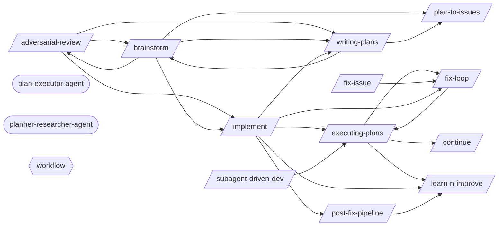

# Development Loop

> The core build cycle: ideate, plan, implement, verify, commit.

> Auto-generated by `scripts/generate_workflow_docs.py` | Last updated: 2026-03-21 11:56 UTC

## Flow Diagram

## Skills

| Skill | Version | Description | Calls | Called By |
|-------|---------|-------------|-------|----------|
| `/adversarial-review` | 1.0.0 | Launch a structured adversarial review using a subagent with a dedicated revi... | `/brainstorm`, `/implement`, `/writing-plans` | `/brainstorm` |
| `/brainstorm` | 1.0.0 | Socratic questioning phase before planning or implementation. Explores intent... | `/adversarial-review`, `/implement`, `/plan-to-issues`, `/writing-plans` | `/adversarial-review`, `/writing-plans` |
| `/continue` | 1.1.0 | Resume work from a previous session. Reads continuation state, workflow progr... | — | `/executing-plans` |
| `/executing-plans` | 1.0.0 | Execute a pre-written implementation plan step by step. Parses tasks from a p... | `/continue`, `/fix-loop`, `/learn-n-improve` | `/fix-loop`, `/implement`, `/subagent-driven-dev` |
| `/fix-issue` | 1.0.0 | Analyze and implement a fix for a specific GitHub Issue. Fetches issue detail... | `/fix-loop` | — |
| `/fix-loop` | 1.2.0 | Iterative fix cycle: analyze failures, apply minimal fixes, optionally retest... | `/executing-plans` | `/executing-plans`, `/fix-issue`, `/implement` |
| `/implement` | 1.0.0 | Implement a feature or fix following a structured workflow: requirements anal... | `/executing-plans`, `/fix-loop`, `/learn-n-improve`, `/post-fix-pipeline`, `/writing-plans` | `/adversarial-review`, `/brainstorm` |
| `/learn-n-improve` | 2.0.0 | Learning system analysis and self-modification. Analyzes session outcomes, up... | — | `/executing-plans`, `/implement`, `/post-fix-pipeline` |
| `/plan-to-issues` | 1.0.0 | Parse a markdown plan into GitHub Issues with labels and duplicate detection.... | — | `/brainstorm`, `/writing-plans` |
| `/post-fix-pipeline` | 2.0.0 | Post-fix completion pipeline: reads upstream auto-verify gate, updates docume... | `/learn-n-improve` | `/implement` |
| `/subagent-driven-dev` | 1.1.0 | Orchestrate task execution across multiple subagents for parallel development... | `/executing-plans` | — |
| `/writing-plans` | 1.0.0 | Generate detailed implementation plans with bite-sized tasks, exact file path... | `/brainstorm`, `/plan-to-issues` | `/adversarial-review`, `/brainstorm`, `/implement` |

## Agents

| Agent | Description | Dispatched By |
|-------|-------------|---------------|
| `plan-executor-agent` | Use this agent to parse structured plans into tracked steps, coordinate execu... | — |
| `planner-researcher-agent` | Senior technical lead specializing in software architecture, system design, a... | — |

## Rules

| Rule | Description |
|------|-------------|
| `workflow` | Development workflow guidelines for structured feature implementation and bug... |

## Cross-Workflow Connections

**Outgoing** (this workflow feeds into):
- `contract-test` (skill)
- `db-migrate-verify` (skill)
- `pr-standards` (skill)
- `start-session` (skill)
- `verify-screenshots` (skill)
- `writing-skills` (skill)

**Incoming** (fed by):
- `android-run-e2e` (skill)
- `android-run-tests` (skill)
- `anthropic-agent-orchestration-guide` (skill)
- `auto-verify` (skill)
- `fastapi-run-backend-tests` (skill)
- `pattern-self-containment` (rule)
- `pr-standards` (skill)
- `prd-parser` (skill)
- `project-manager-agent` (agent)
- `project-scaffold` (skill)
- `review-gate` (skill)
- `save-session` (skill)
- `skill-factory` (skill)
- `skill-master` (skill)
- `ssot-audit` (skill)
- `start-session` (skill)
- `tdd` (skill)
- `test-failure-analyzer-agent` (agent)
- `tester-agent` (agent)
- `testing` (rule)

<!-- MANUAL ANNOTATIONS -->
<!-- Add custom notes below this line. They are preserved on regeneration. -->

<!-- Add custom notes below this line. They are preserved on regeneration. -->
