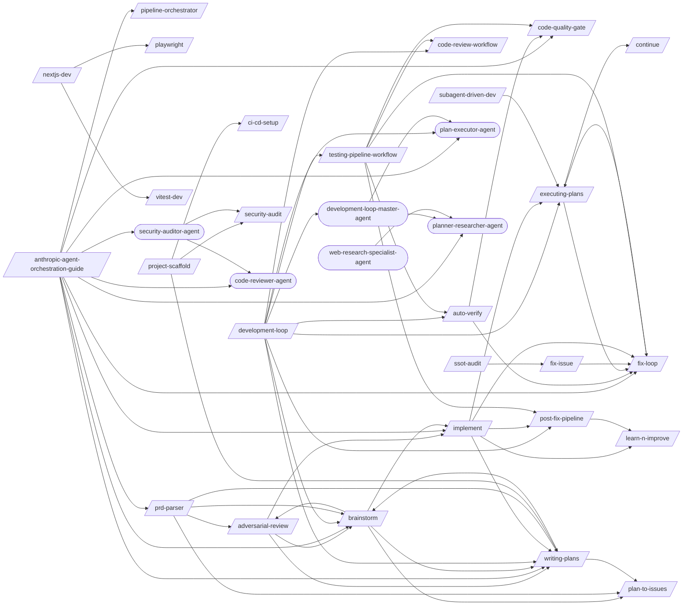

# Development Loop

> The core build cycle: ideate, plan, implement, verify, commit.

> Auto-generated by `scripts/generate_workflow_docs.py` | Last updated: 2026-03-31 09:41 UTC

## Overview

## Skills

| Skill | Version | Description | Calls | Called By |
|-------|---------|-------------|-------|----------|
| `/a11y-audit` | 1.0.0 | Run automated WCAG 2.1 AA compliance checks using axe-core (via Playwright) a... | — | — |
| `/adversarial-review` | 1.0.0 | Launch a structured adversarial review using a subagent with a dedicated revi... | `/brainstorm`, `/implement`, `/writing-plans` | `/brainstorm`, `/prd-parser` |
| `/anthropic-agent-orchestration-guide` | 1.0.0 | Design multi-agent orchestration systems using Anthropic's 5 workflow pattern... | `/brainstorm`, `/code-quality-gate`, `/fix-loop`, `/implement`, `/pipeline-orchestrator`, `/prd-parser`, `/writing-plans`, `/code-reviewer-agent`, `/plan-executor-agent`, `/planner-researcher-agent`, `/security-auditor-agent` | — |
| `/auto-verify` | 3.0.0 | Run a verification pipeline that identifies changed files, maps to targeted t... | `/code-quality-gate`, `/fix-loop` | `/development-loop`, `/testing-pipeline-workflow` |
| `/brainstorm` | 1.0.0 | Explore intent through Socratic questioning, propose approaches with trade-of... | `/adversarial-review`, `/implement`, `/plan-to-issues`, `/writing-plans` | `/adversarial-review`, `/anthropic-agent-orchestration-guide`, `/development-loop`, `/prd-parser`, `/writing-plans` |
| `/ci-cd-setup` | 1.0.0 | Set up CI/CD pipelines for GitHub Actions or GitLab CI. Covers workflow synta... | — | `/project-scaffold` |
| `/code-quality-gate` | 1.2.0 | Enforce code quality standards including cyclomatic complexity, duplication d... | — | `/anthropic-agent-orchestration-guide`, `/auto-verify`, `/testing-pipeline-workflow` |
| `/code-review-workflow` | 1.0.0 | Run pre-merge quality gates, create PR, and handle review feedback. Use when ... | — | `/development-loop`, `/testing-pipeline-workflow` |
| `/continue` | 1.1.0 | Resume work from a previous session. Reads continuation state, workflow progr... | — | `/executing-plans` |
| `/development-loop` | 1.0.0 | Orchestrate the full development cycle from ideation through verified commit.... | `/auto-verify`, `/brainstorm`, `/code-review-workflow`, `/executing-plans`, `/post-fix-pipeline`, `/testing-pipeline-workflow`, `/writing-plans`, `/development-loop-master-agent`, `/plan-executor-agent` | — |
| `/disaster-recovery` | 1.0.0 | Create disaster recovery plans with RTO/RPO targets derived from NFRs. Covers... | — | — |
| `/executing-plans` | 1.0.0 | Execute a pre-written implementation plan step by step. Parses tasks from a p... | `/continue`, `/fix-loop` | `/development-loop`, `/fix-loop`, `/implement`, `/subagent-driven-dev` |
| `/expo-dev` | 1.0.0 | Build and deploy React Native apps with Expo including project setup, Expo Ro... | — | — |
| `/firebase-dev` | 1.0.1 | Build Firebase-backed apps with project setup, CLI, Authentication (providers... | — | — |
| `/fix-issue` | 1.0.0 | Analyze and implement a fix for a specific GitHub Issue. Fetches issue detail... | `/fix-loop` | `/ssot-audit` |
| `/fix-loop` | 1.2.0 | Analyze failures and iteratively apply minimal fixes, optionally retesting un... | `/executing-plans` | `/anthropic-agent-orchestration-guide`, `/auto-verify`, `/executing-plans`, `/fix-issue`, `/implement`, `/testing-pipeline-workflow` |
| `/flutter-dev` | 1.0.0 | Build cross-platform Flutter 3+ apps with widget architecture, Riverpod/BLoC ... | — | — |
| `/git-worktrees` | 1.0.0 | Manage git worktrees for isolated parallel development. Provides a decision f... | — | — |
| `/implement` | 1.0.0 | Implement a feature or fix following a structured workflow: requirements anal... | `/executing-plans`, `/fix-loop`, `/learn-n-improve`, `/post-fix-pipeline`, `/writing-plans` | `/adversarial-review`, `/anthropic-agent-orchestration-guide`, `/brainstorm` |
| `/jest-dev` | 1.0.0 | Configure and run Jest tests with mocking (jest.mock/jest.fn/jest.spyOn/manua... | — | — |
| `/learn-n-improve` | 2.2.0 | Analyze session outcomes and update memory topics (testing-lessons, fix-patte... | — | `/implement`, `/post-fix-pipeline` |
| `/mcp-server-builder` | 1.0.0 | Build MCP (Model Context Protocol) servers that extend Claude Code's capabili... | — | — |
| `/nextjs-dev` | 1.0.0 | Build Next.js 14/15 App Router applications with Server/Client Components, ro... | `/playwright`, `/vitest-dev` | — |
| `/node-backend-dev` | 1.0.0 | Build Node.js backend services with project setup, routing, middleware, valid... | — | — |
| `/nuxt-dev` | 1.0.0 | Build Nuxt 4.3+ full-stack applications with project setup, server routes, SS... | — | — |
| `/pipeline-orchestrator` | 2.0.1 | Orchestrate multi-stage pipelines for PRD-to-Production delivery using a DAG-... | — | `/anthropic-agent-orchestration-guide` |
| `/plan-to-issues` | 1.0.0 | Parse a markdown plan into GitHub Issues with labels and duplicate detection.... | — | `/brainstorm`, `/prd-parser`, `/writing-plans` |
| `/playwright` | 1.1.2 | Write, run, and debug Playwright E2E tests for web applications including bro... | — | `/nextjs-dev` |
| `/post-fix-pipeline` | 3.0.0 | Finalize verified changes by reading the upstream auto-verify gate, updating ... | `/learn-n-improve` | `/development-loop`, `/implement`, `/testing-pipeline-workflow` |
| `/prd-parser` | 1.0.0 | Parse and normalize existing PRDs from markdown, Notion export, Jira export, ... | `/adversarial-review`, `/brainstorm`, `/plan-to-issues`, `/writing-plans` | `/anthropic-agent-orchestration-guide` |
| `/project-scaffold` | 1.0.0 | Scaffold a fully configured project skeleton with build, lint, test, CI, Dock... | `/ci-cd-setup`, `/security-audit`, `/writing-plans` | — |
| `/pytest-dev` | 1.0.0 | Apply pytest patterns for configuration, fixtures, parametrize, markers, asyn... | — | — |
| `/security-audit` | 1.0.0 | Run security audits covering static analysis with CodeQL and Semgrep, SARIF t... | — | `/project-scaffold`, `/security-auditor-agent` |
| `/ssot-audit` | 1.0.0 | Audit project's Claude Code configuration for Single Source of Truth violatio... | `/fix-issue` | — |
| `/subagent-driven-dev` | 1.1.0 | Orchestrate task execution across multiple subagents for parallel development... | `/executing-plans` | — |
| `/testing-pipeline-workflow` | 1.0.0 | Run the complete test verification chain from TDD through quality gates. Use ... | `/auto-verify`, `/code-quality-gate`, `/code-review-workflow`, `/fix-loop`, `/post-fix-pipeline` | `/development-loop` |
| `/vitest-dev` | 1.0.0 | Apply Vitest patterns for configuration, mocking (vi.mock/vi.fn/vi.spyOn), sn... | — | `/nextjs-dev` |
| `/vue-dev` | 1.0.0 | Build Vue 3.5+ applications using Composition API patterns, TypeScript integr... | — | — |
| `/writing-plans` | 1.0.0 | Generate detailed implementation plans with bite-sized tasks, exact file path... | `/brainstorm`, `/plan-to-issues` | `/adversarial-review`, `/anthropic-agent-orchestration-guide`, `/brainstorm`, `/development-loop`, `/implement`, `/prd-parser`, `/project-scaffold` |

## Agents

| Agent | Description | Dispatched By |
|-------|-------------|---------------|
| `android-build-fixer-agent` | Use proactively to diagnose and fix Android Gradle build failures. Spawn auto... | — |
| `anthropic-multi-agent-reviewer-agent` | Review multi-agent orchestration systems against Anthropic's 8 research-backe... | — |
| `code-reviewer-agent` | Use proactively to review recently changed files for code quality, type safet... | `/anthropic-agent-orchestration-guide`, `/security-auditor-agent` |
| `development-loop-master-agent` | Orchestrate the full development cycle: ideate, plan, implement, verify, and ... | `/development-loop` |
| `plan-executor-agent` | Use this agent to parse structured plans into tracked steps, coordinate execu... | `/anthropic-agent-orchestration-guide`, `/development-loop`, `/development-loop-master-agent` |
| `planner-researcher-agent` | Senior technical lead specializing in software architecture, system design, a... | `/anthropic-agent-orchestration-guide`, `/development-loop-master-agent`, `/web-research-specialist-agent` |
| `security-auditor-agent` | Use proactively for security assessments — OWASP Top 10 scanning, threat mode... | `/anthropic-agent-orchestration-guide` |
| `web-research-specialist-agent` | Use this agent for web research — finding documentation, API references, libr... | — |
| `workflow-master-template` | Shared orchestration protocol reference for all workflow-master agents. Not a... | — |

## Rules

| Rule | Description |
|------|-------------|
| `workflow` | Development workflow guidelines for structured feature implementation and bug... |

## Cross-Workflow Connections

**Outgoing** (this workflow feeds into):
- `architecture-fitness` (skill)
- `code-review-master-agent` (agent)
- `contract-test` (skill)
- `db-migrate-verify` (skill)
- `docs-manager-agent` (agent)
- `documentation-workflow` (skill)
- `e2e-conductor-agent` (agent)
- `git-manager-agent` (agent)
- `perf-test` (skill)
- `pr-standards` (skill)
- `project-manager-agent` (agent)
- `receive-code-review` (skill)
- `regression-test` (skill)
- `request-code-review` (skill)
- `review-gate` (skill)
- `start-session` (skill)
- `tdd` (skill)
- `test-failure-analyzer-agent` (agent)
- `test-pipeline-agent` (agent)
- `tester-agent` (agent)
- `testing-pipeline-master-agent` (agent)
- `verify-screenshots` (skill)
- `writing-skills` (skill)

**Incoming** (fed by):
- `android-run-e2e` (skill)
- `android-run-tests` (skill)
- `anthropic-multi-agent-research-system-skill` (skill)
- `bun-elysia-test` (skill)
- `claude-behavior` (rule)
- `code-review-master-agent` (agent)
- `configuration-ssot` (rule)
- `debugging-loop` (skill)
- `e2e-best-practices` (skill)
- `e2e-visual-run` (skill)
- `fastapi-run-backend-tests` (skill)
- `firebase-test` (skill)
- `flutter-e2e-test` (skill)
- `pattern-self-containment` (rule)
- `pattern-structure` (rule)
- `pr-standards` (skill)
- `project-manager-agent` (agent)
- `regression-test` (skill)
- `review-gate` (skill)
- `save-session` (skill)
- `session-continuity` (skill)
- `skill-factory` (skill)
- `skill-master` (skill)
- `start-session` (skill)
- `tdd` (skill)
- `tdd-rule` (rule)
- `test-failure-analyzer-agent` (agent)
- `test-healer-agent` (agent)
- `tester-agent` (agent)
- `testing` (rule)
- `verify-screenshots` (skill)
- `writing-skills` (skill)

<!-- MANUAL ANNOTATIONS -->
<!-- Add custom notes below this line. They are preserved on regeneration. -->
