# Development Loop

> The core build cycle: ideate, plan, implement, verify, commit.

> Auto-generated by `scripts/generate_workflow_docs.py` | Last updated: 2026-04-30 13:02 UTC

## Overview

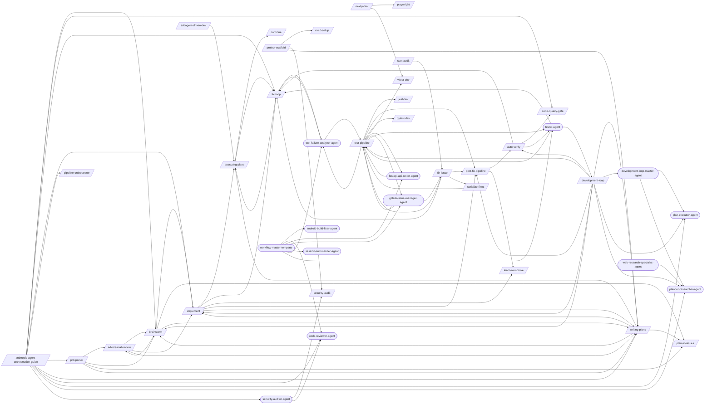

## Skills

| Skill | Version | Description | Calls | Called By |
|-------|---------|-------------|-------|----------|
| `/a11y-audit` | 1.0.0 | Run automated WCAG 2.1 AA compliance checks using axe-core (via Playwright) a... | — | — |
| `/adversarial-review` | 1.0.0 | Launch a structured adversarial review using a subagent with a dedicated revi... | `/brainstorm`, `/implement`, `/writing-plans` | `/brainstorm`, `/prd-parser` |
| `/anthropic-agent-orchestration-guide` | 1.0.0 | Design multi-agent orchestration systems using Anthropic's 5 workflow pattern... | `/brainstorm`, `/code-quality-gate`, `/fix-loop`, `/implement`, `/pipeline-orchestrator`, `/prd-parser`, `/writing-plans`, `/code-reviewer-agent`, `/plan-executor-agent`, `/planner-researcher-agent`, `/security-auditor-agent` | — |
| `/auto-verify` | 4.1.0 | Run a post-change verification pipeline that maps changed files to targeted t... | `/code-quality-gate`, `/fix-loop`, `/tester-agent` | `/development-loop`, `/post-fix-pipeline` |
| `/brainstorm` | 1.0.0 | Explore intent through Socratic questioning, propose approaches with trade-of... | `/adversarial-review`, `/implement`, `/plan-to-issues`, `/writing-plans` | `/adversarial-review`, `/anthropic-agent-orchestration-guide`, `/development-loop`, `/prd-parser`, `/writing-plans` |
| `/ci-cd-setup` | 1.1.0 | Set up CI/CD pipelines for GitHub Actions or GitLab CI. Covers workflow synta... | — | `/project-scaffold` |
| `/code-quality-gate` | 1.2.1 | Enforce code quality standards including cyclomatic complexity, duplication d... | — | `/anthropic-agent-orchestration-guide`, `/auto-verify` |
| `/continue` | 1.1.0 | Resume work from a previous session. Reads continuation state, workflow progr... | — | `/executing-plans` |
| `/development-loop` | 2.0.0 | Orchestrate the full development cycle end-to-end as a skill-at-T0 orchestrat... | `/auto-verify`, `/brainstorm`, `/implement`, `/post-fix-pipeline`, `/test-pipeline`, `/writing-plans`, `/development-loop-master-agent`, `/plan-executor-agent`, `/planner-researcher-agent` | `/tester-agent` |
| `/disaster-recovery` | 1.0.0 | Create disaster recovery plans with RTO/RPO targets derived from NFRs. Covers... | — | — |
| `/executing-plans` | 1.0.0 | Execute a pre-written implementation plan step by step. Parses tasks from a p... | `/continue`, `/fix-loop` | `/fix-loop`, `/implement`, `/subagent-driven-dev`, `/writing-plans` |
| `/expo-dev` | 1.0.0 | Build and deploy React Native apps with Expo including project setup, Expo Ro... | — | — |
| `/firebase-dev` | 1.0.2 | Build Firebase-backed apps with project setup, CLI, Authentication (providers... | — | — |
| `/fix-issue` | 2.6.0 | Analyze and implement a fix for a specific GitHub Issue. Fetches issue detail... | `/fix-loop`, `/post-fix-pipeline`, `/serialize-fixes`, `/test-pipeline` | `/ssot-audit`, `/github-issue-manager-agent` |
| `/fix-loop` | 1.4.0 | Analyze failures and iteratively apply minimal fixes, optionally retesting un... | `/executing-plans`, `/test-failure-analyzer-agent` | `/anthropic-agent-orchestration-guide`, `/auto-verify`, `/executing-plans`, `/fix-issue`, `/implement`, `/test-failure-analyzer-agent`, `/tester-agent` |
| `/flutter-dev` | 1.0.0 | Build cross-platform Flutter 3+ apps with widget architecture, Riverpod/BLoC ... | — | — |
| `/git-worktrees` | 1.0.0 | Manage git worktrees for isolated parallel development. Provides a decision f... | — | — |
| `/implement` | 2.2.0 | Implement a feature or fix following a structured workflow: requirements anal... | `/executing-plans`, `/fix-loop`, `/learn-n-improve`, `/post-fix-pipeline`, `/writing-plans` | `/adversarial-review`, `/anthropic-agent-orchestration-guide`, `/brainstorm`, `/development-loop`, `/writing-plans` |
| `/jest-dev` | 1.0.0 | Configure and run Jest tests with mocking (jest.mock/jest.fn/jest.spyOn/manua... | — | `/test-pipeline` |
| `/learn-n-improve` | 2.4.0 | Analyze session outcomes and update memory topics (testing-lessons, fix-patte... | — | `/implement`, `/post-fix-pipeline` |
| `/mcp-server-builder` | 1.0.0 | Build MCP (Model Context Protocol) servers that extend Claude Code's capabili... | — | — |
| `/nextjs-dev` | 1.0.0 | Build Next.js 14/15 App Router applications with Server/Client Components, ro... | `/playwright`, `/vitest-dev` | — |
| `/node-backend-dev` | 1.0.0 | Build Node.js backend services with project setup, routing, middleware, valid... | — | — |
| `/nuxt-dev` | 1.0.0 | Build Nuxt 4.3+ full-stack applications with project setup, server routes, SS... | — | — |
| `/pipeline-orchestrator` | 2.1.0 | Orchestrate multi-stage pipelines for PRD-to-Production delivery using a DAG-... | — | `/anthropic-agent-orchestration-guide` |
| `/plan-to-issues` | 1.2.0 | Parse a markdown plan into GitHub Issues with labels and duplicate detection.... | — | `/brainstorm`, `/prd-parser`, `/writing-plans` |
| `/playwright` | 1.2.0 | Write, run, and debug Playwright E2E tests for web applications including bro... | — | `/nextjs-dev` |
| `/post-fix-pipeline` | 3.1.0 | Finalize verified changes by reading the upstream auto-verify gate, updating ... | `/auto-verify`, `/learn-n-improve` | `/development-loop`, `/fix-issue`, `/implement`, `/test-pipeline` |
| `/prd-parser` | 1.0.0 | Parse and normalize existing PRDs from markdown, Notion export, Jira export, ... | `/adversarial-review`, `/brainstorm`, `/plan-to-issues`, `/writing-plans` | `/anthropic-agent-orchestration-guide` |
| `/project-scaffold` | 1.0.0 | Scaffold a fully configured project skeleton with build, lint, test, CI, Dock... | `/ci-cd-setup`, `/security-audit`, `/writing-plans` | — |
| `/pytest-dev` | 1.0.1 | Apply pytest patterns for configuration, fixtures, parametrize, markers, asyn... | — | `/test-pipeline` |
| `/security-audit` | 1.0.0 | Run security audits covering static analysis with CodeQL and Semgrep, SARIF t... | — | `/project-scaffold`, `/security-auditor-agent` |
| `/serialize-fixes` | 1.1.0 | Apply a list of unified-diff files sequentially to the working tree using the... | `/test-pipeline` | `/fix-issue` |
| `/ssot-audit` | 1.2.0 | Audit project's Claude Code configuration for Single Source of Truth violatio... | `/fix-issue` | — |
| `/subagent-driven-dev` | 1.1.0 | Orchestrate task execution across multiple subagents for parallel development... | `/executing-plans` | — |
| `/test-pipeline` | 3.0.0 | Run your full test suite end-to-end: find broken tests, diagnose root causes,... | `/jest-dev`, `/post-fix-pipeline`, `/pytest-dev`, `/vitest-dev`, `/fastapi-api-tester-agent`, `/github-issue-manager-agent`, `/test-failure-analyzer-agent`, `/tester-agent` | `/development-loop`, `/fix-issue`, `/serialize-fixes`, `/fastapi-api-tester-agent`, `/github-issue-manager-agent`, `/test-failure-analyzer-agent`, `/tester-agent` |
| `/vitest-dev` | 1.0.1 | Apply Vitest patterns for configuration, mocking (vi.mock/vi.fn/vi.spyOn), sn... | — | `/nextjs-dev`, `/test-pipeline` |
| `/vue-dev` | 1.0.0 | Build Vue 3.5+ applications using Composition API patterns, TypeScript integr... | — | — |
| `/writing-plans` | 1.2.0 | Generate detailed implementation plans with bite-sized tasks, exact file path... | `/brainstorm`, `/executing-plans`, `/implement`, `/plan-to-issues` | `/adversarial-review`, `/anthropic-agent-orchestration-guide`, `/brainstorm`, `/development-loop`, `/implement`, `/prd-parser`, `/project-scaffold` |

## Workflow Steps

### Entry Points

Double-bordered nodes are user-facing entry points (no incoming references). Rounded nodes are agents.

```mermaid
graph LR
    anthropic_agent_orchestration_guide[["anthropic-agent-orchestration-guide"]]
    nextjs_dev[["nextjs-dev"]]
    project_scaffold[["project-scaffold"]]
    ssot_audit[["ssot-audit"]]
    subagent_driven_dev[["subagent-driven-dev"]]
    web_research_specialist_agent(["web-research-specialist-agent"])
    workflow_master_template(["workflow-master-template"])
    adversarial_review["adversarial-review"]
    android_build_fixer_agent(["android-build-fixer-agent"])
    auto_verify["auto-verify"]
    brainstorm["brainstorm"]
    ci_cd_setup["ci-cd-setup"]
    code_quality_gate["code-quality-gate"]
    code_reviewer_agent(["code-reviewer-agent"])
    continue["continue"]
    development_loop["development-loop"]
    development_loop_master_agent(["development-loop-master-agent"])
    executing_plans["executing-plans"]
    fastapi_api_tester_agent(["fastapi-api-tester-agent"])
    fix_issue["fix-issue"]
    fix_loop["fix-loop"]
    github_issue_manager_agent(["github-issue-manager-agent"])
    implement["implement"]
    jest_dev["jest-dev"]
    learn_n_improve["learn-n-improve"]
    pipeline_orchestrator["pipeline-orchestrator"]
    plan_executor_agent(["plan-executor-agent"])
    plan_to_issues["plan-to-issues"]
    planner_researcher_agent(["planner-researcher-agent"])
    playwright["playwright"]
    post_fix_pipeline["post-fix-pipeline"]
    prd_parser["prd-parser"]
    pytest_dev["pytest-dev"]
    security_audit["security-audit"]
    security_auditor_agent(["security-auditor-agent"])
    serialize_fixes["serialize-fixes"]
    session_summarizer_agent(["session-summarizer-agent"])
    test_failure_analyzer_agent(["test-failure-analyzer-agent"])
    test_pipeline["test-pipeline"]
    tester_agent(["tester-agent"])
    vitest_dev["vitest-dev"]
    writing_plans["writing-plans"]
    adversarial_review --> brainstorm
    adversarial_review --> implement
    adversarial_review --> writing_plans
    anthropic_agent_orchestration_guide --> brainstorm
    anthropic_agent_orchestration_guide --> code_quality_gate
    anthropic_agent_orchestration_guide --> fix_loop
    anthropic_agent_orchestration_guide --> implement
    anthropic_agent_orchestration_guide --> pipeline_orchestrator
    anthropic_agent_orchestration_guide --> prd_parser
    anthropic_agent_orchestration_guide --> writing_plans
    anthropic_agent_orchestration_guide --> code_reviewer_agent
    anthropic_agent_orchestration_guide --> plan_executor_agent
    anthropic_agent_orchestration_guide --> planner_researcher_agent
    anthropic_agent_orchestration_guide --> security_auditor_agent
    auto_verify --> code_quality_gate
    auto_verify --> fix_loop
    auto_verify --> tester_agent
    brainstorm --> adversarial_review
    brainstorm --> implement
    brainstorm --> plan_to_issues
    brainstorm --> writing_plans
    development_loop --> auto_verify
    development_loop --> brainstorm
    development_loop --> implement
    development_loop --> post_fix_pipeline
    development_loop --> test_pipeline
    development_loop --> writing_plans
    development_loop --> development_loop_master_agent
    development_loop --> plan_executor_agent
    development_loop --> planner_researcher_agent
    executing_plans --> continue
    executing_plans --> fix_loop
    fix_issue --> fix_loop
    fix_issue --> post_fix_pipeline
    fix_issue --> serialize_fixes
    fix_issue --> test_pipeline
    fix_loop --> executing_plans
    fix_loop --> test_failure_analyzer_agent
    implement --> executing_plans
    implement --> fix_loop
    implement --> learn_n_improve
    implement --> post_fix_pipeline
    implement --> writing_plans
    nextjs_dev --> playwright
    nextjs_dev --> vitest_dev
    post_fix_pipeline --> auto_verify
    post_fix_pipeline --> learn_n_improve
    prd_parser --> adversarial_review
    prd_parser --> brainstorm
    prd_parser --> plan_to_issues
    prd_parser --> writing_plans
    project_scaffold --> ci_cd_setup
    project_scaffold --> security_audit
    project_scaffold --> writing_plans
    serialize_fixes --> test_pipeline
    ssot_audit --> fix_issue
    subagent_driven_dev --> executing_plans
    test_pipeline --> jest_dev
    test_pipeline --> post_fix_pipeline
    test_pipeline --> pytest_dev
    test_pipeline --> vitest_dev
    test_pipeline --> fastapi_api_tester_agent
    test_pipeline --> github_issue_manager_agent
    test_pipeline --> test_failure_analyzer_agent
    test_pipeline --> tester_agent
    writing_plans --> brainstorm
    writing_plans --> executing_plans
    writing_plans --> implement
    writing_plans --> plan_to_issues
    development_loop_master_agent --> plan_executor_agent
    development_loop_master_agent --> planner_researcher_agent
    fastapi_api_tester_agent --> test_pipeline
    github_issue_manager_agent --> fix_issue
    github_issue_manager_agent --> test_pipeline
    security_auditor_agent --> security_audit
    security_auditor_agent --> code_reviewer_agent
    test_failure_analyzer_agent --> fix_loop
    test_failure_analyzer_agent --> test_pipeline
    tester_agent --> development_loop
    tester_agent --> fix_loop
    tester_agent --> test_pipeline
    web_research_specialist_agent --> planner_researcher_agent
    workflow_master_template --> android_build_fixer_agent
    workflow_master_template --> code_reviewer_agent
    workflow_master_template --> fastapi_api_tester_agent
    workflow_master_template --> github_issue_manager_agent
    workflow_master_template --> session_summarizer_agent
    workflow_master_template --> test_failure_analyzer_agent
    workflow_master_template --> tester_agent
```

### a11y-audit

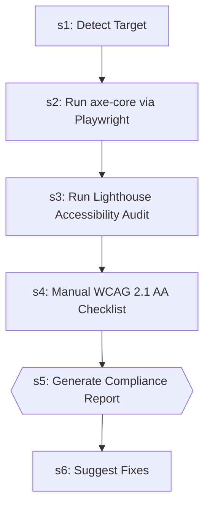

| Step | Title | Delegates To | Artifacts | Gates/Decisions |
|------|-------|-------------|-----------|----------------|
| 1 | Detect Target | — | — | — |
| 2 | Run axe-core via Playwright | — | — | — |
| 3 | Run Lighthouse Accessibility Audit | — | — | — |
| 4 | Manual WCAG 2.1 AA Checklist | — | — | — |
| 5 | Generate Compliance Report | — | — | gate |
| 6 | Suggest Fixes | — | — | decision |

### adversarial-review

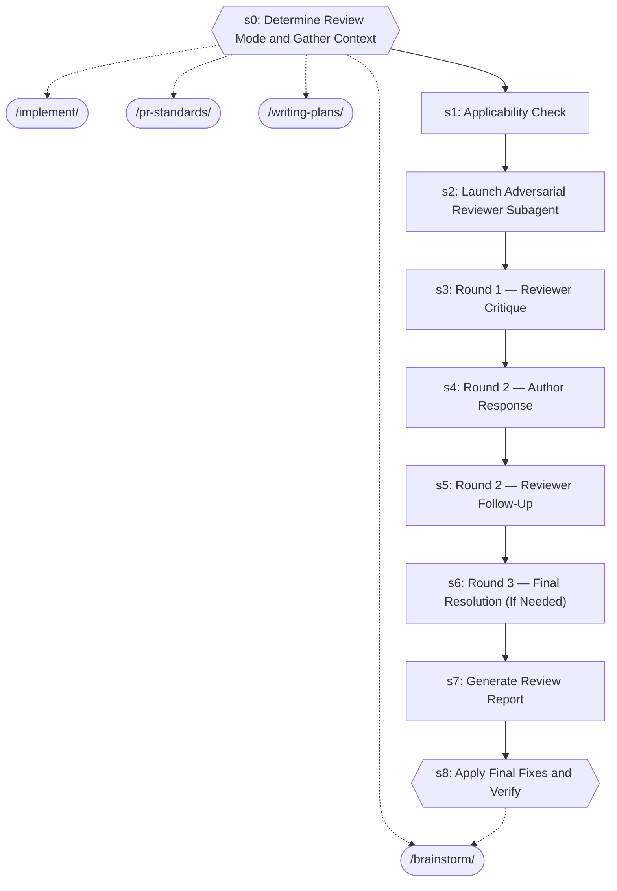

| Step | Title | Delegates To | Artifacts | Gates/Decisions |
|------|-------|-------------|-----------|----------------|
| 0 | Determine Review Mode and Gather Context | `/brainstorm`, `/implement`, `/pr-standards`, `/writing-plans` | — | gate |
| 1 | Applicability Check | — | — | — |
| 2 | Launch Adversarial Reviewer Subagent | — | — | — |
| 3 | Round 1 — Reviewer Critique | — | — | — |
| 4 | Round 2 — Author Response | — | — | — |
| 5 | Round 2 — Reviewer Follow-Up | — | — | — |
| 6 | Round 3 — Final Resolution (If Needed) | — | — | — |
| 7 | Generate Review Report | — | — | — |
| 8 | Apply Final Fixes and Verify | `/brainstorm` | — | gate, decision |

### anthropic-agent-orchestration-guide

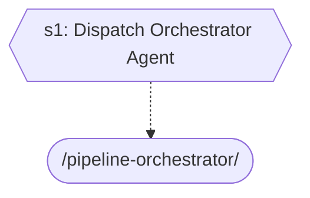

| Step | Title | Delegates To | Artifacts | Gates/Decisions |
|------|-------|-------------|-----------|----------------|
| 1 | Dispatch Orchestrator Agent | `/pipeline-orchestrator` | — | gate, decision |

### auto-verify

```mermaid
graph TD
    s0{{s0: Gate Check — Read Upstream Results}}
    s0_block[/BLOCK/]
    s0 -->|FAILED| s0_block
    s1{{s1: Map Changes to Tests (via /regression-test)}}
    s0 -->|OK| s1
    regression_test_ext([/regression-test/])
    s1 -.-> regression_test_ext
    tester_agent_ext((tester-agent))
    s1 -.-> tester_agent_ext
    s2{{s2: Execute Tests (via tester-agent)}}
    s1 --> s2
    tester_agent_ext((tester-agent))
    s2 -.-> tester_agent_ext
    s3{{s3: Evaluate Results}}
    s2 --> s3
    fix_loop_ext([/fix-loop/])
    s3 -.-> fix_loop_ext
    s4{{s4: Quality Gate (if tests pass)}}
    s3 --> s4
    code_quality_gate_ext([/code-quality-gate/])
    s4 -.-> code_quality_gate_ext
    s4A{{s4A: Contract Verification (if API changed)}}
    s4 --> s4A
    contract_test_ext([/contract-test/])
    s4A -.-> contract_test_ext
    s4B{{s4B: Performance Baseline (if perf-sensitive code changed)}}
    s4A --> s4B
    perf_test_ext([/perf-test/])
    s4B -.-> perf_test_ext
    s5{{s5: Report}}
    s4B --> s5
    s6{{s6: Structured Output}}
    s5 --> s6
    fix_loop_ext([/fix-loop/])
    s6 -.-> fix_loop_ext
    regression_test_ext([/regression-test/])
    s6 -.-> regression_test_ext
    tester_agent_ext((tester-agent))
    s6 -.-> tester_agent_ext
```

| Step | Title | Delegates To | Artifacts | Gates/Decisions |
|------|-------|-------------|-----------|----------------|
| 0 | Gate Check — Read Upstream Results | — | → `test-results/fix-loop.json`, ← `test-results/fix-loop.json` | gate, decision, BLOCK, STEP 1 |
| 1 | Map Changes to Tests (via /regression-test) | `/regression-test`, `tester-agent` | → `test-results/regression-test.json`, ← `test-results/regression-test.json` | gate, decision |
| 2 | Execute Tests (via tester-agent) | `tester-agent` | → `test-evidence/{run_id}/manifest.json`, → `test-evidence/{run_id}/visual-review.json`, → `test-results/auto-verify.json` | gate, decision, STEP 3, STEP 2 |
| 3 | Evaluate Results | `/fix-loop` | — | gate, STEP 4 |
| 4 | Quality Gate (if tests pass) | `/code-quality-gate` | — | gate, decision |
| 4A | Contract Verification (if API changed) | `/contract-test` | — | gate, decision |
| 4B | Performance Baseline (if perf-sensitive code changed) | `/perf-test` | — | gate, decision |
| 5 | Report | — | — | gate |
| 6 | Structured Output | `/fix-loop`, `/regression-test`, `tester-agent` | → `test-results/auto-verify.json` | gate, decision |

### brainstorm

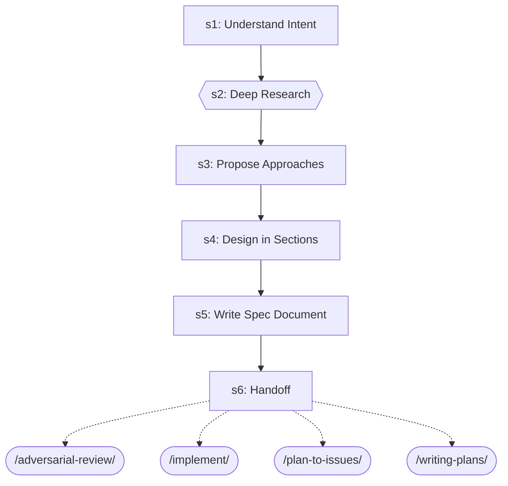

| Step | Title | Delegates To | Artifacts | Gates/Decisions |
|------|-------|-------------|-----------|----------------|
| 1 | Understand Intent | — | — | — |
| 2 | Deep Research | — | — | gate |
| 3 | Propose Approaches | — | — | — |
| 4 | Design in Sections | — | — | — |
| 5 | Write Spec Document | — | — | — |
| 6 | Handoff | `/adversarial-review`, `/implement`, `/plan-to-issues`, `/writing-plans` | — | — |

### ci-cd-setup

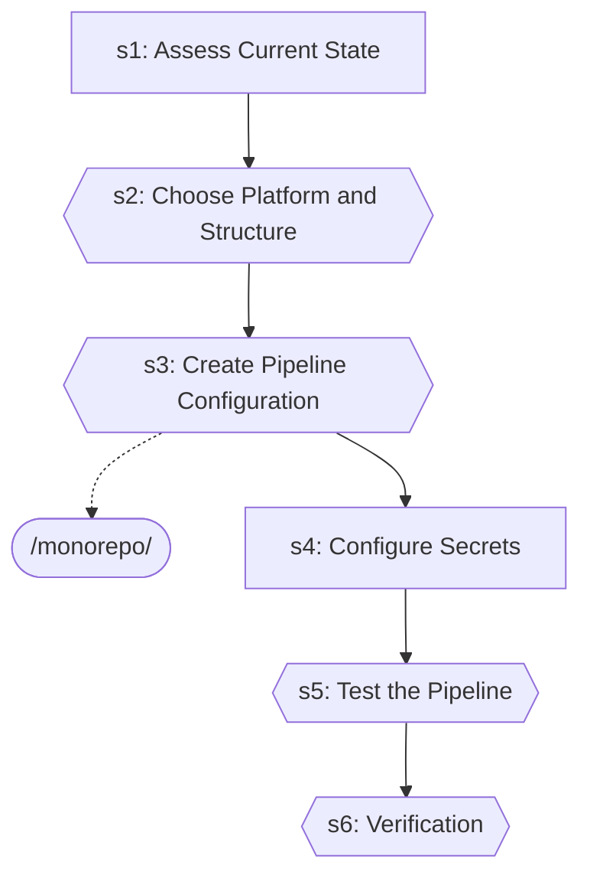

| Step | Title | Delegates To | Artifacts | Gates/Decisions |
|------|-------|-------------|-----------|----------------|
| 1 | Assess Current State | — | — | decision |
| 2 | Choose Platform and Structure | — | — | gate |
| 3 | Create Pipeline Configuration | `/monorepo` | — | gate |
| 4 | Configure Secrets | — | — | — |
| 5 | Test the Pipeline | — | — | gate |
| 6 | Verification | — | — | gate |

### code-quality-gate

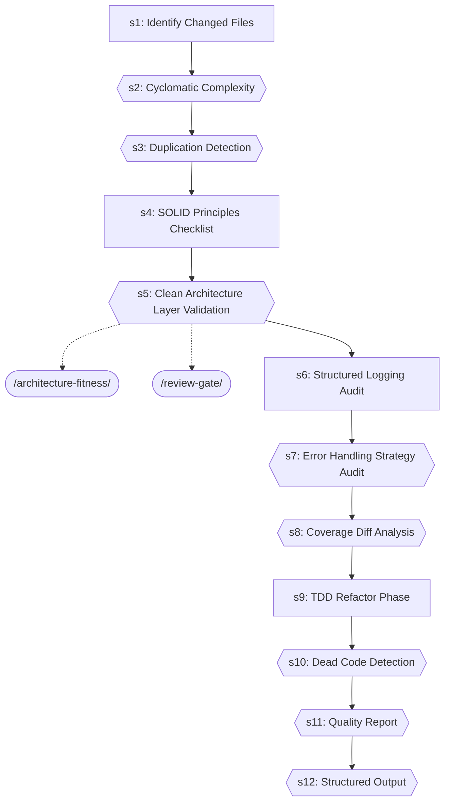

| Step | Title | Delegates To | Artifacts | Gates/Decisions |
|------|-------|-------------|-----------|----------------|
| 1 | Identify Changed Files | — | — | — |
| 2 | Cyclomatic Complexity | — | — | gate |
| 3 | Duplication Detection | — | — | gate |
| 4 | SOLID Principles Checklist | — | — | — |
| 5 | Clean Architecture Layer Validation | `/architecture-fitness`, `/review-gate` | — | gate |
| 6 | Structured Logging Audit | — | — | — |
| 7 | Error Handling Strategy Audit | — | — | gate |
| 8 | Coverage Diff Analysis | — | — | gate |
| 9 | TDD Refactor Phase | — | — | — |
| 10 | Dead Code Detection | — | — | gate |
| 11 | Quality Report | — | — | gate |
| 12 | Structured Output | — | → `test-results/code-quality-gate.json` | gate, decision |

### continue

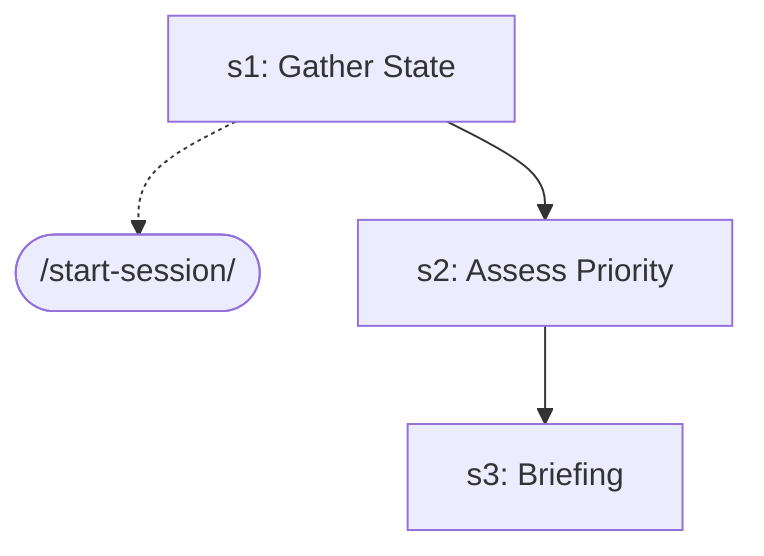

| Step | Title | Delegates To | Artifacts | Gates/Decisions |
|------|-------|-------------|-----------|----------------|
| 1 | Gather State | `/start-session` | — | decision |
| 2 | Assess Priority | — | — | — |
| 3 | Briefing | — | — | — |

### development-loop

```mermaid
graph TD
    s1["s1: INIT"]
    s2{{s2: IDEATE (skip if complexity=Simple or Medium)}}
    s1 --> s2
    brainstorm_ext([/brainstorm/])
    s2 -.-> brainstorm_ext
    s3["s3: PLAN (skip if complexity=Simple)"]
    s2 --> s3
    writing_plans_ext([/writing-plans/])
    s3 -.-> writing_plans_ext
    s4{{s4: EXECUTE}}
    s3 --> s4
    s5{{s5: VERIFY}}
    s4 --> s5
    auto_verify_ext([/auto-verify/])
    s5 -.-> auto_verify_ext
    test_pipeline_ext([/test-pipeline/])
    s5 -.-> test_pipeline_ext
    s6{{s6: COMMIT}}
    s5 --> s6
    post_fix_pipeline_ext([/post-fix-pipeline/])
    s6 -.-> post_fix_pipeline_ext
    s7{{s7: REPORT}}
    s6 --> s7
    development_loop_master_agent_ext((development-loop-master-agent))
    s7 -.-> development_loop_master_agent_ext
```

| Step | Title | Delegates To | Artifacts | Gates/Decisions |
|------|-------|-------------|-----------|----------------|
| 1 | INIT | — | — | — |
| 2 | IDEATE (skip if complexity=Simple or Medium) | `/brainstorm` | — | gate |
| 3 | PLAN (skip if complexity=Simple) | `/writing-plans` | — | — |
| 4 | EXECUTE | — | — | gate, decision |
| 5 | VERIFY | `/auto-verify`, `/test-pipeline` | → `test-results/auto-verify.json`, ← `test-results/auto-verify.json` | gate, decision |
| 6 | COMMIT | `/post-fix-pipeline` | — | gate, decision |
| 7 | REPORT | `development-loop-master-agent` | → `test-results/auto-verify.json`, → `test-results/development-loop-verdict.json` | gate, decision |

### disaster-recovery

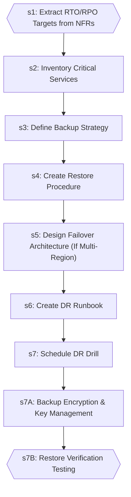

| Step | Title | Delegates To | Artifacts | Gates/Decisions |
|------|-------|-------------|-----------|----------------|
| 1 | Extract RTO/RPO Targets from NFRs | — | — | gate |
| 2 | Inventory Critical Services | — | — | — |
| 3 | Define Backup Strategy | — | — | — |
| 4 | Create Restore Procedure | — | — | — |
| 5 | Design Failover Architecture (If Multi-Region) | — | — | — |
| 6 | Create DR Runbook | — | — | — |
| 7 | Schedule DR Drill | — | — | — |
| 7A | Backup Encryption & Key Management | — | — | — |
| 7B | Restore Verification Testing | — | — | gate |

### executing-plans

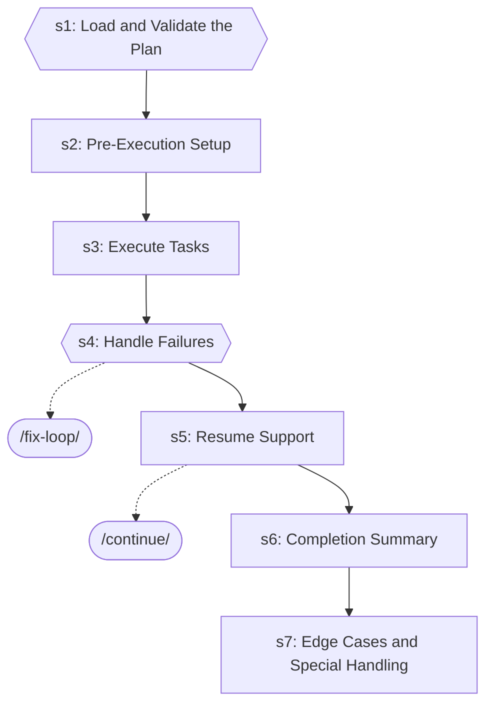

| Step | Title | Delegates To | Artifacts | Gates/Decisions |
|------|-------|-------------|-----------|----------------|
| 1 | Load and Validate the Plan | — | — | gate, decision |
| 2 | Pre-Execution Setup | — | — | — |
| 3 | Execute Tasks | — | — | — |
| 4 | Handle Failures | `/fix-loop` | — | gate, decision |
| 5 | Resume Support | `/continue` | — | decision |
| 6 | Completion Summary | — | — | — |
| 7 | Edge Cases and Special Handling | — | — | decision |

### expo-dev

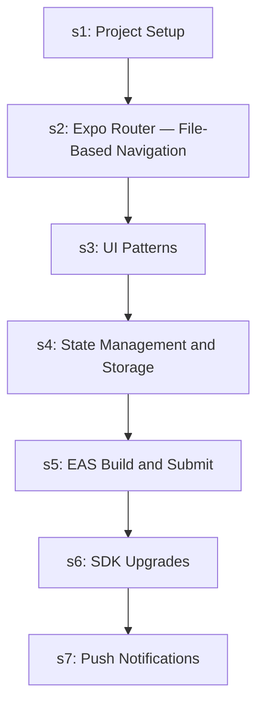

| Step | Title | Delegates To | Artifacts | Gates/Decisions |
|------|-------|-------------|-----------|----------------|
| 1 | Project Setup | — | — | — |
| 2 | Expo Router — File-Based Navigation | — | — | — |
| 3 | UI Patterns | — | — | — |
| 4 | State Management and Storage | — | — | — |
| 5 | EAS Build and Submit | — | — | — |
| 6 | SDK Upgrades | — | — | decision |
| 7 | Push Notifications | — | — | — |

### fix-issue

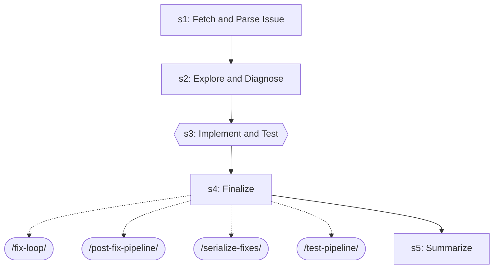

| Step | Title | Delegates To | Artifacts | Gates/Decisions |
|------|-------|-------------|-----------|----------------|
| 1 | Fetch and Parse Issue | — | — | — |
| 2 | Explore and Diagnose | — | — | — |
| 3 | Implement and Test | — | — | gate, decision |
| 4 | Finalize | `/fix-loop`, `/post-fix-pipeline`, `/serialize-fixes`, `/test-pipeline` | — | — |
| 5 | Summarize | — | — | decision |

### fix-loop

```mermaid
graph TD
    s1{{s1: Analyze Failure (via test-failure-analyzer-agent)}}
    test_failure_analyzer_agent_ext((test-failure-analyzer-agent))
    s1 -.-> test_failure_analyzer_agent_ext
    s1A["s1A: Flaky Test Detection"]
    s1 --> s1A
    s2["s2: Apply Fix"]
    s1A --> s2
    s3["s3: Retest (Full Loop mode only)"]
    s2 --> s3
    s4["s4: Report"]
    s3 --> s4
    s5{{s5: Structured Output}}
    s4 --> s5
```

| Step | Title | Delegates To | Artifacts | Gates/Decisions |
|------|-------|-------------|-----------|----------------|
| 1 | Analyze Failure (via test-failure-analyzer-agent) | `test-failure-analyzer-agent` | — | gate, decision |
| 1A | Flaky Test Detection | — | — | decision |
| 2 | Apply Fix | — | — | — |
| 3 | Retest (Full Loop mode only) | — | — | decision |
| 4 | Report | — | — | — |
| 5 | Structured Output | — | → `test-results/fix-loop.json` | gate, decision |

### flutter-dev

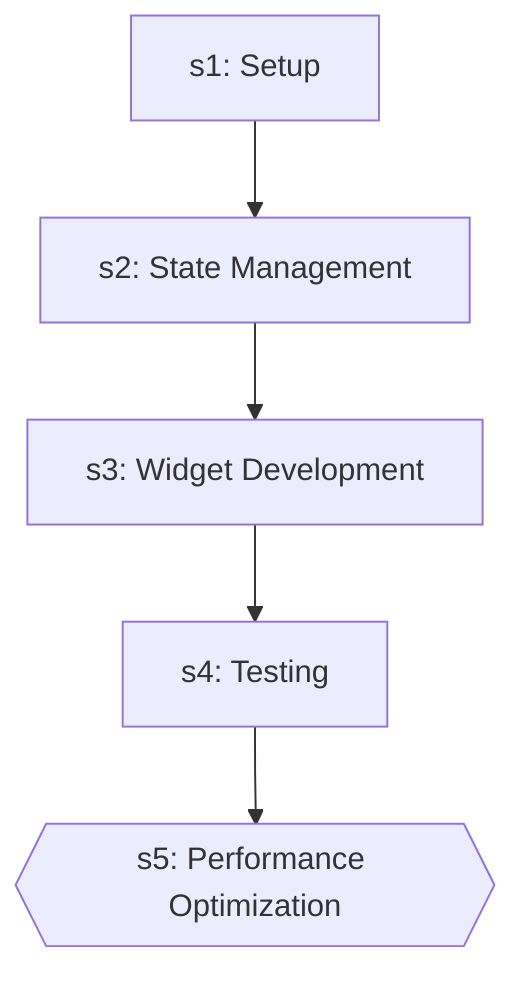

| Step | Title | Delegates To | Artifacts | Gates/Decisions |
|------|-------|-------------|-----------|----------------|
| 1 | Setup | — | — | — |
| 2 | State Management | — | — | — |
| 3 | Widget Development | — | — | — |
| 4 | Testing | — | — | — |
| 5 | Performance Optimization | — | — | gate, decision |

### git-worktrees

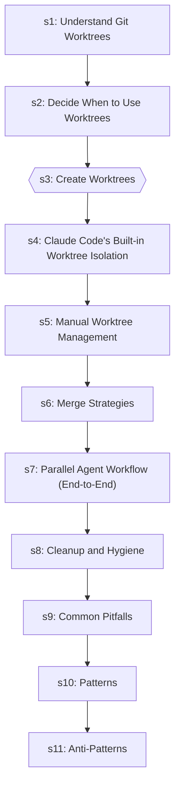

| Step | Title | Delegates To | Artifacts | Gates/Decisions |
|------|-------|-------------|-----------|----------------|
| 1 | Understand Git Worktrees | — | — | — |
| 2 | Decide When to Use Worktrees | — | — | — |
| 3 | Create Worktrees | — | — | gate |
| 4 | Claude Code's Built-in Worktree Isolation | — | — | — |
| 5 | Manual Worktree Management | — | — | — |
| 6 | Merge Strategies | — | — | — |
| 7 | Parallel Agent Workflow (End-to-End) | — | — | — |
| 8 | Cleanup and Hygiene | — | — | — |
| 9 | Common Pitfalls | — | — | — |
| 10 | Patterns | — | — | — |
| 11 | Anti-Patterns | — | — | — |

### implement

```mermaid
graph TD
    s1["s1: Analyze Requirements"]
    writing_plans_ext([/writing-plans/])
    s1 -.-> writing_plans_ext
    s2["s2: Create/Update Tests"]
    s1 --> s2
    s3["s3: Implement the Feature"]
    s2 --> s3
    s4["s4: Run Tests"]
    s3 --> s4
    s5{{s5: Fix Loop (if tests fail)}}
    s4 --> s5
    fix_loop_ext([/fix-loop/])
    s5 -.-> fix_loop_ext
    s6{{s6: Verification (Mandatory Gate)}}
    s5 --> s6
    post_fix_pipeline_ext([/post-fix-pipeline/])
    s6 -.-> post_fix_pipeline_ext
    s7["s7: Post-Implementation (Optional)"]
    s6 --> s7
    executing_plans_ext([/executing-plans/])
    s7 -.-> executing_plans_ext
    s8{{s8: Structured Output}}
    s7 --> s8
    fix_loop_ext([/fix-loop/])
    s8 -.-> fix_loop_ext
```

| Step | Title | Delegates To | Artifacts | Gates/Decisions |
|------|-------|-------------|-----------|----------------|
| 1 | Analyze Requirements | `/writing-plans` | — | — |
| 2 | Create/Update Tests | — | — | — |
| 3 | Implement the Feature | — | — | — |
| 4 | Run Tests | — | — | decision |
| 5 | Fix Loop (if tests fail) | `/fix-loop` | — | gate |
| 6 | Verification (Mandatory Gate) | `/post-fix-pipeline` | — | gate, decision |
| 7 | Post-Implementation (Optional) | `/executing-plans` | — | — |
| 8 | Structured Output | `/fix-loop` | → `test-results/implement.json` | gate, decision |

### learn-n-improve

```mermaid
graph TD
    s1{{s1: Gather Session Evidence}}
    s2["s2: Analyze Outcomes"]
    s1 --> s2
    s3{{s3: Build Error→Fix→Lesson Database}}
    s2 --> s3
    s4["s4: Update Memory Topics"]
    s3 --> s4
    s5{{s5: Pattern Detection (every 10th learning)}}
    s4 --> s5
    s6["s6: Report"]
    s5 --> s6
```

| Step | Title | Delegates To | Artifacts | Gates/Decisions |
|------|-------|-------------|-----------|----------------|
| 1 | Gather Session Evidence | — | → `test-results/*.json` | gate, decision |
| 2 | Analyze Outcomes | — | — | — |
| 3 | Build Error→Fix→Lesson Database | — | — | gate, decision |
| 4 | Update Memory Topics | — | — | — |
| 5 | Pattern Detection (every 10th learning) | — | — | gate |
| 6 | Report | — | — | — |

### mcp-server-builder

```mermaid
graph TD
    s1["s1: Define the Server Scope"]
    s2["s2: Choose SDK and Scaffold"]
    s1 --> s2
    s3["s3: Implement Tools"]
    s2 --> s3
    s4["s4: Implement Resources (if needed)"]
    s3 --> s4
    s5{{s5: Configure for Claude Code}}
    s4 --> s5
    s6["s6: Test the Server"]
    s5 --> s6
    s7["s7: Document and Ship"]
    s6 --> s7
```

| Step | Title | Delegates To | Artifacts | Gates/Decisions |
|------|-------|-------------|-----------|----------------|
| 1 | Define the Server Scope | — | — | — |
| 2 | Choose SDK and Scaffold | — | — | — |
| 3 | Implement Tools | — | — | — |
| 4 | Implement Resources (if needed) | — | — | — |
| 5 | Configure for Claude Code | — | — | gate |
| 6 | Test the Server | — | — | — |
| 7 | Document and Ship | — | — | — |

### nextjs-dev

```mermaid
graph TD
    s1["s1: Project Setup"]
    s2["s2: Routing & Layouts"]
    s1 --> s2
    s3["s3: Server vs Client Components"]
    s2 --> s3
    s4["s4: Data Fetching & Caching"]
    s3 --> s4
    s5["s5: Middleware & Security"]
    s4 --> s5
    s6["s6: SEO & Metadata"]
    s5 --> s6
    s7["s7: UI Patterns"]
    s6 --> s7
    s8["s8: Testing"]
    s7 --> s8
    playwright_ext([/playwright/])
    s8 -.-> playwright_ext
    vitest_dev_ext([/vitest-dev/])
    s8 -.-> vitest_dev_ext
```

| Step | Title | Delegates To | Artifacts | Gates/Decisions |
|------|-------|-------------|-----------|----------------|
| 1 | Project Setup | — | — | — |
| 2 | Routing & Layouts | — | — | — |
| 3 | Server vs Client Components | — | — | — |
| 4 | Data Fetching & Caching | — | — | — |
| 5 | Middleware & Security | — | — | — |
| 6 | SEO & Metadata | — | — | — |
| 7 | UI Patterns | — | — | — |
| 8 | Testing | `/playwright`, `/vitest-dev` | — | — |

### node-backend-dev

```mermaid
graph TD
    s1["s1: Project Setup"]
    s2["s2: Routing"]
    s1 --> s2
    s3["s3: Middleware"]
    s2 --> s3
    s4["s4: Validation"]
    s3 --> s4
    s5["s5: Database Access"]
    s4 --> s5
    s6["s6: Error Handling"]
    s5 --> s6
    s7["s7: Auth Patterns"]
    s6 --> s7
    s8["s8: Real-time (WebSocket)"]
    s7 --> s8
    s9["s9: Testing"]
    s8 --> s9
```

| Step | Title | Delegates To | Artifacts | Gates/Decisions |
|------|-------|-------------|-----------|----------------|
| 1 | Project Setup | — | — | — |
| 2 | Routing | — | — | — |
| 3 | Middleware | — | — | — |
| 4 | Validation | — | — | — |
| 5 | Database Access | — | — | — |
| 6 | Error Handling | — | — | — |
| 7 | Auth Patterns | — | — | — |
| 8 | Real-time (WebSocket) | — | — | — |
| 9 | Testing | — | — | — |

### nuxt-dev

```mermaid
graph TD
    s1["s1: Project Setup & Configuration"]
    s2["s2: Server Functionality"]
    s1 --> s2
    s3["s3: Routing, Middleware & Plugins"]
    s2 --> s3
    s4["s4: Nuxt Modules"]
    s3 --> s4
    s5["s5: NuxtHub (v0.10.6)"]
    s4 --> s5
    s6["s6: Nuxt Content v3"]
    s5 --> s6
    s7["s7: Nuxt UI v4"]
    s6 --> s7
    s8{{s8: Authentication (nuxt-better-auth)}}
    s7 --> s8
```

| Step | Title | Delegates To | Artifacts | Gates/Decisions |
|------|-------|-------------|-----------|----------------|
| 1 | Project Setup & Configuration | — | — | — |
| 2 | Server Functionality | — | — | — |
| 3 | Routing, Middleware & Plugins | — | — | — |
| 4 | Nuxt Modules | — | — | — |
| 5 | NuxtHub (v0.10.6) | — | — | — |
| 6 | Nuxt Content v3 | — | — | — |
| 7 | Nuxt UI v4 | — | — | — |
| 8 | Authentication (nuxt-better-auth) | — | — | gate |

### pipeline-orchestrator

```mermaid
graph TD
    s1{{s1: Dispatch Pipeline Orchestrator Agent}}
    s2{{s2: Report Results}}
    s1 --> s2
    project_manager_agent_ext((project-manager-agent))
    s2 -.-> project_manager_agent_ext
```

| Step | Title | Delegates To | Artifacts | Gates/Decisions |
|------|-------|-------------|-----------|----------------|
| 1 | Dispatch Pipeline Orchestrator Agent | — | — | gate |
| 2 | Report Results | `project-manager-agent` | — | gate, decision |

### plan-to-issues

```mermaid
graph TD
    s1["s1: Parse Plan"]
    s2["s2: Check for Duplicates"]
    s1 --> s2
    s3["s3: Organize into Epics (if applicable)"]
    s2 --> s3
    s4["s4: Create Task Issues"]
    s3 --> s4
    s5["s5: Report"]
    s4 --> s5
```

| Step | Title | Delegates To | Artifacts | Gates/Decisions |
|------|-------|-------------|-----------|----------------|
| 1 | Parse Plan | — | — | — |
| 2 | Check for Duplicates | — | — | — |
| 3 | Organize into Epics (if applicable) | — | — | — |
| 4 | Create Task Issues | — | — | — |
| 5 | Report | — | — | — |

### playwright

```mermaid
graph TD
    s1["s1: Project Setup & Configuration"]
    s2["s2: Browser Automation Fundamentals"]
    s1 --> s2
    s3["s3: E2E Test Generation from User Flows"]
    s2 --> s3
    s4["s4: Page Object Model (POM)"]
    s3 --> s4
    s5["s5: API + UI Combined Testing"]
    s4 --> s5
    s6["s6: Flaky Test Prevention"]
    s5 --> s6
    s7["s7: Visual Regression Testing"]
    s6 --> s7
    s8["s8: Debugging — MCP Execution Debugger"]
    s7 --> s8
    s9["s9: Cross-Browser Testing"]
    s8 --> s9
    s10{{s10: Network Interception}}
    s9 --> s10
    s11["s11: Test Artifacts & Reporting"]
    s10 --> s11
    s12["s12: Common Patterns"]
    s11 --> s12
    s13["s13: Advanced Browser Capabilities"]
    s12 --> s13
```

| Step | Title | Delegates To | Artifacts | Gates/Decisions |
|------|-------|-------------|-----------|----------------|
| 1 | Project Setup & Configuration | — | — | — |
| 2 | Browser Automation Fundamentals | — | — | — |
| 3 | E2E Test Generation from User Flows | — | — | — |
| 4 | Page Object Model (POM) | — | — | — |
| 5 | API + UI Combined Testing | — | — | — |
| 6 | Flaky Test Prevention | — | — | — |
| 7 | Visual Regression Testing | — | — | — |
| 8 | Debugging — MCP Execution Debugger | — | — | — |
| 9 | Cross-Browser Testing | — | — | — |
| 10 | Network Interception | — | — | gate |
| 11 | Test Artifacts & Reporting | — | — | — |
| 12 | Common Patterns | — | — | — |
| 13 | Advanced Browser Capabilities | — | — | — |

### post-fix-pipeline

```mermaid
graph TD
    s0{{s0: Gate Check — Read Upstream Results}}
    s0_block[/BLOCK/]
    s0 -->|FAILED| s0_block
    s1{{s1: Documentation Updates}}
    s0 -->|OK| s1
    docs_manager_agent_ext((docs-manager-agent))
    s1 -.-> docs_manager_agent_ext
    s2{{s2: Git Commit}}
    s1 --> s2
    git_manager_agent_ext((git-manager-agent))
    s2 -.-> git_manager_agent_ext
    s3["s3: Learning Capture"]
    s2 --> s3
    s4{{s4: Structured JSON Output}}
    s3 --> s4
    learn_n_improve_ext([/learn-n-improve/])
    s4 -.-> learn_n_improve_ext
```

| Step | Title | Delegates To | Artifacts | Gates/Decisions |
|------|-------|-------------|-----------|----------------|
| 0 | Gate Check — Read Upstream Results | — | → `test-evidence/*/visual-review.json`, → `test-results/auto-verify.json`, ← `test-evidence/*/visual-review.json`, ← `test-results/auto-verify.json` | gate, decision, BLOCK |
| 1 | Documentation Updates | `docs-manager-agent` | — | gate |
| 2 | Git Commit | `git-manager-agent` | — | gate, decision |
| 3 | Learning Capture | — | — | — |
| 4 | Structured JSON Output | `/learn-n-improve` | → `test-results/post-fix-pipeline.json` | gate, decision |

### prd-parser

```mermaid
graph TD
    s1{{s1: Detect Format}}
    s2{{s2: Parse Sections}}
    s1 --> s2
    s3["s3: Normalize to Standard PRD Format"]
    s2 --> s3
    s4["s4: IEEE 830 Validation"]
    s3 --> s4
    s5{{s5: Gap Report}}
    s4 --> s5
    s6["s6: Output Normalized PRD"]
    s5 --> s6
    adversarial_review_ext([/adversarial-review/])
    s6 -.-> adversarial_review_ext
    brainstorm_ext([/brainstorm/])
    s6 -.-> brainstorm_ext
    plan_to_issues_ext([/plan-to-issues/])
    s6 -.-> plan_to_issues_ext
    writing_plans_ext([/writing-plans/])
    s6 -.-> writing_plans_ext
```

| Step | Title | Delegates To | Artifacts | Gates/Decisions |
|------|-------|-------------|-----------|----------------|
| 1 | Detect Format | — | — | gate |
| 2 | Parse Sections | — | — | gate |
| 3 | Normalize to Standard PRD Format | — | — | decision |
| 4 | IEEE 830 Validation | — | — | — |
| 5 | Gap Report | — | — | gate |
| 6 | Output Normalized PRD | `/adversarial-review`, `/brainstorm`, `/plan-to-issues`, `/writing-plans` | — | — |

### project-scaffold

```mermaid
graph TD
    s1["s1: Determine Stack & Scope"]
    s2["s2: Generate Project Structure"]
    s1 --> s2
    s3["s3: Linter & Formatter Configuration"]
    s2 --> s3
    s4["s4: Git Hooks & Conventional Commits"]
    s3 --> s4
    s5["s5: CI Pipeline (GitHub Actions)"]
    s4 --> s5
    s6{{s6: Security Baseline}}
    s5 --> s6
    s7["s7: Docker & Dev Environment"]
    s6 --> s7
    s8["s8: Health Endpoint"]
    s7 --> s8
    s9["s9: 12-Factor Compliance Check"]
    s8 --> s9
    s10["s10: License & README"]
    s9 --> s10
    s11{{s11: Verify & Gate}}
    s10 --> s11
    s12{{s12: Suggest Next Steps}}
    s11 --> s12
    ci_cd_setup_ext([/ci-cd-setup/])
    s12 -.-> ci_cd_setup_ext
    security_audit_ext([/security-audit/])
    s12 -.-> security_audit_ext
    writing_plans_ext([/writing-plans/])
    s12 -.-> writing_plans_ext
```

| Step | Title | Delegates To | Artifacts | Gates/Decisions |
|------|-------|-------------|-----------|----------------|
| 1 | Determine Stack & Scope | — | — | — |
| 2 | Generate Project Structure | — | — | — |
| 3 | Linter & Formatter Configuration | — | — | — |
| 4 | Git Hooks & Conventional Commits | — | — | — |
| 5 | CI Pipeline (GitHub Actions) | — | — | — |
| 6 | Security Baseline | — | — | gate |
| 7 | Docker & Dev Environment | — | — | — |
| 8 | Health Endpoint | — | — | — |
| 9 | 12-Factor Compliance Check | — | — | — |
| 10 | License & README | — | — | — |
| 11 | Verify & Gate | — | — | gate |
| 12 | Suggest Next Steps | `/ci-cd-setup`, `/security-audit`, `/writing-plans` | — | gate |

### security-audit

```mermaid
graph TD
    s1["s1: Reconnaissance"]
    s2["s2: Static Analysis"]
    s1 --> s2
    s3["s3: Variant Analysis"]
    s2 --> s3
    s4["s4: Differential Security Review"]
    s3 --> s4
    s5["s5: Insecure Defaults Detection"]
    s4 --> s5
    s6{{s6: GitHub Actions Security}}
    s5 --> s6
    s7{{s7: False-Positive Gating}}
    s6 --> s7
    s8["s8: OWASP Top 10 Checklist"]
    s7 --> s8
    s9{{s9: Compliance Testing (GDPR / SOC2 / HIPAA)}}
    s8 --> s9
```

| Step | Title | Delegates To | Artifacts | Gates/Decisions |
|------|-------|-------------|-----------|----------------|
| 1 | Reconnaissance | — | — | — |
| 2 | Static Analysis | — | — | — |
| 3 | Variant Analysis | — | — | — |
| 4 | Differential Security Review | — | — | — |
| 5 | Insecure Defaults Detection | — | — | — |
| 6 | GitHub Actions Security | — | — | gate |
| 7 | False-Positive Gating | — | — | gate |
| 8 | OWASP Top 10 Checklist | — | — | — |
| 9 | Compliance Testing (GDPR / SOC2 / HIPAA) | — | — | gate |

### serialize-fixes

```mermaid
graph TD
    s0["s0: Resolve diff list"]
    s1["s1: Process each diff (three-phase atomic protocol)"]
    s0 --> s1
    s2{{s2: Return aggregated contract}}
    s1 --> s2
```

| Step | Title | Delegates To | Artifacts | Gates/Decisions |
|------|-------|-------------|-----------|----------------|
| 0 | Resolve diff list | — | — | decision |
| 1 | Process each diff (three-phase atomic protocol) | — | — | decision |
| 2 | Return aggregated contract | — | — | gate |

### ssot-audit

```mermaid
graph TD
    s1{{s1: Gather Configuration Inventory}}
    s2{{s2: Check CLAUDE.md Health}}
    s1 --> s2
    s3["s3: Detect Cross-Layer Duplication"]
    s2 --> s3
    fix_issue_ext([/fix-issue/])
    s3 -.-> fix_issue_ext
    s4["s4: Validate Rule Scoping"]
    s3 --> s4
    s5["s5: Check Skill Boundaries"]
    s4 --> s5
    s6{{s6: Generate Report}}
    s5 --> s6
```

| Step | Title | Delegates To | Artifacts | Gates/Decisions |
|------|-------|-------------|-----------|----------------|
| 1 | Gather Configuration Inventory | — | — | gate, decision |
| 2 | Check CLAUDE.md Health | — | — | gate |
| 3 | Detect Cross-Layer Duplication | `/fix-issue` | — | decision |
| 4 | Validate Rule Scoping | — | — | — |
| 5 | Check Skill Boundaries | — | — | — |
| 6 | Generate Report | — | — | gate |

### subagent-driven-dev

```mermaid
graph TD
    s1["s1: Decide Whether to Use Subagents"]
    s2["s2: Decompose the Task"]
    s1 --> s2
    s3{{s3: Write Subagent Prompts}}
    s2 --> s3
    s4["s4: Dispatch Strategy"]
    s3 --> s4
    s5{{s5: Monitor Progress and Aggregate Results}}
    s4 --> s5
    s6["s6: Handle Failures"]
    s5 --> s6
    s7["s7: Context Management for Subagents"]
    s6 --> s7
    executing_plans_ext([/executing-plans/])
    s7 -.-> executing_plans_ext
    s8["s8: File Conflict Avoidance & Advanced Patterns"]
    s7 --> s8
    s9{{s9: Completion Summary}}
    s8 --> s9
```

| Step | Title | Delegates To | Artifacts | Gates/Decisions |
|------|-------|-------------|-----------|----------------|
| 1 | Decide Whether to Use Subagents | — | — | — |
| 2 | Decompose the Task | — | — | — |
| 3 | Write Subagent Prompts | — | — | gate |
| 4 | Dispatch Strategy | — | — | — |
| 5 | Monitor Progress and Aggregate Results | — | — | gate |
| 6 | Handle Failures | — | — | — |
| 7 | Context Management for Subagents | `/executing-plans` | — | — |
| 8 | File Conflict Avoidance & Advanced Patterns | — | — | — |
| 9 | Completion Summary | — | — | gate |

### test-pipeline

```mermaid
graph TD
    s1{{s1: INIT}}
    fastapi_api_tester_agent_ext((fastapi-api-tester-agent))
    s1 -.-> fastapi_api_tester_agent_ext
    github_issue_manager_agent_ext((github-issue-manager-agent))
    s1 -.-> github_issue_manager_agent_ext
    test_failure_analyzer_agent_ext((test-failure-analyzer-agent))
    s1 -.-> test_failure_analyzer_agent_ext
    test_scout_agent_ext((test-scout-agent))
    s1 -.-> test_scout_agent_ext
    tester_agent_ext((tester-agent))
    s1 -.-> tester_agent_ext
    visual_inspector_agent_ext((visual-inspector-agent))
    s1 -.-> visual_inspector_agent_ext
    s1_block[/BLOCK/]
    s1 -->|FAILED| s1_block
    s2{{s2: SCOUT}}
    s1 -->|OK| s2
    fastapi_run_backend_tests_ext([/fastapi-run-backend-tests/])
    s2 -.-> fastapi_run_backend_tests_ext
    jest_dev_ext([/jest-dev/])
    s2 -.-> jest_dev_ext
    pytest_dev_ext([/pytest-dev/])
    s2 -.-> pytest_dev_ext
    vitest_dev_ext([/vitest-dev/])
    s2 -.-> vitest_dev_ext
    s2_block[/BLOCK/]
    s2 -->|FAILED| s2_block
    s3{{s3: WAVE 1 — Functional + API + UI (parallel runners)}}
    s2 -->|OK| s3
    contract_test_ext([/contract-test/])
    s3 -.-> contract_test_ext
    integration_test_ext([/integration-test/])
    s3 -.-> integration_test_ext
    tester_agent_ext((tester-agent))
    s3 -.-> tester_agent_ext
    s4{{s4: WAVE 2 — UI Visual Verification}}
    s3 --> s4
    visual_inspector_agent_ext((visual-inspector-agent))
    s4 -.-> visual_inspector_agent_ext
    s5{{s5: JOIN + Manifest Reconciliation + Per-Test Report}}
    s4 --> s5
    s6{{s6: TRIAGE (Inline at T0)}}
    s5 --> s6
    android_fixer_agent_ext((android-fixer-agent))
    s6 -.-> android_fixer_agent_ext
    fastapi_fixer_agent_ext((fastapi-fixer-agent))
    s6 -.-> fastapi_fixer_agent_ext
    react_fixer_agent_ext((react-fixer-agent))
    s6 -.-> react_fixer_agent_ext
    s7{{s7: VERIFY-AFFECTED}}
    s6 --> s7
    s7_block[/BLOCK/]
    s7 -->|FAILED| s7_block
    s8{{s8: FINAL FULL-SUITE PASS}}
    s7 -->|OK| s8
    s9{{s9: COMMIT + REPORT}}
    s8 --> s9
    post_fix_pipeline_ext([/post-fix-pipeline/])
    s9 -.-> post_fix_pipeline_ext
    update_practices_ext([/update-practices/])
    s9 -.-> update_practices_ext
    failure_triage_agent_ext((failure-triage-agent))
    s9 -.-> failure_triage_agent_ext
    test_pipeline_agent_ext((test-pipeline-agent))
    s9 -.-> test_pipeline_agent_ext
    testing_pipeline_master_agent_ext((testing-pipeline-master-agent))
    s9 -.-> testing_pipeline_master_agent_ext
```

| Step | Title | Delegates To | Artifacts | Gates/Decisions |
|------|-------|-------------|-----------|----------------|
| 1 | INIT | `fastapi-api-tester-agent`, `github-issue-manager-agent`, `test-failure-analyzer-agent`, `test-scout-agent`, `tester-agent`, `visual-inspector-agent` | → `test-results/pipeline-verdict.json` | gate, decision, BLOCK |
| 2 | SCOUT | `/fastapi-run-backend-tests`, `/jest-dev`, `/pytest-dev`, `/vitest-dev` | → `test-results/manifest.json` | gate, decision, BLOCK |
| 3 | WAVE 1 — Functional + API + UI (parallel runners) | `/contract-test`, `/integration-test`, `tester-agent` | → `test-results/api.json`, → `test-results/functional.json`, → `test-results/manifest.json`, → `test-results/ui.json`, → `test-results/{lane}.json`, ← `test-results/functional.json` | gate |
| 4 | WAVE 2 — UI Visual Verification | `visual-inspector-agent` | → `test-results/ui-verification.json`, → `test-results/ui.json`, ← `test-results/ui-verification.json`, ← `test-results/ui.json` | gate |
| 5 | JOIN + Manifest Reconciliation + Per-Test Report | — | → `test-results/manifest.json`, → `test-results/pipeline-verdict.json`, → `test-results/{lane}.json`, ← `test-results/manifest.json` | gate, decision |
| 6 | TRIAGE (Inline at T0) | `android-fixer-agent`, `fastapi-fixer-agent`, `react-fixer-agent` | — | gate |
| 7 | VERIFY-AFFECTED | — | — | gate, decision, BLOCK, STEP 8 |
| 8 | FINAL FULL-SUITE PASS | — | — | gate, decision |
| 9 | COMMIT + REPORT | `/post-fix-pipeline`, `/update-practices`, `failure-triage-agent`, `test-pipeline-agent`, `testing-pipeline-master-agent` | → `test-results/pipeline-verdict.json` | gate, decision |

### vue-dev

```mermaid
graph TD
    s1["s1: Setup"]
    s2["s2: Reactivity and Composition API"]
    s1 --> s2
    s3["s3: Component Patterns"]
    s2 --> s3
    s4["s4: Composables"]
    s3 --> s4
    s5{{s5: Vue Router}}
    s4 --> s5
    s6["s6: Reka UI Headless Components"]
    s5 --> s6
    s7["s7: Custom Directives"]
    s6 --> s7
    s8["s8: Testing"]
    s7 --> s8
```

| Step | Title | Delegates To | Artifacts | Gates/Decisions |
|------|-------|-------------|-----------|----------------|
| 1 | Setup | — | — | — |
| 2 | Reactivity and Composition API | — | — | — |
| 3 | Component Patterns | — | — | — |
| 4 | Composables | — | — | — |
| 5 | Vue Router | — | — | gate |
| 6 | Reka UI Headless Components | — | — | — |
| 7 | Custom Directives | — | — | — |
| 8 | Testing | — | — | — |

### writing-plans

```mermaid
graph TD
    s1["s1: Understand Scope"]
    brainstorm_ext([/brainstorm/])
    s1 -.-> brainstorm_ext
    s2{{s2: Decompose into Tasks}}
    s1 --> s2
    s3["s3: Add Dependency Graph"]
    s2 --> s3
    s4["s4: Review Plan Quality"]
    s3 --> s4
    s5["s5: Present for Approval"]
    s4 --> s5
    s6{{s6: Save Plan and Companion Files}}
    s5 --> s6
    s7["s7: Suggest Next Steps"]
    s6 --> s7
    executing_plans_ext([/executing-plans/])
    s7 -.-> executing_plans_ext
    plan_to_issues_ext([/plan-to-issues/])
    s7 -.-> plan_to_issues_ext
```

| Step | Title | Delegates To | Artifacts | Gates/Decisions |
|------|-------|-------------|-----------|----------------|
| 1 | Understand Scope | `/brainstorm` | — | decision |
| 2 | Decompose into Tasks | — | — | gate, decision |
| 3 | Add Dependency Graph | — | — | — |
| 4 | Review Plan Quality | — | — | — |
| 5 | Present for Approval | — | — | — |
| 6 | Save Plan and Companion Files | — | — | gate |
| 7 | Suggest Next Steps | `/executing-plans`, `/plan-to-issues` | — | — |


## Agents

| Agent | Description | Dispatched By |
|-------|-------------|---------------|
| `android-build-fixer-agent` | Use proactively to diagnose and fix Android Gradle build failures. Spawn auto... | `/workflow-master-template` |
| `anthropic-multi-agent-reviewer-agent` | Review multi-agent orchestration systems against Anthropic's 8 research-backe... | — |
| `code-reviewer-agent` | Use proactively to review recently changed files for code quality, type safet... | `/anthropic-agent-orchestration-guide`, `/security-auditor-agent`, `/workflow-master-template` |
| `development-loop-master-agent` | DEPRECATED 2026-04-24 (Phase 3.2 of subagent-dispatch-platform-limit remediat... | `/development-loop` |
| `fastapi-api-tester-agent` | Use this agent when you need to test FastAPI backend endpoints, validate API ... | `/test-pipeline`, `/workflow-master-template` |
| `github-issue-manager-agent` | Use proactively to create consolidated GitHub Issues for test failures from t... | `/test-pipeline`, `/workflow-master-template` |
| `plan-executor-agent` | Use this agent to parse structured plans into tracked steps, coordinate execu... | `/anthropic-agent-orchestration-guide`, `/development-loop`, `/development-loop-master-agent` |
| `planner-researcher-agent` | Senior technical lead specializing in software architecture, system design, a... | `/anthropic-agent-orchestration-guide`, `/development-loop`, `/development-loop-master-agent`, `/web-research-specialist-agent` |
| `security-auditor-agent` | Use proactively for security assessments — OWASP Top 10 scanning, threat mode... | `/anthropic-agent-orchestration-guide` |
| `session-summarizer-agent` | Use proactively to auto-generate session summary updates at session end. Spaw... | `/workflow-master-template` |
| `test-failure-analyzer-agent` | Use proactively to diagnose test failures — reads test output, classifies by ... | `/fix-loop`, `/test-pipeline`, `/workflow-master-template` |
| `tester-agent` | Senior QA engineer specializing in comprehensive testing and quality assuranc... | `/auto-verify`, `/test-pipeline`, `/workflow-master-template` |
| `web-research-specialist-agent` | Use this agent for web research — finding documentation, API references, libr... | — |
| `workflow-master-template` | Shared orchestration protocol reference for workflow orchestrators in core/.c... | — |

## Rules

| Rule | Description |
|------|-------------|
| `workflow` |  |

## Cross-Workflow Connections

**Outgoing** (this workflow feeds into):
- `architecture-fitness` (skill)
- `contract-test` (skill)
- `create-github-issue` (skill)
- `db-migrate-verify` (skill)
- `debugging-loop` (skill)
- `docs-manager-agent` (agent)
- `e2e-visual-run` (skill)
- `failure-triage-agent` (agent)
- `fastapi-run-backend-tests` (skill)
- `git-manager-agent` (agent)
- `handover` (skill)
- `integration-test` (skill)
- `monorepo` (skill)
- `perf-test` (skill)
- `pipeline-fix-pr` (skill)
- `pr-standards` (skill)
- `project-manager-agent` (agent)
- `regression-test` (skill)
- `review-gate` (skill)
- `skill-factory` (skill)
- `start-session` (skill)
- `systematic-debugging` (skill)
- `test-healer-agent` (agent)
- `test-pipeline-agent` (agent)
- `test-scout-agent` (agent)
- `testing-pipeline-master-agent` (agent)
- `update-practices` (skill)
- `verify-screenshots` (skill)
- `visual-inspector-agent` (agent)

**Incoming** (fed by):
- `android-run-e2e` (skill)
- `android-run-tests` (skill)
- `anthropic-multi-agent-research-system-skill` (skill)
- `bun-elysia-test` (skill)
- `claude-behavior` (rule)
- `code-review-master-agent` (agent)
- `code-review-workflow` (skill)
- `configuration-ssot` (rule)
- `create-github-issue` (skill)
- `debugging-loop` (skill)
- `debugging-loop-master-agent` (agent)
- `documentation-workflow` (skill)
- `e2e-best-practices` (skill)
- `e2e-visual-run` (skill)
- `escalation-report` (skill)
- `failure-triage-agent` (agent)
- `fastapi-run-backend-tests` (skill)
- `firebase-test` (skill)
- `flutter-e2e-test` (skill)
- `learning-self-improvement` (skill)
- `learning-self-improvement-master-agent` (agent)
- `pattern-self-containment` (rule)
- `pattern-structure` (rule)
- `pipeline-fix-pr` (skill)
- `pr-standards` (skill)
- `project-manager-agent` (agent)
- `regression-test` (skill)
- `review-gate` (skill)
- `save-session` (skill)
- `session-continuity` (skill)
- `session-continuity-master-agent` (agent)
- `skill-factory` (skill)
- `skill-master` (skill)
- `start-session` (skill)
- `systematic-debugging` (skill)
- `tdd` (skill)
- `tdd-rule` (rule)
- `test-data-management` (skill)
- `test-healer-agent` (agent)
- `test-knowledge` (skill)
- `test-pipeline-agent` (agent)
- `test-scout-agent` (agent)
- `testing` (rule)
- `testing-pipeline-master-agent` (agent)
- `testing-pipeline-workflow` (skill)
- `verify-screenshots` (skill)
- `visual-inspector-agent` (agent)
- `writing-skills` (skill)

<!-- MANUAL ANNOTATIONS -->
<!-- Add custom notes below this line. They are preserved on regeneration. -->
