# Development Loop

> The core build cycle: ideate, plan, implement, verify, commit.

> Auto-generated by `scripts/generate_workflow_docs.py` | Last updated: 2026-09-04 14:13 UTC

## Overview

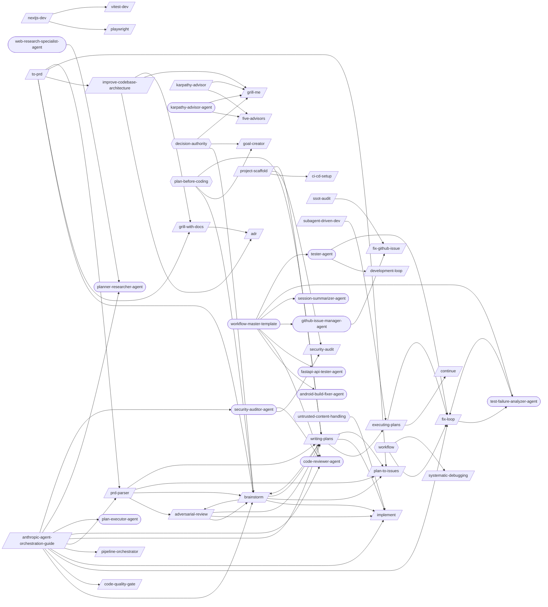
```mermaid
graph LR
    adr[/adr/]
    adversarial_review[/adversarial-review/]
    anthropic_agent_orchestration_guide[/anthropic-agent-orchestration-guide/]
    brainstorm[/brainstorm/]
    ci_cd_setup[/ci-cd-setup/]
    code_quality_gate[/code-quality-gate/]
    continue[/continue/]
    development_loop[/development-loop/]
    executing_plans[/executing-plans/]
    five_advisors[/five-advisors/]
    fix_github_issue[/fix-github-issue/]
    fix_loop[/fix-loop/]
    goal_creator[/goal-creator/]
    grill_me[/grill-me/]
    grill_with_docs[/grill-with-docs/]
    implement[/implement/]
    improve_codebase_architecture[/improve-codebase-architecture/]
    karpathy_advisor[/karpathy-advisor/]
    nextjs_dev[/nextjs-dev/]
    pipeline_orchestrator[/pipeline-orchestrator/]
    plan_to_issues[/plan-to-issues/]
    playwright[/playwright/]
    prd_parser[/prd-parser/]
    project_scaffold[/project-scaffold/]
    security_audit[/security-audit/]
    ssot_audit[/ssot-audit/]
    subagent_driven_dev[/subagent-driven-dev/]
    systematic_debugging[/systematic-debugging/]
    to_prd[/to-prd/]
    vitest_dev[/vitest-dev/]
    writing_plans[/writing-plans/]
    android_build_fixer_agent([android-build-fixer-agent])
    code_reviewer_agent([code-reviewer-agent])
    fastapi_api_tester_agent([fastapi-api-tester-agent])
    github_issue_manager_agent([github-issue-manager-agent])
    karpathy_advisor_agent([karpathy-advisor-agent])
    plan_executor_agent([plan-executor-agent])
    planner_researcher_agent([planner-researcher-agent])
    security_auditor_agent([security-auditor-agent])
    session_summarizer_agent([session-summarizer-agent])
    test_failure_analyzer_agent([test-failure-analyzer-agent])
    tester_agent([tester-agent])
    web_research_specialist_agent([web-research-specialist-agent])
    workflow_master_template([workflow-master-template])
    decision_authority{{decision-authority}}
    plan_before_coding{{plan-before-coding}}
    untrusted_content_handling{{untrusted-content-handling}}
    workflow{{workflow}}
    adversarial_review --> brainstorm
    adversarial_review --> implement
    adversarial_review --> writing_plans
    anthropic_agent_orchestration_guide --> brainstorm
    anthropic_agent_orchestration_guide --> code_quality_gate
    anthropic_agent_orchestration_guide --> fix_loop
    anthropic_agent_orchestration_guide --> implement
    anthropic_agent_orchestration_guide --> pipeline_orchestrator
    anthropic_agent_orchestration_guide --> prd_parser
    anthropic_agent_orchestration_guide --> writing_plans
    anthropic_agent_orchestration_guide --> code_reviewer_agent
    anthropic_agent_orchestration_guide --> plan_executor_agent
    anthropic_agent_orchestration_guide --> planner_researcher_agent
    anthropic_agent_orchestration_guide --> security_auditor_agent
    brainstorm --> adversarial_review
    brainstorm --> implement
    brainstorm --> plan_to_issues
    brainstorm --> writing_plans
    executing_plans --> continue
    executing_plans --> fix_loop
    fix_loop --> test_failure_analyzer_agent
    grill_with_docs --> adr
    improve_codebase_architecture --> adr
    improve_codebase_architecture --> grill_me
    improve_codebase_architecture --> grill_with_docs
    karpathy_advisor --> five_advisors
    karpathy_advisor --> grill_me
    nextjs_dev --> playwright
    nextjs_dev --> vitest_dev
    prd_parser --> adversarial_review
    prd_parser --> brainstorm
    prd_parser --> plan_to_issues
    prd_parser --> writing_plans
    project_scaffold --> ci_cd_setup
    project_scaffold --> security_audit
    project_scaffold --> writing_plans
    ssot_audit --> fix_github_issue
    subagent_driven_dev --> executing_plans
    to_prd --> brainstorm
    to_prd --> grill_with_docs
    to_prd --> improve_codebase_architecture
    to_prd --> plan_to_issues
    to_prd --> prd_parser
    writing_plans --> brainstorm
    writing_plans --> executing_plans
    writing_plans --> implement
    writing_plans --> plan_to_issues
    github_issue_manager_agent --> fix_github_issue
    karpathy_advisor_agent --> five_advisors
    karpathy_advisor_agent --> grill_me
    security_auditor_agent --> security_audit
    security_auditor_agent --> code_reviewer_agent
    test_failure_analyzer_agent --> fix_loop
    tester_agent --> development_loop
    tester_agent --> fix_loop
    web_research_specialist_agent --> planner_researcher_agent
    workflow_master_template --> android_build_fixer_agent
    workflow_master_template --> code_reviewer_agent
    workflow_master_template --> fastapi_api_tester_agent
    workflow_master_template --> github_issue_manager_agent
    workflow_master_template --> session_summarizer_agent
    workflow_master_template --> test_failure_analyzer_agent
    workflow_master_template --> tester_agent
    decision_authority --> brainstorm
    decision_authority --> goal_creator
    decision_authority --> grill_me
    plan_before_coding --> brainstorm
    plan_before_coding --> goal_creator
    plan_before_coding --> writing_plans
    untrusted_content_handling --> implement
    workflow --> fix_loop
    workflow --> systematic_debugging
```

## Skills

| Skill | Version | Description | Calls | Called By |
|-------|---------|-------------|-------|----------|
| `/a11y-audit` | 1.1.0 | Run automated WCAG 2.1 AA compliance checks using axe-core (via Playwright) a... | — | — |
| `/adr` | 2.0.0 | POINTER to the installable cbp-workflows plugin — this capability graduated f... | — | `/grill-with-docs`, `/improve-codebase-architecture` |
| `/adversarial-review` | 1.1.0 | Launch a structured adversarial review using a subagent with a dedicated revi... | `/brainstorm`, `/implement`, `/writing-plans` | `/brainstorm`, `/prd-parser` |
| `/anthropic-agent-orchestration-guide` | 1.1.0 | Design multi-agent orchestration systems using Anthropic's 5 workflow pattern... | `/brainstorm`, `/code-quality-gate`, `/fix-loop`, `/implement`, `/pipeline-orchestrator`, `/prd-parser`, `/writing-plans`, `/code-reviewer-agent`, `/plan-executor-agent`, `/planner-researcher-agent`, `/security-auditor-agent` | — |
| `/brainstorm` | 1.0.0 | Explore intent through Socratic questioning, propose approaches with trade-of... | `/adversarial-review`, `/implement`, `/plan-to-issues`, `/writing-plans` | `/adversarial-review`, `/anthropic-agent-orchestration-guide`, `/prd-parser`, `/to-prd`, `/writing-plans` |
| `/ci-cd-setup` | 1.2.0 | Set up CI/CD pipelines for GitHub Actions or GitLab CI. Covers workflow synta... | — | `/project-scaffold` |
| `/code-quality-gate` | 1.3.0 | Enforce code quality standards including cyclomatic complexity, duplication d... | — | `/anthropic-agent-orchestration-guide` |
| `/continue` | 1.1.0 | Resume work from a previous session. Reads continuation state, workflow progr... | — | `/executing-plans` |
| `/development-loop` | 3.0.0 | POINTER to the installable cbp-build-test-workflows plugin — this capability ... | — | `/tester-agent` |
| `/disaster-recovery` | 1.1.0 | Create disaster recovery plans with RTO/RPO targets derived from NFRs. Covers... | — | — |
| `/executing-plans` | 1.1.0 | Execute a pre-written implementation plan step by step. Parses tasks from a p... | `/continue`, `/fix-loop` | `/subagent-driven-dev`, `/writing-plans` |
| `/expo-dev` | 1.1.0 | Build and deploy React Native apps with Expo including project setup, Expo Ro... | — | — |
| `/firebase-dev` | 1.1.0 | Build Firebase-backed apps with project setup, CLI, Authentication (providers... | — | — |
| `/five-advisors` | 1.1.0 | Run any question, idea, or decision through Five Advisors who independently a... | — | `/karpathy-advisor`, `/karpathy-advisor-agent` |
| `/fix-github-issue` | 4.0.0 | POINTER to the installable cbp-workflows plugin — this capability graduated f... | — | `/ssot-audit`, `/github-issue-manager-agent` |
| `/fix-loop` | 2.0.0 | POINTER to the installable cbp-workflows plugin — this capability graduated f... | `/test-failure-analyzer-agent` | `/anthropic-agent-orchestration-guide`, `/executing-plans`, `/test-failure-analyzer-agent`, `/tester-agent` |
| `/flutter-dev` | 1.1.0 | Build cross-platform Flutter 3+ apps with widget architecture, Riverpod/BLoC ... | — | — |
| `/git-worktrees` | 2.0.0 | POINTER to the installable loop-engineering plugin — this capability graduate... | — | — |
| `/goal-creator` | 3.0.0 | POINTER to the installable loop-engineering plugin — this capability graduate... | — | — |
| `/grill-me` | 1.2.0 | Audit a plan or design by interviewing the user relentlessly until shared und... | — | `/improve-codebase-architecture`, `/karpathy-advisor`, `/karpathy-advisor-agent` |
| `/grill-with-docs` | 1.2.0 | Run a grilling session that challenges a plan against the project's existing ... | `/adr` | `/improve-codebase-architecture`, `/to-prd` |
| `/implement` | 3.0.0 | POINTER to the installable cbp-build-test-workflows plugin — this capability ... | — | `/adversarial-review`, `/anthropic-agent-orchestration-guide`, `/brainstorm`, `/writing-plans` |
| `/improve-codebase-architecture` | 1.1.0 | Analyze architectural friction and propose deepening opportunities — refactor... | `/adr`, `/grill-me`, `/grill-with-docs` | `/to-prd` |
| `/jest-dev` | 1.0.0 | Configure and run Jest tests with mocking (jest.mock/jest.fn/jest.spyOn/manua... | — | — |
| `/karpathy-advisor` | 1.1.0 | Apply Andrej Karpathy's documented lens to a decision, design, or situation —... | `/five-advisors`, `/grill-me` | — |
| `/mcp-server-builder` | 1.1.0 | Build MCP (Model Context Protocol) servers that extend Claude Code's capabili... | — | — |
| `/nextjs-dev` | 1.0.0 | Build Next.js 14/15 App Router applications with Server/Client Components, ro... | `/playwright`, `/vitest-dev` | — |
| `/node-backend-dev` | 1.1.0 | Build Node.js backend services with project setup, routing, middleware, valid... | — | — |
| `/nuxt-dev` | 1.1.0 | Build Nuxt 4.3+ full-stack applications with project setup, server routes, SS... | — | — |
| `/pipeline-orchestrator` | 2.2.0 | Orchestrate multi-stage pipelines for PRD-to-Production delivery using a DAG-... | — | `/anthropic-agent-orchestration-guide` |
| `/plan-to-issues` | 1.3.0 | Parse a markdown plan into GitHub Issues with labels and duplicate detection.... | — | `/brainstorm`, `/prd-parser`, `/to-prd`, `/writing-plans` |
| `/playwright` | 1.3.0 | Write, run, and debug Playwright E2E tests for web applications including bro... | — | `/nextjs-dev` |
| `/prd-parser` | 1.1.0 | Parse and normalize existing PRDs from markdown, Notion export, Jira export, ... | `/adversarial-review`, `/brainstorm`, `/plan-to-issues`, `/writing-plans` | `/anthropic-agent-orchestration-guide`, `/to-prd` |
| `/project-scaffold` | 1.1.0 | Scaffold a fully configured project skeleton with build, lint, test, CI, Dock... | `/ci-cd-setup`, `/security-audit`, `/writing-plans` | — |
| `/provenance-report` | 1.1.0 | Generate an owner-facing "Behind the Scenes" build-provenance HTML report for... | — | — |
| `/pytest-dev` | 1.0.1 | Apply pytest patterns for configuration, fixtures, parametrize, markers, asyn... | — | — |
| `/security-audit` | 1.1.0 | Run security audits covering static analysis with CodeQL and Semgrep, SARIF t... | — | `/project-scaffold`, `/security-auditor-agent` |
| `/ssot-audit` | 1.3.0 | Audit project's Claude Code configuration for Single Source of Truth violatio... | `/fix-github-issue` | — |
| `/subagent-driven-dev` | 1.2.0 | Orchestrate task execution across multiple subagents for parallel development... | `/executing-plans` | — |
| `/systematic-debugging` | 2.0.0 | POINTER to the installable cbp-build-test-workflows plugin — this capability ... | — | — |
| `/to-prd` | 1.1.0 | Generate a PRD by synthesizing the current conversation context and codebase ... | `/brainstorm`, `/grill-with-docs`, `/improve-codebase-architecture`, `/plan-to-issues`, `/prd-parser` | — |
| `/vitest-dev` | 1.0.1 | Apply Vitest patterns for configuration, mocking (vi.mock/vi.fn/vi.spyOn), sn... | — | `/nextjs-dev` |
| `/vue-dev` | 1.1.0 | Build Vue 3.5+ applications using Composition API patterns, TypeScript integr... | — | — |
| `/writing-plans` | 1.2.0 | Generate detailed implementation plans with bite-sized tasks, exact file path... | `/brainstorm`, `/executing-plans`, `/implement`, `/plan-to-issues` | `/adversarial-review`, `/anthropic-agent-orchestration-guide`, `/brainstorm`, `/prd-parser`, `/project-scaffold` |

## Workflow Steps

### Entry Points

Double-bordered nodes are user-facing entry points (no incoming references). Rounded nodes are agents.

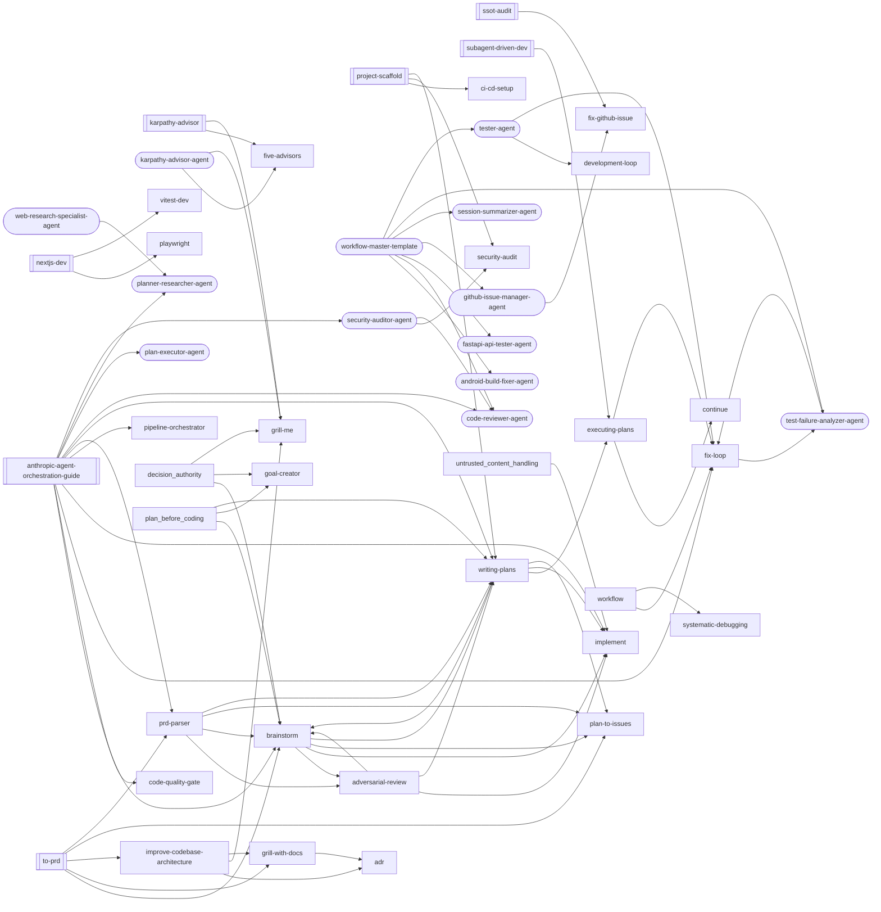
```mermaid
graph LR
    anthropic_agent_orchestration_guide[["anthropic-agent-orchestration-guide"]]
    karpathy_advisor[["karpathy-advisor"]]
    karpathy_advisor_agent(["karpathy-advisor-agent"])
    nextjs_dev[["nextjs-dev"]]
    project_scaffold[["project-scaffold"]]
    ssot_audit[["ssot-audit"]]
    subagent_driven_dev[["subagent-driven-dev"]]
    to_prd[["to-prd"]]
    web_research_specialist_agent(["web-research-specialist-agent"])
    workflow_master_template(["workflow-master-template"])
    adr["adr"]
    adversarial_review["adversarial-review"]
    android_build_fixer_agent(["android-build-fixer-agent"])
    brainstorm["brainstorm"]
    ci_cd_setup["ci-cd-setup"]
    code_quality_gate["code-quality-gate"]
    code_reviewer_agent(["code-reviewer-agent"])
    continue["continue"]
    development_loop["development-loop"]
    executing_plans["executing-plans"]
    fastapi_api_tester_agent(["fastapi-api-tester-agent"])
    five_advisors["five-advisors"]
    fix_github_issue["fix-github-issue"]
    fix_loop["fix-loop"]
    github_issue_manager_agent(["github-issue-manager-agent"])
    goal_creator["goal-creator"]
    grill_me["grill-me"]
    grill_with_docs["grill-with-docs"]
    implement["implement"]
    improve_codebase_architecture["improve-codebase-architecture"]
    pipeline_orchestrator["pipeline-orchestrator"]
    plan_executor_agent(["plan-executor-agent"])
    plan_to_issues["plan-to-issues"]
    planner_researcher_agent(["planner-researcher-agent"])
    playwright["playwright"]
    prd_parser["prd-parser"]
    security_audit["security-audit"]
    security_auditor_agent(["security-auditor-agent"])
    session_summarizer_agent(["session-summarizer-agent"])
    systematic_debugging["systematic-debugging"]
    test_failure_analyzer_agent(["test-failure-analyzer-agent"])
    tester_agent(["tester-agent"])
    vitest_dev["vitest-dev"]
    writing_plans["writing-plans"]
    adversarial_review --> brainstorm
    adversarial_review --> implement
    adversarial_review --> writing_plans
    anthropic_agent_orchestration_guide --> brainstorm
    anthropic_agent_orchestration_guide --> code_quality_gate
    anthropic_agent_orchestration_guide --> fix_loop
    anthropic_agent_orchestration_guide --> implement
    anthropic_agent_orchestration_guide --> pipeline_orchestrator
    anthropic_agent_orchestration_guide --> prd_parser
    anthropic_agent_orchestration_guide --> writing_plans
    anthropic_agent_orchestration_guide --> code_reviewer_agent
    anthropic_agent_orchestration_guide --> plan_executor_agent
    anthropic_agent_orchestration_guide --> planner_researcher_agent
    anthropic_agent_orchestration_guide --> security_auditor_agent
    brainstorm --> adversarial_review
    brainstorm --> implement
    brainstorm --> plan_to_issues
    brainstorm --> writing_plans
    executing_plans --> continue
    executing_plans --> fix_loop
    fix_loop --> test_failure_analyzer_agent
    grill_with_docs --> adr
    improve_codebase_architecture --> adr
    improve_codebase_architecture --> grill_me
    improve_codebase_architecture --> grill_with_docs
    karpathy_advisor --> five_advisors
    karpathy_advisor --> grill_me
    nextjs_dev --> playwright
    nextjs_dev --> vitest_dev
    prd_parser --> adversarial_review
    prd_parser --> brainstorm
    prd_parser --> plan_to_issues
    prd_parser --> writing_plans
    project_scaffold --> ci_cd_setup
    project_scaffold --> security_audit
    project_scaffold --> writing_plans
    ssot_audit --> fix_github_issue
    subagent_driven_dev --> executing_plans
    to_prd --> brainstorm
    to_prd --> grill_with_docs
    to_prd --> improve_codebase_architecture
    to_prd --> plan_to_issues
    to_prd --> prd_parser
    writing_plans --> brainstorm
    writing_plans --> executing_plans
    writing_plans --> implement
    writing_plans --> plan_to_issues
    github_issue_manager_agent --> fix_github_issue
    karpathy_advisor_agent --> five_advisors
    karpathy_advisor_agent --> grill_me
    security_auditor_agent --> security_audit
    security_auditor_agent --> code_reviewer_agent
    test_failure_analyzer_agent --> fix_loop
    tester_agent --> development_loop
    tester_agent --> fix_loop
    web_research_specialist_agent --> planner_researcher_agent
    workflow_master_template --> android_build_fixer_agent
    workflow_master_template --> code_reviewer_agent
    workflow_master_template --> fastapi_api_tester_agent
    workflow_master_template --> github_issue_manager_agent
    workflow_master_template --> session_summarizer_agent
    workflow_master_template --> test_failure_analyzer_agent
    workflow_master_template --> tester_agent
    decision_authority --> brainstorm
    decision_authority --> goal_creator
    decision_authority --> grill_me
    plan_before_coding --> brainstorm
    plan_before_coding --> goal_creator
    plan_before_coding --> writing_plans
    untrusted_content_handling --> implement
    workflow --> fix_loop
    workflow --> systematic_debugging
```

### a11y-audit

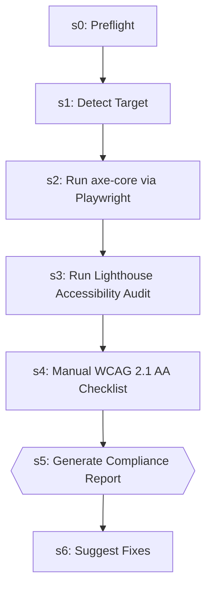
```mermaid
graph TD
    s0["s0: Preflight"]
    s1["s1: Detect Target"]
    s0 --> s1
    s2["s2: Run axe-core via Playwright"]
    s1 --> s2
    s3["s3: Run Lighthouse Accessibility Audit"]
    s2 --> s3
    s4["s4: Manual WCAG 2.1 AA Checklist"]
    s3 --> s4
    s5{{s5: Generate Compliance Report}}
    s4 --> s5
    s6["s6: Suggest Fixes"]
    s5 --> s6
```

| Step | Title | Delegates To | Artifacts | Gates/Decisions |
|------|-------|-------------|-----------|----------------|
| 0 | Preflight | — | — | — |
| 1 | Detect Target | — | — | — |
| 2 | Run axe-core via Playwright | — | — | — |
| 3 | Run Lighthouse Accessibility Audit | — | — | — |
| 4 | Manual WCAG 2.1 AA Checklist | — | — | — |
| 5 | Generate Compliance Report | — | — | gate |
| 6 | Suggest Fixes | — | — | decision |

### adversarial-review

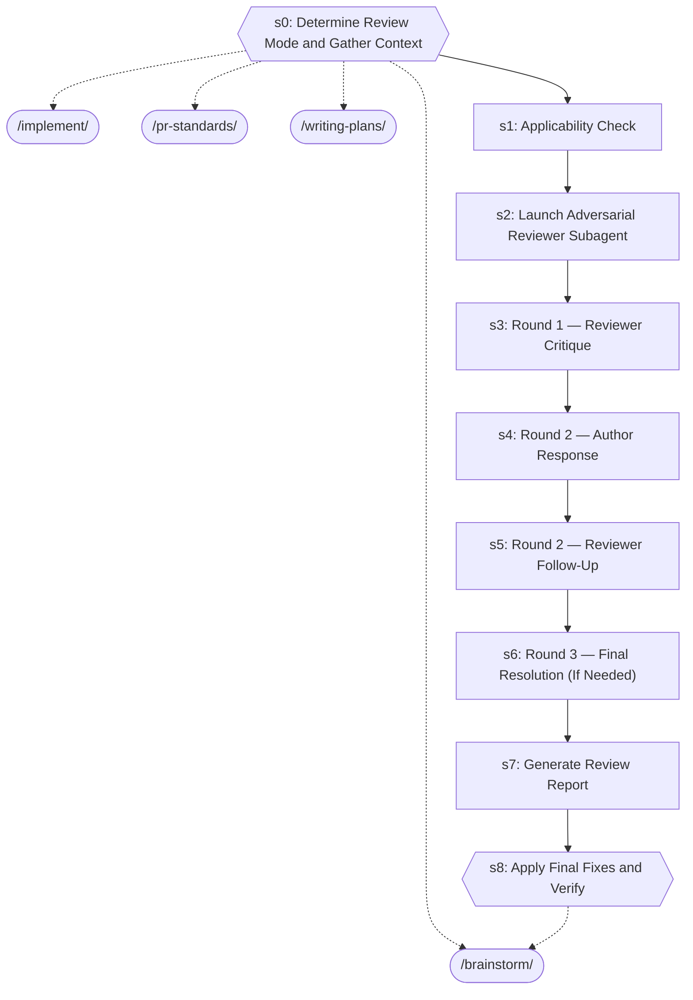
```mermaid
graph TD
    s0{{s0: Determine Review Mode and Gather Context}}
    brainstorm_ext([/brainstorm/])
    s0 -.-> brainstorm_ext
    implement_ext([/implement/])
    s0 -.-> implement_ext
    pr_standards_ext([/pr-standards/])
    s0 -.-> pr_standards_ext
    writing_plans_ext([/writing-plans/])
    s0 -.-> writing_plans_ext
    s1["s1: Applicability Check"]
    s0 --> s1
    s2["s2: Launch Adversarial Reviewer Subagent"]
    s1 --> s2
    s3["s3: Round 1 — Reviewer Critique"]
    s2 --> s3
    s4["s4: Round 2 — Author Response"]
    s3 --> s4
    s5["s5: Round 2 — Reviewer Follow-Up"]
    s4 --> s5
    s6["s6: Round 3 — Final Resolution (If Needed)"]
    s5 --> s6
    s7["s7: Generate Review Report"]
    s6 --> s7
    s8{{s8: Apply Final Fixes and Verify}}
    s7 --> s8
    brainstorm_ext([/brainstorm/])
    s8 -.-> brainstorm_ext
```

| Step | Title | Delegates To | Artifacts | Gates/Decisions |
|------|-------|-------------|-----------|----------------|
| 0 | Determine Review Mode and Gather Context | `/brainstorm`, `/implement`, `/pr-standards`, `/writing-plans` | — | gate, decision |
| 1 | Applicability Check | — | — | — |
| 2 | Launch Adversarial Reviewer Subagent | — | — | — |
| 3 | Round 1 — Reviewer Critique | — | — | — |
| 4 | Round 2 — Author Response | — | — | — |
| 5 | Round 2 — Reviewer Follow-Up | — | — | — |
| 6 | Round 3 — Final Resolution (If Needed) | — | — | — |
| 7 | Generate Review Report | — | — | — |
| 8 | Apply Final Fixes and Verify | `/brainstorm` | — | gate, decision |

### anthropic-agent-orchestration-guide

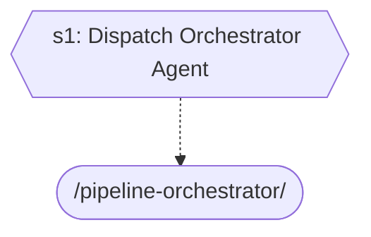
```mermaid
graph TD
    s1{{s1: Dispatch Orchestrator Agent}}
    pipeline_orchestrator_ext([/pipeline-orchestrator/])
    s1 -.-> pipeline_orchestrator_ext
```

| Step | Title | Delegates To | Artifacts | Gates/Decisions |
|------|-------|-------------|-----------|----------------|
| 1 | Dispatch Orchestrator Agent | `/pipeline-orchestrator` | — | gate, decision |

### brainstorm

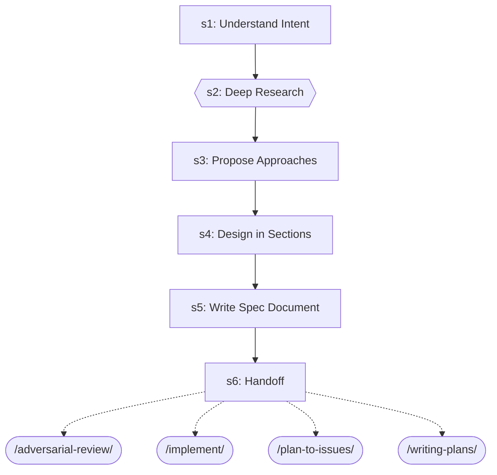
```mermaid
graph TD
    s1["s1: Understand Intent"]
    s2{{s2: Deep Research}}
    s1 --> s2
    s3["s3: Propose Approaches"]
    s2 --> s3
    s4["s4: Design in Sections"]
    s3 --> s4
    s5["s5: Write Spec Document"]
    s4 --> s5
    s6["s6: Handoff"]
    s5 --> s6
    adversarial_review_ext([/adversarial-review/])
    s6 -.-> adversarial_review_ext
    implement_ext([/implement/])
    s6 -.-> implement_ext
    plan_to_issues_ext([/plan-to-issues/])
    s6 -.-> plan_to_issues_ext
    writing_plans_ext([/writing-plans/])
    s6 -.-> writing_plans_ext
```

| Step | Title | Delegates To | Artifacts | Gates/Decisions |
|------|-------|-------------|-----------|----------------|
| 1 | Understand Intent | — | — | — |
| 2 | Deep Research | — | — | gate |
| 3 | Propose Approaches | — | — | — |
| 4 | Design in Sections | — | — | — |
| 5 | Write Spec Document | — | — | — |
| 6 | Handoff | `/adversarial-review`, `/implement`, `/plan-to-issues`, `/writing-plans` | — | — |

### ci-cd-setup

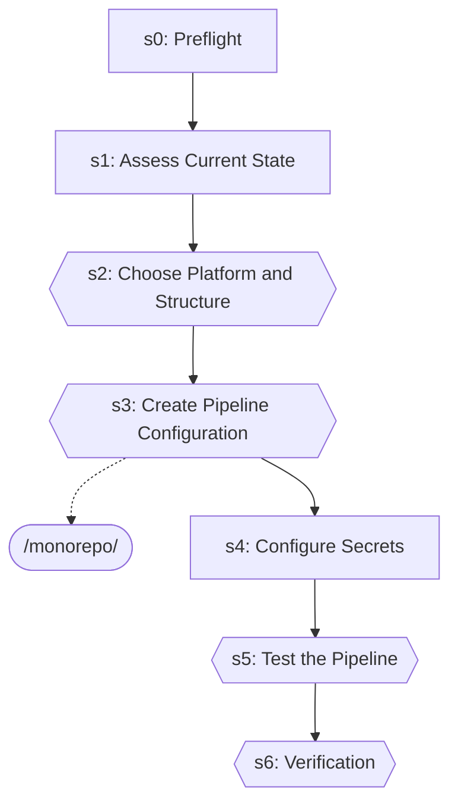
```mermaid
graph TD
    s0["s0: Preflight"]
    s1["s1: Assess Current State"]
    s0 --> s1
    s2{{s2: Choose Platform and Structure}}
    s1 --> s2
    s3{{s3: Create Pipeline Configuration}}
    s2 --> s3
    monorepo_ext([/monorepo/])
    s3 -.-> monorepo_ext
    s4["s4: Configure Secrets"]
    s3 --> s4
    s5{{s5: Test the Pipeline}}
    s4 --> s5
    s6{{s6: Verification}}
    s5 --> s6
```

| Step | Title | Delegates To | Artifacts | Gates/Decisions |
|------|-------|-------------|-----------|----------------|
| 0 | Preflight | — | — | decision |
| 1 | Assess Current State | — | — | decision |
| 2 | Choose Platform and Structure | — | — | gate |
| 3 | Create Pipeline Configuration | `/monorepo` | — | gate |
| 4 | Configure Secrets | — | — | — |
| 5 | Test the Pipeline | — | — | gate |
| 6 | Verification | — | — | gate |

### code-quality-gate

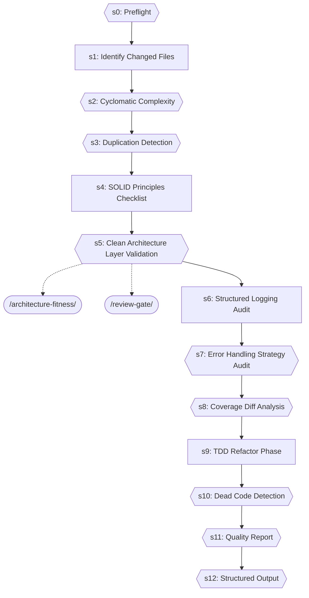
```mermaid
graph TD
    s0{{s0: Preflight}}
    s1["s1: Identify Changed Files"]
    s0 --> s1
    s2{{s2: Cyclomatic Complexity}}
    s1 --> s2
    s3{{s3: Duplication Detection}}
    s2 --> s3
    s4["s4: SOLID Principles Checklist"]
    s3 --> s4
    s5{{s5: Clean Architecture Layer Validation}}
    s4 --> s5
    architecture_fitness_ext([/architecture-fitness/])
    s5 -.-> architecture_fitness_ext
    review_gate_ext([/review-gate/])
    s5 -.-> review_gate_ext
    s6["s6: Structured Logging Audit"]
    s5 --> s6
    s7{{s7: Error Handling Strategy Audit}}
    s6 --> s7
    s8{{s8: Coverage Diff Analysis}}
    s7 --> s8
    s9["s9: TDD Refactor Phase"]
    s8 --> s9
    s10{{s10: Dead Code Detection}}
    s9 --> s10
    s11{{s11: Quality Report}}
    s10 --> s11
    s12{{s12: Structured Output}}
    s11 --> s12
```

| Step | Title | Delegates To | Artifacts | Gates/Decisions |
|------|-------|-------------|-----------|----------------|
| 0 | Preflight | — | — | gate |
| 1 | Identify Changed Files | — | — | — |
| 2 | Cyclomatic Complexity | — | — | gate |
| 3 | Duplication Detection | — | — | gate |
| 4 | SOLID Principles Checklist | — | — | — |
| 5 | Clean Architecture Layer Validation | `/architecture-fitness`, `/review-gate` | — | gate |
| 6 | Structured Logging Audit | — | — | — |
| 7 | Error Handling Strategy Audit | — | — | gate |
| 8 | Coverage Diff Analysis | — | — | gate |
| 9 | TDD Refactor Phase | — | — | — |
| 10 | Dead Code Detection | — | — | gate |
| 11 | Quality Report | — | — | gate |
| 12 | Structured Output | — | → `test-results/code-quality-gate.json` | gate, decision |

### continue

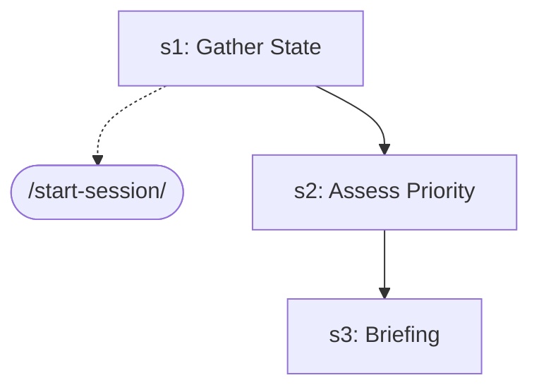
```mermaid
graph TD
    s1["s1: Gather State"]
    start_session_ext([/start-session/])
    s1 -.-> start_session_ext
    s2["s2: Assess Priority"]
    s1 --> s2
    s3["s3: Briefing"]
    s2 --> s3
```

| Step | Title | Delegates To | Artifacts | Gates/Decisions |
|------|-------|-------------|-----------|----------------|
| 1 | Gather State | `/start-session` | — | decision |
| 2 | Assess Priority | — | — | — |
| 3 | Briefing | — | — | — |

### disaster-recovery

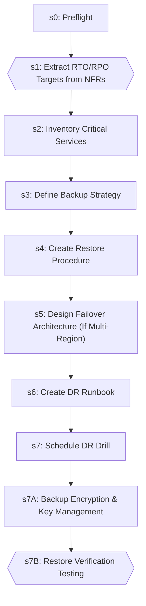
```mermaid
graph TD
    s0["s0: Preflight"]
    s1{{s1: Extract RTO/RPO Targets from NFRs}}
    s0 --> s1
    s2["s2: Inventory Critical Services"]
    s1 --> s2
    s3["s3: Define Backup Strategy"]
    s2 --> s3
    s4["s4: Create Restore Procedure"]
    s3 --> s4
    s5["s5: Design Failover Architecture (If Multi-Region)"]
    s4 --> s5
    s6["s6: Create DR Runbook"]
    s5 --> s6
    s7["s7: Schedule DR Drill"]
    s6 --> s7
    s7A["s7A: Backup Encryption & Key Management"]
    s7 --> s7A
    s7B{{s7B: Restore Verification Testing}}
    s7A --> s7B
```

| Step | Title | Delegates To | Artifacts | Gates/Decisions |
|------|-------|-------------|-----------|----------------|
| 0 | Preflight | — | — | decision |
| 1 | Extract RTO/RPO Targets from NFRs | — | — | gate |
| 2 | Inventory Critical Services | — | — | — |
| 3 | Define Backup Strategy | — | — | — |
| 4 | Create Restore Procedure | — | — | — |
| 5 | Design Failover Architecture (If Multi-Region) | — | — | — |
| 6 | Create DR Runbook | — | — | — |
| 7 | Schedule DR Drill | — | — | — |
| 7A | Backup Encryption & Key Management | — | — | — |
| 7B | Restore Verification Testing | — | — | gate |

### executing-plans

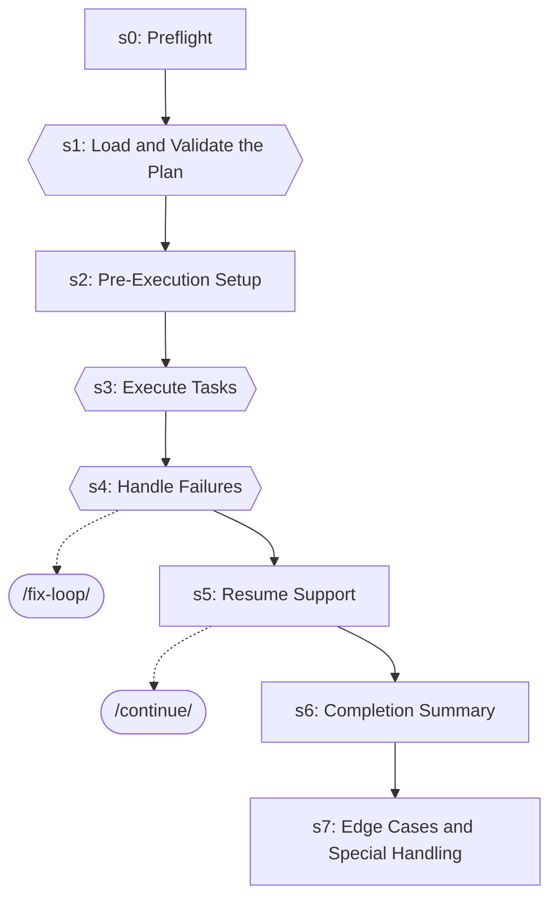
```mermaid
graph TD
    s0["s0: Preflight"]
    s1{{s1: Load and Validate the Plan}}
    s0 --> s1
    s2["s2: Pre-Execution Setup"]
    s1 --> s2
    s3{{s3: Execute Tasks}}
    s2 --> s3
    s4{{s4: Handle Failures}}
    s3 --> s4
    fix_loop_ext([/fix-loop/])
    s4 -.-> fix_loop_ext
    s5["s5: Resume Support"]
    s4 --> s5
    continue_ext([/continue/])
    s5 -.-> continue_ext
    s6["s6: Completion Summary"]
    s5 --> s6
    s7["s7: Edge Cases and Special Handling"]
    s6 --> s7
```

| Step | Title | Delegates To | Artifacts | Gates/Decisions |
|------|-------|-------------|-----------|----------------|
| 0 | Preflight | — | — | decision |
| 1 | Load and Validate the Plan | — | — | gate, decision |
| 2 | Pre-Execution Setup | — | — | — |
| 3 | Execute Tasks | — | — | gate |
| 4 | Handle Failures | `/fix-loop` | — | gate, decision |
| 5 | Resume Support | `/continue` | — | decision |
| 6 | Completion Summary | — | — | — |
| 7 | Edge Cases and Special Handling | — | — | decision |

### expo-dev

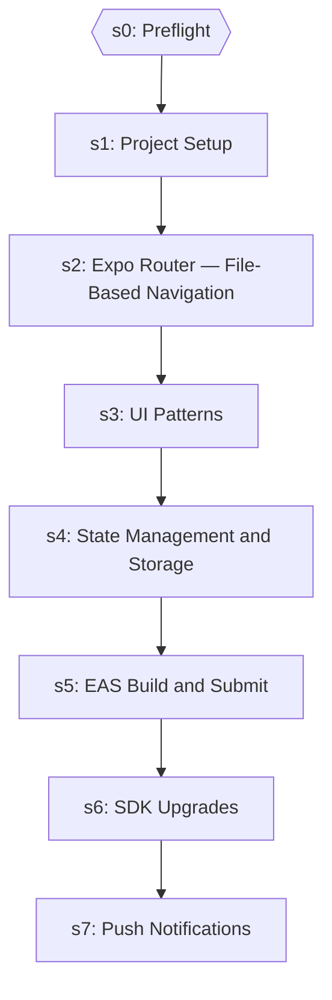
```mermaid
graph TD
    s0{{s0: Preflight}}
    s1["s1: Project Setup"]
    s0 --> s1
    s2["s2: Expo Router — File-Based Navigation"]
    s1 --> s2
    s3["s3: UI Patterns"]
    s2 --> s3
    s4["s4: State Management and Storage"]
    s3 --> s4
    s5["s5: EAS Build and Submit"]
    s4 --> s5
    s6["s6: SDK Upgrades"]
    s5 --> s6
    s7["s7: Push Notifications"]
    s6 --> s7
```

| Step | Title | Delegates To | Artifacts | Gates/Decisions |
|------|-------|-------------|-----------|----------------|
| 0 | Preflight | — | — | gate |
| 1 | Project Setup | — | — | — |
| 2 | Expo Router — File-Based Navigation | — | — | — |
| 3 | UI Patterns | — | — | — |
| 4 | State Management and Storage | — | — | — |
| 5 | EAS Build and Submit | — | — | — |
| 6 | SDK Upgrades | — | — | decision |
| 7 | Push Notifications | — | — | — |

### firebase-dev

```mermaid
graph TD
    s0{{s0: Preflight}}
```

| Step | Title | Delegates To | Artifacts | Gates/Decisions |
|------|-------|-------------|-----------|----------------|
| 0 | Preflight | — | — | gate, decision |

### flutter-dev

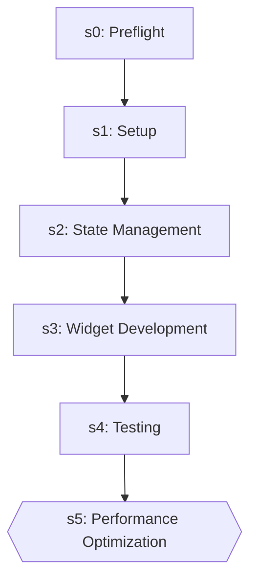
```mermaid
graph TD
    s0["s0: Preflight"]
    s1["s1: Setup"]
    s0 --> s1
    s2["s2: State Management"]
    s1 --> s2
    s3["s3: Widget Development"]
    s2 --> s3
    s4["s4: Testing"]
    s3 --> s4
    s5{{s5: Performance Optimization}}
    s4 --> s5
```

| Step | Title | Delegates To | Artifacts | Gates/Decisions |
|------|-------|-------------|-----------|----------------|
| 0 | Preflight | — | — | — |
| 1 | Setup | — | — | — |
| 2 | State Management | — | — | — |
| 3 | Widget Development | — | — | — |
| 4 | Testing | — | — | — |
| 5 | Performance Optimization | — | — | gate, decision |

### grill-me

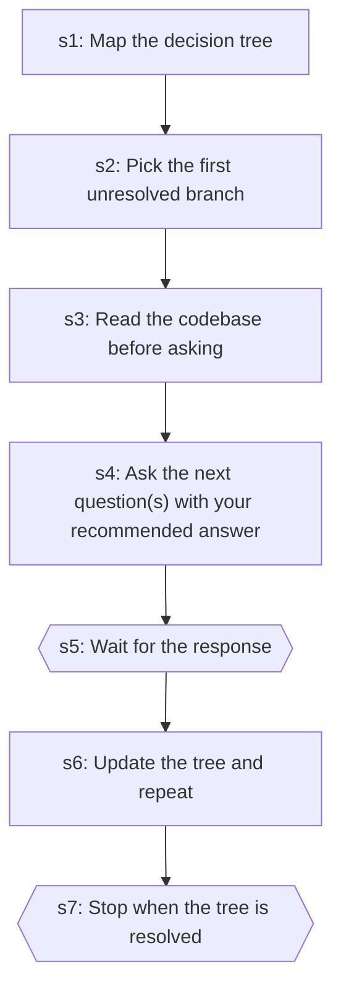
```mermaid
graph TD
    s1["s1: Map the decision tree"]
    s2["s2: Pick the first unresolved branch"]
    s1 --> s2
    s3["s3: Read the codebase before asking"]
    s2 --> s3
    s4["s4: Ask the next question(s) with your recommended answer"]
    s3 --> s4
    s5{{s5: Wait for the response}}
    s4 --> s5
    s6["s6: Update the tree and repeat"]
    s5 --> s6
    s7{{s7: Stop when the tree is resolved}}
    s6 --> s7
```

| Step | Title | Delegates To | Artifacts | Gates/Decisions |
|------|-------|-------------|-----------|----------------|
| 1 | Map the decision tree | — | — | — |
| 2 | Pick the first unresolved branch | — | — | — |
| 3 | Read the codebase before asking | — | — | — |
| 4 | Ask the next question(s) with your recommended answer | — | — | — |
| 5 | Wait for the response | — | — | gate |
| 6 | Update the tree and repeat | — | — | — |
| 7 | Stop when the tree is resolved | — | — | gate |

### grill-with-docs

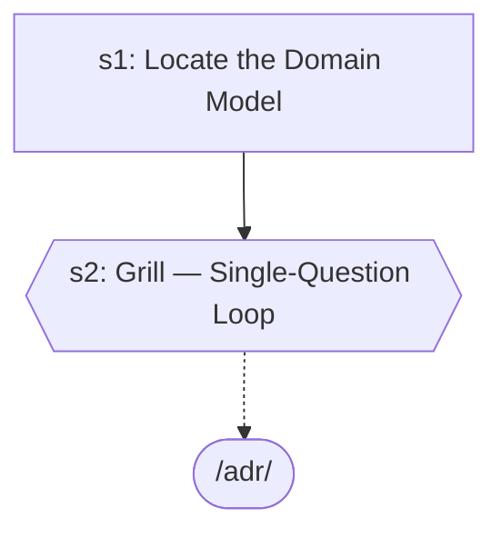
```mermaid
graph TD
    s1["s1: Locate the Domain Model"]
    s2{{s2: Grill — Single-Question Loop}}
    s1 --> s2
    adr_ext([/adr/])
    s2 -.-> adr_ext
```

| Step | Title | Delegates To | Artifacts | Gates/Decisions |
|------|-------|-------------|-----------|----------------|
| 1 | Locate the Domain Model | — | — | decision |
| 2 | Grill — Single-Question Loop | `/adr` | — | gate, decision |

### improve-codebase-architecture

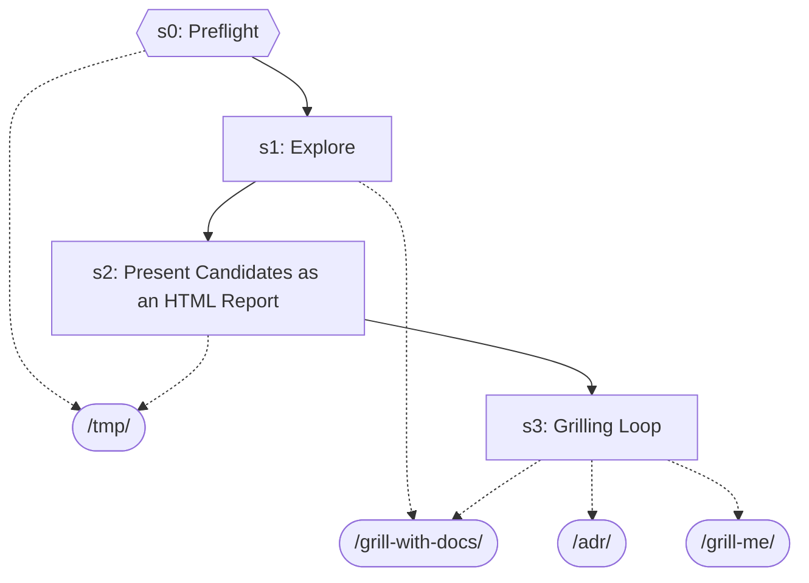
```mermaid
graph TD
    s0{{s0: Preflight}}
    tmp_ext([/tmp/])
    s0 -.-> tmp_ext
    s1["s1: Explore"]
    s0 --> s1
    grill_with_docs_ext([/grill-with-docs/])
    s1 -.-> grill_with_docs_ext
    s2["s2: Present Candidates as an HTML Report"]
    s1 --> s2
    tmp_ext([/tmp/])
    s2 -.-> tmp_ext
    s3["s3: Grilling Loop"]
    s2 --> s3
    adr_ext([/adr/])
    s3 -.-> adr_ext
    grill_me_ext([/grill-me/])
    s3 -.-> grill_me_ext
    grill_with_docs_ext([/grill-with-docs/])
    s3 -.-> grill_with_docs_ext
```

| Step | Title | Delegates To | Artifacts | Gates/Decisions |
|------|-------|-------------|-----------|----------------|
| 0 | Preflight | `/tmp` | — | gate, decision |
| 1 | Explore | `/grill-with-docs` | — | decision |
| 2 | Present Candidates as an HTML Report | `/tmp` | — | decision |
| 3 | Grilling Loop | `/adr`, `/grill-me`, `/grill-with-docs` | — | decision |

### mcp-server-builder

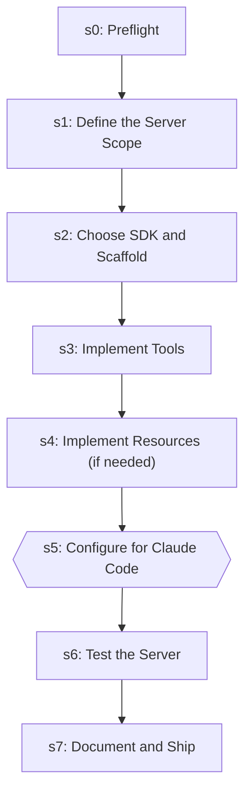
```mermaid
graph TD
    s0["s0: Preflight"]
    s1["s1: Define the Server Scope"]
    s0 --> s1
    s2["s2: Choose SDK and Scaffold"]
    s1 --> s2
    s3["s3: Implement Tools"]
    s2 --> s3
    s4["s4: Implement Resources (if needed)"]
    s3 --> s4
    s5{{s5: Configure for Claude Code}}
    s4 --> s5
    s6["s6: Test the Server"]
    s5 --> s6
    s7["s7: Document and Ship"]
    s6 --> s7
```

| Step | Title | Delegates To | Artifacts | Gates/Decisions |
|------|-------|-------------|-----------|----------------|
| 0 | Preflight | — | — | — |
| 1 | Define the Server Scope | — | — | — |
| 2 | Choose SDK and Scaffold | — | — | — |
| 3 | Implement Tools | — | — | — |
| 4 | Implement Resources (if needed) | — | — | — |
| 5 | Configure for Claude Code | — | — | gate |
| 6 | Test the Server | — | — | — |
| 7 | Document and Ship | — | — | — |

### nextjs-dev

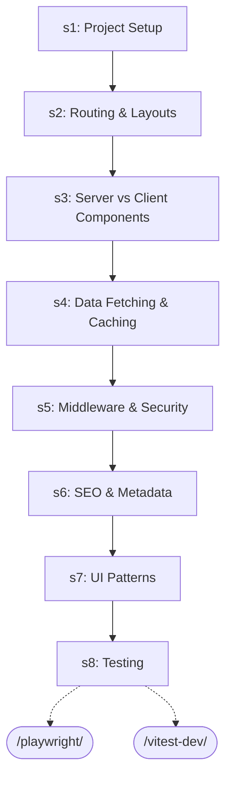
```mermaid
graph TD
    s1["s1: Project Setup"]
    s2["s2: Routing & Layouts"]
    s1 --> s2
    s3["s3: Server vs Client Components"]
    s2 --> s3
    s4["s4: Data Fetching & Caching"]
    s3 --> s4
    s5["s5: Middleware & Security"]
    s4 --> s5
    s6["s6: SEO & Metadata"]
    s5 --> s6
    s7["s7: UI Patterns"]
    s6 --> s7
    s8["s8: Testing"]
    s7 --> s8
    playwright_ext([/playwright/])
    s8 -.-> playwright_ext
    vitest_dev_ext([/vitest-dev/])
    s8 -.-> vitest_dev_ext
```

| Step | Title | Delegates To | Artifacts | Gates/Decisions |
|------|-------|-------------|-----------|----------------|
| 1 | Project Setup | — | — | — |
| 2 | Routing & Layouts | — | — | — |
| 3 | Server vs Client Components | — | — | — |
| 4 | Data Fetching & Caching | — | — | — |
| 5 | Middleware & Security | — | — | — |
| 6 | SEO & Metadata | — | — | — |
| 7 | UI Patterns | — | — | — |
| 8 | Testing | `/playwright`, `/vitest-dev` | — | — |

### node-backend-dev

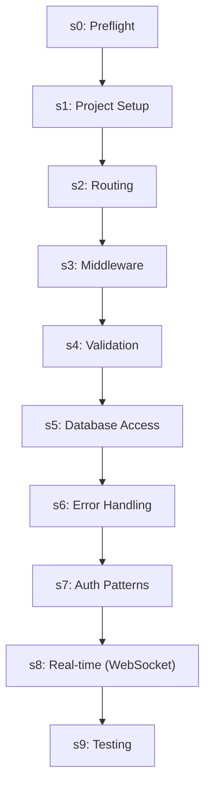
```mermaid
graph TD
    s0["s0: Preflight"]
    s1["s1: Project Setup"]
    s0 --> s1
    s2["s2: Routing"]
    s1 --> s2
    s3["s3: Middleware"]
    s2 --> s3
    s4["s4: Validation"]
    s3 --> s4
    s5["s5: Database Access"]
    s4 --> s5
    s6["s6: Error Handling"]
    s5 --> s6
    s7["s7: Auth Patterns"]
    s6 --> s7
    s8["s8: Real-time (WebSocket)"]
    s7 --> s8
    s9["s9: Testing"]
    s8 --> s9
```

| Step | Title | Delegates To | Artifacts | Gates/Decisions |
|------|-------|-------------|-----------|----------------|
| 0 | Preflight | — | — | — |
| 1 | Project Setup | — | — | — |
| 2 | Routing | — | — | — |
| 3 | Middleware | — | — | — |
| 4 | Validation | — | — | — |
| 5 | Database Access | — | — | — |
| 6 | Error Handling | — | — | — |
| 7 | Auth Patterns | — | — | — |
| 8 | Real-time (WebSocket) | — | — | — |
| 9 | Testing | — | — | — |

### nuxt-dev

```mermaid
graph TD
    s0["s0: Preflight"]
    s1["s1: Project Setup & Configuration"]
    s0 --> s1
    s2["s2: Server Functionality"]
    s1 --> s2
    s3["s3: Routing, Middleware & Plugins"]
    s2 --> s3
    s4["s4: Nuxt Modules"]
    s3 --> s4
    s5["s5: NuxtHub (v0.10.6)"]
    s4 --> s5
    s6["s6: Nuxt Content v3"]
    s5 --> s6
    s7["s7: Nuxt UI v4"]
    s6 --> s7
    s8{{s8: Authentication (nuxt-better-auth)}}
    s7 --> s8
```

| Step | Title | Delegates To | Artifacts | Gates/Decisions |
|------|-------|-------------|-----------|----------------|
| 0 | Preflight | — | — | — |
| 1 | Project Setup & Configuration | — | — | — |
| 2 | Server Functionality | — | — | — |
| 3 | Routing, Middleware & Plugins | — | — | — |
| 4 | Nuxt Modules | — | — | — |
| 5 | NuxtHub (v0.10.6) | — | — | — |
| 6 | Nuxt Content v3 | — | — | — |
| 7 | Nuxt UI v4 | — | — | — |
| 8 | Authentication (nuxt-better-auth) | — | — | gate |

### pipeline-orchestrator

```mermaid
graph TD
    s0["s0: Preflight"]
    s1{{s1: Dispatch Pipeline Orchestrator Agent}}
    s0 --> s1
    s2{{s2: Report Results}}
    s1 --> s2
    project_manager_agent_ext((project-manager-agent))
    s2 -.-> project_manager_agent_ext
```

| Step | Title | Delegates To | Artifacts | Gates/Decisions |
|------|-------|-------------|-----------|----------------|
| 0 | Preflight | — | — | decision |
| 1 | Dispatch Pipeline Orchestrator Agent | — | — | gate |
| 2 | Report Results | `project-manager-agent` | — | gate, decision |

### plan-to-issues

```mermaid
graph TD
    s0["s0: Preflight"]
    s1["s1: Parse Plan"]
    s0 --> s1
    s2["s2: Check for Duplicates"]
    s1 --> s2
    s3["s3: Organize into Epics (if applicable)"]
    s2 --> s3
    s4["s4: Create Task Issues"]
    s3 --> s4
    s5["s5: Report"]
    s4 --> s5
```

| Step | Title | Delegates To | Artifacts | Gates/Decisions |
|------|-------|-------------|-----------|----------------|
| 0 | Preflight | — | — | decision |
| 1 | Parse Plan | — | — | — |
| 2 | Check for Duplicates | — | — | — |
| 3 | Organize into Epics (if applicable) | — | — | — |
| 4 | Create Task Issues | — | — | — |
| 5 | Report | — | — | — |

### playwright

```mermaid
graph TD
    s0["s0: Preflight"]
    s1["s1: Project Setup & Configuration"]
    s0 --> s1
    s2["s2: Browser Automation Fundamentals"]
    s1 --> s2
    s3["s3: E2E Test Generation from User Flows"]
    s2 --> s3
    s4["s4: Page Object Model (POM)"]
    s3 --> s4
    s5["s5: API + UI Combined Testing"]
    s4 --> s5
    s6["s6: Flaky Test Prevention"]
    s5 --> s6
    s7["s7: Visual Regression Testing"]
    s6 --> s7
    s8["s8: Debugging — MCP Execution Debugger"]
    s7 --> s8
    s9["s9: Cross-Browser Testing"]
    s8 --> s9
    s10{{s10: Network Interception}}
    s9 --> s10
    s11["s11: Test Artifacts & Reporting"]
    s10 --> s11
    s12["s12: Common Patterns"]
    s11 --> s12
    s13["s13: Advanced Browser Capabilities"]
    s12 --> s13
```

| Step | Title | Delegates To | Artifacts | Gates/Decisions |
|------|-------|-------------|-----------|----------------|
| 0 | Preflight | — | — | decision |
| 1 | Project Setup & Configuration | — | — | — |
| 2 | Browser Automation Fundamentals | — | — | — |
| 3 | E2E Test Generation from User Flows | — | — | — |
| 4 | Page Object Model (POM) | — | — | — |
| 5 | API + UI Combined Testing | — | — | — |
| 6 | Flaky Test Prevention | — | — | — |
| 7 | Visual Regression Testing | — | — | — |
| 8 | Debugging — MCP Execution Debugger | — | — | — |
| 9 | Cross-Browser Testing | — | — | — |
| 10 | Network Interception | — | — | gate |
| 11 | Test Artifacts & Reporting | — | — | — |
| 12 | Common Patterns | — | — | — |
| 13 | Advanced Browser Capabilities | — | — | — |

### prd-parser

```mermaid
graph TD
    s0["s0: Preflight"]
    s1{{s1: Detect Format}}
    s0 --> s1
    s2{{s2: Parse Sections}}
    s1 --> s2
    s3["s3: Normalize to Standard PRD Format"]
    s2 --> s3
    s4["s4: IEEE 830 Validation"]
    s3 --> s4
    s5{{s5: Gap Report}}
    s4 --> s5
    s6["s6: Output Normalized PRD"]
    s5 --> s6
    adversarial_review_ext([/adversarial-review/])
    s6 -.-> adversarial_review_ext
    brainstorm_ext([/brainstorm/])
    s6 -.-> brainstorm_ext
    plan_to_issues_ext([/plan-to-issues/])
    s6 -.-> plan_to_issues_ext
    writing_plans_ext([/writing-plans/])
    s6 -.-> writing_plans_ext
```

| Step | Title | Delegates To | Artifacts | Gates/Decisions |
|------|-------|-------------|-----------|----------------|
| 0 | Preflight | — | — | decision |
| 1 | Detect Format | — | — | gate |
| 2 | Parse Sections | — | — | gate |
| 3 | Normalize to Standard PRD Format | — | — | decision |
| 4 | IEEE 830 Validation | — | — | — |
| 5 | Gap Report | — | — | gate |
| 6 | Output Normalized PRD | `/adversarial-review`, `/brainstorm`, `/plan-to-issues`, `/writing-plans` | — | — |

### project-scaffold

```mermaid
graph TD
    s0{{s0: Preflight}}
    s1["s1: Determine Stack & Scope"]
    s0 --> s1
    s2["s2: Generate Project Structure"]
    s1 --> s2
    s3["s3: Linter & Formatter Configuration"]
    s2 --> s3
    s4["s4: Git Hooks & Conventional Commits"]
    s3 --> s4
    s5["s5: CI Pipeline (GitHub Actions)"]
    s4 --> s5
    s6{{s6: Security Baseline}}
    s5 --> s6
    s7["s7: Docker & Dev Environment"]
    s6 --> s7
    s8["s8: Health Endpoint"]
    s7 --> s8
    s9["s9: 12-Factor Compliance Check"]
    s8 --> s9
    s10["s10: License & README"]
    s9 --> s10
    s11{{s11: Verify & Gate}}
    s10 --> s11
    s12{{s12: Suggest Next Steps}}
    s11 --> s12
    ci_cd_setup_ext([/ci-cd-setup/])
    s12 -.-> ci_cd_setup_ext
    security_audit_ext([/security-audit/])
    s12 -.-> security_audit_ext
    writing_plans_ext([/writing-plans/])
    s12 -.-> writing_plans_ext
```

| Step | Title | Delegates To | Artifacts | Gates/Decisions |
|------|-------|-------------|-----------|----------------|
| 0 | Preflight | — | — | gate |
| 1 | Determine Stack & Scope | — | — | — |
| 2 | Generate Project Structure | — | — | — |
| 3 | Linter & Formatter Configuration | — | — | — |
| 4 | Git Hooks & Conventional Commits | — | — | — |
| 5 | CI Pipeline (GitHub Actions) | — | — | — |
| 6 | Security Baseline | — | — | gate |
| 7 | Docker & Dev Environment | — | — | — |
| 8 | Health Endpoint | — | — | — |
| 9 | 12-Factor Compliance Check | — | — | — |
| 10 | License & README | — | — | — |
| 11 | Verify & Gate | — | — | gate |
| 12 | Suggest Next Steps | `/ci-cd-setup`, `/security-audit`, `/writing-plans` | — | gate |

### provenance-report

```mermaid
graph TD
    s0["s0: Preflight"]
    s1["s1: Harvest the real, on-disk data"]
    s0 --> s1
    s2{{s2: Assemble the sections}}
    s1 --> s2
    s3["s3: Render self-contained HTML"]
    s2 --> s3
    s4["s4: Verify + report"]
    s3 --> s4
```

| Step | Title | Delegates To | Artifacts | Gates/Decisions |
|------|-------|-------------|-----------|----------------|
| 0 | Preflight | — | — | decision |
| 1 | Harvest the real, on-disk data | — | → `test-results/*.json` | — |
| 2 | Assemble the sections | — | — | gate |
| 3 | Render self-contained HTML | — | — | — |
| 4 | Verify + report | — | — | — |

### security-audit

```mermaid
graph TD
    s0["s0: Preflight"]
    s1["s1: Reconnaissance"]
    s0 --> s1
    s2["s2: Static Analysis"]
    s1 --> s2
    s3["s3: Variant Analysis"]
    s2 --> s3
    s4["s4: Differential Security Review"]
    s3 --> s4
    s5["s5: Insecure Defaults Detection"]
    s4 --> s5
    s6{{s6: GitHub Actions Security}}
    s5 --> s6
    s7{{s7: False-Positive Gating}}
    s6 --> s7
    s8["s8: OWASP Top 10 Checklist"]
    s7 --> s8
    s9{{s9: Compliance Testing (GDPR / SOC2 / HIPAA)}}
    s8 --> s9
```

| Step | Title | Delegates To | Artifacts | Gates/Decisions |
|------|-------|-------------|-----------|----------------|
| 0 | Preflight | — | — | decision |
| 1 | Reconnaissance | — | — | — |
| 2 | Static Analysis | — | — | — |
| 3 | Variant Analysis | — | — | — |
| 4 | Differential Security Review | — | — | — |
| 5 | Insecure Defaults Detection | — | — | — |
| 6 | GitHub Actions Security | — | — | gate |
| 7 | False-Positive Gating | — | — | gate |
| 8 | OWASP Top 10 Checklist | — | — | — |
| 9 | Compliance Testing (GDPR / SOC2 / HIPAA) | — | — | gate |

### ssot-audit

```mermaid
graph TD
    s1{{s1: Gather Configuration Inventory}}
    s2{{s2: Check CLAUDE.md Health}}
    s1 --> s2
    s3["s3: Detect Cross-Layer Duplication"]
    s2 --> s3
    fix_github_issue_ext([/fix-github-issue/])
    s3 -.-> fix_github_issue_ext
    s4["s4: Validate Rule Scoping"]
    s3 --> s4
    s5["s5: Check Skill Boundaries"]
    s4 --> s5
    s6{{s6: Generate Report}}
    s5 --> s6
```

| Step | Title | Delegates To | Artifacts | Gates/Decisions |
|------|-------|-------------|-----------|----------------|
| 1 | Gather Configuration Inventory | — | — | gate, decision |
| 2 | Check CLAUDE.md Health | — | — | gate |
| 3 | Detect Cross-Layer Duplication | `/fix-github-issue` | — | decision |
| 4 | Validate Rule Scoping | — | — | — |
| 5 | Check Skill Boundaries | — | — | — |
| 6 | Generate Report | — | — | gate |

### subagent-driven-dev

```mermaid
graph TD
    s0{{s0: Preflight}}
    s1["s1: Decide Whether to Use Subagents"]
    s0 --> s1
    s2["s2: Decompose the Task"]
    s1 --> s2
    s3{{s3: Write Subagent Prompts}}
    s2 --> s3
    s4["s4: Dispatch Strategy"]
    s3 --> s4
    s5{{s5: Monitor Progress and Aggregate Results}}
    s4 --> s5
    s6["s6: Handle Failures"]
    s5 --> s6
    s7["s7: Context Management for Subagents"]
    s6 --> s7
    executing_plans_ext([/executing-plans/])
    s7 -.-> executing_plans_ext
    s8["s8: File Conflict Avoidance & Advanced Patterns"]
    s7 --> s8
    s9{{s9: Completion Summary}}
    s8 --> s9
```

| Step | Title | Delegates To | Artifacts | Gates/Decisions |
|------|-------|-------------|-----------|----------------|
| 0 | Preflight | — | — | gate |
| 1 | Decide Whether to Use Subagents | — | — | — |
| 2 | Decompose the Task | — | — | — |
| 3 | Write Subagent Prompts | — | — | gate |
| 4 | Dispatch Strategy | — | — | — |
| 5 | Monitor Progress and Aggregate Results | — | — | gate |
| 6 | Handle Failures | — | — | — |
| 7 | Context Management for Subagents | `/executing-plans` | — | — |
| 8 | File Conflict Avoidance & Advanced Patterns | — | — | — |
| 9 | Completion Summary | — | — | gate |

### to-prd

```mermaid
graph TD
    s0["s0: Preflight"]
    s1["s1: Explore the Repo"]
    s0 --> s1
    s2["s2: Sketch the Modules"]
    s1 --> s2
    improve_codebase_architecture_ext([/improve-codebase-architecture/])
    s2 -.-> improve_codebase_architecture_ext
    s3["s3: Write the PRD"]
    s2 --> s3
    brainstorm_ext([/brainstorm/])
    s3 -.-> brainstorm_ext
    grill_with_docs_ext([/grill-with-docs/])
    s3 -.-> grill_with_docs_ext
    plan_to_issues_ext([/plan-to-issues/])
    s3 -.-> plan_to_issues_ext
    ready_for_agent_ext((ready-for-agent))
    s3 -.-> ready_for_agent_ext
```

| Step | Title | Delegates To | Artifacts | Gates/Decisions |
|------|-------|-------------|-----------|----------------|
| 0 | Preflight | — | — | — |
| 1 | Explore the Repo | — | — | decision |
| 2 | Sketch the Modules | `/improve-codebase-architecture` | — | — |
| 3 | Write the PRD | `/brainstorm`, `/grill-with-docs`, `/plan-to-issues`, `ready-for-agent` | — | decision |

### vue-dev

```mermaid
graph TD
    s0["s0: Preflight"]
    s1["s1: Setup"]
    s0 --> s1
    s2["s2: Reactivity and Composition API"]
    s1 --> s2
    s3["s3: Component Patterns"]
    s2 --> s3
    s4["s4: Composables"]
    s3 --> s4
    s5{{s5: Vue Router}}
    s4 --> s5
    s6["s6: Reka UI Headless Components"]
    s5 --> s6
    s7["s7: Custom Directives"]
    s6 --> s7
    s8["s8: Testing"]
    s7 --> s8
```

| Step | Title | Delegates To | Artifacts | Gates/Decisions |
|------|-------|-------------|-----------|----------------|
| 0 | Preflight | — | — | — |
| 1 | Setup | — | — | — |
| 2 | Reactivity and Composition API | — | — | — |
| 3 | Component Patterns | — | — | — |
| 4 | Composables | — | — | — |
| 5 | Vue Router | — | — | gate |
| 6 | Reka UI Headless Components | — | — | — |
| 7 | Custom Directives | — | — | — |
| 8 | Testing | — | — | — |

### writing-plans

```mermaid
graph TD
    s1["s1: Understand Scope"]
    brainstorm_ext([/brainstorm/])
    s1 -.-> brainstorm_ext
    s2{{s2: Decompose into Tasks}}
    s1 --> s2
    s3["s3: Add Dependency Graph"]
    s2 --> s3
    s4["s4: Review Plan Quality"]
    s3 --> s4
    s5["s5: Present for Approval"]
    s4 --> s5
    s6{{s6: Save Plan and Companion Files}}
    s5 --> s6
    s7["s7: Suggest Next Steps"]
    s6 --> s7
    executing_plans_ext([/executing-plans/])
    s7 -.-> executing_plans_ext
    plan_to_issues_ext([/plan-to-issues/])
    s7 -.-> plan_to_issues_ext
```

| Step | Title | Delegates To | Artifacts | Gates/Decisions |
|------|-------|-------------|-----------|----------------|
| 1 | Understand Scope | `/brainstorm` | — | decision |
| 2 | Decompose into Tasks | — | — | gate, decision |
| 3 | Add Dependency Graph | — | — | — |
| 4 | Review Plan Quality | — | — | — |
| 5 | Present for Approval | — | — | — |
| 6 | Save Plan and Companion Files | — | — | gate |
| 7 | Suggest Next Steps | `/executing-plans`, `/plan-to-issues` | — | — |

## Agents

| Agent | Description | Dispatched By |
|-------|-------------|---------------|
| `android-build-fixer-agent` | Use proactively to diagnose and fix Android Gradle build failures. Spawn auto... | `/workflow-master-template` |
| `anthropic-multi-agent-reviewer-agent` | Review multi-agent orchestration systems against Anthropic's 8 research-backe... | — |
| `code-reviewer-agent` | Use proactively to review recently changed files for code quality, type safet... | `/anthropic-agent-orchestration-guide`, `/security-auditor-agent`, `/workflow-master-template` |
| `fastapi-api-tester-agent` | Use this agent when you need to test FastAPI backend endpoints, validate API ... | `/workflow-master-template` |
| `github-issue-manager-agent` | Use proactively to create consolidated GitHub Issues for test failures from t... | `/workflow-master-template` |
| `karpathy-advisor-agent` | Consult Andrej Karpathy's documented thinking on a decision, design, or situa... | — |
| `plan-executor-agent` | Use this agent to parse structured plans into tracked steps, coordinate execu... | `/anthropic-agent-orchestration-guide` |
| `planner-researcher-agent` | Senior technical lead specializing in software architecture, system design, a... | `/anthropic-agent-orchestration-guide`, `/web-research-specialist-agent` |
| `security-auditor-agent` | Use proactively for security assessments — OWASP Top 10 scanning, threat mode... | `/anthropic-agent-orchestration-guide` |
| `session-summarizer-agent` | Use proactively to auto-generate session summary updates at session end. Spaw... | `/workflow-master-template` |
| `test-failure-analyzer-agent` | Use proactively to diagnose test failures — reads test output, classifies by ... | `/fix-loop`, `/workflow-master-template` |
| `tester-agent` | Senior QA engineer specializing in comprehensive testing and quality assuranc... | `/workflow-master-template` |
| `web-research-specialist-agent` | Use this agent for web research — finding documentation, API references, libr... | — |
| `workflow-master-template` | Shared orchestration protocol reference for workflow orchestrators in core/.c... | — |

## Rules

| Rule | Description |
|------|-------------|
| `decision-authority` |  |
| `plan-before-coding` |  |
| `untrusted-content-handling` |  |
| `verify-before-suggest-do-before-delegate` |  |
| `workflow` |  |

## Cross-Workflow Connections

**Outgoing** (this workflow feeds into):
- `architecture-fitness` (skill)
- `contract-test` (skill)
- `create-github-issue` (skill)
- `e2e-visual-run` (skill)
- `handover` (skill)
- `monorepo` (skill)
- `pr-standards` (skill)
- `project-manager-agent` (agent)
- `prompt-auto-enhance` (rule)
- `review-gate` (skill)
- `start-session` (skill)
- `test-healer-agent` (agent)
- `test-pipeline` (skill)

**Incoming** (fed by):
- `agent-orchestration` (rule)
- `agent-team-selection` (rule)
- `analytics-setup` (skill)
- `android-run-e2e` (skill)
- `android-run-tests` (skill)
- `anthropic-multi-agent-research-system-skill` (skill)
- `auto-verify` (skill)
- `bun-elysia-test` (skill)
- `changelog-contributing` (skill)
- `claude-behavior` (rule)
- `code-review-workflow` (skill)
- `create-github-issue` (skill)
- `dependency-migration-triage` (skill)
- `diataxis-docs` (skill)
- `docs-manager-agent` (agent)
- `e2e-best-practices` (skill)
- `e2e-visual-run` (skill)
- `end-session` (skill)
- `engineering-roles` (rule)
- `fastapi-run-backend-tests` (skill)
- `firebase-test` (skill)
- `flutter-e2e-test` (skill)
- `full-defect-surface-sweep` (skill)
- `git-branch-lifecycle` (skill)
- `learning-self-improvement` (skill)
- `pattern-self-containment` (rule)
- `pattern-structure` (rule)
- `pr-standards` (skill)
- `project-manager-agent` (agent)
- `prompt-auto-enhance` (rule)
- `save-session` (skill)
- `session-continuity` (skill)
- `skill-master` (skill)
- `start-session` (skill)
- `supervisor-verification` (rule)
- `tdd` (skill)
- `tdd-rule` (rule)
- `test-data-management` (skill)
- `test-healer-agent` (agent)
- `testing` (rule)
- `verify-screenshots` (skill)
- `visual-inspector-agent` (agent)
- `weakened-test-hunter` (skill)
- `writing-skills` (skill)
- `zoom-out` (skill)

<!-- MANUAL ANNOTATIONS -->
<!-- Add custom notes below this line. They are preserved on regeneration. -->
