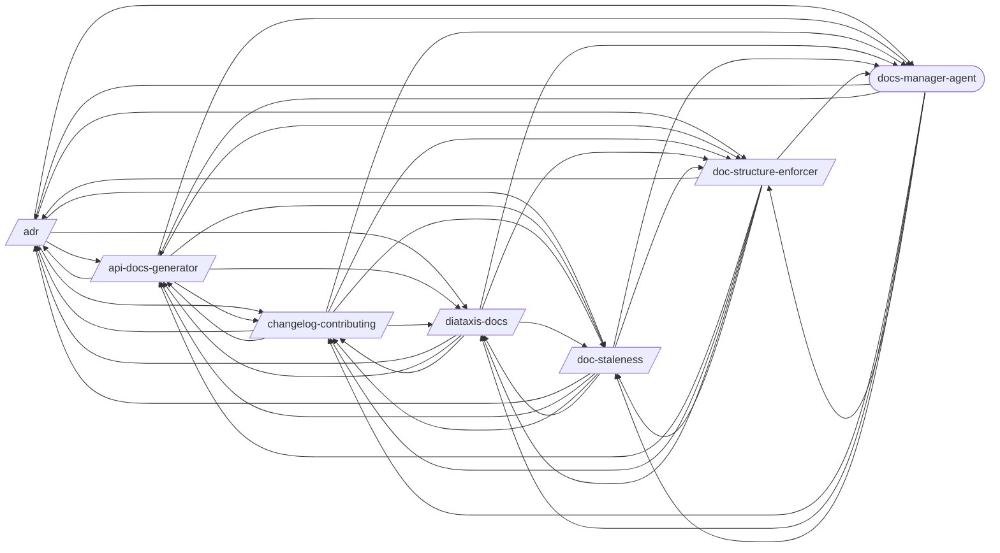

# Documentation

> Documentation generation, structure enforcement, and maintenance.

> Auto-generated by `scripts/generate_workflow_docs.py` | Last updated: 2026-03-24 01:48 UTC

## Overview



## Detailed Flow

Step-level flow showing gates (diamonds), delegations (dashed), and artifacts (cylinders).

```mermaid
graph TD
    subgraph adr_sub["Adr"]
        adr_s1["Step 1: Parse Command"]
        adr_s2["Step 2: Initialize ADR Directory (If Needed)"]
        adr_s1 --> adr_s2
        doc_structure_enforcer_ext([/doc-structure-enforcer/])
        adr_s2 -.-> doc_structure_enforcer_ext
        adr_s3["Step 3: Create New ADR (`new`)"]
        adr_s2 --> adr_s3
        adr_s4["Step 4: List ADRs (`list`)"]
        adr_s3 --> adr_s4
        adr_s5["Step 5: Supersede or Deprecate (`supersede` / `deprecate`)"]
        adr_s4 --> adr_s5
        adr_s6["Step 6: Generate Index (`index`)"]
        adr_s5 --> adr_s6
        adr_s7{{Step 7: Verify Integrity}}
        adr_s6 --> adr_s7
        api_docs_generator_ext([/api-docs-generator/])
        adr_s7 -.-> api_docs_generator_ext
        changelog_contributing_ext([/changelog-contributing/])
        adr_s7 -.-> changelog_contributing_ext
        diataxis_docs_ext([/diataxis-docs/])
        adr_s7 -.-> diataxis_docs_ext
        doc_staleness_ext([/doc-staleness/])
        adr_s7 -.-> doc_staleness_ext
        adr_s7 -.-> doc_structure_enforcer_ext
        docs_manager_agent_ext((docs-manager-agent))
        adr_s7 -.-> docs_manager_agent_ext
    end

    subgraph api_docs_generator_sub["Api Docs Generator"]
        api_docs_generator_s1["Step 1: Detect API Framework"]
        api_docs_generator_s2["Step 2: Generate or Extract OpenAPI Spec"]
        api_docs_generator_s1 --> api_docs_generator_s2
        api_docs_generator_s3["Step 3: Validate Spec"]
        api_docs_generator_s2 --> api_docs_generator_s3
        api_docs_generator_s4["Step 4: Generate Human-Readable Docs"]
        api_docs_generator_s3 --> api_docs_generator_s4
        docs_ext([/docs/])
        api_docs_generator_s4 -.-> docs_ext
        redoc_ext([/redoc/])
        api_docs_generator_s4 -.-> redoc_ext
        api_docs_generator_s5["Step 5: API Versioning Documentation"]
        api_docs_generator_s4 --> api_docs_generator_s5
        api_docs_generator_s6["Step 6: CI Integration"]
        api_docs_generator_s5 --> api_docs_generator_s6
        api_docs_generator_s7{{Step 7: Output Summary}}
        api_docs_generator_s6 --> api_docs_generator_s7
        adr_ext([/adr/])
        api_docs_generator_s7 -.-> adr_ext
        api_docs_generator_s7 -.-> changelog_contributing_ext
        api_docs_generator_s7 -.-> diataxis_docs_ext
        api_docs_generator_s7 -.-> doc_staleness_ext
        api_docs_generator_s7 -.-> doc_structure_enforcer_ext
        api_docs_generator_s7 -.-> docs_manager_agent_ext
    end

    subgraph changelog_contributing_sub["Changelog Contributing"]
        changelog_contributing_s1["Step 1: Detect Commit Convention and Project Context"]
        changelog_contributing_s2["Step 2: Parse Git Log"]
        changelog_contributing_s1 --> changelog_contributing_s2
        changelog_contributing_s3["Step 3: Group and Deduplicate Entries"]
        changelog_contributing_s2 --> changelog_contributing_s3
        changelog_contributing_s4["Step 4: Generate CHANGELOG.md"]
        changelog_contributing_s3 --> changelog_contributing_s4
        changelog_contributing_s5["Step 5: Generate CONTRIBUTING.md"]
        changelog_contributing_s4 --> changelog_contributing_s5
        changelog_contributing_s6["Step 6: CI Integration (Optional)"]
        changelog_contributing_s5 --> changelog_contributing_s6
        changelog_contributing_s7{{Step 7: Report}}
        changelog_contributing_s6 --> changelog_contributing_s7
        changelog_contributing_s7 -.-> adr_ext
        changelog_contributing_s7 -.-> api_docs_generator_ext
        changelog_contributing_s7 -.-> diataxis_docs_ext
        changelog_contributing_s7 -.-> doc_staleness_ext
        changelog_contributing_s7 -.-> doc_structure_enforcer_ext
        changelog_contributing_s7 -.-> docs_manager_agent_ext
    end

    subgraph diataxis_docs_sub["Diataxis Docs"]
        diataxis_docs_s1["Step 1: Audit Existing Documentation"]
        diataxis_docs_s2["Step 2: Classify Into Four Categories"]
        diataxis_docs_s1 --> diataxis_docs_s2
        diataxis_docs_s3{{Step 3: Identify Gaps}}
        diataxis_docs_s2 --> diataxis_docs_s3
        diataxis_docs_s4["Step 4: Generate Templates"]
        diataxis_docs_s3 --> diataxis_docs_s4
        diataxis_docs_s5["Step 5: Restructure Docs Directory"]
        diataxis_docs_s4 --> diataxis_docs_s5
        diataxis_docs_s6{{Step 6: Create Index}}
        diataxis_docs_s5 --> diataxis_docs_s6
        diataxis_docs_s6 -.-> adr_ext
        diataxis_docs_s6 -.-> api_docs_generator_ext
        diataxis_docs_s6 -.-> changelog_contributing_ext
        diataxis_docs_s6 -.-> doc_staleness_ext
        diataxis_docs_s6 -.-> doc_structure_enforcer_ext
        diataxis_docs_s6 -.-> docs_manager_agent_ext
    end

    subgraph doc_staleness_sub["Doc Staleness"]
        doc_staleness_s1["Step 1: Identify Documentation Files"]
        doc_staleness_s2["Step 2: Determine Change Window"]
        doc_staleness_s1 --> doc_staleness_s2
        doc_staleness_s3{{Step 3: Extract Documentation References}}
        doc_staleness_s2 --> doc_staleness_s3
        doc_staleness_s4["Step 4: Detect Undocumented Changes"]
        doc_staleness_s3 --> doc_staleness_s4
        doc_staleness_s5["Step 5: Generate Staleness Report"]
        doc_staleness_s4 --> doc_staleness_s5
        doc_staleness_s6{{Step 6: Suggest Fixes}}
        doc_staleness_s5 --> doc_staleness_s6
        doc_staleness_s6 -.-> adr_ext
        doc_staleness_s6 -.-> api_docs_generator_ext
        doc_staleness_s6 -.-> changelog_contributing_ext
        doc_staleness_s6 -.-> diataxis_docs_ext
        doc_staleness_s6 -.-> doc_structure_enforcer_ext
        doc_staleness_s6 -.-> docs_manager_agent_ext
    end

    subgraph doc_structure_enforcer_sub["Doc Structure Enforcer"]
        doc_structure_enforcer_s1["Step 1: Load or Generate Config"]
        doc_structure_enforcer_s2["Step 2: Scan Documentation Files"]
        doc_structure_enforcer_s1 --> doc_structure_enforcer_s2
        doc_structure_enforcer_s3["Step 3: Classify Files"]
        doc_structure_enforcer_s2 --> doc_structure_enforcer_s3
        doc_structure_enforcer_s4["Step 4: Compute Misplacements"]
        doc_structure_enforcer_s3 --> doc_structure_enforcer_s4
        doc_structure_enforcer_s5["Step 5: Report"]
        doc_structure_enforcer_s4 --> doc_structure_enforcer_s5
        doc_structure_enforcer_s6["Step 6: Plan Moves (Enforce Mode Only)"]
        doc_structure_enforcer_s5 --> doc_structure_enforcer_s6
        doc_structure_enforcer_s7["Step 7: Scan References (Enforce Mode Only)"]
        doc_structure_enforcer_s6 --> doc_structure_enforcer_s7
        doc_structure_enforcer_s8{{Step 8: Execute Moves and Update References (Enforce Mode Only)}}
        doc_structure_enforcer_s7 --> doc_structure_enforcer_s8
        doc_structure_enforcer_s8 -.-> adr_ext
        doc_structure_enforcer_s8 -.-> api_docs_generator_ext
        doc_structure_enforcer_s8 -.-> changelog_contributing_ext
        doc_structure_enforcer_s8 -.-> diataxis_docs_ext
        doc_structure_enforcer_s8 -.-> doc_staleness_ext
        doc_structure_enforcer_s8 -.-> docs_manager_agent_ext
    end

    adr_s7 ==> api_docs_generator_s1
    adr_s7 ==> changelog_contributing_s1
    adr_s7 ==> diataxis_docs_s1
    adr_s7 ==> doc_staleness_s1
    adr_s2 ==> doc_structure_enforcer_s1
    api_docs_generator_s7 ==> adr_s1
    api_docs_generator_s7 ==> changelog_contributing_s1
    api_docs_generator_s7 ==> diataxis_docs_s1
    api_docs_generator_s7 ==> doc_staleness_s1
    api_docs_generator_s7 ==> doc_structure_enforcer_s1
    changelog_contributing_s7 ==> adr_s1
    changelog_contributing_s7 ==> api_docs_generator_s1
    changelog_contributing_s7 ==> diataxis_docs_s1
    changelog_contributing_s7 ==> doc_staleness_s1
    changelog_contributing_s7 ==> doc_structure_enforcer_s1
    diataxis_docs_s6 ==> adr_s1
    diataxis_docs_s6 ==> api_docs_generator_s1
    diataxis_docs_s6 ==> changelog_contributing_s1
    diataxis_docs_s6 ==> doc_staleness_s1
    diataxis_docs_s6 ==> doc_structure_enforcer_s1
    doc_staleness_s6 ==> adr_s1
    doc_staleness_s6 ==> api_docs_generator_s1
    doc_staleness_s6 ==> changelog_contributing_s1
    doc_staleness_s6 ==> diataxis_docs_s1
    doc_staleness_s6 ==> doc_structure_enforcer_s1
    doc_structure_enforcer_s8 ==> adr_s1
    doc_structure_enforcer_s8 ==> api_docs_generator_s1
    doc_structure_enforcer_s8 ==> changelog_contributing_s1
    doc_structure_enforcer_s8 ==> diataxis_docs_s1
    doc_structure_enforcer_s8 ==> doc_staleness_s1
```

## Skills

| Skill | Version | Description | Calls | Called By |
|-------|---------|-------------|-------|----------|
| `/adr` | 1.0.0 | Create and manage Architecture Decision Records (ADRs). Initialize an ADR dir... | `/api-docs-generator`, `/changelog-contributing`, `/diataxis-docs`, `/doc-staleness`, `/doc-structure-enforcer`, `/docs-manager-agent` | `/api-docs-generator`, `/changelog-contributing`, `/diataxis-docs`, `/doc-staleness`, `/doc-structure-enforcer`, `/docs-manager-agent` |
| `/api-docs-generator` | 1.0.0 | Generate OpenAPI/Swagger documentation from code annotations for FastAPI, Exp... | `/adr`, `/changelog-contributing`, `/diataxis-docs`, `/doc-staleness`, `/doc-structure-enforcer`, `/docs-manager-agent` | `/adr`, `/changelog-contributing`, `/diataxis-docs`, `/doc-staleness`, `/doc-structure-enforcer`, `/docs-manager-agent` |
| `/changelog-contributing` | 1.0.0 | Generate CHANGELOG.md from conventional commits and create a project-specific... | `/adr`, `/api-docs-generator`, `/diataxis-docs`, `/doc-staleness`, `/doc-structure-enforcer`, `/docs-manager-agent` | `/adr`, `/api-docs-generator`, `/diataxis-docs`, `/doc-staleness`, `/doc-structure-enforcer`, `/docs-manager-agent` |
| `/diataxis-docs` | 1.0.0 | Organize project documentation into the Diataxis framework: tutorials, how-to... | `/adr`, `/api-docs-generator`, `/changelog-contributing`, `/doc-staleness`, `/doc-structure-enforcer`, `/docs-manager-agent` | `/adr`, `/api-docs-generator`, `/changelog-contributing`, `/doc-staleness`, `/doc-structure-enforcer`, `/docs-manager-agent` |
| `/doc-staleness` | 1.0.0 | Detect documentation that has drifted from the codebase by comparing docs aga... | `/adr`, `/api-docs-generator`, `/changelog-contributing`, `/diataxis-docs`, `/doc-structure-enforcer`, `/docs-manager-agent` | `/adr`, `/api-docs-generator`, `/changelog-contributing`, `/diataxis-docs`, `/doc-structure-enforcer`, `/docs-manager-agent` |
| `/doc-structure-enforcer` | 1.0.0 | Enforce a stage-based documentation folder structure via config-driven rules.... | `/adr`, `/api-docs-generator`, `/changelog-contributing`, `/diataxis-docs`, `/doc-staleness`, `/docs-manager-agent` | `/adr`, `/api-docs-generator`, `/changelog-contributing`, `/diataxis-docs`, `/doc-staleness`, `/docs-manager-agent` |

## Agents

| Agent | Description | Dispatched By |
|-------|-------------|---------------|
| `docs-manager-agent` | Use this agent for documentation updates — continuation prompts, requirement ... | `/adr`, `/api-docs-generator`, `/changelog-contributing`, `/diataxis-docs`, `/doc-staleness`, `/doc-structure-enforcer` |

## Cross-Workflow Connections

**Incoming** (fed by):
- `apply-selections` (skill)
- `post-fix-pipeline` (skill)

<!-- MANUAL ANNOTATIONS -->
<!-- Add custom notes below this line. They are preserved on regeneration. -->
