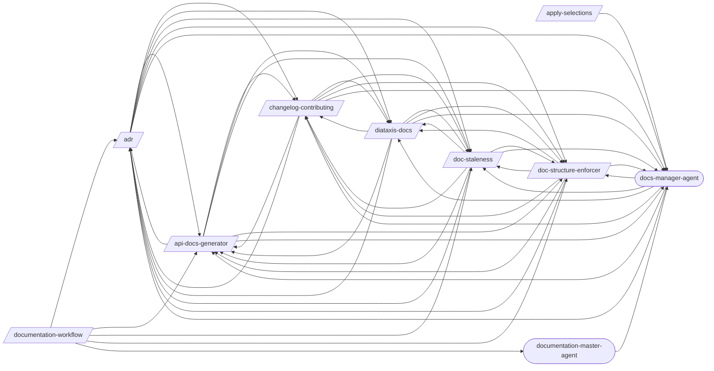
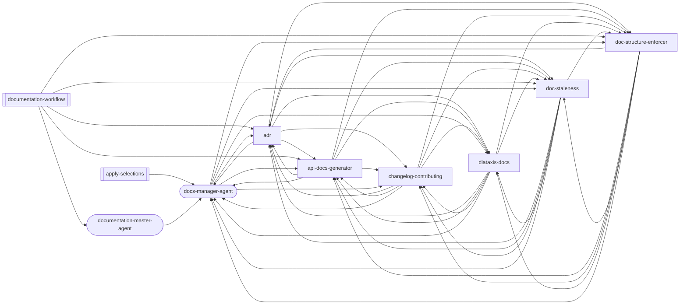
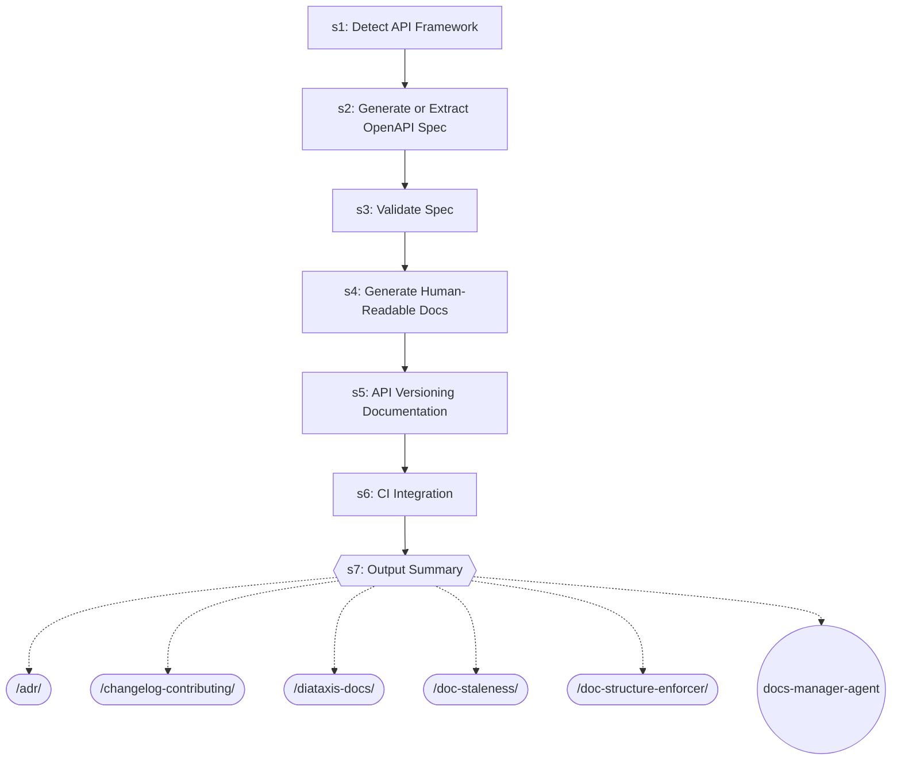
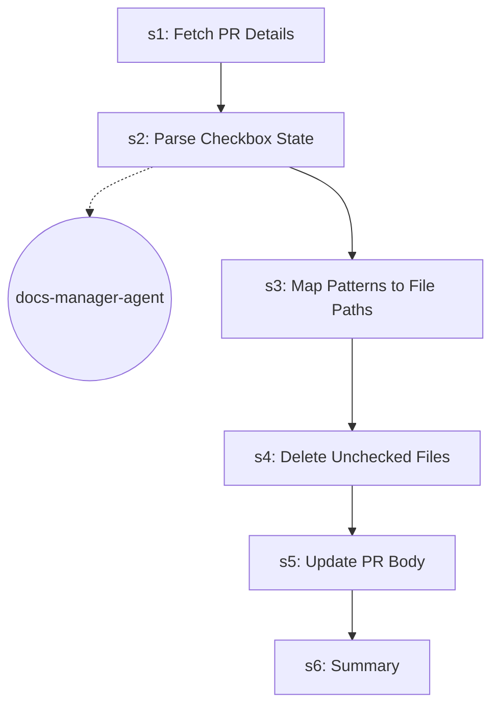
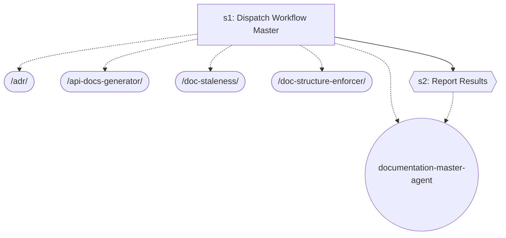

# Documentation

> Documentation generation, structure enforcement, and maintenance.

> Auto-generated by `scripts/generate_workflow_docs.py` | Last updated: 2026-04-03 07:31 UTC

## Overview



## Detailed Flow

Step-level flow showing gates (diamonds), delegations (dashed), and artifacts (cylinders).

```mermaid
graph TD
    subgraph adr_sub["Adr"]
        adr_s1["Step 1: Parse and Validate Command"]
        adr_s2["Step 2: Initialize ADR Directory (If Needed)"]
        adr_s1 --> adr_s2
        doc_structure_enforcer_ext([/doc-structure-enforcer/])
        adr_s2 -.-> doc_structure_enforcer_ext
        adr_s3["Step 3: Create New ADR (new)"]
        adr_s2 --> adr_s3
        adr_s4["Step 4: List ADRs (list)"]
        adr_s3 --> adr_s4
        adr_s5["Step 5: Supersede or Deprecate (supersede / deprecate)"]
        adr_s4 --> adr_s5
        adr_s6["Step 6: Generate Index (index)"]
        adr_s5 --> adr_s6
        adr_s7{{Step 7: Verify Integrity}}
        adr_s6 --> adr_s7
        api_docs_generator_ext([/api-docs-generator/])
        adr_s7 -.-> api_docs_generator_ext
        changelog_contributing_ext([/changelog-contributing/])
        adr_s7 -.-> changelog_contributing_ext
        diataxis_docs_ext([/diataxis-docs/])
        adr_s7 -.-> diataxis_docs_ext
        doc_staleness_ext([/doc-staleness/])
        adr_s7 -.-> doc_staleness_ext
        adr_s7 -.-> doc_structure_enforcer_ext
        docs_manager_agent_ext((docs-manager-agent))
        adr_s7 -.-> docs_manager_agent_ext
    end

    subgraph api_docs_generator_sub["Api Docs Generator"]
        api_docs_generator_s1["Step 1: Detect API Framework"]
        api_docs_generator_s2["Step 2: Generate or Extract OpenAPI Spec"]
        api_docs_generator_s1 --> api_docs_generator_s2
        api_docs_generator_s3["Step 3: Validate Spec"]
        api_docs_generator_s2 --> api_docs_generator_s3
        api_docs_generator_s4["Step 4: Generate Human-Readable Docs"]
        api_docs_generator_s3 --> api_docs_generator_s4
        api_docs_generator_s5["Step 5: API Versioning Documentation"]
        api_docs_generator_s4 --> api_docs_generator_s5
        api_docs_generator_s6["Step 6: CI Integration"]
        api_docs_generator_s5 --> api_docs_generator_s6
        api_docs_generator_s7{{Step 7: Output Summary}}
        api_docs_generator_s6 --> api_docs_generator_s7
        adr_ext([/adr/])
        api_docs_generator_s7 -.-> adr_ext
        api_docs_generator_s7 -.-> changelog_contributing_ext
        api_docs_generator_s7 -.-> diataxis_docs_ext
        api_docs_generator_s7 -.-> doc_staleness_ext
        api_docs_generator_s7 -.-> doc_structure_enforcer_ext
        api_docs_generator_s7 -.-> docs_manager_agent_ext
    end

    subgraph apply_selections_sub["Apply Selections"]
        apply_selections_s1["Step 1: Fetch PR Details"]
        apply_selections_s2["Step 2: Parse Checkbox State"]
        apply_selections_s1 --> apply_selections_s2
        apply_selections_s2 -.-> docs_manager_agent_ext
        apply_selections_s3["Step 3: Map Patterns to File Paths"]
        apply_selections_s2 --> apply_selections_s3
        apply_selections_s4["Step 4: Delete Unchecked Files"]
        apply_selections_s3 --> apply_selections_s4
        apply_selections_s5["Step 5: Update PR Body"]
        apply_selections_s4 --> apply_selections_s5
        apply_selections_s6["Step 6: Summary"]
        apply_selections_s5 --> apply_selections_s6
    end

    subgraph changelog_contributing_sub["Changelog Contributing"]
        changelog_contributing_s1["Step 1: Detect Commit Convention and Project Context"]
        changelog_contributing_s2["Step 2: Parse Git Log"]
        changelog_contributing_s1 --> changelog_contributing_s2
        changelog_contributing_s3["Step 3: Group and Deduplicate Entries"]
        changelog_contributing_s2 --> changelog_contributing_s3
        changelog_contributing_s4["Step 4: Generate CHANGELOG.md"]
        changelog_contributing_s3 --> changelog_contributing_s4
        changelog_contributing_s5["Step 5: Generate CONTRIBUTING.md"]
        changelog_contributing_s4 --> changelog_contributing_s5
        changelog_contributing_s6["Step 6: CI Integration (Optional)"]
        changelog_contributing_s5 --> changelog_contributing_s6
        changelog_contributing_s7{{Step 7: Report}}
        changelog_contributing_s6 --> changelog_contributing_s7
        changelog_contributing_s7 -.-> adr_ext
        changelog_contributing_s7 -.-> api_docs_generator_ext
        changelog_contributing_s7 -.-> diataxis_docs_ext
        changelog_contributing_s7 -.-> doc_staleness_ext
        changelog_contributing_s7 -.-> doc_structure_enforcer_ext
        changelog_contributing_s7 -.-> docs_manager_agent_ext
    end

    subgraph diataxis_docs_sub["Diataxis Docs"]
        diataxis_docs_s1["Step 1: Audit Existing Documentation"]
        diataxis_docs_s2["Step 2: Classify Into Four Categories"]
        diataxis_docs_s1 --> diataxis_docs_s2
        diataxis_docs_s3{{Step 3: Identify Gaps}}
        diataxis_docs_s2 --> diataxis_docs_s3
        diataxis_docs_s4["Step 4: Generate Templates"]
        diataxis_docs_s3 --> diataxis_docs_s4
        diataxis_docs_s5["Step 5: Restructure Docs Directory"]
        diataxis_docs_s4 --> diataxis_docs_s5
        diataxis_docs_s6{{Step 6: Create Index}}
        diataxis_docs_s5 --> diataxis_docs_s6
        diataxis_docs_s6 -.-> adr_ext
        diataxis_docs_s6 -.-> api_docs_generator_ext
        diataxis_docs_s6 -.-> changelog_contributing_ext
        diataxis_docs_s6 -.-> doc_staleness_ext
        diataxis_docs_s6 -.-> doc_structure_enforcer_ext
        diataxis_docs_s6 -.-> docs_manager_agent_ext
    end

    subgraph doc_staleness_sub["Doc Staleness"]
        doc_staleness_s1["Step 1: Identify Documentation Files"]
        doc_staleness_s2["Step 2: Determine Change Window"]
        doc_staleness_s1 --> doc_staleness_s2
        doc_staleness_s3{{Step 3: Extract Documentation References}}
        doc_staleness_s2 --> doc_staleness_s3
        doc_staleness_s4["Step 4: Detect Undocumented Changes"]
        doc_staleness_s3 --> doc_staleness_s4
        doc_staleness_s5["Step 5: Generate Staleness Report"]
        doc_staleness_s4 --> doc_staleness_s5
        doc_staleness_s6{{Step 6: Suggest Fixes}}
        doc_staleness_s5 --> doc_staleness_s6
        doc_staleness_s6 -.-> adr_ext
        doc_staleness_s6 -.-> api_docs_generator_ext
        doc_staleness_s6 -.-> changelog_contributing_ext
        doc_staleness_s6 -.-> diataxis_docs_ext
        doc_staleness_s6 -.-> doc_structure_enforcer_ext
        doc_staleness_s6 -.-> docs_manager_agent_ext
    end

    subgraph doc_structure_enforcer_sub["Doc Structure Enforcer"]
        doc_structure_enforcer_s1["Step 1: Load or Generate Config"]
        doc_structure_enforcer_s2["Step 2: Scan Documentation Files"]
        doc_structure_enforcer_s1 --> doc_structure_enforcer_s2
        doc_structure_enforcer_s3["Step 3: Classify Files"]
        doc_structure_enforcer_s2 --> doc_structure_enforcer_s3
        doc_structure_enforcer_s4["Step 4: Compute Misplacements"]
        doc_structure_enforcer_s3 --> doc_structure_enforcer_s4
        doc_structure_enforcer_s5["Step 5: Report"]
        doc_structure_enforcer_s4 --> doc_structure_enforcer_s5
        doc_structure_enforcer_s6["Step 6: Plan Moves (Enforce Mode Only)"]
        doc_structure_enforcer_s5 --> doc_structure_enforcer_s6
        doc_structure_enforcer_s7["Step 7: Scan References (Enforce Mode Only)"]
        doc_structure_enforcer_s6 --> doc_structure_enforcer_s7
        doc_structure_enforcer_s8{{Step 8: Execute Moves and Update References (Enforce Mode Only)}}
        doc_structure_enforcer_s7 --> doc_structure_enforcer_s8
        doc_structure_enforcer_s8 -.-> adr_ext
        doc_structure_enforcer_s8 -.-> api_docs_generator_ext
        doc_structure_enforcer_s8 -.-> changelog_contributing_ext
        doc_structure_enforcer_s8 -.-> diataxis_docs_ext
        doc_structure_enforcer_s8 -.-> doc_staleness_ext
        doc_structure_enforcer_s8 -.-> docs_manager_agent_ext
    end

    adr_s7 ==> api_docs_generator_s1
    adr_s7 ==> changelog_contributing_s1
    adr_s7 ==> diataxis_docs_s1
    adr_s7 ==> doc_staleness_s1
    adr_s2 ==> doc_structure_enforcer_s1
    api_docs_generator_s7 ==> adr_s1
    api_docs_generator_s7 ==> changelog_contributing_s1
    api_docs_generator_s7 ==> diataxis_docs_s1
    api_docs_generator_s7 ==> doc_staleness_s1
    api_docs_generator_s7 ==> doc_structure_enforcer_s1
    changelog_contributing_s7 ==> adr_s1
    changelog_contributing_s7 ==> api_docs_generator_s1
    changelog_contributing_s7 ==> diataxis_docs_s1
    changelog_contributing_s7 ==> doc_staleness_s1
    changelog_contributing_s7 ==> doc_structure_enforcer_s1
    diataxis_docs_s6 ==> adr_s1
    diataxis_docs_s6 ==> api_docs_generator_s1
    diataxis_docs_s6 ==> changelog_contributing_s1
    diataxis_docs_s6 ==> doc_staleness_s1
    diataxis_docs_s6 ==> doc_structure_enforcer_s1
    doc_staleness_s6 ==> adr_s1
    doc_staleness_s6 ==> api_docs_generator_s1
    doc_staleness_s6 ==> changelog_contributing_s1
    doc_staleness_s6 ==> diataxis_docs_s1
    doc_staleness_s6 ==> doc_structure_enforcer_s1
    doc_structure_enforcer_s8 ==> adr_s1
    doc_structure_enforcer_s8 ==> api_docs_generator_s1
    doc_structure_enforcer_s8 ==> changelog_contributing_s1
    doc_structure_enforcer_s8 ==> diataxis_docs_s1
    doc_structure_enforcer_s8 ==> doc_staleness_s1
```

## Skills

| Skill | Version | Description | Calls | Called By |
|-------|---------|-------------|-------|----------|
| `/adr` | 1.1.0 | Create and manage Architecture Decision Records (ADRs). Initialize an ADR dir... | `/api-docs-generator`, `/changelog-contributing`, `/diataxis-docs`, `/doc-staleness`, `/doc-structure-enforcer`, `/docs-manager-agent` | `/api-docs-generator`, `/changelog-contributing`, `/diataxis-docs`, `/doc-staleness`, `/doc-structure-enforcer`, `/documentation-workflow`, `/docs-manager-agent` |
| `/api-docs-generator` | 1.0.0 | Generate OpenAPI/Swagger documentation from code annotations for FastAPI, Exp... | `/adr`, `/changelog-contributing`, `/diataxis-docs`, `/doc-staleness`, `/doc-structure-enforcer`, `/docs-manager-agent` | `/adr`, `/changelog-contributing`, `/diataxis-docs`, `/doc-staleness`, `/doc-structure-enforcer`, `/documentation-workflow`, `/docs-manager-agent` |
| `/apply-selections` | 1.0.0 | Apply user-selected patterns from a nice-to-have PR by parsing checkbox state... | `/docs-manager-agent` | — |
| `/changelog-contributing` | 1.0.0 | Generate CHANGELOG.md from conventional commits and create a project-specific... | `/adr`, `/api-docs-generator`, `/diataxis-docs`, `/doc-staleness`, `/doc-structure-enforcer`, `/docs-manager-agent` | `/adr`, `/api-docs-generator`, `/diataxis-docs`, `/doc-staleness`, `/doc-structure-enforcer`, `/docs-manager-agent` |
| `/diataxis-docs` | 1.0.0 | Organize project documentation into the Diataxis framework: tutorials, how-to... | `/adr`, `/api-docs-generator`, `/changelog-contributing`, `/doc-staleness`, `/doc-structure-enforcer`, `/docs-manager-agent` | `/adr`, `/api-docs-generator`, `/changelog-contributing`, `/doc-staleness`, `/doc-structure-enforcer`, `/docs-manager-agent` |
| `/doc-staleness` | 1.0.0 | Detect documentation that has drifted from the codebase by comparing docs aga... | `/adr`, `/api-docs-generator`, `/changelog-contributing`, `/diataxis-docs`, `/doc-structure-enforcer`, `/docs-manager-agent` | `/adr`, `/api-docs-generator`, `/changelog-contributing`, `/diataxis-docs`, `/doc-structure-enforcer`, `/documentation-workflow`, `/docs-manager-agent` |
| `/doc-structure-enforcer` | 1.0.0 | Enforce a stage-based documentation folder structure via config-driven rules.... | `/adr`, `/api-docs-generator`, `/changelog-contributing`, `/diataxis-docs`, `/doc-staleness`, `/docs-manager-agent` | `/adr`, `/api-docs-generator`, `/changelog-contributing`, `/diataxis-docs`, `/doc-staleness`, `/documentation-workflow`, `/docs-manager-agent` |
| `/documentation-workflow` | 1.0.0 | Generate and maintain project documentation end-to-end: ADRs, API docs, struc... | `/adr`, `/api-docs-generator`, `/doc-staleness`, `/doc-structure-enforcer`, `/documentation-master-agent` | — |
| `/firebase-ai` | 1.0.2 | Integrate Firebase AI Logic (Gemini API) including setup, text generation, mu... | — | — |

## Workflow Steps

### Consolidated Step Flow

End-to-end flow across all skills, showing how steps connect via delegations (thick arrows).

```mermaid
graph TD
    subgraph adr_sub["Adr"]
        adr_s1["Parse and Validate Command"]
        adr_s2["Initialize ADR Directory (If Needed)"]
        adr_s1 --> adr_s2
        adr_s3["Create New ADR (new)"]
        adr_s2 --> adr_s3
        adr_s4["List ADRs (list)"]
        adr_s3 --> adr_s4
        adr_s5["Supersede or Deprecate (supersede / deprecate)"]
        adr_s4 --> adr_s5
        adr_s6["Generate Index (index)"]
        adr_s5 --> adr_s6
        adr_s7{{Verify Integrity}}
        adr_s6 --> adr_s7
    end

    subgraph api_docs_generator_sub["Api Docs Generator"]
        api_docs_generator_s1["Detect API Framework"]
        api_docs_generator_s2["Generate or Extract OpenAPI Spec"]
        api_docs_generator_s1 --> api_docs_generator_s2
        api_docs_generator_s3["Validate Spec"]
        api_docs_generator_s2 --> api_docs_generator_s3
        api_docs_generator_s4["Generate Human-Readable Docs"]
        api_docs_generator_s3 --> api_docs_generator_s4
        api_docs_generator_s5["API Versioning Documentation"]
        api_docs_generator_s4 --> api_docs_generator_s5
        api_docs_generator_s6["CI Integration"]
        api_docs_generator_s5 --> api_docs_generator_s6
        api_docs_generator_s7{{Output Summary}}
        api_docs_generator_s6 --> api_docs_generator_s7
    end

    subgraph apply_selections_sub["Apply Selections"]
        apply_selections_s1["Fetch PR Details"]
        apply_selections_s2["Parse Checkbox State"]
        apply_selections_s1 --> apply_selections_s2
        apply_selections_s3["Map Patterns to File Paths"]
        apply_selections_s2 --> apply_selections_s3
        apply_selections_s4["Delete Unchecked Files"]
        apply_selections_s3 --> apply_selections_s4
        apply_selections_s5["Update PR Body"]
        apply_selections_s4 --> apply_selections_s5
        apply_selections_s6["Summary"]
        apply_selections_s5 --> apply_selections_s6
    end

    subgraph changelog_contributing_sub["Changelog Contributing"]
        changelog_contributing_s1["Detect Commit Convention and Project Context"]
        changelog_contributing_s2["Parse Git Log"]
        changelog_contributing_s1 --> changelog_contributing_s2
        changelog_contributing_s3["Group and Deduplicate Entries"]
        changelog_contributing_s2 --> changelog_contributing_s3
        changelog_contributing_s4["Generate CHANGELOG.md"]
        changelog_contributing_s3 --> changelog_contributing_s4
        changelog_contributing_s5["Generate CONTRIBUTING.md"]
        changelog_contributing_s4 --> changelog_contributing_s5
        changelog_contributing_s6["CI Integration (Optional)"]
        changelog_contributing_s5 --> changelog_contributing_s6
        changelog_contributing_s7{{Report}}
        changelog_contributing_s6 --> changelog_contributing_s7
    end

    subgraph diataxis_docs_sub["Diataxis Docs"]
        diataxis_docs_s1["Audit Existing Documentation"]
        diataxis_docs_s2["Classify Into Four Categories"]
        diataxis_docs_s1 --> diataxis_docs_s2
        diataxis_docs_s3{{Identify Gaps}}
        diataxis_docs_s2 --> diataxis_docs_s3
        diataxis_docs_s4["Generate Templates"]
        diataxis_docs_s3 --> diataxis_docs_s4
        diataxis_docs_s5["Restructure Docs Directory"]
        diataxis_docs_s4 --> diataxis_docs_s5
        diataxis_docs_s6{{Create Index}}
        diataxis_docs_s5 --> diataxis_docs_s6
    end

    subgraph doc_staleness_sub["Doc Staleness"]
        doc_staleness_s1["Identify Documentation Files"]
        doc_staleness_s2["Determine Change Window"]
        doc_staleness_s1 --> doc_staleness_s2
        doc_staleness_s3{{Extract Documentation References}}
        doc_staleness_s2 --> doc_staleness_s3
        doc_staleness_s4["Detect Undocumented Changes"]
        doc_staleness_s3 --> doc_staleness_s4
        doc_staleness_s5["Generate Staleness Report"]
        doc_staleness_s4 --> doc_staleness_s5
        doc_staleness_s6{{Suggest Fixes}}
        doc_staleness_s5 --> doc_staleness_s6
    end

    subgraph doc_structure_enforcer_sub["Doc Structure Enforcer"]
        doc_structure_enforcer_s1["Load or Generate Config"]
        doc_structure_enforcer_s2["Scan Documentation Files"]
        doc_structure_enforcer_s1 --> doc_structure_enforcer_s2
        doc_structure_enforcer_s3["Classify Files"]
        doc_structure_enforcer_s2 --> doc_structure_enforcer_s3
        doc_structure_enforcer_s4["Compute Misplacements"]
        doc_structure_enforcer_s3 --> doc_structure_enforcer_s4
        doc_structure_enforcer_s5["Report"]
        doc_structure_enforcer_s4 --> doc_structure_enforcer_s5
        doc_structure_enforcer_s6["Plan Moves (Enforce Mode Only)"]
        doc_structure_enforcer_s5 --> doc_structure_enforcer_s6
        doc_structure_enforcer_s7["Scan References (Enforce Mode Only)"]
        doc_structure_enforcer_s6 --> doc_structure_enforcer_s7
        doc_structure_enforcer_s8{{Execute Moves and Update References (Enforce Mode Only)}}
        doc_structure_enforcer_s7 --> doc_structure_enforcer_s8
    end

    subgraph documentation_workflow_sub["Documentation Workflow"]
        documentation_workflow_s1["Dispatch Workflow Master"]
        documentation_workflow_s2{{Report Results}}
        documentation_workflow_s1 --> documentation_workflow_s2
    end

    adr_s2 ==> doc_structure_enforcer_s1
    adr_s7 ==> api_docs_generator_s1
    adr_s7 ==> changelog_contributing_s1
    adr_s7 ==> diataxis_docs_s1
    adr_s7 ==> doc_staleness_s1
    adr_s7 ==> doc_structure_enforcer_s1
    api_docs_generator_s7 ==> adr_s1
    api_docs_generator_s7 ==> changelog_contributing_s1
    api_docs_generator_s7 ==> diataxis_docs_s1
    api_docs_generator_s7 ==> doc_staleness_s1
    api_docs_generator_s7 ==> doc_structure_enforcer_s1
    changelog_contributing_s7 ==> adr_s1
    changelog_contributing_s7 ==> api_docs_generator_s1
    changelog_contributing_s7 ==> diataxis_docs_s1
    changelog_contributing_s7 ==> doc_staleness_s1
    changelog_contributing_s7 ==> doc_structure_enforcer_s1
    diataxis_docs_s6 ==> adr_s1
    diataxis_docs_s6 ==> api_docs_generator_s1
    diataxis_docs_s6 ==> changelog_contributing_s1
    diataxis_docs_s6 ==> doc_staleness_s1
    diataxis_docs_s6 ==> doc_structure_enforcer_s1
    doc_staleness_s6 ==> adr_s1
    doc_staleness_s6 ==> api_docs_generator_s1
    doc_staleness_s6 ==> changelog_contributing_s1
    doc_staleness_s6 ==> diataxis_docs_s1
    doc_staleness_s6 ==> doc_structure_enforcer_s1
    doc_structure_enforcer_s8 ==> adr_s1
    doc_structure_enforcer_s8 ==> api_docs_generator_s1
    doc_structure_enforcer_s8 ==> changelog_contributing_s1
    doc_structure_enforcer_s8 ==> diataxis_docs_s1
    doc_structure_enforcer_s8 ==> doc_staleness_s1
    documentation_workflow_s1 ==> adr_s1
    documentation_workflow_s1 ==> api_docs_generator_s1
    documentation_workflow_s1 ==> doc_staleness_s1
    documentation_workflow_s1 ==> doc_structure_enforcer_s1
```

### Entry Points

Double-bordered nodes are user-facing entry points (no incoming references). Rounded nodes are agents.



### adr


| Step | Title | Delegates To | Artifacts | Gates/Decisions |
|------|-------|-------------|-----------|----------------|
| 1 | Parse and Validate Command | — | — | decision |
| 2 | Initialize ADR Directory (If Needed) | `/doc-structure-enforcer` | — | decision |
| 3 | Create New ADR (new) | — | — | — |
| 4 | List ADRs (list) | — | — | — |
| 5 | Supersede or Deprecate (supersede / deprecate) | — | — | — |
| 6 | Generate Index (index) | — | — | — |
| 7 | Verify Integrity | `/api-docs-generator`, `/changelog-contributing`, `/diataxis-docs`, `/doc-staleness`, `/doc-structure-enforcer`, `docs-manager-agent` | — | gate |

### api-docs-generator



| Step | Title | Delegates To | Artifacts | Gates/Decisions |
|------|-------|-------------|-----------|----------------|
| 1 | Detect API Framework | — | — | decision |
| 2 | Generate or Extract OpenAPI Spec | — | — | — |
| 3 | Validate Spec | — | — | — |
| 4 | Generate Human-Readable Docs | — | — | — |
| 5 | API Versioning Documentation | — | — | — |
| 6 | CI Integration | — | — | — |
| 7 | Output Summary | `/adr`, `/changelog-contributing`, `/diataxis-docs`, `/doc-staleness`, `/doc-structure-enforcer`, `docs-manager-agent` | — | gate |

### apply-selections



| Step | Title | Delegates To | Artifacts | Gates/Decisions |
|------|-------|-------------|-----------|----------------|
| 1 | Fetch PR Details | — | — | — |
| 2 | Parse Checkbox State | `docs-manager-agent` | — | — |
| 3 | Map Patterns to File Paths | — | — | — |
| 4 | Delete Unchecked Files | — | — | — |
| 5 | Update PR Body | — | — | — |
| 6 | Summary | — | — | — |

### changelog-contributing


| Step | Title | Delegates To | Artifacts | Gates/Decisions |
|------|-------|-------------|-----------|----------------|
| 1 | Detect Commit Convention and Project Context | — | — | — |
| 2 | Parse Git Log | — | — | — |
| 3 | Group and Deduplicate Entries | — | — | — |
| 4 | Generate CHANGELOG.md | — | — | decision |
| 5 | Generate CONTRIBUTING.md | — | — | — |
| 6 | CI Integration (Optional) | — | — | — |
| 7 | Report | `/adr`, `/api-docs-generator`, `/diataxis-docs`, `/doc-staleness`, `/doc-structure-enforcer`, `docs-manager-agent` | — | gate |

### diataxis-docs


| Step | Title | Delegates To | Artifacts | Gates/Decisions |
|------|-------|-------------|-----------|----------------|
| 1 | Audit Existing Documentation | — | — | — |
| 2 | Classify Into Four Categories | — | — | — |
| 3 | Identify Gaps | — | — | gate |
| 4 | Generate Templates | — | — | — |
| 5 | Restructure Docs Directory | — | — | — |
| 6 | Create Index | `/adr`, `/api-docs-generator`, `/changelog-contributing`, `/doc-staleness`, `/doc-structure-enforcer`, `docs-manager-agent` | — | gate |

### doc-staleness


| Step | Title | Delegates To | Artifacts | Gates/Decisions |
|------|-------|-------------|-----------|----------------|
| 1 | Identify Documentation Files | — | — | — |
| 2 | Determine Change Window | — | — | — |
| 3 | Extract Documentation References | — | — | gate |
| 4 | Detect Undocumented Changes | — | — | — |
| 5 | Generate Staleness Report | — | — | — |
| 6 | Suggest Fixes | `/adr`, `/api-docs-generator`, `/changelog-contributing`, `/diataxis-docs`, `/doc-structure-enforcer`, `docs-manager-agent` | — | gate |

### doc-structure-enforcer

```mermaid
graph TD
    s1["s1: Load or Generate Config"]
    s2["s2: Scan Documentation Files"]
    s1 --> s2
    s3["s3: Classify Files"]
    s2 --> s3
    s4["s4: Compute Misplacements"]
    s3 --> s4
    s5["s5: Report"]
    s4 --> s5
    s6["s6: Plan Moves (Enforce Mode Only)"]
    s5 --> s6
    s7["s7: Scan References (Enforce Mode Only)"]
    s6 --> s7
    s8{{s8: Execute Moves and Update References (Enforce Mode Only)}}
    s7 --> s8
    adr_ext([/adr/])
    s8 -.-> adr_ext
    api_docs_generator_ext([/api-docs-generator/])
    s8 -.-> api_docs_generator_ext
    changelog_contributing_ext([/changelog-contributing/])
    s8 -.-> changelog_contributing_ext
    diataxis_docs_ext([/diataxis-docs/])
    s8 -.-> diataxis_docs_ext
    doc_staleness_ext([/doc-staleness/])
    s8 -.-> doc_staleness_ext
    docs_manager_agent_ext((docs-manager-agent))
    s8 -.-> docs_manager_agent_ext
```

| Step | Title | Delegates To | Artifacts | Gates/Decisions |
|------|-------|-------------|-----------|----------------|
| 1 | Load or Generate Config | — | — | decision |
| 2 | Scan Documentation Files | — | — | — |
| 3 | Classify Files | — | — | — |
| 4 | Compute Misplacements | — | — | — |
| 5 | Report | — | — | — |
| 6 | Plan Moves (Enforce Mode Only) | — | — | decision |
| 7 | Scan References (Enforce Mode Only) | — | — | — |
| 8 | Execute Moves and Update References (Enforce Mode Only) | `/adr`, `/api-docs-generator`, `/changelog-contributing`, `/diataxis-docs`, `/doc-staleness`, `docs-manager-agent` | — | gate, decision |

### documentation-workflow



| Step | Title | Delegates To | Artifacts | Gates/Decisions |
|------|-------|-------------|-----------|----------------|
| 1 | Dispatch Workflow Master | `/adr`, `/api-docs-generator`, `/doc-staleness`, `/doc-structure-enforcer`, `documentation-master-agent` | — | — |
| 2 | Report Results | `documentation-master-agent` | — | gate |


## Agents

| Agent | Description | Dispatched By |
|-------|-------------|---------------|
| `docs-manager-agent` | Use this agent for documentation updates — continuation prompts, requirement ... | `/adr`, `/api-docs-generator`, `/apply-selections`, `/changelog-contributing`, `/diataxis-docs`, `/doc-staleness`, `/doc-structure-enforcer`, `/documentation-master-agent` |
| `documentation-master-agent` | Orchestrate documentation generation and maintenance: ADRs, API docs, structu... | `/documentation-workflow` |
| `workflow-master-template` | Shared orchestration protocol reference for all workflow-master agents. Not a... | — |

## Cross-Workflow Connections

**Incoming** (fed by):
- `code-review-workflow` (skill)
- `pattern-structure` (rule)
- `post-fix-pipeline` (skill)

<!-- MANUAL ANNOTATIONS -->
<!-- Add custom notes below this line. They are preserved on regeneration. -->
