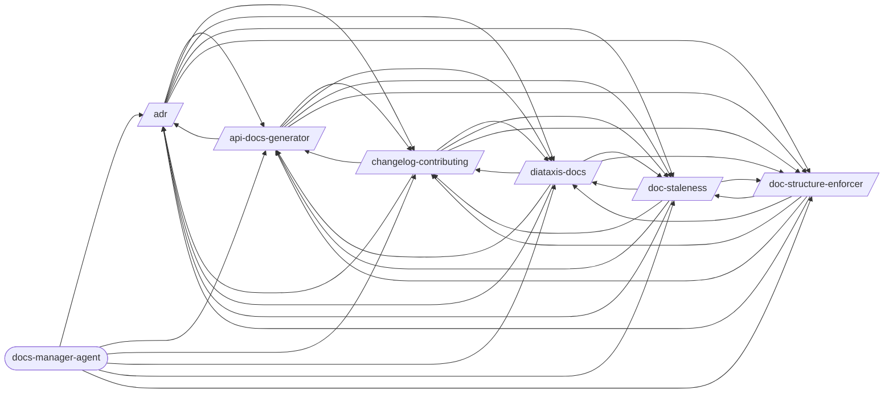

# Documentation

> Documentation generation, structure enforcement, and maintenance.

> Auto-generated by `scripts/generate_workflow_docs.py` | Last updated: 2026-03-21 11:56 UTC

## Flow Diagram

## Skills

| Skill | Version | Description | Calls | Called By |
|-------|---------|-------------|-------|----------|
| `/adr` | 1.0.0 | Create and manage Architecture Decision Records (ADRs). Initialize an ADR dir... | `/api-docs-generator`, `/changelog-contributing`, `/diataxis-docs`, `/doc-staleness`, `/doc-structure-enforcer` | `/api-docs-generator`, `/changelog-contributing`, `/diataxis-docs`, `/doc-staleness`, `/doc-structure-enforcer`, `/docs-manager-agent` |
| `/api-docs-generator` | 1.0.0 | Auto-generate OpenAPI/Swagger docs from code annotations. Supports FastAPI, E... | `/adr`, `/changelog-contributing`, `/diataxis-docs`, `/doc-staleness`, `/doc-structure-enforcer` | `/adr`, `/changelog-contributing`, `/diataxis-docs`, `/doc-staleness`, `/doc-structure-enforcer`, `/docs-manager-agent` |
| `/changelog-contributing` | 1.0.0 | Auto-generate CHANGELOG.md from conventional commits and create a project-spe... | `/adr`, `/api-docs-generator`, `/diataxis-docs`, `/doc-staleness`, `/doc-structure-enforcer` | `/adr`, `/api-docs-generator`, `/diataxis-docs`, `/doc-staleness`, `/doc-structure-enforcer`, `/docs-manager-agent` |
| `/diataxis-docs` | 1.0.0 | Organize project documentation into the Diataxis framework: tutorials, how-to... | `/adr`, `/api-docs-generator`, `/changelog-contributing`, `/doc-staleness`, `/doc-structure-enforcer` | `/adr`, `/api-docs-generator`, `/changelog-contributing`, `/doc-staleness`, `/doc-structure-enforcer`, `/docs-manager-agent` |
| `/doc-staleness` | 1.0.0 | Detect documentation that has drifted from the codebase. Compares docs agains... | `/adr`, `/api-docs-generator`, `/changelog-contributing`, `/diataxis-docs`, `/doc-structure-enforcer` | `/adr`, `/api-docs-generator`, `/changelog-contributing`, `/diataxis-docs`, `/doc-structure-enforcer`, `/docs-manager-agent` |
| `/doc-structure-enforcer` | 1.0.0 | Enforce a stage-based documentation folder structure via config-driven rules.... | `/adr`, `/api-docs-generator`, `/changelog-contributing`, `/diataxis-docs`, `/doc-staleness` | `/adr`, `/api-docs-generator`, `/changelog-contributing`, `/diataxis-docs`, `/doc-staleness`, `/docs-manager-agent` |

## Agents

| Agent | Description | Dispatched By |
|-------|-------------|---------------|
| `docs-manager-agent` | Use this agent for documentation updates — continuation prompts, requirement ... | — |

<!-- MANUAL ANNOTATIONS -->
<!-- Add custom notes below this line. They are preserved on regeneration. -->

<!-- Add custom notes below this line. They are preserved on regeneration. -->
