# Documentation

> Documentation generation, structure enforcement, and maintenance.

> Auto-generated by `scripts/generate_workflow_docs.py` | Last updated: 2026-06-30 16:35 UTC

## Overview

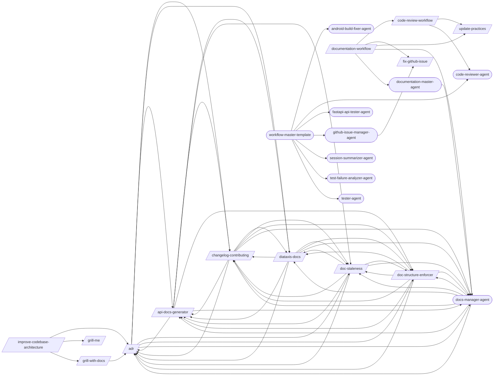

## Detailed Flow

Step-level flow showing gates (diamonds), delegations (dashed), and artifacts (cylinders).

```mermaid
graph TD
    subgraph adr_sub["Adr"]
        adr_s1["Step 1: Parse and Validate Command"]
        adr_s2["Step 2: Initialize ADR Directory (If Needed)"]
        adr_s1 --> adr_s2
        doc_structure_enforcer_ext([/doc-structure-enforcer/])
        adr_s2 -.-> doc_structure_enforcer_ext
        adr_s3["Step 3: Create New ADR (new)"]
        adr_s2 --> adr_s3
        adr_s4["Step 4: List ADRs (list)"]
        adr_s3 --> adr_s4
        adr_s5["Step 5: Supersede or Deprecate (supersede / deprecate)"]
        adr_s4 --> adr_s5
        adr_s6["Step 6: Generate Index (index)"]
        adr_s5 --> adr_s6
        adr_s7{{Step 7: Verify Integrity}}
        adr_s6 --> adr_s7
        api_docs_generator_ext([/api-docs-generator/])
        adr_s7 -.-> api_docs_generator_ext
        changelog_contributing_ext([/changelog-contributing/])
        adr_s7 -.-> changelog_contributing_ext
        diataxis_docs_ext([/diataxis-docs/])
        adr_s7 -.-> diataxis_docs_ext
        doc_staleness_ext([/doc-staleness/])
        adr_s7 -.-> doc_staleness_ext
        adr_s7 -.-> doc_structure_enforcer_ext
        docs_manager_agent_ext((docs-manager-agent))
        adr_s7 -.-> docs_manager_agent_ext
    end

    subgraph api_docs_generator_sub["Api Docs Generator"]
        api_docs_generator_s1["Step 1: Detect API Framework"]
        api_docs_generator_s2["Step 2: Generate or Extract OpenAPI Spec"]
        api_docs_generator_s1 --> api_docs_generator_s2
        api_docs_generator_s3["Step 3: Validate Spec"]
        api_docs_generator_s2 --> api_docs_generator_s3
        api_docs_generator_s4["Step 4: Generate Human-Readable Docs"]
        api_docs_generator_s3 --> api_docs_generator_s4
        api_docs_generator_s5["Step 5: API Versioning Documentation"]
        api_docs_generator_s4 --> api_docs_generator_s5
        api_docs_generator_s6["Step 6: CI Integration"]
        api_docs_generator_s5 --> api_docs_generator_s6
        api_docs_generator_s7{{Step 7: Output Summary}}
        api_docs_generator_s6 --> api_docs_generator_s7
        adr_ext([/adr/])
        api_docs_generator_s7 -.-> adr_ext
        api_docs_generator_s7 -.-> changelog_contributing_ext
        api_docs_generator_s7 -.-> diataxis_docs_ext
        api_docs_generator_s7 -.-> doc_staleness_ext
        api_docs_generator_s7 -.-> doc_structure_enforcer_ext
        api_docs_generator_s7 -.-> docs_manager_agent_ext
    end

    subgraph changelog_contributing_sub["Changelog Contributing"]
        changelog_contributing_s1["Step 1: Detect Commit Convention and Project Context"]
        changelog_contributing_s2["Step 2: Parse Git Log"]
        changelog_contributing_s1 --> changelog_contributing_s2
        changelog_contributing_s3["Step 3: Group and Deduplicate Entries"]
        changelog_contributing_s2 --> changelog_contributing_s3
        changelog_contributing_s4["Step 4: Generate CHANGELOG.md"]
        changelog_contributing_s3 --> changelog_contributing_s4
        changelog_contributing_s5["Step 5: Generate CONTRIBUTING.md"]
        changelog_contributing_s4 --> changelog_contributing_s5
        changelog_contributing_s6["Step 6: CI Integration (Optional)"]
        changelog_contributing_s5 --> changelog_contributing_s6
        changelog_contributing_s7{{Step 7: Report}}
        changelog_contributing_s6 --> changelog_contributing_s7
        changelog_contributing_s7 -.-> adr_ext
        changelog_contributing_s7 -.-> api_docs_generator_ext
        changelog_contributing_s7 -.-> diataxis_docs_ext
        changelog_contributing_s7 -.-> doc_staleness_ext
        changelog_contributing_s7 -.-> doc_structure_enforcer_ext
        changelog_contributing_s7 -.-> docs_manager_agent_ext
    end

    subgraph code_review_workflow_sub["Code Review Workflow"]
        code_review_workflow_s1{{Step 1: INIT}}
        update_practices_ext([/update-practices/])
        code_review_workflow_s1 -.-> update_practices_ext
        code_reviewer_agent_ext((code-reviewer-agent))
        code_review_workflow_s1 -.-> code_reviewer_agent_ext
        security_auditor_agent_ext((security-auditor-agent))
        code_review_workflow_s1 -.-> security_auditor_agent_ext
        code_review_workflow_s1_block[/BLOCK/]
        code_review_workflow_s1 -->|FAILED| code_review_workflow_s1_block
        code_review_workflow_s2{{Step 2: QUALITY_GATES}}
        code_review_workflow_s1 -->|OK| code_review_workflow_s2
        fix_loop_ext([/fix-loop/])
        code_review_workflow_s2 -.-> fix_loop_ext
        review_gate_ext([/review-gate/])
        code_review_workflow_s2 -.-> review_gate_ext
        code_review_workflow_test_results_review_gate_json[("test-results/review-gate.json")]
        code_review_workflow_s2 -->|writes| code_review_workflow_test_results_review_gate_json
        code_review_workflow_s2b{{Step 2b: DEEP_AUDIT (optional, --deep-audit flag)}}
        code_review_workflow_s2 --> code_review_workflow_s2b
        code_review_workflow_s2b -.-> review_gate_ext
        code_review_workflow_s3["Step 3: CREATE_PR"]
        code_review_workflow_s2b --> code_review_workflow_s3
        request_code_review_ext([/request-code-review/])
        code_review_workflow_s3 -.-> request_code_review_ext
        code_review_workflow_s4{{Step 4: HANDLE_FEEDBACK}}
        code_review_workflow_s3 --> code_review_workflow_s4
        receive_code_review_ext([/receive-code-review/])
        code_review_workflow_s4 -.-> receive_code_review_ext
        code_review_workflow_s5{{Step 5: REPORT}}
        code_review_workflow_s4 --> code_review_workflow_s5
        code_review_master_agent_ext((code-review-master-agent))
        code_review_workflow_s5 -.-> code_review_master_agent_ext
        code_review_workflow_test_results_code_review_verdict_json[("test-results/code-review-verdict.json")]
        code_review_workflow_s5 -->|writes| code_review_workflow_test_results_code_review_verdict_json
    end

    subgraph diataxis_docs_sub["Diataxis Docs"]
        diataxis_docs_s1["Step 1: Audit Existing Documentation"]
        diataxis_docs_s2["Step 2: Classify Into Four Categories"]
        diataxis_docs_s1 --> diataxis_docs_s2
        diataxis_docs_s3{{Step 3: Identify Gaps}}
        diataxis_docs_s2 --> diataxis_docs_s3
        diataxis_docs_s4["Step 4: Generate Templates"]
        diataxis_docs_s3 --> diataxis_docs_s4
        diataxis_docs_s5["Step 5: Restructure Docs Directory"]
        diataxis_docs_s4 --> diataxis_docs_s5
        diataxis_docs_s6{{Step 6: Create Index}}
        diataxis_docs_s5 --> diataxis_docs_s6
        diataxis_docs_s6 -.-> adr_ext
        diataxis_docs_s6 -.-> api_docs_generator_ext
        diataxis_docs_s6 -.-> changelog_contributing_ext
        diataxis_docs_s6 -.-> doc_staleness_ext
        diataxis_docs_s6 -.-> doc_structure_enforcer_ext
        diataxis_docs_s6 -.-> docs_manager_agent_ext
    end

    subgraph doc_staleness_sub["Doc Staleness"]
        doc_staleness_s1["Step 1: Identify Documentation Files"]
        doc_staleness_s2["Step 2: Determine Change Window"]
        doc_staleness_s1 --> doc_staleness_s2
        doc_staleness_s3{{Step 3: Extract Documentation References}}
        doc_staleness_s2 --> doc_staleness_s3
        doc_staleness_s4["Step 4: Detect Undocumented Changes"]
        doc_staleness_s3 --> doc_staleness_s4
        doc_staleness_s5["Step 5: Generate Staleness Report"]
        doc_staleness_s4 --> doc_staleness_s5
        doc_staleness_s6{{Step 6: Suggest Fixes}}
        doc_staleness_s5 --> doc_staleness_s6
        doc_staleness_s6 -.-> adr_ext
        doc_staleness_s6 -.-> api_docs_generator_ext
        doc_staleness_s6 -.-> changelog_contributing_ext
        doc_staleness_s6 -.-> diataxis_docs_ext
        doc_staleness_s6 -.-> doc_structure_enforcer_ext
        doc_staleness_s6 -.-> docs_manager_agent_ext
    end

    subgraph doc_structure_enforcer_sub["Doc Structure Enforcer"]
        doc_structure_enforcer_s1["Step 1: Load or Generate Config"]
        doc_structure_enforcer_s2["Step 2: Scan Documentation Files"]
        doc_structure_enforcer_s1 --> doc_structure_enforcer_s2
        doc_structure_enforcer_s3["Step 3: Classify Files"]
        doc_structure_enforcer_s2 --> doc_structure_enforcer_s3
        doc_structure_enforcer_s4["Step 4: Compute Misplacements"]
        doc_structure_enforcer_s3 --> doc_structure_enforcer_s4
        doc_structure_enforcer_s5["Step 5: Report"]
        doc_structure_enforcer_s4 --> doc_structure_enforcer_s5
        doc_structure_enforcer_s6["Step 6: Plan Moves (Enforce Mode Only)"]
        doc_structure_enforcer_s5 --> doc_structure_enforcer_s6
        doc_structure_enforcer_s7["Step 7: Scan References (Enforce Mode Only)"]
        doc_structure_enforcer_s6 --> doc_structure_enforcer_s7
        doc_structure_enforcer_s8{{Step 8: Execute Moves and Update References (Enforce Mode Only)}}
        doc_structure_enforcer_s7 --> doc_structure_enforcer_s8
        doc_structure_enforcer_s8 -.-> adr_ext
        doc_structure_enforcer_s8 -.-> api_docs_generator_ext
        doc_structure_enforcer_s8 -.-> changelog_contributing_ext
        doc_structure_enforcer_s8 -.-> diataxis_docs_ext
        doc_structure_enforcer_s8 -.-> doc_staleness_ext
        doc_structure_enforcer_s8 -.-> docs_manager_agent_ext
    end

    subgraph documentation_workflow_sub["Documentation Workflow"]
        documentation_workflow_s1{{Step 1: INIT}}
        documentation_workflow_s1 -.-> update_practices_ext
        documentation_workflow_s1 -.-> docs_manager_agent_ext
        documentation_workflow_s1_block[/BLOCK/]
        documentation_workflow_s1 -->|FAILED| documentation_workflow_s1_block
        documentation_workflow_s2["Step 2: ADR (skip if scope ∉ {all, adr} OR no architecture decisions detected)"]
        documentation_workflow_s1 -->|OK| documentation_workflow_s2
        documentation_workflow_s3["Step 3: API_DOCS (skip if scope ∉ {all, api} OR no OpenAPI spec)"]
        documentation_workflow_s2 --> documentation_workflow_s3
        documentation_workflow_s4["Step 4: STRUCTURE (skip if scope ∉ {all, structure})"]
        documentation_workflow_s3 --> documentation_workflow_s4
        documentation_workflow_s5{{Step 5: STALENESS (skip if scope ∉ {all, staleness} OR --skip-staleness)}}
        documentation_workflow_s4 --> documentation_workflow_s5
        documentation_workflow_test_results_doc_staleness_json[("test-results/doc-staleness.json")]
        documentation_workflow_s5 -->|writes| documentation_workflow_test_results_doc_staleness_json
        documentation_workflow_s6{{Step 6: REPORT}}
        documentation_workflow_s5 --> documentation_workflow_s6
        code_review_workflow_ext([/code-review-workflow/])
        documentation_workflow_s6 -.-> code_review_workflow_ext
        fix_github_issue_ext([/fix-github-issue/])
        documentation_workflow_s6 -.-> fix_github_issue_ext
        documentation_master_agent_ext((documentation-master-agent))
        documentation_workflow_s6 -.-> documentation_master_agent_ext
        documentation_workflow_test_results_documentation_verdict_json[("test-results/documentation-verdict.json")]
        documentation_workflow_s6 -->|writes| documentation_workflow_test_results_documentation_verdict_json
    end

    subgraph fix_github_issue_sub["Fix Github Issue"]
        fix_github_issue_s1["Step 1: Fetch and Parse Issue"]
        fix_github_issue_s2["Step 2: Explore and Diagnose"]
        fix_github_issue_s1 --> fix_github_issue_s2
        fix_github_issue_s3{{Step 3: Implement and Test}}
        fix_github_issue_s2 --> fix_github_issue_s3
        fix_github_issue_s4["Step 4: Finalize"]
        fix_github_issue_s3 --> fix_github_issue_s4
        fix_github_issue_s4 -.-> fix_loop_ext
        post_fix_pipeline_ext([/post-fix-pipeline/])
        fix_github_issue_s4 -.-> post_fix_pipeline_ext
        serialize_fixes_ext([/serialize-fixes/])
        fix_github_issue_s4 -.-> serialize_fixes_ext
        test_pipeline_ext([/test-pipeline/])
        fix_github_issue_s4 -.-> test_pipeline_ext
        fix_github_issue_s5["Step 5: Summarize"]
        fix_github_issue_s4 --> fix_github_issue_s5
    end

    subgraph grill_me_sub["Grill Me"]
        grill_me_s1["Step 1: Map the decision tree"]
        grill_me_s2["Step 2: Pick the first unresolved branch"]
        grill_me_s1 --> grill_me_s2
        grill_me_s3["Step 3: Read the codebase before asking"]
        grill_me_s2 --> grill_me_s3
        grill_me_s4["Step 4: Ask ONE question with your recommended answer"]
        grill_me_s3 --> grill_me_s4
        grill_me_s5{{Step 5: Wait for the response}}
        grill_me_s4 --> grill_me_s5
        grill_me_s6["Step 6: Update the tree and repeat"]
        grill_me_s5 --> grill_me_s6
        grill_me_s7{{Step 7: Stop when the tree is resolved}}
        grill_me_s6 --> grill_me_s7
    end

    subgraph improve_codebase_architecture_sub["Improve Codebase Architecture"]
        improve_codebase_architecture_s1["Step 1: Explore"]
        grill_with_docs_ext([/grill-with-docs/])
        improve_codebase_architecture_s1 -.-> grill_with_docs_ext
        improve_codebase_architecture_s2["Step 2: Present Candidates as an HTML Report"]
        improve_codebase_architecture_s1 --> improve_codebase_architecture_s2
        improve_codebase_architecture_s3["Step 3: Grilling Loop"]
        improve_codebase_architecture_s2 --> improve_codebase_architecture_s3
        improve_codebase_architecture_s3 -.-> adr_ext
        grill_me_ext([/grill-me/])
        improve_codebase_architecture_s3 -.-> grill_me_ext
        improve_codebase_architecture_s3 -.-> grill_with_docs_ext
    end

    subgraph update_practices_sub["Update Practices"]
        update_practices_s1["Step 1: Read Sync Config"]
        update_practices_s2["Step 2: Fetch Hub Registry + Hub Config Inventory"]
        update_practices_s1 --> update_practices_s2
        update_practices_s3["Step 3: Compare — Patterns"]
        update_practices_s2 --> update_practices_s3
        update_practices_s3b["Step 3b: Compare — Configs (NEW in v1.1.0)"]
        update_practices_s3 --> update_practices_s3b
        update_practices_s4["Step 4: Show Diffs"]
        update_practices_s3b --> update_practices_s4
        update_practices_s5{{Step 5: Apply Updates}}
        update_practices_s4 --> update_practices_s5
        update_practices_s6["Step 6: Report"]
        update_practices_s5 --> update_practices_s6
    end

    adr_s7 ==> api_docs_generator_s1
    adr_s7 ==> changelog_contributing_s1
    adr_s7 ==> diataxis_docs_s1
    adr_s7 ==> doc_staleness_s1
    adr_s2 ==> doc_structure_enforcer_s1
    api_docs_generator_s7 ==> adr_s1
    api_docs_generator_s7 ==> changelog_contributing_s1
    api_docs_generator_s7 ==> diataxis_docs_s1
    api_docs_generator_s7 ==> doc_staleness_s1
    api_docs_generator_s7 ==> doc_structure_enforcer_s1
    changelog_contributing_s7 ==> adr_s1
    changelog_contributing_s7 ==> api_docs_generator_s1
    changelog_contributing_s7 ==> diataxis_docs_s1
    changelog_contributing_s7 ==> doc_staleness_s1
    changelog_contributing_s7 ==> doc_structure_enforcer_s1
    code_review_workflow_s1 ==> update_practices_s1
    diataxis_docs_s6 ==> adr_s1
    diataxis_docs_s6 ==> api_docs_generator_s1
    diataxis_docs_s6 ==> changelog_contributing_s1
    diataxis_docs_s6 ==> doc_staleness_s1
    diataxis_docs_s6 ==> doc_structure_enforcer_s1
    doc_staleness_s6 ==> adr_s1
    doc_staleness_s6 ==> api_docs_generator_s1
    doc_staleness_s6 ==> changelog_contributing_s1
    doc_staleness_s6 ==> diataxis_docs_s1
    doc_staleness_s6 ==> doc_structure_enforcer_s1
    doc_structure_enforcer_s8 ==> adr_s1
    doc_structure_enforcer_s8 ==> api_docs_generator_s1
    doc_structure_enforcer_s8 ==> changelog_contributing_s1
    doc_structure_enforcer_s8 ==> diataxis_docs_s1
    doc_structure_enforcer_s8 ==> doc_staleness_s1
    documentation_workflow_s6 ==> code_review_workflow_s1
    documentation_workflow_s6 ==> fix_github_issue_s1
    documentation_workflow_s1 ==> update_practices_s1
    improve_codebase_architecture_s3 ==> adr_s1
    improve_codebase_architecture_s3 ==> grill_me_s1
```

## Skills

| Skill | Version | Description | Calls | Called By |
|-------|---------|-------------|-------|----------|
| `/adr` | 1.1.0 | Create and manage Architecture Decision Records (ADRs). Initialize an ADR dir... | `/api-docs-generator`, `/changelog-contributing`, `/diataxis-docs`, `/doc-staleness`, `/doc-structure-enforcer`, `/docs-manager-agent` | `/api-docs-generator`, `/changelog-contributing`, `/diataxis-docs`, `/doc-staleness`, `/doc-structure-enforcer`, `/grill-with-docs`, `/improve-codebase-architecture`, `/docs-manager-agent` |
| `/api-docs-generator` | 1.0.0 | Generate OpenAPI/Swagger documentation from code annotations for FastAPI, Exp... | `/adr`, `/changelog-contributing`, `/diataxis-docs`, `/doc-staleness`, `/doc-structure-enforcer`, `/docs-manager-agent` | `/adr`, `/changelog-contributing`, `/diataxis-docs`, `/doc-staleness`, `/doc-structure-enforcer`, `/docs-manager-agent` |
| `/changelog-contributing` | 1.0.0 | Generate CHANGELOG.md from conventional commits and create a project-specific... | `/adr`, `/api-docs-generator`, `/diataxis-docs`, `/doc-staleness`, `/doc-structure-enforcer`, `/docs-manager-agent` | `/adr`, `/api-docs-generator`, `/diataxis-docs`, `/doc-staleness`, `/doc-structure-enforcer`, `/docs-manager-agent` |
| `/code-review-workflow` | 2.3.0 | Run pre-merge quality gates, create PR, and handle review feedback as a skill... | `/update-practices`, `/code-reviewer-agent` | `/documentation-workflow` |
| `/diataxis-docs` | 1.0.0 | Organize project documentation into the Diataxis framework: tutorials, how-to... | `/adr`, `/api-docs-generator`, `/changelog-contributing`, `/doc-staleness`, `/doc-structure-enforcer`, `/docs-manager-agent` | `/adr`, `/api-docs-generator`, `/changelog-contributing`, `/doc-staleness`, `/doc-structure-enforcer`, `/docs-manager-agent` |
| `/doc-staleness` | 1.0.0 | Detect documentation that has drifted from the codebase by comparing docs aga... | `/adr`, `/api-docs-generator`, `/changelog-contributing`, `/diataxis-docs`, `/doc-structure-enforcer`, `/docs-manager-agent` | `/adr`, `/api-docs-generator`, `/changelog-contributing`, `/diataxis-docs`, `/doc-structure-enforcer`, `/docs-manager-agent` |
| `/doc-structure-enforcer` | 1.0.0 | Enforce a stage-based documentation folder structure via config-driven rules.... | `/adr`, `/api-docs-generator`, `/changelog-contributing`, `/diataxis-docs`, `/doc-staleness`, `/docs-manager-agent` | `/adr`, `/api-docs-generator`, `/changelog-contributing`, `/diataxis-docs`, `/doc-staleness`, `/docs-manager-agent` |
| `/documentation-workflow` | 2.1.1 | Orchestrate project documentation maintenance end-to-end as a skill-at-T0 orc... | `/code-review-workflow`, `/fix-github-issue`, `/update-practices`, `/docs-manager-agent`, `/documentation-master-agent` | — |
| `/firebase-ai` | 1.0.2 | Integrate Firebase AI Logic (Gemini API) including setup, text generation, mu... | — | — |
| `/fix-github-issue` | 3.0.0 | Analyze and implement a fix for a specific GitHub Issue. Fetches issue detail... | — | `/documentation-workflow`, `/github-issue-manager-agent` |
| `/grill-me` | 1.0.0 | Audit a plan or design by interviewing the user relentlessly until shared und... | — | `/improve-codebase-architecture` |
| `/grill-with-docs` | 1.0.0 | Run a grilling session that challenges a plan against the project's existing ... | `/adr` | `/improve-codebase-architecture` |
| `/improve-codebase-architecture` | 1.0.0 | Analyze architectural friction and propose deepening opportunities — refactor... | `/adr`, `/grill-me`, `/grill-with-docs` | — |
| `/update-practices` | 1.2.1 | Pull latest best practices from the hub into your project's .claude/ director... | — | `/code-review-workflow`, `/documentation-workflow` |

## Workflow Steps

### Consolidated Step Flow

End-to-end flow across all skills, showing how steps connect via delegations (thick arrows).

```mermaid
graph TD
    subgraph adr_sub["Adr"]
        adr_s1["Parse and Validate Command"]
        adr_s2["Initialize ADR Directory (If Needed)"]
        adr_s1 --> adr_s2
        adr_s3["Create New ADR (new)"]
        adr_s2 --> adr_s3
        adr_s4["List ADRs (list)"]
        adr_s3 --> adr_s4
        adr_s5["Supersede or Deprecate (supersede / deprecate)"]
        adr_s4 --> adr_s5
        adr_s6["Generate Index (index)"]
        adr_s5 --> adr_s6
        adr_s7{{Verify Integrity}}
        adr_s6 --> adr_s7
    end

    subgraph api_docs_generator_sub["Api Docs Generator"]
        api_docs_generator_s1["Detect API Framework"]
        api_docs_generator_s2["Generate or Extract OpenAPI Spec"]
        api_docs_generator_s1 --> api_docs_generator_s2
        api_docs_generator_s3["Validate Spec"]
        api_docs_generator_s2 --> api_docs_generator_s3
        api_docs_generator_s4["Generate Human-Readable Docs"]
        api_docs_generator_s3 --> api_docs_generator_s4
        api_docs_generator_s5["API Versioning Documentation"]
        api_docs_generator_s4 --> api_docs_generator_s5
        api_docs_generator_s6["CI Integration"]
        api_docs_generator_s5 --> api_docs_generator_s6
        api_docs_generator_s7{{Output Summary}}
        api_docs_generator_s6 --> api_docs_generator_s7
    end

    subgraph changelog_contributing_sub["Changelog Contributing"]
        changelog_contributing_s1["Detect Commit Convention and Project Context"]
        changelog_contributing_s2["Parse Git Log"]
        changelog_contributing_s1 --> changelog_contributing_s2
        changelog_contributing_s3["Group and Deduplicate Entries"]
        changelog_contributing_s2 --> changelog_contributing_s3
        changelog_contributing_s4["Generate CHANGELOG.md"]
        changelog_contributing_s3 --> changelog_contributing_s4
        changelog_contributing_s5["Generate CONTRIBUTING.md"]
        changelog_contributing_s4 --> changelog_contributing_s5
        changelog_contributing_s6["CI Integration (Optional)"]
        changelog_contributing_s5 --> changelog_contributing_s6
        changelog_contributing_s7{{Report}}
        changelog_contributing_s6 --> changelog_contributing_s7
    end

    subgraph code_review_workflow_sub["Code Review Workflow"]
        code_review_workflow_s1{{INIT}}
        code_review_workflow_s2{{QUALITY_GATES}}
        code_review_workflow_s1 --> code_review_workflow_s2
        code_review_workflow_s2b{{DEEP_AUDIT (optional, --deep-audit flag)}}
        code_review_workflow_s2 --> code_review_workflow_s2b
        code_review_workflow_s3["CREATE_PR"]
        code_review_workflow_s2b --> code_review_workflow_s3
        code_review_workflow_s4{{HANDLE_FEEDBACK}}
        code_review_workflow_s3 --> code_review_workflow_s4
        code_review_workflow_s5{{REPORT}}
        code_review_workflow_s4 --> code_review_workflow_s5
    end

    subgraph diataxis_docs_sub["Diataxis Docs"]
        diataxis_docs_s1["Audit Existing Documentation"]
        diataxis_docs_s2["Classify Into Four Categories"]
        diataxis_docs_s1 --> diataxis_docs_s2
        diataxis_docs_s3{{Identify Gaps}}
        diataxis_docs_s2 --> diataxis_docs_s3
        diataxis_docs_s4["Generate Templates"]
        diataxis_docs_s3 --> diataxis_docs_s4
        diataxis_docs_s5["Restructure Docs Directory"]
        diataxis_docs_s4 --> diataxis_docs_s5
        diataxis_docs_s6{{Create Index}}
        diataxis_docs_s5 --> diataxis_docs_s6
    end

    subgraph doc_staleness_sub["Doc Staleness"]
        doc_staleness_s1["Identify Documentation Files"]
        doc_staleness_s2["Determine Change Window"]
        doc_staleness_s1 --> doc_staleness_s2
        doc_staleness_s3{{Extract Documentation References}}
        doc_staleness_s2 --> doc_staleness_s3
        doc_staleness_s4["Detect Undocumented Changes"]
        doc_staleness_s3 --> doc_staleness_s4
        doc_staleness_s5["Generate Staleness Report"]
        doc_staleness_s4 --> doc_staleness_s5
        doc_staleness_s6{{Suggest Fixes}}
        doc_staleness_s5 --> doc_staleness_s6
    end

    subgraph doc_structure_enforcer_sub["Doc Structure Enforcer"]
        doc_structure_enforcer_s1["Load or Generate Config"]
        doc_structure_enforcer_s2["Scan Documentation Files"]
        doc_structure_enforcer_s1 --> doc_structure_enforcer_s2
        doc_structure_enforcer_s3["Classify Files"]
        doc_structure_enforcer_s2 --> doc_structure_enforcer_s3
        doc_structure_enforcer_s4["Compute Misplacements"]
        doc_structure_enforcer_s3 --> doc_structure_enforcer_s4
        doc_structure_enforcer_s5["Report"]
        doc_structure_enforcer_s4 --> doc_structure_enforcer_s5
        doc_structure_enforcer_s6["Plan Moves (Enforce Mode Only)"]
        doc_structure_enforcer_s5 --> doc_structure_enforcer_s6
        doc_structure_enforcer_s7["Scan References (Enforce Mode Only)"]
        doc_structure_enforcer_s6 --> doc_structure_enforcer_s7
        doc_structure_enforcer_s8{{Execute Moves and Update References (Enforce Mode Only)}}
        doc_structure_enforcer_s7 --> doc_structure_enforcer_s8
    end

    subgraph documentation_workflow_sub["Documentation Workflow"]
        documentation_workflow_s1{{INIT}}
        documentation_workflow_s2["ADR (skip if scope ∉ {all, adr} OR no architecture decisions detected)"]
        documentation_workflow_s1 --> documentation_workflow_s2
        documentation_workflow_s3["API_DOCS (skip if scope ∉ {all, api} OR no OpenAPI spec)"]
        documentation_workflow_s2 --> documentation_workflow_s3
        documentation_workflow_s4["STRUCTURE (skip if scope ∉ {all, structure})"]
        documentation_workflow_s3 --> documentation_workflow_s4
        documentation_workflow_s5{{STALENESS (skip if scope ∉ {all, staleness} OR --skip-staleness)}}
        documentation_workflow_s4 --> documentation_workflow_s5
        documentation_workflow_s6{{REPORT}}
        documentation_workflow_s5 --> documentation_workflow_s6
    end

    subgraph fix_github_issue_sub["Fix Github Issue"]
        fix_github_issue_s1["Fetch and Parse Issue"]
        fix_github_issue_s2["Explore and Diagnose"]
        fix_github_issue_s1 --> fix_github_issue_s2
        fix_github_issue_s3{{Implement and Test}}
        fix_github_issue_s2 --> fix_github_issue_s3
        fix_github_issue_s4["Finalize"]
        fix_github_issue_s3 --> fix_github_issue_s4
        fix_github_issue_s5["Summarize"]
        fix_github_issue_s4 --> fix_github_issue_s5
    end

    subgraph grill_me_sub["Grill Me"]
        grill_me_s1["Map the decision tree"]
        grill_me_s2["Pick the first unresolved branch"]
        grill_me_s1 --> grill_me_s2
        grill_me_s3["Read the codebase before asking"]
        grill_me_s2 --> grill_me_s3
        grill_me_s4["Ask ONE question with your recommended answer"]
        grill_me_s3 --> grill_me_s4
        grill_me_s5{{Wait for the response}}
        grill_me_s4 --> grill_me_s5
        grill_me_s6["Update the tree and repeat"]
        grill_me_s5 --> grill_me_s6
        grill_me_s7{{Stop when the tree is resolved}}
        grill_me_s6 --> grill_me_s7
    end

    subgraph grill_with_docs_sub["Grill With Docs"]
        grill_with_docs_s1["Locate the Domain Model"]
        grill_with_docs_s2{{Grill — Single-Question Loop}}
        grill_with_docs_s1 --> grill_with_docs_s2
    end

    subgraph improve_codebase_architecture_sub["Improve Codebase Architecture"]
        improve_codebase_architecture_s1["Explore"]
        improve_codebase_architecture_s2["Present Candidates as an HTML Report"]
        improve_codebase_architecture_s1 --> improve_codebase_architecture_s2
        improve_codebase_architecture_s3["Grilling Loop"]
        improve_codebase_architecture_s2 --> improve_codebase_architecture_s3
    end

    subgraph update_practices_sub["Update Practices"]
        update_practices_s1["Read Sync Config"]
        update_practices_s2["Fetch Hub Registry + Hub Config Inventory"]
        update_practices_s1 --> update_practices_s2
        update_practices_s3["Compare — Patterns"]
        update_practices_s2 --> update_practices_s3
        update_practices_s3b["Compare — Configs (NEW in v1.1.0)"]
        update_practices_s3 --> update_practices_s3b
        update_practices_s4["Show Diffs"]
        update_practices_s3b --> update_practices_s4
        update_practices_s5{{Apply Updates}}
        update_practices_s4 --> update_practices_s5
        update_practices_s6["Report"]
        update_practices_s5 --> update_practices_s6
    end

    adr_s2 ==> doc_structure_enforcer_s1
    adr_s7 ==> api_docs_generator_s1
    adr_s7 ==> changelog_contributing_s1
    adr_s7 ==> diataxis_docs_s1
    adr_s7 ==> doc_staleness_s1
    adr_s7 ==> doc_structure_enforcer_s1
    api_docs_generator_s7 ==> adr_s1
    api_docs_generator_s7 ==> changelog_contributing_s1
    api_docs_generator_s7 ==> diataxis_docs_s1
    api_docs_generator_s7 ==> doc_staleness_s1
    api_docs_generator_s7 ==> doc_structure_enforcer_s1
    changelog_contributing_s7 ==> adr_s1
    changelog_contributing_s7 ==> api_docs_generator_s1
    changelog_contributing_s7 ==> diataxis_docs_s1
    changelog_contributing_s7 ==> doc_staleness_s1
    changelog_contributing_s7 ==> doc_structure_enforcer_s1
    code_review_workflow_s1 ==> update_practices_s1
    diataxis_docs_s6 ==> adr_s1
    diataxis_docs_s6 ==> api_docs_generator_s1
    diataxis_docs_s6 ==> changelog_contributing_s1
    diataxis_docs_s6 ==> doc_staleness_s1
    diataxis_docs_s6 ==> doc_structure_enforcer_s1
    doc_staleness_s6 ==> adr_s1
    doc_staleness_s6 ==> api_docs_generator_s1
    doc_staleness_s6 ==> changelog_contributing_s1
    doc_staleness_s6 ==> diataxis_docs_s1
    doc_staleness_s6 ==> doc_structure_enforcer_s1
    doc_structure_enforcer_s8 ==> adr_s1
    doc_structure_enforcer_s8 ==> api_docs_generator_s1
    doc_structure_enforcer_s8 ==> changelog_contributing_s1
    doc_structure_enforcer_s8 ==> diataxis_docs_s1
    doc_structure_enforcer_s8 ==> doc_staleness_s1
    documentation_workflow_s1 ==> update_practices_s1
    documentation_workflow_s6 ==> code_review_workflow_s1
    documentation_workflow_s6 ==> fix_github_issue_s1
    grill_with_docs_s2 ==> adr_s1
    improve_codebase_architecture_s1 ==> grill_with_docs_s1
    improve_codebase_architecture_s3 ==> adr_s1
    improve_codebase_architecture_s3 ==> grill_me_s1
    improve_codebase_architecture_s3 ==> grill_with_docs_s1
```

### Entry Points

Double-bordered nodes are user-facing entry points (no incoming references). Rounded nodes are agents.

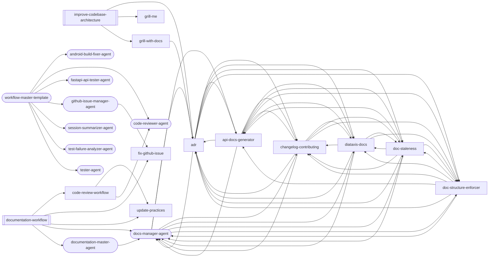

### adr

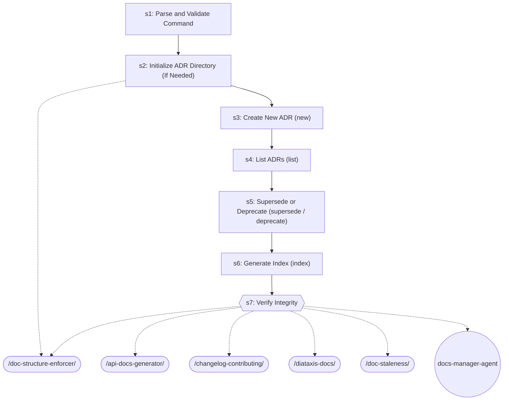

| Step | Title | Delegates To | Artifacts | Gates/Decisions |
|------|-------|-------------|-----------|----------------|
| 1 | Parse and Validate Command | — | — | decision |
| 2 | Initialize ADR Directory (If Needed) | `/doc-structure-enforcer` | — | decision |
| 3 | Create New ADR (new) | — | — | — |
| 4 | List ADRs (list) | — | — | — |
| 5 | Supersede or Deprecate (supersede / deprecate) | — | — | — |
| 6 | Generate Index (index) | — | — | — |
| 7 | Verify Integrity | `/api-docs-generator`, `/changelog-contributing`, `/diataxis-docs`, `/doc-staleness`, `/doc-structure-enforcer`, `docs-manager-agent` | — | gate |

### api-docs-generator


| Step | Title | Delegates To | Artifacts | Gates/Decisions |
|------|-------|-------------|-----------|----------------|
| 1 | Detect API Framework | — | — | decision |
| 2 | Generate or Extract OpenAPI Spec | — | — | — |
| 3 | Validate Spec | — | — | — |
| 4 | Generate Human-Readable Docs | — | — | — |
| 5 | API Versioning Documentation | — | — | — |
| 6 | CI Integration | — | — | — |
| 7 | Output Summary | `/adr`, `/changelog-contributing`, `/diataxis-docs`, `/doc-staleness`, `/doc-structure-enforcer`, `docs-manager-agent` | — | gate |

### changelog-contributing

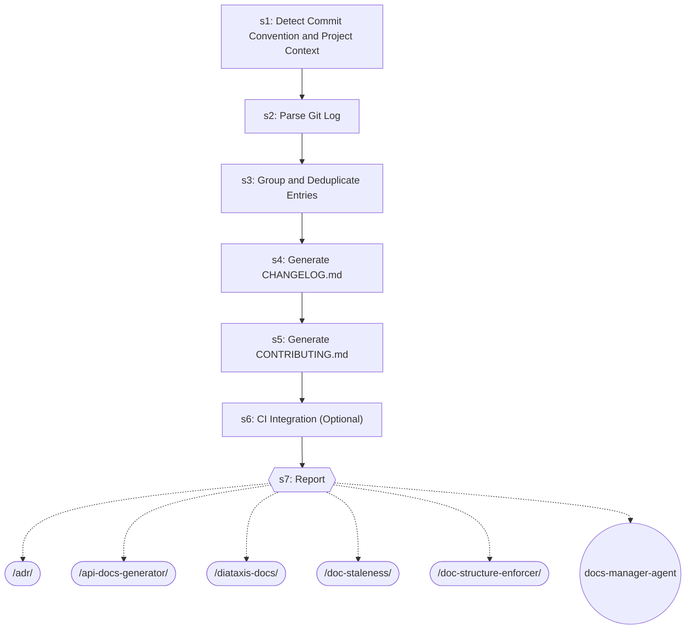

| Step | Title | Delegates To | Artifacts | Gates/Decisions |
|------|-------|-------------|-----------|----------------|
| 1 | Detect Commit Convention and Project Context | — | — | — |
| 2 | Parse Git Log | — | — | — |
| 3 | Group and Deduplicate Entries | — | — | — |
| 4 | Generate CHANGELOG.md | — | — | decision |
| 5 | Generate CONTRIBUTING.md | — | — | — |
| 6 | CI Integration (Optional) | — | — | — |
| 7 | Report | `/adr`, `/api-docs-generator`, `/diataxis-docs`, `/doc-staleness`, `/doc-structure-enforcer`, `docs-manager-agent` | — | gate |

### code-review-workflow

```mermaid
graph TD
    s1{{s1: INIT}}
    update_practices_ext([/update-practices/])
    s1 -.-> update_practices_ext
    code_reviewer_agent_ext((code-reviewer-agent))
    s1 -.-> code_reviewer_agent_ext
    security_auditor_agent_ext((security-auditor-agent))
    s1 -.-> security_auditor_agent_ext
    s1_block[/BLOCK/]
    s1 -->|FAILED| s1_block
    s2{{s2: QUALITY_GATES}}
    s1 -->|OK| s2
    fix_loop_ext([/fix-loop/])
    s2 -.-> fix_loop_ext
    review_gate_ext([/review-gate/])
    s2 -.-> review_gate_ext
    s2b{{s2b: DEEP_AUDIT (optional, --deep-audit flag)}}
    s2 --> s2b
    review_gate_ext([/review-gate/])
    s2b -.-> review_gate_ext
    s3["s3: CREATE_PR"]
    s2b --> s3
    request_code_review_ext([/request-code-review/])
    s3 -.-> request_code_review_ext
    s4{{s4: HANDLE_FEEDBACK}}
    s3 --> s4
    receive_code_review_ext([/receive-code-review/])
    s4 -.-> receive_code_review_ext
    s5{{s5: REPORT}}
    s4 --> s5
    code_review_master_agent_ext((code-review-master-agent))
    s5 -.-> code_review_master_agent_ext
```

| Step | Title | Delegates To | Artifacts | Gates/Decisions |
|------|-------|-------------|-----------|----------------|
| 1 | INIT | `/update-practices`, `code-reviewer-agent`, `security-auditor-agent` | — | gate, decision, BLOCK |
| 2 | QUALITY_GATES | `/fix-loop`, `/review-gate` | → `test-results/review-gate.json` | gate |
| 2b | DEEP_AUDIT (optional, --deep-audit flag) | `/review-gate` | — | gate, decision |
| 3 | CREATE_PR | `/request-code-review` | — | decision |
| 4 | HANDLE_FEEDBACK | `/receive-code-review` | — | gate |
| 5 | REPORT | `code-review-master-agent` | → `test-results/code-review-verdict.json` | gate, decision |

### diataxis-docs

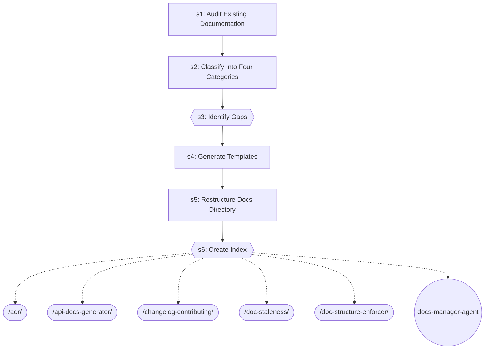

| Step | Title | Delegates To | Artifacts | Gates/Decisions |
|------|-------|-------------|-----------|----------------|
| 1 | Audit Existing Documentation | — | — | — |
| 2 | Classify Into Four Categories | — | — | — |
| 3 | Identify Gaps | — | — | gate |
| 4 | Generate Templates | — | — | — |
| 5 | Restructure Docs Directory | — | — | — |
| 6 | Create Index | `/adr`, `/api-docs-generator`, `/changelog-contributing`, `/doc-staleness`, `/doc-structure-enforcer`, `docs-manager-agent` | — | gate |

### doc-staleness

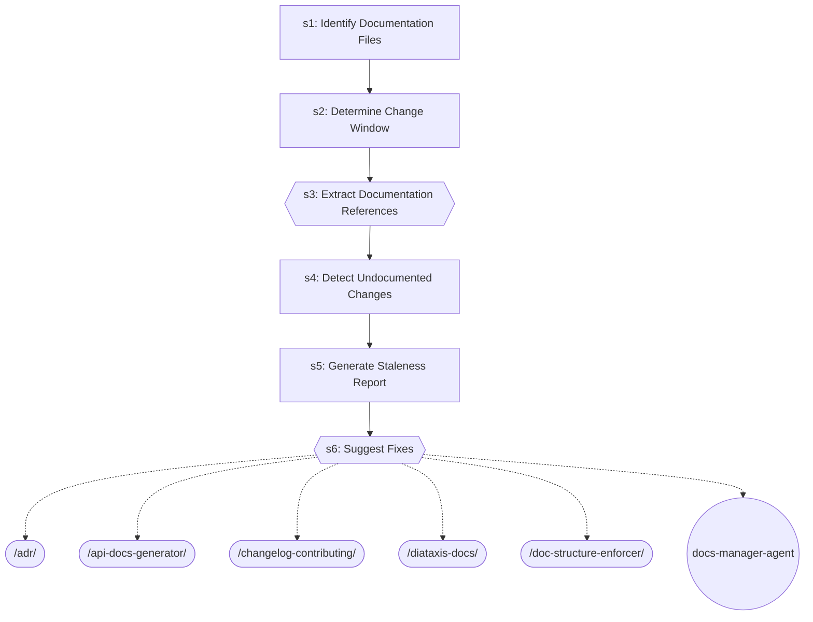

| Step | Title | Delegates To | Artifacts | Gates/Decisions |
|------|-------|-------------|-----------|----------------|
| 1 | Identify Documentation Files | — | — | — |
| 2 | Determine Change Window | — | — | — |
| 3 | Extract Documentation References | — | — | gate |
| 4 | Detect Undocumented Changes | — | — | — |
| 5 | Generate Staleness Report | — | — | — |
| 6 | Suggest Fixes | `/adr`, `/api-docs-generator`, `/changelog-contributing`, `/diataxis-docs`, `/doc-structure-enforcer`, `docs-manager-agent` | — | gate |

### doc-structure-enforcer

```mermaid
graph TD
    s1["s1: Load or Generate Config"]
    s2["s2: Scan Documentation Files"]
    s1 --> s2
    s3["s3: Classify Files"]
    s2 --> s3
    s4["s4: Compute Misplacements"]
    s3 --> s4
    s5["s5: Report"]
    s4 --> s5
    s6["s6: Plan Moves (Enforce Mode Only)"]
    s5 --> s6
    s7["s7: Scan References (Enforce Mode Only)"]
    s6 --> s7
    s8{{s8: Execute Moves and Update References (Enforce Mode Only)}}
    s7 --> s8
    adr_ext([/adr/])
    s8 -.-> adr_ext
    api_docs_generator_ext([/api-docs-generator/])
    s8 -.-> api_docs_generator_ext
    changelog_contributing_ext([/changelog-contributing/])
    s8 -.-> changelog_contributing_ext
    diataxis_docs_ext([/diataxis-docs/])
    s8 -.-> diataxis_docs_ext
    doc_staleness_ext([/doc-staleness/])
    s8 -.-> doc_staleness_ext
    docs_manager_agent_ext((docs-manager-agent))
    s8 -.-> docs_manager_agent_ext
```

| Step | Title | Delegates To | Artifacts | Gates/Decisions |
|------|-------|-------------|-----------|----------------|
| 1 | Load or Generate Config | — | — | decision |
| 2 | Scan Documentation Files | — | — | — |
| 3 | Classify Files | — | — | — |
| 4 | Compute Misplacements | — | — | — |
| 5 | Report | — | — | — |
| 6 | Plan Moves (Enforce Mode Only) | — | — | decision |
| 7 | Scan References (Enforce Mode Only) | — | — | — |
| 8 | Execute Moves and Update References (Enforce Mode Only) | `/adr`, `/api-docs-generator`, `/changelog-contributing`, `/diataxis-docs`, `/doc-staleness`, `docs-manager-agent` | — | gate, decision |

### documentation-workflow

```mermaid
graph TD
    s1{{s1: INIT}}
    update_practices_ext([/update-practices/])
    s1 -.-> update_practices_ext
    docs_manager_agent_ext((docs-manager-agent))
    s1 -.-> docs_manager_agent_ext
    s1_block[/BLOCK/]
    s1 -->|FAILED| s1_block
    s2["s2: ADR (skip if scope ∉ {all, adr} OR no architecture decisions detected)"]
    s1 -->|OK| s2
    s3["s3: API_DOCS (skip if scope ∉ {all, api} OR no OpenAPI spec)"]
    s2 --> s3
    s4["s4: STRUCTURE (skip if scope ∉ {all, structure})"]
    s3 --> s4
    s5{{s5: STALENESS (skip if scope ∉ {all, staleness} OR --skip-staleness)}}
    s4 --> s5
    s6{{s6: REPORT}}
    s5 --> s6
    code_review_workflow_ext([/code-review-workflow/])
    s6 -.-> code_review_workflow_ext
    fix_github_issue_ext([/fix-github-issue/])
    s6 -.-> fix_github_issue_ext
    documentation_master_agent_ext((documentation-master-agent))
    s6 -.-> documentation_master_agent_ext
```

| Step | Title | Delegates To | Artifacts | Gates/Decisions |
|------|-------|-------------|-----------|----------------|
| 1 | INIT | `/update-practices`, `docs-manager-agent` | — | gate, decision, BLOCK |
| 2 | ADR (skip if scope ∉ {all, adr} OR no architecture decisions detected) | — | — | — |
| 3 | API_DOCS (skip if scope ∉ {all, api} OR no OpenAPI spec) | — | — | — |
| 4 | STRUCTURE (skip if scope ∉ {all, structure}) | — | — | decision |
| 5 | STALENESS (skip if scope ∉ {all, staleness} OR --skip-staleness) | — | → `test-results/doc-staleness.json` | gate |
| 6 | REPORT | `/code-review-workflow`, `/fix-github-issue`, `documentation-master-agent` | → `test-results/documentation-verdict.json` | gate, decision |

### fix-github-issue

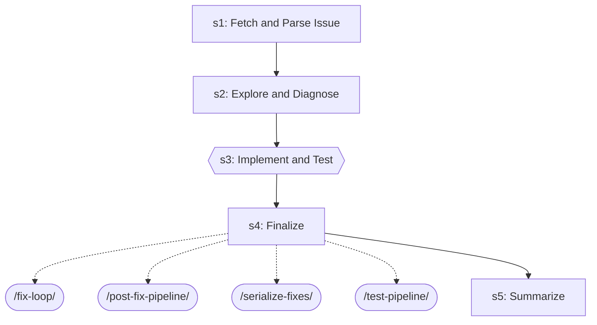

| Step | Title | Delegates To | Artifacts | Gates/Decisions |
|------|-------|-------------|-----------|----------------|
| 1 | Fetch and Parse Issue | — | — | — |
| 2 | Explore and Diagnose | — | — | — |
| 3 | Implement and Test | — | — | gate, decision |
| 4 | Finalize | `/fix-loop`, `/post-fix-pipeline`, `/serialize-fixes`, `/test-pipeline` | — | — |
| 5 | Summarize | — | — | decision |

### grill-me

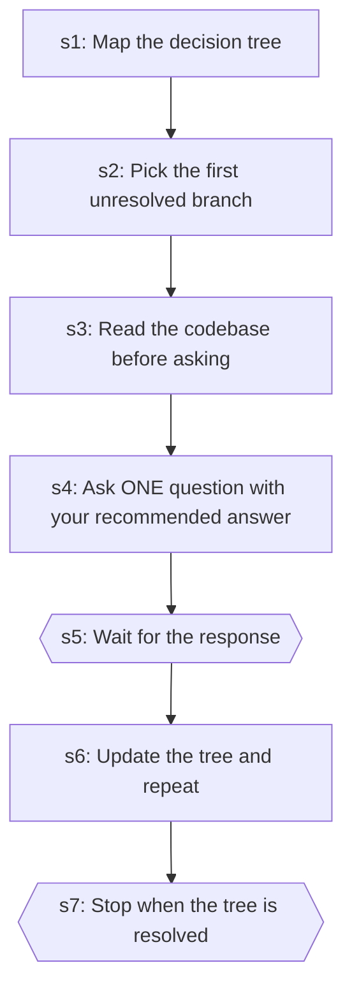

| Step | Title | Delegates To | Artifacts | Gates/Decisions |
|------|-------|-------------|-----------|----------------|
| 1 | Map the decision tree | — | — | — |
| 2 | Pick the first unresolved branch | — | — | — |
| 3 | Read the codebase before asking | — | — | — |
| 4 | Ask ONE question with your recommended answer | — | — | — |
| 5 | Wait for the response | — | — | gate |
| 6 | Update the tree and repeat | — | — | — |
| 7 | Stop when the tree is resolved | — | — | gate |

### grill-with-docs

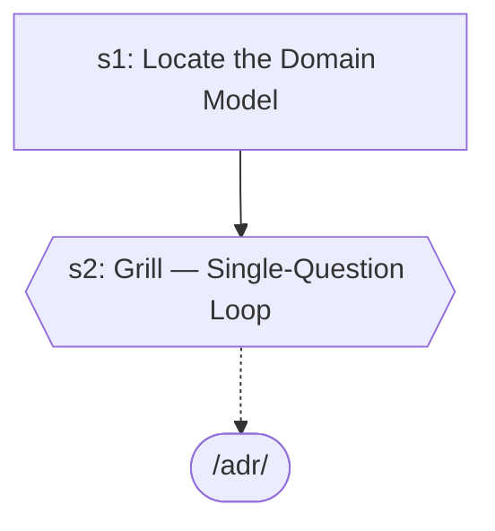

| Step | Title | Delegates To | Artifacts | Gates/Decisions |
|------|-------|-------------|-----------|----------------|
| 1 | Locate the Domain Model | — | — | decision |
| 2 | Grill — Single-Question Loop | `/adr` | — | gate, decision |

### improve-codebase-architecture

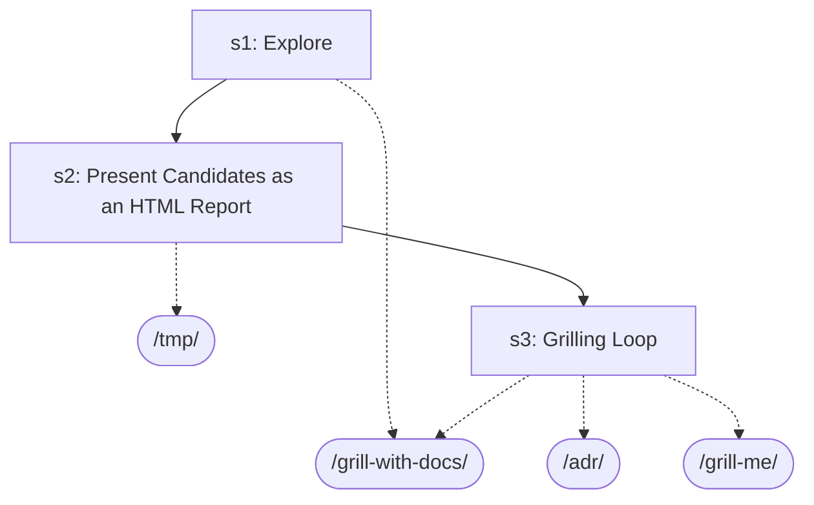

| Step | Title | Delegates To | Artifacts | Gates/Decisions |
|------|-------|-------------|-----------|----------------|
| 1 | Explore | `/grill-with-docs` | — | decision |
| 2 | Present Candidates as an HTML Report | `/tmp` | — | decision |
| 3 | Grilling Loop | `/adr`, `/grill-me`, `/grill-with-docs` | — | decision |

### update-practices

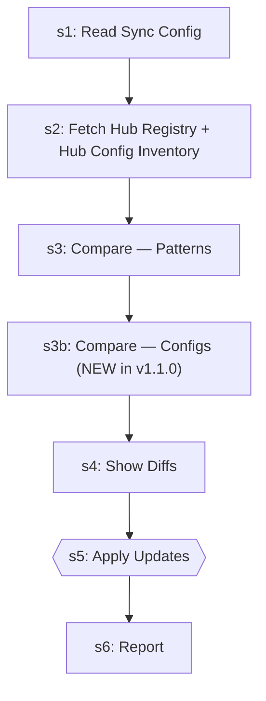

| Step | Title | Delegates To | Artifacts | Gates/Decisions |
|------|-------|-------------|-----------|----------------|
| 1 | Read Sync Config | — | — | decision |
| 2 | Fetch Hub Registry + Hub Config Inventory | — | — | — |
| 3 | Compare — Patterns | — | — | decision |
| 3b | Compare — Configs (NEW in v1.1.0) | — | — | decision |
| 4 | Show Diffs | — | — | — |
| 5 | Apply Updates | — | — | gate, decision |
| 6 | Report | — | — | — |


## Agents

| Agent | Description | Dispatched By |
|-------|-------------|---------------|
| `android-build-fixer-agent` | Use proactively to diagnose and fix Android Gradle build failures. Spawn auto... | `/workflow-master-template` |
| `code-reviewer-agent` | Use proactively to review recently changed files for code quality, type safet... | `/code-review-workflow`, `/workflow-master-template` |
| `docs-manager-agent` | Use this agent for documentation updates — continuation prompts, requirement ... | `/adr`, `/api-docs-generator`, `/changelog-contributing`, `/diataxis-docs`, `/doc-staleness`, `/doc-structure-enforcer`, `/documentation-workflow`, `/documentation-master-agent` |
| `documentation-master-agent` | DEPRECATED 2026-04-25 (Phase 3.5 of subagent-dispatch-platform-limit remediat... | `/documentation-workflow` |
| `fastapi-api-tester-agent` | Use this agent when you need to test FastAPI backend endpoints, validate API ... | `/workflow-master-template` |
| `github-issue-manager-agent` | Use proactively to create consolidated GitHub Issues for test failures from t... | `/workflow-master-template` |
| `session-summarizer-agent` | Use proactively to auto-generate session summary updates at session end. Spaw... | `/workflow-master-template` |
| `test-failure-analyzer-agent` | Use proactively to diagnose test failures — reads test output, classifies by ... | `/workflow-master-template` |
| `tester-agent` | Senior QA engineer specializing in comprehensive testing and quality assuranc... | `/workflow-master-template` |
| `workflow-master-template` | Shared orchestration protocol reference for workflow orchestrators in core/.c... | — |

## Cross-Workflow Connections

**Outgoing** (this workflow feeds into):
- `code-review-master-agent` (agent)
- `contract-test` (skill)
- `create-github-issue` (skill)
- `development-loop` (skill)
- `e2e-visual-run` (skill)
- `fix-loop` (skill)
- `post-fix-pipeline` (skill)
- `receive-code-review` (skill)
- `request-code-review` (skill)
- `review-gate` (skill)
- `security-auditor-agent` (agent)
- `serialize-fixes` (skill)
- `test-healer-agent` (agent)
- `test-pipeline` (skill)

**Incoming** (fed by):
- `agent-orchestration` (rule)
- `android-run-e2e` (skill)
- `anthropic-agent-orchestration-guide` (skill)
- `anthropic-multi-agent-research-system-skill` (skill)
- `apply-selections` (skill)
- `auto-verify` (skill)
- `code-review-master-agent` (agent)
- `create-github-issue` (skill)
- `debugging-loop` (skill)
- `debugging-loop-master-agent` (agent)
- `decision-authority` (rule)
- `development-loop` (skill)
- `e2e-visual-run` (skill)
- `engineering-roles` (rule)
- `fix-loop` (skill)
- `git-branch-lifecycle` (skill)
- `karpathy-advisor` (skill)
- `karpathy-advisor-agent` (agent)
- `learning-self-improvement` (skill)
- `learning-self-improvement-master-agent` (agent)
- `loop-engineering` (skill)
- `pattern-structure` (rule)
- `post-fix-pipeline` (skill)
- `prompt-auto-enhance` (rule)
- `security-auditor-agent` (agent)
- `session-continuity` (skill)
- `session-continuity-master-agent` (agent)
- `skill-authoring-workflow` (skill)
- `skill-factory` (skill)
- `ssot-audit` (skill)
- `test-healer-agent` (agent)
- `test-pipeline` (skill)
- `testing` (rule)
- `to-prd` (skill)
- `verify-screenshots` (skill)
- `visual-inspector-agent` (agent)
- `zoom-out` (skill)

<!-- MANUAL ANNOTATIONS -->
<!-- Add custom notes below this line. They are preserved on regeneration. -->
