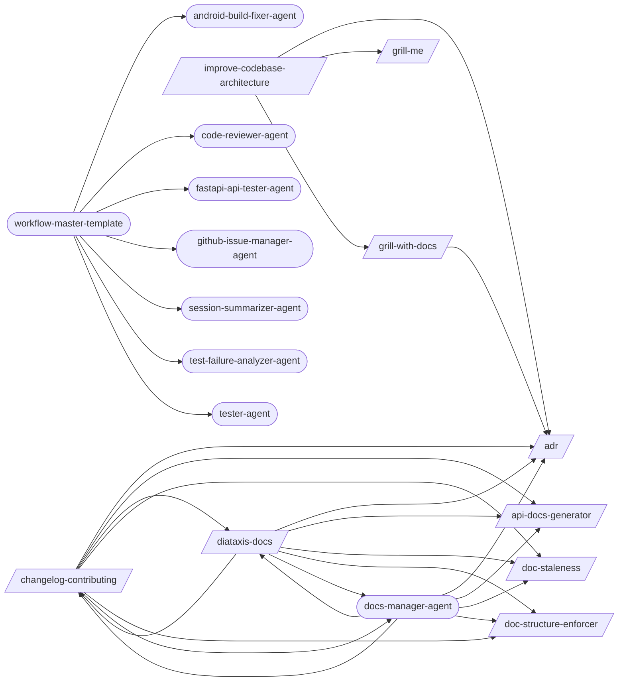
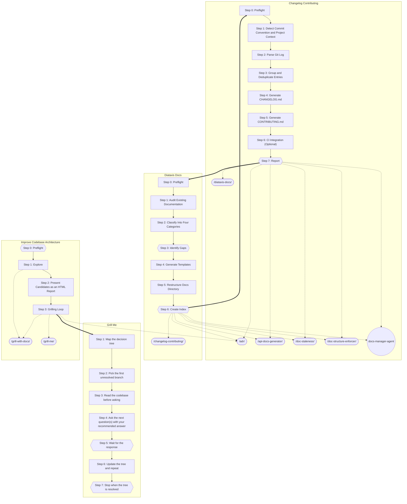
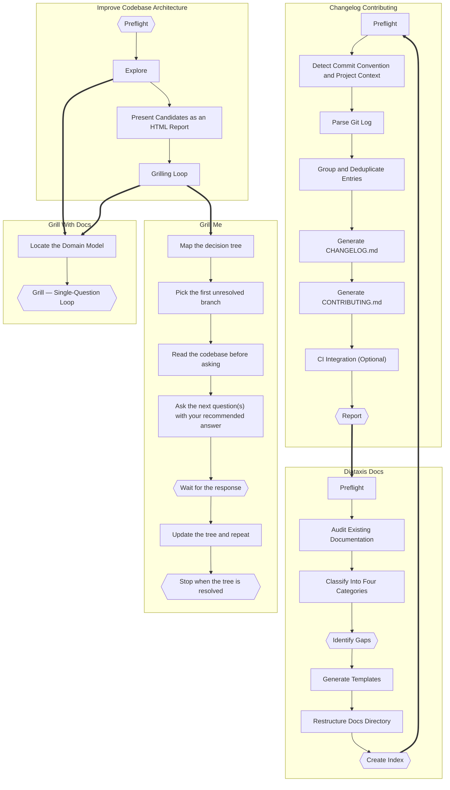
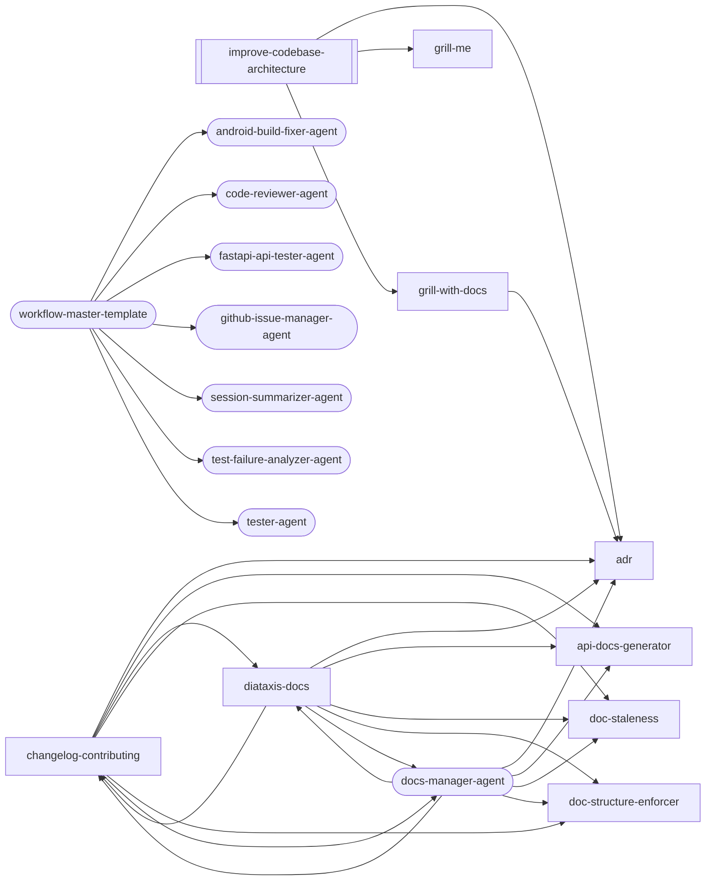
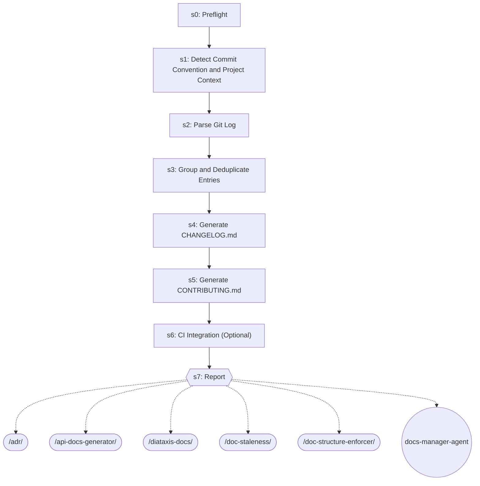
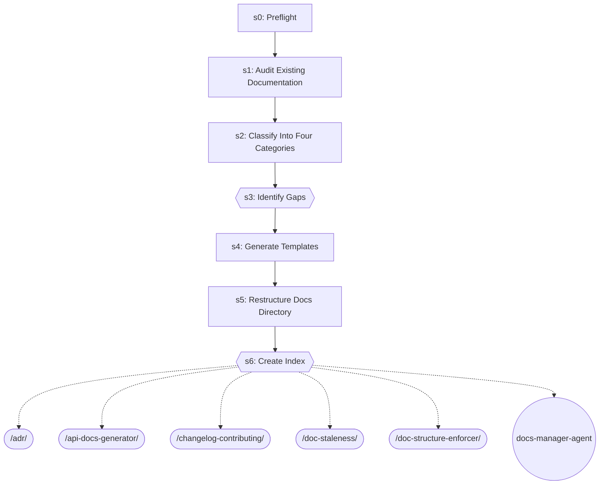
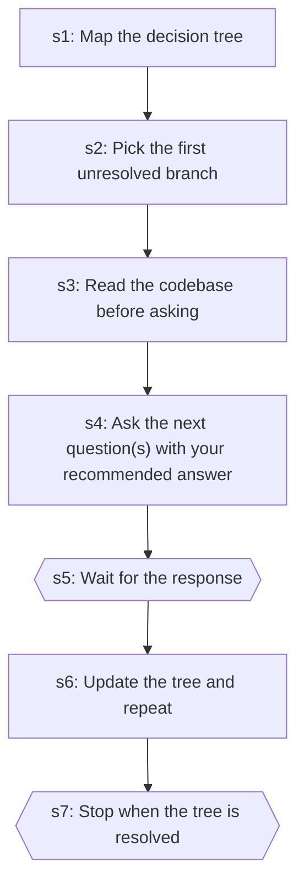
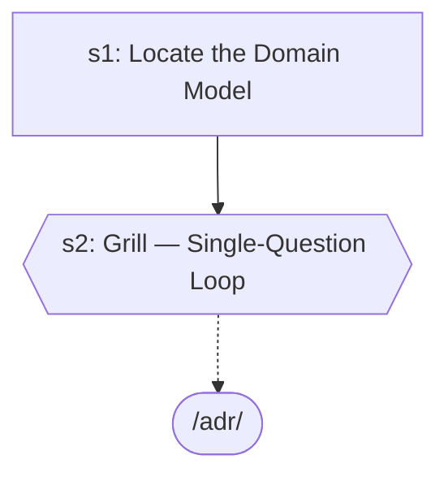
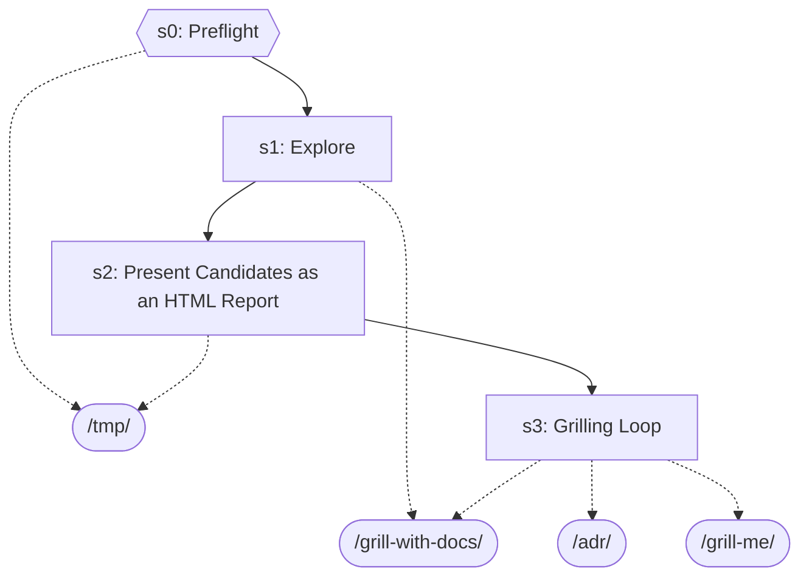

# Documentation

> Documentation generation, structure enforcement, and maintenance.

> Auto-generated by `scripts/generate_workflow_docs.py` | Last updated: 2026-08-27 15:44 UTC

## Overview

```mermaid
graph LR
    adr[/adr/]
    api_docs_generator[/api-docs-generator/]
    changelog_contributing[/changelog-contributing/]
    diataxis_docs[/diataxis-docs/]
    doc_staleness[/doc-staleness/]
    doc_structure_enforcer[/doc-structure-enforcer/]
    grill_me[/grill-me/]
    grill_with_docs[/grill-with-docs/]
    improve_codebase_architecture[/improve-codebase-architecture/]
    android_build_fixer_agent([android-build-fixer-agent])
    code_reviewer_agent([code-reviewer-agent])
    docs_manager_agent([docs-manager-agent])
    fastapi_api_tester_agent([fastapi-api-tester-agent])
    github_issue_manager_agent([github-issue-manager-agent])
    session_summarizer_agent([session-summarizer-agent])
    test_failure_analyzer_agent([test-failure-analyzer-agent])
    tester_agent([tester-agent])
    workflow_master_template([workflow-master-template])
    changelog_contributing --> adr
    changelog_contributing --> api_docs_generator
    changelog_contributing --> diataxis_docs
    changelog_contributing --> doc_staleness
    changelog_contributing --> doc_structure_enforcer
    changelog_contributing --> docs_manager_agent
    diataxis_docs --> adr
    diataxis_docs --> api_docs_generator
    diataxis_docs --> changelog_contributing
    diataxis_docs --> doc_staleness
    diataxis_docs --> doc_structure_enforcer
    diataxis_docs --> docs_manager_agent
    grill_with_docs --> adr
    improve_codebase_architecture --> adr
    improve_codebase_architecture --> grill_me
    improve_codebase_architecture --> grill_with_docs
    docs_manager_agent --> adr
    docs_manager_agent --> api_docs_generator
    docs_manager_agent --> changelog_contributing
    docs_manager_agent --> diataxis_docs
    docs_manager_agent --> doc_staleness
    docs_manager_agent --> doc_structure_enforcer
    workflow_master_template --> android_build_fixer_agent
    workflow_master_template --> code_reviewer_agent
    workflow_master_template --> fastapi_api_tester_agent
    workflow_master_template --> github_issue_manager_agent
    workflow_master_template --> session_summarizer_agent
    workflow_master_template --> test_failure_analyzer_agent
    workflow_master_template --> tester_agent
```

## Detailed Flow

Step-level flow showing gates (diamonds), delegations (dashed), and artifacts (cylinders).

```mermaid
graph TD
    subgraph changelog_contributing_sub["Changelog Contributing"]
        changelog_contributing_s0["Step 0: Preflight"]
        changelog_contributing_s1["Step 1: Detect Commit Convention and Project Context"]
        changelog_contributing_s0 --> changelog_contributing_s1
        changelog_contributing_s2["Step 2: Parse Git Log"]
        changelog_contributing_s1 --> changelog_contributing_s2
        changelog_contributing_s3["Step 3: Group and Deduplicate Entries"]
        changelog_contributing_s2 --> changelog_contributing_s3
        changelog_contributing_s4["Step 4: Generate CHANGELOG.md"]
        changelog_contributing_s3 --> changelog_contributing_s4
        changelog_contributing_s5["Step 5: Generate CONTRIBUTING.md"]
        changelog_contributing_s4 --> changelog_contributing_s5
        changelog_contributing_s6["Step 6: CI Integration (Optional)"]
        changelog_contributing_s5 --> changelog_contributing_s6
        changelog_contributing_s7{{Step 7: Report}}
        changelog_contributing_s6 --> changelog_contributing_s7
        adr_ext([/adr/])
        changelog_contributing_s7 -.-> adr_ext
        api_docs_generator_ext([/api-docs-generator/])
        changelog_contributing_s7 -.-> api_docs_generator_ext
        diataxis_docs_ext([/diataxis-docs/])
        changelog_contributing_s7 -.-> diataxis_docs_ext
        doc_staleness_ext([/doc-staleness/])
        changelog_contributing_s7 -.-> doc_staleness_ext
        doc_structure_enforcer_ext([/doc-structure-enforcer/])
        changelog_contributing_s7 -.-> doc_structure_enforcer_ext
        docs_manager_agent_ext((docs-manager-agent))
        changelog_contributing_s7 -.-> docs_manager_agent_ext
    end

    subgraph diataxis_docs_sub["Diataxis Docs"]
        diataxis_docs_s0["Step 0: Preflight"]
        diataxis_docs_s1["Step 1: Audit Existing Documentation"]
        diataxis_docs_s0 --> diataxis_docs_s1
        diataxis_docs_s2["Step 2: Classify Into Four Categories"]
        diataxis_docs_s1 --> diataxis_docs_s2
        diataxis_docs_s3{{Step 3: Identify Gaps}}
        diataxis_docs_s2 --> diataxis_docs_s3
        diataxis_docs_s4["Step 4: Generate Templates"]
        diataxis_docs_s3 --> diataxis_docs_s4
        diataxis_docs_s5["Step 5: Restructure Docs Directory"]
        diataxis_docs_s4 --> diataxis_docs_s5
        diataxis_docs_s6{{Step 6: Create Index}}
        diataxis_docs_s5 --> diataxis_docs_s6
        diataxis_docs_s6 -.-> adr_ext
        diataxis_docs_s6 -.-> api_docs_generator_ext
        changelog_contributing_ext([/changelog-contributing/])
        diataxis_docs_s6 -.-> changelog_contributing_ext
        diataxis_docs_s6 -.-> doc_staleness_ext
        diataxis_docs_s6 -.-> doc_structure_enforcer_ext
        diataxis_docs_s6 -.-> docs_manager_agent_ext
    end

    subgraph grill_me_sub["Grill Me"]
        grill_me_s1["Step 1: Map the decision tree"]
        grill_me_s2["Step 2: Pick the first unresolved branch"]
        grill_me_s1 --> grill_me_s2
        grill_me_s3["Step 3: Read the codebase before asking"]
        grill_me_s2 --> grill_me_s3
        grill_me_s4["Step 4: Ask the next question(s) with your recommended answer"]
        grill_me_s3 --> grill_me_s4
        grill_me_s5{{Step 5: Wait for the response}}
        grill_me_s4 --> grill_me_s5
        grill_me_s6["Step 6: Update the tree and repeat"]
        grill_me_s5 --> grill_me_s6
        grill_me_s7{{Step 7: Stop when the tree is resolved}}
        grill_me_s6 --> grill_me_s7
    end

    subgraph improve_codebase_architecture_sub["Improve Codebase Architecture"]
        improve_codebase_architecture_s0{{Step 0: Preflight}}
        improve_codebase_architecture_s1["Step 1: Explore"]
        improve_codebase_architecture_s0 --> improve_codebase_architecture_s1
        grill_with_docs_ext([/grill-with-docs/])
        improve_codebase_architecture_s1 -.-> grill_with_docs_ext
        improve_codebase_architecture_s2["Step 2: Present Candidates as an HTML Report"]
        improve_codebase_architecture_s1 --> improve_codebase_architecture_s2
        improve_codebase_architecture_s3["Step 3: Grilling Loop"]
        improve_codebase_architecture_s2 --> improve_codebase_architecture_s3
        improve_codebase_architecture_s3 -.-> adr_ext
        grill_me_ext([/grill-me/])
        improve_codebase_architecture_s3 -.-> grill_me_ext
        improve_codebase_architecture_s3 -.-> grill_with_docs_ext
    end

    changelog_contributing_s7 ==> diataxis_docs_s0
    diataxis_docs_s6 ==> changelog_contributing_s0
    improve_codebase_architecture_s3 ==> grill_me_s1
```

## Skills

| Skill | Version | Description | Calls | Called By |
|-------|---------|-------------|-------|----------|
| `/adr` | 2.0.0 | POINTER to the installable cbp-workflows plugin — this capability graduated f... | — | `/changelog-contributing`, `/diataxis-docs`, `/grill-with-docs`, `/improve-codebase-architecture`, `/docs-manager-agent` |
| `/api-docs-generator` | 2.0.0 | POINTER to the installable cbp-workflows plugin — this capability graduated f... | — | `/changelog-contributing`, `/diataxis-docs`, `/docs-manager-agent` |
| `/changelog-contributing` | 1.1.0 | Generate CHANGELOG.md from conventional commits and create a project-specific... | `/adr`, `/api-docs-generator`, `/diataxis-docs`, `/doc-staleness`, `/doc-structure-enforcer`, `/docs-manager-agent` | `/diataxis-docs`, `/docs-manager-agent` |
| `/diataxis-docs` | 1.1.0 | Organize project documentation into the Diataxis framework: tutorials, how-to... | `/adr`, `/api-docs-generator`, `/changelog-contributing`, `/doc-staleness`, `/doc-structure-enforcer`, `/docs-manager-agent` | `/changelog-contributing`, `/docs-manager-agent` |
| `/doc-staleness` | 2.0.0 | POINTER to the installable cbp-workflows plugin — this capability graduated f... | — | `/changelog-contributing`, `/diataxis-docs`, `/docs-manager-agent` |
| `/doc-structure-enforcer` | 2.0.0 | POINTER to the installable cbp-workflows plugin — this capability graduated f... | — | `/changelog-contributing`, `/diataxis-docs`, `/docs-manager-agent` |
| `/documentation-workflow` | 3.0.0 | POINTER to the installable cbp-workflows plugin — this capability graduated f... | — | — |
| `/firebase-ai` | 1.0.2 | Integrate Firebase AI Logic (Gemini API) including setup, text generation, mu... | — | — |
| `/grill-me` | 1.2.0 | Audit a plan or design by interviewing the user relentlessly until shared und... | — | `/improve-codebase-architecture` |
| `/grill-with-docs` | 1.2.0 | Run a grilling session that challenges a plan against the project's existing ... | `/adr` | `/improve-codebase-architecture` |
| `/improve-codebase-architecture` | 1.1.0 | Analyze architectural friction and propose deepening opportunities — refactor... | `/adr`, `/grill-me`, `/grill-with-docs` | — |

## Workflow Steps

### Consolidated Step Flow

End-to-end flow across all skills, showing how steps connect via delegations (thick arrows).

```mermaid
graph TD
    subgraph changelog_contributing_sub["Changelog Contributing"]
        changelog_contributing_s0["Preflight"]
        changelog_contributing_s1["Detect Commit Convention and Project Context"]
        changelog_contributing_s0 --> changelog_contributing_s1
        changelog_contributing_s2["Parse Git Log"]
        changelog_contributing_s1 --> changelog_contributing_s2
        changelog_contributing_s3["Group and Deduplicate Entries"]
        changelog_contributing_s2 --> changelog_contributing_s3
        changelog_contributing_s4["Generate CHANGELOG.md"]
        changelog_contributing_s3 --> changelog_contributing_s4
        changelog_contributing_s5["Generate CONTRIBUTING.md"]
        changelog_contributing_s4 --> changelog_contributing_s5
        changelog_contributing_s6["CI Integration (Optional)"]
        changelog_contributing_s5 --> changelog_contributing_s6
        changelog_contributing_s7{{Report}}
        changelog_contributing_s6 --> changelog_contributing_s7
    end

    subgraph diataxis_docs_sub["Diataxis Docs"]
        diataxis_docs_s0["Preflight"]
        diataxis_docs_s1["Audit Existing Documentation"]
        diataxis_docs_s0 --> diataxis_docs_s1
        diataxis_docs_s2["Classify Into Four Categories"]
        diataxis_docs_s1 --> diataxis_docs_s2
        diataxis_docs_s3{{Identify Gaps}}
        diataxis_docs_s2 --> diataxis_docs_s3
        diataxis_docs_s4["Generate Templates"]
        diataxis_docs_s3 --> diataxis_docs_s4
        diataxis_docs_s5["Restructure Docs Directory"]
        diataxis_docs_s4 --> diataxis_docs_s5
        diataxis_docs_s6{{Create Index}}
        diataxis_docs_s5 --> diataxis_docs_s6
    end

    subgraph grill_me_sub["Grill Me"]
        grill_me_s1["Map the decision tree"]
        grill_me_s2["Pick the first unresolved branch"]
        grill_me_s1 --> grill_me_s2
        grill_me_s3["Read the codebase before asking"]
        grill_me_s2 --> grill_me_s3
        grill_me_s4["Ask the next question(s) with your recommended answer"]
        grill_me_s3 --> grill_me_s4
        grill_me_s5{{Wait for the response}}
        grill_me_s4 --> grill_me_s5
        grill_me_s6["Update the tree and repeat"]
        grill_me_s5 --> grill_me_s6
        grill_me_s7{{Stop when the tree is resolved}}
        grill_me_s6 --> grill_me_s7
    end

    subgraph grill_with_docs_sub["Grill With Docs"]
        grill_with_docs_s1["Locate the Domain Model"]
        grill_with_docs_s2{{Grill — Single-Question Loop}}
        grill_with_docs_s1 --> grill_with_docs_s2
    end

    subgraph improve_codebase_architecture_sub["Improve Codebase Architecture"]
        improve_codebase_architecture_s0{{Preflight}}
        improve_codebase_architecture_s1["Explore"]
        improve_codebase_architecture_s0 --> improve_codebase_architecture_s1
        improve_codebase_architecture_s2["Present Candidates as an HTML Report"]
        improve_codebase_architecture_s1 --> improve_codebase_architecture_s2
        improve_codebase_architecture_s3["Grilling Loop"]
        improve_codebase_architecture_s2 --> improve_codebase_architecture_s3
    end

    changelog_contributing_s7 ==> diataxis_docs_s0
    diataxis_docs_s6 ==> changelog_contributing_s0
    improve_codebase_architecture_s1 ==> grill_with_docs_s1
    improve_codebase_architecture_s3 ==> grill_me_s1
    improve_codebase_architecture_s3 ==> grill_with_docs_s1
```

### Entry Points

Double-bordered nodes are user-facing entry points (no incoming references). Rounded nodes are agents.

```mermaid
graph LR
    improve_codebase_architecture[["improve-codebase-architecture"]]
    workflow_master_template(["workflow-master-template"])
    adr["adr"]
    android_build_fixer_agent(["android-build-fixer-agent"])
    api_docs_generator["api-docs-generator"]
    changelog_contributing["changelog-contributing"]
    code_reviewer_agent(["code-reviewer-agent"])
    diataxis_docs["diataxis-docs"]
    doc_staleness["doc-staleness"]
    doc_structure_enforcer["doc-structure-enforcer"]
    docs_manager_agent(["docs-manager-agent"])
    fastapi_api_tester_agent(["fastapi-api-tester-agent"])
    github_issue_manager_agent(["github-issue-manager-agent"])
    grill_me["grill-me"]
    grill_with_docs["grill-with-docs"]
    session_summarizer_agent(["session-summarizer-agent"])
    test_failure_analyzer_agent(["test-failure-analyzer-agent"])
    tester_agent(["tester-agent"])
    changelog_contributing --> adr
    changelog_contributing --> api_docs_generator
    changelog_contributing --> diataxis_docs
    changelog_contributing --> doc_staleness
    changelog_contributing --> doc_structure_enforcer
    changelog_contributing --> docs_manager_agent
    diataxis_docs --> adr
    diataxis_docs --> api_docs_generator
    diataxis_docs --> changelog_contributing
    diataxis_docs --> doc_staleness
    diataxis_docs --> doc_structure_enforcer
    diataxis_docs --> docs_manager_agent
    grill_with_docs --> adr
    improve_codebase_architecture --> adr
    improve_codebase_architecture --> grill_me
    improve_codebase_architecture --> grill_with_docs
    docs_manager_agent --> adr
    docs_manager_agent --> api_docs_generator
    docs_manager_agent --> changelog_contributing
    docs_manager_agent --> diataxis_docs
    docs_manager_agent --> doc_staleness
    docs_manager_agent --> doc_structure_enforcer
    workflow_master_template --> android_build_fixer_agent
    workflow_master_template --> code_reviewer_agent
    workflow_master_template --> fastapi_api_tester_agent
    workflow_master_template --> github_issue_manager_agent
    workflow_master_template --> session_summarizer_agent
    workflow_master_template --> test_failure_analyzer_agent
    workflow_master_template --> tester_agent
```

### changelog-contributing

```mermaid
graph TD
    s0["s0: Preflight"]
    s1["s1: Detect Commit Convention and Project Context"]
    s0 --> s1
    s2["s2: Parse Git Log"]
    s1 --> s2
    s3["s3: Group and Deduplicate Entries"]
    s2 --> s3
    s4["s4: Generate CHANGELOG.md"]
    s3 --> s4
    s5["s5: Generate CONTRIBUTING.md"]
    s4 --> s5
    s6["s6: CI Integration (Optional)"]
    s5 --> s6
    s7{{s7: Report}}
    s6 --> s7
    adr_ext([/adr/])
    s7 -.-> adr_ext
    api_docs_generator_ext([/api-docs-generator/])
    s7 -.-> api_docs_generator_ext
    diataxis_docs_ext([/diataxis-docs/])
    s7 -.-> diataxis_docs_ext
    doc_staleness_ext([/doc-staleness/])
    s7 -.-> doc_staleness_ext
    doc_structure_enforcer_ext([/doc-structure-enforcer/])
    s7 -.-> doc_structure_enforcer_ext
    docs_manager_agent_ext((docs-manager-agent))
    s7 -.-> docs_manager_agent_ext
```

| Step | Title | Delegates To | Artifacts | Gates/Decisions |
|------|-------|-------------|-----------|----------------|
| 0 | Preflight | — | — | decision |
| 1 | Detect Commit Convention and Project Context | — | — | — |
| 2 | Parse Git Log | — | — | — |
| 3 | Group and Deduplicate Entries | — | — | — |
| 4 | Generate CHANGELOG.md | — | — | decision |
| 5 | Generate CONTRIBUTING.md | — | — | — |
| 6 | CI Integration (Optional) | — | — | — |
| 7 | Report | `/adr`, `/api-docs-generator`, `/diataxis-docs`, `/doc-staleness`, `/doc-structure-enforcer`, `docs-manager-agent` | — | gate |

### diataxis-docs

```mermaid
graph TD
    s0["s0: Preflight"]
    s1["s1: Audit Existing Documentation"]
    s0 --> s1
    s2["s2: Classify Into Four Categories"]
    s1 --> s2
    s3{{s3: Identify Gaps}}
    s2 --> s3
    s4["s4: Generate Templates"]
    s3 --> s4
    s5["s5: Restructure Docs Directory"]
    s4 --> s5
    s6{{s6: Create Index}}
    s5 --> s6
    adr_ext([/adr/])
    s6 -.-> adr_ext
    api_docs_generator_ext([/api-docs-generator/])
    s6 -.-> api_docs_generator_ext
    changelog_contributing_ext([/changelog-contributing/])
    s6 -.-> changelog_contributing_ext
    doc_staleness_ext([/doc-staleness/])
    s6 -.-> doc_staleness_ext
    doc_structure_enforcer_ext([/doc-structure-enforcer/])
    s6 -.-> doc_structure_enforcer_ext
    docs_manager_agent_ext((docs-manager-agent))
    s6 -.-> docs_manager_agent_ext
```

| Step | Title | Delegates To | Artifacts | Gates/Decisions |
|------|-------|-------------|-----------|----------------|
| 0 | Preflight | — | — | decision |
| 1 | Audit Existing Documentation | — | — | — |
| 2 | Classify Into Four Categories | — | — | — |
| 3 | Identify Gaps | — | — | gate |
| 4 | Generate Templates | — | — | — |
| 5 | Restructure Docs Directory | — | — | — |
| 6 | Create Index | `/adr`, `/api-docs-generator`, `/changelog-contributing`, `/doc-staleness`, `/doc-structure-enforcer`, `docs-manager-agent` | — | gate |

### grill-me

```mermaid
graph TD
    s1["s1: Map the decision tree"]
    s2["s2: Pick the first unresolved branch"]
    s1 --> s2
    s3["s3: Read the codebase before asking"]
    s2 --> s3
    s4["s4: Ask the next question(s) with your recommended answer"]
    s3 --> s4
    s5{{s5: Wait for the response}}
    s4 --> s5
    s6["s6: Update the tree and repeat"]
    s5 --> s6
    s7{{s7: Stop when the tree is resolved}}
    s6 --> s7
```

| Step | Title | Delegates To | Artifacts | Gates/Decisions |
|------|-------|-------------|-----------|----------------|
| 1 | Map the decision tree | — | — | — |
| 2 | Pick the first unresolved branch | — | — | — |
| 3 | Read the codebase before asking | — | — | — |
| 4 | Ask the next question(s) with your recommended answer | — | — | — |
| 5 | Wait for the response | — | — | gate |
| 6 | Update the tree and repeat | — | — | — |
| 7 | Stop when the tree is resolved | — | — | gate |

### grill-with-docs

```mermaid
graph TD
    s1["s1: Locate the Domain Model"]
    s2{{s2: Grill — Single-Question Loop}}
    s1 --> s2
    adr_ext([/adr/])
    s2 -.-> adr_ext
```

| Step | Title | Delegates To | Artifacts | Gates/Decisions |
|------|-------|-------------|-----------|----------------|
| 1 | Locate the Domain Model | — | — | decision |
| 2 | Grill — Single-Question Loop | `/adr` | — | gate, decision |

### improve-codebase-architecture

```mermaid
graph TD
    s0{{s0: Preflight}}
    tmp_ext([/tmp/])
    s0 -.-> tmp_ext
    s1["s1: Explore"]
    s0 --> s1
    grill_with_docs_ext([/grill-with-docs/])
    s1 -.-> grill_with_docs_ext
    s2["s2: Present Candidates as an HTML Report"]
    s1 --> s2
    tmp_ext([/tmp/])
    s2 -.-> tmp_ext
    s3["s3: Grilling Loop"]
    s2 --> s3
    adr_ext([/adr/])
    s3 -.-> adr_ext
    grill_me_ext([/grill-me/])
    s3 -.-> grill_me_ext
    grill_with_docs_ext([/grill-with-docs/])
    s3 -.-> grill_with_docs_ext
```

| Step | Title | Delegates To | Artifacts | Gates/Decisions |
|------|-------|-------------|-----------|----------------|
| 0 | Preflight | `/tmp` | — | gate, decision |
| 1 | Explore | `/grill-with-docs` | — | decision |
| 2 | Present Candidates as an HTML Report | `/tmp` | — | decision |
| 3 | Grilling Loop | `/adr`, `/grill-me`, `/grill-with-docs` | — | decision |

## Agents

| Agent | Description | Dispatched By |
|-------|-------------|---------------|
| `android-build-fixer-agent` | Use proactively to diagnose and fix Android Gradle build failures. Spawn auto... | `/workflow-master-template` |
| `code-reviewer-agent` | Use proactively to review recently changed files for code quality, type safet... | `/workflow-master-template` |
| `docs-manager-agent` | Use this agent for documentation updates — continuation prompts, requirement ... | `/changelog-contributing`, `/diataxis-docs` |
| `fastapi-api-tester-agent` | Use this agent when you need to test FastAPI backend endpoints, validate API ... | `/workflow-master-template` |
| `github-issue-manager-agent` | Use proactively to create consolidated GitHub Issues for test failures from t... | `/workflow-master-template` |
| `session-summarizer-agent` | Use proactively to auto-generate session summary updates at session end. Spaw... | `/workflow-master-template` |
| `test-failure-analyzer-agent` | Use proactively to diagnose test failures — reads test output, classifies by ... | `/workflow-master-template` |
| `tester-agent` | Senior QA engineer specializing in comprehensive testing and quality assuranc... | `/workflow-master-template` |
| `workflow-master-template` | Shared orchestration protocol reference for workflow orchestrators in core/.c... | — |

## Cross-Workflow Connections

**Outgoing** (this workflow feeds into):
- `contract-test` (skill)
- `create-github-issue` (skill)
- `development-loop` (skill)
- `e2e-visual-run` (skill)
- `fix-github-issue` (skill)
- `fix-loop` (skill)
- `test-healer-agent` (agent)
- `test-pipeline` (skill)

**Incoming** (fed by):
- `agent-orchestration` (rule)
- `android-run-e2e` (skill)
- `anthropic-agent-orchestration-guide` (skill)
- `anthropic-multi-agent-research-system-skill` (skill)
- `apply-selections` (skill)
- `auto-verify` (skill)
- `code-review-workflow` (skill)
- `create-github-issue` (skill)
- `decision-authority` (rule)
- `e2e-visual-run` (skill)
- `engineering-roles` (rule)
- `fix-loop` (skill)
- `git-branch-lifecycle` (skill)
- `karpathy-advisor` (skill)
- `karpathy-advisor-agent` (agent)
- `learning-self-improvement` (skill)
- `pattern-structure` (rule)
- `prompt-auto-enhance` (rule)
- `security-auditor-agent` (agent)
- `session-continuity` (skill)
- `test-healer-agent` (agent)
- `testing` (rule)
- `to-prd` (skill)
- `verify-screenshots` (skill)
- `visual-inspector-agent` (agent)
- `zoom-out` (skill)

<!-- MANUAL ANNOTATIONS -->
<!-- Add custom notes below this line. They are preserved on regeneration. -->
