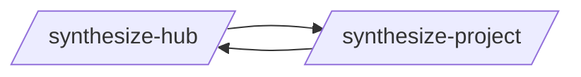
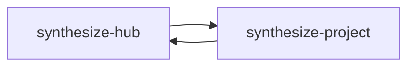
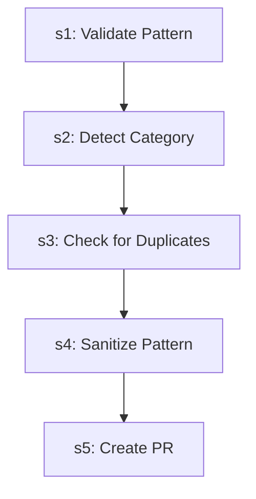
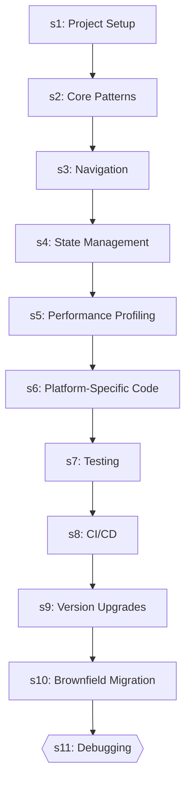
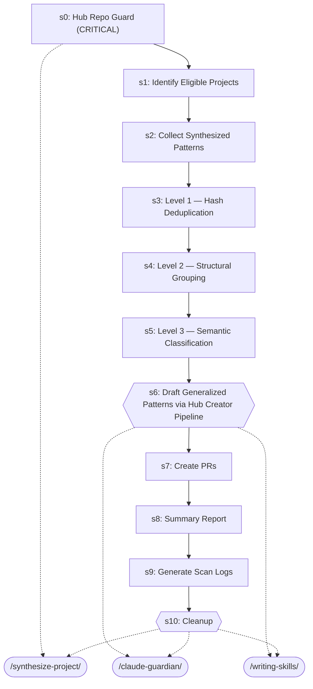
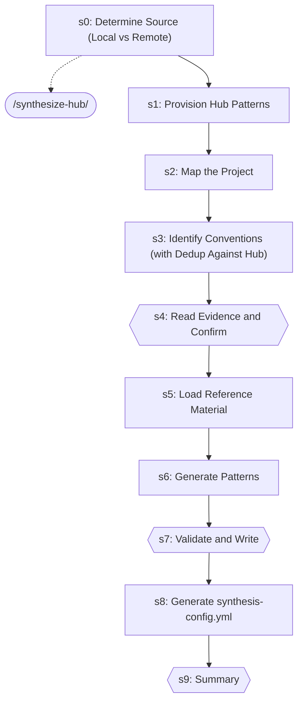
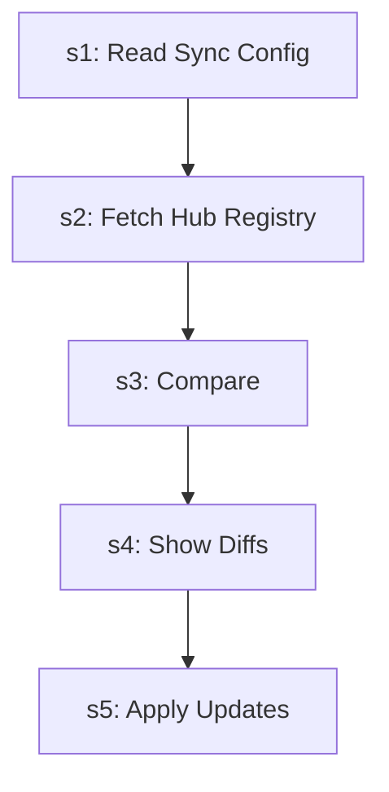

# Hub Sync

> Hub-specific pattern management: provisioning, syncing, contributing.

> Auto-generated by `scripts/generate_workflow_docs.py` | Last updated: 2026-04-02 14:09 UTC

## Overview

## Detailed Flow

Step-level flow showing gates (diamonds), delegations (dashed), and artifacts (cylinders).

```mermaid
graph TD
    subgraph contribute_practice_sub["Contribute Practice"]
        contribute_practice_s1["Step 1: Validate Pattern"]
        contribute_practice_s2["Step 2: Detect Category"]
        contribute_practice_s1 --> contribute_practice_s2
        contribute_practice_s3["Step 3: Check for Duplicates"]
        contribute_practice_s2 --> contribute_practice_s3
        contribute_practice_s4["Step 4: Sanitize Pattern"]
        contribute_practice_s3 --> contribute_practice_s4
        contribute_practice_s5["Step 5: Create PR"]
        contribute_practice_s4 --> contribute_practice_s5
    end

    subgraph react_native_dev_sub["React Native Dev"]
        react_native_dev_s1["Step 1: Project Setup"]
        react_native_dev_s2["Step 2: Core Patterns"]
        react_native_dev_s1 --> react_native_dev_s2
        react_native_dev_s3["Step 3: Navigation"]
        react_native_dev_s2 --> react_native_dev_s3
        react_native_dev_s4["Step 4: State Management"]
        react_native_dev_s3 --> react_native_dev_s4
        react_native_dev_s5["Step 5: Performance Profiling"]
        react_native_dev_s4 --> react_native_dev_s5
        react_native_dev_s6["Step 6: Platform-Specific Code"]
        react_native_dev_s5 --> react_native_dev_s6
        react_native_dev_s7["Step 7: Testing"]
        react_native_dev_s6 --> react_native_dev_s7
        react_native_dev_s8["Step 8: CI/CD"]
        react_native_dev_s7 --> react_native_dev_s8
        react_native_dev_s9["Step 9: Version Upgrades"]
        react_native_dev_s8 --> react_native_dev_s9
        react_native_dev_s10["Step 10: Brownfield Migration"]
        react_native_dev_s9 --> react_native_dev_s10
        react_native_dev_s11{{Step 11: Debugging}}
        react_native_dev_s10 --> react_native_dev_s11
    end

    subgraph synthesize_hub_sub["Synthesize Hub"]
        synthesize_hub_s0["Step 0: Hub Repo Guard (CRITICAL)"]
        synthesize_project_ext([/synthesize-project/])
        synthesize_hub_s0 -.-> synthesize_project_ext
        synthesize_hub_s1["Step 1: Identify Eligible Projects"]
        synthesize_hub_s0 --> synthesize_hub_s1
        synthesize_hub_s2["Step 2: Collect Synthesized Patterns"]
        synthesize_hub_s1 --> synthesize_hub_s2
        synthesize_hub_s3["Step 3: Level 1 — Hash Deduplication"]
        synthesize_hub_s2 --> synthesize_hub_s3
        synthesize_hub_s4["Step 4: Level 2 — Structural Grouping"]
        synthesize_hub_s3 --> synthesize_hub_s4
        synthesize_hub_s5["Step 5: Level 3 — Semantic Classification"]
        synthesize_hub_s4 --> synthesize_hub_s5
        synthesize_hub_s6{{Step 6: Draft Generalized Patterns via Hub Creator Pipeline}}
        synthesize_hub_s5 --> synthesize_hub_s6
        claude_guardian_ext([/claude-guardian/])
        synthesize_hub_s6 -.-> claude_guardian_ext
        writing_skills_ext([/writing-skills/])
        synthesize_hub_s6 -.-> writing_skills_ext
        synthesize_hub_s7["Step 7: Create PRs"]
        synthesize_hub_s6 --> synthesize_hub_s7
        synthesize_hub_s8["Step 8: Summary Report"]
        synthesize_hub_s7 --> synthesize_hub_s8
        synthesize_hub_s9["Step 9: Generate Scan Logs"]
        synthesize_hub_s8 --> synthesize_hub_s9
        synthesize_hub_s10{{Step 10: Cleanup}}
        synthesize_hub_s9 --> synthesize_hub_s10
        synthesize_hub_s10 -.-> claude_guardian_ext
        synthesize_hub_s10 -.-> synthesize_project_ext
        synthesize_hub_s10 -.-> writing_skills_ext
    end

    subgraph synthesize_project_sub["Synthesize Project"]
        synthesize_project_s0["Step 0: Determine Source (Local vs Remote)"]
        synthesize_hub_ext([/synthesize-hub/])
        synthesize_project_s0 -.-> synthesize_hub_ext
        synthesize_project_s1["Step 1: Provision Hub Patterns"]
        synthesize_project_s0 --> synthesize_project_s1
        synthesize_project_s2["Step 2: Map the Project"]
        synthesize_project_s1 --> synthesize_project_s2
        synthesize_project_s3["Step 3: Identify Conventions (with Dedup Against Hub)"]
        synthesize_project_s2 --> synthesize_project_s3
        synthesize_project_s4{{Step 4: Read Evidence and Confirm}}
        synthesize_project_s3 --> synthesize_project_s4
        synthesize_project_s5["Step 5: Load Reference Material"]
        synthesize_project_s4 --> synthesize_project_s5
        synthesize_project_s6["Step 6: Generate Patterns"]
        synthesize_project_s5 --> synthesize_project_s6
        synthesize_project_s7{{Step 7: Validate and Write}}
        synthesize_project_s6 --> synthesize_project_s7
        synthesize_project_s8["Step 8: Generate synthesis-config.yml"]
        synthesize_project_s7 --> synthesize_project_s8
        synthesize_project_s9{{Step 9: Summary}}
        synthesize_project_s8 --> synthesize_project_s9
    end

    subgraph update_practices_sub["Update Practices"]
        update_practices_s1["Step 1: Read Sync Config"]
        update_practices_s2["Step 2: Fetch Hub Registry"]
        update_practices_s1 --> update_practices_s2
        update_practices_s3["Step 3: Compare"]
        update_practices_s2 --> update_practices_s3
        update_practices_s4["Step 4: Show Diffs"]
        update_practices_s3 --> update_practices_s4
        update_practices_s5["Step 5: Apply Updates"]
        update_practices_s4 --> update_practices_s5
    end

    synthesize_project_s0 ==> synthesize_hub_s0
    synthesize_hub_s0 ==> synthesize_project_s0
```

## Skills

| Skill | Version | Description | Calls | Called By |
|-------|---------|-------------|-------|----------|
| `/contribute-practice` | 2.0.0 | Push a pattern from your project to the best practices hub by validating stru... | — | — |
| `/react-native-dev` | 1.0.1 | Build React Native applications covering project setup, functional components... | — | — |
| `/synthesize-hub` | 1.2.0 | Collect synthesized patterns from downstream projects, generalize recurring c... | `/synthesize-project` | `/synthesize-project` |
| `/synthesize-project` | 4.0.0 | Provision hub patterns AND generate project-specific .claude/ patterns for a ... | `/synthesize-hub` | `/synthesize-hub` |
| `/update-practices` | 1.0.0 | Pull latest best practices from the hub into your project's .claude/ director... | — | — |

## Workflow Steps

### Consolidated Step Flow

End-to-end flow across all skills, showing how steps connect via delegations (thick arrows).

```mermaid
graph TD
    subgraph contribute_practice_sub["Contribute Practice"]
        contribute_practice_s1["Validate Pattern"]
        contribute_practice_s2["Detect Category"]
        contribute_practice_s1 --> contribute_practice_s2
        contribute_practice_s3["Check for Duplicates"]
        contribute_practice_s2 --> contribute_practice_s3
        contribute_practice_s4["Sanitize Pattern"]
        contribute_practice_s3 --> contribute_practice_s4
        contribute_practice_s5["Create PR"]
        contribute_practice_s4 --> contribute_practice_s5
    end

    subgraph react_native_dev_sub["React Native Dev"]
        react_native_dev_s1["Project Setup"]
        react_native_dev_s2["Core Patterns"]
        react_native_dev_s1 --> react_native_dev_s2
        react_native_dev_s3["Navigation"]
        react_native_dev_s2 --> react_native_dev_s3
        react_native_dev_s4["State Management"]
        react_native_dev_s3 --> react_native_dev_s4
        react_native_dev_s5["Performance Profiling"]
        react_native_dev_s4 --> react_native_dev_s5
        react_native_dev_s6["Platform-Specific Code"]
        react_native_dev_s5 --> react_native_dev_s6
        react_native_dev_s7["Testing"]
        react_native_dev_s6 --> react_native_dev_s7
        react_native_dev_s8["CI/CD"]
        react_native_dev_s7 --> react_native_dev_s8
        react_native_dev_s9["Version Upgrades"]
        react_native_dev_s8 --> react_native_dev_s9
        react_native_dev_s10["Brownfield Migration"]
        react_native_dev_s9 --> react_native_dev_s10
        react_native_dev_s11{{Debugging}}
        react_native_dev_s10 --> react_native_dev_s11
    end

    subgraph synthesize_hub_sub["Synthesize Hub"]
        synthesize_hub_s0["Hub Repo Guard (CRITICAL)"]
        synthesize_hub_s1["Identify Eligible Projects"]
        synthesize_hub_s0 --> synthesize_hub_s1
        synthesize_hub_s2["Collect Synthesized Patterns"]
        synthesize_hub_s1 --> synthesize_hub_s2
        synthesize_hub_s3["Level 1 — Hash Deduplication"]
        synthesize_hub_s2 --> synthesize_hub_s3
        synthesize_hub_s4["Level 2 — Structural Grouping"]
        synthesize_hub_s3 --> synthesize_hub_s4
        synthesize_hub_s5["Level 3 — Semantic Classification"]
        synthesize_hub_s4 --> synthesize_hub_s5
        synthesize_hub_s6{{Draft Generalized Patterns via Hub Creator Pipeline}}
        synthesize_hub_s5 --> synthesize_hub_s6
        synthesize_hub_s7["Create PRs"]
        synthesize_hub_s6 --> synthesize_hub_s7
        synthesize_hub_s8["Summary Report"]
        synthesize_hub_s7 --> synthesize_hub_s8
        synthesize_hub_s9["Generate Scan Logs"]
        synthesize_hub_s8 --> synthesize_hub_s9
        synthesize_hub_s10{{Cleanup}}
        synthesize_hub_s9 --> synthesize_hub_s10
    end

    subgraph synthesize_project_sub["Synthesize Project"]
        synthesize_project_s0["Determine Source (Local vs Remote)"]
        synthesize_project_s1["Provision Hub Patterns"]
        synthesize_project_s0 --> synthesize_project_s1
        synthesize_project_s2["Map the Project"]
        synthesize_project_s1 --> synthesize_project_s2
        synthesize_project_s3["Identify Conventions (with Dedup Against Hub)"]
        synthesize_project_s2 --> synthesize_project_s3
        synthesize_project_s4{{Read Evidence and Confirm}}
        synthesize_project_s3 --> synthesize_project_s4
        synthesize_project_s5["Load Reference Material"]
        synthesize_project_s4 --> synthesize_project_s5
        synthesize_project_s6["Generate Patterns"]
        synthesize_project_s5 --> synthesize_project_s6
        synthesize_project_s7{{Validate and Write}}
        synthesize_project_s6 --> synthesize_project_s7
        synthesize_project_s8["Generate synthesis-config.yml"]
        synthesize_project_s7 --> synthesize_project_s8
        synthesize_project_s9{{Summary}}
        synthesize_project_s8 --> synthesize_project_s9
    end

    subgraph update_practices_sub["Update Practices"]
        update_practices_s1["Read Sync Config"]
        update_practices_s2["Fetch Hub Registry"]
        update_practices_s1 --> update_practices_s2
        update_practices_s3["Compare"]
        update_practices_s2 --> update_practices_s3
        update_practices_s4["Show Diffs"]
        update_practices_s3 --> update_practices_s4
        update_practices_s5["Apply Updates"]
        update_practices_s4 --> update_practices_s5
    end

    synthesize_hub_s0 ==> synthesize_project_s0
    synthesize_hub_s10 ==> synthesize_project_s0
    synthesize_project_s0 ==> synthesize_hub_s0
```

### Entry Points

Double-bordered nodes are user-facing entry points (no incoming references). Rounded nodes are agents.

### contribute-practice

| Step | Title | Delegates To | Artifacts | Gates/Decisions |
|------|-------|-------------|-----------|----------------|
| 1 | Validate Pattern | — | — | — |
| 2 | Detect Category | — | — | — |
| 3 | Check for Duplicates | — | — | decision |
| 4 | Sanitize Pattern | — | — | decision |
| 5 | Create PR | — | — | — |

### react-native-dev

| Step | Title | Delegates To | Artifacts | Gates/Decisions |
|------|-------|-------------|-----------|----------------|
| 1 | Project Setup | — | — | — |
| 2 | Core Patterns | — | — | — |
| 3 | Navigation | — | — | — |
| 4 | State Management | — | — | — |
| 5 | Performance Profiling | — | — | — |
| 6 | Platform-Specific Code | — | — | — |
| 7 | Testing | — | — | — |
| 8 | CI/CD | — | — | — |
| 9 | Version Upgrades | — | — | — |
| 10 | Brownfield Migration | — | — | — |
| 11 | Debugging | — | — | gate |

### synthesize-hub

| Step | Title | Delegates To | Artifacts | Gates/Decisions |
|------|-------|-------------|-----------|----------------|
| 0 | Hub Repo Guard (CRITICAL) | `/synthesize-project` | — | decision |
| 1 | Identify Eligible Projects | — | — | decision |
| 2 | Collect Synthesized Patterns | — | — | — |
| 3 | Level 1 — Hash Deduplication | — | — | — |
| 4 | Level 2 — Structural Grouping | — | — | — |
| 5 | Level 3 — Semantic Classification | — | — | decision |
| 6 | Draft Generalized Patterns via Hub Creator Pipeline | `/claude-guardian`, `/writing-skills` | — | gate, decision |
| 7 | Create PRs | — | — | — |
| 8 | Summary Report | — | — | — |
| 9 | Generate Scan Logs | — | — | — |
| 10 | Cleanup | `/claude-guardian`, `/synthesize-project`, `/writing-skills` | — | gate |

### synthesize-project

| Step | Title | Delegates To | Artifacts | Gates/Decisions |
|------|-------|-------------|-----------|----------------|
| 0 | Determine Source (Local vs Remote) | `/synthesize-hub` | — | decision |
| 1 | Provision Hub Patterns | — | — | — |
| 2 | Map the Project | — | — | decision |
| 3 | Identify Conventions (with Dedup Against Hub) | — | — | — |
| 4 | Read Evidence and Confirm | — | — | gate |
| 5 | Load Reference Material | — | — | decision |
| 6 | Generate Patterns | — | — | — |
| 7 | Validate and Write | — | — | gate, decision |
| 8 | Generate synthesis-config.yml | — | — | decision |
| 9 | Summary | — | — | gate, decision |

### update-practices

| Step | Title | Delegates To | Artifacts | Gates/Decisions |
|------|-------|-------------|-----------|----------------|
| 1 | Read Sync Config | — | — | decision |
| 2 | Fetch Hub Registry | — | — | — |
| 3 | Compare | — | — | decision |
| 4 | Show Diffs | — | — | — |
| 5 | Apply Updates | — | — | — |

## Cross-Workflow Connections

**Outgoing** (this workflow feeds into):
- `claude-guardian` (skill)
- `writing-skills` (skill)

**Incoming** (fed by):
- `provision-report` (skill)
- `skill-author-agent` (agent)
- `writing-skills` (skill)

<!-- MANUAL ANNOTATIONS -->
<!-- Add custom notes below this line. They are preserved on regeneration. -->
