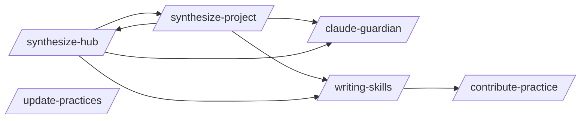

# Hub Sync

> Hub-specific pattern management: provisioning, syncing, contributing.

> Auto-generated by `scripts/generate_workflow_docs.py` | Last updated: 2026-03-21 11:56 UTC

## Flow Diagram

## Skills

| Skill | Version | Description | Calls | Called By |
|-------|---------|-------------|-------|----------|
| `/claude-guardian` | 1.0.0 | Use when adding rules/conventions to CLAUDE.md files, when CLAUDE.md files ha... | — | `/synthesize-project`, `/synthesize-hub` |
| `/contribute-practice` | 2.0.0 | Push a pattern from your project to the best practices hub. Validates pattern... | — | `/writing-skills` |
| `/synthesize-hub` | 1.2.0 | Collect synthesized patterns from downstream projects, generalize recurring c... | `/claude-guardian`, `/synthesize-project`, `/writing-skills` | `/synthesize-project` |
| `/synthesize-project` | 4.0.0 | Provision hub patterns AND generate project-specific .claude/ patterns for a ... | `/claude-guardian`, `/synthesize-hub`, `/writing-skills` | `/synthesize-hub` |
| `/update-practices` | 1.0.0 | Pull latest best practices from the hub into your project's .claude/ director... | — | — |
| `/writing-skills` | 2.0.0 | Guide for intentionally authoring new Claude Code skills from scratch or from... | `/contribute-practice` | `/synthesize-project`, `/synthesize-hub` |

## Cross-Workflow Connections

**Incoming** (fed by):
- `learn-n-improve` (skill)
- `provision-report` (skill)
- `skill-author-agent` (agent)
- `skill-factory` (skill)

<!-- MANUAL ANNOTATIONS -->
<!-- Add custom notes below this line. They are preserved on regeneration. -->

<!-- Add custom notes below this line. They are preserved on regeneration. -->
