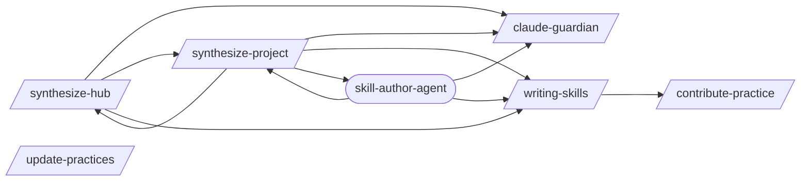

# Hub Sync

> Hub-specific pattern management: provisioning, syncing, contributing.

> Auto-generated by `scripts/generate_workflow_docs.py` | Last updated: 2026-03-21 22:31 UTC

## Overview



## Detailed Flow

Step-level flow showing gates (diamonds), delegations (dashed), and artifacts (cylinders).

```mermaid
graph TD
    subgraph contribute_practice_sub["Contribute Practice"]
        contribute_practice_s1["Step 1: Validate Pattern"]
        contribute_practice_s2["Step 2: Detect Category"]
        contribute_practice_s1 --> contribute_practice_s2
        contribute_practice_s3["Step 3: Check for Duplicates"]
        contribute_practice_s2 --> contribute_practice_s3
        contribute_practice_s4["Step 4: Sanitize Pattern"]
        contribute_practice_s3 --> contribute_practice_s4
        contribute_practice_s5["Step 5: Create PR"]
        contribute_practice_s4 --> contribute_practice_s5
    end

    subgraph synthesize_hub_sub["Synthesize Hub"]
        synthesize_hub_s0["Step 0: Hub Repo Guard (CRITICAL)"]
        synthesize_project_ext([/synthesize-project/])
        synthesize_hub_s0 -.-> synthesize_project_ext
        synthesize_hub_s1["Step 1: Identify Eligible Projects"]
        synthesize_hub_s0 --> synthesize_hub_s1
        synthesize_hub_s2["Step 2: Collect Synthesized Patterns"]
        synthesize_hub_s1 --> synthesize_hub_s2
        synthesize_hub_s3["Step 3: Level 1 — Hash Deduplication"]
        synthesize_hub_s2 --> synthesize_hub_s3
        synthesize_hub_s4["Step 4: Level 2 — Structural Grouping"]
        synthesize_hub_s3 --> synthesize_hub_s4
        synthesize_hub_s5["Step 5: Level 3 — Semantic Classification"]
        synthesize_hub_s4 --> synthesize_hub_s5
        synthesize_hub_s6{{Step 6: Draft Generalized Patterns via Hub Creator Pipeline}}
        synthesize_hub_s5 --> synthesize_hub_s6
        claude_guardian_ext([/claude-guardian/])
        synthesize_hub_s6 -.-> claude_guardian_ext
        writing_skills_ext([/writing-skills/])
        synthesize_hub_s6 -.-> writing_skills_ext
        synthesize_hub_s7["Step 7: Create PRs"]
        synthesize_hub_s6 --> synthesize_hub_s7
        synthesize_hub_s8["Step 8: Summary Report"]
        synthesize_hub_s7 --> synthesize_hub_s8
        synthesize_hub_s9["Step 9: Generate Scan Logs"]
        synthesize_hub_s8 --> synthesize_hub_s9
        synthesize_hub_s10{{Step 10: Cleanup}}
        synthesize_hub_s9 --> synthesize_hub_s10
        synthesize_hub_s10 -.-> claude_guardian_ext
        synthesize_hub_s10 -.-> synthesize_project_ext
        synthesize_hub_s10 -.-> writing_skills_ext
    end

    subgraph synthesize_project_sub["Synthesize Project"]
        synthesize_project_s0["Step 0: Determine Source (Local vs Remote)"]
        synthesize_hub_ext([/synthesize-hub/])
        synthesize_project_s0 -.-> synthesize_hub_ext
        synthesize_project_s1["Step 1: Provision Hub Patterns"]
        synthesize_project_s0 --> synthesize_project_s1
        synthesize_project_s2["Step 2: Audit CLAUDE.md Sections"]
        synthesize_project_s1 --> synthesize_project_s2
        synthesize_project_s3["Step 3: Map the Project"]
        synthesize_project_s2 --> synthesize_project_s3
        synthesize_project_s4{{Step 4: Identify Conventions (with Dedup Against Hub)}}
        synthesize_project_s3 --> synthesize_project_s4
        synthesize_project_s5{{Step 5: Read Evidence and Confirm}}
        synthesize_project_s4 --> synthesize_project_s5
        synthesize_project_s6["Step 6: Load Reference Material"]
        synthesize_project_s5 --> synthesize_project_s6
        synthesize_project_s7{{Step 7: Generate Patterns}}
        synthesize_project_s6 --> synthesize_project_s7
        synthesize_project_s7 -.-> claude_guardian_ext
        synthesize_project_s7 -.-> writing_skills_ext
        skill_author_agent_ext((skill-author-agent))
        synthesize_project_s7 -.-> skill_author_agent_ext
        synthesize_project_s8{{Step 8: Validate and Write}}
        synthesize_project_s7 --> synthesize_project_s8
        synthesize_project_s9["Step 9: Generate synthesis-config.yml"]
        synthesize_project_s8 --> synthesize_project_s9
        synthesize_project_s10{{Step 10: Summary}}
        synthesize_project_s9 --> synthesize_project_s10
        synthesize_project_s10 -.-> claude_guardian_ext
        synthesize_project_s10 -.-> writing_skills_ext
    end

    subgraph update_practices_sub["Update Practices"]
        update_practices_s1["Step 1: Read Sync Config"]
        update_practices_s2["Step 2: Fetch Hub Registry"]
        update_practices_s1 --> update_practices_s2
        update_practices_s3["Step 3: Compare"]
        update_practices_s2 --> update_practices_s3
        update_practices_s4["Step 4: Show Diffs"]
        update_practices_s3 --> update_practices_s4
        update_practices_s5["Step 5: Apply Updates"]
        update_practices_s4 --> update_practices_s5
    end

    subgraph writing_skills_sub["Writing Skills"]
        writing_skills_s1["Step 1: Determine Authoring Mode"]
        writing_skills_s2{{Step 2: Skill Authoring — From Scratch}}
        writing_skills_s1 --> writing_skills_s2
        writing_skills_s3{{Step 3: Session Log Analysis}}
        writing_skills_s2 --> writing_skills_s3
        writing_skills_s4["Step 4: Naming and Organization"]
        writing_skills_s3 --> writing_skills_s4
        writing_skills_s5{{Step 5: Quality Checklist}}
        writing_skills_s4 --> writing_skills_s5
        writing_skills_s6["Step 6: Skill Testing"]
        writing_skills_s5 --> writing_skills_s6
        writing_skills_s7["Step 7: Hub Promotion Workflow"]
        writing_skills_s6 --> writing_skills_s7
        contribute_practice_ext([/contribute-practice/])
        writing_skills_s7 -.-> contribute_practice_ext
        writing_skills_s8["Step 8: Template Library and Anti-Patterns"]
        writing_skills_s7 --> writing_skills_s8
    end

    synthesize_project_s0 ==> synthesize_hub_s0
    synthesize_project_s7 ==> writing_skills_s1
    writing_skills_s7 ==> contribute_practice_s1
    synthesize_hub_s0 ==> synthesize_project_s0
    synthesize_hub_s6 ==> writing_skills_s1
```

## Skills

| Skill | Version | Description | Calls | Called By |
|-------|---------|-------------|-------|----------|
| `/claude-guardian` | 1.0.0 | Use when adding rules/conventions to CLAUDE.md files, when CLAUDE.md files ha... | — | `/synthesize-project`, `/synthesize-hub`, `/skill-author-agent` |
| `/contribute-practice` | 2.0.0 | Push a pattern from your project to the best practices hub. Validates pattern... | — | `/writing-skills` |
| `/synthesize-hub` | 1.2.0 | Collect synthesized patterns from downstream projects, generalize recurring c... | `/claude-guardian`, `/synthesize-project`, `/writing-skills` | `/synthesize-project` |
| `/synthesize-project` | 4.0.0 | Provision hub patterns AND generate project-specific .claude/ patterns for a ... | `/claude-guardian`, `/synthesize-hub`, `/writing-skills`, `/skill-author-agent` | `/synthesize-hub`, `/skill-author-agent` |
| `/update-practices` | 1.0.0 | Pull latest best practices from the hub into your project's .claude/ director... | — | — |
| `/writing-skills` | 2.0.0 | Guide for intentionally authoring new Claude Code skills from scratch or from... | `/contribute-practice` | `/synthesize-project`, `/synthesize-hub`, `/skill-author-agent` |

## Agents

| Agent | Description | Dispatched By |
|-------|-------------|---------------|
| `skill-author-agent` | Create, update, or manage Claude Code skills, rules, and agents using the ded... | `/synthesize-project` |

## Cross-Workflow Connections

**Incoming** (fed by):
- `learn-n-improve` (skill)
- `provision-report` (skill)
- `self-improve` (skill)
- `skill-factory` (skill)

<!-- MANUAL ANNOTATIONS -->
<!-- Add custom notes below this line. They are preserved on regeneration. -->
