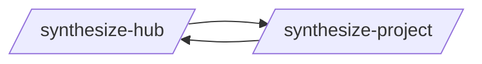

# Hub Sync

> Hub-specific pattern management: provisioning, syncing, contributing.

> Auto-generated by `scripts/generate_workflow_docs.py` | Last updated: 2026-03-31 07:13 UTC

## Overview

## Detailed Flow

Step-level flow showing gates (diamonds), delegations (dashed), and artifacts (cylinders).

## Skills

| Skill | Version | Description | Calls | Called By |
|-------|---------|-------------|-------|----------|
| `/contribute-practice` | 2.0.0 | Push a pattern from your project to the best practices hub by validating stru... | — | — |
| `/react-native-dev` | 1.0.1 | Build React Native applications covering project setup, functional components... | — | — |
| `/synthesize-hub` | 1.2.0 | Collect synthesized patterns from downstream projects, generalize recurring c... (hub-only: `.claude/skills/`, not distributed) | `/synthesize-project` | `/synthesize-project` |
| `/synthesize-project` | 4.0.0 | Provision hub patterns AND generate project-specific .claude/ patterns for a ... | `/synthesize-hub` | `/synthesize-hub` |
| `/update-practices` | 1.0.0 | Pull latest best practices from the hub into your project's .claude/ director... | — | — |

## Cross-Workflow Connections

**Outgoing** (this workflow feeds into):
- `claude-guardian` (skill)
- `writing-skills` (skill)

**Incoming** (fed by):
- `provision-report` (skill)
- `skill-author-agent` (agent)
- `writing-skills` (skill)

<!-- MANUAL ANNOTATIONS -->
<!-- Add custom notes below this line. They are preserved on regeneration. -->
