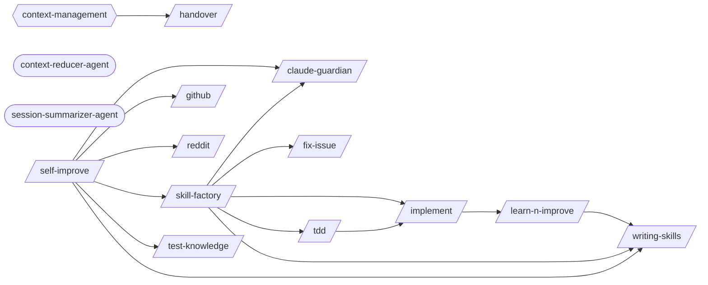

# Learning Self Improvement

> Session analysis, pattern detection, knowledge accumulation, and skill auto-generation.

> Auto-generated by `scripts/generate_workflow_docs.py` | Last updated: 2026-03-24 15:08 UTC

## Overview



## Detailed Flow

Step-level flow showing gates (diamonds), delegations (dashed), and artifacts (cylinders).

```mermaid
graph TD
    subgraph fix_issue_sub["Fix Issue"]
        fix_issue_s1["Step 1: Fetch Issue Details"]
        fix_issue_s2["Step 2: Explore Codebase"]
        fix_issue_s1 --> fix_issue_s2
        fix_issue_s3["Step 3: Plan Implementation"]
        fix_issue_s2 --> fix_issue_s3
        fix_issue_s4["Step 4: Implement Fix"]
        fix_issue_s3 --> fix_issue_s4
        fix_issue_s5{{Step 5: Verify with Tests}}
        fix_issue_s4 --> fix_issue_s5
        fix_loop_ext([/fix-loop/])
        fix_issue_s5 -.-> fix_loop_ext
        fix_issue_s6["Step 6: Post-Fix Pipeline"]
        fix_issue_s5 --> fix_issue_s6
        fix_issue_s7["Step 7: Summary"]
        fix_issue_s6 --> fix_issue_s7
    end

    subgraph handover_sub["Handover"]
        handover_s1["Step 1: Detect Handover Context"]
        handover_s2["Step 2: Review the Session"]
        handover_s1 --> handover_s2
        handover_s3["Step 3: Build the Decision Log"]
        handover_s2 --> handover_s3
        handover_s4["Step 4: Document Pitfalls"]
        handover_s3 --> handover_s4
        handover_s5["Step 5: Capture Current State Snapshot"]
        handover_s4 --> handover_s5
        handover_s6["Step 6: Build Next Steps Queue"]
        handover_s5 --> handover_s6
        handover_s7["Step 7: Integrate External Sources"]
        handover_s6 --> handover_s7
        handover_s8{{Step 8: Generate the Handover Document}}
        handover_s7 --> handover_s8
        handover_s9{{Step 9: Land the Plane}}
        handover_s8 --> handover_s9
        handover_s10["Step 10: Handover Consumption (New Session Start)"]
        handover_s9 --> handover_s10
        clear_ext([/clear/])
        handover_s10 -.-> clear_ext
        handover_s11["Step 11: Diff from Previous Handover"]
        handover_s10 --> handover_s11
    end

    subgraph implement_sub["Implement"]
        implement_s1["Step 1: Analyze Requirements"]
        writing_plans_ext([/writing-plans/])
        implement_s1 -.-> writing_plans_ext
        implement_s2["Step 2: Create/Update Tests"]
        implement_s1 --> implement_s2
        implement_s3["Step 3: Implement the Feature"]
        implement_s2 --> implement_s3
        implement_s4["Step 4: Run Tests"]
        implement_s3 --> implement_s4
        implement_s5{{Step 5: Fix Loop (if tests fail)}}
        implement_s4 --> implement_s5
        implement_s5 -.-> fix_loop_ext
        implement_s6{{Step 6: Verification (Mandatory Gate)}}
        implement_s5 --> implement_s6
        post_fix_pipeline_ext([/post-fix-pipeline/])
        implement_s6 -.-> post_fix_pipeline_ext
        implement_s7["Step 7: Post-Implementation (Optional)"]
        implement_s6 --> implement_s7
        executing_plans_ext([/executing-plans/])
        implement_s7 -.-> executing_plans_ext
        implement_s8{{Step 8: Structured Output}}
        implement_s7 --> implement_s8
        implement_test_results_implement_json[("test-results/implement.json")]
        implement_s8 -->|writes| implement_test_results_implement_json
    end

    subgraph learn_n_improve_sub["Learn N Improve"]
        learn_n_improve_s1["Step 1: Gather Session Evidence"]
        learn_n_improve_s2["Step 2: Analyze Outcomes"]
        learn_n_improve_s1 --> learn_n_improve_s2
        learn_n_improve_s3["Step 3: Build Error→Fix→Lesson Database"]
        learn_n_improve_s2 --> learn_n_improve_s3
        learn_n_improve_s4["Step 4: Update Memory Topics"]
        learn_n_improve_s3 --> learn_n_improve_s4
        learn_n_improve_s5{{Step 5: Pattern Detection (every 10th learning)}}
        learn_n_improve_s4 --> learn_n_improve_s5
        skill_name_ext([/skill-name/])
        learn_n_improve_s5 -.-> skill_name_ext
        learn_n_improve_s6["Step 6: Report"]
        learn_n_improve_s5 --> learn_n_improve_s6
    end

    subgraph self_improve_sub["Self Improve"]
        self_improve_s1["Step 1: Parse Mode"]
        self_improve_s2["Step 2: External Discovery Scan"]
        self_improve_s1 --> self_improve_s2
        github_ext([/github/])
        self_improve_s2 -.-> github_ext
        reddit_ext([/reddit/])
        self_improve_s2 -.-> reddit_ext
        self_improve_s3{{Step 3: Session Learning Capture}}
        self_improve_s2 --> self_improve_s3
        test_knowledge_ext([/test-knowledge/])
        self_improve_s3 -.-> test_knowledge_ext
        self_improve_s4["Step 4: Review Pending Improvements"]
        self_improve_s3 --> self_improve_s4
        self_improve_s5["Step 5: Propose Improvements"]
        self_improve_s4 --> self_improve_s5
        claude_guardian_ext([/claude-guardian/])
        self_improve_s5 -.-> claude_guardian_ext
        writing_skills_ext([/writing-skills/])
        self_improve_s5 -.-> writing_skills_ext
    end

    subgraph tdd_sub["Tdd"]
        tdd_s1["Step 1: RED — Write a Failing Test"]
        tdd_s2["Step 2: GREEN — Minimal Implementation"]
        tdd_s1 --> tdd_s2
        tdd_s3{{Step 3: REFACTOR — Clean Up}}
        tdd_s2 --> tdd_s3
        implement_ext([/implement/])
        tdd_s3 -.-> implement_ext
    end

    subgraph writing_skills_sub["Writing Skills"]
        writing_skills_s1["Step 1: Determine Authoring Mode"]
        writing_skills_s2{{Step 2: Skill Authoring — From Scratch}}
        writing_skills_s1 --> writing_skills_s2
        writing_skills_s2["Step 2: Classify the Input"]
        writing_skills_s2 --> writing_skills_s2
        writing_skills_s3{{Step 3: Session Log Analysis}}
        writing_skills_s2 --> writing_skills_s3
        writing_skills_s4["Step 4: Naming and Organization"]
        writing_skills_s3 --> writing_skills_s4
        writing_skills_s5{{Step 5: Quality Checklist}}
        writing_skills_s4 --> writing_skills_s5
        writing_skills_s6{{Step 6: Skill Testing and Stress Testing}}
        writing_skills_s5 --> writing_skills_s6
        writing_skills_s7["Step 7: Hub Promotion Workflow"]
        writing_skills_s6 --> writing_skills_s7
        contribute_practice_ext([/contribute-practice/])
        writing_skills_s7 -.-> contribute_practice_ext
        writing_skills_s8{{Step 8: Template Library}}
        writing_skills_s7 --> writing_skills_s8
    end

    tdd_s3 ==> implement_s1
    self_improve_s5 ==> writing_skills_s1
```

## Skills

| Skill | Version | Description | Calls | Called By |
|-------|---------|-------------|-------|----------|
| `/claude-guardian` | 1.0.1 | Validate and place rules into the correct CLAUDE.md or config file. Two modes... | — | `/skill-factory`, `/self-improve` |
| `/fix-issue` | 1.0.0 | Analyze and implement a fix for a specific GitHub Issue. Fetches issue detail... | — | `/skill-factory` |
| `/github` | 1.0.0 | Search GitHub repositories by stars/topic/language/owner, search code across ... | — | `/self-improve` |
| `/handover` | 1.0.0 | Generate a structured handover document when ending a session, designed for a... | — | — |
| `/implement` | 1.0.0 | Implement a feature or fix following a structured workflow: requirements anal... | `/learn-n-improve` | `/skill-factory`, `/tdd` |
| `/learn-n-improve` | 2.2.0 | Analyze session outcomes and update memory topics (testing-lessons, fix-patte... | `/writing-skills` | `/implement` |
| `/reddit` | 1.0.0 | Manage Reddit interactions: read posts and threads, compose posts and comment... | — | `/self-improve` |
| `/self-improve` | 1.0.0 | Run the full self-improvement cycle: scan external sources (GitHub, Reddit, T... | `/claude-guardian`, `/github`, `/reddit`, `/skill-factory`, `/test-knowledge`, `/writing-skills` | — |
| `/skill-factory` | 3.0.0 | Detect repeated workflows in session logs and classify them into the right au... | `/claude-guardian`, `/fix-issue`, `/implement`, `/tdd`, `/writing-skills` | `/self-improve` |
| `/tdd` | 1.0.1 | Execute strict Test-Driven Development using the red-green-refactor cycle. Wr... | `/implement` | `/skill-factory` |
| `/test-knowledge` | 1.0.0 | Manage a self-improving knowledge base of testing patterns and lessons learne... | — | `/self-improve` |
| `/writing-skills` | 2.6.0 | Author new Claude Code skills from scratch or from observed patterns. Covers ... | — | `/learn-n-improve`, `/skill-factory`, `/self-improve` |

## Agents

| Agent | Description | Dispatched By |
|-------|-------------|---------------|
| `context-reducer-agent` | Use this agent to summarize completed work mid-session and produce a compress... | — |
| `session-summarizer-agent` | Use this agent to auto-generate session summary updates at session end. Reads... | — |

## Rules

| Rule | Description |
|------|-------------|
| `context-management` | Rules for managing context window, token usage, and documentation references. |

## Cross-Workflow Connections

**Outgoing** (this workflow feeds into):
- `contribute-practice` (skill)
- `executing-plans` (skill)
- `fix-loop` (skill)
- `post-fix-pipeline` (skill)
- `writing-plans` (skill)

**Incoming** (fed by):
- `adversarial-review` (skill)
- `anthropic-agent-orchestration-guide` (skill)
- `brainstorm` (skill)
- `post-fix-pipeline` (skill)
- `pr-standards` (skill)
- `save-session` (skill)
- `skill-author-agent` (agent)
- `skill-master` (skill)
- `ssot-audit` (skill)
- `synthesize-hub` (skill)
- `test-generator` (skill)

<!-- MANUAL ANNOTATIONS -->
<!-- Add custom notes below this line. They are preserved on regeneration. -->
