# Learning Self Improvement

> Session analysis, pattern detection, knowledge accumulation, and skill auto-generation.

> Auto-generated by `scripts/generate_workflow_docs.py` | Last updated: 2026-04-13 11:27 UTC

## Overview

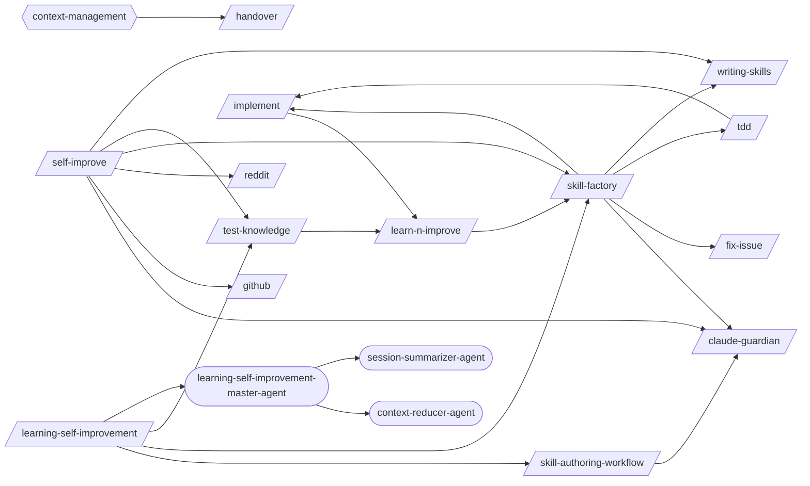

## Detailed Flow

Step-level flow showing gates (diamonds), delegations (dashed), and artifacts (cylinders).

```mermaid
graph TD
    subgraph dast_scan_sub["Dast Scan"]
        dast_scan_s1["Step 1: Pre-flight Checks"]
        dast_scan_s2["Step 2: Header Security Audit"]
        dast_scan_s1 --> dast_scan_s2
        dast_scan_s3["Step 3: OWASP ZAP Scan"]
        dast_scan_s2 --> dast_scan_s3
        dast_scan_s4["Step 4: Nuclei Scan"]
        dast_scan_s3 --> dast_scan_s4
        dast_scan_s5["Step 5: Session Management Testing"]
        dast_scan_s4 --> dast_scan_s5
        dast_scan_s6["Step 6: Fuzz Testing (API + Property-Based + Mutation)"]
        dast_scan_s5 --> dast_scan_s6
        dast_scan_s7["Step 7: CI Integration"]
        dast_scan_s6 --> dast_scan_s7
        dast_scan_s8{{Step 8: DAST Report}}
        dast_scan_s7 --> dast_scan_s8
    end

    subgraph fix_issue_sub["Fix Issue"]
        fix_issue_s1["Step 1: Fetch and Parse Issue"]
        fix_issue_s2["Step 2: Explore and Diagnose"]
        fix_issue_s1 --> fix_issue_s2
        fix_issue_s3{{Step 3: Implement and Test}}
        fix_issue_s2 --> fix_issue_s3
        fix_issue_s4["Step 4: Finalize"]
        fix_issue_s3 --> fix_issue_s4
        fix_issue_s5["Step 5: Summarize"]
        fix_issue_s4 --> fix_issue_s5
    end

    subgraph handover_sub["Handover"]
        handover_s1["Step 1: Detect Handover Context"]
        handover_s2["Step 2: Review the Session"]
        handover_s1 --> handover_s2
        handover_s3["Step 3: Build the Decision Log"]
        handover_s2 --> handover_s3
        handover_s4["Step 4: Document Pitfalls"]
        handover_s3 --> handover_s4
        handover_s5["Step 5: Capture Current State Snapshot"]
        handover_s4 --> handover_s5
        handover_s6["Step 6: Build Next Steps Queue"]
        handover_s5 --> handover_s6
        handover_s7["Step 7: Integrate External Sources"]
        handover_s6 --> handover_s7
        handover_s8{{Step 8: Generate the Handover Document}}
        handover_s7 --> handover_s8
        handover_s9{{Step 9: Land the Plane}}
        handover_s8 --> handover_s9
        handover_s10["Step 10: Handover Consumption (New Session Start)"]
        handover_s9 --> handover_s10
        handover_s11["Step 11: Diff from Previous Handover"]
        handover_s10 --> handover_s11
    end

    subgraph iac_deploy_sub["Iac Deploy"]
        iac_deploy_s1["Step 1: Assess the Infrastructure Context"]
        iac_deploy_s2["Step 2: Terraform Fundamentals"]
        iac_deploy_s1 --> iac_deploy_s2
        iac_deploy_s3["Step 3: Pulumi Fundamentals"]
        iac_deploy_s2 --> iac_deploy_s3
        iac_deploy_s4["Step 4: State Management"]
        iac_deploy_s3 --> iac_deploy_s4
        iac_deploy_s5{{Step 5: Module Composition}}
        iac_deploy_s4 --> iac_deploy_s5
        iac_deploy_s6["Step 6: Environment Management"]
        iac_deploy_s5 --> iac_deploy_s6
        iac_deploy_s7["Step 7: Drift Detection"]
        iac_deploy_s6 --> iac_deploy_s7
        iac_deploy_s8["Step 8: Security"]
        iac_deploy_s7 --> iac_deploy_s8
        iac_deploy_s9{{Step 9: CI/CD Integration}}
        iac_deploy_s8 --> iac_deploy_s9
        iac_deploy_s10{{Step 10: Common Resource Patterns, Refactoring, and Anti-Patterns}}
        iac_deploy_s9 --> iac_deploy_s10
        iac_deploy_s11["Step 11: FinOps — Cost Estimation & Optimization"]
        iac_deploy_s10 --> iac_deploy_s11
        iac_deploy_s12{{Step 12: Serverless & Static Site Deployment}}
        iac_deploy_s11 --> iac_deploy_s12
    end

    subgraph implement_sub["Implement"]
        implement_s1["Step 1: Analyze Requirements"]
        writing_plans_ext([/writing-plans/])
        implement_s1 -.-> writing_plans_ext
        implement_s2["Step 2: Create/Update Tests"]
        implement_s1 --> implement_s2
        implement_s3["Step 3: Implement the Feature"]
        implement_s2 --> implement_s3
        implement_s4["Step 4: Run Tests"]
        implement_s3 --> implement_s4
        implement_s5{{Step 5: Fix Loop (if tests fail)}}
        implement_s4 --> implement_s5
        fix_loop_ext([/fix-loop/])
        implement_s5 -.-> fix_loop_ext
        implement_s6{{Step 6: Verification (Mandatory Gate)}}
        implement_s5 --> implement_s6
        post_fix_pipeline_ext([/post-fix-pipeline/])
        implement_s6 -.-> post_fix_pipeline_ext
        implement_s7["Step 7: Post-Implementation (Optional)"]
        implement_s6 --> implement_s7
        executing_plans_ext([/executing-plans/])
        implement_s7 -.-> executing_plans_ext
        implement_s8{{Step 8: Structured Output}}
        implement_s7 --> implement_s8
        implement_s8 -.-> fix_loop_ext
        implement_test_results_implement_json[("test-results/implement.json")]
        implement_s8 -->|writes| implement_test_results_implement_json
    end

    subgraph learn_n_improve_sub["Learn N Improve"]
        learn_n_improve_s1{{Step 1: Gather Session Evidence}}
        learn_n_improve_test_results__json[("test-results/*.json")]
        learn_n_improve_s1 -->|writes| learn_n_improve_test_results__json
        learn_n_improve_s2["Step 2: Analyze Outcomes"]
        learn_n_improve_s1 --> learn_n_improve_s2
        learn_n_improve_s3{{Step 3: Build Error→Fix→Lesson Database}}
        learn_n_improve_s2 --> learn_n_improve_s3
        learn_n_improve_s4["Step 4: Update Memory Topics"]
        learn_n_improve_s3 --> learn_n_improve_s4
        learn_n_improve_s5{{Step 5: Pattern Detection (every 10th learning)}}
        learn_n_improve_s4 --> learn_n_improve_s5
        learn_n_improve_s6["Step 6: Report"]
        learn_n_improve_s5 --> learn_n_improve_s6
    end

    subgraph mcp_server_builder_sub["Mcp Server Builder"]
        mcp_server_builder_s1["Step 1: Define the Server Scope"]
        mcp_server_builder_s2["Step 2: Choose SDK and Scaffold"]
        mcp_server_builder_s1 --> mcp_server_builder_s2
        mcp_server_builder_s3["Step 3: Implement Tools"]
        mcp_server_builder_s2 --> mcp_server_builder_s3
        mcp_server_builder_s4["Step 4: Implement Resources (if needed)"]
        mcp_server_builder_s3 --> mcp_server_builder_s4
        mcp_server_builder_s5{{Step 5: Configure for Claude Code}}
        mcp_server_builder_s4 --> mcp_server_builder_s5
        mcp_server_builder_s6["Step 6: Test the Server"]
        mcp_server_builder_s5 --> mcp_server_builder_s6
        mcp_server_builder_s7["Step 7: Document and Ship"]
        mcp_server_builder_s6 --> mcp_server_builder_s7
    end

    subgraph self_improve_sub["Self Improve"]
        self_improve_s1["Step 1: Parse Mode"]
        self_improve_s2["Step 2: External Discovery Scan"]
        self_improve_s1 --> self_improve_s2
        github_ext([/github/])
        self_improve_s2 -.-> github_ext
        reddit_ext([/reddit/])
        self_improve_s2 -.-> reddit_ext
        self_improve_s3{{Step 3: Session Learning Capture}}
        self_improve_s2 --> self_improve_s3
        test_knowledge_ext([/test-knowledge/])
        self_improve_s3 -.-> test_knowledge_ext
        self_improve_s4["Step 4: Review Pending Improvements"]
        self_improve_s3 --> self_improve_s4
        self_improve_s5["Step 5: Propose Improvements"]
        self_improve_s4 --> self_improve_s5
        claude_guardian_ext([/claude-guardian/])
        self_improve_s5 -.-> claude_guardian_ext
        writing_skills_ext([/writing-skills/])
        self_improve_s5 -.-> writing_skills_ext
    end

    subgraph semgrep_rules_sub["Semgrep Rules"]
        semgrep_rules_s1["Step 1: Analyze the Target Pattern"]
        semgrep_rules_s2["Step 2: Write Tests First"]
        semgrep_rules_s1 --> semgrep_rules_s2
        semgrep_rules_s3["Step 3: Examine AST Structure"]
        semgrep_rules_s2 --> semgrep_rules_s3
        semgrep_rules_s4["Step 4: Write the Rule"]
        semgrep_rules_s3 --> semgrep_rules_s4
        semgrep_rules_s5["Step 5: Iterate Until All Tests Pass"]
        semgrep_rules_s4 --> semgrep_rules_s5
        semgrep_rules_s6["Step 6: Optimize for Precision"]
        semgrep_rules_s5 --> semgrep_rules_s6
        semgrep_rules_s7["Step 7: Common Security Rule Patterns"]
        semgrep_rules_s6 --> semgrep_rules_s7
        semgrep_rules_s8["Step 8: Cross-Language Porting"]
        semgrep_rules_s7 --> semgrep_rules_s8
        semgrep_rules_s9{{Step 9: CI/CD Integration}}
        semgrep_rules_s8 --> semgrep_rules_s9
    end

    subgraph tdd_sub["Tdd"]
        tdd_s1{{Step 1: RED — Write a Failing Test}}
        tdd_s2["Step 2: GREEN — Minimal Implementation"]
        tdd_s1 --> tdd_s2
        tdd_s3{{Step 3: REFACTOR — Clean Up}}
        tdd_s2 --> tdd_s3
        implement_ext([/implement/])
        tdd_s3 -.-> implement_ext
    end

    subgraph writing_skills_sub["Writing Skills"]
        writing_skills_s1{{Step 1: Determine Authoring Mode}}
        writing_skills_s2{{Step 2: Skill Authoring — From Scratch}}
        writing_skills_s1 --> writing_skills_s2
        writing_skills_s3{{Step 3: Session Log Analysis}}
        writing_skills_s2 --> writing_skills_s3
        writing_skills_s4["Step 4: Naming and Organization"]
        writing_skills_s3 --> writing_skills_s4
        writing_skills_s5{{Step 5: Quality Checklist}}
        writing_skills_s4 --> writing_skills_s5
        writing_skills_s6{{Step 6: Evaluate and Iterate with /skill-evaluator}}
        writing_skills_s5 --> writing_skills_s6
        skill_evaluator_ext([/skill-evaluator/])
        writing_skills_s6 -.-> skill_evaluator_ext
        anthropic_multi_agent_reviewer_agent_ext((anthropic-multi-agent-reviewer-agent))
        writing_skills_s6 -.-> anthropic_multi_agent_reviewer_agent_ext
        writing_skills_s7["Step 7: Hub Promotion Workflow"]
        writing_skills_s6 --> writing_skills_s7
        contribute_practice_ext([/contribute-practice/])
        writing_skills_s7 -.-> contribute_practice_ext
        writing_skills_s8{{Step 8: Post-Promotion Lifecycle}}
        writing_skills_s7 --> writing_skills_s8
        writing_skills_s9{{Step 9: Template Library}}
        writing_skills_s8 --> writing_skills_s9
        writing_skills_s9 -.-> skill_evaluator_ext
    end

    tdd_s3 ==> implement_s1
    self_improve_s5 ==> writing_skills_s1
```

## Skills

| Skill | Version | Description | Calls | Called By |
|-------|---------|-------------|-------|----------|
| `/claude-guardian` | 1.0.1 | Validate and place rules into the correct CLAUDE.md or config file. Two modes... | — | `/skill-authoring-workflow`, `/skill-factory`, `/self-improve` |
| `/dast-scan` | 1.0.0 | Run Dynamic Application Security Testing against a running application using ... | — | — |
| `/fix-issue` | 2.5.0 | Analyze and implement a fix for a specific GitHub Issue. Fetches issue detail... | — | `/skill-factory` |
| `/github` | 1.0.0 | Search GitHub repositories by stars/topic/language/owner, search code across ... | — | `/self-improve` |
| `/handover` | 1.0.0 | Generate a structured handover document when ending a session, designed for a... | — | — |
| `/iac-deploy` | 1.1.0 | Deploy infrastructure with Terraform and Pulumi covering provider configurati... | — | — |
| `/implement` | 2.2.0 | Implement a feature or fix following a structured workflow: requirements anal... | `/learn-n-improve` | `/skill-factory`, `/tdd` |
| `/learn-n-improve` | 2.4.0 | Analyze session outcomes and update memory topics (testing-lessons, fix-patte... | `/skill-factory` | `/implement`, `/test-knowledge` |
| `/learning-self-improvement` | 1.0.0 | Capture session learnings, detect recurring patterns, and generate skill prop... | `/skill-authoring-workflow`, `/skill-factory`, `/test-knowledge`, `/learning-self-improvement-master-agent` | — |
| `/mcp-server-builder` | 1.0.0 | Build MCP (Model Context Protocol) servers that extend Claude Code's capabili... | — | — |
| `/reddit` | 1.0.0 | Manage Reddit interactions: read posts and threads, compose posts and comment... | — | `/self-improve` |
| `/self-improve` | 1.0.0 | Run the full self-improvement cycle: scan external sources (GitHub, Reddit, T... | `/claude-guardian`, `/github`, `/reddit`, `/skill-factory`, `/test-knowledge`, `/writing-skills` | — |
| `/semgrep-rules` | 1.0.0 | Build, test, and optimize custom Semgrep rules for vulnerability detection an... | — | — |
| `/skill-authoring-workflow` | 1.0.0 | Author, validate, and register new skills, agents, and rules end-to-end. Use ... | `/claude-guardian` | `/learning-self-improvement` |
| `/skill-factory` | 3.0.0 | Detect repeated workflows in session logs and classify them into the right au... | `/claude-guardian`, `/fix-issue`, `/implement`, `/tdd`, `/writing-skills` | `/learn-n-improve`, `/learning-self-improvement`, `/self-improve` |
| `/tdd` | 1.1.0 | Execute strict Test-Driven Development using the red-green-refactor cycle. Wr... | `/implement` | `/skill-factory` |
| `/test-knowledge` | 1.2.0 | Manage a self-improving knowledge base of testing patterns and lessons learne... | `/learn-n-improve` | `/learning-self-improvement`, `/self-improve` |
| `/writing-skills` | 3.1.0 | Author new Claude Code skills or update existing ones. Covers YAML frontmatte... | — | `/skill-factory`, `/self-improve` |

## Workflow Steps

### Entry Points

Double-bordered nodes are user-facing entry points (no incoming references). Rounded nodes are agents.

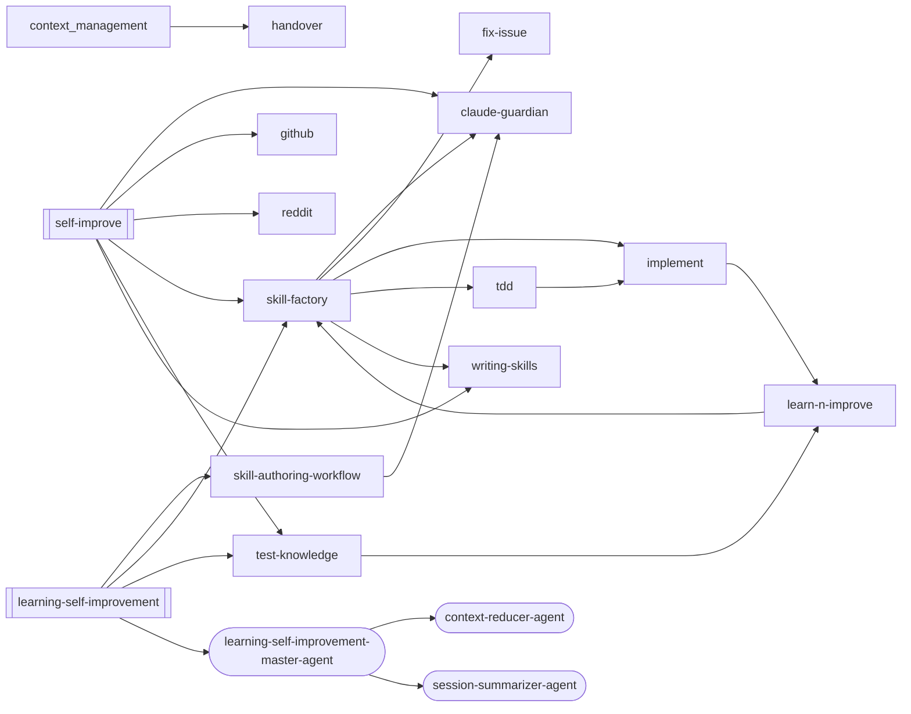

### claude-guardian

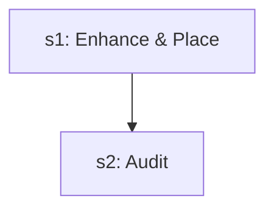

| Step | Title | Delegates To | Artifacts | Gates/Decisions |
|------|-------|-------------|-----------|----------------|
| 1 | Enhance & Place | — | — | — |
| 2 | Audit | — | — | — |

### dast-scan

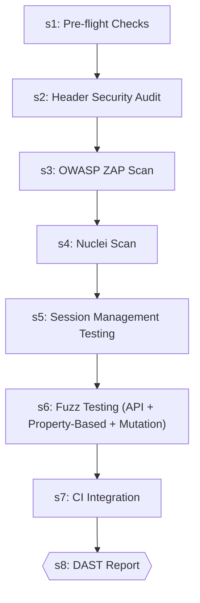

| Step | Title | Delegates To | Artifacts | Gates/Decisions |
|------|-------|-------------|-----------|----------------|
| 1 | Pre-flight Checks | — | — | — |
| 2 | Header Security Audit | — | — | decision |
| 3 | OWASP ZAP Scan | — | — | — |
| 4 | Nuclei Scan | — | — | — |
| 5 | Session Management Testing | — | — | decision |
| 6 | Fuzz Testing (API + Property-Based + Mutation) | — | — | — |
| 7 | CI Integration | — | — | — |
| 8 | DAST Report | — | — | gate |

### fix-issue

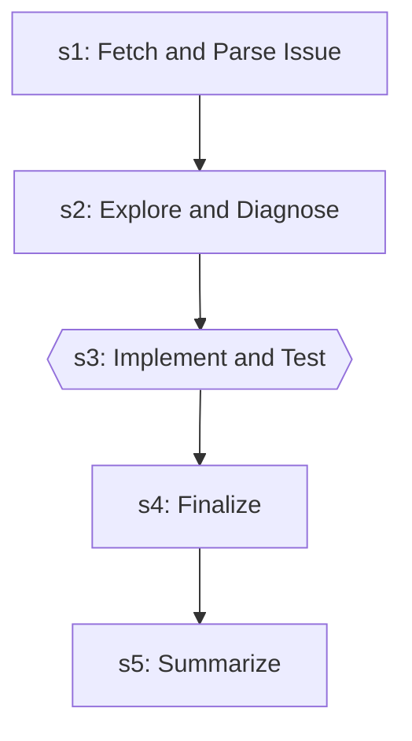

| Step | Title | Delegates To | Artifacts | Gates/Decisions |
|------|-------|-------------|-----------|----------------|
| 1 | Fetch and Parse Issue | — | — | — |
| 2 | Explore and Diagnose | — | — | — |
| 3 | Implement and Test | — | — | gate, decision |
| 4 | Finalize | — | — | — |
| 5 | Summarize | — | — | decision |

### github

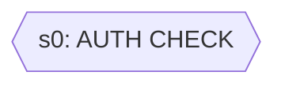

| Step | Title | Delegates To | Artifacts | Gates/Decisions |
|------|-------|-------------|-----------|----------------|
| 0 | AUTH CHECK | — | — | gate, decision |

### handover

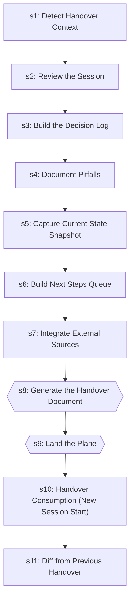

| Step | Title | Delegates To | Artifacts | Gates/Decisions |
|------|-------|-------------|-----------|----------------|
| 1 | Detect Handover Context | — | — | decision |
| 2 | Review the Session | — | — | — |
| 3 | Build the Decision Log | — | — | — |
| 4 | Document Pitfalls | — | — | — |
| 5 | Capture Current State Snapshot | — | — | — |
| 6 | Build Next Steps Queue | — | — | — |
| 7 | Integrate External Sources | — | — | — |
| 8 | Generate the Handover Document | — | — | gate, decision |
| 9 | Land the Plane | — | — | gate, decision |
| 10 | Handover Consumption (New Session Start) | — | — | decision |
| 11 | Diff from Previous Handover | — | — | decision |

### iac-deploy

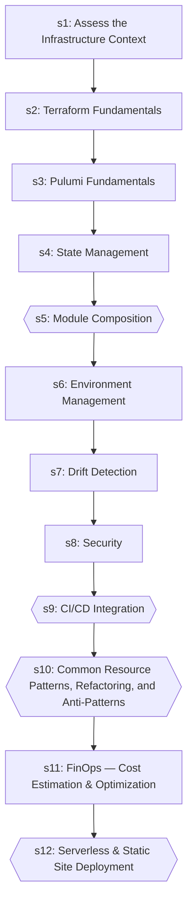

| Step | Title | Delegates To | Artifacts | Gates/Decisions |
|------|-------|-------------|-----------|----------------|
| 1 | Assess the Infrastructure Context | — | — | — |
| 2 | Terraform Fundamentals | — | — | — |
| 3 | Pulumi Fundamentals | — | — | — |
| 4 | State Management | — | — | — |
| 5 | Module Composition | — | — | gate |
| 6 | Environment Management | — | — | — |
| 7 | Drift Detection | — | — | — |
| 8 | Security | — | — | — |
| 9 | CI/CD Integration | — | — | gate |
| 10 | Common Resource Patterns, Refactoring, and Anti-Patterns | — | — | gate |
| 11 | FinOps — Cost Estimation & Optimization | — | — | — |
| 12 | Serverless & Static Site Deployment | — | — | gate |

### implement

```mermaid
graph TD
    s1["s1: Analyze Requirements"]
    writing_plans_ext([/writing-plans/])
    s1 -.-> writing_plans_ext
    s2["s2: Create/Update Tests"]
    s1 --> s2
    s3["s3: Implement the Feature"]
    s2 --> s3
    s4["s4: Run Tests"]
    s3 --> s4
    s5{{s5: Fix Loop (if tests fail)}}
    s4 --> s5
    fix_loop_ext([/fix-loop/])
    s5 -.-> fix_loop_ext
    s6{{s6: Verification (Mandatory Gate)}}
    s5 --> s6
    post_fix_pipeline_ext([/post-fix-pipeline/])
    s6 -.-> post_fix_pipeline_ext
    s7["s7: Post-Implementation (Optional)"]
    s6 --> s7
    executing_plans_ext([/executing-plans/])
    s7 -.-> executing_plans_ext
    s8{{s8: Structured Output}}
    s7 --> s8
    fix_loop_ext([/fix-loop/])
    s8 -.-> fix_loop_ext
```

| Step | Title | Delegates To | Artifacts | Gates/Decisions |
|------|-------|-------------|-----------|----------------|
| 1 | Analyze Requirements | `/writing-plans` | — | — |
| 2 | Create/Update Tests | — | — | — |
| 3 | Implement the Feature | — | — | — |
| 4 | Run Tests | — | — | decision |
| 5 | Fix Loop (if tests fail) | `/fix-loop` | — | gate |
| 6 | Verification (Mandatory Gate) | `/post-fix-pipeline` | — | gate, decision |
| 7 | Post-Implementation (Optional) | `/executing-plans` | — | — |
| 8 | Structured Output | `/fix-loop` | → `test-results/implement.json` | gate, decision |

### learn-n-improve

```mermaid
graph TD
    s1{{s1: Gather Session Evidence}}
    s2["s2: Analyze Outcomes"]
    s1 --> s2
    s3{{s3: Build Error→Fix→Lesson Database}}
    s2 --> s3
    s4["s4: Update Memory Topics"]
    s3 --> s4
    s5{{s5: Pattern Detection (every 10th learning)}}
    s4 --> s5
    s6["s6: Report"]
    s5 --> s6
```

| Step | Title | Delegates To | Artifacts | Gates/Decisions |
|------|-------|-------------|-----------|----------------|
| 1 | Gather Session Evidence | — | → `test-results/*.json` | gate, decision |
| 2 | Analyze Outcomes | — | — | — |
| 3 | Build Error→Fix→Lesson Database | — | — | gate, decision |
| 4 | Update Memory Topics | — | — | — |
| 5 | Pattern Detection (every 10th learning) | — | — | gate |
| 6 | Report | — | — | — |

### learning-self-improvement

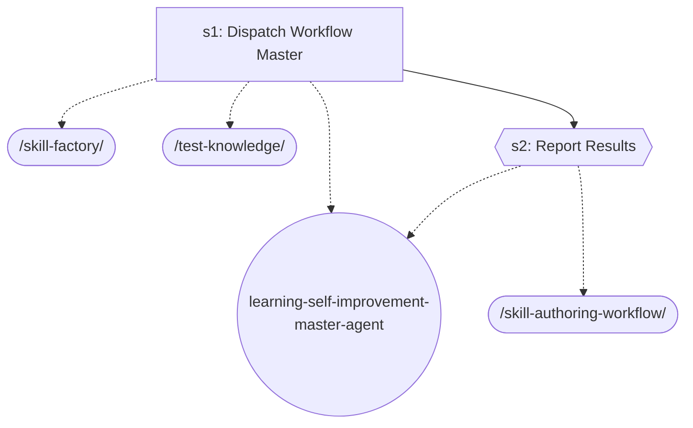

| Step | Title | Delegates To | Artifacts | Gates/Decisions |
|------|-------|-------------|-----------|----------------|
| 1 | Dispatch Workflow Master | `/skill-factory`, `/test-knowledge`, `learning-self-improvement-master-agent` | — | — |
| 2 | Report Results | `/skill-authoring-workflow`, `learning-self-improvement-master-agent` | — | gate, decision |

### mcp-server-builder

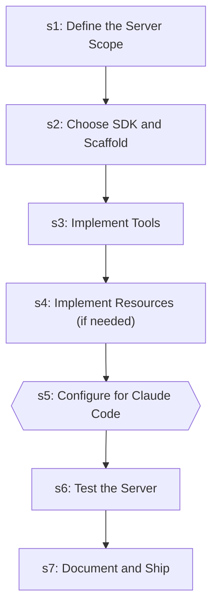

| Step | Title | Delegates To | Artifacts | Gates/Decisions |
|------|-------|-------------|-----------|----------------|
| 1 | Define the Server Scope | — | — | — |
| 2 | Choose SDK and Scaffold | — | — | — |
| 3 | Implement Tools | — | — | — |
| 4 | Implement Resources (if needed) | — | — | — |
| 5 | Configure for Claude Code | — | — | gate |
| 6 | Test the Server | — | — | — |
| 7 | Document and Ship | — | — | — |

### self-improve

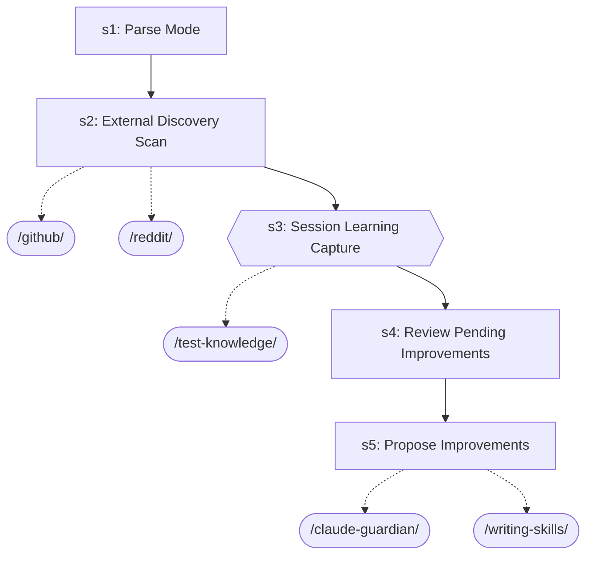

| Step | Title | Delegates To | Artifacts | Gates/Decisions |
|------|-------|-------------|-----------|----------------|
| 1 | Parse Mode | — | — | — |
| 2 | External Discovery Scan | `/github`, `/reddit` | — | — |
| 3 | Session Learning Capture | `/test-knowledge` | — | gate, decision |
| 4 | Review Pending Improvements | — | — | decision |
| 5 | Propose Improvements | `/claude-guardian`, `/writing-skills` | — | — |

### semgrep-rules

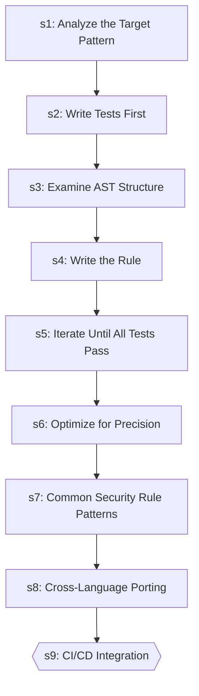

| Step | Title | Delegates To | Artifacts | Gates/Decisions |
|------|-------|-------------|-----------|----------------|
| 1 | Analyze the Target Pattern | — | — | — |
| 2 | Write Tests First | — | — | — |
| 3 | Examine AST Structure | — | — | — |
| 4 | Write the Rule | — | — | — |
| 5 | Iterate Until All Tests Pass | — | — | decision |
| 6 | Optimize for Precision | — | — | — |
| 7 | Common Security Rule Patterns | — | — | — |
| 8 | Cross-Language Porting | — | — | — |
| 9 | CI/CD Integration | — | — | gate |

### skill-authoring-workflow

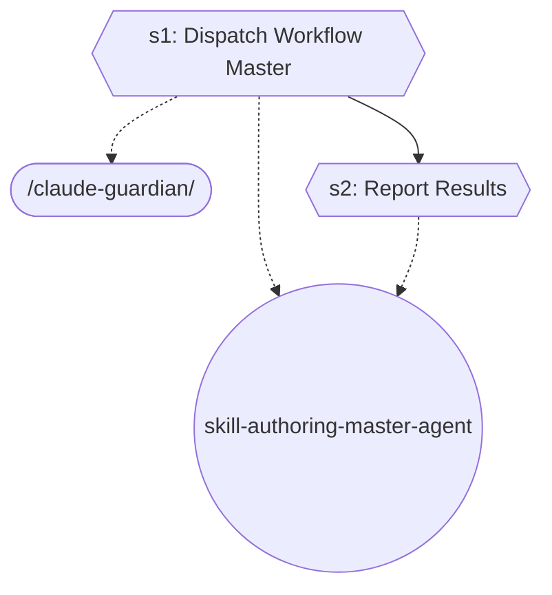

| Step | Title | Delegates To | Artifacts | Gates/Decisions |
|------|-------|-------------|-----------|----------------|
| 1 | Dispatch Workflow Master | `/claude-guardian`, `skill-authoring-master-agent` | — | gate, decision |
| 2 | Report Results | `skill-authoring-master-agent` | — | gate |

### skill-factory

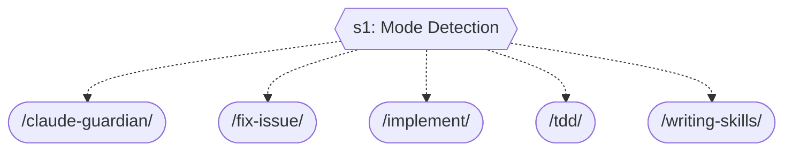

| Step | Title | Delegates To | Artifacts | Gates/Decisions |
|------|-------|-------------|-----------|----------------|
| 1 | Mode Detection | `/claude-guardian`, `/fix-issue`, `/implement`, `/tdd`, `/writing-skills` | — | gate, decision |

### tdd

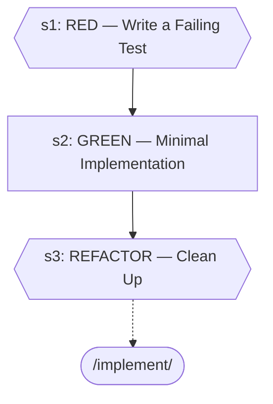

| Step | Title | Delegates To | Artifacts | Gates/Decisions |
|------|-------|-------------|-----------|----------------|
| 1 | RED — Write a Failing Test | — | — | gate, decision |
| 2 | GREEN — Minimal Implementation | — | — | — |
| 3 | REFACTOR — Clean Up | `/implement` | — | gate, decision |

### test-knowledge

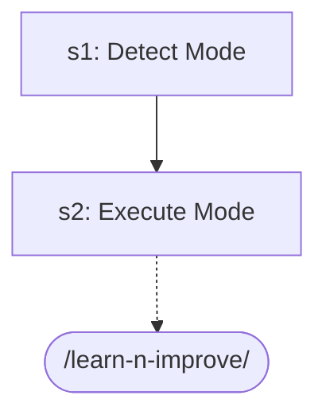

| Step | Title | Delegates To | Artifacts | Gates/Decisions |
|------|-------|-------------|-----------|----------------|
| 1 | Detect Mode | — | — | — |
| 2 | Execute Mode | `/learn-n-improve` | — | — |

### writing-skills

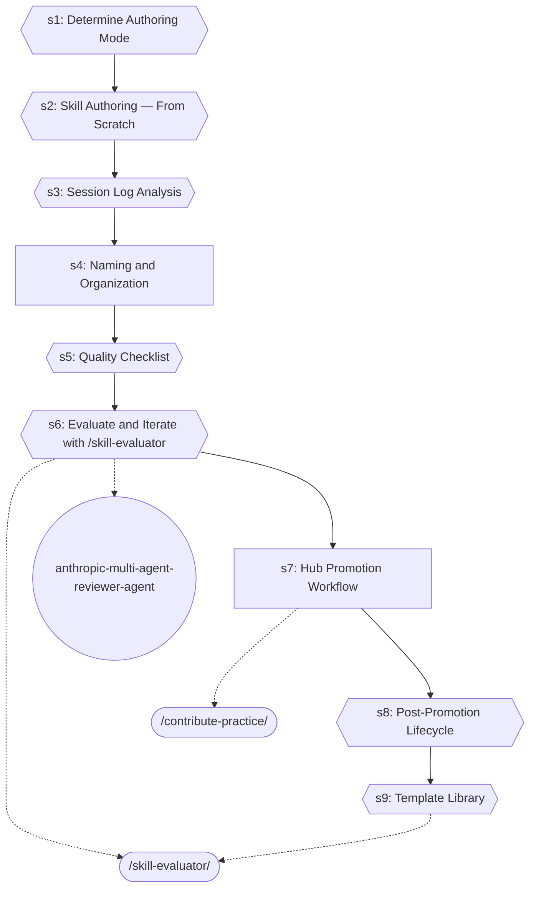

| Step | Title | Delegates To | Artifacts | Gates/Decisions |
|------|-------|-------------|-----------|----------------|
| 1 | Determine Authoring Mode | — | — | gate, decision |
| 2 | Skill Authoring — From Scratch | — | — | gate, decision |
| 3 | Session Log Analysis | — | — | gate |
| 4 | Naming and Organization | — | — | — |
| 5 | Quality Checklist | — | — | gate |
| 6 | Evaluate and Iterate with /skill-evaluator | `/skill-evaluator`, `anthropic-multi-agent-reviewer-agent` | — | gate, decision |
| 7 | Hub Promotion Workflow | `/contribute-practice` | — | — |
| 8 | Post-Promotion Lifecycle | — | — | gate |
| 9 | Template Library | `/skill-evaluator` | — | gate |


## Agents

| Agent | Description | Dispatched By |
|-------|-------------|---------------|
| `context-reducer-agent` | Use proactively to summarize completed work mid-session and produce a compres... | `/learning-self-improvement-master-agent` |
| `learning-self-improvement-master-agent` | Use proactively to capture session learnings, detect recurring patterns, and ... | `/learning-self-improvement` |
| `session-summarizer-agent` | Use proactively to auto-generate session summary updates at session end. Spaw... | `/learning-self-improvement-master-agent` |

## Rules

| Rule | Description |
|------|-------------|
| `context-management` |  |

## Cross-Workflow Connections

**Outgoing** (this workflow feeds into):
- `anthropic-multi-agent-reviewer-agent` (agent)
- `contribute-practice` (skill)
- `executing-plans` (skill)
- `fix-loop` (skill)
- `post-fix-pipeline` (skill)
- `skill-authoring-master-agent` (agent)
- `skill-evaluator` (skill)
- `tdd-failing-test-generator` (skill)
- `writing-plans` (skill)

**Incoming** (fed by):
- `adversarial-review` (skill)
- `anthropic-agent-orchestration-guide` (skill)
- `brainstorm` (skill)
- `continue` (skill)
- `development-loop` (skill)
- `fastapi-run-backend-tests` (skill)
- `pattern-structure` (rule)
- `post-fix-pipeline` (skill)
- `pr-standards` (skill)
- `save-session` (skill)
- `session-continuity` (skill)
- `session-continuity-master-agent` (agent)
- `skill-author-agent` (agent)
- `skill-authoring-master-agent` (agent)
- `skill-master` (skill)
- `ssot-audit` (skill)
- `synthesize-hub` (skill)
- `tdd-failing-test-generator` (skill)
- `testing-pipeline-workflow` (skill)

<!-- MANUAL ANNOTATIONS -->
<!-- Add custom notes below this line. They are preserved on regeneration. -->
