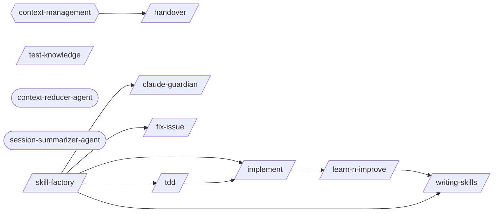

# Learning Self Improvement

> Session analysis, pattern detection, knowledge accumulation, and skill auto-generation.

> Auto-generated by `scripts/generate_workflow_docs.py` | Last updated: 2026-03-21 11:56 UTC

## Flow Diagram

## Skills

| Skill | Version | Description | Calls | Called By |
|-------|---------|-------------|-------|----------|
| `/claude-guardian` | 1.0.0 | Use when adding rules/conventions to CLAUDE.md files, when CLAUDE.md files ha... | — | `/skill-factory` |
| `/fix-issue` | 1.0.0 | Analyze and implement a fix for a specific GitHub Issue. Fetches issue detail... | — | `/skill-factory` |
| `/handover` | 1.0.0 | Generate a structured handover document when ending a session, designed for a... | — | — |
| `/implement` | 1.0.0 | Implement a feature or fix following a structured workflow: requirements anal... | `/learn-n-improve` | `/skill-factory`, `/tdd` |
| `/learn-n-improve` | 2.0.0 | Learning system analysis and self-modification. Analyzes session outcomes, up... | `/writing-skills` | `/implement` |
| `/skill-factory` | 3.0.0 | Detect repeated workflows in session logs and classify them into the right au... | `/claude-guardian`, `/fix-issue`, `/implement`, `/tdd`, `/writing-skills` | — |
| `/tdd` | 1.0.1 | Execute strict Test-Driven Development using the red-green-refactor cycle. Wr... | `/implement` | `/skill-factory` |
| `/test-knowledge` | 1.0.0 | Use when debugging test failures, choosing fixtures, handling platform quirks... | — | — |
| `/writing-skills` | 2.0.0 | Guide for intentionally authoring new Claude Code skills from scratch or from... | — | `/learn-n-improve`, `/skill-factory` |

## Agents

| Agent | Description | Dispatched By |
|-------|-------------|---------------|
| `context-reducer-agent` | Use this agent to summarize completed work mid-session and produce a compress... | — |
| `session-summarizer-agent` | Use this agent to auto-generate session summary updates at session end. Reads... | — |

## Rules

| Rule | Description |
|------|-------------|
| `context-management` | Rules for managing context window, token usage, and documentation references. |

## Cross-Workflow Connections

**Outgoing** (this workflow feeds into):
- `contribute-practice` (skill)
- `executing-plans` (skill)
- `fix-loop` (skill)
- `post-fix-pipeline` (skill)
- `writing-plans` (skill)

**Incoming** (fed by):
- `adversarial-review` (skill)
- `anthropic-agent-orchestration-guide` (skill)
- `brainstorm` (skill)
- `executing-plans` (skill)
- `post-fix-pipeline` (skill)
- `pr-standards` (skill)
- `save-session` (skill)
- `skill-author-agent` (agent)
- `skill-master` (skill)
- `ssot-audit` (skill)
- `synthesize-hub` (skill)
- `synthesize-project` (skill)
- `test-generator` (skill)

<!-- MANUAL ANNOTATIONS -->
<!-- Add custom notes below this line. They are preserved on regeneration. -->

<!-- Add custom notes below this line. They are preserved on regeneration. -->
