# Learning Self Improvement

> Session analysis, pattern detection, knowledge accumulation, and skill auto-generation.

> Auto-generated by `scripts/generate_workflow_docs.py` | Last updated: 2026-08-27 15:44 UTC

## Overview

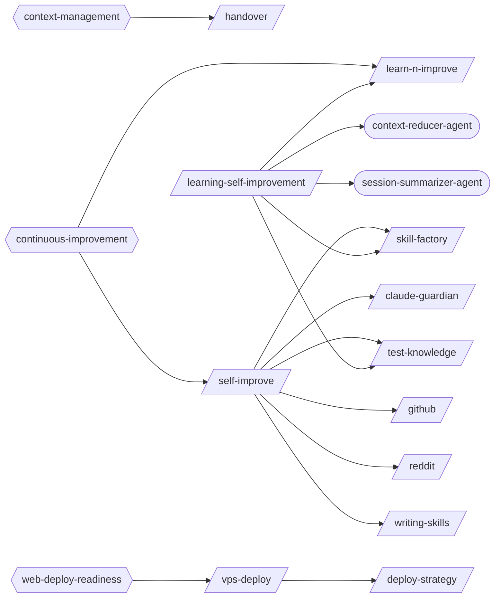
```mermaid
graph LR
    claude_guardian[/claude-guardian/]
    deploy_strategy[/deploy-strategy/]
    github[/github/]
    handover[/handover/]
    learn_n_improve[/learn-n-improve/]
    learning_self_improvement[/learning-self-improvement/]
    reddit[/reddit/]
    self_improve[/self-improve/]
    skill_factory[/skill-factory/]
    test_knowledge[/test-knowledge/]
    vps_deploy[/vps-deploy/]
    writing_skills[/writing-skills/]
    context_reducer_agent([context-reducer-agent])
    session_summarizer_agent([session-summarizer-agent])
    context_management{{context-management}}
    continuous_improvement{{continuous-improvement}}
    web_deploy_readiness{{web-deploy-readiness}}
    learning_self_improvement --> learn_n_improve
    learning_self_improvement --> skill_factory
    learning_self_improvement --> test_knowledge
    learning_self_improvement --> context_reducer_agent
    learning_self_improvement --> session_summarizer_agent
    vps_deploy --> deploy_strategy
    self_improve --> claude_guardian
    self_improve --> github
    self_improve --> reddit
    self_improve --> skill_factory
    self_improve --> test_knowledge
    self_improve --> writing_skills
    context_management --> handover
    continuous_improvement --> learn_n_improve
    continuous_improvement --> self_improve
    web_deploy_readiness --> vps_deploy
```

## Detailed Flow

Step-level flow showing gates (diamonds), delegations (dashed), and artifacts (cylinders).

```mermaid
graph TD
    subgraph dast_scan_sub["Dast Scan"]
        dast_scan_s0["Step 0: Preflight"]
        dast_scan_s1["Step 1: Pre-flight Checks"]
        dast_scan_s0 --> dast_scan_s1
        dast_scan_s2["Step 2: Header Security Audit"]
        dast_scan_s1 --> dast_scan_s2
        dast_scan_s3["Step 3: OWASP ZAP Scan"]
        dast_scan_s2 --> dast_scan_s3
        dast_scan_s4["Step 4: Nuclei Scan"]
        dast_scan_s3 --> dast_scan_s4
        dast_scan_s5["Step 5: Session Management Testing"]
        dast_scan_s4 --> dast_scan_s5
        dast_scan_s6["Step 6: Fuzz Testing (API + Property-Based + Mutation)"]
        dast_scan_s5 --> dast_scan_s6
        dast_scan_s7["Step 7: CI Integration"]
        dast_scan_s6 --> dast_scan_s7
        dast_scan_s8{{Step 8: DAST Report}}
        dast_scan_s7 --> dast_scan_s8
    end

    subgraph deploy_strategy_sub["Deploy Strategy"]
        deploy_strategy_s1["Step 1: Assess Current State"]
        deploy_strategy_s2["Step 2: GitOps Setup"]
        deploy_strategy_s1 --> deploy_strategy_s2
        deploy_strategy_s3["Step 3: Progressive Delivery"]
        deploy_strategy_s2 --> deploy_strategy_s3
        deploy_strategy_s4["Step 4: Zero-Downtime Database Migrations"]
        deploy_strategy_s3 --> deploy_strategy_s4
        deploy_strategy_s5["Step 5: Production Readiness Review (PRR)"]
        deploy_strategy_s4 --> deploy_strategy_s5
        deploy_strategy_s6["Step 6: Deployment Runbook"]
        deploy_strategy_s5 --> deploy_strategy_s6
        deploy_strategy_s7["Step 7: Secret Rotation Strategy"]
        deploy_strategy_s6 --> deploy_strategy_s7
        deploy_strategy_s8["Step 8: CDN & Edge Caching Strategy"]
        deploy_strategy_s7 --> deploy_strategy_s8
        deploy_strategy_s9["Step 9: Mobile App Deployment"]
        deploy_strategy_s8 --> deploy_strategy_s9
    end

    subgraph handover_sub["Handover"]
        handover_s0{{Step 0: Preflight}}
        handover_s1["Step 1: Detect Handover Context"]
        handover_s0 --> handover_s1
        handover_s2["Step 2: Review the Session"]
        handover_s1 --> handover_s2
        handover_s3["Step 3: Build the Decision Log"]
        handover_s2 --> handover_s3
        handover_s4["Step 4: Document Pitfalls"]
        handover_s3 --> handover_s4
        handover_s5["Step 5: Capture Current State Snapshot"]
        handover_s4 --> handover_s5
        handover_s6["Step 6: Build Next Steps Queue"]
        handover_s5 --> handover_s6
        handover_s7["Step 7: Integrate External Sources"]
        handover_s6 --> handover_s7
        handover_s8{{Step 8: Generate the Handover Document}}
        handover_s7 --> handover_s8
        handover_s9{{Step 9: Land the Plane}}
        handover_s8 --> handover_s9
        handover_s10["Step 10: Handover Consumption (New Session Start)"]
        handover_s9 --> handover_s10
        handover_s11["Step 11: Diff from Previous Handover"]
        handover_s10 --> handover_s11
    end

    subgraph iac_deploy_sub["Iac Deploy"]
        iac_deploy_s0["Step 0: Preflight"]
        iac_deploy_s1["Step 1: Assess the Infrastructure Context"]
        iac_deploy_s0 --> iac_deploy_s1
        iac_deploy_s2["Step 2: Terraform Fundamentals"]
        iac_deploy_s1 --> iac_deploy_s2
        iac_deploy_s3["Step 3: Pulumi Fundamentals"]
        iac_deploy_s2 --> iac_deploy_s3
        iac_deploy_s4["Step 4: State Management"]
        iac_deploy_s3 --> iac_deploy_s4
        iac_deploy_s5{{Step 5: Module Composition}}
        iac_deploy_s4 --> iac_deploy_s5
        iac_deploy_s6["Step 6: Environment Management"]
        iac_deploy_s5 --> iac_deploy_s6
        iac_deploy_s7["Step 7: Drift Detection"]
        iac_deploy_s6 --> iac_deploy_s7
        iac_deploy_s8["Step 8: Security"]
        iac_deploy_s7 --> iac_deploy_s8
        iac_deploy_s9{{Step 9: CI/CD Integration}}
        iac_deploy_s8 --> iac_deploy_s9
        iac_deploy_s10{{Step 10: Common Resource Patterns, Refactoring, and Anti-Patterns}}
        iac_deploy_s9 --> iac_deploy_s10
        iac_deploy_s11["Step 11: FinOps — Cost Estimation & Optimization"]
        iac_deploy_s10 --> iac_deploy_s11
        iac_deploy_s12{{Step 12: Serverless & Static Site Deployment}}
        iac_deploy_s11 --> iac_deploy_s12
    end

    subgraph mcp_server_builder_sub["Mcp Server Builder"]
        mcp_server_builder_s0["Step 0: Preflight"]
        mcp_server_builder_s1["Step 1: Define the Server Scope"]
        mcp_server_builder_s0 --> mcp_server_builder_s1
        mcp_server_builder_s2["Step 2: Choose SDK and Scaffold"]
        mcp_server_builder_s1 --> mcp_server_builder_s2
        mcp_server_builder_s3["Step 3: Implement Tools"]
        mcp_server_builder_s2 --> mcp_server_builder_s3
        mcp_server_builder_s4["Step 4: Implement Resources (if needed)"]
        mcp_server_builder_s3 --> mcp_server_builder_s4
        mcp_server_builder_s5{{Step 5: Configure for Claude Code}}
        mcp_server_builder_s4 --> mcp_server_builder_s5
        mcp_server_builder_s6["Step 6: Test the Server"]
        mcp_server_builder_s5 --> mcp_server_builder_s6
        mcp_server_builder_s7["Step 7: Document and Ship"]
        mcp_server_builder_s6 --> mcp_server_builder_s7
    end

    subgraph self_improve_sub["Self Improve"]
        self_improve_s1["Step 1: Parse Mode"]
        self_improve_s2["Step 2: External Discovery Scan"]
        self_improve_s1 --> self_improve_s2
        github_ext([/github/])
        self_improve_s2 -.-> github_ext
        reddit_ext([/reddit/])
        self_improve_s2 -.-> reddit_ext
        self_improve_s3{{Step 3: Session Learning Capture}}
        self_improve_s2 --> self_improve_s3
        test_knowledge_ext([/test-knowledge/])
        self_improve_s3 -.-> test_knowledge_ext
        self_improve_s4["Step 4: Review Pending Improvements"]
        self_improve_s3 --> self_improve_s4
        self_improve_s5["Step 5: Propose Improvements"]
        self_improve_s4 --> self_improve_s5
        claude_guardian_ext([/claude-guardian/])
        self_improve_s5 -.-> claude_guardian_ext
        writing_skills_ext([/writing-skills/])
        self_improve_s5 -.-> writing_skills_ext
    end

    subgraph semgrep_rules_sub["Semgrep Rules"]
        semgrep_rules_s0["Step 0: Preflight"]
        semgrep_rules_s1["Step 1: Analyze the Target Pattern"]
        semgrep_rules_s0 --> semgrep_rules_s1
        semgrep_rules_s2["Step 2: Write Tests First"]
        semgrep_rules_s1 --> semgrep_rules_s2
        semgrep_rules_s3["Step 3: Examine AST Structure"]
        semgrep_rules_s2 --> semgrep_rules_s3
        semgrep_rules_s4["Step 4: Write the Rule"]
        semgrep_rules_s3 --> semgrep_rules_s4
        semgrep_rules_s5["Step 5: Iterate Until All Tests Pass"]
        semgrep_rules_s4 --> semgrep_rules_s5
        semgrep_rules_s6["Step 6: Optimize for Precision"]
        semgrep_rules_s5 --> semgrep_rules_s6
        semgrep_rules_s7["Step 7: Common Security Rule Patterns"]
        semgrep_rules_s6 --> semgrep_rules_s7
        semgrep_rules_s8["Step 8: Cross-Language Porting"]
        semgrep_rules_s7 --> semgrep_rules_s8
        semgrep_rules_s9{{Step 9: CI/CD Integration}}
        semgrep_rules_s8 --> semgrep_rules_s9
    end

    subgraph vps_deploy_sub["Vps Deploy"]
        vps_deploy_s0{{Step 0: Preflight (read-only — BLOCK on any miss)}}
        vps_deploy_s1["Step 1: Backup the current release (reversible-by-default)"]
        vps_deploy_s0 --> vps_deploy_s1
        vps_deploy_s2["Step 2: Sync artifacts"]
        vps_deploy_s1 --> vps_deploy_s2
        vps_deploy_s3["Step 3: nginx vhost / PM2 reload — VALIDATE before activating"]
        vps_deploy_s2 --> vps_deploy_s3
        vps_deploy_s4["Step 4: Post-deploy smoke (the proof — not optional)"]
        vps_deploy_s3 --> vps_deploy_s4
        vps_deploy_s5["Step 5: Rollback on smoke-fail"]
        vps_deploy_s4 --> vps_deploy_s5
        vps_deploy_s6{{Step 6: Notifier wiring check (deploy DoD — owner alerts + uptime)}}
        vps_deploy_s5 --> vps_deploy_s6
        vps_deploy_s7{{Step 7: Report}}
        vps_deploy_s6 --> vps_deploy_s7
        vps_deploy_test_results_vps_deploy_json[("test-results/vps-deploy.json")]
        vps_deploy_s7 -->|writes| vps_deploy_test_results_vps_deploy_json
    end

    subgraph writing_skills_sub["Writing Skills"]
        writing_skills_s1{{Step 1: Determine Authoring Mode}}
        writing_skills_s2{{Step 2: Skill Authoring — From Scratch}}
        writing_skills_s1 --> writing_skills_s2
        writing_skills_s3{{Step 3: Session Log Analysis}}
        writing_skills_s2 --> writing_skills_s3
        writing_skills_s4["Step 4: Naming and Organization"]
        writing_skills_s3 --> writing_skills_s4
        writing_skills_s5{{Step 5: Quality Checklist}}
        writing_skills_s4 --> writing_skills_s5
        writing_skills_s6{{Step 6: Evaluate and Iterate with /skill-evaluator}}
        writing_skills_s5 --> writing_skills_s6
        skill_evaluator_ext([/skill-evaluator/])
        writing_skills_s6 -.-> skill_evaluator_ext
        anthropic_multi_agent_reviewer_agent_ext((anthropic-multi-agent-reviewer-agent))
        writing_skills_s6 -.-> anthropic_multi_agent_reviewer_agent_ext
        writing_skills_s7["Step 7: Hub Promotion Workflow"]
        writing_skills_s6 --> writing_skills_s7
        contribute_practice_ext([/contribute-practice/])
        writing_skills_s7 -.-> contribute_practice_ext
        writing_skills_s8{{Step 8: Post-Promotion Lifecycle}}
        writing_skills_s7 --> writing_skills_s8
        writing_skills_s9["Step 9: Template Library"]
        writing_skills_s8 --> writing_skills_s9
        writing_skills_s10{{Step 10: Capture Authoring Lesson (self-learning loop, exit gate — MANDATORY)}}
        writing_skills_s9 --> writing_skills_s10
        writing_skills_s10 -.-> skill_evaluator_ext
    end

    self_improve_s5 ==> writing_skills_s1
```

## Skills

| Skill | Version | Description | Calls | Called By |
|-------|---------|-------------|-------|----------|
| `/claude-guardian` | 1.0.1 | Validate and place rules into the correct CLAUDE.md or config file. Two modes... | — | `/self-improve` |
| `/dast-scan` | 1.1.0 | Run Dynamic Application Security Testing against a running application using ... | — | — |
| `/deploy-strategy` | 1.1.0 | Design deployment strategies including GitOps (ArgoCD/Flux), progressive deli... | — | `/vps-deploy` |
| `/github` | 1.1.0 | Search GitHub repositories by stars/topic/language/owner, search code across ... | — | `/self-improve` |
| `/handover` | 1.1.0 | Generate a structured handover document when ending a session, designed for a... | — | — |
| `/iac-deploy` | 1.2.0 | Deploy infrastructure with Terraform and Pulumi covering provider configurati... | — | — |
| `/learn-n-improve` | 3.0.0 | POINTER to the installable cbp-learning-workflow plugin — this capability gra... | — | `/learning-self-improvement` |
| `/learning-self-improvement` | 3.0.0 | Guide projects to the installable cbp-learning-workflow PLUGIN. The learning ... | `/learn-n-improve`, `/skill-factory`, `/test-knowledge`, `/context-reducer-agent`, `/session-summarizer-agent` | — |
| `/mcp-server-builder` | 1.1.0 | Build MCP (Model Context Protocol) servers that extend Claude Code's capabili... | — | — |
| `/reddit` | 1.1.0 | Manage Reddit interactions: read posts and threads, compose posts and comment... | — | `/self-improve` |
| `/self-improve` | 1.0.0 | Run the full self-improvement cycle: scan external sources (GitHub, Reddit, T... | `/claude-guardian`, `/github`, `/reddit`, `/skill-factory`, `/test-knowledge`, `/writing-skills` | — |
| `/semgrep-rules` | 1.1.0 | Build, test, and optimize custom Semgrep rules for vulnerability detection an... | — | — |
| `/skill-factory` | 4.0.0 | POINTER to the installable cbp-learning-workflow plugin — this capability gra... | — | `/learning-self-improvement`, `/self-improve` |
| `/test-knowledge` | 3.0.0 | POINTER to the installable cbp-learning-workflow plugin — this capability gra... | — | `/learning-self-improvement`, `/self-improve` |
| `/vps-deploy` | 1.1.0 | Deploy a built app to a Linux VPS over SSH — rsync artifacts to the webroot, ... | `/deploy-strategy` | — |
| `/writing-skills` | 3.4.0 | Author new Claude Code skills or update existing ones. Covers YAML frontmatte... | — | `/self-improve` |

## Workflow Steps

### Consolidated Step Flow

End-to-end flow across all skills, showing how steps connect via delegations (thick arrows).

```mermaid
graph TD
    subgraph claude_guardian_sub["Claude Guardian"]
        claude_guardian_s1["Enhance & Place"]
        claude_guardian_s2["Audit"]
        claude_guardian_s1 --> claude_guardian_s2
    end

    subgraph dast_scan_sub["Dast Scan"]
        dast_scan_s0["Preflight"]
        dast_scan_s1["Pre-flight Checks"]
        dast_scan_s0 --> dast_scan_s1
        dast_scan_s2["Header Security Audit"]
        dast_scan_s1 --> dast_scan_s2
        dast_scan_s3["OWASP ZAP Scan"]
        dast_scan_s2 --> dast_scan_s3
        dast_scan_s4["Nuclei Scan"]
        dast_scan_s3 --> dast_scan_s4
        dast_scan_s5["Session Management Testing"]
        dast_scan_s4 --> dast_scan_s5
        dast_scan_s6["Fuzz Testing (API + Property-Based + Mutation)"]
        dast_scan_s5 --> dast_scan_s6
        dast_scan_s7["CI Integration"]
        dast_scan_s6 --> dast_scan_s7
        dast_scan_s8{{DAST Report}}
        dast_scan_s7 --> dast_scan_s8
    end

    subgraph deploy_strategy_sub["Deploy Strategy"]
        deploy_strategy_s1["Assess Current State"]
        deploy_strategy_s2["GitOps Setup"]
        deploy_strategy_s1 --> deploy_strategy_s2
        deploy_strategy_s3["Progressive Delivery"]
        deploy_strategy_s2 --> deploy_strategy_s3
        deploy_strategy_s4["Zero-Downtime Database Migrations"]
        deploy_strategy_s3 --> deploy_strategy_s4
        deploy_strategy_s5["Production Readiness Review (PRR)"]
        deploy_strategy_s4 --> deploy_strategy_s5
        deploy_strategy_s6["Deployment Runbook"]
        deploy_strategy_s5 --> deploy_strategy_s6
        deploy_strategy_s7["Secret Rotation Strategy"]
        deploy_strategy_s6 --> deploy_strategy_s7
        deploy_strategy_s8["CDN & Edge Caching Strategy"]
        deploy_strategy_s7 --> deploy_strategy_s8
        deploy_strategy_s9["Mobile App Deployment"]
        deploy_strategy_s8 --> deploy_strategy_s9
    end

    subgraph github_sub["Github"]
        github_s0{{Preflight}}
    end

    subgraph handover_sub["Handover"]
        handover_s0{{Preflight}}
        handover_s1["Detect Handover Context"]
        handover_s0 --> handover_s1
        handover_s2["Review the Session"]
        handover_s1 --> handover_s2
        handover_s3["Build the Decision Log"]
        handover_s2 --> handover_s3
        handover_s4["Document Pitfalls"]
        handover_s3 --> handover_s4
        handover_s5["Capture Current State Snapshot"]
        handover_s4 --> handover_s5
        handover_s6["Build Next Steps Queue"]
        handover_s5 --> handover_s6
        handover_s7["Integrate External Sources"]
        handover_s6 --> handover_s7
        handover_s8{{Generate the Handover Document}}
        handover_s7 --> handover_s8
        handover_s9{{Land the Plane}}
        handover_s8 --> handover_s9
        handover_s10["Handover Consumption (New Session Start)"]
        handover_s9 --> handover_s10
        handover_s11["Diff from Previous Handover"]
        handover_s10 --> handover_s11
    end

    subgraph iac_deploy_sub["Iac Deploy"]
        iac_deploy_s0["Preflight"]
        iac_deploy_s1["Assess the Infrastructure Context"]
        iac_deploy_s0 --> iac_deploy_s1
        iac_deploy_s2["Terraform Fundamentals"]
        iac_deploy_s1 --> iac_deploy_s2
        iac_deploy_s3["Pulumi Fundamentals"]
        iac_deploy_s2 --> iac_deploy_s3
        iac_deploy_s4["State Management"]
        iac_deploy_s3 --> iac_deploy_s4
        iac_deploy_s5{{Module Composition}}
        iac_deploy_s4 --> iac_deploy_s5
        iac_deploy_s6["Environment Management"]
        iac_deploy_s5 --> iac_deploy_s6
        iac_deploy_s7["Drift Detection"]
        iac_deploy_s6 --> iac_deploy_s7
        iac_deploy_s8["Security"]
        iac_deploy_s7 --> iac_deploy_s8
        iac_deploy_s9{{CI/CD Integration}}
        iac_deploy_s8 --> iac_deploy_s9
        iac_deploy_s10{{Common Resource Patterns, Refactoring, and Anti-Patterns}}
        iac_deploy_s9 --> iac_deploy_s10
        iac_deploy_s11["FinOps — Cost Estimation & Optimization"]
        iac_deploy_s10 --> iac_deploy_s11
        iac_deploy_s12{{Serverless & Static Site Deployment}}
        iac_deploy_s11 --> iac_deploy_s12
    end

    subgraph mcp_server_builder_sub["Mcp Server Builder"]
        mcp_server_builder_s0["Preflight"]
        mcp_server_builder_s1["Define the Server Scope"]
        mcp_server_builder_s0 --> mcp_server_builder_s1
        mcp_server_builder_s2["Choose SDK and Scaffold"]
        mcp_server_builder_s1 --> mcp_server_builder_s2
        mcp_server_builder_s3["Implement Tools"]
        mcp_server_builder_s2 --> mcp_server_builder_s3
        mcp_server_builder_s4["Implement Resources (if needed)"]
        mcp_server_builder_s3 --> mcp_server_builder_s4
        mcp_server_builder_s5{{Configure for Claude Code}}
        mcp_server_builder_s4 --> mcp_server_builder_s5
        mcp_server_builder_s6["Test the Server"]
        mcp_server_builder_s5 --> mcp_server_builder_s6
        mcp_server_builder_s7["Document and Ship"]
        mcp_server_builder_s6 --> mcp_server_builder_s7
    end

    subgraph reddit_sub["Reddit"]
        reddit_s0{{Preflight}}
    end

    subgraph self_improve_sub["Self Improve"]
        self_improve_s1["Parse Mode"]
        self_improve_s2["External Discovery Scan"]
        self_improve_s1 --> self_improve_s2
        self_improve_s3{{Session Learning Capture}}
        self_improve_s2 --> self_improve_s3
        self_improve_s4["Review Pending Improvements"]
        self_improve_s3 --> self_improve_s4
        self_improve_s5["Propose Improvements"]
        self_improve_s4 --> self_improve_s5
    end

    subgraph semgrep_rules_sub["Semgrep Rules"]
        semgrep_rules_s0["Preflight"]
        semgrep_rules_s1["Analyze the Target Pattern"]
        semgrep_rules_s0 --> semgrep_rules_s1
        semgrep_rules_s2["Write Tests First"]
        semgrep_rules_s1 --> semgrep_rules_s2
        semgrep_rules_s3["Examine AST Structure"]
        semgrep_rules_s2 --> semgrep_rules_s3
        semgrep_rules_s4["Write the Rule"]
        semgrep_rules_s3 --> semgrep_rules_s4
        semgrep_rules_s5["Iterate Until All Tests Pass"]
        semgrep_rules_s4 --> semgrep_rules_s5
        semgrep_rules_s6["Optimize for Precision"]
        semgrep_rules_s5 --> semgrep_rules_s6
        semgrep_rules_s7["Common Security Rule Patterns"]
        semgrep_rules_s6 --> semgrep_rules_s7
        semgrep_rules_s8["Cross-Language Porting"]
        semgrep_rules_s7 --> semgrep_rules_s8
        semgrep_rules_s9{{CI/CD Integration}}
        semgrep_rules_s8 --> semgrep_rules_s9
    end

    subgraph vps_deploy_sub["Vps Deploy"]
        vps_deploy_s0{{Preflight (read-only — BLOCK on any miss)}}
        vps_deploy_s1["Backup the current release (reversible-by-default)"]
        vps_deploy_s0 --> vps_deploy_s1
        vps_deploy_s2["Sync artifacts"]
        vps_deploy_s1 --> vps_deploy_s2
        vps_deploy_s3["nginx vhost / PM2 reload — VALIDATE before activating"]
        vps_deploy_s2 --> vps_deploy_s3
        vps_deploy_s4["Post-deploy smoke (the proof — not optional)"]
        vps_deploy_s3 --> vps_deploy_s4
        vps_deploy_s5["Rollback on smoke-fail"]
        vps_deploy_s4 --> vps_deploy_s5
        vps_deploy_s6{{Notifier wiring check (deploy DoD — owner alerts + uptime)}}
        vps_deploy_s5 --> vps_deploy_s6
        vps_deploy_s7{{Report}}
        vps_deploy_s6 --> vps_deploy_s7
    end

    subgraph writing_skills_sub["Writing Skills"]
        writing_skills_s1{{Determine Authoring Mode}}
        writing_skills_s2{{Skill Authoring — From Scratch}}
        writing_skills_s1 --> writing_skills_s2
        writing_skills_s3{{Session Log Analysis}}
        writing_skills_s2 --> writing_skills_s3
        writing_skills_s4["Naming and Organization"]
        writing_skills_s3 --> writing_skills_s4
        writing_skills_s5{{Quality Checklist}}
        writing_skills_s4 --> writing_skills_s5
        writing_skills_s6{{Evaluate and Iterate with /skill-evaluator}}
        writing_skills_s5 --> writing_skills_s6
        writing_skills_s7["Hub Promotion Workflow"]
        writing_skills_s6 --> writing_skills_s7
        writing_skills_s8{{Post-Promotion Lifecycle}}
        writing_skills_s7 --> writing_skills_s8
        writing_skills_s9["Template Library"]
        writing_skills_s8 --> writing_skills_s9
        writing_skills_s10{{Capture Authoring Lesson (self-learning loop, exit gate — MANDATORY)}}
        writing_skills_s9 --> writing_skills_s10
    end

    self_improve_s2 ==> github_s0
    self_improve_s2 ==> reddit_s0
    self_improve_s5 ==> claude_guardian_s1
    self_improve_s5 ==> writing_skills_s1
```

### Entry Points

Double-bordered nodes are user-facing entry points (no incoming references). Rounded nodes are agents.

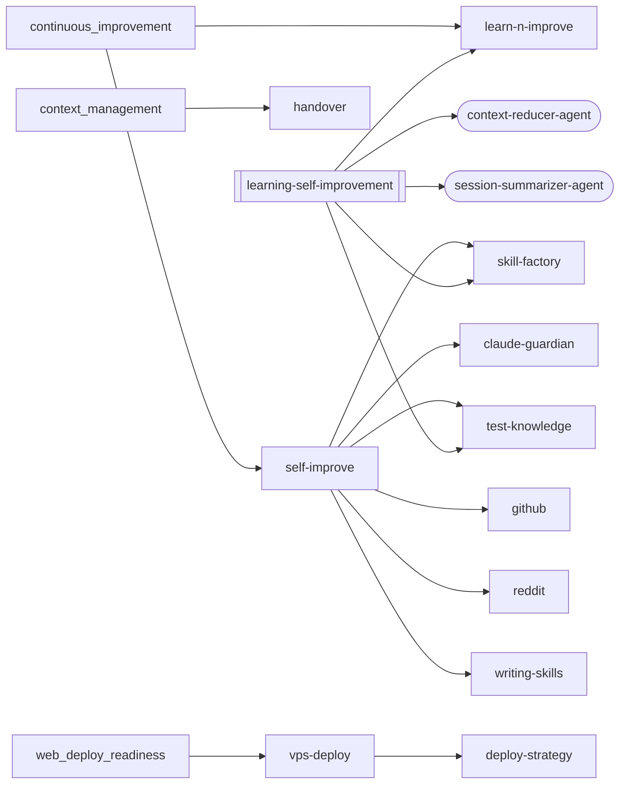
```mermaid
graph LR
    learning_self_improvement[["learning-self-improvement"]]
    claude_guardian["claude-guardian"]
    context_reducer_agent(["context-reducer-agent"])
    deploy_strategy["deploy-strategy"]
    github["github"]
    handover["handover"]
    learn_n_improve["learn-n-improve"]
    reddit["reddit"]
    self_improve["self-improve"]
    session_summarizer_agent(["session-summarizer-agent"])
    skill_factory["skill-factory"]
    test_knowledge["test-knowledge"]
    vps_deploy["vps-deploy"]
    writing_skills["writing-skills"]
    learning_self_improvement --> learn_n_improve
    learning_self_improvement --> skill_factory
    learning_self_improvement --> test_knowledge
    learning_self_improvement --> context_reducer_agent
    learning_self_improvement --> session_summarizer_agent
    vps_deploy --> deploy_strategy
    self_improve --> claude_guardian
    self_improve --> github
    self_improve --> reddit
    self_improve --> skill_factory
    self_improve --> test_knowledge
    self_improve --> writing_skills
    context_management --> handover
    continuous_improvement --> learn_n_improve
    continuous_improvement --> self_improve
    web_deploy_readiness --> vps_deploy
```

### claude-guardian

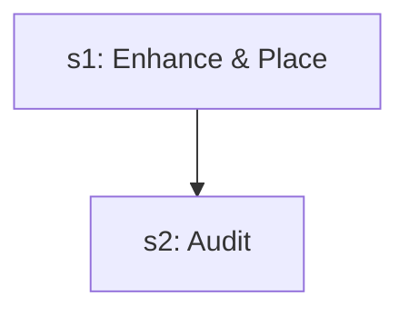
```mermaid
graph TD
    s1["s1: Enhance & Place"]
    s2["s2: Audit"]
    s1 --> s2
```

| Step | Title | Delegates To | Artifacts | Gates/Decisions |
|------|-------|-------------|-----------|----------------|
| 1 | Enhance & Place | — | — | — |
| 2 | Audit | — | — | — |

### dast-scan

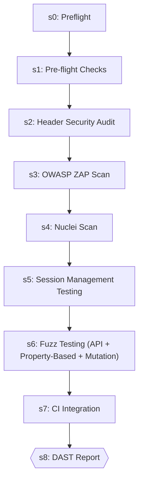
```mermaid
graph TD
    s0["s0: Preflight"]
    s1["s1: Pre-flight Checks"]
    s0 --> s1
    s2["s2: Header Security Audit"]
    s1 --> s2
    s3["s3: OWASP ZAP Scan"]
    s2 --> s3
    s4["s4: Nuclei Scan"]
    s3 --> s4
    s5["s5: Session Management Testing"]
    s4 --> s5
    s6["s6: Fuzz Testing (API + Property-Based + Mutation)"]
    s5 --> s6
    s7["s7: CI Integration"]
    s6 --> s7
    s8{{s8: DAST Report}}
    s7 --> s8
```

| Step | Title | Delegates To | Artifacts | Gates/Decisions |
|------|-------|-------------|-----------|----------------|
| 0 | Preflight | — | — | STEP 3 |
| 1 | Pre-flight Checks | — | — | — |
| 2 | Header Security Audit | — | — | decision |
| 3 | OWASP ZAP Scan | — | — | — |
| 4 | Nuclei Scan | — | — | — |
| 5 | Session Management Testing | — | — | decision |
| 6 | Fuzz Testing (API + Property-Based + Mutation) | — | — | — |
| 7 | CI Integration | — | — | — |
| 8 | DAST Report | — | — | gate |

### deploy-strategy

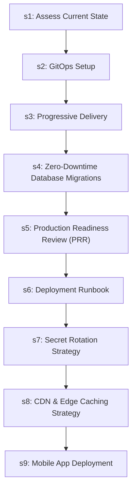
```mermaid
graph TD
    s1["s1: Assess Current State"]
    s2["s2: GitOps Setup"]
    s1 --> s2
    s3["s3: Progressive Delivery"]
    s2 --> s3
    s4["s4: Zero-Downtime Database Migrations"]
    s3 --> s4
    s5["s5: Production Readiness Review (PRR)"]
    s4 --> s5
    s6["s6: Deployment Runbook"]
    s5 --> s6
    s7["s7: Secret Rotation Strategy"]
    s6 --> s7
    s8["s8: CDN & Edge Caching Strategy"]
    s7 --> s8
    s9["s9: Mobile App Deployment"]
    s8 --> s9
```

| Step | Title | Delegates To | Artifacts | Gates/Decisions |
|------|-------|-------------|-----------|----------------|
| 1 | Assess Current State | — | — | — |
| 2 | GitOps Setup | — | — | — |
| 3 | Progressive Delivery | — | — | — |
| 4 | Zero-Downtime Database Migrations | — | — | — |
| 5 | Production Readiness Review (PRR) | — | — | — |
| 6 | Deployment Runbook | — | — | — |
| 7 | Secret Rotation Strategy | — | — | — |
| 8 | CDN & Edge Caching Strategy | — | — | — |
| 9 | Mobile App Deployment | — | — | — |

### github

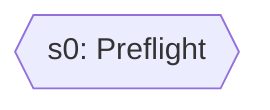
```mermaid
graph TD
    s0{{s0: Preflight}}
```

| Step | Title | Delegates To | Artifacts | Gates/Decisions |
|------|-------|-------------|-----------|----------------|
| 0 | Preflight | — | — | gate, decision |

### handover

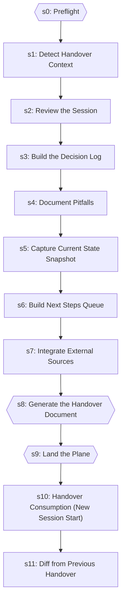
```mermaid
graph TD
    s0{{s0: Preflight}}
    s1["s1: Detect Handover Context"]
    s0 --> s1
    s2["s2: Review the Session"]
    s1 --> s2
    s3["s3: Build the Decision Log"]
    s2 --> s3
    s4["s4: Document Pitfalls"]
    s3 --> s4
    s5["s5: Capture Current State Snapshot"]
    s4 --> s5
    s6["s6: Build Next Steps Queue"]
    s5 --> s6
    s7["s7: Integrate External Sources"]
    s6 --> s7
    s8{{s8: Generate the Handover Document}}
    s7 --> s8
    s9{{s9: Land the Plane}}
    s8 --> s9
    s10["s10: Handover Consumption (New Session Start)"]
    s9 --> s10
    s11["s11: Diff from Previous Handover"]
    s10 --> s11
```

| Step | Title | Delegates To | Artifacts | Gates/Decisions |
|------|-------|-------------|-----------|----------------|
| 0 | Preflight | — | — | gate |
| 1 | Detect Handover Context | — | — | decision |
| 2 | Review the Session | — | — | — |
| 3 | Build the Decision Log | — | — | — |
| 4 | Document Pitfalls | — | — | — |
| 5 | Capture Current State Snapshot | — | — | — |
| 6 | Build Next Steps Queue | — | — | — |
| 7 | Integrate External Sources | — | — | — |
| 8 | Generate the Handover Document | — | — | gate, decision |
| 9 | Land the Plane | — | — | gate, decision |
| 10 | Handover Consumption (New Session Start) | — | — | decision |
| 11 | Diff from Previous Handover | — | — | decision |

### iac-deploy

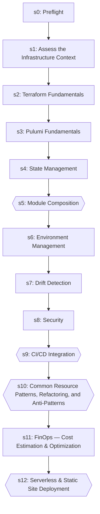
```mermaid
graph TD
    s0["s0: Preflight"]
    s1["s1: Assess the Infrastructure Context"]
    s0 --> s1
    s2["s2: Terraform Fundamentals"]
    s1 --> s2
    s3["s3: Pulumi Fundamentals"]
    s2 --> s3
    s4["s4: State Management"]
    s3 --> s4
    s5{{s5: Module Composition}}
    s4 --> s5
    s6["s6: Environment Management"]
    s5 --> s6
    s7["s7: Drift Detection"]
    s6 --> s7
    s8["s8: Security"]
    s7 --> s8
    s9{{s9: CI/CD Integration}}
    s8 --> s9
    s10{{s10: Common Resource Patterns, Refactoring, and Anti-Patterns}}
    s9 --> s10
    s11["s11: FinOps — Cost Estimation & Optimization"]
    s10 --> s11
    s12{{s12: Serverless & Static Site Deployment}}
    s11 --> s12
```

| Step | Title | Delegates To | Artifacts | Gates/Decisions |
|------|-------|-------------|-----------|----------------|
| 0 | Preflight | — | — | decision |
| 1 | Assess the Infrastructure Context | — | — | — |
| 2 | Terraform Fundamentals | — | — | — |
| 3 | Pulumi Fundamentals | — | — | — |
| 4 | State Management | — | — | — |
| 5 | Module Composition | — | — | gate |
| 6 | Environment Management | — | — | — |
| 7 | Drift Detection | — | — | — |
| 8 | Security | — | — | — |
| 9 | CI/CD Integration | — | — | gate |
| 10 | Common Resource Patterns, Refactoring, and Anti-Patterns | — | — | gate |
| 11 | FinOps — Cost Estimation & Optimization | — | — | — |
| 12 | Serverless & Static Site Deployment | — | — | gate |

### mcp-server-builder

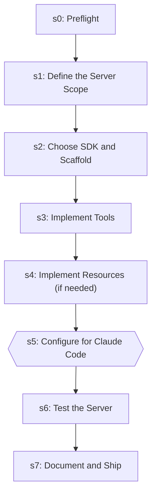
```mermaid
graph TD
    s0["s0: Preflight"]
    s1["s1: Define the Server Scope"]
    s0 --> s1
    s2["s2: Choose SDK and Scaffold"]
    s1 --> s2
    s3["s3: Implement Tools"]
    s2 --> s3
    s4["s4: Implement Resources (if needed)"]
    s3 --> s4
    s5{{s5: Configure for Claude Code}}
    s4 --> s5
    s6["s6: Test the Server"]
    s5 --> s6
    s7["s7: Document and Ship"]
    s6 --> s7
```

| Step | Title | Delegates To | Artifacts | Gates/Decisions |
|------|-------|-------------|-----------|----------------|
| 0 | Preflight | — | — | — |
| 1 | Define the Server Scope | — | — | — |
| 2 | Choose SDK and Scaffold | — | — | — |
| 3 | Implement Tools | — | — | — |
| 4 | Implement Resources (if needed) | — | — | — |
| 5 | Configure for Claude Code | — | — | gate |
| 6 | Test the Server | — | — | — |
| 7 | Document and Ship | — | — | — |

### reddit

```mermaid
graph TD
    s0{{s0: Preflight}}
```

| Step | Title | Delegates To | Artifacts | Gates/Decisions |
|------|-------|-------------|-----------|----------------|
| 0 | Preflight | — | — | gate, decision |

### self-improve

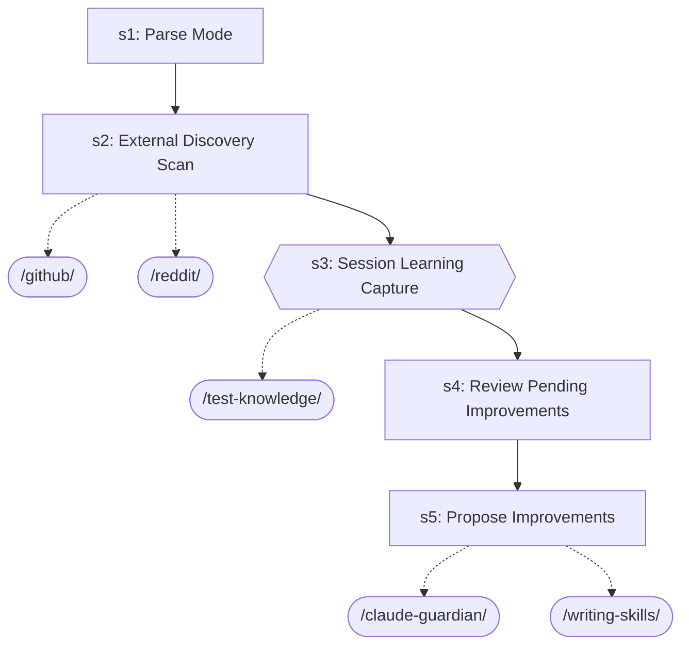
```mermaid
graph TD
    s1["s1: Parse Mode"]
    s2["s2: External Discovery Scan"]
    s1 --> s2
    github_ext([/github/])
    s2 -.-> github_ext
    reddit_ext([/reddit/])
    s2 -.-> reddit_ext
    s3{{s3: Session Learning Capture}}
    s2 --> s3
    test_knowledge_ext([/test-knowledge/])
    s3 -.-> test_knowledge_ext
    s4["s4: Review Pending Improvements"]
    s3 --> s4
    s5["s5: Propose Improvements"]
    s4 --> s5
    claude_guardian_ext([/claude-guardian/])
    s5 -.-> claude_guardian_ext
    writing_skills_ext([/writing-skills/])
    s5 -.-> writing_skills_ext
```

| Step | Title | Delegates To | Artifacts | Gates/Decisions |
|------|-------|-------------|-----------|----------------|
| 1 | Parse Mode | — | — | — |
| 2 | External Discovery Scan | `/github`, `/reddit` | — | — |
| 3 | Session Learning Capture | `/test-knowledge` | — | gate, decision |
| 4 | Review Pending Improvements | — | — | decision |
| 5 | Propose Improvements | `/claude-guardian`, `/writing-skills` | — | — |

### semgrep-rules

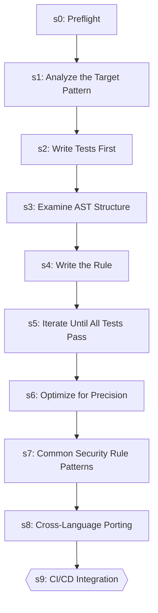
```mermaid
graph TD
    s0["s0: Preflight"]
    s1["s1: Analyze the Target Pattern"]
    s0 --> s1
    s2["s2: Write Tests First"]
    s1 --> s2
    s3["s3: Examine AST Structure"]
    s2 --> s3
    s4["s4: Write the Rule"]
    s3 --> s4
    s5["s5: Iterate Until All Tests Pass"]
    s4 --> s5
    s6["s6: Optimize for Precision"]
    s5 --> s6
    s7["s7: Common Security Rule Patterns"]
    s6 --> s7
    s8["s8: Cross-Language Porting"]
    s7 --> s8
    s9{{s9: CI/CD Integration}}
    s8 --> s9
```

| Step | Title | Delegates To | Artifacts | Gates/Decisions |
|------|-------|-------------|-----------|----------------|
| 0 | Preflight | — | — | decision |
| 1 | Analyze the Target Pattern | — | — | — |
| 2 | Write Tests First | — | — | — |
| 3 | Examine AST Structure | — | — | — |
| 4 | Write the Rule | — | — | — |
| 5 | Iterate Until All Tests Pass | — | — | decision |
| 6 | Optimize for Precision | — | — | — |
| 7 | Common Security Rule Patterns | — | — | — |
| 8 | Cross-Language Porting | — | — | — |
| 9 | CI/CD Integration | — | — | gate |

### vps-deploy

```mermaid
graph TD
    s0{{s0: Preflight (read-only — BLOCK on any miss)}}
    s1["s1: Backup the current release (reversible-by-default)"]
    s0 --> s1
    s2["s2: Sync artifacts"]
    s1 --> s2
    s3["s3: nginx vhost / PM2 reload — VALIDATE before activating"]
    s2 --> s3
    s4["s4: Post-deploy smoke (the proof — not optional)"]
    s3 --> s4
    s5["s5: Rollback on smoke-fail"]
    s4 --> s5
    s6{{s6: Notifier wiring check (deploy DoD — owner alerts + uptime)}}
    s5 --> s6
    s7{{s7: Report}}
    s6 --> s7
```

| Step | Title | Delegates To | Artifacts | Gates/Decisions |
|------|-------|-------------|-----------|----------------|
| 0 | Preflight (read-only — BLOCK on any miss) | — | — | gate, decision |
| 1 | Backup the current release (reversible-by-default) | — | — | — |
| 2 | Sync artifacts | — | — | — |
| 3 | nginx vhost / PM2 reload — VALIDATE before activating | — | — | decision |
| 4 | Post-deploy smoke (the proof — not optional) | — | — | — |
| 5 | Rollback on smoke-fail | — | — | decision |
| 6 | Notifier wiring check (deploy DoD — owner alerts + uptime) | — | — | gate |
| 7 | Report | — | → `test-results/vps-deploy.json` | gate |

### writing-skills

```mermaid
graph TD
    s1{{s1: Determine Authoring Mode}}
    s2{{s2: Skill Authoring — From Scratch}}
    s1 --> s2
    s3{{s3: Session Log Analysis}}
    s2 --> s3
    s4["s4: Naming and Organization"]
    s3 --> s4
    s5{{s5: Quality Checklist}}
    s4 --> s5
    s6{{s6: Evaluate and Iterate with /skill-evaluator}}
    s5 --> s6
    skill_evaluator_ext([/skill-evaluator/])
    s6 -.-> skill_evaluator_ext
    anthropic_multi_agent_reviewer_agent_ext((anthropic-multi-agent-reviewer-agent))
    s6 -.-> anthropic_multi_agent_reviewer_agent_ext
    s7["s7: Hub Promotion Workflow"]
    s6 --> s7
    contribute_practice_ext([/contribute-practice/])
    s7 -.-> contribute_practice_ext
    s8{{s8: Post-Promotion Lifecycle}}
    s7 --> s8
    s9["s9: Template Library"]
    s8 --> s9
    s10{{s10: Capture Authoring Lesson (self-learning loop, exit gate — MANDATORY)}}
    s9 --> s10
    skill_evaluator_ext([/skill-evaluator/])
    s10 -.-> skill_evaluator_ext
```

| Step | Title | Delegates To | Artifacts | Gates/Decisions |
|------|-------|-------------|-----------|----------------|
| 1 | Determine Authoring Mode | — | — | gate, decision |
| 2 | Skill Authoring — From Scratch | — | — | gate, decision |
| 3 | Session Log Analysis | — | — | gate |
| 4 | Naming and Organization | — | — | — |
| 5 | Quality Checklist | — | — | gate |
| 6 | Evaluate and Iterate with /skill-evaluator | `/skill-evaluator`, `anthropic-multi-agent-reviewer-agent` | — | gate, decision |
| 7 | Hub Promotion Workflow | `/contribute-practice` | — | — |
| 8 | Post-Promotion Lifecycle | — | — | gate |
| 9 | Template Library | — | — | — |
| 10 | Capture Authoring Lesson (self-learning loop, exit gate — MANDATORY) | `/skill-evaluator` | — | gate |

## Agents

| Agent | Description | Dispatched By |
|-------|-------------|---------------|
| `context-reducer-agent` | Use proactively to summarize completed work mid-session and produce a compres... | `/learning-self-improvement` |
| `session-summarizer-agent` | Use proactively to auto-generate session summary updates at session end. Spaw... | `/learning-self-improvement` |

## Rules

| Rule | Description |
|------|-------------|
| `context-management` |  |
| `continuous-improvement` |  |
| `web-deploy-readiness` | Web ship-readiness DoD — a web app is not "done" until it is visually verifie... |

## Cross-Workflow Connections

**Outgoing** (this workflow feeds into):
- `anthropic-multi-agent-reviewer-agent` (agent)
- `contribute-practice` (skill)
- `skill-evaluator` (skill)

**Incoming** (fed by):
- `continue` (skill)
- `db-migrate` (skill)
- `end-session` (skill)
- `engineering-roles` (rule)
- `fastapi-deploy` (skill)
- `fastapi-run-backend-tests` (skill)
- `learnings-routing` (rule)
- `pattern-structure` (rule)
- `save-session` (skill)
- `session-continuity` (skill)
- `skill-author-agent` (agent)
- `synthesize-hub` (skill)
- `workflow-master-template` (agent)

<!-- MANUAL ANNOTATIONS -->
<!-- Add custom notes below this line. They are preserved on regeneration. -->
