# Loop Engineering

> Autonomous self-* meta-loop: discover, plan, execute (maker), verify (independent checker), ship or self-heal, learn each cycle.

> Auto-generated by `scripts/generate_workflow_docs.py` | Last updated: 2026-06-20 06:27 UTC

## Overview

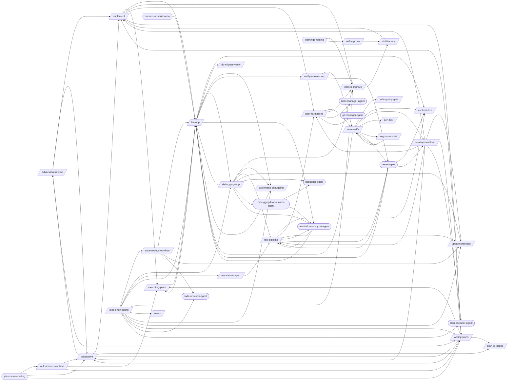

## Skills

| Skill | Version | Description | Calls | Called By |
|-------|---------|-------------|-------|----------|
| `/adversarial-review` | 1.0.0 | Launch a structured adversarial review using a subagent with a dedicated revi... | `/brainstorm`, `/implement`, `/writing-plans` | `/brainstorm` |
| `/auto-verify` | 4.3.0 | Run a post-change verification pipeline that maps changed files to targeted t... | `/code-quality-gate`, `/contract-test`, `/development-loop`, `/fix-loop`, `/perf-test`, `/regression-test`, `/tester-agent` | `/development-loop`, `/post-fix-pipeline`, `/regression-test`, `/verify-screenshots` |
| `/autonomous-contract` | 1.2.0 | Author a "contract" — a dense, zero-open-questions markdown spec — to hand to... | `/brainstorm`, `/executing-plans`, `/writing-plans` | — |
| `/brainstorm` | 1.0.0 | Explore intent through Socratic questioning, propose approaches with trade-of... | `/adversarial-review`, `/implement`, `/plan-to-issues`, `/writing-plans` | `/adversarial-review`, `/autonomous-contract`, `/development-loop`, `/writing-plans` |
| `/code-quality-gate` | 1.2.1 | Enforce code quality standards including cyclomatic complexity, duplication d... | — | `/auto-verify` |
| `/code-review-workflow` | 2.3.0 | Run pre-merge quality gates, create PR, and handle review feedback as a skill... | `/fix-loop`, `/update-practices`, `/code-reviewer-agent` | `/loop-engineering` |
| `/contract-test` | 1.1.0 | Implement consumer-driven contract testing with Pact. Write consumer contract... | — | `/auto-verify`, `/fix-loop`, `/test-pipeline`, `/tester-agent` |
| `/db-migrate-verify` | 1.0.0 | Verify database migrations: run forward, validate schema, run backward, valid... | — | `/fix-loop` |
| `/debugging-loop` | 2.2.0 | Orchestrate the full bug resolution cycle as a skill-at-T0 orchestrator (Phas... | `/fix-loop`, `/learn-n-improve`, `/systematic-debugging`, `/test-pipeline`, `/update-practices`, `/debugger-agent`, `/debugging-loop-master-agent`, `/test-failure-analyzer-agent` | `/fix-loop`, `/loop-engineering` |
| `/development-loop` | 2.1.1 | Orchestrate the full development cycle end-to-end as a skill-at-T0 orchestrat... | `/auto-verify`, `/brainstorm`, `/implement`, `/post-fix-pipeline`, `/test-pipeline`, `/update-practices`, `/writing-plans`, `/plan-executor-agent` | `/auto-verify`, `/tester-agent` |
| `/escalation-report` | 1.1.0 | Generate `test-results/escalation-report.md` when `/test-pipeline` (skill-at-... | `/test-pipeline` | `/loop-engineering` |
| `/executing-plans` | 1.0.0 | Execute a pre-written implementation plan step by step. Parses tasks from a p... | `/fix-loop` | `/autonomous-contract`, `/fix-loop`, `/implement`, `/writing-plans` |
| `/fix-loop` | 1.5.0 | Analyze failures and iteratively apply minimal fixes, optionally retesting un... | `/contract-test`, `/db-migrate-verify`, `/debugging-loop`, `/executing-plans`, `/systematic-debugging`, `/verify-screenshots`, `/test-failure-analyzer-agent` | `/auto-verify`, `/code-review-workflow`, `/debugging-loop`, `/executing-plans`, `/implement`, `/loop-engineering`, `/systematic-debugging`, `/test-failure-analyzer-agent`, `/tester-agent` |
| `/implement` | 2.2.0 | Implement a feature or fix following a structured workflow: requirements anal... | `/executing-plans`, `/fix-loop`, `/learn-n-improve`, `/post-fix-pipeline`, `/writing-plans` | `/adversarial-review`, `/brainstorm`, `/development-loop`, `/skill-factory`, `/writing-plans` |
| `/learn-n-improve` | 2.4.0 | Analyze session outcomes and update memory topics (testing-lessons, fix-patte... | `/skill-factory` | `/debugging-loop`, `/implement`, `/loop-engineering`, `/post-fix-pipeline` |
| `/loop-engineering` | 1.1.0 | Run a repeatable, autonomous feedback loop — DISCOVER → PLAN → EXECUTE → VERI... | `/code-review-workflow`, `/debugging-loop`, `/escalation-report`, `/fix-loop`, `/learn-n-improve`, `/status`, `/systematic-debugging`, `/update-practices`, `/writing-plans`, `/code-reviewer-agent`, `/plan-executor-agent` | — |
| `/perf-test` | 1.2.0 | Run performance tests using k6 load testing, Lighthouse web performance audit... | — | `/auto-verify` |
| `/plan-to-issues` | 1.2.0 | Parse a markdown plan into GitHub Issues with labels and duplicate detection.... | — | `/brainstorm`, `/writing-plans` |
| `/post-fix-pipeline` | 3.1.0 | Finalize verified changes by reading the upstream auto-verify gate, updating ... | `/auto-verify`, `/learn-n-improve`, `/docs-manager-agent`, `/git-manager-agent` | `/development-loop`, `/implement`, `/test-pipeline` |
| `/regression-test` | 1.2.0 | Run targeted regression tests based on code changes. Analyze git diffs to ide... | `/auto-verify` | `/auto-verify` |
| `/self-improve` | 1.0.0 | Run the full self-improvement cycle: scan external sources (GitHub, Reddit, T... | `/skill-factory` | — |
| `/skill-factory` | 3.0.0 | Detect repeated workflows in session logs and classify them into the right au... | `/implement` | `/learn-n-improve`, `/self-improve` |
| `/status` | 1.0.1 | Generate a project health snapshot showing git status, test status, and proje... | — | `/loop-engineering` |
| `/systematic-debugging` | 1.1.0 | Debug failures methodically using a structured diagnosis workflow: reproduce,... | `/fix-loop` | `/debugging-loop`, `/fix-loop`, `/loop-engineering` |
| `/test-pipeline` | 3.0.0 | Run your full test suite end-to-end: find broken tests, diagnose root causes,... | `/contract-test`, `/post-fix-pipeline`, `/update-practices`, `/test-failure-analyzer-agent`, `/tester-agent` | `/debugging-loop`, `/development-loop`, `/escalation-report`, `/test-failure-analyzer-agent`, `/tester-agent` |
| `/update-practices` | 1.2.1 | Pull latest best practices from the hub into your project's .claude/ director... | — | `/code-review-workflow`, `/debugging-loop`, `/development-loop`, `/loop-engineering`, `/test-pipeline` |
| `/verify-screenshots` | 2.2.0 | Validate screenshots against baselines using multimodal content analysis for ... | `/auto-verify`, `/tester-agent` | `/fix-loop` |
| `/writing-plans` | 1.2.0 | Generate detailed implementation plans with bite-sized tasks, exact file path... | `/brainstorm`, `/executing-plans`, `/implement`, `/plan-to-issues` | `/adversarial-review`, `/autonomous-contract`, `/brainstorm`, `/development-loop`, `/implement`, `/loop-engineering` |

## Workflow Steps

### Entry Points

Double-bordered nodes are user-facing entry points (no incoming references). Rounded nodes are agents.

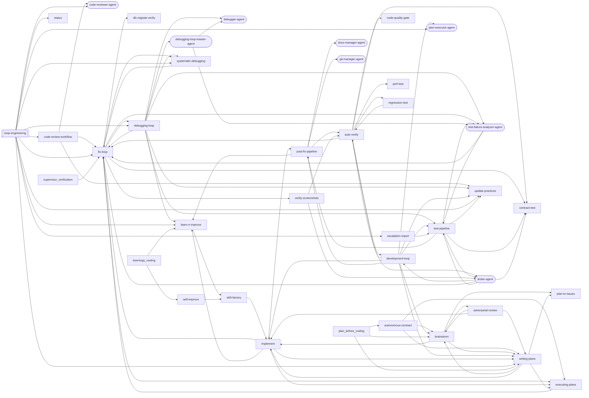

### adversarial-review

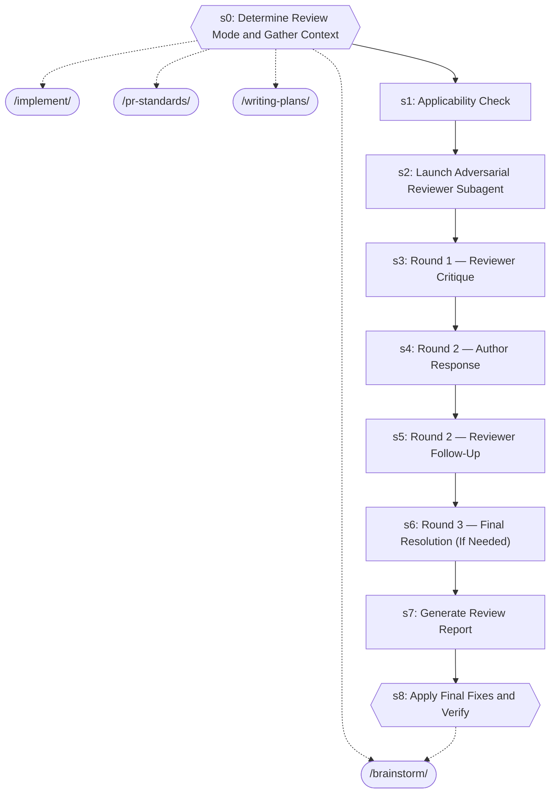

| Step | Title | Delegates To | Artifacts | Gates/Decisions |
|------|-------|-------------|-----------|----------------|
| 0 | Determine Review Mode and Gather Context | `/brainstorm`, `/implement`, `/pr-standards`, `/writing-plans` | — | gate |
| 1 | Applicability Check | — | — | — |
| 2 | Launch Adversarial Reviewer Subagent | — | — | — |
| 3 | Round 1 — Reviewer Critique | — | — | — |
| 4 | Round 2 — Author Response | — | — | — |
| 5 | Round 2 — Reviewer Follow-Up | — | — | — |
| 6 | Round 3 — Final Resolution (If Needed) | — | — | — |
| 7 | Generate Review Report | — | — | — |
| 8 | Apply Final Fixes and Verify | `/brainstorm` | — | gate, decision |

### auto-verify

```mermaid
graph TD
    s0{{s0: Gate Check — Read Upstream Results}}
    s0_block[/BLOCK/]
    s0 -->|FAILED| s0_block
    s1{{s1: Map Changes to Tests (via /regression-test)}}
    s0 -->|OK| s1
    development_loop_ext([/development-loop/])
    s1 -.-> development_loop_ext
    regression_test_ext([/regression-test/])
    s1 -.-> regression_test_ext
    tester_agent_ext((tester-agent))
    s1 -.-> tester_agent_ext
    s2{{s2: Execute Tests (via tester-agent)}}
    s1 --> s2
    tester_agent_ext((tester-agent))
    s2 -.-> tester_agent_ext
    s3{{s3: Evaluate Results}}
    s2 --> s3
    fix_loop_ext([/fix-loop/])
    s3 -.-> fix_loop_ext
    s4{{s4: Quality Gate (if tests pass)}}
    s3 --> s4
    code_quality_gate_ext([/code-quality-gate/])
    s4 -.-> code_quality_gate_ext
    s4A{{s4A: Contract Verification (if API changed)}}
    s4 --> s4A
    contract_test_ext([/contract-test/])
    s4A -.-> contract_test_ext
    s4B{{s4B: Performance Baseline (if perf-sensitive code changed)}}
    s4A --> s4B
    perf_test_ext([/perf-test/])
    s4B -.-> perf_test_ext
    s5{{s5: Report}}
    s4B --> s5
    s6{{s6: Structured Output}}
    s5 --> s6
    development_loop_ext([/development-loop/])
    s6 -.-> development_loop_ext
    fix_loop_ext([/fix-loop/])
    s6 -.-> fix_loop_ext
    regression_test_ext([/regression-test/])
    s6 -.-> regression_test_ext
    tester_agent_ext((tester-agent))
    s6 -.-> tester_agent_ext
```

| Step | Title | Delegates To | Artifacts | Gates/Decisions |
|------|-------|-------------|-----------|----------------|
| 0 | Gate Check — Read Upstream Results | — | → `test-results/fix-loop.json`, ← `test-results/fix-loop.json` | gate, decision, BLOCK, STEP 1 |
| 1 | Map Changes to Tests (via /regression-test) | `/development-loop`, `/regression-test`, `tester-agent` | → `test-results/regression-test.json`, ← `test-results/regression-test.json` | gate, decision |
| 2 | Execute Tests (via tester-agent) | `tester-agent` | → `test-evidence/{run_id}/manifest.json`, → `test-evidence/{run_id}/visual-review.json`, → `test-results/auto-verify.json` | gate, decision, STEP 3, STEP 2 |
| 3 | Evaluate Results | `/fix-loop` | — | gate, STEP 4 |
| 4 | Quality Gate (if tests pass) | `/code-quality-gate` | — | gate, decision |
| 4A | Contract Verification (if API changed) | `/contract-test` | — | gate, decision |
| 4B | Performance Baseline (if perf-sensitive code changed) | `/perf-test` | — | gate, decision |
| 5 | Report | — | — | gate |
| 6 | Structured Output | `/development-loop`, `/fix-loop`, `/regression-test`, `tester-agent` | → `test-results/auto-verify.json` | gate, decision |

### autonomous-contract

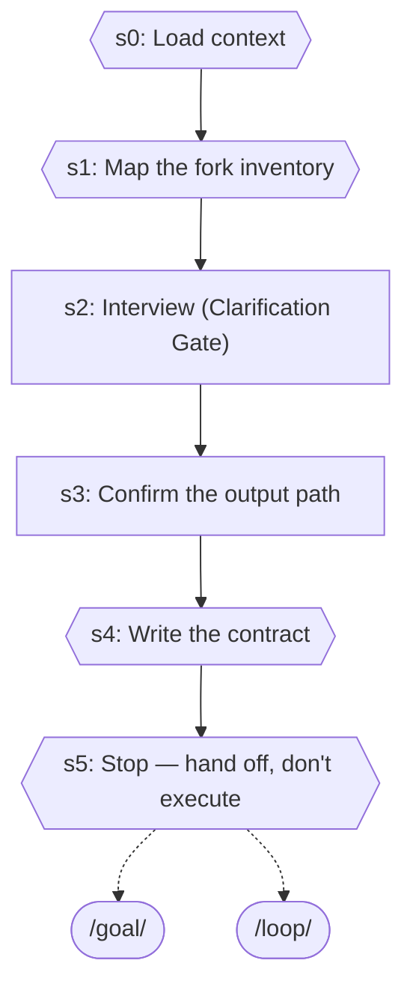

| Step | Title | Delegates To | Artifacts | Gates/Decisions |
|------|-------|-------------|-----------|----------------|
| 0 | Load context | — | — | gate |
| 1 | Map the fork inventory | — | — | gate |
| 2 | Interview (Clarification Gate) | — | — | — |
| 3 | Confirm the output path | — | — | — |
| 4 | Write the contract | — | — | gate, decision |
| 5 | Stop — hand off, don't execute | `/goal`, `/loop` | — | gate |

### brainstorm

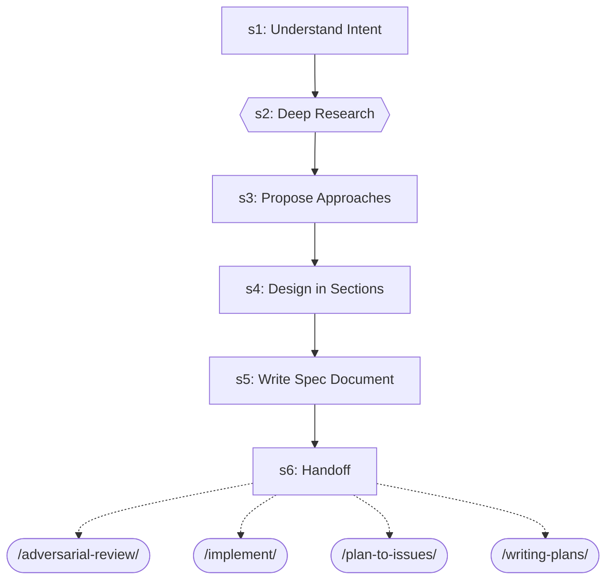

| Step | Title | Delegates To | Artifacts | Gates/Decisions |
|------|-------|-------------|-----------|----------------|
| 1 | Understand Intent | — | — | — |
| 2 | Deep Research | — | — | gate |
| 3 | Propose Approaches | — | — | — |
| 4 | Design in Sections | — | — | — |
| 5 | Write Spec Document | — | — | — |
| 6 | Handoff | `/adversarial-review`, `/implement`, `/plan-to-issues`, `/writing-plans` | — | — |

### code-quality-gate

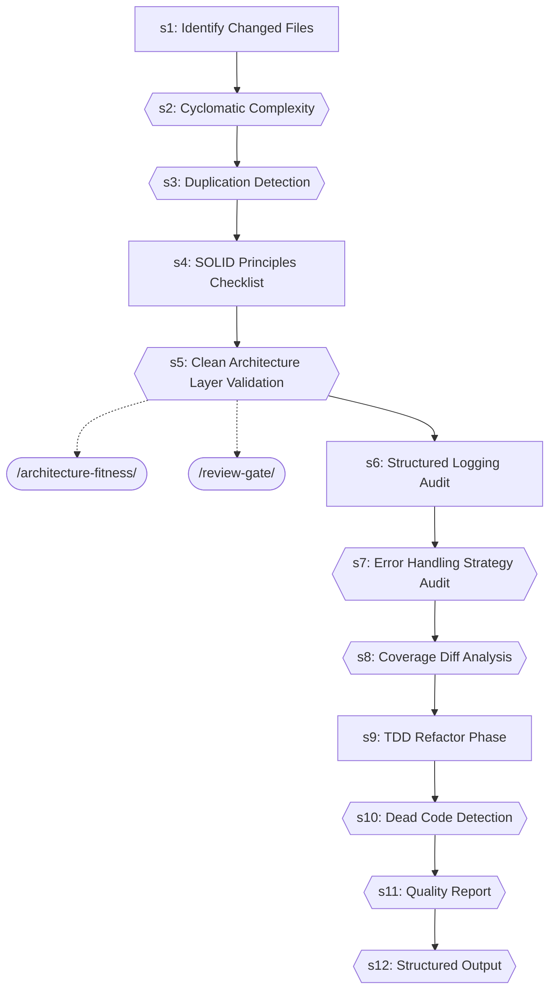

| Step | Title | Delegates To | Artifacts | Gates/Decisions |
|------|-------|-------------|-----------|----------------|
| 1 | Identify Changed Files | — | — | — |
| 2 | Cyclomatic Complexity | — | — | gate |
| 3 | Duplication Detection | — | — | gate |
| 4 | SOLID Principles Checklist | — | — | — |
| 5 | Clean Architecture Layer Validation | `/architecture-fitness`, `/review-gate` | — | gate |
| 6 | Structured Logging Audit | — | — | — |
| 7 | Error Handling Strategy Audit | — | — | gate |
| 8 | Coverage Diff Analysis | — | — | gate |
| 9 | TDD Refactor Phase | — | — | — |
| 10 | Dead Code Detection | — | — | gate |
| 11 | Quality Report | — | — | gate |
| 12 | Structured Output | — | → `test-results/code-quality-gate.json` | gate, decision |

### code-review-workflow

```mermaid
graph TD
    s1{{s1: INIT}}
    update_practices_ext([/update-practices/])
    s1 -.-> update_practices_ext
    code_reviewer_agent_ext((code-reviewer-agent))
    s1 -.-> code_reviewer_agent_ext
    security_auditor_agent_ext((security-auditor-agent))
    s1 -.-> security_auditor_agent_ext
    s1_block[/BLOCK/]
    s1 -->|FAILED| s1_block
    s2{{s2: QUALITY_GATES}}
    s1 -->|OK| s2
    fix_loop_ext([/fix-loop/])
    s2 -.-> fix_loop_ext
    review_gate_ext([/review-gate/])
    s2 -.-> review_gate_ext
    s2b{{s2b: DEEP_AUDIT (optional, --deep-audit flag)}}
    s2 --> s2b
    review_gate_ext([/review-gate/])
    s2b -.-> review_gate_ext
    s3["s3: CREATE_PR"]
    s2b --> s3
    request_code_review_ext([/request-code-review/])
    s3 -.-> request_code_review_ext
    s4{{s4: HANDLE_FEEDBACK}}
    s3 --> s4
    receive_code_review_ext([/receive-code-review/])
    s4 -.-> receive_code_review_ext
    s5{{s5: REPORT}}
    s4 --> s5
    code_review_master_agent_ext((code-review-master-agent))
    s5 -.-> code_review_master_agent_ext
```

| Step | Title | Delegates To | Artifacts | Gates/Decisions |
|------|-------|-------------|-----------|----------------|
| 1 | INIT | `/update-practices`, `code-reviewer-agent`, `security-auditor-agent` | — | gate, decision, BLOCK |
| 2 | QUALITY_GATES | `/fix-loop`, `/review-gate` | → `test-results/review-gate.json` | gate |
| 2b | DEEP_AUDIT (optional, --deep-audit flag) | `/review-gate` | — | gate, decision |
| 3 | CREATE_PR | `/request-code-review` | — | decision |
| 4 | HANDLE_FEEDBACK | `/receive-code-review` | — | gate |
| 5 | REPORT | `code-review-master-agent` | → `test-results/code-review-verdict.json` | gate, decision |

### contract-test

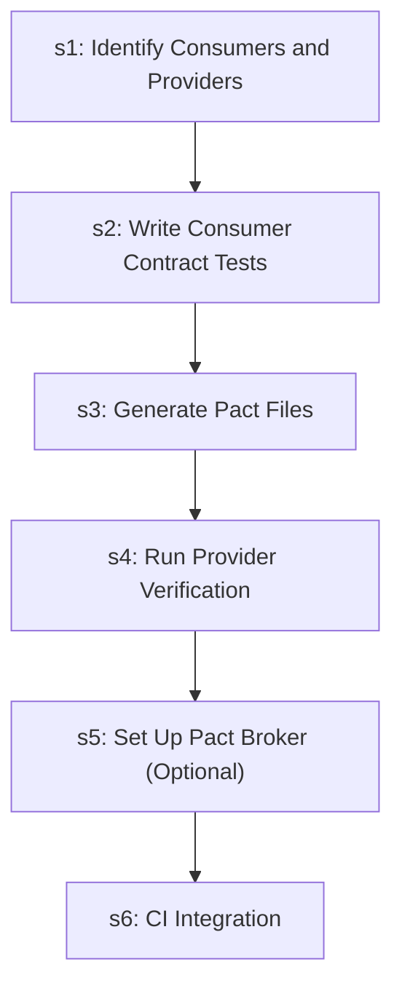

| Step | Title | Delegates To | Artifacts | Gates/Decisions |
|------|-------|-------------|-----------|----------------|
| 1 | Identify Consumers and Providers | — | — | — |
| 2 | Write Consumer Contract Tests | — | — | — |
| 3 | Generate Pact Files | — | — | — |
| 4 | Run Provider Verification | — | — | — |
| 5 | Set Up Pact Broker (Optional) | — | — | — |
| 6 | CI Integration | — | — | decision |

### db-migrate-verify

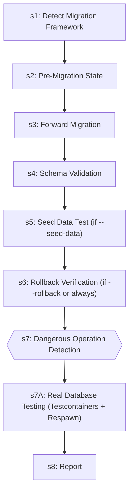

| Step | Title | Delegates To | Artifacts | Gates/Decisions |
|------|-------|-------------|-----------|----------------|
| 1 | Detect Migration Framework | — | — | — |
| 2 | Pre-Migration State | — | — | — |
| 3 | Forward Migration | — | — | — |
| 4 | Schema Validation | — | — | — |
| 5 | Seed Data Test (if --seed-data) | — | — | — |
| 6 | Rollback Verification (if --rollback or always) | — | — | — |
| 7 | Dangerous Operation Detection | — | — | gate, decision |
| 7A | Real Database Testing (Testcontainers + Respawn) | — | — | — |
| 8 | Report | — | — | decision |

### debugging-loop

```mermaid
graph TD
    s1{{s1: INIT}}
    systematic_debugging_ext([/systematic-debugging/])
    s1 -.-> systematic_debugging_ext
    update_practices_ext([/update-practices/])
    s1 -.-> update_practices_ext
    debugger_agent_ext((debugger-agent))
    s1 -.-> debugger_agent_ext
    test_failure_analyzer_agent_ext((test-failure-analyzer-agent))
    s1 -.-> test_failure_analyzer_agent_ext
    s1_block[/BLOCK/]
    s1 -->|FAILED| s1_block
    s2{{s2: DIAGNOSE}}
    s1 -->|OK| s2
    systematic_debugging_ext([/systematic-debugging/])
    s2 -.-> systematic_debugging_ext
    s3{{s3: FIX}}
    s2 --> s3
    autofix_pr_ext([/autofix-pr/])
    s3 -.-> autofix_pr_ext
    fix_loop_ext([/fix-loop/])
    s3 -.-> fix_loop_ext
    s4{{s4: VERIFY}}
    s3 --> s4
    fix_loop_ext([/fix-loop/])
    s4 -.-> fix_loop_ext
    test_pipeline_ext([/test-pipeline/])
    s4 -.-> test_pipeline_ext
    s5{{s5: LEARN (mandatory)}}
    s4 --> s5
    learn_n_improve_ext([/learn-n-improve/])
    s5 -.-> learn_n_improve_ext
    s6{{s6: REPORT}}
    s5 --> s6
    debugger_agent_ext((debugger-agent))
    s6 -.-> debugger_agent_ext
    debugging_loop_master_agent_ext((debugging-loop-master-agent))
    s6 -.-> debugging_loop_master_agent_ext
```

| Step | Title | Delegates To | Artifacts | Gates/Decisions |
|------|-------|-------------|-----------|----------------|
| 1 | INIT | `/systematic-debugging`, `/update-practices`, `debugger-agent`, `test-failure-analyzer-agent` | — | gate, decision, BLOCK |
| 2 | DIAGNOSE | `/systematic-debugging` | — | gate, decision |
| 3 | FIX | `/autofix-pr`, `/fix-loop` | → `test-results/fix-loop.json` | gate, decision |
| 4 | VERIFY | `/fix-loop`, `/test-pipeline` | → `test-results/auto-verify.json`, ← `test-results/auto-verify.json` | gate, decision |
| 5 | LEARN (mandatory) | `/learn-n-improve` | — | gate |
| 6 | REPORT | `debugger-agent`, `debugging-loop-master-agent` | → `test-results/debugging-loop-verdict.json` | gate, decision |

### development-loop

```mermaid
graph TD
    s1{{s1: INIT}}
    plan_executor_agent_ext((plan-executor-agent))
    s1 -.-> plan_executor_agent_ext
    planner_researcher_agent_ext((planner-researcher-agent))
    s1 -.-> planner_researcher_agent_ext
    s1_block[/BLOCK/]
    s1 -->|FAILED| s1_block
    s2{{s2: IDEATE (skip if complexity=Simple or Medium)}}
    s1 -->|OK| s2
    brainstorm_ext([/brainstorm/])
    s2 -.-> brainstorm_ext
    s3["s3: PLAN (skip if complexity=Simple)"]
    s2 --> s3
    writing_plans_ext([/writing-plans/])
    s3 -.-> writing_plans_ext
    s4{{s4: EXECUTE}}
    s3 --> s4
    s5{{s5: VERIFY}}
    s4 --> s5
    auto_verify_ext([/auto-verify/])
    s5 -.-> auto_verify_ext
    test_pipeline_ext([/test-pipeline/])
    s5 -.-> test_pipeline_ext
    s6{{s6: COMMIT}}
    s5 --> s6
    post_fix_pipeline_ext([/post-fix-pipeline/])
    s6 -.-> post_fix_pipeline_ext
    s7{{s7: REPORT}}
    s6 --> s7
    development_loop_master_agent_ext((development-loop-master-agent))
    s7 -.-> development_loop_master_agent_ext
```

| Step | Title | Delegates To | Artifacts | Gates/Decisions |
|------|-------|-------------|-----------|----------------|
| 1 | INIT | `plan-executor-agent`, `planner-researcher-agent` | → `test-results/development-loop-verdict.json` | gate, decision, BLOCK |
| 2 | IDEATE (skip if complexity=Simple or Medium) | `/brainstorm` | — | gate |
| 3 | PLAN (skip if complexity=Simple) | `/writing-plans` | — | — |
| 4 | EXECUTE | — | — | gate, decision |
| 5 | VERIFY | `/auto-verify`, `/test-pipeline` | → `test-results/auto-verify.json`, ← `test-results/auto-verify.json` | gate, decision |
| 6 | COMMIT | `/post-fix-pipeline` | — | gate, decision |
| 7 | REPORT | `development-loop-master-agent` | → `test-results/auto-verify.json`, → `test-results/development-loop-verdict.json` | gate, decision |

### escalation-report

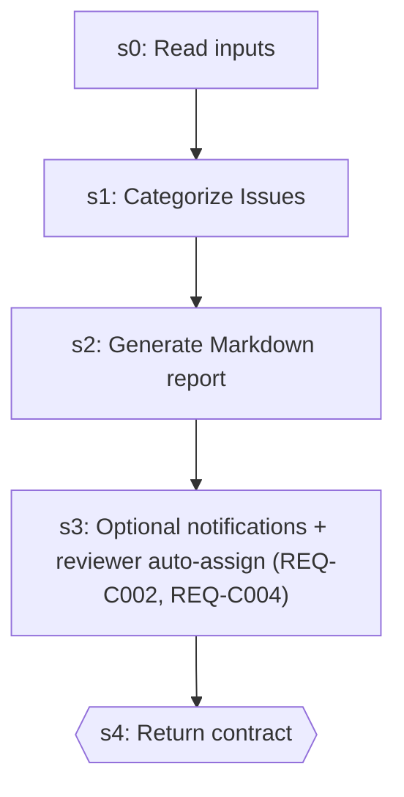

| Step | Title | Delegates To | Artifacts | Gates/Decisions |
|------|-------|-------------|-----------|----------------|
| 0 | Read inputs | — | — | — |
| 1 | Categorize Issues | — | — | — |
| 2 | Generate Markdown report | — | — | decision |
| 3 | Optional notifications + reviewer auto-assign (REQ-C002, REQ-C004) | — | — | — |
| 4 | Return contract | — | — | gate |

### executing-plans

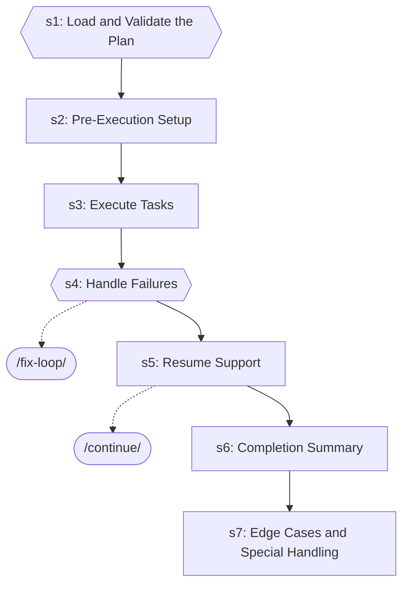

| Step | Title | Delegates To | Artifacts | Gates/Decisions |
|------|-------|-------------|-----------|----------------|
| 1 | Load and Validate the Plan | — | — | gate, decision |
| 2 | Pre-Execution Setup | — | — | — |
| 3 | Execute Tasks | — | — | — |
| 4 | Handle Failures | `/fix-loop` | — | gate, decision |
| 5 | Resume Support | `/continue` | — | decision |
| 6 | Completion Summary | — | — | — |
| 7 | Edge Cases and Special Handling | — | — | decision |

### fix-loop

```mermaid
graph TD
    s1{{s1: Analyze Failure (via test-failure-analyzer-agent)}}
    test_failure_analyzer_agent_ext((test-failure-analyzer-agent))
    s1 -.-> test_failure_analyzer_agent_ext
    s1A["s1A: Flaky Test Detection"]
    s1 --> s1A
    s2["s2: Apply Fix"]
    s1A --> s2
    s3["s3: Retest (Full Loop mode only)"]
    s2 --> s3
    s4["s4: Report"]
    s3 --> s4
    s5{{s5: Structured Output}}
    s4 --> s5
```

| Step | Title | Delegates To | Artifacts | Gates/Decisions |
|------|-------|-------------|-----------|----------------|
| 1 | Analyze Failure (via test-failure-analyzer-agent) | `test-failure-analyzer-agent` | — | gate, decision |
| 1A | Flaky Test Detection | — | — | decision |
| 2 | Apply Fix | — | — | — |
| 3 | Retest (Full Loop mode only) | — | — | decision |
| 4 | Report | — | — | — |
| 5 | Structured Output | — | → `test-results/fix-loop.json` | gate, decision |

### implement

```mermaid
graph TD
    s1["s1: Analyze Requirements"]
    writing_plans_ext([/writing-plans/])
    s1 -.-> writing_plans_ext
    s2["s2: Create/Update Tests"]
    s1 --> s2
    s3["s3: Implement the Feature"]
    s2 --> s3
    s4["s4: Run Tests"]
    s3 --> s4
    s5{{s5: Fix Loop (if tests fail)}}
    s4 --> s5
    fix_loop_ext([/fix-loop/])
    s5 -.-> fix_loop_ext
    s6{{s6: Verification (Mandatory Gate)}}
    s5 --> s6
    post_fix_pipeline_ext([/post-fix-pipeline/])
    s6 -.-> post_fix_pipeline_ext
    s7["s7: Post-Implementation (Optional)"]
    s6 --> s7
    executing_plans_ext([/executing-plans/])
    s7 -.-> executing_plans_ext
    s8{{s8: Structured Output}}
    s7 --> s8
    fix_loop_ext([/fix-loop/])
    s8 -.-> fix_loop_ext
```

| Step | Title | Delegates To | Artifacts | Gates/Decisions |
|------|-------|-------------|-----------|----------------|
| 1 | Analyze Requirements | `/writing-plans` | — | — |
| 2 | Create/Update Tests | — | — | — |
| 3 | Implement the Feature | — | — | — |
| 4 | Run Tests | — | — | decision |
| 5 | Fix Loop (if tests fail) | `/fix-loop` | — | gate |
| 6 | Verification (Mandatory Gate) | `/post-fix-pipeline` | — | gate, decision |
| 7 | Post-Implementation (Optional) | `/executing-plans` | — | — |
| 8 | Structured Output | `/fix-loop` | → `test-results/implement.json` | gate, decision |

### learn-n-improve

```mermaid
graph TD
    s1{{s1: Gather Session Evidence}}
    s2["s2: Analyze Outcomes"]
    s1 --> s2
    s3{{s3: Build Error→Fix→Lesson Database}}
    s2 --> s3
    s4["s4: Update Memory Topics"]
    s3 --> s4
    s5{{s5: Pattern Detection (every 10th learning)}}
    s4 --> s5
    s6["s6: Report"]
    s5 --> s6
```

| Step | Title | Delegates To | Artifacts | Gates/Decisions |
|------|-------|-------------|-----------|----------------|
| 1 | Gather Session Evidence | — | → `test-results/*.json` | gate, decision |
| 2 | Analyze Outcomes | — | — | — |
| 3 | Build Error→Fix→Lesson Database | — | — | gate, decision |
| 4 | Update Memory Topics | — | — | — |
| 5 | Pattern Detection (every 10th learning) | — | — | gate |
| 6 | Report | — | — | — |

### loop-engineering

```mermaid
graph TD
    s1{{s1: INIT}}
    code_reviewer_agent_ext((code-reviewer-agent))
    s1 -.-> code_reviewer_agent_ext
    plan_executor_agent_ext((plan-executor-agent))
    s1 -.-> plan_executor_agent_ext
    s1_block[/BLOCK/]
    s1 -->|FAILED| s1_block
    s2["s2: DISCOVER (the automation heartbeat)"]
    s1 -->|OK| s2
    status_ext([/status/])
    s2 -.-> status_ext
    s3["s3: PLAN"]
    s2 --> s3
    writing_plans_ext([/writing-plans/])
    s3 -.-> writing_plans_ext
    s4{{s4: EXECUTE — the MAKER (isolated)}}
    s3 --> s4
    s5{{s5: VERIFY — the CHECKER (independent; maker ≠ checker)}}
    s4 --> s5
    s6["s6: GATE → SHIP or FEEDBACK"]
    s5 --> s6
    s7["s7: LEARN (self-learning, every shipped cycle)"]
    s6 --> s7
    learn_n_improve_ext([/learn-n-improve/])
    s7 -.-> learn_n_improve_ext
    s8{{s8: REPORT}}
    s7 --> s8
    code_review_workflow_ext([/code-review-workflow/])
    s8 -.-> code_review_workflow_ext
    escalation_report_ext([/escalation-report/])
    s8 -.-> escalation_report_ext
    learn_n_improve_ext([/learn-n-improve/])
    s8 -.-> learn_n_improve_ext
    code_reviewer_agent_ext((code-reviewer-agent))
    s8 -.-> code_reviewer_agent_ext
    plan_executor_agent_ext((plan-executor-agent))
    s8 -.-> plan_executor_agent_ext
```

| Step | Title | Delegates To | Artifacts | Gates/Decisions |
|------|-------|-------------|-----------|----------------|
| 1 | INIT | `code-reviewer-agent`, `plan-executor-agent` | → `test-results/loop-engineering-verdict.json` | gate, decision, BLOCK |
| 2 | DISCOVER (the automation heartbeat) | `/status` | — | — |
| 3 | PLAN | `/writing-plans` | — | — |
| 4 | EXECUTE — the MAKER (isolated) | — | — | gate, decision |
| 5 | VERIFY — the CHECKER (independent; maker ≠ checker) | — | → `test-results/auto-verify.json`, ← `test-results/auto-verify.json` | gate, STEP 6 |
| 6 | GATE → SHIP or FEEDBACK | — | → `test-results/auto-verify.json` | STEP 7 |
| 7 | LEARN (self-learning, every shipped cycle) | `/learn-n-improve` | — | — |
| 8 | REPORT | `/code-review-workflow`, `/escalation-report`, `/learn-n-improve`, `code-reviewer-agent`, `plan-executor-agent` | → `test-results/loop-engineering-verdict.json` | gate, decision |

### perf-test

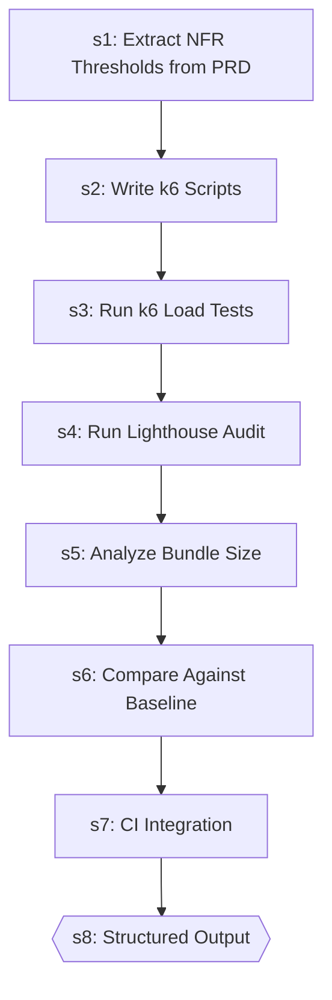

| Step | Title | Delegates To | Artifacts | Gates/Decisions |
|------|-------|-------------|-----------|----------------|
| 1 | Extract NFR Thresholds from PRD | — | — | decision |
| 2 | Write k6 Scripts | — | — | — |
| 3 | Run k6 Load Tests | — | — | — |
| 4 | Run Lighthouse Audit | — | — | — |
| 5 | Analyze Bundle Size | — | — | — |
| 6 | Compare Against Baseline | — | — | — |
| 7 | CI Integration | — | — | — |
| 8 | Structured Output | — | → `test-results/perf-test.json` | gate |

### plan-to-issues

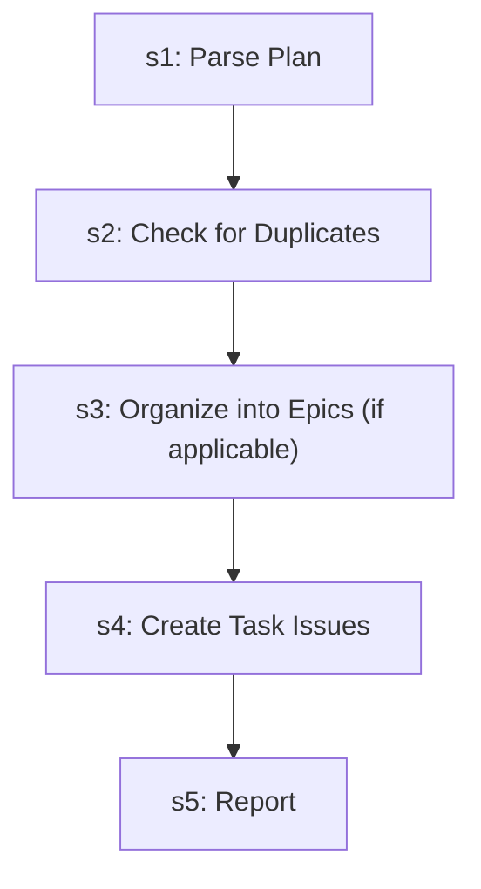

| Step | Title | Delegates To | Artifacts | Gates/Decisions |
|------|-------|-------------|-----------|----------------|
| 1 | Parse Plan | — | — | — |
| 2 | Check for Duplicates | — | — | — |
| 3 | Organize into Epics (if applicable) | — | — | — |
| 4 | Create Task Issues | — | — | — |
| 5 | Report | — | — | — |

### post-fix-pipeline

```mermaid
graph TD
    s0{{s0: Gate Check — Read Upstream Results}}
    s0_block[/BLOCK/]
    s0 -->|FAILED| s0_block
    s1{{s1: Documentation Updates}}
    s0 -->|OK| s1
    docs_manager_agent_ext((docs-manager-agent))
    s1 -.-> docs_manager_agent_ext
    s2{{s2: Git Commit}}
    s1 --> s2
    git_manager_agent_ext((git-manager-agent))
    s2 -.-> git_manager_agent_ext
    s3["s3: Learning Capture"]
    s2 --> s3
    s4{{s4: Structured JSON Output}}
    s3 --> s4
    learn_n_improve_ext([/learn-n-improve/])
    s4 -.-> learn_n_improve_ext
```

| Step | Title | Delegates To | Artifacts | Gates/Decisions |
|------|-------|-------------|-----------|----------------|
| 0 | Gate Check — Read Upstream Results | — | → `test-evidence/*/visual-review.json`, → `test-results/auto-verify.json`, ← `test-evidence/*/visual-review.json`, ← `test-results/auto-verify.json` | gate, decision, BLOCK |
| 1 | Documentation Updates | `docs-manager-agent` | — | gate |
| 2 | Git Commit | `git-manager-agent` | — | gate, decision |
| 3 | Learning Capture | — | — | — |
| 4 | Structured JSON Output | `/learn-n-improve` | → `test-results/post-fix-pipeline.json` | gate, decision |

### regression-test

```mermaid
graph TD
    s1{{s1: Identify Changes}}
    s2["s2: Map Changes to Tests"]
    s1 --> s2
    s3["s3: Classify Risk"]
    s2 --> s3
    s4{{s4: Execute Targeted Tests}}
    s3 --> s4
    s5["s5: Expand to Full Suite"]
    s4 --> s5
    s6{{s6: Report}}
    s5 --> s6
    auto_verify_ext([/auto-verify/])
    s6 -.-> auto_verify_ext
```

| Step | Title | Delegates To | Artifacts | Gates/Decisions |
|------|-------|-------------|-----------|----------------|
| 1 | Identify Changes | — | → `test-results/regression-test.json` | gate |
| 2 | Map Changes to Tests | — | — | decision |
| 3 | Classify Risk | — | — | — |
| 4 | Execute Targeted Tests | — | → `test-results/regression-test.json` | gate |
| 5 | Expand to Full Suite | — | — | — |
| 6 | Report | `/auto-verify` | → `test-results/regression-test.json` | gate, decision |

### self-improve

```mermaid
graph TD
    s1["s1: Parse Mode"]
    s2["s2: External Discovery Scan"]
    s1 --> s2
    github_ext([/github/])
    s2 -.-> github_ext
    reddit_ext([/reddit/])
    s2 -.-> reddit_ext
    s3{{s3: Session Learning Capture}}
    s2 --> s3
    test_knowledge_ext([/test-knowledge/])
    s3 -.-> test_knowledge_ext
    s4["s4: Review Pending Improvements"]
    s3 --> s4
    s5["s5: Propose Improvements"]
    s4 --> s5
    claude_guardian_ext([/claude-guardian/])
    s5 -.-> claude_guardian_ext
    writing_skills_ext([/writing-skills/])
    s5 -.-> writing_skills_ext
```

| Step | Title | Delegates To | Artifacts | Gates/Decisions |
|------|-------|-------------|-----------|----------------|
| 1 | Parse Mode | — | — | — |
| 2 | External Discovery Scan | `/github`, `/reddit` | — | — |
| 3 | Session Learning Capture | `/test-knowledge` | — | gate, decision |
| 4 | Review Pending Improvements | — | — | decision |
| 5 | Propose Improvements | `/claude-guardian`, `/writing-skills` | — | — |

### skill-factory

```mermaid
graph TD
    s1{{s1: Mode Detection}}
    claude_guardian_ext([/claude-guardian/])
    s1 -.-> claude_guardian_ext
    fix_github_issue_ext([/fix-github-issue/])
    s1 -.-> fix_github_issue_ext
    implement_ext([/implement/])
    s1 -.-> implement_ext
    tdd_ext([/tdd/])
    s1 -.-> tdd_ext
    writing_skills_ext([/writing-skills/])
    s1 -.-> writing_skills_ext
```

| Step | Title | Delegates To | Artifacts | Gates/Decisions |
|------|-------|-------------|-----------|----------------|
| 1 | Mode Detection | `/claude-guardian`, `/fix-github-issue`, `/implement`, `/tdd`, `/writing-skills` | — | gate, decision |

### systematic-debugging

```mermaid
graph TD
    s0["s0: Search Past Learnings"]
    s1["s1: Reproduce the Failure"]
    s0 --> s1
    s2["s2: Isolate the Failure"]
    s1 --> s2
    s3["s3: Form Hypotheses"]
    s2 --> s3
    s4{{s4: Gather Evidence}}
    s3 --> s4
    s5["s5: Root Cause Analysis"]
    s4 --> s5
    s6["s6: Apply a Targeted Fix"]
    s5 --> s6
    s7["s7: Verify the Fix"]
    s6 --> s7
    s8["s8: Prevent Recurrence"]
    s7 --> s8
    s9["s9: Auto-Record Learning (MANDATORY)"]
    s8 --> s9
```

| Step | Title | Delegates To | Artifacts | Gates/Decisions |
|------|-------|-------------|-----------|----------------|
| 0 | Search Past Learnings | — | — | decision |
| 1 | Reproduce the Failure | — | — | decision |
| 2 | Isolate the Failure | — | — | decision |
| 3 | Form Hypotheses | — | — | — |
| 4 | Gather Evidence | — | — | gate |
| 5 | Root Cause Analysis | — | — | — |
| 6 | Apply a Targeted Fix | — | — | — |
| 7 | Verify the Fix | — | — | decision |
| 8 | Prevent Recurrence | — | — | — |
| 9 | Auto-Record Learning (MANDATORY) | — | — | decision |

### test-pipeline

```mermaid
graph TD
    s1{{s1: INIT}}
    fastapi_api_tester_agent_ext((fastapi-api-tester-agent))
    s1 -.-> fastapi_api_tester_agent_ext
    github_issue_manager_agent_ext((github-issue-manager-agent))
    s1 -.-> github_issue_manager_agent_ext
    test_failure_analyzer_agent_ext((test-failure-analyzer-agent))
    s1 -.-> test_failure_analyzer_agent_ext
    test_scout_agent_ext((test-scout-agent))
    s1 -.-> test_scout_agent_ext
    tester_agent_ext((tester-agent))
    s1 -.-> tester_agent_ext
    visual_inspector_agent_ext((visual-inspector-agent))
    s1 -.-> visual_inspector_agent_ext
    s1_block[/BLOCK/]
    s1 -->|FAILED| s1_block
    s2{{s2: SCOUT}}
    s1 -->|OK| s2
    fastapi_run_backend_tests_ext([/fastapi-run-backend-tests/])
    s2 -.-> fastapi_run_backend_tests_ext
    jest_dev_ext([/jest-dev/])
    s2 -.-> jest_dev_ext
    pytest_dev_ext([/pytest-dev/])
    s2 -.-> pytest_dev_ext
    vitest_dev_ext([/vitest-dev/])
    s2 -.-> vitest_dev_ext
    s2_block[/BLOCK/]
    s2 -->|FAILED| s2_block
    s3{{s3: WAVE 1 — Functional + API + UI (parallel runners)}}
    s2 -->|OK| s3
    contract_test_ext([/contract-test/])
    s3 -.-> contract_test_ext
    integration_test_ext([/integration-test/])
    s3 -.-> integration_test_ext
    tester_agent_ext((tester-agent))
    s3 -.-> tester_agent_ext
    s4{{s4: WAVE 2 — UI Visual Verification}}
    s3 --> s4
    visual_inspector_agent_ext((visual-inspector-agent))
    s4 -.-> visual_inspector_agent_ext
    s5{{s5: JOIN + Manifest Reconciliation + Per-Test Report}}
    s4 --> s5
    s6{{s6: TRIAGE (Inline at T0)}}
    s5 --> s6
    android_fixer_agent_ext((android-fixer-agent))
    s6 -.-> android_fixer_agent_ext
    fastapi_fixer_agent_ext((fastapi-fixer-agent))
    s6 -.-> fastapi_fixer_agent_ext
    react_fixer_agent_ext((react-fixer-agent))
    s6 -.-> react_fixer_agent_ext
    s7{{s7: VERIFY-AFFECTED}}
    s6 --> s7
    s7_block[/BLOCK/]
    s7 -->|FAILED| s7_block
    s8{{s8: FINAL FULL-SUITE PASS}}
    s7 -->|OK| s8
    s9{{s9: COMMIT + REPORT}}
    s8 --> s9
    post_fix_pipeline_ext([/post-fix-pipeline/])
    s9 -.-> post_fix_pipeline_ext
    update_practices_ext([/update-practices/])
    s9 -.-> update_practices_ext
    failure_triage_agent_ext((failure-triage-agent))
    s9 -.-> failure_triage_agent_ext
    test_pipeline_agent_ext((test-pipeline-agent))
    s9 -.-> test_pipeline_agent_ext
    testing_pipeline_master_agent_ext((testing-pipeline-master-agent))
    s9 -.-> testing_pipeline_master_agent_ext
```

| Step | Title | Delegates To | Artifacts | Gates/Decisions |
|------|-------|-------------|-----------|----------------|
| 1 | INIT | `fastapi-api-tester-agent`, `github-issue-manager-agent`, `test-failure-analyzer-agent`, `test-scout-agent`, `tester-agent`, `visual-inspector-agent` | → `test-results/pipeline-verdict.json` | gate, decision, BLOCK |
| 2 | SCOUT | `/fastapi-run-backend-tests`, `/jest-dev`, `/pytest-dev`, `/vitest-dev` | → `test-results/manifest.json` | gate, decision, BLOCK |
| 3 | WAVE 1 — Functional + API + UI (parallel runners) | `/contract-test`, `/integration-test`, `tester-agent` | → `test-results/api.json`, → `test-results/functional.json`, → `test-results/manifest.json`, → `test-results/ui.json`, → `test-results/{lane}.json`, ← `test-results/functional.json` | gate |
| 4 | WAVE 2 — UI Visual Verification | `visual-inspector-agent` | → `test-results/ui-verification.json`, → `test-results/ui.json`, ← `test-results/ui-verification.json`, ← `test-results/ui.json` | gate |
| 5 | JOIN + Manifest Reconciliation + Per-Test Report | — | → `test-results/manifest.json`, → `test-results/pipeline-verdict.json`, → `test-results/{lane}.json`, ← `test-results/manifest.json` | gate, decision |
| 6 | TRIAGE (Inline at T0) | `android-fixer-agent`, `fastapi-fixer-agent`, `react-fixer-agent` | — | gate |
| 7 | VERIFY-AFFECTED | — | — | gate, decision, BLOCK, STEP 8 |
| 8 | FINAL FULL-SUITE PASS | — | — | gate, decision |
| 9 | COMMIT + REPORT | `/post-fix-pipeline`, `/update-practices`, `failure-triage-agent`, `test-pipeline-agent`, `testing-pipeline-master-agent` | → `test-results/pipeline-verdict.json` | gate, decision |

### update-practices

```mermaid
graph TD
    s1["s1: Read Sync Config"]
    s2["s2: Fetch Hub Registry + Hub Config Inventory"]
    s1 --> s2
    s3["s3: Compare — Patterns"]
    s2 --> s3
    s3b["s3b: Compare — Configs (NEW in v1.1.0)"]
    s3 --> s3b
    s4["s4: Show Diffs"]
    s3b --> s4
    s5{{s5: Apply Updates}}
    s4 --> s5
    s6["s6: Report"]
    s5 --> s6
```

| Step | Title | Delegates To | Artifacts | Gates/Decisions |
|------|-------|-------------|-----------|----------------|
| 1 | Read Sync Config | — | — | decision |
| 2 | Fetch Hub Registry + Hub Config Inventory | — | — | — |
| 3 | Compare — Patterns | — | — | decision |
| 3b | Compare — Configs (NEW in v1.1.0) | — | — | decision |
| 4 | Show Diffs | — | — | — |
| 5 | Apply Updates | — | — | gate, decision |
| 6 | Report | — | — | — |

### verify-screenshots

```mermaid
graph TD
    s1["s1: File Validation"]
    tester_agent_ext((tester-agent))
    s1 -.-> tester_agent_ext
    s2["s2: Content Analysis"]
    s1 --> s2
    s3["s3: Before/After Comparison (if applicable)"]
    s2 --> s3
    s4{{s4: Report}}
    s3 --> s4
```

| Step | Title | Delegates To | Artifacts | Gates/Decisions |
|------|-------|-------------|-----------|----------------|
| 1 | File Validation | `tester-agent` | — | decision |
| 2 | Content Analysis | — | — | — |
| 3 | Before/After Comparison (if applicable) | — | — | — |
| 4 | Report | — | — | gate, decision |

### writing-plans

```mermaid
graph TD
    s1["s1: Understand Scope"]
    brainstorm_ext([/brainstorm/])
    s1 -.-> brainstorm_ext
    s2{{s2: Decompose into Tasks}}
    s1 --> s2
    s3["s3: Add Dependency Graph"]
    s2 --> s3
    s4["s4: Review Plan Quality"]
    s3 --> s4
    s5["s5: Present for Approval"]
    s4 --> s5
    s6{{s6: Save Plan and Companion Files}}
    s5 --> s6
    s7["s7: Suggest Next Steps"]
    s6 --> s7
    executing_plans_ext([/executing-plans/])
    s7 -.-> executing_plans_ext
    plan_to_issues_ext([/plan-to-issues/])
    s7 -.-> plan_to_issues_ext
```

| Step | Title | Delegates To | Artifacts | Gates/Decisions |
|------|-------|-------------|-----------|----------------|
| 1 | Understand Scope | `/brainstorm` | — | decision |
| 2 | Decompose into Tasks | — | — | gate, decision |
| 3 | Add Dependency Graph | — | — | — |
| 4 | Review Plan Quality | — | — | — |
| 5 | Present for Approval | — | — | — |
| 6 | Save Plan and Companion Files | — | — | gate |
| 7 | Suggest Next Steps | `/executing-plans`, `/plan-to-issues` | — | — |


## Agents

| Agent | Description | Dispatched By |
|-------|-------------|---------------|
| `code-reviewer-agent` | Use proactively to review recently changed files for code quality, type safet... | `/code-review-workflow`, `/loop-engineering` |
| `debugger-agent` | Use proactively to diagnose failures, analyze logs, investigate performance i... | `/debugging-loop`, `/debugging-loop-master-agent` |
| `debugging-loop-master-agent` | DEPRECATED 2026-04-25 (Phase 3.3 of subagent-dispatch-platform-limit remediat... | `/debugging-loop` |
| `docs-manager-agent` | Use this agent for documentation updates — continuation prompts, requirement ... | `/post-fix-pipeline` |
| `git-manager-agent` | Git Operations Specialist. Securely stages, commits, and pushes code changes ... | `/post-fix-pipeline` |
| `plan-executor-agent` | Use this agent to parse structured plans into tracked steps, coordinate execu... | `/development-loop`, `/loop-engineering` |
| `test-failure-analyzer-agent` | Use proactively to diagnose test failures — reads test output, classifies by ... | `/debugging-loop`, `/fix-loop`, `/test-pipeline`, `/debugging-loop-master-agent` |
| `tester-agent` | Senior QA engineer specializing in comprehensive testing and quality assuranc... | `/auto-verify`, `/test-pipeline`, `/verify-screenshots` |

## Rules

| Rule | Description |
|------|-------------|
| `independent-test-verification` |  |
| `learnings-routing` |  |
| `plan-before-coding` |  |
| `supervisor-verification` |  |
| `workflow` |  |

## Cross-Workflow Connections

**Outgoing** (this workflow feeds into):
- `adr` (skill)
- `api-docs-generator` (skill)
- `architecture-fitness` (skill)
- `changelog-contributing` (skill)
- `claude-guardian` (skill)
- `code-review-master-agent` (agent)
- `continue` (skill)
- `development-loop-master-agent` (agent)
- `diataxis-docs` (skill)
- `doc-staleness` (skill)
- `doc-structure-enforcer` (skill)
- `e2e-visual-run` (skill)
- `fastapi-api-tester-agent` (agent)
- `fastapi-run-backend-tests` (skill)
- `fix-github-issue` (skill)
- `github` (skill)
- `github-issue-manager-agent` (agent)
- `integration-test` (skill)
- `jest-dev` (skill)
- `pipeline-fix-pr` (skill)
- `planner-researcher-agent` (agent)
- `pr-standards` (skill)
- `pytest-dev` (skill)
- `receive-code-review` (skill)
- `reddit` (skill)
- `request-code-review` (skill)
- `review-gate` (skill)
- `security-auditor-agent` (agent)
- `tdd` (skill)
- `test-healer-agent` (agent)
- `test-knowledge` (skill)
- `test-scout-agent` (agent)
- `visual-inspector-agent` (agent)
- `vitest-dev` (skill)
- `writing-skills` (skill)

**Incoming** (fed by):
- `adr` (skill)
- `agent-orchestration` (rule)
- `analytics-setup` (skill)
- `android-run-e2e` (skill)
- `android-run-tests` (skill)
- `anthropic-agent-orchestration-guide` (skill)
- `anthropic-multi-agent-research-system-skill` (skill)
- `api-docs-generator` (skill)
- `apply-selections` (skill)
- `bun-elysia-test` (skill)
- `changelog-contributing` (skill)
- `claude-behavior` (rule)
- `code-review-master-agent` (agent)
- `configuration-ssot` (rule)
- `create-github-issue` (skill)
- `decision-authority` (rule)
- `development-loop-master-agent` (agent)
- `diataxis-docs` (skill)
- `doc-staleness` (skill)
- `doc-structure-enforcer` (skill)
- `documentation-master-agent` (agent)
- `documentation-workflow` (skill)
- `e2e-visual-run` (skill)
- `engineering-roles` (rule)
- `fastapi-api-tester-agent` (agent)
- `fastapi-db-migrate` (skill)
- `fastapi-deploy` (skill)
- `fastapi-run-backend-tests` (skill)
- `firebase-test` (skill)
- `fix-github-issue` (skill)
- `flutter-e2e-test` (skill)
- `github-issue-manager-agent` (agent)
- `learning-self-improvement` (skill)
- `pattern-self-containment` (rule)
- `pattern-structure` (rule)
- `pipeline-fix-pr` (skill)
- `pr-standards` (skill)
- `prd-parser` (skill)
- `project-manager-agent` (agent)
- `project-scaffold` (skill)
- `prompt-auto-enhance` (rule)
- `prompt-auto-enhance-rule` (rule)
- `review-gate` (skill)
- `save-session` (skill)
- `security-auditor-agent` (agent)
- `serialize-fixes` (skill)
- `session-continuity` (skill)
- `skill-authoring-workflow` (skill)
- `skill-master` (skill)
- `subagent-driven-dev` (skill)
- `tdd` (skill)
- `tdd-rule` (rule)
- `test-healer-agent` (agent)
- `test-knowledge` (skill)
- `test-scout-agent` (agent)
- `testing` (rule)
- `to-prd` (skill)
- `visual-inspector-agent` (agent)
- `workflow-master-template` (agent)

<!-- MANUAL ANNOTATIONS -->
<!-- Add custom notes below this line. They are preserved on regeneration. -->
