# Loop Engineering

> Autonomous self-* meta-loop: discover, plan, execute (maker), verify (independent checker), ship or self-heal, learn each cycle.

> Auto-generated by `scripts/generate_workflow_docs.py` | Last updated: 2026-07-15 01:56 UTC

## Overview

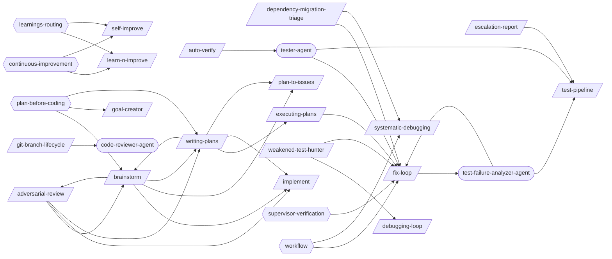
```mermaid
graph LR
    adversarial_review[/adversarial-review/]
    auto_verify[/auto-verify/]
    brainstorm[/brainstorm/]
    debugging_loop[/debugging-loop/]
    dependency_migration_triage[/dependency-migration-triage/]
    escalation_report[/escalation-report/]
    executing_plans[/executing-plans/]
    fix_loop[/fix-loop/]
    git_branch_lifecycle[/git-branch-lifecycle/]
    goal_creator[/goal-creator/]
    implement[/implement/]
    learn_n_improve[/learn-n-improve/]
    plan_to_issues[/plan-to-issues/]
    self_improve[/self-improve/]
    systematic_debugging[/systematic-debugging/]
    test_pipeline[/test-pipeline/]
    weakened_test_hunter[/weakened-test-hunter/]
    writing_plans[/writing-plans/]
    code_reviewer_agent([code-reviewer-agent])
    test_failure_analyzer_agent([test-failure-analyzer-agent])
    tester_agent([tester-agent])
    continuous_improvement{{continuous-improvement}}
    learnings_routing{{learnings-routing}}
    plan_before_coding{{plan-before-coding}}
    supervisor_verification{{supervisor-verification}}
    workflow{{workflow}}
    adversarial_review --> brainstorm
    adversarial_review --> implement
    adversarial_review --> writing_plans
    auto_verify --> tester_agent
    brainstorm --> adversarial_review
    brainstorm --> implement
    brainstorm --> plan_to_issues
    brainstorm --> writing_plans
    dependency_migration_triage --> fix_loop
    dependency_migration_triage --> systematic_debugging
    escalation_report --> test_pipeline
    executing_plans --> fix_loop
    fix_loop --> test_failure_analyzer_agent
    git_branch_lifecycle --> code_reviewer_agent
    weakened_test_hunter --> debugging_loop
    weakened_test_hunter --> fix_loop
    writing_plans --> brainstorm
    writing_plans --> executing_plans
    writing_plans --> implement
    writing_plans --> plan_to_issues
    test_failure_analyzer_agent --> fix_loop
    test_failure_analyzer_agent --> test_pipeline
    tester_agent --> fix_loop
    tester_agent --> test_pipeline
    continuous_improvement --> learn_n_improve
    continuous_improvement --> self_improve
    learnings_routing --> learn_n_improve
    learnings_routing --> self_improve
    plan_before_coding --> brainstorm
    plan_before_coding --> goal_creator
    plan_before_coding --> writing_plans
    supervisor_verification --> fix_loop
    workflow --> fix_loop
    workflow --> systematic_debugging
```

## Detailed Flow

Step-level flow showing gates (diamonds), delegations (dashed), and artifacts (cylinders).

```mermaid
graph TD
    subgraph adversarial_review_sub["Adversarial Review"]
        adversarial_review_s0{{Step 0: Determine Review Mode and Gather Context}}
        brainstorm_ext([/brainstorm/])
        adversarial_review_s0 -.-> brainstorm_ext
        implement_ext([/implement/])
        adversarial_review_s0 -.-> implement_ext
        pr_standards_ext([/pr-standards/])
        adversarial_review_s0 -.-> pr_standards_ext
        writing_plans_ext([/writing-plans/])
        adversarial_review_s0 -.-> writing_plans_ext
        adversarial_review_s1["Step 1: Applicability Check"]
        adversarial_review_s0 --> adversarial_review_s1
        adversarial_review_s2["Step 2: Launch Adversarial Reviewer Subagent"]
        adversarial_review_s1 --> adversarial_review_s2
        adversarial_review_s3["Step 3: Round 1 — Reviewer Critique"]
        adversarial_review_s2 --> adversarial_review_s3
        adversarial_review_s4["Step 4: Round 2 — Author Response"]
        adversarial_review_s3 --> adversarial_review_s4
        adversarial_review_s5["Step 5: Round 2 — Reviewer Follow-Up"]
        adversarial_review_s4 --> adversarial_review_s5
        adversarial_review_s6["Step 6: Round 3 — Final Resolution (If Needed)"]
        adversarial_review_s5 --> adversarial_review_s6
        adversarial_review_s7["Step 7: Generate Review Report"]
        adversarial_review_s6 --> adversarial_review_s7
        adversarial_review_s8{{Step 8: Apply Final Fixes and Verify}}
        adversarial_review_s7 --> adversarial_review_s8
        adversarial_review_s8 -.-> brainstorm_ext
    end

    subgraph brainstorm_sub["Brainstorm"]
        brainstorm_s1["Step 1: Understand Intent"]
        brainstorm_s2{{Step 2: Deep Research}}
        brainstorm_s1 --> brainstorm_s2
        brainstorm_s3["Step 3: Propose Approaches"]
        brainstorm_s2 --> brainstorm_s3
        brainstorm_s4["Step 4: Design in Sections"]
        brainstorm_s3 --> brainstorm_s4
        brainstorm_s5["Step 5: Write Spec Document"]
        brainstorm_s4 --> brainstorm_s5
        brainstorm_s6["Step 6: Handoff"]
        brainstorm_s5 --> brainstorm_s6
        adversarial_review_ext([/adversarial-review/])
        brainstorm_s6 -.-> adversarial_review_ext
        brainstorm_s6 -.-> implement_ext
        plan_to_issues_ext([/plan-to-issues/])
        brainstorm_s6 -.-> plan_to_issues_ext
        brainstorm_s6 -.-> writing_plans_ext
    end

    subgraph dependency_migration_triage_sub["Dependency Migration Triage"]
        dependency_migration_triage_s1["Step 1: Snapshot the Failure Set Before Touching Anything"]
        fix_loop_ext([/fix-loop/])
        dependency_migration_triage_s1 -.-> fix_loop_ext
        systematic_debugging_ext([/systematic-debugging/])
        dependency_migration_triage_s1 -.-> systematic_debugging_ext
        dependency_migration_triage_s2["Step 2: Cluster by Error Signature, Not by Test File"]
        dependency_migration_triage_s1 --> dependency_migration_triage_s2
        dependency_migration_triage_s3["Step 3: Classify Each Cluster"]
        dependency_migration_triage_s2 --> dependency_migration_triage_s3
        dependency_migration_triage_s4{{Step 4: Fix in Waves, Full Suite Between Waves}}
        dependency_migration_triage_s3 --> dependency_migration_triage_s4
        dependency_migration_triage_s5["Step 5: Report Per-Cluster Outcomes"]
        dependency_migration_triage_s4 --> dependency_migration_triage_s5
    end

    subgraph executing_plans_sub["Executing Plans"]
        executing_plans_s1{{Step 1: Load and Validate the Plan}}
        executing_plans_s2["Step 2: Pre-Execution Setup"]
        executing_plans_s1 --> executing_plans_s2
        executing_plans_s3{{Step 3: Execute Tasks}}
        executing_plans_s2 --> executing_plans_s3
        executing_plans_s4{{Step 4: Handle Failures}}
        executing_plans_s3 --> executing_plans_s4
        executing_plans_s4 -.-> fix_loop_ext
        executing_plans_s5["Step 5: Resume Support"]
        executing_plans_s4 --> executing_plans_s5
        continue_ext([/continue/])
        executing_plans_s5 -.-> continue_ext
        executing_plans_s6["Step 6: Completion Summary"]
        executing_plans_s5 --> executing_plans_s6
        executing_plans_s7["Step 7: Edge Cases and Special Handling"]
        executing_plans_s6 --> executing_plans_s7
    end

    subgraph git_branch_lifecycle_sub["Git Branch Lifecycle"]
        git_branch_lifecycle_s0["Step 0: Route on the sub-command"]
        git_branch_lifecycle_s1{{Step 1: status — show the live picture}}
        git_branch_lifecycle_s0 --> git_branch_lifecycle_s1
        git_branch_lifecycle_s2["Step 2: work <name> — isolated parallel workstream (own worktree)"]
        git_branch_lifecycle_s1 --> git_branch_lifecycle_s2
        git_branch_lifecycle_s3{{Step 3: finish [branch] — land it NOW, with an independent agent review first}}
        git_branch_lifecycle_s2 --> git_branch_lifecycle_s3
        code_reviewer_agent_ext((code-reviewer-agent))
        git_branch_lifecycle_s3 -.-> code_reviewer_agent_ext
        git_branch_lifecycle_s4{{Step 4: cleanup — RECONCILE every branch (merged→prune, unmerged→land-or-escalate)}}
        git_branch_lifecycle_s3 --> git_branch_lifecycle_s4
        git_branch_lifecycle_s4 -.-> code_reviewer_agent_ext
    end

    subgraph mock_data_hunter_sub["Mock Data Hunter"]
        mock_data_hunter_s1["Step 1: Grep Sweep the Source for Fabrication Markers"]
        mock_data_hunter_s2["Step 2: Trace Each Hit to Its Serving Path"]
        mock_data_hunter_s1 --> mock_data_hunter_s2
        mock_data_hunter_s3["Step 3: Verify Substance on Data-Backed Pages (the positive check)"]
        mock_data_hunter_s2 --> mock_data_hunter_s3
        mock_data_hunter_s4{{Step 4: Classify and File}}
        mock_data_hunter_s3 --> mock_data_hunter_s4
        mock_data_hunter_s5["Step 5: Report"]
        mock_data_hunter_s4 --> mock_data_hunter_s5
    end

    subgraph plan_to_issues_sub["Plan To Issues"]
        plan_to_issues_s1["Step 1: Parse Plan"]
        plan_to_issues_s2["Step 2: Check for Duplicates"]
        plan_to_issues_s1 --> plan_to_issues_s2
        plan_to_issues_s3["Step 3: Organize into Epics (if applicable)"]
        plan_to_issues_s2 --> plan_to_issues_s3
        plan_to_issues_s4["Step 4: Create Task Issues"]
        plan_to_issues_s3 --> plan_to_issues_s4
        plan_to_issues_s5["Step 5: Report"]
        plan_to_issues_s4 --> plan_to_issues_s5
    end

    subgraph self_improve_sub["Self Improve"]
        self_improve_s1["Step 1: Parse Mode"]
        self_improve_s2["Step 2: External Discovery Scan"]
        self_improve_s1 --> self_improve_s2
        github_ext([/github/])
        self_improve_s2 -.-> github_ext
        reddit_ext([/reddit/])
        self_improve_s2 -.-> reddit_ext
        self_improve_s3{{Step 3: Session Learning Capture}}
        self_improve_s2 --> self_improve_s3
        test_knowledge_ext([/test-knowledge/])
        self_improve_s3 -.-> test_knowledge_ext
        self_improve_s4["Step 4: Review Pending Improvements"]
        self_improve_s3 --> self_improve_s4
        self_improve_s5["Step 5: Propose Improvements"]
        self_improve_s4 --> self_improve_s5
        claude_guardian_ext([/claude-guardian/])
        self_improve_s5 -.-> claude_guardian_ext
        writing_skills_ext([/writing-skills/])
        self_improve_s5 -.-> writing_skills_ext
    end

    subgraph weakened_test_hunter_sub["Weakened Test Hunter"]
        weakened_test_hunter_s1{{Step 1: Establish the Claim and the Diff Scope}}
        weakened_test_hunter_s2{{Step 2: Re-run the Claimed Check — and Compare Counts}}
        weakened_test_hunter_s1 --> weakened_test_hunter_s2
        weakened_test_hunter_s3["Step 3: Assertion Archaeology on the Test Diff"]
        weakened_test_hunter_s2 --> weakened_test_hunter_s3
        weakened_test_hunter_s4["Step 4: Classify Each Hit — Legitimate or Weakening"]
        weakened_test_hunter_s3 --> weakened_test_hunter_s4
        weakened_test_hunter_s5{{Step 5: Verdict}}
        weakened_test_hunter_s4 --> weakened_test_hunter_s5
        debugging_loop_ext([/debugging-loop/])
        weakened_test_hunter_s5 -.-> debugging_loop_ext
        weakened_test_hunter_s5 -.-> fix_loop_ext
    end

    subgraph writing_plans_sub["Writing Plans"]
        writing_plans_s1["Step 1: Understand Scope"]
        writing_plans_s1 -.-> brainstorm_ext
        writing_plans_s2{{Step 2: Decompose into Tasks}}
        writing_plans_s1 --> writing_plans_s2
        writing_plans_s3["Step 3: Add Dependency Graph"]
        writing_plans_s2 --> writing_plans_s3
        writing_plans_s4["Step 4: Review Plan Quality"]
        writing_plans_s3 --> writing_plans_s4
        writing_plans_s5["Step 5: Present for Approval"]
        writing_plans_s4 --> writing_plans_s5
        writing_plans_s6{{Step 6: Save Plan and Companion Files}}
        writing_plans_s5 --> writing_plans_s6
        writing_plans_s7["Step 7: Suggest Next Steps"]
        writing_plans_s6 --> writing_plans_s7
        executing_plans_ext([/executing-plans/])
        writing_plans_s7 -.-> executing_plans_ext
        writing_plans_s7 -.-> plan_to_issues_ext
    end

    adversarial_review_s0 ==> brainstorm_s1
    adversarial_review_s0 ==> writing_plans_s1
    brainstorm_s6 ==> adversarial_review_s0
    brainstorm_s6 ==> plan_to_issues_s1
    brainstorm_s6 ==> writing_plans_s1
    writing_plans_s1 ==> brainstorm_s1
    writing_plans_s7 ==> executing_plans_s1
    writing_plans_s7 ==> plan_to_issues_s1
```

## Skills

| Skill | Version | Description | Calls | Called By |
|-------|---------|-------------|-------|----------|
| `/adversarial-review` | 1.0.0 | Launch a structured adversarial review using a subagent with a dedicated revi... | `/brainstorm`, `/implement`, `/writing-plans` | `/brainstorm` |
| `/auto-verify` | 5.0.0 | POINTER to the installable cbp-build-test-workflows plugin — this capability ... | `/tester-agent` | — |
| `/brainstorm` | 1.0.0 | Explore intent through Socratic questioning, propose approaches with trade-of... | `/adversarial-review`, `/implement`, `/plan-to-issues`, `/writing-plans` | `/adversarial-review`, `/writing-plans` |
| `/debugging-loop` | 3.0.0 | POINTER to the installable loop-engineering plugin — this capability graduate... | — | `/weakened-test-hunter` |
| `/dependency-migration-triage` | 1.0.0 | Triage the TEST-SUITE failures a dependency upgrade, removal, or framework mi... | `/fix-loop`, `/systematic-debugging` | — |
| `/escalation-report` | 2.0.0 | POINTER to the installable cbp-build-test-workflows plugin — this capability ... | `/test-pipeline` | — |
| `/executing-plans` | 1.0.0 | Execute a pre-written implementation plan step by step. Parses tasks from a p... | `/fix-loop` | `/writing-plans` |
| `/fix-loop` | 2.0.0 | POINTER to the installable cbp-workflows plugin — this capability graduated f... | `/test-failure-analyzer-agent` | `/dependency-migration-triage`, `/executing-plans`, `/weakened-test-hunter`, `/test-failure-analyzer-agent`, `/tester-agent` |
| `/git-branch-lifecycle` | 1.1.0 | Orchestrate the autonomous branch automation (auto-git.sh + auto-pr.sh hooks)... | `/code-reviewer-agent` | — |
| `/goal-creator` | 3.0.0 | POINTER to the installable loop-engineering plugin — this capability graduate... | — | — |
| `/implement` | 3.0.0 | POINTER to the installable cbp-build-test-workflows plugin — this capability ... | — | `/adversarial-review`, `/brainstorm`, `/writing-plans` |
| `/learn-n-improve` | 3.0.0 | POINTER to the installable cbp-learning-workflow plugin — this capability gra... | — | — |
| `/loop-engineering` | 2.0.0 | POINTER to the installable loop-engineering plugin — this capability graduate... | — | — |
| `/mock-data-hunter` | 1.0.0 | Sweep a codebase for hardcoded, demo, or seed data serving on PRODUCTION path... | — | — |
| `/plan-to-issues` | 1.2.0 | Parse a markdown plan into GitHub Issues with labels and duplicate detection.... | — | `/brainstorm`, `/writing-plans` |
| `/post-fix-pipeline` | 4.0.0 | POINTER to the installable cbp-build-test-workflows plugin — this capability ... | — | — |
| `/self-improve` | 1.0.0 | Run the full self-improvement cycle: scan external sources (GitHub, Reddit, T... | — | — |
| `/status` | 3.0.0 | POINTER to the installable loop-engineering plugin — this capability graduate... | — | — |
| `/systematic-debugging` | 2.0.0 | POINTER to the installable cbp-build-test-workflows plugin — this capability ... | — | `/dependency-migration-triage` |
| `/test-pipeline` | 4.0.0 | POINTER to the installable cbp-build-test-workflows plugin — this capability ... | — | `/escalation-report`, `/test-failure-analyzer-agent`, `/tester-agent` |
| `/weakened-test-hunter` | 1.0.0 | Verify a claimed fix did not go green by weakening its tests — re-run the cla... | `/debugging-loop`, `/fix-loop` | — |
| `/writing-plans` | 1.2.0 | Generate detailed implementation plans with bite-sized tasks, exact file path... | `/brainstorm`, `/executing-plans`, `/implement`, `/plan-to-issues` | `/adversarial-review`, `/brainstorm` |

## Workflow Steps

### Consolidated Step Flow

End-to-end flow across all skills, showing how steps connect via delegations (thick arrows).

```mermaid
graph TD
    subgraph adversarial_review_sub["Adversarial Review"]
        adversarial_review_s0{{Determine Review Mode and Gather Context}}
        adversarial_review_s1["Applicability Check"]
        adversarial_review_s0 --> adversarial_review_s1
        adversarial_review_s2["Launch Adversarial Reviewer Subagent"]
        adversarial_review_s1 --> adversarial_review_s2
        adversarial_review_s3["Round 1 — Reviewer Critique"]
        adversarial_review_s2 --> adversarial_review_s3
        adversarial_review_s4["Round 2 — Author Response"]
        adversarial_review_s3 --> adversarial_review_s4
        adversarial_review_s5["Round 2 — Reviewer Follow-Up"]
        adversarial_review_s4 --> adversarial_review_s5
        adversarial_review_s6["Round 3 — Final Resolution (If Needed)"]
        adversarial_review_s5 --> adversarial_review_s6
        adversarial_review_s7["Generate Review Report"]
        adversarial_review_s6 --> adversarial_review_s7
        adversarial_review_s8{{Apply Final Fixes and Verify}}
        adversarial_review_s7 --> adversarial_review_s8
    end

    subgraph brainstorm_sub["Brainstorm"]
        brainstorm_s1["Understand Intent"]
        brainstorm_s2{{Deep Research}}
        brainstorm_s1 --> brainstorm_s2
        brainstorm_s3["Propose Approaches"]
        brainstorm_s2 --> brainstorm_s3
        brainstorm_s4["Design in Sections"]
        brainstorm_s3 --> brainstorm_s4
        brainstorm_s5["Write Spec Document"]
        brainstorm_s4 --> brainstorm_s5
        brainstorm_s6["Handoff"]
        brainstorm_s5 --> brainstorm_s6
    end

    subgraph dependency_migration_triage_sub["Dependency Migration Triage"]
        dependency_migration_triage_s1["Snapshot the Failure Set Before Touching Anything"]
        dependency_migration_triage_s2["Cluster by Error Signature, Not by Test File"]
        dependency_migration_triage_s1 --> dependency_migration_triage_s2
        dependency_migration_triage_s3["Classify Each Cluster"]
        dependency_migration_triage_s2 --> dependency_migration_triage_s3
        dependency_migration_triage_s4{{Fix in Waves, Full Suite Between Waves}}
        dependency_migration_triage_s3 --> dependency_migration_triage_s4
        dependency_migration_triage_s5["Report Per-Cluster Outcomes"]
        dependency_migration_triage_s4 --> dependency_migration_triage_s5
    end

    subgraph executing_plans_sub["Executing Plans"]
        executing_plans_s1{{Load and Validate the Plan}}
        executing_plans_s2["Pre-Execution Setup"]
        executing_plans_s1 --> executing_plans_s2
        executing_plans_s3{{Execute Tasks}}
        executing_plans_s2 --> executing_plans_s3
        executing_plans_s4{{Handle Failures}}
        executing_plans_s3 --> executing_plans_s4
        executing_plans_s5["Resume Support"]
        executing_plans_s4 --> executing_plans_s5
        executing_plans_s6["Completion Summary"]
        executing_plans_s5 --> executing_plans_s6
        executing_plans_s7["Edge Cases and Special Handling"]
        executing_plans_s6 --> executing_plans_s7
    end

    subgraph git_branch_lifecycle_sub["Git Branch Lifecycle"]
        git_branch_lifecycle_s0["Route on the sub-command"]
        git_branch_lifecycle_s1{{status — show the live picture}}
        git_branch_lifecycle_s0 --> git_branch_lifecycle_s1
        git_branch_lifecycle_s2["work <name> — isolated parallel workstream (own worktree)"]
        git_branch_lifecycle_s1 --> git_branch_lifecycle_s2
        git_branch_lifecycle_s3{{finish [branch] — land it NOW, with an independent agent review first}}
        git_branch_lifecycle_s2 --> git_branch_lifecycle_s3
        git_branch_lifecycle_s4{{cleanup — RECONCILE every branch (merged→prune, unmerged→land-or-escalate)}}
        git_branch_lifecycle_s3 --> git_branch_lifecycle_s4
    end

    subgraph mock_data_hunter_sub["Mock Data Hunter"]
        mock_data_hunter_s1["Grep Sweep the Source for Fabrication Markers"]
        mock_data_hunter_s2["Trace Each Hit to Its Serving Path"]
        mock_data_hunter_s1 --> mock_data_hunter_s2
        mock_data_hunter_s3["Verify Substance on Data-Backed Pages (the positive check)"]
        mock_data_hunter_s2 --> mock_data_hunter_s3
        mock_data_hunter_s4{{Classify and File}}
        mock_data_hunter_s3 --> mock_data_hunter_s4
        mock_data_hunter_s5["Report"]
        mock_data_hunter_s4 --> mock_data_hunter_s5
    end

    subgraph plan_to_issues_sub["Plan To Issues"]
        plan_to_issues_s1["Parse Plan"]
        plan_to_issues_s2["Check for Duplicates"]
        plan_to_issues_s1 --> plan_to_issues_s2
        plan_to_issues_s3["Organize into Epics (if applicable)"]
        plan_to_issues_s2 --> plan_to_issues_s3
        plan_to_issues_s4["Create Task Issues"]
        plan_to_issues_s3 --> plan_to_issues_s4
        plan_to_issues_s5["Report"]
        plan_to_issues_s4 --> plan_to_issues_s5
    end

    subgraph self_improve_sub["Self Improve"]
        self_improve_s1["Parse Mode"]
        self_improve_s2["External Discovery Scan"]
        self_improve_s1 --> self_improve_s2
        self_improve_s3{{Session Learning Capture}}
        self_improve_s2 --> self_improve_s3
        self_improve_s4["Review Pending Improvements"]
        self_improve_s3 --> self_improve_s4
        self_improve_s5["Propose Improvements"]
        self_improve_s4 --> self_improve_s5
    end

    subgraph weakened_test_hunter_sub["Weakened Test Hunter"]
        weakened_test_hunter_s1{{Establish the Claim and the Diff Scope}}
        weakened_test_hunter_s2{{Re-run the Claimed Check — and Compare Counts}}
        weakened_test_hunter_s1 --> weakened_test_hunter_s2
        weakened_test_hunter_s3["Assertion Archaeology on the Test Diff"]
        weakened_test_hunter_s2 --> weakened_test_hunter_s3
        weakened_test_hunter_s4["Classify Each Hit — Legitimate or Weakening"]
        weakened_test_hunter_s3 --> weakened_test_hunter_s4
        weakened_test_hunter_s5{{Verdict}}
        weakened_test_hunter_s4 --> weakened_test_hunter_s5
    end

    subgraph writing_plans_sub["Writing Plans"]
        writing_plans_s1["Understand Scope"]
        writing_plans_s2{{Decompose into Tasks}}
        writing_plans_s1 --> writing_plans_s2
        writing_plans_s3["Add Dependency Graph"]
        writing_plans_s2 --> writing_plans_s3
        writing_plans_s4["Review Plan Quality"]
        writing_plans_s3 --> writing_plans_s4
        writing_plans_s5["Present for Approval"]
        writing_plans_s4 --> writing_plans_s5
        writing_plans_s6{{Save Plan and Companion Files}}
        writing_plans_s5 --> writing_plans_s6
        writing_plans_s7["Suggest Next Steps"]
        writing_plans_s6 --> writing_plans_s7
    end

    adversarial_review_s0 ==> brainstorm_s1
    adversarial_review_s0 ==> writing_plans_s1
    adversarial_review_s8 ==> brainstorm_s1
    brainstorm_s6 ==> adversarial_review_s0
    brainstorm_s6 ==> plan_to_issues_s1
    brainstorm_s6 ==> writing_plans_s1
    writing_plans_s1 ==> brainstorm_s1
    writing_plans_s7 ==> executing_plans_s1
    writing_plans_s7 ==> plan_to_issues_s1
```

### Entry Points

Double-bordered nodes are user-facing entry points (no incoming references). Rounded nodes are agents.

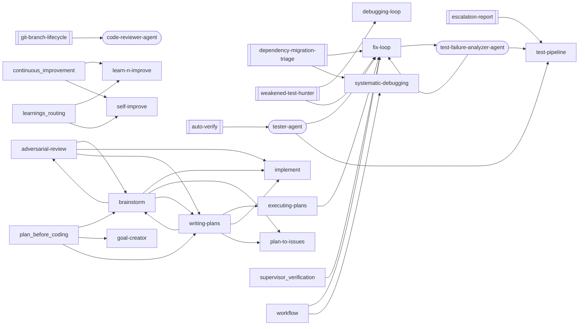
```mermaid
graph LR
    auto_verify[["auto-verify"]]
    dependency_migration_triage[["dependency-migration-triage"]]
    escalation_report[["escalation-report"]]
    git_branch_lifecycle[["git-branch-lifecycle"]]
    weakened_test_hunter[["weakened-test-hunter"]]
    adversarial_review["adversarial-review"]
    brainstorm["brainstorm"]
    code_reviewer_agent(["code-reviewer-agent"])
    debugging_loop["debugging-loop"]
    executing_plans["executing-plans"]
    fix_loop["fix-loop"]
    goal_creator["goal-creator"]
    implement["implement"]
    learn_n_improve["learn-n-improve"]
    plan_to_issues["plan-to-issues"]
    self_improve["self-improve"]
    systematic_debugging["systematic-debugging"]
    test_failure_analyzer_agent(["test-failure-analyzer-agent"])
    test_pipeline["test-pipeline"]
    tester_agent(["tester-agent"])
    writing_plans["writing-plans"]
    adversarial_review --> brainstorm
    adversarial_review --> implement
    adversarial_review --> writing_plans
    auto_verify --> tester_agent
    brainstorm --> adversarial_review
    brainstorm --> implement
    brainstorm --> plan_to_issues
    brainstorm --> writing_plans
    dependency_migration_triage --> fix_loop
    dependency_migration_triage --> systematic_debugging
    escalation_report --> test_pipeline
    executing_plans --> fix_loop
    fix_loop --> test_failure_analyzer_agent
    git_branch_lifecycle --> code_reviewer_agent
    weakened_test_hunter --> debugging_loop
    weakened_test_hunter --> fix_loop
    writing_plans --> brainstorm
    writing_plans --> executing_plans
    writing_plans --> implement
    writing_plans --> plan_to_issues
    test_failure_analyzer_agent --> fix_loop
    test_failure_analyzer_agent --> test_pipeline
    tester_agent --> fix_loop
    tester_agent --> test_pipeline
    continuous_improvement --> learn_n_improve
    continuous_improvement --> self_improve
    learnings_routing --> learn_n_improve
    learnings_routing --> self_improve
    plan_before_coding --> brainstorm
    plan_before_coding --> goal_creator
    plan_before_coding --> writing_plans
    supervisor_verification --> fix_loop
    workflow --> fix_loop
    workflow --> systematic_debugging
```

### adversarial-review

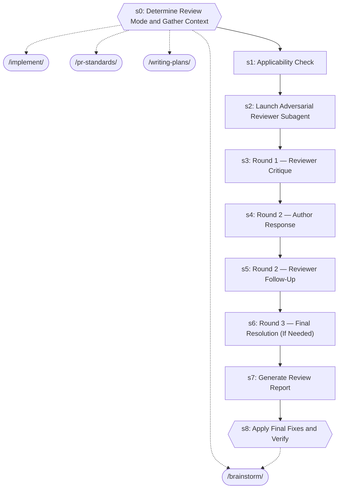
```mermaid
graph TD
    s0{{s0: Determine Review Mode and Gather Context}}
    brainstorm_ext([/brainstorm/])
    s0 -.-> brainstorm_ext
    implement_ext([/implement/])
    s0 -.-> implement_ext
    pr_standards_ext([/pr-standards/])
    s0 -.-> pr_standards_ext
    writing_plans_ext([/writing-plans/])
    s0 -.-> writing_plans_ext
    s1["s1: Applicability Check"]
    s0 --> s1
    s2["s2: Launch Adversarial Reviewer Subagent"]
    s1 --> s2
    s3["s3: Round 1 — Reviewer Critique"]
    s2 --> s3
    s4["s4: Round 2 — Author Response"]
    s3 --> s4
    s5["s5: Round 2 — Reviewer Follow-Up"]
    s4 --> s5
    s6["s6: Round 3 — Final Resolution (If Needed)"]
    s5 --> s6
    s7["s7: Generate Review Report"]
    s6 --> s7
    s8{{s8: Apply Final Fixes and Verify}}
    s7 --> s8
    brainstorm_ext([/brainstorm/])
    s8 -.-> brainstorm_ext
```

| Step | Title | Delegates To | Artifacts | Gates/Decisions |
|------|-------|-------------|-----------|----------------|
| 0 | Determine Review Mode and Gather Context | `/brainstorm`, `/implement`, `/pr-standards`, `/writing-plans` | — | gate |
| 1 | Applicability Check | — | — | — |
| 2 | Launch Adversarial Reviewer Subagent | — | — | — |
| 3 | Round 1 — Reviewer Critique | — | — | — |
| 4 | Round 2 — Author Response | — | — | — |
| 5 | Round 2 — Reviewer Follow-Up | — | — | — |
| 6 | Round 3 — Final Resolution (If Needed) | — | — | — |
| 7 | Generate Review Report | — | — | — |
| 8 | Apply Final Fixes and Verify | `/brainstorm` | — | gate, decision |

### brainstorm

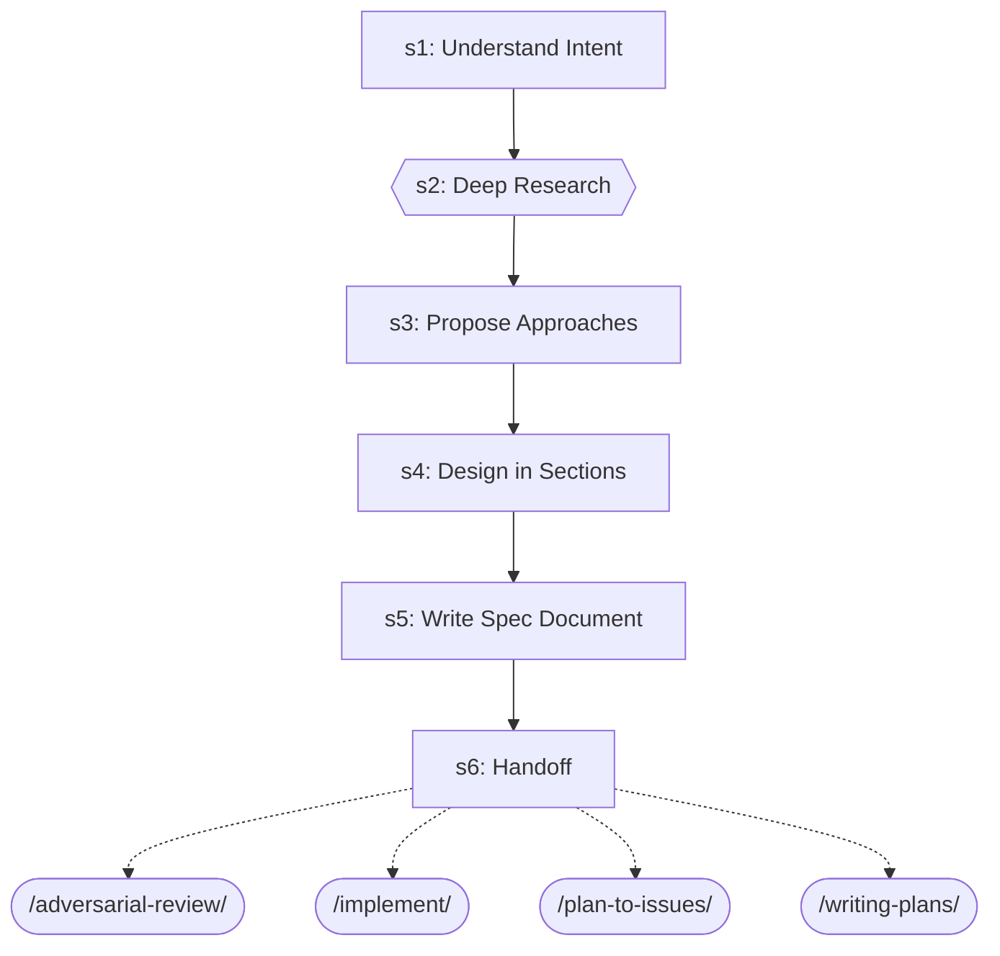
```mermaid
graph TD
    s1["s1: Understand Intent"]
    s2{{s2: Deep Research}}
    s1 --> s2
    s3["s3: Propose Approaches"]
    s2 --> s3
    s4["s4: Design in Sections"]
    s3 --> s4
    s5["s5: Write Spec Document"]
    s4 --> s5
    s6["s6: Handoff"]
    s5 --> s6
    adversarial_review_ext([/adversarial-review/])
    s6 -.-> adversarial_review_ext
    implement_ext([/implement/])
    s6 -.-> implement_ext
    plan_to_issues_ext([/plan-to-issues/])
    s6 -.-> plan_to_issues_ext
    writing_plans_ext([/writing-plans/])
    s6 -.-> writing_plans_ext
```

| Step | Title | Delegates To | Artifacts | Gates/Decisions |
|------|-------|-------------|-----------|----------------|
| 1 | Understand Intent | — | — | — |
| 2 | Deep Research | — | — | gate |
| 3 | Propose Approaches | — | — | — |
| 4 | Design in Sections | — | — | — |
| 5 | Write Spec Document | — | — | — |
| 6 | Handoff | `/adversarial-review`, `/implement`, `/plan-to-issues`, `/writing-plans` | — | — |

### dependency-migration-triage

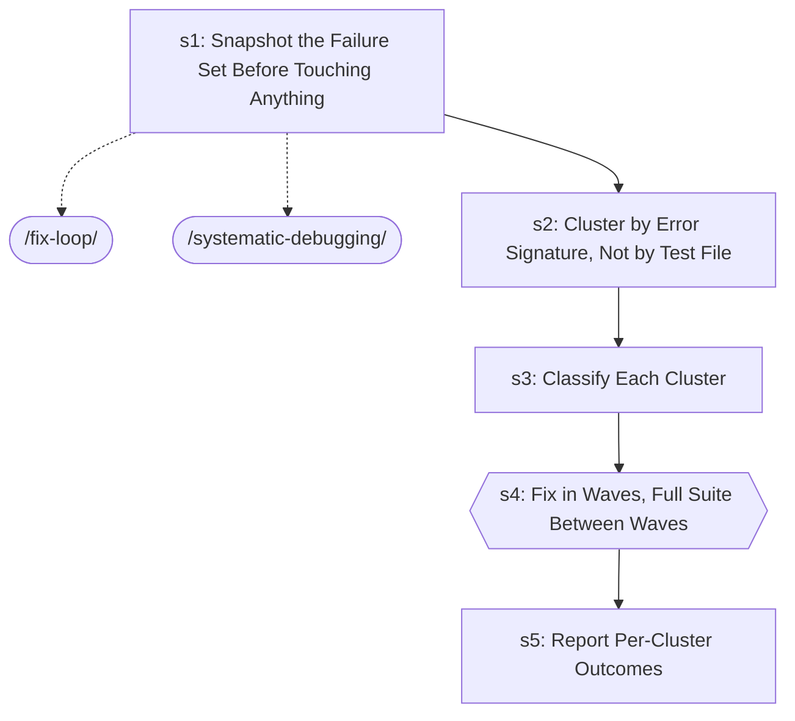
```mermaid
graph TD
    s1["s1: Snapshot the Failure Set Before Touching Anything"]
    fix_loop_ext([/fix-loop/])
    s1 -.-> fix_loop_ext
    systematic_debugging_ext([/systematic-debugging/])
    s1 -.-> systematic_debugging_ext
    s2["s2: Cluster by Error Signature, Not by Test File"]
    s1 --> s2
    s3["s3: Classify Each Cluster"]
    s2 --> s3
    s4{{s4: Fix in Waves, Full Suite Between Waves}}
    s3 --> s4
    s5["s5: Report Per-Cluster Outcomes"]
    s4 --> s5
```

| Step | Title | Delegates To | Artifacts | Gates/Decisions |
|------|-------|-------------|-----------|----------------|
| 1 | Snapshot the Failure Set Before Touching Anything | `/fix-loop`, `/systematic-debugging` | — | — |
| 2 | Cluster by Error Signature, Not by Test File | — | — | — |
| 3 | Classify Each Cluster | — | — | — |
| 4 | Fix in Waves, Full Suite Between Waves | — | — | gate |
| 5 | Report Per-Cluster Outcomes | — | — | — |

### executing-plans

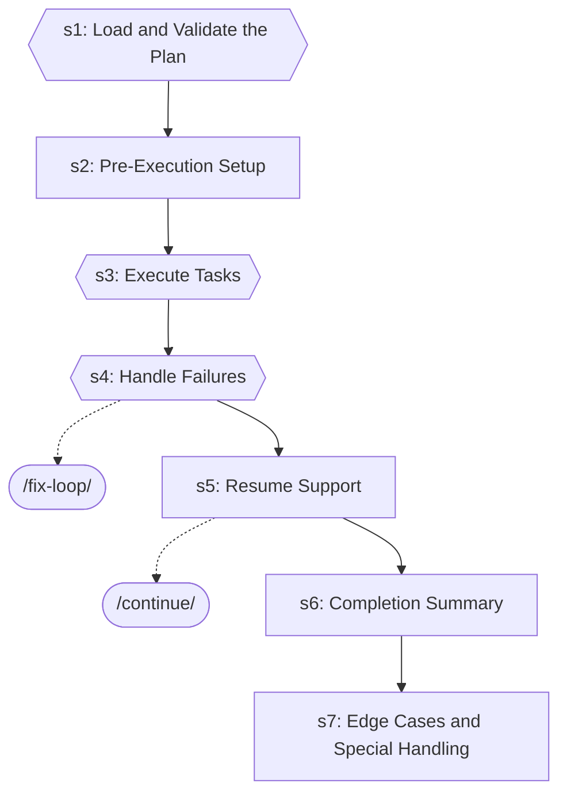
```mermaid
graph TD
    s1{{s1: Load and Validate the Plan}}
    s2["s2: Pre-Execution Setup"]
    s1 --> s2
    s3{{s3: Execute Tasks}}
    s2 --> s3
    s4{{s4: Handle Failures}}
    s3 --> s4
    fix_loop_ext([/fix-loop/])
    s4 -.-> fix_loop_ext
    s5["s5: Resume Support"]
    s4 --> s5
    continue_ext([/continue/])
    s5 -.-> continue_ext
    s6["s6: Completion Summary"]
    s5 --> s6
    s7["s7: Edge Cases and Special Handling"]
    s6 --> s7
```

| Step | Title | Delegates To | Artifacts | Gates/Decisions |
|------|-------|-------------|-----------|----------------|
| 1 | Load and Validate the Plan | — | — | gate, decision |
| 2 | Pre-Execution Setup | — | — | — |
| 3 | Execute Tasks | — | — | gate |
| 4 | Handle Failures | `/fix-loop` | — | gate, decision |
| 5 | Resume Support | `/continue` | — | decision |
| 6 | Completion Summary | — | — | — |
| 7 | Edge Cases and Special Handling | — | — | decision |

### git-branch-lifecycle

```mermaid
graph TD
    s0["s0: Route on the sub-command"]
    s1{{s1: status — show the live picture}}
    s0 --> s1
    s2["s2: work <name> — isolated parallel workstream (own worktree)"]
    s1 --> s2
    s3{{s3: finish [branch] — land it NOW, with an independent agent review first}}
    s2 --> s3
    code_reviewer_agent_ext((code-reviewer-agent))
    s3 -.-> code_reviewer_agent_ext
    s4{{s4: cleanup — RECONCILE every branch (merged→prune, unmerged→land-or-escalate)}}
    s3 --> s4
    code_reviewer_agent_ext((code-reviewer-agent))
    s4 -.-> code_reviewer_agent_ext
```

| Step | Title | Delegates To | Artifacts | Gates/Decisions |
|------|-------|-------------|-----------|----------------|
| 0 | Route on the sub-command | — | — | STEP 1, STEP 2, STEP 3, STEP 4 |
| 1 | status — show the live picture | — | — | gate |
| 2 | work <name> — isolated parallel workstream (own worktree) | — | — | — |
| 3 | finish [branch] — land it NOW, with an independent agent review first | `code-reviewer-agent` | — | gate |
| 4 | cleanup — RECONCILE every branch (merged→prune, unmerged→land-or-escalate) | `code-reviewer-agent` | — | gate |

### mock-data-hunter

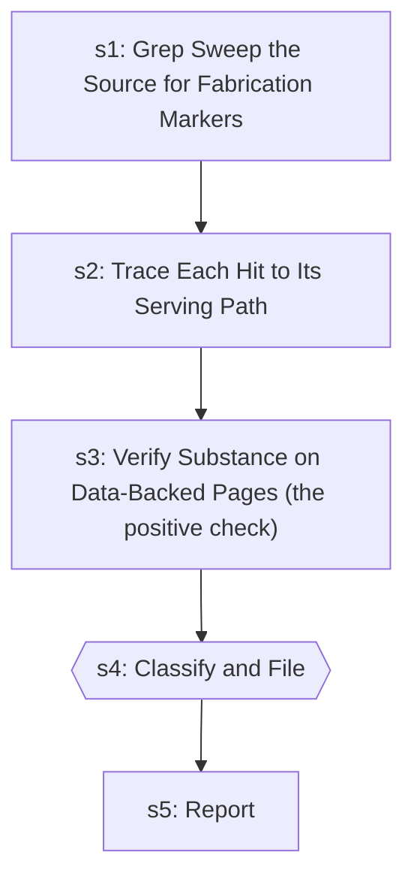
```mermaid
graph TD
    s1["s1: Grep Sweep the Source for Fabrication Markers"]
    s2["s2: Trace Each Hit to Its Serving Path"]
    s1 --> s2
    s3["s3: Verify Substance on Data-Backed Pages (the positive check)"]
    s2 --> s3
    s4{{s4: Classify and File}}
    s3 --> s4
    s5["s5: Report"]
    s4 --> s5
```

| Step | Title | Delegates To | Artifacts | Gates/Decisions |
|------|-------|-------------|-----------|----------------|
| 1 | Grep Sweep the Source for Fabrication Markers | — | — | — |
| 2 | Trace Each Hit to Its Serving Path | — | — | — |
| 3 | Verify Substance on Data-Backed Pages (the positive check) | — | — | — |
| 4 | Classify and File | — | — | gate |
| 5 | Report | — | — | — |

### plan-to-issues

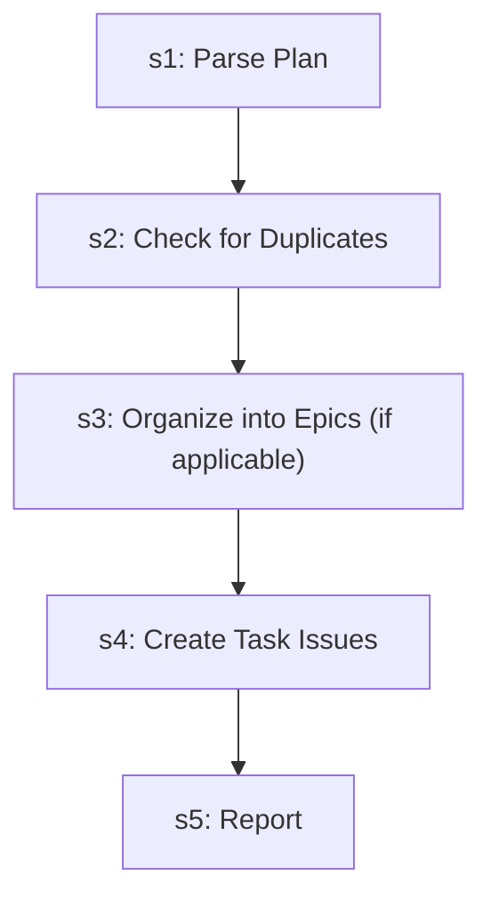
```mermaid
graph TD
    s1["s1: Parse Plan"]
    s2["s2: Check for Duplicates"]
    s1 --> s2
    s3["s3: Organize into Epics (if applicable)"]
    s2 --> s3
    s4["s4: Create Task Issues"]
    s3 --> s4
    s5["s5: Report"]
    s4 --> s5
```

| Step | Title | Delegates To | Artifacts | Gates/Decisions |
|------|-------|-------------|-----------|----------------|
| 1 | Parse Plan | — | — | — |
| 2 | Check for Duplicates | — | — | — |
| 3 | Organize into Epics (if applicable) | — | — | — |
| 4 | Create Task Issues | — | — | — |
| 5 | Report | — | — | — |

### self-improve

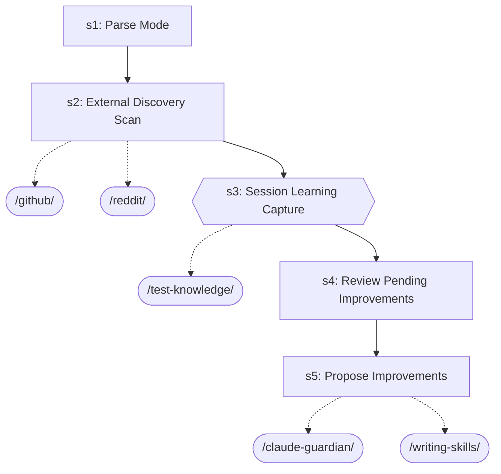
```mermaid
graph TD
    s1["s1: Parse Mode"]
    s2["s2: External Discovery Scan"]
    s1 --> s2
    github_ext([/github/])
    s2 -.-> github_ext
    reddit_ext([/reddit/])
    s2 -.-> reddit_ext
    s3{{s3: Session Learning Capture}}
    s2 --> s3
    test_knowledge_ext([/test-knowledge/])
    s3 -.-> test_knowledge_ext
    s4["s4: Review Pending Improvements"]
    s3 --> s4
    s5["s5: Propose Improvements"]
    s4 --> s5
    claude_guardian_ext([/claude-guardian/])
    s5 -.-> claude_guardian_ext
    writing_skills_ext([/writing-skills/])
    s5 -.-> writing_skills_ext
```

| Step | Title | Delegates To | Artifacts | Gates/Decisions |
|------|-------|-------------|-----------|----------------|
| 1 | Parse Mode | — | — | — |
| 2 | External Discovery Scan | `/github`, `/reddit` | — | — |
| 3 | Session Learning Capture | `/test-knowledge` | — | gate, decision |
| 4 | Review Pending Improvements | — | — | decision |
| 5 | Propose Improvements | `/claude-guardian`, `/writing-skills` | — | — |

### weakened-test-hunter

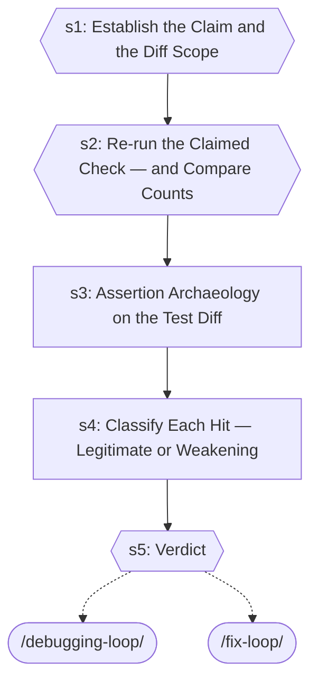
```mermaid
graph TD
    s1{{s1: Establish the Claim and the Diff Scope}}
    s2{{s2: Re-run the Claimed Check — and Compare Counts}}
    s1 --> s2
    s3["s3: Assertion Archaeology on the Test Diff"]
    s2 --> s3
    s4["s4: Classify Each Hit — Legitimate or Weakening"]
    s3 --> s4
    s5{{s5: Verdict}}
    s4 --> s5
    debugging_loop_ext([/debugging-loop/])
    s5 -.-> debugging_loop_ext
    fix_loop_ext([/fix-loop/])
    s5 -.-> fix_loop_ext
```

| Step | Title | Delegates To | Artifacts | Gates/Decisions |
|------|-------|-------------|-----------|----------------|
| 1 | Establish the Claim and the Diff Scope | — | — | gate, decision |
| 2 | Re-run the Claimed Check — and Compare Counts | — | — | gate |
| 3 | Assertion Archaeology on the Test Diff | — | — | — |
| 4 | Classify Each Hit — Legitimate or Weakening | — | — | — |
| 5 | Verdict | `/debugging-loop`, `/fix-loop` | — | gate |

### writing-plans

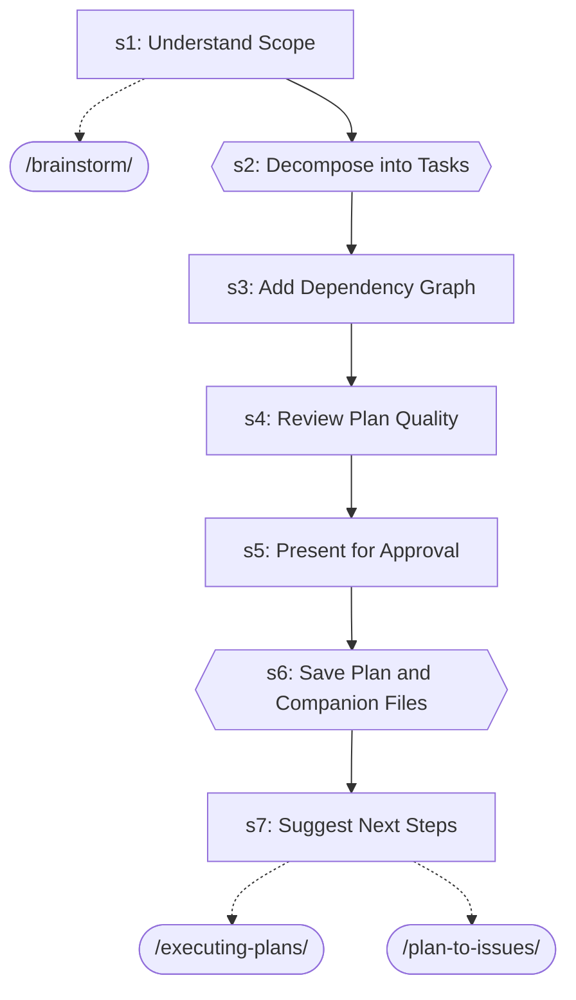
```mermaid
graph TD
    s1["s1: Understand Scope"]
    brainstorm_ext([/brainstorm/])
    s1 -.-> brainstorm_ext
    s2{{s2: Decompose into Tasks}}
    s1 --> s2
    s3["s3: Add Dependency Graph"]
    s2 --> s3
    s4["s4: Review Plan Quality"]
    s3 --> s4
    s5["s5: Present for Approval"]
    s4 --> s5
    s6{{s6: Save Plan and Companion Files}}
    s5 --> s6
    s7["s7: Suggest Next Steps"]
    s6 --> s7
    executing_plans_ext([/executing-plans/])
    s7 -.-> executing_plans_ext
    plan_to_issues_ext([/plan-to-issues/])
    s7 -.-> plan_to_issues_ext
```

| Step | Title | Delegates To | Artifacts | Gates/Decisions |
|------|-------|-------------|-----------|----------------|
| 1 | Understand Scope | `/brainstorm` | — | decision |
| 2 | Decompose into Tasks | — | — | gate, decision |
| 3 | Add Dependency Graph | — | — | — |
| 4 | Review Plan Quality | — | — | — |
| 5 | Present for Approval | — | — | — |
| 6 | Save Plan and Companion Files | — | — | gate |
| 7 | Suggest Next Steps | `/executing-plans`, `/plan-to-issues` | — | — |

## Agents

| Agent | Description | Dispatched By |
|-------|-------------|---------------|
| `code-reviewer-agent` | Use proactively to review recently changed files for code quality, type safet... | `/git-branch-lifecycle` |
| `plan-executor-agent` | Use this agent to parse structured plans into tracked steps, coordinate execu... | — |
| `test-failure-analyzer-agent` | Use proactively to diagnose test failures — reads test output, classifies by ... | `/fix-loop` |
| `tester-agent` | Senior QA engineer specializing in comprehensive testing and quality assuranc... | `/auto-verify` |

## Rules

| Rule | Description |
|------|-------------|
| `continuous-improvement` |  |
| `independent-test-verification` |  |
| `learnings-routing` |  |
| `plan-before-coding` |  |
| `supervisor-verification` |  |
| `workflow` |  |

## Cross-Workflow Connections

**Outgoing** (this workflow feeds into):
- `claude-guardian` (skill)
- `continue` (skill)
- `contract-test` (skill)
- `development-loop` (skill)
- `e2e-visual-run` (skill)
- `github` (skill)
- `pr-standards` (skill)
- `reddit` (skill)
- `skill-factory` (skill)
- `test-healer-agent` (agent)
- `test-knowledge` (skill)
- `writing-skills` (skill)

**Incoming** (fed by):
- `agent-orchestration` (rule)
- `android-run-e2e` (skill)
- `android-run-tests` (skill)
- `anthropic-agent-orchestration-guide` (skill)
- `anthropic-multi-agent-research-system-skill` (skill)
- `bun-elysia-test` (skill)
- `claude-behavior` (rule)
- `code-review-workflow` (skill)
- `configuration-ssot` (rule)
- `create-github-issue` (skill)
- `decision-authority` (rule)
- `e2e-visual-run` (skill)
- `end-session` (skill)
- `engineering-roles` (rule)
- `fastapi-api-tester-agent` (agent)
- `fastapi-run-backend-tests` (skill)
- `firebase-test` (skill)
- `flutter-e2e-test` (skill)
- `full-defect-surface-sweep` (skill)
- `github-issue-manager-agent` (agent)
- `learning-self-improvement` (skill)
- `pattern-self-containment` (rule)
- `pattern-structure` (rule)
- `pr-standards` (skill)
- `prd-parser` (skill)
- `project-manager-agent` (agent)
- `project-scaffold` (skill)
- `regression-test` (skill)
- `security-auditor-agent` (agent)
- `serialize-fixes` (skill)
- `skill-master` (skill)
- `subagent-driven-dev` (skill)
- `tdd` (skill)
- `test-healer-agent` (agent)
- `test-scout-agent` (agent)
- `testing` (rule)
- `to-prd` (skill)
- `untrusted-content-handling` (rule)
- `verify-screenshots` (skill)
- `visual-inspector-agent` (agent)
- `workflow-master-template` (agent)

<!-- MANUAL ANNOTATIONS -->
<!-- Add custom notes below this line. They are preserved on regeneration. -->
