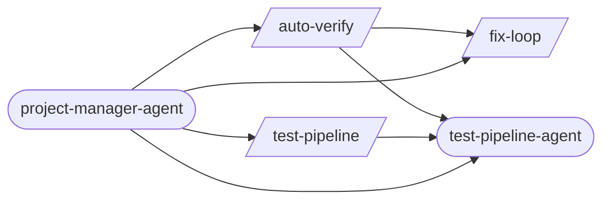

# Ops Quality

> Operational concerns: accessibility, quality audits, disaster recovery, feature flags, and platform tooling.

> Auto-generated by `scripts/generate_workflow_docs.py` | Last updated: 2026-03-29 06:21 UTC

## Overview



## Detailed Flow

Step-level flow showing gates (diamonds), delegations (dashed), and artifacts (cylinders).

```mermaid
graph TD
    subgraph a11y_audit_sub["A11Y Audit"]
        a11y_audit_s1["Step 1: Detect Target"]
        a11y_audit_s2["Step 2: Run axe-core via Playwright"]
        a11y_audit_s1 --> a11y_audit_s2
        a11y_audit_s3["Step 3: Run Lighthouse Accessibility Audit"]
        a11y_audit_s2 --> a11y_audit_s3
        a11y_audit_s4["Step 4: Manual WCAG 2.1 AA Checklist"]
        a11y_audit_s3 --> a11y_audit_s4
        a11y_audit_s5{{Step 5: Generate Compliance Report}}
        a11y_audit_s4 --> a11y_audit_s5
        a11y_audit_s6["Step 6: Suggest Fixes"]
        a11y_audit_s5 --> a11y_audit_s6
    end

    subgraph auto_verify_sub["Auto Verify"]
        auto_verify_s0{{Step 0: Gate Check — Read Upstream Results}}
        test_pipeline_agent_ext((test-pipeline-agent))
        auto_verify_s0 -.-> test_pipeline_agent_ext
        auto_verify_test_results_fix_loop_json[("test-results/fix-loop.json")]
        auto_verify_test_results_fix_loop_json -.->|reads| auto_verify_s0
        auto_verify_s0_block[/BLOCK/]
        auto_verify_s0 -->|FAILED| auto_verify_s0_block
        auto_verify_s1{{Step 1: Map Changes to Tests (via /regression-test)}}
        auto_verify_s0 -->|OK| auto_verify_s1
        regression_test_ext([/regression-test/])
        auto_verify_s1 -.-> regression_test_ext
        tester_agent_ext((tester-agent))
        auto_verify_s1 -.-> tester_agent_ext
        auto_verify_test_results_regression_test_json[("test-results/regression-test.json")]
        auto_verify_test_results_regression_test_json -.->|reads| auto_verify_s1
        auto_verify_s2{{Step 2: Execute Tests (via tester-agent)}}
        auto_verify_s1 --> auto_verify_s2
        verify_screenshots_ext([/verify-screenshots/])
        auto_verify_s2 -.-> verify_screenshots_ext
        auto_verify_s2 -.-> tester_agent_ext
        auto_verify_test_evidence_run_id_manifest_json[("test-evidence/{run_id}/manifest.json")]
        auto_verify_s2 -->|writes| auto_verify_test_evidence_run_id_manifest_json
        auto_verify_test_evidence_run_id_visual_review_json[("test-evidence/{run_id}/visual-review.json")]
        auto_verify_s2 -->|writes| auto_verify_test_evidence_run_id_visual_review_json
        auto_verify_s3{{Step 3: Evaluate Results}}
        auto_verify_s2 --> auto_verify_s3
        fix_loop_ext([/fix-loop/])
        auto_verify_s3 -.-> fix_loop_ext
        auto_verify_s4{{Step 4: Quality Gate (if tests pass)}}
        auto_verify_s3 --> auto_verify_s4
        code_quality_gate_ext([/code-quality-gate/])
        auto_verify_s4 -.-> code_quality_gate_ext
        auto_verify_s4A{{Step 4A: Contract Verification (if API changed)}}
        auto_verify_s4 --> auto_verify_s4A
        contract_test_ext([/contract-test/])
        auto_verify_s4A -.-> contract_test_ext
        auto_verify_s4B{{Step 4B: Performance Baseline (if perf-sensitive code changed)}}
        auto_verify_s4A --> auto_verify_s4B
        perf_test_ext([/perf-test/])
        auto_verify_s4B -.-> perf_test_ext
        auto_verify_s5{{Step 5: Report}}
        auto_verify_s4B --> auto_verify_s5
        auto_verify_s6{{Step 6: Structured Output}}
        auto_verify_s5 --> auto_verify_s6
        auto_verify_test_results_auto_verify_json[("test-results/auto-verify.json")]
        auto_verify_s6 -->|writes| auto_verify_test_results_auto_verify_json
    end

    subgraph chaos_resilience_sub["Chaos Resilience"]
        chaos_resilience_s1["Step 1: Define Steady State"]
        chaos_resilience_s2["Step 2: Form Hypothesis"]
        chaos_resilience_s1 --> chaos_resilience_s2
        chaos_resilience_s3["Step 3: Inject Failure"]
        chaos_resilience_s2 --> chaos_resilience_s3
        chaos_resilience_s4["Step 4: Observe Behavior During Failure"]
        chaos_resilience_s3 --> chaos_resilience_s4
        chaos_resilience_s5["Step 5: Analyze Results"]
        chaos_resilience_s4 --> chaos_resilience_s5
        chaos_resilience_s6["Step 6: Document Findings"]
        chaos_resilience_s5 --> chaos_resilience_s6
        chaos_resilience_s7{{Step 7: Gameday Planning (Optional)}}
        chaos_resilience_s6 --> chaos_resilience_s7
    end

    subgraph disaster_recovery_sub["Disaster Recovery"]
        disaster_recovery_s1{{Step 1: Extract RTO/RPO Targets from NFRs}}
        disaster_recovery_s2["Step 2: Inventory Critical Services"]
        disaster_recovery_s1 --> disaster_recovery_s2
        disaster_recovery_s3["Step 3: Define Backup Strategy"]
        disaster_recovery_s2 --> disaster_recovery_s3
        disaster_recovery_s4["Step 4: Create Restore Procedure"]
        disaster_recovery_s3 --> disaster_recovery_s4
        disaster_recovery_s5["Step 5: Design Failover Architecture (If Multi-Region)"]
        disaster_recovery_s4 --> disaster_recovery_s5
        disaster_recovery_s6["Step 6: Create DR Runbook"]
        disaster_recovery_s5 --> disaster_recovery_s6
        disaster_recovery_s7["Step 7: Schedule DR Drill"]
        disaster_recovery_s6 --> disaster_recovery_s7
        disaster_recovery_s7A["Step 7A: Backup Encryption & Key Management"]
        disaster_recovery_s7 --> disaster_recovery_s7A
        disaster_recovery_s7B{{Step 7B: Restore Verification Testing}}
        disaster_recovery_s7A --> disaster_recovery_s7B
    end

    subgraph fastapi_db_migrate_sub["Fastapi Db Migrate"]
        fastapi_db_migrate_s1["Step 1: New Model Mode"]
        fastapi_db_migrate_s2["Step 2: Check Mode"]
        fastapi_db_migrate_s1 --> fastapi_db_migrate_s2
        fastapi_db_migrate_s3["Step 3: Status Mode"]
        fastapi_db_migrate_s2 --> fastapi_db_migrate_s3
    end

    subgraph feature_flag_sub["Feature Flag"]
        feature_flag_s1["Step 1: Assess Flag Need"]
        feature_flag_s2{{Step 2: Choose Flag Type}}
        feature_flag_s1 --> feature_flag_s2
        feature_flag_s3["Step 3: Implement the Flag"]
        feature_flag_s2 --> feature_flag_s3
        feature_flag_s4["Step 4: Test Both Paths"]
        feature_flag_s3 --> feature_flag_s4
        feature_flag_s5["Step 5: Document the Flag"]
        feature_flag_s4 --> feature_flag_s5
        feature_flag_s6["Step 6: Plan Cleanup"]
        feature_flag_s5 --> feature_flag_s6
    end

    subgraph fix_loop_sub["Fix Loop"]
        fix_loop_s1{{Step 1: Analyze Failure (via test-failure-analyzer-agent)}}
        test_failure_analyzer_agent_ext((test-failure-analyzer-agent))
        fix_loop_s1 -.-> test_failure_analyzer_agent_ext
        fix_loop_s1A["Step 1A: Flaky Test Detection"]
        fix_loop_s1 --> fix_loop_s1A
        fix_loop_s2["Step 2: Apply Fix"]
        fix_loop_s1A --> fix_loop_s2
        fix_loop_s3["Step 3: Retest (Full Loop mode only)"]
        fix_loop_s2 --> fix_loop_s3
        fix_loop_s4["Step 4: Report"]
        fix_loop_s3 --> fix_loop_s4
        fix_loop_s5{{Step 5: Structured Output}}
        fix_loop_s4 --> fix_loop_s5
        fix_loop_test_results_fix_loop_json[("test-results/fix-loop.json")]
        fix_loop_s5 -->|writes| fix_loop_test_results_fix_loop_json
    end

    subgraph monitoring_setup_sub["Monitoring Setup"]
        monitoring_setup_s1["Step 1: Assess Current State"]
        monitoring_setup_s2["Step 2: Prometheus Metrics"]
        monitoring_setup_s1 --> monitoring_setup_s2
        monitoring_setup_s3["Step 3: Golden Signals"]
        monitoring_setup_s2 --> monitoring_setup_s3
        monitoring_setup_s4["Step 4: SLO/SLI Definition"]
        monitoring_setup_s3 --> monitoring_setup_s4
        monitoring_setup_s5["Step 5: Alerting Rules"]
        monitoring_setup_s4 --> monitoring_setup_s5
        monitoring_setup_s6["Step 6: Grafana Dashboards"]
        monitoring_setup_s5 --> monitoring_setup_s6
        monitoring_setup_s7["Step 7: Log Aggregation"]
        monitoring_setup_s6 --> monitoring_setup_s7
        monitoring_setup_s8["Step 8: Distributed Tracing"]
        monitoring_setup_s7 --> monitoring_setup_s8
        monitoring_setup_s9["Step 9: Application Instrumentation Patterns"]
        monitoring_setup_s8 --> monitoring_setup_s9
        monitoring_setup_s10["Step 10: Infrastructure Monitoring"]
        monitoring_setup_s9 --> monitoring_setup_s10
        monitoring_setup_s11["Step 11: Stack-Specific Dashboard Templates"]
        monitoring_setup_s10 --> monitoring_setup_s11
        monitoring_setup_s12["Step 12: Anti-Patterns to Avoid"]
        monitoring_setup_s11 --> monitoring_setup_s12
    end

    subgraph test_pipeline_sub["Test Pipeline"]
        test_pipeline_s1["Step 1: Determine Mode"]
        test_pipeline_s2["Step 2: Check Configuration"]
        test_pipeline_s1 --> test_pipeline_s2
        test_pipeline_s3{{Step 3: Dispatch Orchestrator}}
        test_pipeline_s2 --> test_pipeline_s3
        test_pipeline_s3 -.-> test_pipeline_agent_ext
        test_pipeline_s4{{Step 4: Report Results}}
        test_pipeline_s3 --> test_pipeline_s4
    end

    subgraph twitter_x_sub["Twitter X"]
        twitter_x_s1["Step 1: Read Post"]
        twitter_x_s2["Step 2: Compose Tweet"]
        twitter_x_s1 --> twitter_x_s2
        twitter_x_s3["Step 3: Viral Potential Scoring"]
        twitter_x_s2 --> twitter_x_s3
        twitter_x_s4["Step 4: Search & Discover"]
        twitter_x_s3 --> twitter_x_s4
        twitter_x_s5["Step 5: Post & Engage"]
        twitter_x_s4 --> twitter_x_s5
        twitter_x_s6{{Step 6: Follower & Social Management}}
        twitter_x_s5 --> twitter_x_s6
        twitter_x_s7["Step 7: Account Health & Growth"]
        twitter_x_s6 --> twitter_x_s7
        twitter_x_s8["Step 8: Keyword Monitoring"]
        twitter_x_s7 --> twitter_x_s8
        twitter_x_s9["Step 9: Content Strategy & Planning"]
        twitter_x_s8 --> twitter_x_s9
    end

    subgraph web_quality_sub["Web Quality"]
        web_quality_s1["Step 1: Identify Audit Scope"]
        web_quality_s2["Step 2: Core Web Vitals Audit"]
        web_quality_s1 --> web_quality_s2
        web_quality_s3["Step 3: Accessibility Audit (WCAG 2.1 AA)"]
        web_quality_s2 --> web_quality_s3
        web_quality_s4["Step 4: SEO Audit"]
        web_quality_s3 --> web_quality_s4
        web_quality_s5["Step 5: Progressive Enhancement"]
        web_quality_s4 --> web_quality_s5
        web_quality_s6["Step 6: Responsive Design Audit"]
        web_quality_s5 --> web_quality_s6
        web_quality_s7["Step 7: Performance Budget Audit"]
        web_quality_s6 --> web_quality_s7
        web_quality_s8{{Step 8: Run the Full Audit}}
        web_quality_s7 --> web_quality_s8
        web_quality_s9{{Step 9: Generate Audit Report}}
        web_quality_s8 --> web_quality_s9
        web_quality_s10{{Step 10: Common Anti-Patterns Reference}}
        web_quality_s9 --> web_quality_s10
    end

    auto_verify_s3 ==> fix_loop_s1
```

## Skills

| Skill | Version | Description | Calls | Called By |
|-------|---------|-------------|-------|----------|
| `/a11y-audit` | 1.0.0 | Run automated WCAG 2.1 AA compliance checks using axe-core (via Playwright) a... | — | — |
| `/auto-verify` | 3.0.0 | Run a verification pipeline that identifies changed files, maps to targeted t... | `/fix-loop`, `/test-pipeline-agent` | `/project-manager-agent` |
| `/chaos-resilience` | 1.0.0 | Inject controlled failures (service crash, network partition, OOM, disk full)... | — | — |
| `/disaster-recovery` | 1.0.0 | Create disaster recovery plans with RTO/RPO targets derived from NFRs. Covers... | — | — |
| `/fastapi-db-migrate` | 1.0.1 | Generate and manage database migrations for FastAPI + Alembic projects. Creat... | — | — |
| `/feature-flag` | 1.0.0 | Implement feature toggles for gradual rollout and incomplete feature manageme... | — | — |
| `/fix-loop` | 1.2.0 | Analyze failures and iteratively apply minimal fixes, optionally retesting un... | — | `/auto-verify`, `/project-manager-agent` |
| `/incident-response` | 1.0.0 | Manage incident response through detection, triage, severity classification, ... | — | — |
| `/monitoring-setup` | 1.0.1 | Set up comprehensive monitoring and observability for services. Covers Promet... | — | — |
| `/pg-query` | 1.0.0 | Execute read-only PostgreSQL queries with schema exploration, EXPLAIN ANALYZE... | — | — |
| `/reddit` | 1.0.0 | Manage Reddit interactions: read posts and threads, compose posts and comment... | — | — |
| `/test-pipeline` | 1.0.0 | Run the full test verification pipeline: fix failures, verify changes, review... | `/test-pipeline-agent` | `/project-manager-agent` |
| `/twitter-x` | 1.0.1 | Manage Twitter/X interactions: read posts, compose tweets and threads, post v... | — | — |
| `/web-quality` | 1.0.0 | Run a web quality audit covering Core Web Vitals, accessibility (WCAG 2.1 AA)... | — | — |

## Agents

| Agent | Description | Dispatched By |
|-------|-------------|---------------|
| `android-compose-agent` | Use this agent for Compose UI work — building screens, fixing UI bugs, implem... | — |
| `fastapi-api-tester-agent` | Use this agent when you need to test FastAPI backend endpoints, validate API ... | — |
| `flutter-dart-agent` | Use this agent for Flutter/Dart UI work — building screens, fixing widget bug... | — |
| `git-manager-agent` | Git Operations Specialist. Securely stages, commits, and pushes code changes ... | — |
| `project-manager-agent` | DAG-based multi-stage pipeline orchestrator for PRD-to-Production delivery. U... | — |
| `quality-gate-evaluator-agent` | Use this agent to evaluate code or content against a set of quality criteria.... | — |
| `test-pipeline-agent` | Orchestrates the full test verification pipeline: cleanup, stage dispatch, ga... | `/auto-verify`, `/test-pipeline`, `/project-manager-agent` |

## Cross-Workflow Connections

**Outgoing** (this workflow feeds into):
- `code-quality-gate` (skill)
- `contract-test` (skill)
- `db-migrate-verify` (skill)
- `executing-plans` (skill)
- `perf-test` (skill)
- `regression-test` (skill)
- `test-failure-analyzer-agent` (agent)
- `tester-agent` (agent)
- `verify-screenshots` (skill)

**Incoming** (fed by):
- `android-run-e2e` (skill)
- `android-run-tests` (skill)
- `anthropic-agent-orchestration-guide` (skill)
- `bun-elysia-test` (skill)
- `claude-behavior` (rule)
- `configuration-ssot` (rule)
- `db-migrate` (skill)
- `e2e-visual-run` (skill)
- `executing-plans` (skill)
- `fastapi-run-backend-tests` (skill)
- `firebase-test` (skill)
- `fix-issue` (skill)
- `flutter-e2e-test` (skill)
- `implement` (skill)
- `pattern-self-containment` (rule)
- `pipeline-orchestrator` (skill)
- `post-fix-pipeline` (skill)
- `regression-test` (skill)
- `review-gate` (skill)
- `schema-designer` (skill)
- `self-improve` (skill)
- `test-failure-analyzer-agent` (agent)
- `test-healer-agent` (agent)
- `tester-agent` (agent)
- `testing` (rule)
- `verify-screenshots` (skill)

<!-- MANUAL ANNOTATIONS -->
<!-- Add custom notes below this line. They are preserved on regeneration. -->
