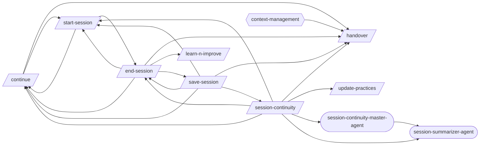
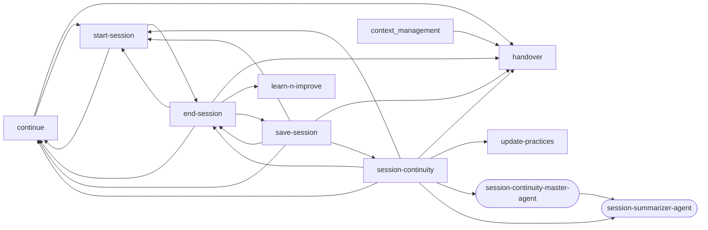
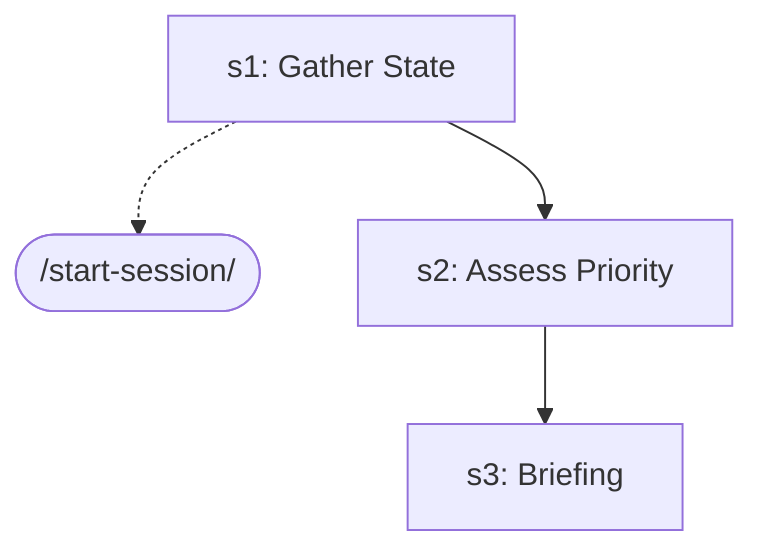
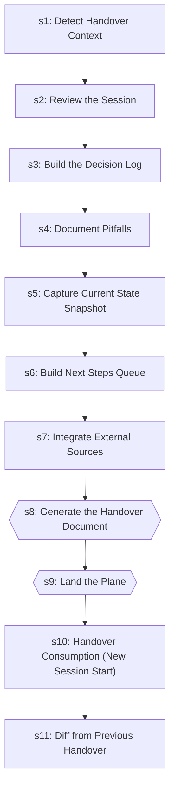
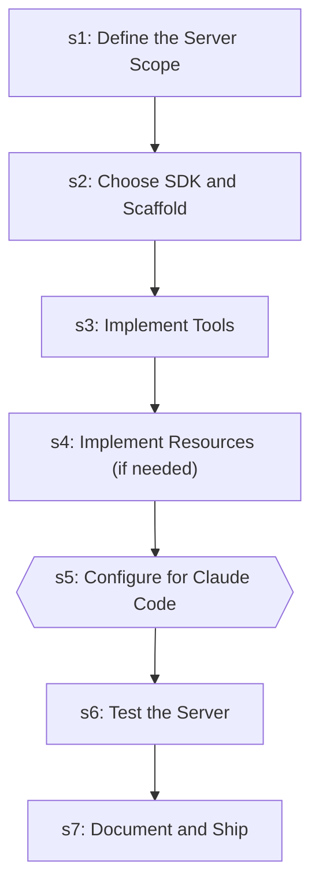
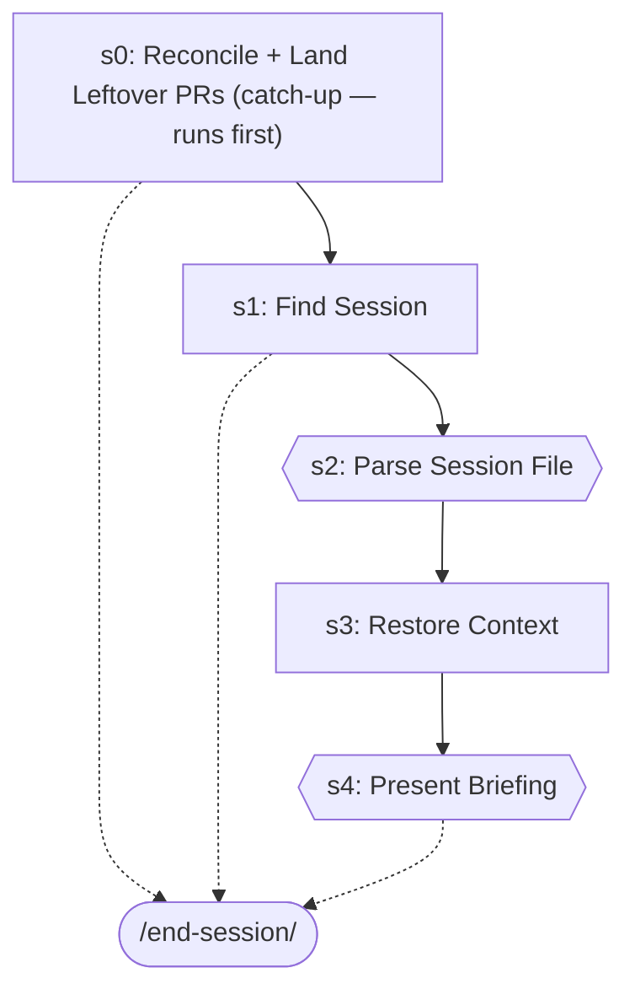
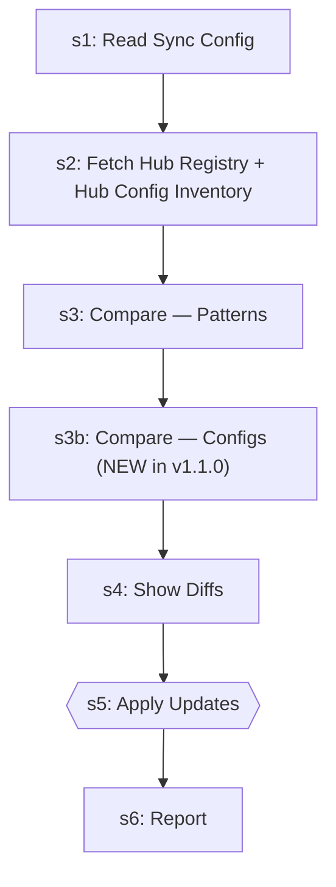

# Session Continuity

> Start, save, resume, and hand over between sessions.

> Auto-generated by `scripts/generate_workflow_docs.py` | Last updated: 2026-06-27 05:58 UTC

## Overview



## Detailed Flow

Step-level flow showing gates (diamonds), delegations (dashed), and artifacts (cylinders).

```mermaid
graph TD
    subgraph branch_choice_sub["Branch Choice"]
        branch_choice_s1["Step 1: Gate — ask ONCE per session"]
        branch_choice_s2{{Step 2: Present the menu}}
        branch_choice_s1 --> branch_choice_s2
        branch_choice_s3{{Step 3: Stale-branch approval (reaper)}}
        branch_choice_s2 --> branch_choice_s3
    end

    subgraph continue_sub["Continue"]
        continue_s1["Step 1: Gather State"]
        start_session_ext([/start-session/])
        continue_s1 -.-> start_session_ext
        continue_s2["Step 2: Assess Priority"]
        continue_s1 --> continue_s2
        continue_s3["Step 3: Briefing"]
        continue_s2 --> continue_s3
    end

    subgraph end_session_sub["End Session"]
        end_session_s1["Step 1: Determine Session Name"]
        end_session_s2{{Step 2: Gather Context}}
        end_session_s1 --> end_session_s2
        end_session_s3["Step 3: Generate Session File"]
        end_session_s2 --> end_session_s3
        end_session_s4["Step 4: Purge Expired Sessions"]
        end_session_s3 --> end_session_s4
        end_session_s5{{Step 5: Land the Session's Work — WAIT for CI, then merge (CLOSE the branch)}}
        end_session_s4 --> end_session_s5
        end_session_s5 -.-> start_session_ext
        end_session_s6{{Step 6: Post-Save Summary}}
        end_session_s5 --> end_session_s6
        learn_n_improve_ext([/learn-n-improve/])
        end_session_s6 -.-> learn_n_improve_ext
    end

    subgraph handover_sub["Handover"]
        handover_s1["Step 1: Detect Handover Context"]
        handover_s2["Step 2: Review the Session"]
        handover_s1 --> handover_s2
        handover_s3["Step 3: Build the Decision Log"]
        handover_s2 --> handover_s3
        handover_s4["Step 4: Document Pitfalls"]
        handover_s3 --> handover_s4
        handover_s5["Step 5: Capture Current State Snapshot"]
        handover_s4 --> handover_s5
        handover_s6["Step 6: Build Next Steps Queue"]
        handover_s5 --> handover_s6
        handover_s7["Step 7: Integrate External Sources"]
        handover_s6 --> handover_s7
        handover_s8{{Step 8: Generate the Handover Document}}
        handover_s7 --> handover_s8
        handover_s9{{Step 9: Land the Plane}}
        handover_s8 --> handover_s9
        handover_s10["Step 10: Handover Consumption (New Session Start)"]
        handover_s9 --> handover_s10
        handover_s11["Step 11: Diff from Previous Handover"]
        handover_s10 --> handover_s11
    end

    subgraph learn_n_improve_sub["Learn N Improve"]
        learn_n_improve_s1{{Step 1: Gather Session Evidence}}
        learn_n_improve_test_results__json[("test-results/*.json")]
        learn_n_improve_s1 -->|writes| learn_n_improve_test_results__json
        learn_n_improve_s2["Step 2: Analyze Outcomes"]
        learn_n_improve_s1 --> learn_n_improve_s2
        learn_n_improve_s3{{Step 3: Build Error→Fix→Lesson Database}}
        learn_n_improve_s2 --> learn_n_improve_s3
        learn_n_improve_s4["Step 4: Update Memory Topics"]
        learn_n_improve_s3 --> learn_n_improve_s4
        learn_n_improve_s5{{Step 5: Pattern Detection (every 10th learning)}}
        learn_n_improve_s4 --> learn_n_improve_s5
        learn_n_improve_s6["Step 6: Report"]
        learn_n_improve_s5 --> learn_n_improve_s6
    end

    subgraph mcp_server_builder_sub["Mcp Server Builder"]
        mcp_server_builder_s1["Step 1: Define the Server Scope"]
        mcp_server_builder_s2["Step 2: Choose SDK and Scaffold"]
        mcp_server_builder_s1 --> mcp_server_builder_s2
        mcp_server_builder_s3["Step 3: Implement Tools"]
        mcp_server_builder_s2 --> mcp_server_builder_s3
        mcp_server_builder_s4["Step 4: Implement Resources (if needed)"]
        mcp_server_builder_s3 --> mcp_server_builder_s4
        mcp_server_builder_s5{{Step 5: Configure for Claude Code}}
        mcp_server_builder_s4 --> mcp_server_builder_s5
        mcp_server_builder_s6["Step 6: Test the Server"]
        mcp_server_builder_s5 --> mcp_server_builder_s6
        mcp_server_builder_s7["Step 7: Document and Ship"]
        mcp_server_builder_s6 --> mcp_server_builder_s7
    end

    subgraph session_continuity_sub["Session Continuity"]
        session_continuity_s1{{Step 1: INIT + MODE DETECTION}}
        update_practices_ext([/update-practices/])
        session_continuity_s1 -.-> update_practices_ext
        session_summarizer_agent_ext((session-summarizer-agent))
        session_continuity_s1 -.-> session_summarizer_agent_ext
        session_continuity_s1_block[/BLOCK/]
        session_continuity_s1 -->|FAILED| session_continuity_s1_block
        session_continuity_s2["Step 2: SAVE (mode == save)"]
        session_continuity_s1 -->|OK| session_continuity_s2
        end_session_ext([/end-session/])
        session_continuity_s2 -.-> end_session_ext
        session_continuity_s2 -.-> session_summarizer_agent_ext
        session_continuity_s3["Step 3: RESTORE (mode == restore OR path arg)"]
        session_continuity_s2 --> session_continuity_s3
        session_continuity_s3 -.-> start_session_ext
        session_continuity_s4{{Step 4: HANDOVER (mode == handover OR after save)}}
        session_continuity_s3 --> session_continuity_s4
        handover_ext([/handover/])
        session_continuity_s4 -.-> handover_ext
        session_continuity_s4 -.-> session_summarizer_agent_ext
        session_continuity_s5{{Step 5: REPORT}}
        session_continuity_s4 --> session_continuity_s5
        continue_ext([/continue/])
        session_continuity_s5 -.-> continue_ext
        session_continuity_master_agent_ext((session-continuity-master-agent))
        session_continuity_s5 -.-> session_continuity_master_agent_ext
        session_continuity_test_results_session_continuity_verdict_json[("test-results/session-continuity-verdict.json")]
        session_continuity_s5 -->|writes| session_continuity_test_results_session_continuity_verdict_json
    end

    subgraph start_session_sub["Start Session"]
        start_session_s0["Step 0: Reconcile + Land Leftover PRs (catch-up — runs first)"]
        start_session_s0 -.-> end_session_ext
        start_session_s1["Step 1: Find Session"]
        start_session_s0 --> start_session_s1
        start_session_s1 -.-> end_session_ext
        start_session_s2{{Step 2: Parse Session File}}
        start_session_s1 --> start_session_s2
        start_session_s3["Step 3: Restore Context"]
        start_session_s2 --> start_session_s3
        start_session_s4{{Step 4: Present Briefing}}
        start_session_s3 --> start_session_s4
        start_session_s4 -.-> end_session_ext
    end

    subgraph update_practices_sub["Update Practices"]
        update_practices_s1["Step 1: Read Sync Config"]
        update_practices_s2["Step 2: Fetch Hub Registry + Hub Config Inventory"]
        update_practices_s1 --> update_practices_s2
        update_practices_s3["Step 3: Compare — Patterns"]
        update_practices_s2 --> update_practices_s3
        update_practices_s3b["Step 3b: Compare — Configs (NEW in v1.1.0)"]
        update_practices_s3 --> update_practices_s3b
        update_practices_s4["Step 4: Show Diffs"]
        update_practices_s3b --> update_practices_s4
        update_practices_s5{{Step 5: Apply Updates}}
        update_practices_s4 --> update_practices_s5
        update_practices_s6["Step 6: Report"]
        update_practices_s5 --> update_practices_s6
    end

    continue_s1 ==> start_session_s0
    end_session_s6 ==> learn_n_improve_s1
    end_session_s5 ==> start_session_s0
    session_continuity_s5 ==> continue_s1
    session_continuity_s2 ==> end_session_s1
    session_continuity_s4 ==> handover_s1
    session_continuity_s3 ==> start_session_s0
    session_continuity_s1 ==> update_practices_s1
    start_session_s0 ==> end_session_s1
```

## Skills

| Skill | Version | Description | Calls | Called By |
|-------|---------|-------------|-------|----------|
| `/branch-choice` | 1.0.0 | Present the once-per-session branch menu at the FIRST file edit of a session ... | — | — |
| `/continue` | 1.1.0 | Resume work from a previous session. Reads continuation state, workflow progr... | `/handover`, `/start-session` | `/end-session`, `/save-session`, `/session-continuity`, `/start-session` |
| `/end-session` | 2.2.0 | End and close a work session — round up everything: state the session goal + ... | `/continue`, `/handover`, `/learn-n-improve`, `/save-session`, `/start-session` | `/save-session`, `/session-continuity`, `/start-session` |
| `/handover` | 1.0.0 | Generate a structured handover document when ending a session, designed for a... | — | `/continue`, `/end-session`, `/save-session`, `/session-continuity` |
| `/learn-n-improve` | 2.4.0 | Analyze session outcomes and update memory topics (testing-lessons, fix-patte... | — | `/end-session` |
| `/mcp-server-builder` | 1.0.0 | Build MCP (Model Context Protocol) servers that extend Claude Code's capabili... | — | — |
| `/save-session` | 2.0.0 | DEPRECATED alias — renamed to /end-session. Run /end-session to round up and ... | `/continue`, `/end-session`, `/handover`, `/session-continuity`, `/start-session` | `/end-session` |
| `/session-continuity` | 2.1.1 | Save, restore, and hand over session context between conversations as a skill... | `/continue`, `/end-session`, `/handover`, `/start-session`, `/update-practices`, `/session-continuity-master-agent`, `/session-summarizer-agent` | `/save-session` |
| `/start-session` | 1.2.0 | Restore a previously saved session checkpoint. Reads a session file from .cla... | `/continue`, `/end-session` | `/continue`, `/end-session`, `/save-session`, `/session-continuity` |
| `/status` | 1.0.1 | Generate a project health snapshot showing git status, test status, and proje... | — | — |
| `/update-practices` | 1.2.1 | Pull latest best practices from the hub into your project's .claude/ director... | — | `/session-continuity` |

## Workflow Steps

### Consolidated Step Flow

End-to-end flow across all skills, showing how steps connect via delegations (thick arrows).

```mermaid
graph TD
    subgraph branch_choice_sub["Branch Choice"]
        branch_choice_s1["Gate — ask ONCE per session"]
        branch_choice_s2{{Present the menu}}
        branch_choice_s1 --> branch_choice_s2
        branch_choice_s3{{Stale-branch approval (reaper)}}
        branch_choice_s2 --> branch_choice_s3
    end

    subgraph continue_sub["Continue"]
        continue_s1["Gather State"]
        continue_s2["Assess Priority"]
        continue_s1 --> continue_s2
        continue_s3["Briefing"]
        continue_s2 --> continue_s3
    end

    subgraph end_session_sub["End Session"]
        end_session_s1["Determine Session Name"]
        end_session_s2{{Gather Context}}
        end_session_s1 --> end_session_s2
        end_session_s3["Generate Session File"]
        end_session_s2 --> end_session_s3
        end_session_s4["Purge Expired Sessions"]
        end_session_s3 --> end_session_s4
        end_session_s5{{Land the Session's Work — WAIT for CI, then merge (CLOSE the branch)}}
        end_session_s4 --> end_session_s5
        end_session_s6{{Post-Save Summary}}
        end_session_s5 --> end_session_s6
    end

    subgraph handover_sub["Handover"]
        handover_s1["Detect Handover Context"]
        handover_s2["Review the Session"]
        handover_s1 --> handover_s2
        handover_s3["Build the Decision Log"]
        handover_s2 --> handover_s3
        handover_s4["Document Pitfalls"]
        handover_s3 --> handover_s4
        handover_s5["Capture Current State Snapshot"]
        handover_s4 --> handover_s5
        handover_s6["Build Next Steps Queue"]
        handover_s5 --> handover_s6
        handover_s7["Integrate External Sources"]
        handover_s6 --> handover_s7
        handover_s8{{Generate the Handover Document}}
        handover_s7 --> handover_s8
        handover_s9{{Land the Plane}}
        handover_s8 --> handover_s9
        handover_s10["Handover Consumption (New Session Start)"]
        handover_s9 --> handover_s10
        handover_s11["Diff from Previous Handover"]
        handover_s10 --> handover_s11
    end

    subgraph learn_n_improve_sub["Learn N Improve"]
        learn_n_improve_s1{{Gather Session Evidence}}
        learn_n_improve_s2["Analyze Outcomes"]
        learn_n_improve_s1 --> learn_n_improve_s2
        learn_n_improve_s3{{Build Error→Fix→Lesson Database}}
        learn_n_improve_s2 --> learn_n_improve_s3
        learn_n_improve_s4["Update Memory Topics"]
        learn_n_improve_s3 --> learn_n_improve_s4
        learn_n_improve_s5{{Pattern Detection (every 10th learning)}}
        learn_n_improve_s4 --> learn_n_improve_s5
        learn_n_improve_s6["Report"]
        learn_n_improve_s5 --> learn_n_improve_s6
    end

    subgraph mcp_server_builder_sub["Mcp Server Builder"]
        mcp_server_builder_s1["Define the Server Scope"]
        mcp_server_builder_s2["Choose SDK and Scaffold"]
        mcp_server_builder_s1 --> mcp_server_builder_s2
        mcp_server_builder_s3["Implement Tools"]
        mcp_server_builder_s2 --> mcp_server_builder_s3
        mcp_server_builder_s4["Implement Resources (if needed)"]
        mcp_server_builder_s3 --> mcp_server_builder_s4
        mcp_server_builder_s5{{Configure for Claude Code}}
        mcp_server_builder_s4 --> mcp_server_builder_s5
        mcp_server_builder_s6["Test the Server"]
        mcp_server_builder_s5 --> mcp_server_builder_s6
        mcp_server_builder_s7["Document and Ship"]
        mcp_server_builder_s6 --> mcp_server_builder_s7
    end

    subgraph session_continuity_sub["Session Continuity"]
        session_continuity_s1{{INIT + MODE DETECTION}}
        session_continuity_s2["SAVE (mode == save)"]
        session_continuity_s1 --> session_continuity_s2
        session_continuity_s3["RESTORE (mode == restore OR path arg)"]
        session_continuity_s2 --> session_continuity_s3
        session_continuity_s4{{HANDOVER (mode == handover OR after save)}}
        session_continuity_s3 --> session_continuity_s4
        session_continuity_s5{{REPORT}}
        session_continuity_s4 --> session_continuity_s5
    end

    subgraph start_session_sub["Start Session"]
        start_session_s0["Reconcile + Land Leftover PRs (catch-up — runs first)"]
        start_session_s1["Find Session"]
        start_session_s0 --> start_session_s1
        start_session_s2{{Parse Session File}}
        start_session_s1 --> start_session_s2
        start_session_s3["Restore Context"]
        start_session_s2 --> start_session_s3
        start_session_s4{{Present Briefing}}
        start_session_s3 --> start_session_s4
    end

    subgraph update_practices_sub["Update Practices"]
        update_practices_s1["Read Sync Config"]
        update_practices_s2["Fetch Hub Registry + Hub Config Inventory"]
        update_practices_s1 --> update_practices_s2
        update_practices_s3["Compare — Patterns"]
        update_practices_s2 --> update_practices_s3
        update_practices_s3b["Compare — Configs (NEW in v1.1.0)"]
        update_practices_s3 --> update_practices_s3b
        update_practices_s4["Show Diffs"]
        update_practices_s3b --> update_practices_s4
        update_practices_s5{{Apply Updates}}
        update_practices_s4 --> update_practices_s5
        update_practices_s6["Report"]
        update_practices_s5 --> update_practices_s6
    end

    continue_s1 ==> start_session_s0
    end_session_s5 ==> start_session_s0
    end_session_s6 ==> learn_n_improve_s1
    session_continuity_s1 ==> update_practices_s1
    session_continuity_s2 ==> end_session_s1
    session_continuity_s3 ==> start_session_s0
    session_continuity_s4 ==> handover_s1
    session_continuity_s5 ==> continue_s1
    start_session_s0 ==> end_session_s1
    start_session_s1 ==> end_session_s1
    start_session_s4 ==> end_session_s1
```

### Entry Points

Double-bordered nodes are user-facing entry points (no incoming references). Rounded nodes are agents.



### branch-choice

```mermaid
graph TD
    s1["s1: Gate — ask ONCE per session"]
    s2{{s2: Present the menu}}
    s1 --> s2
    s3{{s3: Stale-branch approval (reaper)}}
    s2 --> s3
```

| Step | Title | Delegates To | Artifacts | Gates/Decisions |
|------|-------|-------------|-----------|----------------|
| 1 | Gate — ask ONCE per session | — | — | — |
| 2 | Present the menu | — | — | gate, decision |
| 3 | Stale-branch approval (reaper) | — | — | gate, decision |

### continue



| Step | Title | Delegates To | Artifacts | Gates/Decisions |
|------|-------|-------------|-----------|----------------|
| 1 | Gather State | `/start-session` | — | decision |
| 2 | Assess Priority | — | — | — |
| 3 | Briefing | — | — | — |

### end-session

```mermaid
graph TD
    s1["s1: Determine Session Name"]
    s2{{s2: Gather Context}}
    s1 --> s2
    s3["s3: Generate Session File"]
    s2 --> s3
    s4["s4: Purge Expired Sessions"]
    s3 --> s4
    s5{{s5: Land the Session's Work — WAIT for CI, then merge (CLOSE the branch)}}
    s4 --> s5
    start_session_ext([/start-session/])
    s5 -.-> start_session_ext
    s6{{s6: Post-Save Summary}}
    s5 --> s6
    learn_n_improve_ext([/learn-n-improve/])
    s6 -.-> learn_n_improve_ext
```

| Step | Title | Delegates To | Artifacts | Gates/Decisions |
|------|-------|-------------|-----------|----------------|
| 1 | Determine Session Name | — | — | decision |
| 2 | Gather Context | — | — | gate, decision |
| 3 | Generate Session File | — | — | decision |
| 4 | Purge Expired Sessions | — | — | decision |
| 5 | Land the Session's Work — WAIT for CI, then merge (CLOSE the branch) | `/start-session` | — | gate |
| 6 | Post-Save Summary | `/learn-n-improve` | — | gate, decision |

### handover



| Step | Title | Delegates To | Artifacts | Gates/Decisions |
|------|-------|-------------|-----------|----------------|
| 1 | Detect Handover Context | — | — | decision |
| 2 | Review the Session | — | — | — |
| 3 | Build the Decision Log | — | — | — |
| 4 | Document Pitfalls | — | — | — |
| 5 | Capture Current State Snapshot | — | — | — |
| 6 | Build Next Steps Queue | — | — | — |
| 7 | Integrate External Sources | — | — | — |
| 8 | Generate the Handover Document | — | — | gate, decision |
| 9 | Land the Plane | — | — | gate, decision |
| 10 | Handover Consumption (New Session Start) | — | — | decision |
| 11 | Diff from Previous Handover | — | — | decision |

### learn-n-improve

```mermaid
graph TD
    s1{{s1: Gather Session Evidence}}
    s2["s2: Analyze Outcomes"]
    s1 --> s2
    s3{{s3: Build Error→Fix→Lesson Database}}
    s2 --> s3
    s4["s4: Update Memory Topics"]
    s3 --> s4
    s5{{s5: Pattern Detection (every 10th learning)}}
    s4 --> s5
    s6["s6: Report"]
    s5 --> s6
```

| Step | Title | Delegates To | Artifacts | Gates/Decisions |
|------|-------|-------------|-----------|----------------|
| 1 | Gather Session Evidence | — | → `test-results/*.json` | gate, decision |
| 2 | Analyze Outcomes | — | — | — |
| 3 | Build Error→Fix→Lesson Database | — | — | gate, decision |
| 4 | Update Memory Topics | — | — | — |
| 5 | Pattern Detection (every 10th learning) | — | — | gate |
| 6 | Report | — | — | — |

### mcp-server-builder



| Step | Title | Delegates To | Artifacts | Gates/Decisions |
|------|-------|-------------|-----------|----------------|
| 1 | Define the Server Scope | — | — | — |
| 2 | Choose SDK and Scaffold | — | — | — |
| 3 | Implement Tools | — | — | — |
| 4 | Implement Resources (if needed) | — | — | — |
| 5 | Configure for Claude Code | — | — | gate |
| 6 | Test the Server | — | — | — |
| 7 | Document and Ship | — | — | — |

### session-continuity

```mermaid
graph TD
    s1{{s1: INIT + MODE DETECTION}}
    update_practices_ext([/update-practices/])
    s1 -.-> update_practices_ext
    session_summarizer_agent_ext((session-summarizer-agent))
    s1 -.-> session_summarizer_agent_ext
    s1_block[/BLOCK/]
    s1 -->|FAILED| s1_block
    s2["s2: SAVE (mode == save)"]
    s1 -->|OK| s2
    end_session_ext([/end-session/])
    s2 -.-> end_session_ext
    session_summarizer_agent_ext((session-summarizer-agent))
    s2 -.-> session_summarizer_agent_ext
    s3["s3: RESTORE (mode == restore OR path arg)"]
    s2 --> s3
    start_session_ext([/start-session/])
    s3 -.-> start_session_ext
    s4{{s4: HANDOVER (mode == handover OR after save)}}
    s3 --> s4
    handover_ext([/handover/])
    s4 -.-> handover_ext
    session_summarizer_agent_ext((session-summarizer-agent))
    s4 -.-> session_summarizer_agent_ext
    s5{{s5: REPORT}}
    s4 --> s5
    continue_ext([/continue/])
    s5 -.-> continue_ext
    session_continuity_master_agent_ext((session-continuity-master-agent))
    s5 -.-> session_continuity_master_agent_ext
```

| Step | Title | Delegates To | Artifacts | Gates/Decisions |
|------|-------|-------------|-----------|----------------|
| 1 | INIT + MODE DETECTION | `/update-practices`, `session-summarizer-agent` | — | gate, decision, BLOCK |
| 2 | SAVE (mode == save) | `/end-session`, `session-summarizer-agent` | — | — |
| 3 | RESTORE (mode == restore OR path arg) | `/start-session` | — | — |
| 4 | HANDOVER (mode == handover OR after save) | `/handover`, `session-summarizer-agent` | — | gate |
| 5 | REPORT | `/continue`, `session-continuity-master-agent` | → `test-results/session-continuity-verdict.json` | gate, decision |

### start-session



| Step | Title | Delegates To | Artifacts | Gates/Decisions |
|------|-------|-------------|-----------|----------------|
| 0 | Reconcile + Land Leftover PRs (catch-up — runs first) | `/end-session` | — | — |
| 1 | Find Session | `/end-session` | — | decision |
| 2 | Parse Session File | — | — | gate, decision |
| 3 | Restore Context | — | — | decision |
| 4 | Present Briefing | `/end-session` | — | gate, decision |

### update-practices



| Step | Title | Delegates To | Artifacts | Gates/Decisions |
|------|-------|-------------|-----------|----------------|
| 1 | Read Sync Config | — | — | decision |
| 2 | Fetch Hub Registry + Hub Config Inventory | — | — | — |
| 3 | Compare — Patterns | — | — | decision |
| 3b | Compare — Configs (NEW in v1.1.0) | — | — | decision |
| 4 | Show Diffs | — | — | — |
| 5 | Apply Updates | — | — | gate, decision |
| 6 | Report | — | — | — |


## Agents

| Agent | Description | Dispatched By |
|-------|-------------|---------------|
| `session-continuity-master-agent` | DEPRECATED 2026-04-25 (Phase 3.6 of subagent-dispatch-platform-limit remediat... | `/session-continuity` |
| `session-summarizer-agent` | Use proactively to auto-generate session summary updates at session end. Spaw... | `/session-continuity`, `/session-continuity-master-agent` |

## Rules

| Rule | Description |
|------|-------------|
| `context-management` |  |

## Cross-Workflow Connections

**Outgoing** (this workflow feeds into):
- `skill-factory` (skill)

**Incoming** (fed by):
- `code-review-workflow` (skill)
- `continuous-improvement` (rule)
- `debugging-loop` (skill)
- `development-loop` (skill)
- `documentation-workflow` (skill)
- `e2e-visual-run` (skill)
- `engineering-roles` (rule)
- `executing-plans` (skill)
- `fastapi-run-backend-tests` (skill)
- `implement` (skill)
- `learning-self-improvement` (skill)
- `learning-self-improvement-master-agent` (agent)
- `learnings-routing` (rule)
- `loop-engineering` (skill)
- `pattern-structure` (rule)
- `post-fix-pipeline` (skill)
- `prompt-auto-enhance` (rule)
- `skill-authoring-workflow` (skill)
- `test-knowledge` (skill)
- `test-pipeline` (skill)
- `workflow-master-template` (agent)

<!-- MANUAL ANNOTATIONS -->
<!-- Add custom notes below this line. They are preserved on regeneration. -->
