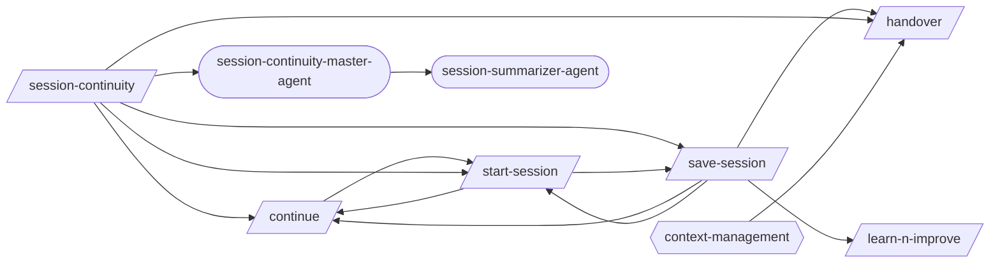
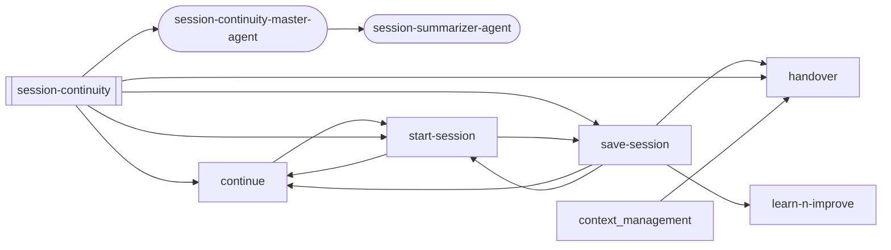
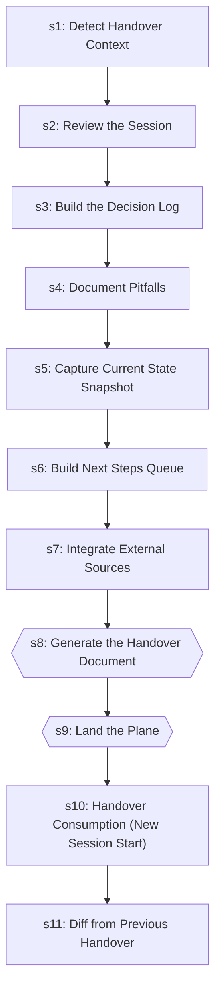
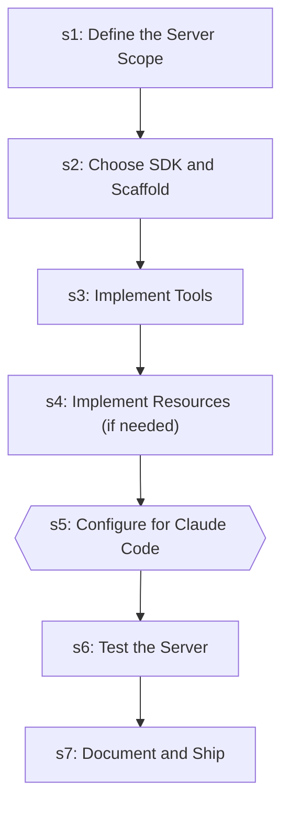
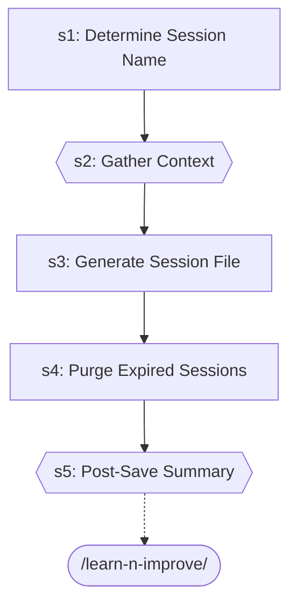
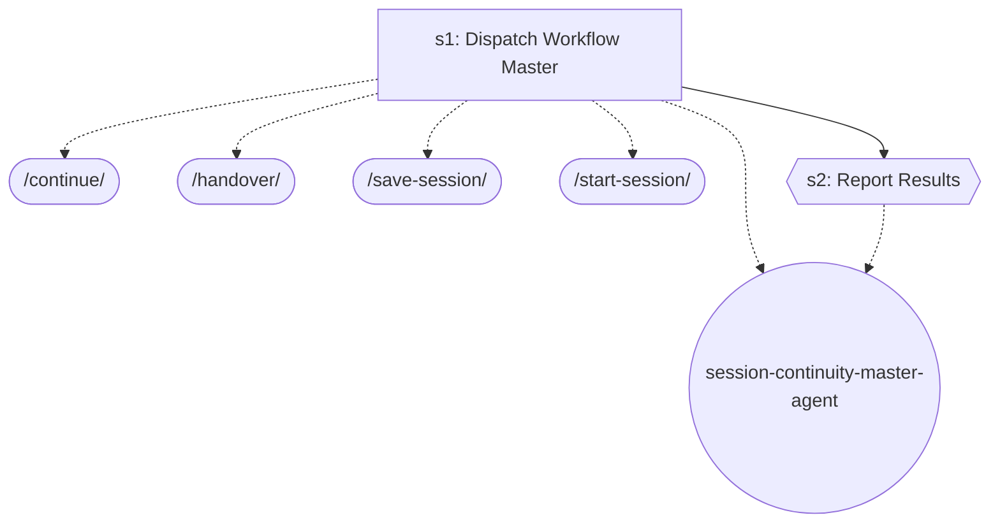
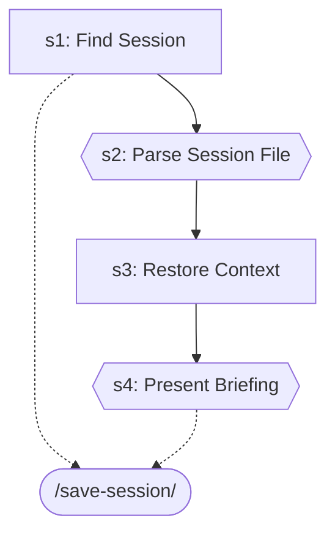

# Session Continuity

> Start, save, resume, and hand over between sessions.

> Auto-generated by `scripts/generate_workflow_docs.py` | Last updated: 2026-04-02 18:07 UTC

## Overview



## Detailed Flow

Step-level flow showing gates (diamonds), delegations (dashed), and artifacts (cylinders).

```mermaid
graph TD
    subgraph continue_sub["Continue"]
        continue_s1["Step 1: Gather State"]
        start_session_ext([/start-session/])
        continue_s1 -.-> start_session_ext
        continue_s2["Step 2: Assess Priority"]
        continue_s1 --> continue_s2
        continue_s3["Step 3: Briefing"]
        continue_s2 --> continue_s3
    end

    subgraph handover_sub["Handover"]
        handover_s1["Step 1: Detect Handover Context"]
        handover_s2["Step 2: Review the Session"]
        handover_s1 --> handover_s2
        handover_s3["Step 3: Build the Decision Log"]
        handover_s2 --> handover_s3
        handover_s4["Step 4: Document Pitfalls"]
        handover_s3 --> handover_s4
        handover_s5["Step 5: Capture Current State Snapshot"]
        handover_s4 --> handover_s5
        handover_s6["Step 6: Build Next Steps Queue"]
        handover_s5 --> handover_s6
        handover_s7["Step 7: Integrate External Sources"]
        handover_s6 --> handover_s7
        handover_s8{{Step 8: Generate the Handover Document}}
        handover_s7 --> handover_s8
        handover_s9{{Step 9: Land the Plane}}
        handover_s8 --> handover_s9
        handover_s10["Step 10: Handover Consumption (New Session Start)"]
        handover_s9 --> handover_s10
        handover_s11["Step 11: Diff from Previous Handover"]
        handover_s10 --> handover_s11
    end

    subgraph learn_n_improve_sub["Learn N Improve"]
        learn_n_improve_s1["Step 1: Gather Session Evidence"]
        learn_n_improve_s2["Step 2: Analyze Outcomes"]
        learn_n_improve_s1 --> learn_n_improve_s2
        learn_n_improve_s3{{Step 3: Build Error→Fix→Lesson Database}}
        learn_n_improve_s2 --> learn_n_improve_s3
        learn_n_improve_s4["Step 4: Update Memory Topics"]
        learn_n_improve_s3 --> learn_n_improve_s4
        learn_n_improve_s5{{Step 5: Pattern Detection (every 10th learning)}}
        learn_n_improve_s4 --> learn_n_improve_s5
        learn_n_improve_s6["Step 6: Report"]
        learn_n_improve_s5 --> learn_n_improve_s6
    end

    subgraph mcp_server_builder_sub["Mcp Server Builder"]
        mcp_server_builder_s1["Step 1: Define the Server Scope"]
        mcp_server_builder_s2["Step 2: Choose SDK and Scaffold"]
        mcp_server_builder_s1 --> mcp_server_builder_s2
        mcp_server_builder_s3["Step 3: Implement Tools"]
        mcp_server_builder_s2 --> mcp_server_builder_s3
        mcp_server_builder_s4["Step 4: Implement Resources (if needed)"]
        mcp_server_builder_s3 --> mcp_server_builder_s4
        mcp_server_builder_s5{{Step 5: Configure for Claude Code}}
        mcp_server_builder_s4 --> mcp_server_builder_s5
        mcp_server_builder_s6["Step 6: Test the Server"]
        mcp_server_builder_s5 --> mcp_server_builder_s6
        mcp_server_builder_s7["Step 7: Document and Ship"]
        mcp_server_builder_s6 --> mcp_server_builder_s7
    end

    subgraph save_session_sub["Save Session"]
        save_session_s1["Step 1: Determine Session Name"]
        save_session_s2{{Step 2: Gather Context}}
        save_session_s1 --> save_session_s2
        save_session_s3["Step 3: Generate Session File"]
        save_session_s2 --> save_session_s3
        save_session_s4["Step 4: Purge Expired Sessions"]
        save_session_s3 --> save_session_s4
        save_session_s5{{Step 5: Post-Save Summary}}
        save_session_s4 --> save_session_s5
        learn_n_improve_ext([/learn-n-improve/])
        save_session_s5 -.-> learn_n_improve_ext
    end

    subgraph start_session_sub["Start Session"]
        start_session_s1["Step 1: Find Session"]
        save_session_ext([/save-session/])
        start_session_s1 -.-> save_session_ext
        start_session_s2{{Step 2: Parse Session File}}
        start_session_s1 --> start_session_s2
        start_session_s3["Step 3: Restore Context"]
        start_session_s2 --> start_session_s3
        start_session_s4{{Step 4: Present Briefing}}
        start_session_s3 --> start_session_s4
        start_session_s4 -.-> save_session_ext
    end

    continue_s1 ==> start_session_s1
    save_session_s5 ==> learn_n_improve_s1
    start_session_s1 ==> save_session_s1
```

## Skills

| Skill | Version | Description | Calls | Called By |
|-------|---------|-------------|-------|----------|
| `/continue` | 1.1.0 | Resume work from a previous session. Reads continuation state, workflow progr... | `/start-session` | `/save-session`, `/session-continuity`, `/start-session` |
| `/handover` | 1.0.0 | Generate a structured handover document when ending a session, designed for a... | — | `/save-session`, `/session-continuity` |
| `/learn-n-improve` | 2.3.0 | Analyze session outcomes and update memory topics (testing-lessons, fix-patte... | — | `/save-session` |
| `/mcp-server-builder` | 1.0.0 | Build MCP (Model Context Protocol) servers that extend Claude Code's capabili... | — | — |
| `/save-session` | 1.1.0 | Save a structured session checkpoint capturing working files, git state, key ... | `/continue`, `/handover`, `/learn-n-improve`, `/start-session` | `/session-continuity`, `/start-session` |
| `/session-continuity` | 1.0.0 | Save, restore, and hand over session context between conversations. Use when ... | `/continue`, `/handover`, `/save-session`, `/start-session`, `/session-continuity-master-agent` | — |
| `/start-session` | 1.0.0 | Restore a previously saved session checkpoint. Reads a session file from .cla... | `/continue`, `/save-session` | `/continue`, `/save-session`, `/session-continuity` |
| `/status` | 1.0.1 | Generate a project health snapshot showing git status, test status, and proje... | — | — |

## Workflow Steps

### Consolidated Step Flow

End-to-end flow across all skills, showing how steps connect via delegations (thick arrows).

```mermaid
graph TD
    subgraph continue_sub["Continue"]
        continue_s1["Gather State"]
        continue_s2["Assess Priority"]
        continue_s1 --> continue_s2
        continue_s3["Briefing"]
        continue_s2 --> continue_s3
    end

    subgraph handover_sub["Handover"]
        handover_s1["Detect Handover Context"]
        handover_s2["Review the Session"]
        handover_s1 --> handover_s2
        handover_s3["Build the Decision Log"]
        handover_s2 --> handover_s3
        handover_s4["Document Pitfalls"]
        handover_s3 --> handover_s4
        handover_s5["Capture Current State Snapshot"]
        handover_s4 --> handover_s5
        handover_s6["Build Next Steps Queue"]
        handover_s5 --> handover_s6
        handover_s7["Integrate External Sources"]
        handover_s6 --> handover_s7
        handover_s8{{Generate the Handover Document}}
        handover_s7 --> handover_s8
        handover_s9{{Land the Plane}}
        handover_s8 --> handover_s9
        handover_s10["Handover Consumption (New Session Start)"]
        handover_s9 --> handover_s10
        handover_s11["Diff from Previous Handover"]
        handover_s10 --> handover_s11
    end

    subgraph learn_n_improve_sub["Learn N Improve"]
        learn_n_improve_s1["Gather Session Evidence"]
        learn_n_improve_s2["Analyze Outcomes"]
        learn_n_improve_s1 --> learn_n_improve_s2
        learn_n_improve_s3{{Build Error→Fix→Lesson Database}}
        learn_n_improve_s2 --> learn_n_improve_s3
        learn_n_improve_s4["Update Memory Topics"]
        learn_n_improve_s3 --> learn_n_improve_s4
        learn_n_improve_s5{{Pattern Detection (every 10th learning)}}
        learn_n_improve_s4 --> learn_n_improve_s5
        learn_n_improve_s6["Report"]
        learn_n_improve_s5 --> learn_n_improve_s6
    end

    subgraph mcp_server_builder_sub["Mcp Server Builder"]
        mcp_server_builder_s1["Define the Server Scope"]
        mcp_server_builder_s2["Choose SDK and Scaffold"]
        mcp_server_builder_s1 --> mcp_server_builder_s2
        mcp_server_builder_s3["Implement Tools"]
        mcp_server_builder_s2 --> mcp_server_builder_s3
        mcp_server_builder_s4["Implement Resources (if needed)"]
        mcp_server_builder_s3 --> mcp_server_builder_s4
        mcp_server_builder_s5{{Configure for Claude Code}}
        mcp_server_builder_s4 --> mcp_server_builder_s5
        mcp_server_builder_s6["Test the Server"]
        mcp_server_builder_s5 --> mcp_server_builder_s6
        mcp_server_builder_s7["Document and Ship"]
        mcp_server_builder_s6 --> mcp_server_builder_s7
    end

    subgraph save_session_sub["Save Session"]
        save_session_s1["Determine Session Name"]
        save_session_s2{{Gather Context}}
        save_session_s1 --> save_session_s2
        save_session_s3["Generate Session File"]
        save_session_s2 --> save_session_s3
        save_session_s4["Purge Expired Sessions"]
        save_session_s3 --> save_session_s4
        save_session_s5{{Post-Save Summary}}
        save_session_s4 --> save_session_s5
    end

    subgraph session_continuity_sub["Session Continuity"]
        session_continuity_s1["Dispatch Workflow Master"]
        session_continuity_s2{{Report Results}}
        session_continuity_s1 --> session_continuity_s2
    end

    subgraph start_session_sub["Start Session"]
        start_session_s1["Find Session"]
        start_session_s2{{Parse Session File}}
        start_session_s1 --> start_session_s2
        start_session_s3["Restore Context"]
        start_session_s2 --> start_session_s3
        start_session_s4{{Present Briefing}}
        start_session_s3 --> start_session_s4
    end

    continue_s1 ==> start_session_s1
    save_session_s5 ==> learn_n_improve_s1
    session_continuity_s1 ==> continue_s1
    session_continuity_s1 ==> handover_s1
    session_continuity_s1 ==> save_session_s1
    session_continuity_s1 ==> start_session_s1
    start_session_s1 ==> save_session_s1
    start_session_s4 ==> save_session_s1
```

### Entry Points

Double-bordered nodes are user-facing entry points (no incoming references). Rounded nodes are agents.



### continue


| Step | Title | Delegates To | Artifacts | Gates/Decisions |
|------|-------|-------------|-----------|----------------|
| 1 | Gather State | `/start-session` | — | decision |
| 2 | Assess Priority | — | — | — |
| 3 | Briefing | — | — | — |

### handover



| Step | Title | Delegates To | Artifacts | Gates/Decisions |
|------|-------|-------------|-----------|----------------|
| 1 | Detect Handover Context | — | — | decision |
| 2 | Review the Session | — | — | — |
| 3 | Build the Decision Log | — | — | — |
| 4 | Document Pitfalls | — | — | — |
| 5 | Capture Current State Snapshot | — | — | — |
| 6 | Build Next Steps Queue | — | — | — |
| 7 | Integrate External Sources | — | — | — |
| 8 | Generate the Handover Document | — | — | gate, decision |
| 9 | Land the Plane | — | — | gate, decision |
| 10 | Handover Consumption (New Session Start) | — | — | decision |
| 11 | Diff from Previous Handover | — | — | decision |

### learn-n-improve

```mermaid
graph TD
    s1["s1: Gather Session Evidence"]
    s2["s2: Analyze Outcomes"]
    s1 --> s2
    s3{{s3: Build Error→Fix→Lesson Database}}
    s2 --> s3
    s4["s4: Update Memory Topics"]
    s3 --> s4
    s5{{s5: Pattern Detection (every 10th learning)}}
    s4 --> s5
    s6["s6: Report"]
    s5 --> s6
```

| Step | Title | Delegates To | Artifacts | Gates/Decisions |
|------|-------|-------------|-----------|----------------|
| 1 | Gather Session Evidence | — | — | — |
| 2 | Analyze Outcomes | — | — | — |
| 3 | Build Error→Fix→Lesson Database | — | — | gate, decision |
| 4 | Update Memory Topics | — | — | — |
| 5 | Pattern Detection (every 10th learning) | — | — | gate |
| 6 | Report | — | — | — |

### mcp-server-builder



| Step | Title | Delegates To | Artifacts | Gates/Decisions |
|------|-------|-------------|-----------|----------------|
| 1 | Define the Server Scope | — | — | — |
| 2 | Choose SDK and Scaffold | — | — | — |
| 3 | Implement Tools | — | — | — |
| 4 | Implement Resources (if needed) | — | — | — |
| 5 | Configure for Claude Code | — | — | gate |
| 6 | Test the Server | — | — | — |
| 7 | Document and Ship | — | — | — |

### save-session



| Step | Title | Delegates To | Artifacts | Gates/Decisions |
|------|-------|-------------|-----------|----------------|
| 1 | Determine Session Name | — | — | decision |
| 2 | Gather Context | — | — | gate, decision |
| 3 | Generate Session File | — | — | decision |
| 4 | Purge Expired Sessions | — | — | decision |
| 5 | Post-Save Summary | `/learn-n-improve` | — | gate, decision |

### session-continuity



| Step | Title | Delegates To | Artifacts | Gates/Decisions |
|------|-------|-------------|-----------|----------------|
| 1 | Dispatch Workflow Master | `/continue`, `/handover`, `/save-session`, `/start-session`, `session-continuity-master-agent` | — | decision |
| 2 | Report Results | `session-continuity-master-agent` | — | gate |

### start-session



| Step | Title | Delegates To | Artifacts | Gates/Decisions |
|------|-------|-------------|-----------|----------------|
| 1 | Find Session | `/save-session` | — | decision |
| 2 | Parse Session File | — | — | gate, decision |
| 3 | Restore Context | — | — | decision |
| 4 | Present Briefing | `/save-session` | — | gate, decision |


## Agents

| Agent | Description | Dispatched By |
|-------|-------------|---------------|
| `session-continuity-master-agent` | Orchestrate session save, restore, and handover between conversations. Use wh... | `/session-continuity` |
| `session-summarizer-agent` | Use proactively to auto-generate session summary updates at session end. Spaw... | `/session-continuity-master-agent` |

## Rules

| Rule | Description |
|------|-------------|
| `context-management` |  |

## Cross-Workflow Connections

**Outgoing** (this workflow feeds into):
- `writing-skills` (skill)

**Incoming** (fed by):
- `executing-plans` (skill)
- `implement` (skill)
- `learning-self-improvement-master-agent` (agent)
- `post-fix-pipeline` (skill)

<!-- MANUAL ANNOTATIONS -->
<!-- Add custom notes below this line. They are preserved on regeneration. -->
