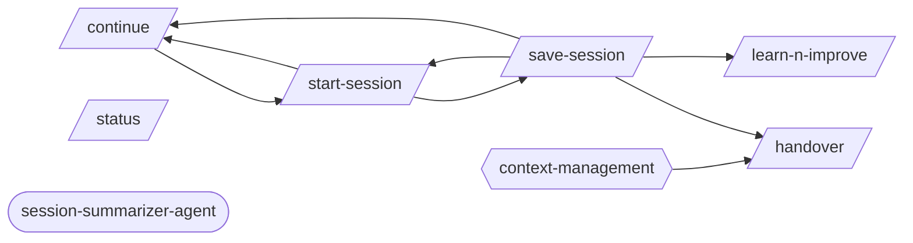

# Session Continuity

> Start, save, resume, and hand over between sessions.

> Auto-generated by `scripts/generate_workflow_docs.py` | Last updated: 2026-03-21 12:02 UTC

## Flow Diagram

## Skills

| Skill | Version | Description | Calls | Called By |
|-------|---------|-------------|-------|----------|
| `/continue` | 1.1.0 | Resume work from a previous session. Reads continuation state, workflow progr... | `/start-session` | `/save-session`, `/start-session` |
| `/handover` | 1.0.0 | Generate a structured handover document when ending a session, designed for a... | — | `/save-session` |
| `/learn-n-improve` | 2.0.0 | Learning system analysis and self-modification. Analyzes session outcomes, up... | — | `/save-session` |
| `/save-session` | 1.1.0 | Save a structured session checkpoint capturing working files, git state, key ... | `/continue`, `/handover`, `/learn-n-improve`, `/start-session` | `/start-session` |
| `/start-session` | 1.0.0 | Restore a previously saved session checkpoint. Reads a session file from .cla... | `/continue`, `/save-session` | `/continue`, `/save-session` |
| `/status` | 1.0.1 | Quick project health snapshot. Shows git status, test status, and project sta... | — | — |

## Agents

| Agent | Description | Dispatched By |
|-------|-------------|---------------|
| `session-summarizer-agent` | Use this agent to auto-generate session summary updates at session end. Reads... | — |

## Rules

| Rule | Description |
|------|-------------|
| `context-management` | Rules for managing context window, token usage, and documentation references. |

## Cross-Workflow Connections

**Outgoing** (this workflow feeds into):
- `writing-skills` (skill)

**Incoming** (fed by):
- `executing-plans` (skill)
- `implement` (skill)
- `post-fix-pipeline` (skill)

<!-- MANUAL ANNOTATIONS -->
<!-- Add custom notes below this line. They are preserved on regeneration. -->

<!-- Add custom notes below this line. They are preserved on regeneration. -->

<!-- Add custom notes below this line. They are preserved on regeneration. -->
