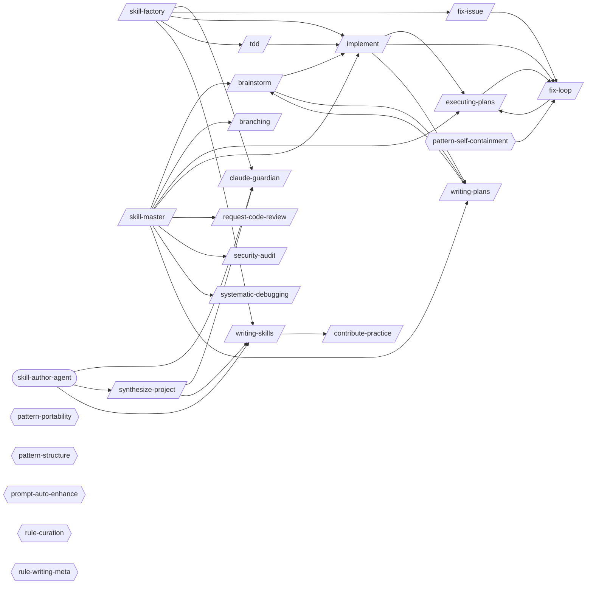

# Skill Authoring

> Creating, validating, and maintaining skills, agents, and rules.

> Auto-generated by `scripts/generate_workflow_docs.py` | Last updated: 2026-03-21 11:56 UTC

## Flow Diagram

## Skills

| Skill | Version | Description | Calls | Called By |
|-------|---------|-------------|-------|----------|
| `/brainstorm` | 1.0.0 | Socratic questioning phase before planning or implementation. Explores intent... | `/implement`, `/writing-plans` | `/skill-master`, `/writing-plans` |
| `/branching` | 1.0.1 | Full branch lifecycle management — from creation through merge and cleanup. C... | — | `/skill-master` |
| `/claude-guardian` | 1.0.0 | Use when adding rules/conventions to CLAUDE.md files, when CLAUDE.md files ha... | — | `/skill-factory`, `/synthesize-project`, `/skill-author-agent` |
| `/contribute-practice` | 2.0.0 | Push a pattern from your project to the best practices hub. Validates pattern... | — | `/writing-skills` |
| `/executing-plans` | 1.0.0 | Execute a pre-written implementation plan step by step. Parses tasks from a p... | `/fix-loop` | `/fix-loop`, `/implement`, `/skill-master` |
| `/fix-issue` | 1.0.0 | Analyze and implement a fix for a specific GitHub Issue. Fetches issue detail... | `/fix-loop` | `/skill-factory` |
| `/fix-loop` | 1.2.0 | Iterative fix cycle: analyze failures, apply minimal fixes, optionally retest... | `/executing-plans` | `/executing-plans`, `/fix-issue`, `/implement` |
| `/implement` | 1.0.0 | Implement a feature or fix following a structured workflow: requirements anal... | `/executing-plans`, `/fix-loop`, `/writing-plans` | `/brainstorm`, `/skill-factory`, `/skill-master`, `/tdd` |
| `/request-code-review` | 1.0.0 | Create high-quality, review-optimized pull requests that surface risks, gener... | — | `/skill-master` |
| `/security-audit` | 1.0.0 | Comprehensive security audit workflow: static analysis with CodeQL and Semgre... | — | `/skill-master` |
| `/skill-factory` | 3.0.0 | Detect repeated workflows in session logs and classify them into the right au... | `/claude-guardian`, `/fix-issue`, `/implement`, `/tdd`, `/writing-skills` | — |
| `/skill-master` | 1.0.0 | Route user requests to the right skill by dynamically discovering all availab... | `/brainstorm`, `/branching`, `/executing-plans`, `/implement`, `/request-code-review`, `/security-audit`, `/systematic-debugging`, `/writing-plans` | — |
| `/synthesize-project` | 4.0.0 | Provision hub patterns AND generate project-specific .claude/ patterns for a ... | `/claude-guardian`, `/writing-skills` | `/skill-author-agent` |
| `/systematic-debugging` | 1.0.0 | Debug failures methodically using a structured diagnosis workflow: reproduce,... | — | `/skill-master` |
| `/tdd` | 1.0.1 | Execute strict Test-Driven Development using the red-green-refactor cycle. Wr... | `/implement` | `/skill-factory` |
| `/writing-plans` | 1.0.0 | Generate detailed implementation plans with bite-sized tasks, exact file path... | `/brainstorm` | `/brainstorm`, `/implement`, `/skill-master` |
| `/writing-skills` | 2.0.0 | Guide for intentionally authoring new Claude Code skills from scratch or from... | `/contribute-practice` | `/skill-factory`, `/synthesize-project`, `/skill-author-agent` |

## Agents

| Agent | Description | Dispatched By |
|-------|-------------|---------------|
| `skill-author-agent` | Create, update, or manage Claude Code skills, rules, and agents using the ded... | — |

## Rules

| Rule | Description |
|------|-------------|
| `pattern-portability` | Portability standards for patterns distributed via core/.claude/. Ensures pat... |
| `pattern-self-containment` | Self-containment and completeness standards for patterns in core/.claude/. Pr... |
| `pattern-structure` | Structural requirements for skills, agents, and rules in core/.claude/. Enfor... |
| `prompt-auto-enhance` | Auto-enhance every user prompt with project-specific context before acting. P... |
| `rule-curation` | Guidelines for curating all patterns (skills, agents, rules) added to the dis... |
| `rule-writing-meta` | Meta-guidance for writing effective CLAUDE.md rules, choosing config file pla... |

## Cross-Workflow Connections

**Outgoing** (this workflow feeds into):
- `adversarial-review` (skill)
- `continue` (skill)
- `contract-test` (skill)
- `db-migrate-verify` (skill)
- `learn-n-improve` (skill)
- `plan-to-issues` (skill)
- `post-fix-pipeline` (skill)
- `synthesize-hub` (skill)
- `verify-screenshots` (skill)

**Incoming** (fed by):
- `adversarial-review` (skill)
- `android-run-e2e` (skill)
- `android-run-tests` (skill)
- `anthropic-agent-orchestration-guide` (skill)
- `auto-verify` (skill)
- `fastapi-run-backend-tests` (skill)
- `learn-n-improve` (skill)
- `pr-standards` (skill)
- `prd-parser` (skill)
- `project-manager-agent` (agent)
- `project-scaffold` (skill)
- `prompt-auto-enhance-rule` (rule)
- `provision-report` (skill)
- `review-gate` (skill)
- `security-auditor-agent` (agent)
- `ssot-audit` (skill)
- `subagent-driven-dev` (skill)
- `synthesize-hub` (skill)
- `test-failure-analyzer-agent` (agent)
- `test-generator` (skill)
- `tester-agent` (agent)

<!-- MANUAL ANNOTATIONS -->
<!-- Add custom notes below this line. They are preserved on regeneration. -->

<!-- Add custom notes below this line. They are preserved on regeneration. -->
