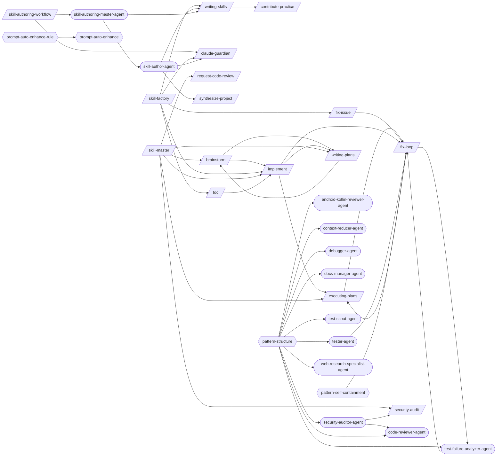

# Skill Authoring

> Creating, validating, and maintaining skills, agents, and rules.

> Auto-generated by `scripts/generate_workflow_docs.py` | Last updated: 2026-03-31 07:13 UTC

## Overview



## Detailed Flow

Step-level flow showing gates (diamonds), delegations (dashed), and artifacts (cylinders).

```mermaid
graph TD
    subgraph brainstorm_sub["Brainstorm"]
        brainstorm_s1["Step 1: Understand Intent"]
        brainstorm_s2{{Step 2: Deep Research}}
        brainstorm_s1 --> brainstorm_s2
        brainstorm_s3["Step 3: Propose Approaches"]
        brainstorm_s2 --> brainstorm_s3
        brainstorm_s4["Step 4: Design in Sections"]
        brainstorm_s3 --> brainstorm_s4
        brainstorm_s5["Step 5: Write Spec Document"]
        brainstorm_s4 --> brainstorm_s5
        brainstorm_s6["Step 6: Handoff"]
        brainstorm_s5 --> brainstorm_s6
        adversarial_review_ext([/adversarial-review/])
        brainstorm_s6 -.-> adversarial_review_ext
        implement_ext([/implement/])
        brainstorm_s6 -.-> implement_ext
        plan_to_issues_ext([/plan-to-issues/])
        brainstorm_s6 -.-> plan_to_issues_ext
        writing_plans_ext([/writing-plans/])
        brainstorm_s6 -.-> writing_plans_ext
    end

    subgraph contribute_practice_sub["Contribute Practice"]
        contribute_practice_s1["Step 1: Validate Pattern"]
        contribute_practice_s2["Step 2: Detect Category"]
        contribute_practice_s1 --> contribute_practice_s2
        contribute_practice_s3["Step 3: Check for Duplicates"]
        contribute_practice_s2 --> contribute_practice_s3
        contribute_practice_s4["Step 4: Sanitize Pattern"]
        contribute_practice_s3 --> contribute_practice_s4
        contribute_practice_s5["Step 5: Create PR"]
        contribute_practice_s4 --> contribute_practice_s5
    end

    subgraph executing_plans_sub["Executing Plans"]
        executing_plans_s1{{Step 1: Load and Validate the Plan}}
        executing_plans_s2["Step 2: Pre-Execution Setup"]
        executing_plans_s1 --> executing_plans_s2
        executing_plans_s3["Step 3: Execute Tasks"]
        executing_plans_s2 --> executing_plans_s3
        executing_plans_s4{{Step 4: Handle Failures}}
        executing_plans_s3 --> executing_plans_s4
        fix_loop_ext([/fix-loop/])
        executing_plans_s4 -.-> fix_loop_ext
        executing_plans_s5["Step 5: Resume Support"]
        executing_plans_s4 --> executing_plans_s5
        continue_ext([/continue/])
        executing_plans_s5 -.-> continue_ext
        executing_plans_s6["Step 6: Completion Summary"]
        executing_plans_s5 --> executing_plans_s6
        executing_plans_s7["Step 7: Edge Cases and Special Handling"]
        executing_plans_s6 --> executing_plans_s7
    end

    subgraph fix_issue_sub["Fix Issue"]
        fix_issue_s1["Step 1: Fetch Issue Details"]
        fix_issue_s2["Step 2: Explore Codebase"]
        fix_issue_s1 --> fix_issue_s2
        fix_issue_s3["Step 3: Plan Implementation"]
        fix_issue_s2 --> fix_issue_s3
        fix_issue_s4["Step 4: Implement Fix"]
        fix_issue_s3 --> fix_issue_s4
        fix_issue_s5{{Step 5: Verify with Tests}}
        fix_issue_s4 --> fix_issue_s5
        fix_issue_s5 -.-> fix_loop_ext
        fix_issue_s6["Step 6: Post-Fix Pipeline"]
        fix_issue_s5 --> fix_issue_s6
        fix_issue_s7["Step 7: Summary"]
        fix_issue_s6 --> fix_issue_s7
    end

    subgraph fix_loop_sub["Fix Loop"]
        fix_loop_s1{{Step 1: Analyze Failure (via test-failure-analyzer-agent)}}
        test_failure_analyzer_agent_ext((test-failure-analyzer-agent))
        fix_loop_s1 -.-> test_failure_analyzer_agent_ext
        fix_loop_s1A["Step 1A: Flaky Test Detection"]
        fix_loop_s1 --> fix_loop_s1A
        fix_loop_s2["Step 2: Apply Fix"]
        fix_loop_s1A --> fix_loop_s2
        fix_loop_s3["Step 3: Retest (Full Loop mode only)"]
        fix_loop_s2 --> fix_loop_s3
        fix_loop_s4["Step 4: Report"]
        fix_loop_s3 --> fix_loop_s4
        fix_loop_s5{{Step 5: Structured Output}}
        fix_loop_s4 --> fix_loop_s5
        fix_loop_test_results_fix_loop_json[("test-results/fix-loop.json")]
        fix_loop_s5 -->|writes| fix_loop_test_results_fix_loop_json
    end

    subgraph implement_sub["Implement"]
        implement_s1["Step 1: Analyze Requirements"]
        implement_s1 -.-> writing_plans_ext
        implement_s2["Step 2: Create/Update Tests"]
        implement_s1 --> implement_s2
        implement_s3["Step 3: Implement the Feature"]
        implement_s2 --> implement_s3
        implement_s4["Step 4: Run Tests"]
        implement_s3 --> implement_s4
        implement_s5{{Step 5: Fix Loop (if tests fail)}}
        implement_s4 --> implement_s5
        implement_s5 -.-> fix_loop_ext
        implement_s6{{Step 6: Verification (Mandatory Gate)}}
        implement_s5 --> implement_s6
        post_fix_pipeline_ext([/post-fix-pipeline/])
        implement_s6 -.-> post_fix_pipeline_ext
        implement_s7["Step 7: Post-Implementation (Optional)"]
        implement_s6 --> implement_s7
        executing_plans_ext([/executing-plans/])
        implement_s7 -.-> executing_plans_ext
        implement_s8{{Step 8: Structured Output}}
        implement_s7 --> implement_s8
        implement_test_results_implement_json[("test-results/implement.json")]
        implement_s8 -->|writes| implement_test_results_implement_json
    end

    subgraph mcp_server_builder_sub["Mcp Server Builder"]
        mcp_server_builder_s1["Step 1: Define the Server Scope"]
        mcp_server_builder_s2["Step 2: Choose SDK and Scaffold"]
        mcp_server_builder_s1 --> mcp_server_builder_s2
        mcp_server_builder_s3["Step 3: Implement Tools"]
        mcp_server_builder_s2 --> mcp_server_builder_s3
        mcp_server_builder_s4["Step 4: Implement Resources (if needed)"]
        mcp_server_builder_s3 --> mcp_server_builder_s4
        mcp_server_builder_s5{{Step 5: Configure for Claude Code}}
        mcp_server_builder_s4 --> mcp_server_builder_s5
        mcp_server_builder_s6["Step 6: Test the Server"]
        mcp_server_builder_s5 --> mcp_server_builder_s6
        mcp_server_builder_s7["Step 7: Document and Ship"]
        mcp_server_builder_s6 --> mcp_server_builder_s7
    end

    subgraph request_code_review_sub["Request Code Review"]
        request_code_review_s1["Step 1: Assess the Change Set"]
        request_code_review_s2["Step 2: Classify Changes by Risk Level"]
        request_code_review_s1 --> request_code_review_s2
        request_code_review_s3["Step 3: Detect Breaking Changes"]
        request_code_review_s2 --> request_code_review_s3
        request_code_review_s4["Step 4: Annotate Diff with Intent"]
        request_code_review_s3 --> request_code_review_s4
        request_code_review_s5["Step 5: Generate Review Questions"]
        request_code_review_s4 --> request_code_review_s5
        request_code_review_s6["Step 6: Pre-Review Self-Check"]
        request_code_review_s5 --> request_code_review_s6
        request_code_review_s7["Step 7: Suggest Reviewers"]
        request_code_review_s6 --> request_code_review_s7
        request_code_review_s8["Step 8: Generate PR Description"]
        request_code_review_s7 --> request_code_review_s8
        request_code_review_s9["Step 9: Create the Pull Request"]
        request_code_review_s8 --> request_code_review_s9
        request_code_review_s10{{Step 10: Dependency and Impact Analysis}}
        request_code_review_s9 --> request_code_review_s10
    end

    subgraph security_audit_sub["Security Audit"]
        security_audit_s1["Step 1: Reconnaissance"]
        security_audit_s2["Step 2: Static Analysis"]
        security_audit_s1 --> security_audit_s2
        security_audit_s3["Step 3: Variant Analysis"]
        security_audit_s2 --> security_audit_s3
        security_audit_s4["Step 4: Differential Security Review"]
        security_audit_s3 --> security_audit_s4
        security_audit_s5["Step 5: Insecure Defaults Detection"]
        security_audit_s4 --> security_audit_s5
        security_audit_s6{{Step 6: GitHub Actions Security}}
        security_audit_s5 --> security_audit_s6
        security_audit_s7{{Step 7: False-Positive Gating}}
        security_audit_s6 --> security_audit_s7
        security_audit_s8["Step 8: OWASP Top 10 Checklist"]
        security_audit_s7 --> security_audit_s8
        security_audit_s9{{Step 9: Compliance Testing (GDPR / SOC2 / HIPAA)}}
        security_audit_s8 --> security_audit_s9
    end

    subgraph semgrep_rules_sub["Semgrep Rules"]
        semgrep_rules_s1["Step 1: Analyze the Target Pattern"]
        semgrep_rules_s2["Step 2: Write Tests First"]
        semgrep_rules_s1 --> semgrep_rules_s2
        semgrep_rules_s3["Step 3: Examine AST Structure"]
        semgrep_rules_s2 --> semgrep_rules_s3
        semgrep_rules_s4["Step 4: Write the Rule"]
        semgrep_rules_s3 --> semgrep_rules_s4
        semgrep_rules_s5["Step 5: Iterate Until All Tests Pass"]
        semgrep_rules_s4 --> semgrep_rules_s5
        semgrep_rules_s6["Step 6: Optimize for Precision"]
        semgrep_rules_s5 --> semgrep_rules_s6
        semgrep_rules_s7["Step 7: Common Security Rule Patterns"]
        semgrep_rules_s6 --> semgrep_rules_s7
        semgrep_rules_s8["Step 8: Cross-Language Porting"]
        semgrep_rules_s7 --> semgrep_rules_s8
        semgrep_rules_s9{{Step 9: CI/CD Integration}}
        semgrep_rules_s8 --> semgrep_rules_s9
    end

    subgraph skill_master_sub["Skill Master"]
        skill_master_s1{{Step 1: Discover All Available Skills}}
        skill_master_s2["Step 2: Parse User Intent"]
        skill_master_s1 --> skill_master_s2
        brainstorm_ext([/brainstorm/])
        skill_master_s2 -.-> brainstorm_ext
        skill_master_s2 -.-> executing_plans_ext
        skill_master_s2 -.-> implement_ext
        request_code_review_ext([/request-code-review/])
        skill_master_s2 -.-> request_code_review_ext
        skill_master_s2 -.-> writing_plans_ext
        skill_master_s3["Step 3: Display Skill Catalog"]
        skill_master_s2 --> skill_master_s3
        skill_master_s4["Step 4: Match Intent to Skill"]
        skill_master_s3 --> skill_master_s4
        skill_master_s5["Step 5: Suggest Adaptive Workflow"]
        skill_master_s4 --> skill_master_s5
        skill_master_s6["Step 6: Chain Skills in Sequence"]
        skill_master_s5 --> skill_master_s6
        skill_master_s7["Step 7: Manage Session State"]
        skill_master_s6 --> skill_master_s7
        skill_master_s7 -.-> brainstorm_ext
        skill_master_s7 -.-> implement_ext
        skill_master_s7 -.-> request_code_review_ext
        security_audit_ext([/security-audit/])
        skill_master_s7 -.-> security_audit_ext
        skill_master_s7 -.-> writing_plans_ext
        skill_master_s8["Step 8: Handle Skill Conflicts and Overlap"]
        skill_master_s7 --> skill_master_s8
        skill_master_s9["Step 9: Search Skills by Keyword"]
        skill_master_s8 --> skill_master_s9
        skill_master_s10["Step 10: Self-Update and Re-Scan"]
        skill_master_s9 --> skill_master_s10
    end

    subgraph synthesize_project_sub["Synthesize Project"]
        synthesize_project_s0["Step 0: Determine Source (Local vs Remote)"]
        synthesize_hub_ext([/synthesize-hub/])
        synthesize_project_s0 -.-> synthesize_hub_ext
        synthesize_project_s1["Step 1: Provision Hub Patterns"]
        synthesize_project_s0 --> synthesize_project_s1
        synthesize_project_s2["Step 2: Map the Project"]
        synthesize_project_s1 --> synthesize_project_s2
        synthesize_project_s3["Step 3: Identify Conventions (with Dedup Against Hub)"]
        synthesize_project_s2 --> synthesize_project_s3
        synthesize_project_s4{{Step 4: Read Evidence and Confirm}}
        synthesize_project_s3 --> synthesize_project_s4
        synthesize_project_s5["Step 5: Load Reference Material"]
        synthesize_project_s4 --> synthesize_project_s5
        synthesize_project_s6["Step 6: Generate Patterns"]
        synthesize_project_s5 --> synthesize_project_s6
        synthesize_project_s7{{Step 7: Validate and Write}}
        synthesize_project_s6 --> synthesize_project_s7
        synthesize_project_s8["Step 8: Generate synthesis-config.yml"]
        synthesize_project_s7 --> synthesize_project_s8
        synthesize_project_s9{{Step 9: Summary}}
        synthesize_project_s8 --> synthesize_project_s9
    end

    subgraph tdd_sub["Tdd"]
        tdd_s1["Step 1: RED — Write a Failing Test"]
        tdd_s2["Step 2: GREEN — Minimal Implementation"]
        tdd_s1 --> tdd_s2
        tdd_s3{{Step 3: REFACTOR — Clean Up}}
        tdd_s2 --> tdd_s3
        tdd_s3 -.-> implement_ext
    end

    subgraph writing_plans_sub["Writing Plans"]
        writing_plans_s1["Step 1: Understand Scope"]
        writing_plans_s1 -.-> brainstorm_ext
        writing_plans_s2{{Step 2: Decompose into Tasks}}
        writing_plans_s1 --> writing_plans_s2
        writing_plans_s3["Step 3: Add Dependency Graph"]
        writing_plans_s2 --> writing_plans_s3
        writing_plans_s4["Step 4: Review Plan Quality"]
        writing_plans_s3 --> writing_plans_s4
        writing_plans_s5["Step 5: Present for Approval"]
        writing_plans_s4 --> writing_plans_s5
        writing_plans_s6{{Step 6: Save Plan and Companion Files}}
        writing_plans_s5 --> writing_plans_s6
        writing_plans_s7["Step 7: Suggest Next Steps"]
        writing_plans_s6 --> writing_plans_s7
        writing_plans_s7 -.-> plan_to_issues_ext
    end

    subgraph writing_skills_sub["Writing Skills"]
        writing_skills_s1["Step 1: Determine Authoring Mode"]
        writing_skills_s2{{Step 2: Skill Authoring — From Scratch}}
        writing_skills_s1 --> writing_skills_s2
        writing_skills_s3{{Step 3: Session Log Analysis}}
        writing_skills_s2 --> writing_skills_s3
        writing_skills_s4["Step 4: Naming and Organization"]
        writing_skills_s3 --> writing_skills_s4
        writing_skills_s5{{Step 5: Quality Checklist}}
        writing_skills_s4 --> writing_skills_s5
        writing_skills_s6{{Step 6: Skill Testing and Stress Testing}}
        writing_skills_s5 --> writing_skills_s6
        writing_skills_s7["Step 7: Hub Promotion Workflow"]
        writing_skills_s6 --> writing_skills_s7
        contribute_practice_ext([/contribute-practice/])
        writing_skills_s7 -.-> contribute_practice_ext
        writing_skills_s8{{Step 8: Template Library}}
        writing_skills_s7 --> writing_skills_s8
    end

    brainstorm_s6 ==> implement_s1
    brainstorm_s6 ==> writing_plans_s1
    executing_plans_s4 ==> fix_loop_s1
    fix_issue_s5 ==> fix_loop_s1
    implement_s7 ==> executing_plans_s1
    implement_s5 ==> fix_loop_s1
    implement_s1 ==> writing_plans_s1
    skill_master_s2 ==> brainstorm_s1
    skill_master_s2 ==> executing_plans_s1
    skill_master_s2 ==> implement_s1
    skill_master_s2 ==> request_code_review_s1
    skill_master_s7 ==> security_audit_s1
    skill_master_s2 ==> writing_plans_s1
    tdd_s3 ==> implement_s1
    writing_plans_s1 ==> brainstorm_s1
    writing_skills_s7 ==> contribute_practice_s1
```

## Skills

| Skill | Version | Description | Calls | Called By |
|-------|---------|-------------|-------|----------|
| `/brainstorm` | 1.0.0 | Explore intent through Socratic questioning, propose approaches with trade-of... | `/implement`, `/writing-plans` | `/skill-master`, `/writing-plans` |
| `/claude-guardian` | 1.0.1 | Validate and place rules into the correct CLAUDE.md or config file. Two modes... | — | `/skill-authoring-workflow`, `/skill-factory`, `/skill-author-agent` |
| `/contribute-practice` | 2.0.0 | Push a pattern from your project to the best practices hub by validating stru... | — | `/writing-skills` |
| `/executing-plans` | 1.0.0 | Execute a pre-written implementation plan step by step. Parses tasks from a p... | `/fix-loop` | `/fix-loop`, `/implement`, `/skill-master` |
| `/fix-issue` | 1.0.0 | Analyze and implement a fix for a specific GitHub Issue. Fetches issue detail... | `/fix-loop` | `/skill-factory` |
| `/fix-loop` | 1.2.0 | Analyze failures and iteratively apply minimal fixes, optionally retesting un... | `/executing-plans`, `/test-failure-analyzer-agent` | `/executing-plans`, `/fix-issue`, `/implement`, `/test-failure-analyzer-agent`, `/tester-agent` |
| `/implement` | 1.0.0 | Implement a feature or fix following a structured workflow: requirements anal... | `/executing-plans`, `/fix-loop`, `/writing-plans` | `/brainstorm`, `/skill-factory`, `/skill-master`, `/tdd` |
| `/mcp-server-builder` | 1.0.0 | Build MCP (Model Context Protocol) servers that extend Claude Code's capabili... | — | — |
| `/request-code-review` | 1.0.0 | Create high-quality, review-optimized pull requests that surface risks, gener... | — | `/skill-master` |
| `/security-audit` | 1.0.0 | Run security audits covering static analysis with CodeQL and Semgrep, SARIF t... | — | `/skill-master`, `/security-auditor-agent` |
| `/semgrep-rules` | 1.0.0 | Build, test, and optimize custom Semgrep rules for vulnerability detection an... | — | — |
| `/skill-authoring-workflow` | 1.0.0 | Author, validate, and register new skills, agents, and rules end-to-end. Use ... | `/claude-guardian`, `/skill-authoring-master-agent` | — |
| `/skill-factory` | 3.0.0 | Detect repeated workflows in session logs and classify them into the right au... | `/claude-guardian`, `/fix-issue`, `/implement`, `/tdd`, `/writing-skills` | — |
| `/skill-master` | 1.0.0 | Route user requests to the right skill by dynamically discovering all availab... | `/brainstorm`, `/executing-plans`, `/implement`, `/request-code-review`, `/security-audit`, `/writing-plans` | — |
| `/synthesize-project` | 4.0.0 | Provision hub patterns AND generate project-specific .claude/ patterns for a ... | — | `/skill-author-agent` |
| `/tdd` | 1.0.1 | Execute strict Test-Driven Development using the red-green-refactor cycle. Wr... | `/implement` | `/skill-factory` |
| `/writing-plans` | 1.0.0 | Generate detailed implementation plans with bite-sized tasks, exact file path... | `/brainstorm` | `/brainstorm`, `/implement`, `/skill-master` |
| `/writing-skills` | 2.6.0 | Author new Claude Code skills from scratch or from observed patterns. Covers ... | `/contribute-practice` | `/skill-factory`, `/skill-author-agent`, `/skill-authoring-master-agent` |

## Agents

| Agent | Description | Dispatched By |
|-------|-------------|---------------|
| `android-kotlin-reviewer-agent` | Use proactively to review Kotlin code for idiomatic patterns, coroutine safet... | — |
| `code-reviewer-agent` | A senior software engineer specializing in comprehensive code quality assessm... | `/security-auditor-agent` |
| `context-reducer-agent` | Use proactively to summarize completed work mid-session and produce a compres... | — |
| `debugger-agent` | Use proactively to diagnose failures, analyze logs, investigate performance i... | — |
| `docs-manager-agent` | Use this agent for documentation updates — continuation prompts, requirement ... | — |
| `fastapi-database-admin-agent` | Use this agent for database tasks — PostgreSQL queries, Alembic migrations, s... | — |
| `security-auditor-agent` | Use proactively for security assessments — OWASP Top 10 scanning, threat mode... | — |
| `skill-author-agent` | Create, update, or manage Claude Code skills, rules, and agents using the ded... | `/skill-authoring-master-agent` |
| `skill-authoring-master-agent` | Orchestrate the creation, validation, and registration of new skills, agents,... | `/skill-authoring-workflow` |
| `test-failure-analyzer-agent` | Use proactively to diagnose test failures — reads test output, classifies by ... | `/fix-loop` |
| `test-scout-agent` | Use proactively to execute E2E tests in batches, capture screenshots only on ... | — |
| `tester-agent` | Senior QA engineer specializing in comprehensive testing and quality assuranc... | — |
| `web-research-specialist-agent` | Use this agent for web research — finding documentation, API references, libr... | — |
| `workflow-master-template` | Shared orchestration protocol reference for all workflow-master agents. Not a... | — |

## Rules

| Rule | Description |
|------|-------------|
| `pattern-portability` | Portability standards for patterns distributed via core/.claude/. Ensures pat... |
| `pattern-self-containment` | Self-containment and completeness standards for patterns in core/.claude/. Pr... |
| `pattern-structure` | Structural requirements for skills, agents, and rules in core/.claude/. Enfor... |
| `prompt-auto-enhance` | Auto-enhance every user prompt with project-specific context before acting. P... |
| `prompt-auto-enhance-rule` | Auto-enhance every user prompt with project-specific context before acting. P... |
| `rule-curation` | Guidelines for curating all patterns (skills, agents, rules) added to the dis... |
| `rule-writing-meta` | Meta-guidance for writing effective CLAUDE.md rules, choosing config file pla... |

## Cross-Workflow Connections

**Outgoing** (this workflow feeds into):
- `adr` (skill)
- `adversarial-review` (skill)
- `api-docs-generator` (skill)
- `changelog-contributing` (skill)
- `continue` (skill)
- `contract-test` (skill)
- `db-migrate-verify` (skill)
- `diataxis-docs` (skill)
- `doc-staleness` (skill)
- `doc-structure-enforcer` (skill)
- `learn-n-improve` (skill)
- `plan-to-issues` (skill)
- `planner-researcher-agent` (agent)
- `post-fix-pipeline` (skill)
- `synthesize-hub` (skill)
- `verify-screenshots` (skill)

**Incoming** (fed by):
- `adr` (skill)
- `adversarial-review` (skill)
- `agent-orchestration` (rule)
- `android-run-e2e` (skill)
- `android-run-tests` (skill)
- `anthropic-agent-orchestration-guide` (skill)
- `api-docs-generator` (skill)
- `apply-selections` (skill)
- `auto-verify` (skill)
- `bun-elysia-test` (skill)
- `changelog-contributing` (skill)
- `claude-behavior` (rule)
- `code-review-master-agent` (agent)
- `code-review-workflow` (skill)
- `debugging-loop` (skill)
- `debugging-loop-master-agent` (agent)
- `development-loop` (skill)
- `diataxis-docs` (skill)
- `doc-staleness` (skill)
- `doc-structure-enforcer` (skill)
- `documentation-master-agent` (agent)
- `e2e-conductor-agent` (agent)
- `e2e-visual-run` (skill)
- `fastapi-run-backend-tests` (skill)
- `firebase-test` (skill)
- `flutter-e2e-test` (skill)
- `learn-n-improve` (skill)
- `learning-self-improvement` (skill)
- `learning-self-improvement-master-agent` (agent)
- `post-fix-pipeline` (skill)
- `pr-standards` (skill)
- `prd-parser` (skill)
- `project-manager-agent` (agent)
- `project-scaffold` (skill)
- `provision-report` (skill)
- `review-gate` (skill)
- `self-improve` (skill)
- `ssot-audit` (skill)
- `subagent-driven-dev` (skill)
- `synthesize-hub` (skill)
- `tdd-failing-test-generator` (skill)
- `test-healer-agent` (agent)
- `testing` (rule)
- `testing-pipeline-master-agent` (agent)
- `testing-pipeline-workflow` (skill)
- `verify-screenshots` (skill)

<!-- MANUAL ANNOTATIONS -->
<!-- Add custom notes below this line. They are preserved on regeneration. -->
