# Skill Authoring

> Creating, validating, and maintaining skills, agents, and rules.

> Auto-generated by `scripts/generate_workflow_docs.py` | Last updated: 2026-09-04 14:04 UTC

## Overview

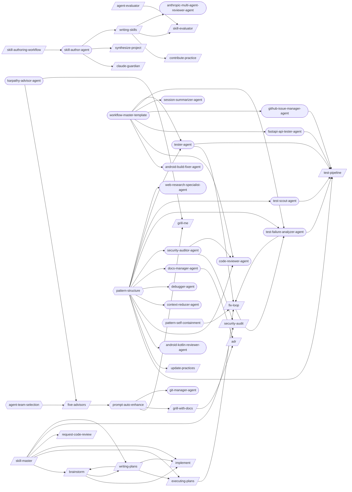
```mermaid
graph LR
    adr[/adr/]
    agent_evaluator[/agent-evaluator/]
    brainstorm[/brainstorm/]
    claude_guardian[/claude-guardian/]
    contribute_practice[/contribute-practice/]
    executing_plans[/executing-plans/]
    five_advisors[/five-advisors/]
    fix_loop[/fix-loop/]
    grill_me[/grill-me/]
    grill_with_docs[/grill-with-docs/]
    implement[/implement/]
    request_code_review[/request-code-review/]
    security_audit[/security-audit/]
    skill_authoring_workflow[/skill-authoring-workflow/]
    skill_evaluator[/skill-evaluator/]
    skill_master[/skill-master/]
    synthesize_project[/synthesize-project/]
    test_pipeline[/test-pipeline/]
    update_practices[/update-practices/]
    writing_plans[/writing-plans/]
    writing_skills[/writing-skills/]
    android_build_fixer_agent([android-build-fixer-agent])
    android_kotlin_reviewer_agent([android-kotlin-reviewer-agent])
    anthropic_multi_agent_reviewer_agent([anthropic-multi-agent-reviewer-agent])
    code_reviewer_agent([code-reviewer-agent])
    context_reducer_agent([context-reducer-agent])
    debugger_agent([debugger-agent])
    docs_manager_agent([docs-manager-agent])
    fastapi_api_tester_agent([fastapi-api-tester-agent])
    git_manager_agent([git-manager-agent])
    github_issue_manager_agent([github-issue-manager-agent])
    karpathy_advisor_agent([karpathy-advisor-agent])
    security_auditor_agent([security-auditor-agent])
    session_summarizer_agent([session-summarizer-agent])
    skill_author_agent([skill-author-agent])
    test_failure_analyzer_agent([test-failure-analyzer-agent])
    test_scout_agent([test-scout-agent])
    tester_agent([tester-agent])
    web_research_specialist_agent([web-research-specialist-agent])
    workflow_master_template([workflow-master-template])
    agent_team_selection{{agent-team-selection}}
    pattern_self_containment{{pattern-self-containment}}
    pattern_structure{{pattern-structure}}
    prompt_auto_enhance{{prompt-auto-enhance}}
    agent_evaluator --> skill_evaluator
    brainstorm --> implement
    brainstorm --> writing_plans
    executing_plans --> fix_loop
    five_advisors --> prompt_auto_enhance
    fix_loop --> test_failure_analyzer_agent
    grill_with_docs --> adr
    prompt_auto_enhance --> grill_me
    prompt_auto_enhance --> grill_with_docs
    prompt_auto_enhance --> git_manager_agent
    skill_authoring_workflow --> skill_author_agent
    skill_master --> brainstorm
    skill_master --> executing_plans
    skill_master --> implement
    skill_master --> request_code_review
    skill_master --> security_audit
    skill_master --> writing_plans
    writing_plans --> brainstorm
    writing_plans --> executing_plans
    writing_plans --> implement
    writing_skills --> contribute_practice
    writing_skills --> skill_evaluator
    writing_skills --> anthropic_multi_agent_reviewer_agent
    docs_manager_agent --> adr
    fastapi_api_tester_agent --> test_pipeline
    github_issue_manager_agent --> test_pipeline
    karpathy_advisor_agent --> five_advisors
    karpathy_advisor_agent --> grill_me
    security_auditor_agent --> security_audit
    security_auditor_agent --> code_reviewer_agent
    skill_author_agent --> claude_guardian
    skill_author_agent --> synthesize_project
    skill_author_agent --> writing_skills
    test_failure_analyzer_agent --> fix_loop
    test_failure_analyzer_agent --> test_pipeline
    test_scout_agent --> test_pipeline
    tester_agent --> fix_loop
    tester_agent --> test_pipeline
    workflow_master_template --> android_build_fixer_agent
    workflow_master_template --> code_reviewer_agent
    workflow_master_template --> fastapi_api_tester_agent
    workflow_master_template --> github_issue_manager_agent
    workflow_master_template --> session_summarizer_agent
    workflow_master_template --> test_failure_analyzer_agent
    workflow_master_template --> tester_agent
    agent_team_selection --> five_advisors
    pattern_self_containment --> fix_loop
    pattern_structure --> test_pipeline
    pattern_structure --> update_practices
    pattern_structure --> android_kotlin_reviewer_agent
    pattern_structure --> code_reviewer_agent
    pattern_structure --> context_reducer_agent
    pattern_structure --> debugger_agent
    pattern_structure --> docs_manager_agent
    pattern_structure --> security_auditor_agent
    pattern_structure --> test_failure_analyzer_agent
    pattern_structure --> test_scout_agent
    pattern_structure --> tester_agent
    pattern_structure --> web_research_specialist_agent
```

## Detailed Flow

Step-level flow showing gates (diamonds), delegations (dashed), and artifacts (cylinders).

```mermaid
graph TD
    subgraph agent_evaluator_sub["Agent Evaluator"]
        agent_evaluator_s0{{Step 0: Pre-Flight Checks}}
        agent_evaluator_s0_block[/BLOCK/]
        agent_evaluator_s0 -->|FAILED| agent_evaluator_s0_block
        agent_evaluator_s1["Step 1: Load Scenarios"]
        agent_evaluator_s0 -->|OK| agent_evaluator_s1
        agent_evaluator_s2["Step 2: Run Each Scenario"]
        agent_evaluator_s1 --> agent_evaluator_s2
        agent_evaluator_s3{{Step 3: LLM-as-Judge Scoring}}
        agent_evaluator_s2 --> agent_evaluator_s3
        agent_evaluator_s4{{Step 4: Aggregate Across Scenarios}}
        agent_evaluator_s3 --> agent_evaluator_s4
        agent_evaluator_s5{{Step 5: Generate Report}}
        agent_evaluator_s4 --> agent_evaluator_s5
        agent_evaluator_s6{{Step 6: Pre-Merge Gate}}
        agent_evaluator_s5 --> agent_evaluator_s6
        agent_evaluator_s7{{Step 7: Record Eval Run}}
        agent_evaluator_s6 --> agent_evaluator_s7
        skill_evaluator_ext([/skill-evaluator/])
        agent_evaluator_s7 -.-> skill_evaluator_ext
    end

    subgraph brainstorm_sub["Brainstorm"]
        brainstorm_s1["Step 1: Understand Intent"]
        brainstorm_s2{{Step 2: Deep Research}}
        brainstorm_s1 --> brainstorm_s2
        brainstorm_s3["Step 3: Propose Approaches"]
        brainstorm_s2 --> brainstorm_s3
        brainstorm_s4["Step 4: Design in Sections"]
        brainstorm_s3 --> brainstorm_s4
        brainstorm_s5["Step 5: Write Spec Document"]
        brainstorm_s4 --> brainstorm_s5
        brainstorm_s6["Step 6: Handoff"]
        brainstorm_s5 --> brainstorm_s6
        adversarial_review_ext([/adversarial-review/])
        brainstorm_s6 -.-> adversarial_review_ext
        implement_ext([/implement/])
        brainstorm_s6 -.-> implement_ext
        plan_to_issues_ext([/plan-to-issues/])
        brainstorm_s6 -.-> plan_to_issues_ext
        writing_plans_ext([/writing-plans/])
        brainstorm_s6 -.-> writing_plans_ext
    end

    subgraph contribute_practice_sub["Contribute Practice"]
        contribute_practice_s0{{Step 0: Preflight}}
        contribute_practice_s1["Step 1: Validate Pattern"]
        contribute_practice_s0 --> contribute_practice_s1
        contribute_practice_s2["Step 2: Detect Category"]
        contribute_practice_s1 --> contribute_practice_s2
        contribute_practice_s3["Step 3: Check for Duplicates"]
        contribute_practice_s2 --> contribute_practice_s3
        contribute_practice_s4["Step 4: Sanitize Pattern"]
        contribute_practice_s3 --> contribute_practice_s4
        contribute_practice_s5["Step 5: Create PR"]
        contribute_practice_s4 --> contribute_practice_s5
    end

    subgraph executing_plans_sub["Executing Plans"]
        executing_plans_s0["Step 0: Preflight"]
        executing_plans_s1{{Step 1: Load and Validate the Plan}}
        executing_plans_s0 --> executing_plans_s1
        executing_plans_s2["Step 2: Pre-Execution Setup"]
        executing_plans_s1 --> executing_plans_s2
        executing_plans_s3{{Step 3: Execute Tasks}}
        executing_plans_s2 --> executing_plans_s3
        executing_plans_s4{{Step 4: Handle Failures}}
        executing_plans_s3 --> executing_plans_s4
        fix_loop_ext([/fix-loop/])
        executing_plans_s4 -.-> fix_loop_ext
        executing_plans_s5["Step 5: Resume Support"]
        executing_plans_s4 --> executing_plans_s5
        continue_ext([/continue/])
        executing_plans_s5 -.-> continue_ext
        executing_plans_s6["Step 6: Completion Summary"]
        executing_plans_s5 --> executing_plans_s6
        executing_plans_s7["Step 7: Edge Cases and Special Handling"]
        executing_plans_s6 --> executing_plans_s7
    end

    subgraph grill_me_sub["Grill Me"]
        grill_me_s1["Step 1: Map the decision tree"]
        grill_me_s2["Step 2: Pick the first unresolved branch"]
        grill_me_s1 --> grill_me_s2
        grill_me_s3["Step 3: Read the codebase before asking"]
        grill_me_s2 --> grill_me_s3
        grill_me_s4["Step 4: Ask the next question(s) with your recommended answer"]
        grill_me_s3 --> grill_me_s4
        grill_me_s5{{Step 5: Wait for the response}}
        grill_me_s4 --> grill_me_s5
        grill_me_s6["Step 6: Update the tree and repeat"]
        grill_me_s5 --> grill_me_s6
        grill_me_s7{{Step 7: Stop when the tree is resolved}}
        grill_me_s6 --> grill_me_s7
    end

    subgraph mcp_server_builder_sub["Mcp Server Builder"]
        mcp_server_builder_s0["Step 0: Preflight"]
        mcp_server_builder_s1["Step 1: Define the Server Scope"]
        mcp_server_builder_s0 --> mcp_server_builder_s1
        mcp_server_builder_s2["Step 2: Choose SDK and Scaffold"]
        mcp_server_builder_s1 --> mcp_server_builder_s2
        mcp_server_builder_s3["Step 3: Implement Tools"]
        mcp_server_builder_s2 --> mcp_server_builder_s3
        mcp_server_builder_s4["Step 4: Implement Resources (if needed)"]
        mcp_server_builder_s3 --> mcp_server_builder_s4
        mcp_server_builder_s5{{Step 5: Configure for Claude Code}}
        mcp_server_builder_s4 --> mcp_server_builder_s5
        mcp_server_builder_s6["Step 6: Test the Server"]
        mcp_server_builder_s5 --> mcp_server_builder_s6
        mcp_server_builder_s7["Step 7: Document and Ship"]
        mcp_server_builder_s6 --> mcp_server_builder_s7
    end

    subgraph provenance_report_sub["Provenance Report"]
        provenance_report_s0["Step 0: Preflight"]
        provenance_report_s1["Step 1: Harvest the real, on-disk data"]
        provenance_report_s0 --> provenance_report_s1
        provenance_report_test_results__json[("test-results/*.json")]
        provenance_report_s1 -->|writes| provenance_report_test_results__json
        provenance_report_s2{{Step 2: Assemble the sections}}
        provenance_report_s1 --> provenance_report_s2
        provenance_report_s3["Step 3: Render self-contained HTML"]
        provenance_report_s2 --> provenance_report_s3
        provenance_report_s4["Step 4: Verify + report"]
        provenance_report_s3 --> provenance_report_s4
    end

    subgraph security_audit_sub["Security Audit"]
        security_audit_s0["Step 0: Preflight"]
        security_audit_s1["Step 1: Reconnaissance"]
        security_audit_s0 --> security_audit_s1
        security_audit_s2["Step 2: Static Analysis"]
        security_audit_s1 --> security_audit_s2
        security_audit_s3["Step 3: Variant Analysis"]
        security_audit_s2 --> security_audit_s3
        security_audit_s4["Step 4: Differential Security Review"]
        security_audit_s3 --> security_audit_s4
        security_audit_s5["Step 5: Insecure Defaults Detection"]
        security_audit_s4 --> security_audit_s5
        security_audit_s6{{Step 6: GitHub Actions Security}}
        security_audit_s5 --> security_audit_s6
        security_audit_s7{{Step 7: False-Positive Gating}}
        security_audit_s6 --> security_audit_s7
        security_audit_s8["Step 8: OWASP Top 10 Checklist"]
        security_audit_s7 --> security_audit_s8
        security_audit_s9{{Step 9: Compliance Testing (GDPR / SOC2 / HIPAA)}}
        security_audit_s8 --> security_audit_s9
    end

    subgraph semgrep_rules_sub["Semgrep Rules"]
        semgrep_rules_s0["Step 0: Preflight"]
        semgrep_rules_s1["Step 1: Analyze the Target Pattern"]
        semgrep_rules_s0 --> semgrep_rules_s1
        semgrep_rules_s2["Step 2: Write Tests First"]
        semgrep_rules_s1 --> semgrep_rules_s2
        semgrep_rules_s3["Step 3: Examine AST Structure"]
        semgrep_rules_s2 --> semgrep_rules_s3
        semgrep_rules_s4["Step 4: Write the Rule"]
        semgrep_rules_s3 --> semgrep_rules_s4
        semgrep_rules_s5["Step 5: Iterate Until All Tests Pass"]
        semgrep_rules_s4 --> semgrep_rules_s5
        semgrep_rules_s6["Step 6: Optimize for Precision"]
        semgrep_rules_s5 --> semgrep_rules_s6
        semgrep_rules_s7["Step 7: Common Security Rule Patterns"]
        semgrep_rules_s6 --> semgrep_rules_s7
        semgrep_rules_s8["Step 8: Cross-Language Porting"]
        semgrep_rules_s7 --> semgrep_rules_s8
        semgrep_rules_s9{{Step 9: CI/CD Integration}}
        semgrep_rules_s8 --> semgrep_rules_s9
    end

    subgraph skill_evaluator_sub["Skill Evaluator"]
        skill_evaluator_s0{{Step 0: Pre-Flight Checks}}
        skill_evaluator_s1{{Step 1: Parse Mode and Load Skill}}
        skill_evaluator_s0 --> skill_evaluator_s1
        skill_evaluator_s2{{Step 2: Trigger Evaluation (modes: trigger, full)}}
        skill_evaluator_s1 --> skill_evaluator_s2
        skill_evaluator_s3{{Step 3: Output Evaluation (modes: output, full)}}
        skill_evaluator_s2 --> skill_evaluator_s3
        skill_evaluator_s4["Step 4: Conflicts Mode (mode: conflicts)"]
        skill_evaluator_s3 --> skill_evaluator_s4
        skill_evaluator_s5{{Step 5: Human Review (standalone only)}}
        skill_evaluator_s4 --> skill_evaluator_s5
        skill_evaluator_s6{{Step 6: Produce Evaluation Report}}
        skill_evaluator_s5 --> skill_evaluator_s6
        skill_evaluator_s7["Step 7: Return Verdict"]
        skill_evaluator_s6 --> skill_evaluator_s7
        skill_evaluator_s8{{Step 8: Capture Eval Lesson (self-learning loop, exit gate — MANDATORY)}}
        skill_evaluator_s7 --> skill_evaluator_s8
    end

    subgraph skill_master_sub["Skill Master"]
        skill_master_s1{{Step 1: Discover All Available Skills}}
        skill_master_s2["Step 2: Parse User Intent"]
        skill_master_s1 --> skill_master_s2
        brainstorm_ext([/brainstorm/])
        skill_master_s2 -.-> brainstorm_ext
        executing_plans_ext([/executing-plans/])
        skill_master_s2 -.-> executing_plans_ext
        skill_master_s2 -.-> implement_ext
        request_code_review_ext([/request-code-review/])
        skill_master_s2 -.-> request_code_review_ext
        skill_master_s2 -.-> writing_plans_ext
        skill_master_s3["Step 3: Display Skill Catalog"]
        skill_master_s2 --> skill_master_s3
        skill_master_s4["Step 4: Match Intent to Skill"]
        skill_master_s3 --> skill_master_s4
        skill_master_s5["Step 5: Suggest Adaptive Workflow"]
        skill_master_s4 --> skill_master_s5
        skill_master_s6["Step 6: Chain Skills in Sequence"]
        skill_master_s5 --> skill_master_s6
        skill_master_s7["Step 7: Manage Session State"]
        skill_master_s6 --> skill_master_s7
        skill_master_s7 -.-> brainstorm_ext
        skill_master_s7 -.-> implement_ext
        skill_master_s7 -.-> request_code_review_ext
        security_audit_ext([/security-audit/])
        skill_master_s7 -.-> security_audit_ext
        skill_master_s7 -.-> writing_plans_ext
        skill_master_s8["Step 8: Handle Skill Conflicts and Overlap"]
        skill_master_s7 --> skill_master_s8
        skill_master_s9["Step 9: Search Skills by Keyword"]
        skill_master_s8 --> skill_master_s9
        skill_master_s10["Step 10: Self-Update and Re-Scan"]
        skill_master_s9 --> skill_master_s10
    end

    subgraph synthesize_project_sub["Synthesize Project"]
        synthesize_project_s0["Step 0: Determine Source (Local vs Remote)"]
        synthesize_project_s1["Step 1: Provision Hub Patterns"]
        synthesize_project_s0 --> synthesize_project_s1
        synthesize_project_s2["Step 2: Map the Project"]
        synthesize_project_s1 --> synthesize_project_s2
        synthesize_project_s3["Step 3: Identify Conventions (with Dedup Against Hub)"]
        synthesize_project_s2 --> synthesize_project_s3
        synthesize_project_s4{{Step 4: Read Evidence and Confirm}}
        synthesize_project_s3 --> synthesize_project_s4
        synthesize_project_s5["Step 5: Load Reference Material"]
        synthesize_project_s4 --> synthesize_project_s5
        synthesize_project_s6["Step 6: Generate Patterns"]
        synthesize_project_s5 --> synthesize_project_s6
        synthesize_project_s7{{Step 7: Validate and Write}}
        synthesize_project_s6 --> synthesize_project_s7
        synthesize_project_s8["Step 8: Generate synthesis-config.yml"]
        synthesize_project_s7 --> synthesize_project_s8
        synthesize_project_s9{{Step 9: Summary}}
        synthesize_project_s8 --> synthesize_project_s9
    end

    subgraph writing_plans_sub["Writing Plans"]
        writing_plans_s1["Step 1: Understand Scope"]
        writing_plans_s1 -.-> brainstorm_ext
        writing_plans_s2{{Step 2: Decompose into Tasks}}
        writing_plans_s1 --> writing_plans_s2
        writing_plans_s3["Step 3: Add Dependency Graph"]
        writing_plans_s2 --> writing_plans_s3
        writing_plans_s4["Step 4: Review Plan Quality"]
        writing_plans_s3 --> writing_plans_s4
        writing_plans_s5["Step 5: Present for Approval"]
        writing_plans_s4 --> writing_plans_s5
        writing_plans_s6{{Step 6: Save Plan and Companion Files}}
        writing_plans_s5 --> writing_plans_s6
        writing_plans_s7["Step 7: Suggest Next Steps"]
        writing_plans_s6 --> writing_plans_s7
        writing_plans_s7 -.-> executing_plans_ext
        writing_plans_s7 -.-> plan_to_issues_ext
    end

    subgraph writing_skills_sub["Writing Skills"]
        writing_skills_s1{{Step 1: Determine Authoring Mode}}
        writing_skills_s2{{Step 2: Skill Authoring — From Scratch}}
        writing_skills_s1 --> writing_skills_s2
        writing_skills_s3{{Step 3: Session Log Analysis}}
        writing_skills_s2 --> writing_skills_s3
        writing_skills_s4["Step 4: Naming and Organization"]
        writing_skills_s3 --> writing_skills_s4
        writing_skills_s5{{Step 5: Quality Checklist}}
        writing_skills_s4 --> writing_skills_s5
        writing_skills_s6{{Step 6: Evaluate and Iterate with /skill-evaluator}}
        writing_skills_s5 --> writing_skills_s6
        writing_skills_s6 -.-> skill_evaluator_ext
        anthropic_multi_agent_reviewer_agent_ext((anthropic-multi-agent-reviewer-agent))
        writing_skills_s6 -.-> anthropic_multi_agent_reviewer_agent_ext
        writing_skills_s7["Step 7: Hub Promotion Workflow"]
        writing_skills_s6 --> writing_skills_s7
        contribute_practice_ext([/contribute-practice/])
        writing_skills_s7 -.-> contribute_practice_ext
        writing_skills_s8{{Step 8: Post-Promotion Lifecycle}}
        writing_skills_s7 --> writing_skills_s8
        writing_skills_s9["Step 9: Template Library"]
        writing_skills_s8 --> writing_skills_s9
        writing_skills_s10{{Step 10: Capture Authoring Lesson (self-learning loop, exit gate — MANDATORY)}}
        writing_skills_s9 --> writing_skills_s10
        writing_skills_s10 -.-> skill_evaluator_ext
    end

    agent_evaluator_s7 ==> skill_evaluator_s0
    brainstorm_s6 ==> writing_plans_s1
    skill_master_s2 ==> brainstorm_s1
    skill_master_s2 ==> executing_plans_s0
    skill_master_s7 ==> security_audit_s0
    skill_master_s2 ==> writing_plans_s1
    writing_plans_s1 ==> brainstorm_s1
    writing_plans_s7 ==> executing_plans_s0
    writing_skills_s7 ==> contribute_practice_s0
    writing_skills_s6 ==> skill_evaluator_s0
```

## Skills

| Skill | Version | Description | Calls | Called By |
|-------|---------|-------------|-------|----------|
| `/adr` | 2.0.0 | POINTER to the installable cbp-workflows plugin — this capability graduated f... | — | `/grill-with-docs`, `/docs-manager-agent` |
| `/agent-evaluator` | 1.1.0 | Evaluate Claude Code AGENTS (not skills) against scenario files using LLM-as-... | `/skill-evaluator` | — |
| `/brainstorm` | 1.0.0 | Explore intent through Socratic questioning, propose approaches with trade-of... | `/implement`, `/writing-plans` | `/skill-master`, `/writing-plans` |
| `/claude-guardian` | 1.0.1 | Validate and place rules into the correct CLAUDE.md or config file. Two modes... | — | `/skill-author-agent` |
| `/contribute-practice` | 2.1.0 | Push a pattern from your project to the best practices hub by validating stru... | — | `/writing-skills` |
| `/executing-plans` | 1.1.0 | Execute a pre-written implementation plan step by step. Parses tasks from a p... | `/fix-loop` | `/skill-master`, `/writing-plans` |
| `/five-advisors` | 1.1.0 | Run any question, idea, or decision through Five Advisors who independently a... | — | `/karpathy-advisor-agent` |
| `/fix-loop` | 2.0.0 | POINTER to the installable cbp-workflows plugin — this capability graduated f... | `/test-failure-analyzer-agent` | `/executing-plans`, `/test-failure-analyzer-agent`, `/tester-agent` |
| `/grill-me` | 1.2.0 | Audit a plan or design by interviewing the user relentlessly until shared und... | — | `/karpathy-advisor-agent` |
| `/grill-with-docs` | 1.2.0 | Run a grilling session that challenges a plan against the project's existing ... | `/adr` | — |
| `/implement` | 3.0.0 | POINTER to the installable cbp-build-test-workflows plugin — this capability ... | — | `/brainstorm`, `/skill-master`, `/writing-plans` |
| `/mcp-server-builder` | 1.1.0 | Build MCP (Model Context Protocol) servers that extend Claude Code's capabili... | — | — |
| `/provenance-report` | 1.1.0 | Generate an owner-facing "Behind the Scenes" build-provenance HTML report for... | — | — |
| `/request-code-review` | 2.0.0 | POINTER to the installable cbp-workflows plugin — this capability graduated f... | — | `/skill-master` |
| `/security-audit` | 1.1.0 | Run security audits covering static analysis with CodeQL and Semgrep, SARIF t... | — | `/skill-master`, `/security-auditor-agent` |
| `/semgrep-rules` | 1.1.0 | Build, test, and optimize custom Semgrep rules for vulnerability detection an... | — | — |
| `/skill-authoring-workflow` | 3.0.0 | POINTER to the installable cbp-workflows plugin — this capability graduated f... | `/skill-author-agent` | — |
| `/skill-evaluator` | 2.6.0 | Evaluate Claude Code skills for trigger reliability, output quality, and cros... | — | `/agent-evaluator`, `/writing-skills` |
| `/skill-factory` | 4.0.0 | POINTER to the installable cbp-learning-workflow plugin — this capability gra... | — | — |
| `/skill-master` | 1.1.0 | Route user requests to the right skill by dynamically discovering all availab... | `/brainstorm`, `/executing-plans`, `/implement`, `/request-code-review`, `/security-audit`, `/writing-plans` | — |
| `/synthesize-project` | 4.3.0 | Provision hub patterns AND generate project-specific .claude/ patterns for a ... | — | `/skill-author-agent` |
| `/test-pipeline` | 4.0.0 | POINTER to the installable cbp-build-test-workflows plugin — this capability ... | — | `/fastapi-api-tester-agent`, `/github-issue-manager-agent`, `/test-failure-analyzer-agent`, `/test-scout-agent`, `/tester-agent` |
| `/update-practices` | 2.0.0 | POINTER to the installable cbp-workflows plugin — this capability graduated f... | — | — |
| `/writing-plans` | 1.2.0 | Generate detailed implementation plans with bite-sized tasks, exact file path... | `/brainstorm`, `/executing-plans`, `/implement` | `/brainstorm`, `/skill-master` |
| `/writing-skills` | 3.4.0 | Author new Claude Code skills or update existing ones. Covers YAML frontmatte... | `/contribute-practice`, `/skill-evaluator`, `/anthropic-multi-agent-reviewer-agent` | `/skill-author-agent` |

## Workflow Steps

### Entry Points

Double-bordered nodes are user-facing entry points (no incoming references). Rounded nodes are agents.

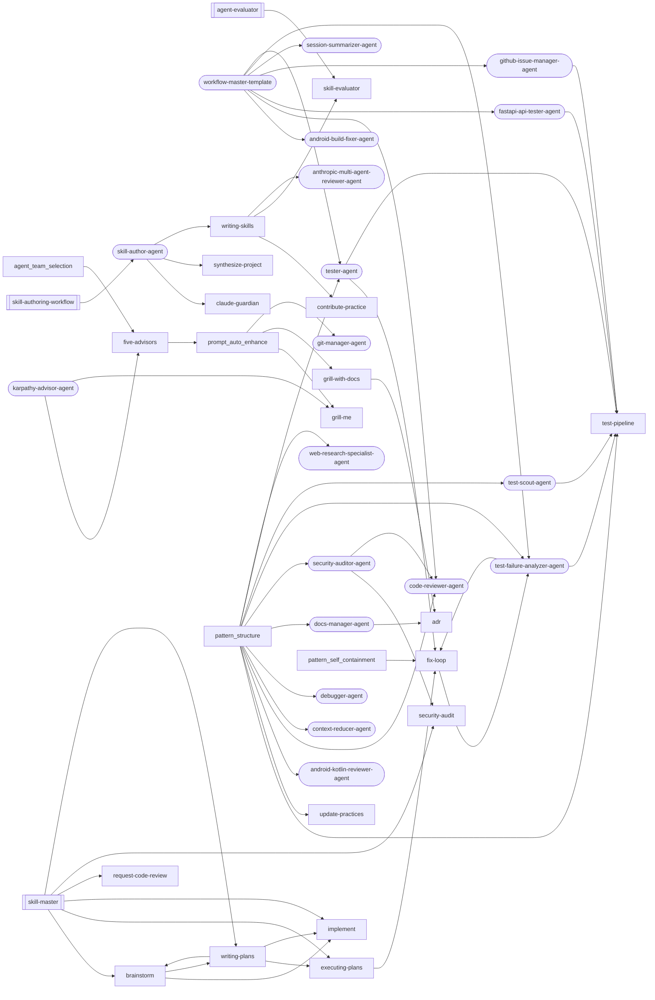
```mermaid
graph LR
    agent_evaluator[["agent-evaluator"]]
    karpathy_advisor_agent(["karpathy-advisor-agent"])
    skill_authoring_workflow[["skill-authoring-workflow"]]
    skill_master[["skill-master"]]
    workflow_master_template(["workflow-master-template"])
    adr["adr"]
    android_build_fixer_agent(["android-build-fixer-agent"])
    android_kotlin_reviewer_agent(["android-kotlin-reviewer-agent"])
    anthropic_multi_agent_reviewer_agent(["anthropic-multi-agent-reviewer-agent"])
    brainstorm["brainstorm"]
    claude_guardian["claude-guardian"]
    code_reviewer_agent(["code-reviewer-agent"])
    context_reducer_agent(["context-reducer-agent"])
    contribute_practice["contribute-practice"]
    debugger_agent(["debugger-agent"])
    docs_manager_agent(["docs-manager-agent"])
    executing_plans["executing-plans"]
    fastapi_api_tester_agent(["fastapi-api-tester-agent"])
    five_advisors["five-advisors"]
    fix_loop["fix-loop"]
    git_manager_agent(["git-manager-agent"])
    github_issue_manager_agent(["github-issue-manager-agent"])
    grill_me["grill-me"]
    grill_with_docs["grill-with-docs"]
    implement["implement"]
    request_code_review["request-code-review"]
    security_audit["security-audit"]
    security_auditor_agent(["security-auditor-agent"])
    session_summarizer_agent(["session-summarizer-agent"])
    skill_author_agent(["skill-author-agent"])
    skill_evaluator["skill-evaluator"]
    synthesize_project["synthesize-project"]
    test_failure_analyzer_agent(["test-failure-analyzer-agent"])
    test_pipeline["test-pipeline"]
    test_scout_agent(["test-scout-agent"])
    tester_agent(["tester-agent"])
    update_practices["update-practices"]
    web_research_specialist_agent(["web-research-specialist-agent"])
    writing_plans["writing-plans"]
    writing_skills["writing-skills"]
    agent_evaluator --> skill_evaluator
    brainstorm --> implement
    brainstorm --> writing_plans
    executing_plans --> fix_loop
    five_advisors --> prompt_auto_enhance
    fix_loop --> test_failure_analyzer_agent
    grill_with_docs --> adr
    prompt_auto_enhance --> grill_me
    prompt_auto_enhance --> grill_with_docs
    prompt_auto_enhance --> git_manager_agent
    skill_authoring_workflow --> skill_author_agent
    skill_master --> brainstorm
    skill_master --> executing_plans
    skill_master --> implement
    skill_master --> request_code_review
    skill_master --> security_audit
    skill_master --> writing_plans
    writing_plans --> brainstorm
    writing_plans --> executing_plans
    writing_plans --> implement
    writing_skills --> contribute_practice
    writing_skills --> skill_evaluator
    writing_skills --> anthropic_multi_agent_reviewer_agent
    docs_manager_agent --> adr
    fastapi_api_tester_agent --> test_pipeline
    github_issue_manager_agent --> test_pipeline
    karpathy_advisor_agent --> five_advisors
    karpathy_advisor_agent --> grill_me
    security_auditor_agent --> security_audit
    security_auditor_agent --> code_reviewer_agent
    skill_author_agent --> claude_guardian
    skill_author_agent --> synthesize_project
    skill_author_agent --> writing_skills
    test_failure_analyzer_agent --> fix_loop
    test_failure_analyzer_agent --> test_pipeline
    test_scout_agent --> test_pipeline
    tester_agent --> fix_loop
    tester_agent --> test_pipeline
    workflow_master_template --> android_build_fixer_agent
    workflow_master_template --> code_reviewer_agent
    workflow_master_template --> fastapi_api_tester_agent
    workflow_master_template --> github_issue_manager_agent
    workflow_master_template --> session_summarizer_agent
    workflow_master_template --> test_failure_analyzer_agent
    workflow_master_template --> tester_agent
    agent_team_selection --> five_advisors
    pattern_self_containment --> fix_loop
    pattern_structure --> test_pipeline
    pattern_structure --> update_practices
    pattern_structure --> android_kotlin_reviewer_agent
    pattern_structure --> code_reviewer_agent
    pattern_structure --> context_reducer_agent
    pattern_structure --> debugger_agent
    pattern_structure --> docs_manager_agent
    pattern_structure --> security_auditor_agent
    pattern_structure --> test_failure_analyzer_agent
    pattern_structure --> test_scout_agent
    pattern_structure --> tester_agent
    pattern_structure --> web_research_specialist_agent
```

### agent-evaluator

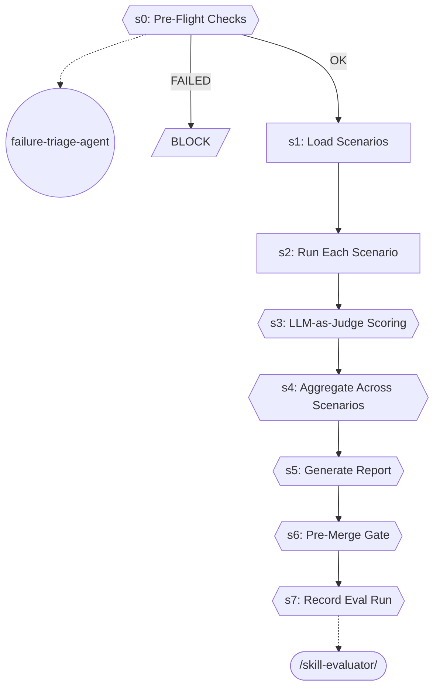
```mermaid
graph TD
    s0{{s0: Pre-Flight Checks}}
    failure_triage_agent_ext((failure-triage-agent))
    s0 -.-> failure_triage_agent_ext
    s0_block[/BLOCK/]
    s0 -->|FAILED| s0_block
    s1["s1: Load Scenarios"]
    s0 -->|OK| s1
    s2["s2: Run Each Scenario"]
    s1 --> s2
    s3{{s3: LLM-as-Judge Scoring}}
    s2 --> s3
    s4{{s4: Aggregate Across Scenarios}}
    s3 --> s4
    s5{{s5: Generate Report}}
    s4 --> s5
    s6{{s6: Pre-Merge Gate}}
    s5 --> s6
    s7{{s7: Record Eval Run}}
    s6 --> s7
    skill_evaluator_ext([/skill-evaluator/])
    s7 -.-> skill_evaluator_ext
```

| Step | Title | Delegates To | Artifacts | Gates/Decisions |
|------|-------|-------------|-----------|----------------|
| 0 | Pre-Flight Checks | `failure-triage-agent` | — | gate, decision, BLOCK |
| 1 | Load Scenarios | — | — | decision |
| 2 | Run Each Scenario | — | — | — |
| 3 | LLM-as-Judge Scoring | — | — | gate |
| 4 | Aggregate Across Scenarios | — | — | gate, decision |
| 5 | Generate Report | — | — | gate |
| 6 | Pre-Merge Gate | — | — | gate, decision |
| 7 | Record Eval Run | `/skill-evaluator` | — | gate |

### brainstorm

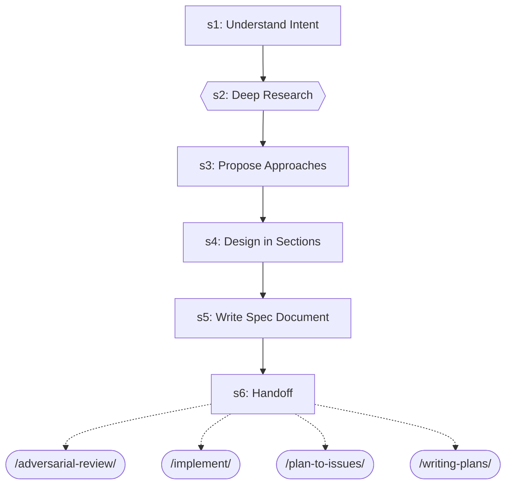
```mermaid
graph TD
    s1["s1: Understand Intent"]
    s2{{s2: Deep Research}}
    s1 --> s2
    s3["s3: Propose Approaches"]
    s2 --> s3
    s4["s4: Design in Sections"]
    s3 --> s4
    s5["s5: Write Spec Document"]
    s4 --> s5
    s6["s6: Handoff"]
    s5 --> s6
    adversarial_review_ext([/adversarial-review/])
    s6 -.-> adversarial_review_ext
    implement_ext([/implement/])
    s6 -.-> implement_ext
    plan_to_issues_ext([/plan-to-issues/])
    s6 -.-> plan_to_issues_ext
    writing_plans_ext([/writing-plans/])
    s6 -.-> writing_plans_ext
```

| Step | Title | Delegates To | Artifacts | Gates/Decisions |
|------|-------|-------------|-----------|----------------|
| 1 | Understand Intent | — | — | — |
| 2 | Deep Research | — | — | gate |
| 3 | Propose Approaches | — | — | — |
| 4 | Design in Sections | — | — | — |
| 5 | Write Spec Document | — | — | — |
| 6 | Handoff | `/adversarial-review`, `/implement`, `/plan-to-issues`, `/writing-plans` | — | — |

### claude-guardian

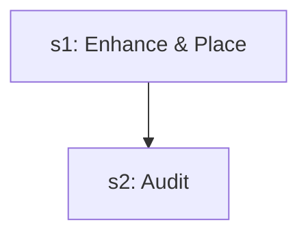
```mermaid
graph TD
    s1["s1: Enhance & Place"]
    s2["s2: Audit"]
    s1 --> s2
```

| Step | Title | Delegates To | Artifacts | Gates/Decisions |
|------|-------|-------------|-----------|----------------|
| 1 | Enhance & Place | — | — | — |
| 2 | Audit | — | — | — |

### contribute-practice

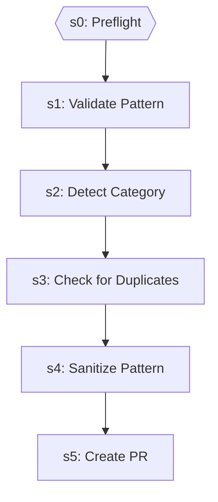
```mermaid
graph TD
    s0{{s0: Preflight}}
    s1["s1: Validate Pattern"]
    s0 --> s1
    s2["s2: Detect Category"]
    s1 --> s2
    s3["s3: Check for Duplicates"]
    s2 --> s3
    s4["s4: Sanitize Pattern"]
    s3 --> s4
    s5["s5: Create PR"]
    s4 --> s5
```

| Step | Title | Delegates To | Artifacts | Gates/Decisions |
|------|-------|-------------|-----------|----------------|
| 0 | Preflight | — | — | gate |
| 1 | Validate Pattern | — | — | — |
| 2 | Detect Category | — | — | — |
| 3 | Check for Duplicates | — | — | decision |
| 4 | Sanitize Pattern | — | — | decision |
| 5 | Create PR | — | — | — |

### executing-plans

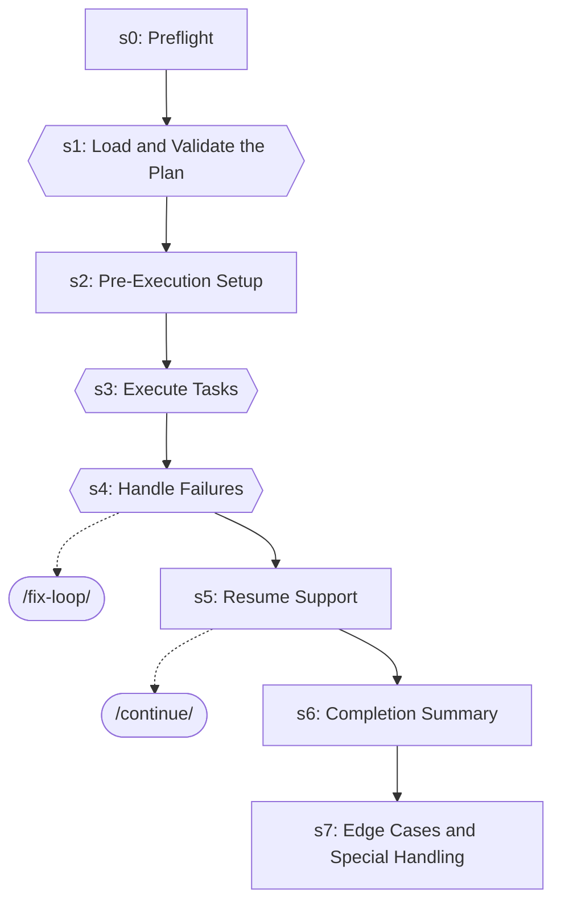
```mermaid
graph TD
    s0["s0: Preflight"]
    s1{{s1: Load and Validate the Plan}}
    s0 --> s1
    s2["s2: Pre-Execution Setup"]
    s1 --> s2
    s3{{s3: Execute Tasks}}
    s2 --> s3
    s4{{s4: Handle Failures}}
    s3 --> s4
    fix_loop_ext([/fix-loop/])
    s4 -.-> fix_loop_ext
    s5["s5: Resume Support"]
    s4 --> s5
    continue_ext([/continue/])
    s5 -.-> continue_ext
    s6["s6: Completion Summary"]
    s5 --> s6
    s7["s7: Edge Cases and Special Handling"]
    s6 --> s7
```

| Step | Title | Delegates To | Artifacts | Gates/Decisions |
|------|-------|-------------|-----------|----------------|
| 0 | Preflight | — | — | decision |
| 1 | Load and Validate the Plan | — | — | gate, decision |
| 2 | Pre-Execution Setup | — | — | — |
| 3 | Execute Tasks | — | — | gate |
| 4 | Handle Failures | `/fix-loop` | — | gate, decision |
| 5 | Resume Support | `/continue` | — | decision |
| 6 | Completion Summary | — | — | — |
| 7 | Edge Cases and Special Handling | — | — | decision |

### grill-me

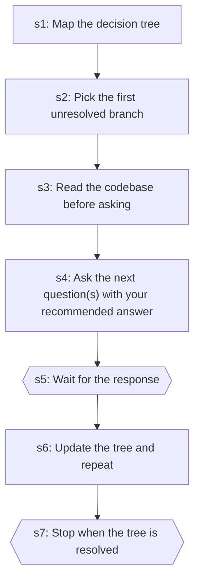
```mermaid
graph TD
    s1["s1: Map the decision tree"]
    s2["s2: Pick the first unresolved branch"]
    s1 --> s2
    s3["s3: Read the codebase before asking"]
    s2 --> s3
    s4["s4: Ask the next question(s) with your recommended answer"]
    s3 --> s4
    s5{{s5: Wait for the response}}
    s4 --> s5
    s6["s6: Update the tree and repeat"]
    s5 --> s6
    s7{{s7: Stop when the tree is resolved}}
    s6 --> s7
```

| Step | Title | Delegates To | Artifacts | Gates/Decisions |
|------|-------|-------------|-----------|----------------|
| 1 | Map the decision tree | — | — | — |
| 2 | Pick the first unresolved branch | — | — | — |
| 3 | Read the codebase before asking | — | — | — |
| 4 | Ask the next question(s) with your recommended answer | — | — | — |
| 5 | Wait for the response | — | — | gate |
| 6 | Update the tree and repeat | — | — | — |
| 7 | Stop when the tree is resolved | — | — | gate |

### grill-with-docs

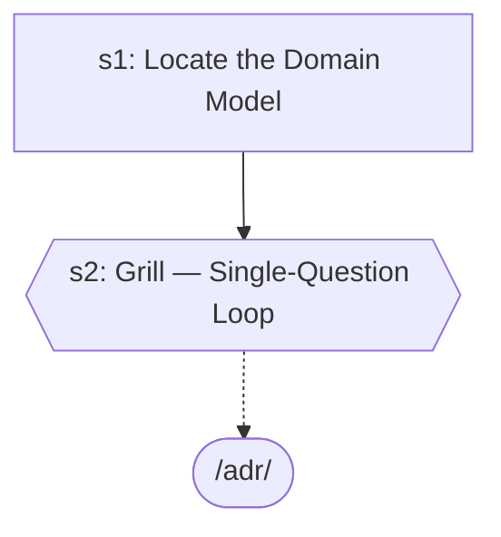
```mermaid
graph TD
    s1["s1: Locate the Domain Model"]
    s2{{s2: Grill — Single-Question Loop}}
    s1 --> s2
    adr_ext([/adr/])
    s2 -.-> adr_ext
```

| Step | Title | Delegates To | Artifacts | Gates/Decisions |
|------|-------|-------------|-----------|----------------|
| 1 | Locate the Domain Model | — | — | decision |
| 2 | Grill — Single-Question Loop | `/adr` | — | gate, decision |

### mcp-server-builder

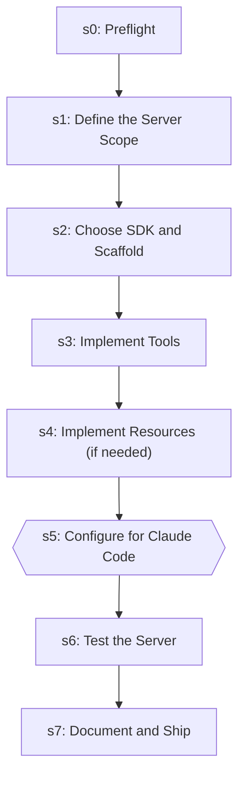
```mermaid
graph TD
    s0["s0: Preflight"]
    s1["s1: Define the Server Scope"]
    s0 --> s1
    s2["s2: Choose SDK and Scaffold"]
    s1 --> s2
    s3["s3: Implement Tools"]
    s2 --> s3
    s4["s4: Implement Resources (if needed)"]
    s3 --> s4
    s5{{s5: Configure for Claude Code}}
    s4 --> s5
    s6["s6: Test the Server"]
    s5 --> s6
    s7["s7: Document and Ship"]
    s6 --> s7
```

| Step | Title | Delegates To | Artifacts | Gates/Decisions |
|------|-------|-------------|-----------|----------------|
| 0 | Preflight | — | — | — |
| 1 | Define the Server Scope | — | — | — |
| 2 | Choose SDK and Scaffold | — | — | — |
| 3 | Implement Tools | — | — | — |
| 4 | Implement Resources (if needed) | — | — | — |
| 5 | Configure for Claude Code | — | — | gate |
| 6 | Test the Server | — | — | — |
| 7 | Document and Ship | — | — | — |

### provenance-report

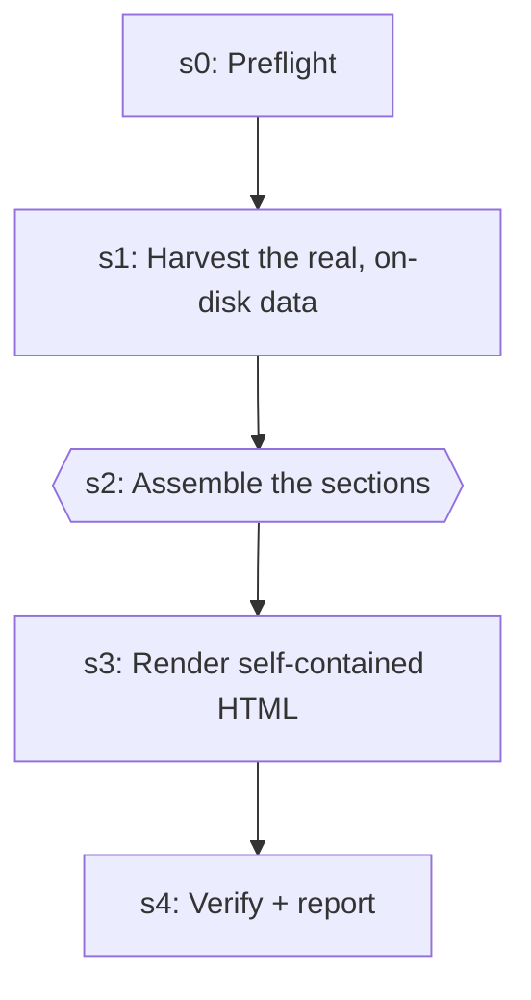
```mermaid
graph TD
    s0["s0: Preflight"]
    s1["s1: Harvest the real, on-disk data"]
    s0 --> s1
    s2{{s2: Assemble the sections}}
    s1 --> s2
    s3["s3: Render self-contained HTML"]
    s2 --> s3
    s4["s4: Verify + report"]
    s3 --> s4
```

| Step | Title | Delegates To | Artifacts | Gates/Decisions |
|------|-------|-------------|-----------|----------------|
| 0 | Preflight | — | — | decision |
| 1 | Harvest the real, on-disk data | — | → `test-results/*.json` | — |
| 2 | Assemble the sections | — | — | gate |
| 3 | Render self-contained HTML | — | — | — |
| 4 | Verify + report | — | — | — |

### security-audit

```mermaid
graph TD
    s0["s0: Preflight"]
    s1["s1: Reconnaissance"]
    s0 --> s1
    s2["s2: Static Analysis"]
    s1 --> s2
    s3["s3: Variant Analysis"]
    s2 --> s3
    s4["s4: Differential Security Review"]
    s3 --> s4
    s5["s5: Insecure Defaults Detection"]
    s4 --> s5
    s6{{s6: GitHub Actions Security}}
    s5 --> s6
    s7{{s7: False-Positive Gating}}
    s6 --> s7
    s8["s8: OWASP Top 10 Checklist"]
    s7 --> s8
    s9{{s9: Compliance Testing (GDPR / SOC2 / HIPAA)}}
    s8 --> s9
```

| Step | Title | Delegates To | Artifacts | Gates/Decisions |
|------|-------|-------------|-----------|----------------|
| 0 | Preflight | — | — | decision |
| 1 | Reconnaissance | — | — | — |
| 2 | Static Analysis | — | — | — |
| 3 | Variant Analysis | — | — | — |
| 4 | Differential Security Review | — | — | — |
| 5 | Insecure Defaults Detection | — | — | — |
| 6 | GitHub Actions Security | — | — | gate |
| 7 | False-Positive Gating | — | — | gate |
| 8 | OWASP Top 10 Checklist | — | — | — |
| 9 | Compliance Testing (GDPR / SOC2 / HIPAA) | — | — | gate |

### semgrep-rules

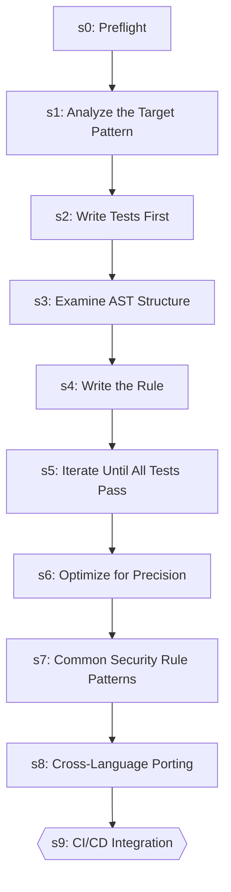
```mermaid
graph TD
    s0["s0: Preflight"]
    s1["s1: Analyze the Target Pattern"]
    s0 --> s1
    s2["s2: Write Tests First"]
    s1 --> s2
    s3["s3: Examine AST Structure"]
    s2 --> s3
    s4["s4: Write the Rule"]
    s3 --> s4
    s5["s5: Iterate Until All Tests Pass"]
    s4 --> s5
    s6["s6: Optimize for Precision"]
    s5 --> s6
    s7["s7: Common Security Rule Patterns"]
    s6 --> s7
    s8["s8: Cross-Language Porting"]
    s7 --> s8
    s9{{s9: CI/CD Integration}}
    s8 --> s9
```

| Step | Title | Delegates To | Artifacts | Gates/Decisions |
|------|-------|-------------|-----------|----------------|
| 0 | Preflight | — | — | decision |
| 1 | Analyze the Target Pattern | — | — | — |
| 2 | Write Tests First | — | — | — |
| 3 | Examine AST Structure | — | — | — |
| 4 | Write the Rule | — | — | — |
| 5 | Iterate Until All Tests Pass | — | — | decision |
| 6 | Optimize for Precision | — | — | — |
| 7 | Common Security Rule Patterns | — | — | — |
| 8 | Cross-Language Porting | — | — | — |
| 9 | CI/CD Integration | — | — | gate |

### skill-evaluator

```mermaid
graph TD
    s0{{s0: Pre-Flight Checks}}
    s1{{s1: Parse Mode and Load Skill}}
    s0 --> s1
    s2{{s2: Trigger Evaluation (modes: trigger, full)}}
    s1 --> s2
    s3{{s3: Output Evaluation (modes: output, full)}}
    s2 --> s3
    s4["s4: Conflicts Mode (mode: conflicts)"]
    s3 --> s4
    s5{{s5: Human Review (standalone only)}}
    s4 --> s5
    s6{{s6: Produce Evaluation Report}}
    s5 --> s6
    s7["s7: Return Verdict"]
    s6 --> s7
    s8{{s8: Capture Eval Lesson (self-learning loop, exit gate — MANDATORY)}}
    s7 --> s8
```

| Step | Title | Delegates To | Artifacts | Gates/Decisions |
|------|-------|-------------|-----------|----------------|
| 0 | Pre-Flight Checks | — | — | gate, decision |
| 1 | Parse Mode and Load Skill | — | — | gate |
| 2 | Trigger Evaluation (modes: trigger, full) | — | — | gate, decision |
| 3 | Output Evaluation (modes: output, full) | — | — | gate, decision |
| 4 | Conflicts Mode (mode: conflicts) | — | — | — |
| 5 | Human Review (standalone only) | — | — | gate |
| 6 | Produce Evaluation Report | — | — | gate |
| 7 | Return Verdict | — | — | — |
| 8 | Capture Eval Lesson (self-learning loop, exit gate — MANDATORY) | — | — | gate |

### skill-master

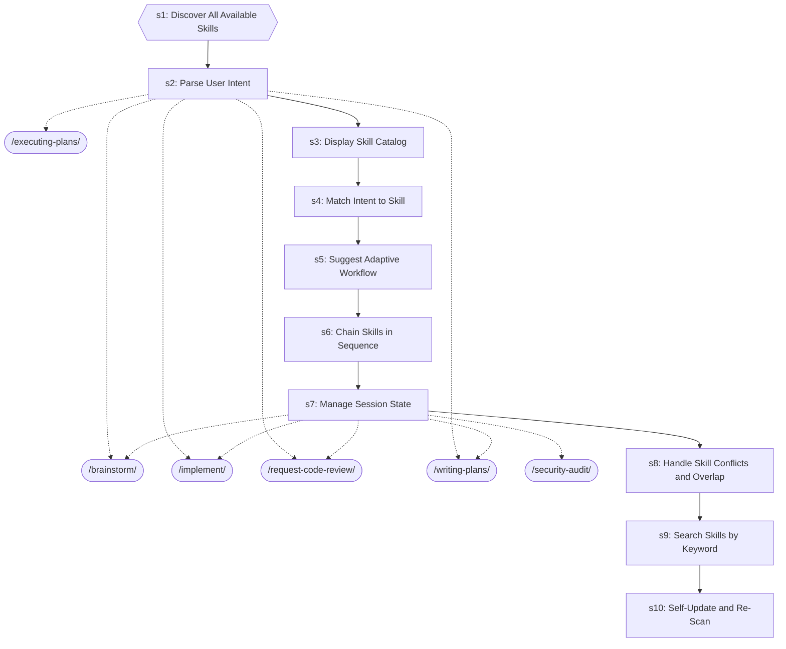
```mermaid
graph TD
    s1{{s1: Discover All Available Skills}}
    s2["s2: Parse User Intent"]
    s1 --> s2
    brainstorm_ext([/brainstorm/])
    s2 -.-> brainstorm_ext
    executing_plans_ext([/executing-plans/])
    s2 -.-> executing_plans_ext
    implement_ext([/implement/])
    s2 -.-> implement_ext
    request_code_review_ext([/request-code-review/])
    s2 -.-> request_code_review_ext
    writing_plans_ext([/writing-plans/])
    s2 -.-> writing_plans_ext
    s3["s3: Display Skill Catalog"]
    s2 --> s3
    s4["s4: Match Intent to Skill"]
    s3 --> s4
    s5["s5: Suggest Adaptive Workflow"]
    s4 --> s5
    s6["s6: Chain Skills in Sequence"]
    s5 --> s6
    s7["s7: Manage Session State"]
    s6 --> s7
    brainstorm_ext([/brainstorm/])
    s7 -.-> brainstorm_ext
    implement_ext([/implement/])
    s7 -.-> implement_ext
    request_code_review_ext([/request-code-review/])
    s7 -.-> request_code_review_ext
    security_audit_ext([/security-audit/])
    s7 -.-> security_audit_ext
    writing_plans_ext([/writing-plans/])
    s7 -.-> writing_plans_ext
    s8["s8: Handle Skill Conflicts and Overlap"]
    s7 --> s8
    s9["s9: Search Skills by Keyword"]
    s8 --> s9
    s10["s10: Self-Update and Re-Scan"]
    s9 --> s10
```

| Step | Title | Delegates To | Artifacts | Gates/Decisions |
|------|-------|-------------|-----------|----------------|
| 1 | Discover All Available Skills | — | — | gate |
| 2 | Parse User Intent | `/brainstorm`, `/executing-plans`, `/implement`, `/request-code-review`, `/writing-plans` | — | — |
| 3 | Display Skill Catalog | — | — | — |
| 4 | Match Intent to Skill | — | — | — |
| 5 | Suggest Adaptive Workflow | — | — | — |
| 6 | Chain Skills in Sequence | — | — | — |
| 7 | Manage Session State | `/brainstorm`, `/implement`, `/request-code-review`, `/security-audit`, `/writing-plans` | — | decision |
| 8 | Handle Skill Conflicts and Overlap | — | — | — |
| 9 | Search Skills by Keyword | — | — | — |
| 10 | Self-Update and Re-Scan | — | — | decision |

### synthesize-project

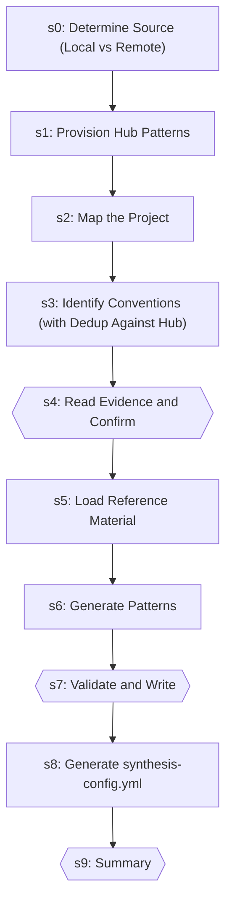
```mermaid
graph TD
    s0["s0: Determine Source (Local vs Remote)"]
    s1["s1: Provision Hub Patterns"]
    s0 --> s1
    s2["s2: Map the Project"]
    s1 --> s2
    s3["s3: Identify Conventions (with Dedup Against Hub)"]
    s2 --> s3
    s4{{s4: Read Evidence and Confirm}}
    s3 --> s4
    s5["s5: Load Reference Material"]
    s4 --> s5
    s6["s6: Generate Patterns"]
    s5 --> s6
    s7{{s7: Validate and Write}}
    s6 --> s7
    s8["s8: Generate synthesis-config.yml"]
    s7 --> s8
    s9{{s9: Summary}}
    s8 --> s9
```

| Step | Title | Delegates To | Artifacts | Gates/Decisions |
|------|-------|-------------|-----------|----------------|
| 0 | Determine Source (Local vs Remote) | — | — | decision |
| 1 | Provision Hub Patterns | — | — | — |
| 2 | Map the Project | — | — | decision |
| 3 | Identify Conventions (with Dedup Against Hub) | — | — | — |
| 4 | Read Evidence and Confirm | — | — | gate |
| 5 | Load Reference Material | — | — | decision |
| 6 | Generate Patterns | — | — | — |
| 7 | Validate and Write | — | — | gate, decision |
| 8 | Generate synthesis-config.yml | — | — | decision |
| 9 | Summary | — | — | gate, decision |

### writing-plans

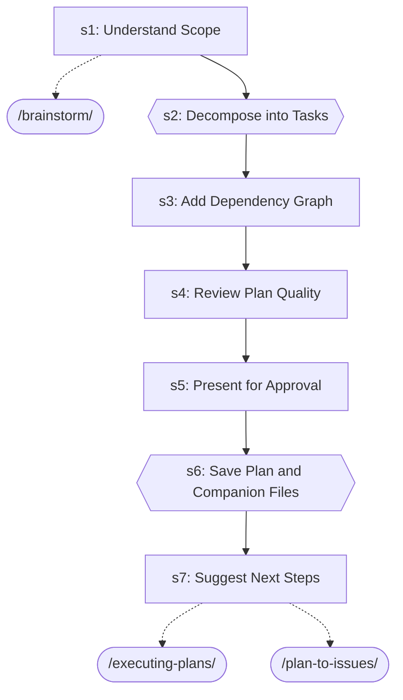
```mermaid
graph TD
    s1["s1: Understand Scope"]
    brainstorm_ext([/brainstorm/])
    s1 -.-> brainstorm_ext
    s2{{s2: Decompose into Tasks}}
    s1 --> s2
    s3["s3: Add Dependency Graph"]
    s2 --> s3
    s4["s4: Review Plan Quality"]
    s3 --> s4
    s5["s5: Present for Approval"]
    s4 --> s5
    s6{{s6: Save Plan and Companion Files}}
    s5 --> s6
    s7["s7: Suggest Next Steps"]
    s6 --> s7
    executing_plans_ext([/executing-plans/])
    s7 -.-> executing_plans_ext
    plan_to_issues_ext([/plan-to-issues/])
    s7 -.-> plan_to_issues_ext
```

| Step | Title | Delegates To | Artifacts | Gates/Decisions |
|------|-------|-------------|-----------|----------------|
| 1 | Understand Scope | `/brainstorm` | — | decision |
| 2 | Decompose into Tasks | — | — | gate, decision |
| 3 | Add Dependency Graph | — | — | — |
| 4 | Review Plan Quality | — | — | — |
| 5 | Present for Approval | — | — | — |
| 6 | Save Plan and Companion Files | — | — | gate |
| 7 | Suggest Next Steps | `/executing-plans`, `/plan-to-issues` | — | — |

### writing-skills

```mermaid
graph TD
    s1{{s1: Determine Authoring Mode}}
    s2{{s2: Skill Authoring — From Scratch}}
    s1 --> s2
    s3{{s3: Session Log Analysis}}
    s2 --> s3
    s4["s4: Naming and Organization"]
    s3 --> s4
    s5{{s5: Quality Checklist}}
    s4 --> s5
    s6{{s6: Evaluate and Iterate with /skill-evaluator}}
    s5 --> s6
    skill_evaluator_ext([/skill-evaluator/])
    s6 -.-> skill_evaluator_ext
    anthropic_multi_agent_reviewer_agent_ext((anthropic-multi-agent-reviewer-agent))
    s6 -.-> anthropic_multi_agent_reviewer_agent_ext
    s7["s7: Hub Promotion Workflow"]
    s6 --> s7
    contribute_practice_ext([/contribute-practice/])
    s7 -.-> contribute_practice_ext
    s8{{s8: Post-Promotion Lifecycle}}
    s7 --> s8
    s9["s9: Template Library"]
    s8 --> s9
    s10{{s10: Capture Authoring Lesson (self-learning loop, exit gate — MANDATORY)}}
    s9 --> s10
    skill_evaluator_ext([/skill-evaluator/])
    s10 -.-> skill_evaluator_ext
```

| Step | Title | Delegates To | Artifacts | Gates/Decisions |
|------|-------|-------------|-----------|----------------|
| 1 | Determine Authoring Mode | — | — | gate, decision |
| 2 | Skill Authoring — From Scratch | — | — | gate, decision |
| 3 | Session Log Analysis | — | — | gate |
| 4 | Naming and Organization | — | — | — |
| 5 | Quality Checklist | — | — | gate |
| 6 | Evaluate and Iterate with /skill-evaluator | `/skill-evaluator`, `anthropic-multi-agent-reviewer-agent` | — | gate, decision |
| 7 | Hub Promotion Workflow | `/contribute-practice` | — | — |
| 8 | Post-Promotion Lifecycle | — | — | gate |
| 9 | Template Library | — | — | — |
| 10 | Capture Authoring Lesson (self-learning loop, exit gate — MANDATORY) | `/skill-evaluator` | — | gate |

## Agents

| Agent | Description | Dispatched By |
|-------|-------------|---------------|
| `android-build-fixer-agent` | Use proactively to diagnose and fix Android Gradle build failures. Spawn auto... | `/workflow-master-template` |
| `android-kotlin-reviewer-agent` | Use proactively to review Kotlin code for idiomatic patterns, coroutine safet... | — |
| `anthropic-multi-agent-reviewer-agent` | Review multi-agent orchestration systems against Anthropic's 8 research-backe... | `/writing-skills` |
| `code-reviewer-agent` | Use proactively to review recently changed files for code quality, type safet... | `/security-auditor-agent`, `/workflow-master-template` |
| `context-reducer-agent` | Use proactively to summarize completed work mid-session and produce a compres... | — |
| `debugger-agent` | Use proactively to diagnose failures, analyze logs, investigate performance i... | — |
| `docs-manager-agent` | Use this agent for documentation updates — continuation prompts, requirement ... | — |
| `fastapi-api-tester-agent` | Use this agent when you need to test FastAPI backend endpoints, validate API ... | `/workflow-master-template` |
| `fastapi-database-admin-agent` | Use this agent for database tasks — PostgreSQL queries, Alembic migrations, s... | — |
| `git-manager-agent` | Git Operations Specialist. Securely stages, commits, and pushes code changes ... | — |
| `github-issue-manager-agent` | Use proactively to create consolidated GitHub Issues for test failures from t... | `/workflow-master-template` |
| `karpathy-advisor-agent` | Consult Andrej Karpathy's documented thinking on a decision, design, or situa... | — |
| `security-auditor-agent` | Use proactively for security assessments — OWASP Top 10 scanning, threat mode... | — |
| `session-summarizer-agent` | Use proactively to auto-generate session summary updates at session end. Spaw... | `/workflow-master-template` |
| `skill-author-agent` | Create, update, or manage Claude Code skills, rules, and agents using the ded... | `/skill-authoring-workflow` |
| `test-failure-analyzer-agent` | Use proactively to diagnose test failures — reads test output, classifies by ... | `/fix-loop`, `/workflow-master-template` |
| `test-scout-agent` | Dual-mode worker agent (`dispatched_from: worker`). (1) `execute` mode: run P... | — |
| `tester-agent` | Senior QA engineer specializing in comprehensive testing and quality assuranc... | `/workflow-master-template` |
| `web-research-specialist-agent` | Use this agent for web research — finding documentation, API references, libr... | — |
| `workflow-master-template` | Shared orchestration protocol reference for workflow orchestrators in core/.c... | — |

## Rules

| Rule | Description |
|------|-------------|
| `agent-team-selection` | When to reach for an agent TEAM (peer Claude Code sessions that message + sel... |
| `claude-docs-cache` |  |
| `pattern-portability` | Portability standards for distributed patterns. Ensures patterns work in any ... |
| `pattern-self-containment` | Self-containment and completeness standards for patterns. Prevents placeholde... |
| `pattern-structure` | Structural requirements for skills, agents, and rules. Enforces frontmatter, ... |
| `prompt-auto-enhance` |  |
| `rule-curation` | Guidelines for curating patterns (skills, agents, rules) added to the distrib... |
| `rule-writing-meta` | Meta-guidance for writing effective CLAUDE.md rules, choosing config file pla... |

## Cross-Workflow Connections

**Outgoing** (this workflow feeds into):
- `adversarial-review` (skill)
- `api-docs-generator` (skill)
- `changelog-contributing` (skill)
- `continue` (skill)
- `contract-test` (skill)
- `create-github-issue` (skill)
- `development-loop` (skill)
- `diataxis-docs` (skill)
- `doc-staleness` (skill)
- `doc-structure-enforcer` (skill)
- `e2e-visual-run` (skill)
- `fix-github-issue` (skill)
- `plan-to-issues` (skill)
- `planner-researcher-agent` (agent)
- `test-healer-agent` (agent)
- `visual-inspector-agent` (agent)

**Incoming** (fed by):
- `adversarial-review` (skill)
- `agent-orchestration` (rule)
- `android-run-e2e` (skill)
- `android-run-tests` (skill)
- `anthropic-agent-orchestration-guide` (skill)
- `anthropic-multi-agent-research-system-skill` (skill)
- `apply-selections` (skill)
- `auto-verify` (skill)
- `bootstrap-dogfood-project` (skill)
- `bun-elysia-test` (skill)
- `changelog-contributing` (skill)
- `claude-behavior` (rule)
- `code-review-workflow` (skill)
- `create-github-issue` (skill)
- `decision-authority` (rule)
- `dependency-migration-triage` (skill)
- `diataxis-docs` (skill)
- `e2e-visual-run` (skill)
- `engineering-roles` (rule)
- `escalation-report` (skill)
- `fastapi-run-backend-tests` (skill)
- `firebase-test` (skill)
- `flutter-e2e-test` (skill)
- `get-work-done` (skill)
- `git-branch-lifecycle` (skill)
- `git-collaboration` (rule)
- `improve-codebase-architecture` (skill)
- `karpathy-advisor` (skill)
- `learning-self-improvement` (skill)
- `plan-before-coding` (rule)
- `pr-standards` (skill)
- `prd-parser` (skill)
- `project-manager-agent` (agent)
- `project-scaffold` (skill)
- `provision-report` (skill)
- `self-improve` (skill)
- `serialize-fixes` (skill)
- `session-continuity` (skill)
- `subagent-driven-dev` (skill)
- `supervisor-verification` (rule)
- `synthesize-hub` (skill)
- `tdd` (skill)
- `test-healer-agent` (agent)
- `testing` (rule)
- `to-prd` (skill)
- `untrusted-content-handling` (rule)
- `verify-screenshots` (skill)
- `visual-inspector-agent` (agent)
- `weakened-test-hunter` (skill)
- `workflow` (rule)
- `zoom-out` (skill)

<!-- MANUAL ANNOTATIONS -->
<!-- Add custom notes below this line. They are preserved on regeneration. -->
