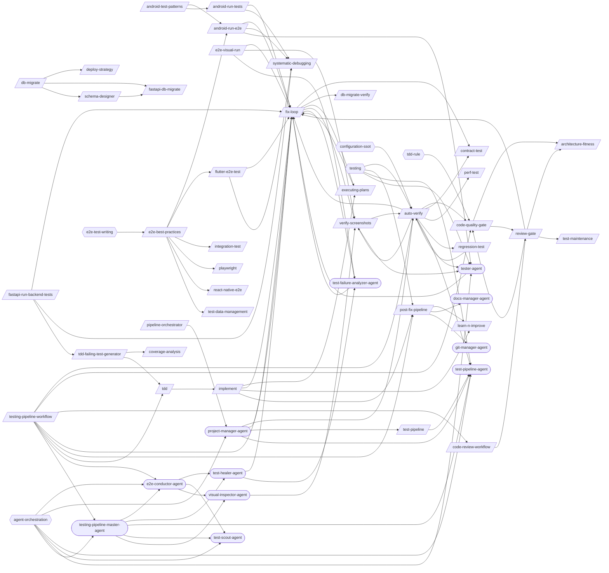

# Testing Pipeline

> Test execution, verification, quality enforcement, and the fix-verify-commit chain.

> Auto-generated by `scripts/generate_workflow_docs.py` | Last updated: 2026-03-30 14:39 UTC

## Overview

## Skills

| Skill | Version | Description | Calls | Called By |
|-------|---------|-------------|-------|----------|
| `/android-adb-test` | 1.0.0 | Run Android E2E tests via ADB using uiautomator dump, screencap, and input ta... | — | — |
| `/android-run-e2e` | 2.1.0 | Run Android E2E tests via Gradle (Espresso/Compose) or Maestro (cross-platfor... | `/fix-loop`, `/systematic-debugging`, `/tester-agent` | `/android-test-patterns`, `/e2e-best-practices` |
| `/android-run-tests` | 2.1.0 | Run Android unit, UI, E2E, or journey tests with class name resolution and au... | `/fix-loop`, `/systematic-debugging` | `/android-test-patterns` |
| `/android-test-patterns` | 1.0.0 | Apply Android test writing patterns including JUnit 5 unit tests, Compose UI ... | `/android-run-e2e`, `/android-run-tests` | — |
| `/architecture-fitness` | 1.0.0 | Validate architecture conformance including dependency direction, circular de... | — | `/code-quality-gate`, `/review-gate` |
| `/auto-verify` | 3.0.0 | Run a verification pipeline that identifies changed files, maps to targeted t... | `/code-quality-gate`, `/contract-test`, `/fix-loop`, `/perf-test`, `/regression-test`, `/verify-screenshots`, `/test-pipeline-agent`, `/tester-agent` | `/regression-test`, `/testing-pipeline-workflow`, `/verify-screenshots`, `/project-manager-agent` |
| `/branching` | 1.0.1 | Manage the full branch lifecycle from creation through merge and cleanup. Cre... | — | — |
| `/change-risk-scoring` | 1.1.0 | Compute a quantified risk score (0-100) for code changes based on files chang... | — | — |
| `/chaos-resilience` | 1.0.0 | Inject controlled failures (service crash, network partition, OOM, disk full)... | — | — |
| `/ci-cd-setup` | 1.0.0 | Set up CI/CD pipelines for GitHub Actions or GitLab CI. Covers workflow synta... | — | — |
| `/code-quality-gate` | 1.2.0 | Enforce code quality standards including cyclomatic complexity, duplication d... | `/architecture-fitness`, `/review-gate` | `/auto-verify`, `/review-gate`, `/testing-pipeline-workflow` |
| `/code-review-workflow` | 1.0.0 | Run pre-merge quality gates, create PR, and handle review feedback. Use when ... | `/review-gate` | `/testing-pipeline-workflow` |
| `/contract-test` | 1.1.0 | Implement consumer-driven contract testing with Pact. Write consumer contract... | — | `/auto-verify`, `/fix-loop` |
| `/coverage-analysis` | 1.0.0 | Analyze test coverage across a project, identify gaps in critical code paths,... | — | `/tdd-failing-test-generator` |
| `/db-migrate` | 1.0.0 | Generate and verify database migrations across Prisma, Knex, Django, TypeORM,... | `/deploy-strategy`, `/fastapi-db-migrate`, `/schema-designer` | — |
| `/db-migrate-verify` | 1.0.0 | Verify database migrations: run forward, validate schema, run backward, valid... | — | `/fix-loop` |
| `/deploy-strategy` | 1.0.0 | Design deployment strategies including GitOps (ArgoCD/Flux), progressive deli... | — | `/db-migrate` |
| `/e2e-best-practices` | 1.0.0 | Apply cross-framework E2E testing best practices for selector strategy, test ... | `/android-run-e2e`, `/flutter-e2e-test`, `/integration-test`, `/playwright`, `/react-native-e2e`, `/test-data-management` | — |
| `/e2e-visual-run` | 2.0.0 | Run full E2E suite with async queue-based orchestration, per-test screenshot ... | `/fix-loop`, `/verify-screenshots`, `/test-failure-analyzer-agent` | — |
| `/executing-plans` | 1.0.0 | Execute a pre-written implementation plan step by step. Parses tasks from a p... | `/fix-loop` | `/fix-loop`, `/implement` |
| `/fastapi-db-migrate` | 1.0.1 | Generate and manage database migrations for FastAPI + Alembic projects. Creat... | — | `/db-migrate`, `/schema-designer` |
| `/fastapi-run-backend-tests` | 2.1.0 | Run backend pytest with smart defaults, short-name resolution, and auto-fix o... | `/fix-loop`, `/systematic-debugging`, `/tdd-failing-test-generator` | — |
| `/fix-loop` | 1.2.0 | Analyze failures and iteratively apply minimal fixes, optionally retesting un... | `/contract-test`, `/db-migrate-verify`, `/executing-plans`, `/verify-screenshots`, `/test-failure-analyzer-agent` | `/android-run-e2e`, `/android-run-tests`, `/auto-verify`, `/e2e-visual-run`, `/executing-plans`, `/fastapi-run-backend-tests`, `/flutter-e2e-test`, `/implement`, `/review-gate`, `/testing-pipeline-workflow`, `/project-manager-agent`, `/test-failure-analyzer-agent`, `/test-healer-agent`, `/tester-agent` |
| `/flutter-e2e-test` | 1.2.1 | Run Flutter E2E tests across Android, Web, and desktop platforms with MCP-bas... | `/fix-loop`, `/systematic-debugging` | `/e2e-best-practices` |
| `/implement` | 1.0.0 | Implement a feature or fix following a structured workflow: requirements anal... | `/executing-plans`, `/fix-loop`, `/learn-n-improve`, `/post-fix-pipeline` | `/tdd` |
| `/integration-test` | 1.0.0 | Apply integration testing patterns across service boundaries covering databas... | — | `/e2e-best-practices` |
| `/learn-n-improve` | 2.2.0 | Analyze session outcomes and update memory topics (testing-lessons, fix-patte... | — | `/implement`, `/post-fix-pipeline` |
| `/merge-strategy` | 1.0.0 | Recommend the optimal Git merge strategy (squash, merge commit, or rebase) ba... | — | — |
| `/mock-server` | 1.0.0 | Configure API mock and stub servers for development and testing. Covers MSW, ... | — | — |
| `/perf-test` | 1.2.0 | Run performance tests using k6 load testing, Lighthouse web performance audit... | — | `/auto-verify` |
| `/pipeline-orchestrator` | 2.0.1 | Orchestrate multi-stage pipelines for PRD-to-Production delivery using a DAG-... | `/project-manager-agent` | — |
| `/playwright` | 1.1.2 | Write, run, and debug Playwright E2E tests for web applications including bro... | — | `/e2e-best-practices` |
| `/post-fix-pipeline` | 3.0.0 | Finalize verified changes by reading the upstream auto-verify gate, updating ... | `/learn-n-improve`, `/docs-manager-agent`, `/git-manager-agent` | `/implement`, `/testing-pipeline-workflow` |
| `/react-native-e2e` | 1.0.1 | Run end-to-end tests for React Native apps using Detox and visual regression ... | — | `/e2e-best-practices` |
| `/react-test-patterns` | 1.0.0 | Execute advanced React testing workflows including RTL custom renders, Server... | — | — |
| `/regression-test` | 1.1.0 | Run targeted regression tests based on code changes. Analyze git diffs to ide... | `/auto-verify` | `/auto-verify` |
| `/research-mode` | 1.0.0 | Analyze questions or documents with citation-backed rigor and zero tolerance ... | — | — |
| `/review-gate` | 2.3.0 | Orchestrate all review sub-skills (code-quality-gate, architecture-fitness, s... | `/architecture-fitness`, `/code-quality-gate`, `/fix-loop`, `/test-maintenance` | `/code-quality-gate`, `/code-review-workflow` |
| `/schema-designer` | 1.0.0 | Design database schemas covering ER modeling, normalization, evolutionary str... | `/fastapi-db-migrate` | `/db-migrate` |
| `/semgrep-rules` | 1.0.0 | Build, test, and optimize custom Semgrep rules for vulnerability detection an... | — | — |
| `/solidity-audit` | 1.0.0 | Audit and develop Solidity smart contracts covering Foundry/Hardhat testing, ... | — | — |
| `/supply-chain-audit` | 1.0.0 | Audit supply chain security covering dependency inventory, vulnerability scan... | — | — |
| `/systematic-debugging` | 1.0.0 | Debug failures methodically using a structured diagnosis workflow: reproduce,... | — | `/android-run-e2e`, `/android-run-tests`, `/fastapi-run-backend-tests`, `/flutter-e2e-test` |
| `/tdd` | 1.0.1 | Execute strict Test-Driven Development using the red-green-refactor cycle. Wr... | `/implement` | `/tdd-failing-test-generator`, `/testing-pipeline-workflow` |
| `/tdd-failing-test-generator` | 2.0.0 | Generate test suites from PRD requirements, schema, or API specs. Produces sh... | `/coverage-analysis`, `/tdd` | `/fastapi-run-backend-tests` |
| `/test-data-management` | 1.0.0 | Manage test data across Python and TypeScript projects using factories, faker... | — | `/e2e-best-practices` |
| `/test-maintenance` | 1.2.0 | Audit and optimize test suites by identifying dead tests, duplicates, slow te... | — | `/review-gate` |
| `/test-pipeline` | 1.0.0 | Run the full test verification pipeline: fix failures, verify changes, review... | `/test-pipeline-agent` | `/project-manager-agent` |
| `/testing-pipeline-workflow` | 1.0.0 | Run the complete test verification chain from TDD through quality gates. Use ... | `/auto-verify`, `/code-quality-gate`, `/code-review-workflow`, `/fix-loop`, `/post-fix-pipeline`, `/tdd`, `/e2e-conductor-agent`, `/testing-pipeline-master-agent` | — |
| `/trace-test` | 1.0.0 | Validate distributed traces with OpenTelemetry and Tracetest by asserting on ... | — | — |
| `/verify-screenshots` | 2.0.0 | Validate screenshots against baselines using multimodal content analysis for ... | `/auto-verify`, `/tester-agent` | `/auto-verify`, `/e2e-visual-run`, `/fix-loop`, `/visual-inspector-agent` |
| `/vitest-dev` | 1.0.0 | Apply Vitest patterns for configuration, mocking (vi.mock/vi.fn/vi.spyOn), sn... | — | — |
| `/vue-test` | 1.0.0 | Run and author tests for Vue.js applications covering components, Pinia store... | — | — |

## Agents

| Agent | Description | Dispatched By |
|-------|-------------|---------------|
| `android-compose-agent` | Use this agent for Compose UI work — building screens, fixing UI bugs, implem... | — |
| `docs-manager-agent` | Use this agent for documentation updates — continuation prompts, requirement ... | `/post-fix-pipeline` |
| `e2e-conductor-agent` | Orchestrate async queue-based E2E test execution by dispatching test-scout-ag... | `/testing-pipeline-workflow`, `/testing-pipeline-master-agent` |
| `fastapi-api-tester-agent` | Use this agent when you need to test FastAPI backend endpoints, validate API ... | — |
| `flutter-dart-agent` | Use this agent for Flutter/Dart UI work — building screens, fixing widget bug... | — |
| `git-manager-agent` | Git Operations Specialist. Securely stages, commits, and pushes code changes ... | `/post-fix-pipeline` |
| `project-manager-agent` | DAG-based multi-stage pipeline orchestrator for PRD-to-Production delivery. U... | `/pipeline-orchestrator` |
| `quality-gate-evaluator-agent` | Use this agent to evaluate code or content against a set of quality criteria.... | — |
| `test-failure-analyzer-agent` | Use this agent to diagnose test failures — reads test output, classifies by r... | `/e2e-visual-run`, `/fix-loop`, `/test-healer-agent` |
| `test-healer-agent` | Diagnose and fix E2E test failures from the fix queue using classification-dr... | `/e2e-conductor-agent`, `/testing-pipeline-master-agent` |
| `test-pipeline-agent` | Orchestrates the full test verification pipeline: cleanup, stage dispatch, ga... | `/auto-verify`, `/test-pipeline`, `/project-manager-agent`, `/testing-pipeline-master-agent` |
| `test-scout-agent` | Execute E2E tests in batches, capture screenshots only on failure, and record... | `/e2e-conductor-agent`, `/testing-pipeline-master-agent` |
| `tester-agent` | Senior QA engineer specializing in comprehensive testing and quality assuranc... | `/android-run-e2e`, `/auto-verify`, `/verify-screenshots` |
| `testing-pipeline-master-agent` | Orchestrate the full testing workflow: TDD red phase, fix-loop iterations, au... | `/testing-pipeline-workflow` |
| `visual-inspector-agent` | Verify completed E2E test results using dual-signal analysis: accessibility t... | `/e2e-conductor-agent`, `/testing-pipeline-master-agent` |
| `workflow-master-template` | Shared orchestration protocol reference for all workflow-master agents. Not a... | — |

## Rules

| Rule | Description |
|------|-------------|
| `agent-orchestration` | Constraints for multi-agent orchestration patterns in agents and skills. |
| `configuration-ssot` |  |
| `e2e-test-writing` | Nudges to e2e-best-practices skill when writing or modifying E2E tests. |
| `tdd-rule` | Test-driven development workflow rules for red-green-refactor cycle. |
| `testing` | Testing conventions and best practices. |

## Cross-Workflow Connections

**Outgoing** (this workflow feeds into):
- `adr` (skill)
- `api-docs-generator` (skill)
- `changelog-contributing` (skill)
- `code-review-master-agent` (agent)
- `continue` (skill)
- `diataxis-docs` (skill)
- `doc-staleness` (skill)
- `doc-structure-enforcer` (skill)
- `documentation-workflow` (skill)
- `pg-query` (skill)
- `receive-code-review` (skill)
- `request-code-review` (skill)
- `security-audit` (skill)
- `writing-plans` (skill)
- `writing-skills` (skill)

**Incoming** (fed by):
- `adr` (skill)
- `adversarial-review` (skill)
- `anthropic-agent-orchestration-guide` (skill)
- `api-docs-generator` (skill)
- `apply-selections` (skill)
- `brainstorm` (skill)
- `bun-elysia-test` (skill)
- `changelog-contributing` (skill)
- `claude-behavior` (rule)
- `code-review-master-agent` (agent)
- `debugging-loop` (skill)
- `debugging-loop-master-agent` (agent)
- `development-loop` (skill)
- `diataxis-docs` (skill)
- `doc-staleness` (skill)
- `doc-structure-enforcer` (skill)
- `documentation-master-agent` (agent)
- `firebase-test` (skill)
- `fix-issue` (skill)
- `nextjs-dev` (skill)
- `pattern-self-containment` (rule)
- `pr-standards` (skill)
- `project-scaffold` (skill)
- `save-session` (skill)
- `skill-factory` (skill)
- `skill-master` (skill)
- `subagent-driven-dev` (skill)

<!-- MANUAL ANNOTATIONS -->
<!-- Add custom notes below this line. They are preserved on regeneration. -->
