# Testing Pipeline

> Test execution, verification, quality enforcement, and the fix-verify-commit chain.

> Auto-generated by `scripts/generate_workflow_docs.py` | Last updated: 2026-06-19 20:12 UTC

## Overview

```mermaid
graph LR
    a11y_audit[/a11y-audit/]
    adr[/adr/]
    agent_evaluator[/agent-evaluator/]
    analytics_setup[/analytics-setup/]
    android_run_e2e[/android-run-e2e/]
    android_run_tests[/android-run-tests/]
    android_test_patterns[/android-test-patterns/]
    anthropic_multi_agent_research_system_skill[/anthropic-multi-agent-research-system-skill/]
    architecture_fitness[/architecture-fitness/]
    auto_verify[/auto-verify/]
    autonomous_contract[/autonomous-contract/]
    brainstorm[/brainstorm/]
    change_risk_scoring[/change-risk-scoring/]
    ci_cd_setup[/ci-cd-setup/]
    code_quality_gate[/code-quality-gate/]
    compose_ui[/compose-ui/]
    contract_test[/contract-test/]
    coverage_analysis[/coverage-analysis/]
    create_github_issue[/create-github-issue/]
    db_migrate[/db-migrate/]
    db_migrate_verify[/db-migrate-verify/]
    debugging_loop[/debugging-loop/]
    deploy_strategy[/deploy-strategy/]
    development_loop[/development-loop/]
    disaster_recovery[/disaster-recovery/]
    e2e_best_practices[/e2e-best-practices/]
    e2e_visual_run[/e2e-visual-run/]
    escalation_report[/escalation-report/]
    executing_plans[/executing-plans/]
    fastapi_db_migrate[/fastapi-db-migrate/]
    fastapi_run_backend_tests[/fastapi-run-backend-tests/]
    fix_github_issue[/fix-github-issue/]
    fix_loop[/fix-loop/]
    flutter_e2e_test[/flutter-e2e-test/]
    handover[/handover/]
    implement[/implement/]
    improve_codebase_architecture[/improve-codebase-architecture/]
    incident_response[/incident-response/]
    integration_test[/integration-test/]
    jest_dev[/jest-dev/]
    learn_n_improve[/learn-n-improve/]
    monorepo[/monorepo/]
    nextjs_dev[/nextjs-dev/]
    perf_test[/perf-test/]
    pg_query[/pg-query/]
    pipeline_fix_pr[/pipeline-fix-pr/]
    pipeline_orchestrator[/pipeline-orchestrator/]
    plan_to_issues[/plan-to-issues/]
    playwright[/playwright/]
    post_fix_pipeline[/post-fix-pipeline/]
    prd_parser[/prd-parser/]
    pytest_dev[/pytest-dev/]
    react_native_e2e[/react-native-e2e/]
    regression_test[/regression-test/]
    request_code_review[/request-code-review/]
    review_gate[/review-gate/]
    schema_designer[/schema-designer/]
    security_audit[/security-audit/]
    serialize_fixes[/serialize-fixes/]
    skill_evaluator[/skill-evaluator/]
    status[/status/]
    strategic_architect[/strategic-architect/]
    supply_chain_audit[/supply-chain-audit/]
    systematic_debugging[/systematic-debugging/]
    tdd[/tdd/]
    tdd_failing_test_generator[/tdd-failing-test-generator/]
    test_data_management[/test-data-management/]
    test_maintenance[/test-maintenance/]
    test_pipeline[/test-pipeline/]
    to_prd[/to-prd/]
    ui_ux_pro_max[/ui-ux-pro-max/]
    update_practices[/update-practices/]
    verify_screenshots[/verify-screenshots/]
    vitest_dev[/vitest-dev/]
    vps_deploy[/vps-deploy/]
    vue_dev[/vue-dev/]
    web_quality[/web-quality/]
    writing_plans[/writing-plans/]
    zoom_out[/zoom-out/]
    android_build_fixer_agent([android-build-fixer-agent])
    code_reviewer_agent([code-reviewer-agent])
    debugger_agent([debugger-agent])
    docs_manager_agent([docs-manager-agent])
    fastapi_api_tester_agent([fastapi-api-tester-agent])
    git_manager_agent([git-manager-agent])
    github_issue_manager_agent([github-issue-manager-agent])
    project_manager_agent([project-manager-agent])
    quality_gate_evaluator_agent([quality-gate-evaluator-agent])
    security_auditor_agent([security-auditor-agent])
    session_summarizer_agent([session-summarizer-agent])
    test_failure_analyzer_agent([test-failure-analyzer-agent])
    test_healer_agent([test-healer-agent])
    test_scout_agent([test-scout-agent])
    tester_agent([tester-agent])
    visual_inspector_agent([visual-inspector-agent])
    workflow_master_template([workflow-master-template])
    agent_orchestration{{agent-orchestration}}
    bug_triage_discipline{{bug-triage-discipline}}
    configuration_ssot{{configuration-ssot}}
    e2e_test_writing{{e2e-test-writing}}
    engineering_roles{{engineering-roles}}
    security_baseline{{security-baseline}}
    tdd_rule{{tdd-rule}}
    testing{{testing}}
    adr --> docs_manager_agent
    agent_evaluator --> skill_evaluator
    analytics_setup --> playwright
    analytics_setup --> verify_screenshots
    android_run_e2e --> fix_loop
    android_run_e2e --> systematic_debugging
    android_run_e2e --> tester_agent
    android_run_tests --> fix_loop
    android_run_tests --> systematic_debugging
    android_test_patterns --> android_run_e2e
    android_test_patterns --> android_run_tests
    anthropic_multi_agent_research_system_skill --> code_reviewer_agent
    anthropic_multi_agent_research_system_skill --> project_manager_agent
    anthropic_multi_agent_research_system_skill --> test_scout_agent
    auto_verify --> code_quality_gate
    auto_verify --> contract_test
    auto_verify --> development_loop
    auto_verify --> fix_loop
    auto_verify --> perf_test
    auto_verify --> regression_test
    auto_verify --> tester_agent
    autonomous_contract --> brainstorm
    autonomous_contract --> executing_plans
    autonomous_contract --> writing_plans
    brainstorm --> implement
    brainstorm --> plan_to_issues
    brainstorm --> writing_plans
    ci_cd_setup --> monorepo
    code_quality_gate --> architecture_fitness
    code_quality_gate --> review_gate
    create_github_issue --> test_pipeline
    create_github_issue --> github_issue_manager_agent
    db_migrate --> deploy_strategy
    db_migrate --> fastapi_db_migrate
    db_migrate --> schema_designer
    debugging_loop --> fix_loop
    debugging_loop --> learn_n_improve
    debugging_loop --> systematic_debugging
    debugging_loop --> test_pipeline
    debugging_loop --> update_practices
    debugging_loop --> debugger_agent
    debugging_loop --> test_failure_analyzer_agent
    development_loop --> auto_verify
    development_loop --> brainstorm
    development_loop --> implement
    development_loop --> post_fix_pipeline
    development_loop --> test_pipeline
    development_loop --> update_practices
    development_loop --> writing_plans
    e2e_best_practices --> android_run_e2e
    e2e_best_practices --> flutter_e2e_test
    e2e_best_practices --> integration_test
    e2e_best_practices --> playwright
    e2e_best_practices --> react_native_e2e
    e2e_best_practices --> test_data_management
    e2e_visual_run --> test_pipeline
    e2e_visual_run --> update_practices
    e2e_visual_run --> test_healer_agent
    e2e_visual_run --> test_scout_agent
    e2e_visual_run --> tester_agent
    e2e_visual_run --> visual_inspector_agent
    escalation_report --> test_pipeline
    executing_plans --> fix_loop
    fastapi_db_migrate --> db_migrate
    fastapi_db_migrate --> db_migrate_verify
    fastapi_run_backend_tests --> fix_loop
    fastapi_run_backend_tests --> learn_n_improve
    fastapi_run_backend_tests --> systematic_debugging
    fastapi_run_backend_tests --> tdd_failing_test_generator
    fix_github_issue --> fix_loop
    fix_github_issue --> post_fix_pipeline
    fix_github_issue --> serialize_fixes
    fix_github_issue --> test_pipeline
    fix_loop --> contract_test
    fix_loop --> db_migrate_verify
    fix_loop --> debugging_loop
    fix_loop --> executing_plans
    fix_loop --> systematic_debugging
    fix_loop --> verify_screenshots
    fix_loop --> test_failure_analyzer_agent
    flutter_e2e_test --> fix_loop
    flutter_e2e_test --> systematic_debugging
    implement --> executing_plans
    implement --> fix_loop
    implement --> learn_n_improve
    implement --> post_fix_pipeline
    implement --> writing_plans
    improve_codebase_architecture --> adr
    nextjs_dev --> playwright
    nextjs_dev --> vitest_dev
    pipeline_fix_pr --> create_github_issue
    pipeline_fix_pr --> serialize_fixes
    pipeline_fix_pr --> test_pipeline
    pipeline_orchestrator --> project_manager_agent
    post_fix_pipeline --> auto_verify
    post_fix_pipeline --> learn_n_improve
    post_fix_pipeline --> docs_manager_agent
    post_fix_pipeline --> git_manager_agent
    prd_parser --> brainstorm
    prd_parser --> plan_to_issues
    prd_parser --> writing_plans
    regression_test --> auto_verify
    review_gate --> architecture_fitness
    review_gate --> code_quality_gate
    review_gate --> fix_loop
    review_gate --> security_audit
    review_gate --> test_maintenance
    schema_designer --> fastapi_db_migrate
    schema_designer --> pg_query
    serialize_fixes --> test_pipeline
    systematic_debugging --> fix_loop
    tdd --> implement
    tdd --> tdd_failing_test_generator
    tdd_failing_test_generator --> coverage_analysis
    tdd_failing_test_generator --> tdd
    test_data_management --> android_test_patterns
    test_data_management --> integration_test
    test_data_management --> pytest_dev
    test_data_management --> tdd_failing_test_generator
    test_pipeline --> contract_test
    test_pipeline --> fastapi_run_backend_tests
    test_pipeline --> integration_test
    test_pipeline --> jest_dev
    test_pipeline --> pipeline_fix_pr
    test_pipeline --> post_fix_pipeline
    test_pipeline --> pytest_dev
    test_pipeline --> review_gate
    test_pipeline --> update_practices
    test_pipeline --> vitest_dev
    test_pipeline --> fastapi_api_tester_agent
    test_pipeline --> github_issue_manager_agent
    test_pipeline --> test_failure_analyzer_agent
    test_pipeline --> test_scout_agent
    test_pipeline --> tester_agent
    test_pipeline --> visual_inspector_agent
    to_prd --> brainstorm
    to_prd --> improve_codebase_architecture
    to_prd --> plan_to_issues
    to_prd --> prd_parser
    verify_screenshots --> auto_verify
    verify_screenshots --> tester_agent
    vps_deploy --> deploy_strategy
    writing_plans --> brainstorm
    writing_plans --> executing_plans
    writing_plans --> implement
    writing_plans --> plan_to_issues
    zoom_out --> improve_codebase_architecture
    zoom_out --> strategic_architect
    docs_manager_agent --> adr
    fastapi_api_tester_agent --> contract_test
    fastapi_api_tester_agent --> test_pipeline
    github_issue_manager_agent --> create_github_issue
    github_issue_manager_agent --> fix_github_issue
    github_issue_manager_agent --> test_pipeline
    project_manager_agent --> auto_verify
    project_manager_agent --> fix_loop
    project_manager_agent --> test_pipeline
    security_auditor_agent --> security_audit
    security_auditor_agent --> code_reviewer_agent
    test_failure_analyzer_agent --> e2e_visual_run
    test_failure_analyzer_agent --> fix_loop
    test_failure_analyzer_agent --> test_pipeline
    test_failure_analyzer_agent --> test_healer_agent
    test_healer_agent --> e2e_visual_run
    test_healer_agent --> fix_github_issue
    test_healer_agent --> fix_loop
    test_healer_agent --> post_fix_pipeline
    test_healer_agent --> test_pipeline
    test_healer_agent --> test_failure_analyzer_agent
    test_healer_agent --> visual_inspector_agent
    test_scout_agent --> e2e_visual_run
    test_scout_agent --> test_pipeline
    test_scout_agent --> visual_inspector_agent
    tester_agent --> contract_test
    tester_agent --> development_loop
    tester_agent --> fix_loop
    tester_agent --> test_pipeline
    visual_inspector_agent --> e2e_visual_run
    visual_inspector_agent --> test_pipeline
    visual_inspector_agent --> verify_screenshots
    visual_inspector_agent --> tester_agent
    workflow_master_template --> android_build_fixer_agent
    workflow_master_template --> code_reviewer_agent
    workflow_master_template --> fastapi_api_tester_agent
    workflow_master_template --> github_issue_manager_agent
    workflow_master_template --> session_summarizer_agent
    workflow_master_template --> test_failure_analyzer_agent
    workflow_master_template --> tester_agent
    agent_orchestration --> code_reviewer_agent
    agent_orchestration --> project_manager_agent
    agent_orchestration --> security_auditor_agent
    bug_triage_discipline --> create_github_issue
    configuration_ssot --> auto_verify
    e2e_test_writing --> e2e_best_practices
    engineering_roles --> a11y_audit
    engineering_roles --> adr
    engineering_roles --> architecture_fitness
    engineering_roles --> auto_verify
    engineering_roles --> autonomous_contract
    engineering_roles --> brainstorm
    engineering_roles --> change_risk_scoring
    engineering_roles --> ci_cd_setup
    engineering_roles --> code_quality_gate
    engineering_roles --> compose_ui
    engineering_roles --> coverage_analysis
    engineering_roles --> db_migrate
    engineering_roles --> db_migrate_verify
    engineering_roles --> debugging_loop
    engineering_roles --> deploy_strategy
    engineering_roles --> development_loop
    engineering_roles --> disaster_recovery
    engineering_roles --> e2e_visual_run
    engineering_roles --> executing_plans
    engineering_roles --> fix_loop
    engineering_roles --> handover
    engineering_roles --> implement
    engineering_roles --> improve_codebase_architecture
    engineering_roles --> incident_response
    engineering_roles --> nextjs_dev
    engineering_roles --> perf_test
    engineering_roles --> pg_query
    engineering_roles --> plan_to_issues
    engineering_roles --> prd_parser
    engineering_roles --> request_code_review
    engineering_roles --> review_gate
    engineering_roles --> schema_designer
    engineering_roles --> security_audit
    engineering_roles --> status
    engineering_roles --> strategic_architect
    engineering_roles --> supply_chain_audit
    engineering_roles --> systematic_debugging
    engineering_roles --> test_pipeline
    engineering_roles --> to_prd
    engineering_roles --> ui_ux_pro_max
    engineering_roles --> vps_deploy
    engineering_roles --> vue_dev
    engineering_roles --> web_quality
    engineering_roles --> writing_plans
    engineering_roles --> zoom_out
    engineering_roles --> code_reviewer_agent
    engineering_roles --> debugger_agent
    engineering_roles --> git_manager_agent
    engineering_roles --> project_manager_agent
    engineering_roles --> quality_gate_evaluator_agent
    engineering_roles --> security_auditor_agent
    engineering_roles --> test_failure_analyzer_agent
    engineering_roles --> tester_agent
    security_baseline --> supply_chain_audit
    tdd_rule --> code_quality_gate
    testing --> auto_verify
    testing --> post_fix_pipeline
    testing --> test_pipeline
    testing --> tester_agent
```

## Skills

| Skill | Version | Description | Calls | Called By |
|-------|---------|-------------|-------|----------|
| `/a11y-audit` | 1.0.0 | Run automated WCAG 2.1 AA compliance checks using axe-core (via Playwright) a... | — | — |
| `/adr` | 1.1.0 | Create and manage Architecture Decision Records (ADRs). Initialize an ADR dir... | `/docs-manager-agent` | `/improve-codebase-architecture`, `/docs-manager-agent` |
| `/agent-evaluator` | 1.0.0 | Evaluate Claude Code AGENTS (not skills) against scenario files using LLM-as-... | `/skill-evaluator` | — |
| `/analytics-setup` | 1.0.0 | Set up Google Analytics 4 (one property per site) via GTM, add explicit GA4 e... | `/playwright`, `/verify-screenshots` | — |
| `/android-adb-test` | 1.2.0 | Run Android E2E tests via ADB using uiautomator dump, screencap, and input ta... | — | — |
| `/android-run-e2e` | 2.1.0 | Run Android E2E tests via Gradle (Espresso/Compose) or Maestro (cross-platfor... | `/fix-loop`, `/systematic-debugging`, `/tester-agent` | `/android-test-patterns`, `/e2e-best-practices` |
| `/android-run-tests` | 2.2.0 | Run Android unit, UI, E2E, or journey tests with class name resolution and au... | `/fix-loop`, `/systematic-debugging` | `/android-test-patterns` |
| `/android-test-patterns` | 1.0.0 | Apply Android test writing patterns including JUnit 5 unit tests, Compose UI ... | `/android-run-e2e`, `/android-run-tests` | `/test-data-management` |
| `/anthropic-multi-agent-research-system-skill` | 1.0.0 | Review and design multi-agent systems against Anthropic's research-backed pri... | `/code-reviewer-agent`, `/project-manager-agent`, `/test-scout-agent` | — |
| `/architecture-fitness` | 1.0.0 | Validate architecture conformance including dependency direction, circular de... | — | `/code-quality-gate`, `/review-gate` |
| `/auto-verify` | 4.3.0 | Run a post-change verification pipeline that maps changed files to targeted t... | `/code-quality-gate`, `/contract-test`, `/development-loop`, `/fix-loop`, `/perf-test`, `/regression-test`, `/tester-agent` | `/development-loop`, `/post-fix-pipeline`, `/regression-test`, `/verify-screenshots`, `/project-manager-agent` |
| `/autonomous-contract` | 1.1.0 | Author a "contract" — a dense, zero-open-questions markdown spec — to hand to... | `/brainstorm`, `/executing-plans`, `/writing-plans` | — |
| `/brainstorm` | 1.0.0 | Explore intent through Socratic questioning, propose approaches with trade-of... | `/implement`, `/plan-to-issues`, `/writing-plans` | `/autonomous-contract`, `/development-loop`, `/prd-parser`, `/to-prd`, `/writing-plans` |
| `/branching` | 1.0.1 | Manage the full branch lifecycle from creation through merge and cleanup. Cre... | — | — |
| `/change-risk-scoring` | 1.1.0 | Compute a quantified risk score (0-100) for code changes based on files chang... | — | — |
| `/chaos-resilience` | 1.0.0 | Inject controlled failures (service crash, network partition, OOM, disk full)... | — | — |
| `/ci-cd-setup` | 1.1.0 | Set up CI/CD pipelines for GitHub Actions or GitLab CI. Covers workflow synta... | `/monorepo` | — |
| `/code-quality-gate` | 1.2.1 | Enforce code quality standards including cyclomatic complexity, duplication d... | `/architecture-fitness`, `/review-gate` | `/auto-verify`, `/review-gate` |
| `/compose-ui` | 1.1.0 | Build Jetpack Compose UIs with state hoisting, modifier chains, Material3 the... | — | — |
| `/contract-test` | 1.1.0 | Implement consumer-driven contract testing with Pact. Write consumer contract... | — | `/auto-verify`, `/fix-loop`, `/test-pipeline`, `/fastapi-api-tester-agent`, `/tester-agent` |
| `/coverage-analysis` | 1.0.0 | Analyze test coverage across a project, identify gaps in critical code paths,... | — | `/tdd-failing-test-generator` |
| `/create-github-issue` | 1.0.0 | Create a GitHub Issue from a structured failure profile (per spec test-pipeli... | `/test-pipeline`, `/github-issue-manager-agent` | `/pipeline-fix-pr`, `/github-issue-manager-agent` |
| `/db-migrate` | 1.0.0 | Generate and verify database migrations across Prisma, Knex, Django, TypeORM,... | `/deploy-strategy`, `/fastapi-db-migrate`, `/schema-designer` | `/fastapi-db-migrate` |
| `/db-migrate-verify` | 1.0.0 | Verify database migrations: run forward, validate schema, run backward, valid... | — | `/fastapi-db-migrate`, `/fix-loop` |
| `/debugging-loop` | 2.2.0 | Orchestrate the full bug resolution cycle as a skill-at-T0 orchestrator (Phas... | `/fix-loop`, `/learn-n-improve`, `/systematic-debugging`, `/test-pipeline`, `/update-practices`, `/debugger-agent`, `/test-failure-analyzer-agent` | `/fix-loop` |
| `/deploy-strategy` | 1.0.0 | Design deployment strategies including GitOps (ArgoCD/Flux), progressive deli... | — | `/db-migrate`, `/vps-deploy` |
| `/development-loop` | 2.1.1 | Orchestrate the full development cycle end-to-end as a skill-at-T0 orchestrat... | `/auto-verify`, `/brainstorm`, `/implement`, `/post-fix-pipeline`, `/test-pipeline`, `/update-practices`, `/writing-plans` | `/auto-verify`, `/tester-agent` |
| `/disaster-recovery` | 1.0.0 | Create disaster recovery plans with RTO/RPO targets derived from NFRs. Covers... | — | — |
| `/e2e-best-practices` | 1.1.0 | Apply cross-framework E2E testing best practices for selector strategy, test ... | `/android-run-e2e`, `/flutter-e2e-test`, `/integration-test`, `/playwright`, `/react-native-e2e`, `/test-data-management` | — |
| `/e2e-visual-run` | 5.1.0 | Run a full Playwright E2E suite as a skill-at-T0 orchestrator with queue-base... | `/test-pipeline`, `/update-practices`, `/test-healer-agent`, `/test-scout-agent`, `/tester-agent`, `/visual-inspector-agent` | `/test-failure-analyzer-agent`, `/test-healer-agent`, `/test-scout-agent`, `/visual-inspector-agent` |
| `/escalation-report` | 1.1.0 | Generate `test-results/escalation-report.md` when `/test-pipeline` (skill-at-... | `/test-pipeline` | — |
| `/executing-plans` | 1.0.0 | Execute a pre-written implementation plan step by step. Parses tasks from a p... | `/fix-loop` | `/autonomous-contract`, `/fix-loop`, `/implement`, `/writing-plans` |
| `/fastapi-db-migrate` | 1.1.0 | Generate and manage database migrations for FastAPI + Alembic projects. Creat... | `/db-migrate`, `/db-migrate-verify` | `/db-migrate`, `/schema-designer` |
| `/fastapi-run-backend-tests` | 2.2.0 | Run backend pytest with smart defaults, short-name resolution, and auto-fix o... | `/fix-loop`, `/learn-n-improve`, `/systematic-debugging`, `/tdd-failing-test-generator` | `/test-pipeline` |
| `/fix-github-issue` | 3.0.0 | Analyze and implement a fix for a specific GitHub Issue. Fetches issue detail... | `/fix-loop`, `/post-fix-pipeline`, `/serialize-fixes`, `/test-pipeline` | `/github-issue-manager-agent`, `/test-healer-agent` |
| `/fix-loop` | 1.5.0 | Analyze failures and iteratively apply minimal fixes, optionally retesting un... | `/contract-test`, `/db-migrate-verify`, `/debugging-loop`, `/executing-plans`, `/systematic-debugging`, `/verify-screenshots`, `/test-failure-analyzer-agent` | `/android-run-e2e`, `/android-run-tests`, `/auto-verify`, `/debugging-loop`, `/executing-plans`, `/fastapi-run-backend-tests`, `/fix-github-issue`, `/flutter-e2e-test`, `/implement`, `/review-gate`, `/systematic-debugging`, `/project-manager-agent`, `/test-failure-analyzer-agent`, `/test-healer-agent`, `/tester-agent` |
| `/flutter-e2e-test` | 1.2.1 | Run Flutter E2E tests across Android, Web, and desktop platforms with MCP-bas... | `/fix-loop`, `/systematic-debugging` | `/e2e-best-practices` |
| `/handover` | 1.0.0 | Generate a structured handover document when ending a session, designed for a... | — | — |
| `/implement` | 2.2.0 | Implement a feature or fix following a structured workflow: requirements anal... | `/executing-plans`, `/fix-loop`, `/learn-n-improve`, `/post-fix-pipeline`, `/writing-plans` | `/brainstorm`, `/development-loop`, `/tdd`, `/writing-plans` |
| `/improve-codebase-architecture` | 1.0.0 | Analyze architectural friction and propose deepening opportunities — refactor... | `/adr` | `/to-prd`, `/zoom-out` |
| `/incident-response` | 1.0.0 | Manage incident response through detection, triage, severity classification, ... | — | — |
| `/integration-test` | 1.0.0 | Apply integration testing patterns across service boundaries covering databas... | — | `/e2e-best-practices`, `/test-data-management`, `/test-pipeline` |
| `/jest-dev` | 1.0.0 | Configure and run Jest tests with mocking (jest.mock/jest.fn/jest.spyOn/manua... | — | `/test-pipeline` |
| `/learn-n-improve` | 2.4.0 | Analyze session outcomes and update memory topics (testing-lessons, fix-patte... | — | `/debugging-loop`, `/fastapi-run-backend-tests`, `/implement`, `/post-fix-pipeline` |
| `/merge-strategy` | 1.0.0 | Recommend the optimal Git merge strategy (squash, merge commit, or rebase) ba... | — | — |
| `/mock-server` | 1.0.0 | Configure API mock and stub servers for development and testing. Covers MSW, ... | — | — |
| `/monorepo` | 1.0.0 | Manage monorepo configurations with npm/pnpm/yarn workspaces, Turborepo, and ... | — | `/ci-cd-setup` |
| `/nextjs-dev` | 1.0.0 | Build Next.js 14/15 App Router applications with Server/Client Components, ro... | `/playwright`, `/vitest-dev` | — |
| `/perf-test` | 1.2.0 | Run performance tests using k6 load testing, Lighthouse web performance audit... | — | `/auto-verify` |
| `/pg-query` | 1.0.0 | Execute read-only PostgreSQL queries with schema exploration, EXPLAIN ANALYZE... | — | `/schema-designer` |
| `/pipeline-fix-pr` | 1.1.0 | Apply pipeline fixer diffs to a NEW branch and open a single PR with all fixe... | `/create-github-issue`, `/serialize-fixes`, `/test-pipeline` | `/test-pipeline` |
| `/pipeline-orchestrator` | 2.1.0 | Orchestrate multi-stage pipelines for PRD-to-Production delivery using a DAG-... | `/project-manager-agent` | — |
| `/plan-to-issues` | 1.2.0 | Parse a markdown plan into GitHub Issues with labels and duplicate detection.... | — | `/brainstorm`, `/prd-parser`, `/to-prd`, `/writing-plans` |
| `/playwright` | 1.2.0 | Write, run, and debug Playwright E2E tests for web applications including bro... | — | `/analytics-setup`, `/e2e-best-practices`, `/nextjs-dev` |
| `/post-fix-pipeline` | 3.1.0 | Finalize verified changes by reading the upstream auto-verify gate, updating ... | `/auto-verify`, `/learn-n-improve`, `/docs-manager-agent`, `/git-manager-agent` | `/development-loop`, `/fix-github-issue`, `/implement`, `/test-pipeline`, `/test-healer-agent` |
| `/prd-parser` | 1.0.0 | Parse and normalize existing PRDs from markdown, Notion export, Jira export, ... | `/brainstorm`, `/plan-to-issues`, `/writing-plans` | `/to-prd` |
| `/provenance-report` | 1.0.0 | Generate an owner-facing "Behind the Scenes" build-provenance HTML report for... | — | — |
| `/pytest-dev` | 1.0.1 | Apply pytest patterns for configuration, fixtures, parametrize, markers, asyn... | — | `/test-data-management`, `/test-pipeline` |
| `/react-native-e2e` | 1.0.1 | Run end-to-end tests for React Native apps using Detox and visual regression ... | — | `/e2e-best-practices` |
| `/react-test-patterns` | 1.0.0 | Execute advanced React testing workflows including RTL custom renders, Server... | — | — |
| `/regression-test` | 1.2.0 | Run targeted regression tests based on code changes. Analyze git diffs to ide... | `/auto-verify` | `/auto-verify` |
| `/request-code-review` | 1.1.0 | Create high-quality, review-optimized pull requests that surface risks, gener... | — | — |
| `/research-mode` | 1.0.0 | Analyze questions or documents with citation-backed rigor and zero tolerance ... | — | — |
| `/review-gate` | 2.4.0 | Orchestrate all review sub-skills (code-quality-gate, architecture-fitness, s... | `/architecture-fitness`, `/code-quality-gate`, `/fix-loop`, `/security-audit`, `/test-maintenance` | `/code-quality-gate`, `/test-pipeline` |
| `/schema-designer` | 1.0.0 | Design database schemas covering ER modeling, normalization, evolutionary str... | `/fastapi-db-migrate`, `/pg-query` | `/db-migrate` |
| `/security-audit` | 1.0.0 | Run security audits covering static analysis with CodeQL and Semgrep, SARIF t... | — | `/review-gate`, `/security-auditor-agent` |
| `/semgrep-rules` | 1.0.0 | Build, test, and optimize custom Semgrep rules for vulnerability detection an... | — | — |
| `/serialize-fixes` | 1.1.0 | Apply a list of unified-diff files sequentially to the working tree using the... | `/test-pipeline` | `/fix-github-issue`, `/pipeline-fix-pr` |
| `/skill-evaluator` | 2.3.0 | Evaluate Claude Code skills for trigger reliability, output quality, and cros... | — | `/agent-evaluator` |
| `/solidity-audit` | 1.0.0 | Audit and develop Solidity smart contracts covering Foundry/Hardhat testing, ... | — | — |
| `/status` | 1.0.1 | Generate a project health snapshot showing git status, test status, and proje... | — | — |
| `/strategic-architect` | 1.0.1 | Diagnose project health and create strategic plans by identifying bottlenecks... | — | `/zoom-out` |
| `/supply-chain-audit` | 1.0.0 | Audit supply chain security covering dependency inventory, vulnerability scan... | — | — |
| `/systematic-debugging` | 1.1.0 | Debug failures methodically using a structured diagnosis workflow: reproduce,... | `/fix-loop` | `/android-run-e2e`, `/android-run-tests`, `/debugging-loop`, `/fastapi-run-backend-tests`, `/fix-loop`, `/flutter-e2e-test` |
| `/tdd` | 1.1.0 | Execute strict Test-Driven Development using the red-green-refactor cycle. Wr... | `/implement`, `/tdd-failing-test-generator` | `/tdd-failing-test-generator` |
| `/tdd-failing-test-generator` | 2.1.0 | Generate test suites from PRD requirements, schema, or API specs. Produces sh... | `/coverage-analysis`, `/tdd` | `/fastapi-run-backend-tests`, `/tdd`, `/test-data-management` |
| `/test-data-management` | 1.1.0 | Manage test data across Python and TypeScript projects using factories, faker... | `/android-test-patterns`, `/integration-test`, `/pytest-dev`, `/tdd-failing-test-generator` | `/e2e-best-practices` |
| `/test-maintenance` | 1.3.0 | Audit and optimize test suites by identifying dead tests, duplicates, slow te... | — | `/review-gate` |
| `/test-pipeline` | 3.0.0 | Run your full test suite end-to-end: find broken tests, diagnose root causes,... | `/contract-test`, `/fastapi-run-backend-tests`, `/integration-test`, `/jest-dev`, `/pipeline-fix-pr`, `/post-fix-pipeline`, `/pytest-dev`, `/review-gate`, `/update-practices`, `/vitest-dev`, `/fastapi-api-tester-agent`, `/github-issue-manager-agent`, `/test-failure-analyzer-agent`, `/test-scout-agent`, `/tester-agent`, `/visual-inspector-agent` | `/create-github-issue`, `/debugging-loop`, `/development-loop`, `/e2e-visual-run`, `/escalation-report`, `/fix-github-issue`, `/pipeline-fix-pr`, `/serialize-fixes`, `/fastapi-api-tester-agent`, `/github-issue-manager-agent`, `/project-manager-agent`, `/test-failure-analyzer-agent`, `/test-healer-agent`, `/test-scout-agent`, `/tester-agent`, `/visual-inspector-agent` |
| `/to-prd` | 1.0.0 | Generate a PRD by synthesizing the current conversation context and codebase ... | `/brainstorm`, `/improve-codebase-architecture`, `/plan-to-issues`, `/prd-parser` | — |
| `/trace-test` | 1.0.0 | Validate distributed traces with OpenTelemetry and Tracetest by asserting on ... | — | — |
| `/ui-ux-pro-max` | 2.1.0 | Design, build, review, and optimize UI/UX across 16 stacks (Angular, Astro, F... | — | — |
| `/update-practices` | 1.2.1 | Pull latest best practices from the hub into your project's .claude/ director... | — | `/debugging-loop`, `/development-loop`, `/e2e-visual-run`, `/test-pipeline` |
| `/verify-screenshots` | 2.2.0 | Validate screenshots against baselines using multimodal content analysis for ... | `/auto-verify`, `/tester-agent` | `/analytics-setup`, `/fix-loop`, `/visual-inspector-agent` |
| `/vitest-dev` | 1.0.1 | Apply Vitest patterns for configuration, mocking (vi.mock/vi.fn/vi.spyOn), sn... | — | `/nextjs-dev`, `/test-pipeline` |
| `/vps-deploy` | 1.0.0 | Deploy a built app to a Linux VPS over SSH — rsync artifacts to the webroot, ... | `/deploy-strategy` | — |
| `/vue-dev` | 1.0.0 | Build Vue 3.5+ applications using Composition API patterns, TypeScript integr... | — | — |
| `/vue-test` | 1.0.0 | Run and author tests for Vue.js applications covering components, Pinia store... | — | — |
| `/web-quality` | 1.0.0 | Run a web quality audit covering Core Web Vitals, accessibility (WCAG 2.1 AA)... | — | — |
| `/writing-plans` | 1.2.0 | Generate detailed implementation plans with bite-sized tasks, exact file path... | `/brainstorm`, `/executing-plans`, `/implement`, `/plan-to-issues` | `/autonomous-contract`, `/brainstorm`, `/development-loop`, `/implement`, `/prd-parser` |
| `/zoom-out` | 1.0.0 | Generate a one-layer-up map of the surrounding modules, their callers, and ho... | `/improve-codebase-architecture`, `/strategic-architect` | — |

## Workflow Steps

### Entry Points

Double-bordered nodes are user-facing entry points (no incoming references). Rounded nodes are agents.

```mermaid
graph LR
    agent_evaluator[["agent-evaluator"]]
    analytics_setup[["analytics-setup"]]
    anthropic_multi_agent_research_system_skill[["anthropic-multi-agent-research-system-skill"]]
    escalation_report[["escalation-report"]]
    pipeline_orchestrator[["pipeline-orchestrator"]]
    workflow_master_template(["workflow-master-template"])
    a11y_audit["a11y-audit"]
    adr["adr"]
    android_build_fixer_agent(["android-build-fixer-agent"])
    android_run_e2e["android-run-e2e"]
    android_run_tests["android-run-tests"]
    android_test_patterns["android-test-patterns"]
    architecture_fitness["architecture-fitness"]
    auto_verify["auto-verify"]
    autonomous_contract["autonomous-contract"]
    brainstorm["brainstorm"]
    change_risk_scoring["change-risk-scoring"]
    ci_cd_setup["ci-cd-setup"]
    code_quality_gate["code-quality-gate"]
    code_reviewer_agent(["code-reviewer-agent"])
    compose_ui["compose-ui"]
    contract_test["contract-test"]
    coverage_analysis["coverage-analysis"]
    create_github_issue["create-github-issue"]
    db_migrate["db-migrate"]
    db_migrate_verify["db-migrate-verify"]
    debugger_agent(["debugger-agent"])
    debugging_loop["debugging-loop"]
    deploy_strategy["deploy-strategy"]
    development_loop["development-loop"]
    disaster_recovery["disaster-recovery"]
    docs_manager_agent(["docs-manager-agent"])
    e2e_best_practices["e2e-best-practices"]
    e2e_visual_run["e2e-visual-run"]
    executing_plans["executing-plans"]
    fastapi_api_tester_agent(["fastapi-api-tester-agent"])
    fastapi_db_migrate["fastapi-db-migrate"]
    fastapi_run_backend_tests["fastapi-run-backend-tests"]
    fix_github_issue["fix-github-issue"]
    fix_loop["fix-loop"]
    flutter_e2e_test["flutter-e2e-test"]
    git_manager_agent(["git-manager-agent"])
    github_issue_manager_agent(["github-issue-manager-agent"])
    handover["handover"]
    implement["implement"]
    improve_codebase_architecture["improve-codebase-architecture"]
    incident_response["incident-response"]
    integration_test["integration-test"]
    jest_dev["jest-dev"]
    learn_n_improve["learn-n-improve"]
    monorepo["monorepo"]
    nextjs_dev["nextjs-dev"]
    perf_test["perf-test"]
    pg_query["pg-query"]
    pipeline_fix_pr["pipeline-fix-pr"]
    plan_to_issues["plan-to-issues"]
    playwright["playwright"]
    post_fix_pipeline["post-fix-pipeline"]
    prd_parser["prd-parser"]
    project_manager_agent(["project-manager-agent"])
    pytest_dev["pytest-dev"]
    quality_gate_evaluator_agent(["quality-gate-evaluator-agent"])
    react_native_e2e["react-native-e2e"]
    regression_test["regression-test"]
    request_code_review["request-code-review"]
    review_gate["review-gate"]
    schema_designer["schema-designer"]
    security_audit["security-audit"]
    security_auditor_agent(["security-auditor-agent"])
    serialize_fixes["serialize-fixes"]
    session_summarizer_agent(["session-summarizer-agent"])
    skill_evaluator["skill-evaluator"]
    status["status"]
    strategic_architect["strategic-architect"]
    supply_chain_audit["supply-chain-audit"]
    systematic_debugging["systematic-debugging"]
    tdd["tdd"]
    tdd_failing_test_generator["tdd-failing-test-generator"]
    test_data_management["test-data-management"]
    test_failure_analyzer_agent(["test-failure-analyzer-agent"])
    test_healer_agent(["test-healer-agent"])
    test_maintenance["test-maintenance"]
    test_pipeline["test-pipeline"]
    test_scout_agent(["test-scout-agent"])
    tester_agent(["tester-agent"])
    to_prd["to-prd"]
    ui_ux_pro_max["ui-ux-pro-max"]
    update_practices["update-practices"]
    verify_screenshots["verify-screenshots"]
    visual_inspector_agent(["visual-inspector-agent"])
    vitest_dev["vitest-dev"]
    vps_deploy["vps-deploy"]
    vue_dev["vue-dev"]
    web_quality["web-quality"]
    writing_plans["writing-plans"]
    zoom_out["zoom-out"]
    adr --> docs_manager_agent
    agent_evaluator --> skill_evaluator
    analytics_setup --> playwright
    analytics_setup --> verify_screenshots
    android_run_e2e --> fix_loop
    android_run_e2e --> systematic_debugging
    android_run_e2e --> tester_agent
    android_run_tests --> fix_loop
    android_run_tests --> systematic_debugging
    android_test_patterns --> android_run_e2e
    android_test_patterns --> android_run_tests
    anthropic_multi_agent_research_system_skill --> code_reviewer_agent
    anthropic_multi_agent_research_system_skill --> project_manager_agent
    anthropic_multi_agent_research_system_skill --> test_scout_agent
    auto_verify --> code_quality_gate
    auto_verify --> contract_test
    auto_verify --> development_loop
    auto_verify --> fix_loop
    auto_verify --> perf_test
    auto_verify --> regression_test
    auto_verify --> tester_agent
    autonomous_contract --> brainstorm
    autonomous_contract --> executing_plans
    autonomous_contract --> writing_plans
    brainstorm --> implement
    brainstorm --> plan_to_issues
    brainstorm --> writing_plans
    ci_cd_setup --> monorepo
    code_quality_gate --> architecture_fitness
    code_quality_gate --> review_gate
    create_github_issue --> test_pipeline
    create_github_issue --> github_issue_manager_agent
    db_migrate --> deploy_strategy
    db_migrate --> fastapi_db_migrate
    db_migrate --> schema_designer
    debugging_loop --> fix_loop
    debugging_loop --> learn_n_improve
    debugging_loop --> systematic_debugging
    debugging_loop --> test_pipeline
    debugging_loop --> update_practices
    debugging_loop --> debugger_agent
    debugging_loop --> test_failure_analyzer_agent
    development_loop --> auto_verify
    development_loop --> brainstorm
    development_loop --> implement
    development_loop --> post_fix_pipeline
    development_loop --> test_pipeline
    development_loop --> update_practices
    development_loop --> writing_plans
    e2e_best_practices --> android_run_e2e
    e2e_best_practices --> flutter_e2e_test
    e2e_best_practices --> integration_test
    e2e_best_practices --> playwright
    e2e_best_practices --> react_native_e2e
    e2e_best_practices --> test_data_management
    e2e_visual_run --> test_pipeline
    e2e_visual_run --> update_practices
    e2e_visual_run --> test_healer_agent
    e2e_visual_run --> test_scout_agent
    e2e_visual_run --> tester_agent
    e2e_visual_run --> visual_inspector_agent
    escalation_report --> test_pipeline
    executing_plans --> fix_loop
    fastapi_db_migrate --> db_migrate
    fastapi_db_migrate --> db_migrate_verify
    fastapi_run_backend_tests --> fix_loop
    fastapi_run_backend_tests --> learn_n_improve
    fastapi_run_backend_tests --> systematic_debugging
    fastapi_run_backend_tests --> tdd_failing_test_generator
    fix_github_issue --> fix_loop
    fix_github_issue --> post_fix_pipeline
    fix_github_issue --> serialize_fixes
    fix_github_issue --> test_pipeline
    fix_loop --> contract_test
    fix_loop --> db_migrate_verify
    fix_loop --> debugging_loop
    fix_loop --> executing_plans
    fix_loop --> systematic_debugging
    fix_loop --> verify_screenshots
    fix_loop --> test_failure_analyzer_agent
    flutter_e2e_test --> fix_loop
    flutter_e2e_test --> systematic_debugging
    implement --> executing_plans
    implement --> fix_loop
    implement --> learn_n_improve
    implement --> post_fix_pipeline
    implement --> writing_plans
    improve_codebase_architecture --> adr
    nextjs_dev --> playwright
    nextjs_dev --> vitest_dev
    pipeline_fix_pr --> create_github_issue
    pipeline_fix_pr --> serialize_fixes
    pipeline_fix_pr --> test_pipeline
    pipeline_orchestrator --> project_manager_agent
    post_fix_pipeline --> auto_verify
    post_fix_pipeline --> learn_n_improve
    post_fix_pipeline --> docs_manager_agent
    post_fix_pipeline --> git_manager_agent
    prd_parser --> brainstorm
    prd_parser --> plan_to_issues
    prd_parser --> writing_plans
    regression_test --> auto_verify
    review_gate --> architecture_fitness
    review_gate --> code_quality_gate
    review_gate --> fix_loop
    review_gate --> security_audit
    review_gate --> test_maintenance
    schema_designer --> fastapi_db_migrate
    schema_designer --> pg_query
    serialize_fixes --> test_pipeline
    systematic_debugging --> fix_loop
    tdd --> implement
    tdd --> tdd_failing_test_generator
    tdd_failing_test_generator --> coverage_analysis
    tdd_failing_test_generator --> tdd
    test_data_management --> android_test_patterns
    test_data_management --> integration_test
    test_data_management --> pytest_dev
    test_data_management --> tdd_failing_test_generator
    test_pipeline --> contract_test
    test_pipeline --> fastapi_run_backend_tests
    test_pipeline --> integration_test
    test_pipeline --> jest_dev
    test_pipeline --> pipeline_fix_pr
    test_pipeline --> post_fix_pipeline
    test_pipeline --> pytest_dev
    test_pipeline --> review_gate
    test_pipeline --> update_practices
    test_pipeline --> vitest_dev
    test_pipeline --> fastapi_api_tester_agent
    test_pipeline --> github_issue_manager_agent
    test_pipeline --> test_failure_analyzer_agent
    test_pipeline --> test_scout_agent
    test_pipeline --> tester_agent
    test_pipeline --> visual_inspector_agent
    to_prd --> brainstorm
    to_prd --> improve_codebase_architecture
    to_prd --> plan_to_issues
    to_prd --> prd_parser
    verify_screenshots --> auto_verify
    verify_screenshots --> tester_agent
    vps_deploy --> deploy_strategy
    writing_plans --> brainstorm
    writing_plans --> executing_plans
    writing_plans --> implement
    writing_plans --> plan_to_issues
    zoom_out --> improve_codebase_architecture
    zoom_out --> strategic_architect
    docs_manager_agent --> adr
    fastapi_api_tester_agent --> contract_test
    fastapi_api_tester_agent --> test_pipeline
    github_issue_manager_agent --> create_github_issue
    github_issue_manager_agent --> fix_github_issue
    github_issue_manager_agent --> test_pipeline
    project_manager_agent --> auto_verify
    project_manager_agent --> fix_loop
    project_manager_agent --> test_pipeline
    security_auditor_agent --> security_audit
    security_auditor_agent --> code_reviewer_agent
    test_failure_analyzer_agent --> e2e_visual_run
    test_failure_analyzer_agent --> fix_loop
    test_failure_analyzer_agent --> test_pipeline
    test_failure_analyzer_agent --> test_healer_agent
    test_healer_agent --> e2e_visual_run
    test_healer_agent --> fix_github_issue
    test_healer_agent --> fix_loop
    test_healer_agent --> post_fix_pipeline
    test_healer_agent --> test_pipeline
    test_healer_agent --> test_failure_analyzer_agent
    test_healer_agent --> visual_inspector_agent
    test_scout_agent --> e2e_visual_run
    test_scout_agent --> test_pipeline
    test_scout_agent --> visual_inspector_agent
    tester_agent --> contract_test
    tester_agent --> development_loop
    tester_agent --> fix_loop
    tester_agent --> test_pipeline
    visual_inspector_agent --> e2e_visual_run
    visual_inspector_agent --> test_pipeline
    visual_inspector_agent --> verify_screenshots
    visual_inspector_agent --> tester_agent
    workflow_master_template --> android_build_fixer_agent
    workflow_master_template --> code_reviewer_agent
    workflow_master_template --> fastapi_api_tester_agent
    workflow_master_template --> github_issue_manager_agent
    workflow_master_template --> session_summarizer_agent
    workflow_master_template --> test_failure_analyzer_agent
    workflow_master_template --> tester_agent
    agent_orchestration --> code_reviewer_agent
    agent_orchestration --> project_manager_agent
    agent_orchestration --> security_auditor_agent
    bug_triage_discipline --> create_github_issue
    configuration_ssot --> auto_verify
    e2e_test_writing --> e2e_best_practices
    engineering_roles --> a11y_audit
    engineering_roles --> adr
    engineering_roles --> architecture_fitness
    engineering_roles --> auto_verify
    engineering_roles --> autonomous_contract
    engineering_roles --> brainstorm
    engineering_roles --> change_risk_scoring
    engineering_roles --> ci_cd_setup
    engineering_roles --> code_quality_gate
    engineering_roles --> compose_ui
    engineering_roles --> coverage_analysis
    engineering_roles --> db_migrate
    engineering_roles --> db_migrate_verify
    engineering_roles --> debugging_loop
    engineering_roles --> deploy_strategy
    engineering_roles --> development_loop
    engineering_roles --> disaster_recovery
    engineering_roles --> e2e_visual_run
    engineering_roles --> executing_plans
    engineering_roles --> fix_loop
    engineering_roles --> handover
    engineering_roles --> implement
    engineering_roles --> improve_codebase_architecture
    engineering_roles --> incident_response
    engineering_roles --> nextjs_dev
    engineering_roles --> perf_test
    engineering_roles --> pg_query
    engineering_roles --> plan_to_issues
    engineering_roles --> prd_parser
    engineering_roles --> request_code_review
    engineering_roles --> review_gate
    engineering_roles --> schema_designer
    engineering_roles --> security_audit
    engineering_roles --> status
    engineering_roles --> strategic_architect
    engineering_roles --> supply_chain_audit
    engineering_roles --> systematic_debugging
    engineering_roles --> test_pipeline
    engineering_roles --> to_prd
    engineering_roles --> ui_ux_pro_max
    engineering_roles --> vps_deploy
    engineering_roles --> vue_dev
    engineering_roles --> web_quality
    engineering_roles --> writing_plans
    engineering_roles --> zoom_out
    engineering_roles --> code_reviewer_agent
    engineering_roles --> debugger_agent
    engineering_roles --> git_manager_agent
    engineering_roles --> project_manager_agent
    engineering_roles --> quality_gate_evaluator_agent
    engineering_roles --> security_auditor_agent
    engineering_roles --> test_failure_analyzer_agent
    engineering_roles --> tester_agent
    security_baseline --> supply_chain_audit
    tdd_rule --> code_quality_gate
    testing --> auto_verify
    testing --> post_fix_pipeline
    testing --> test_pipeline
    testing --> tester_agent
```

### a11y-audit

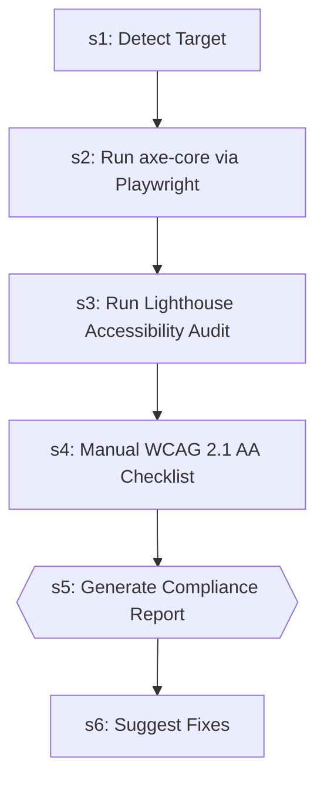

| Step | Title | Delegates To | Artifacts | Gates/Decisions |
|------|-------|-------------|-----------|----------------|
| 1 | Detect Target | — | — | — |
| 2 | Run axe-core via Playwright | — | — | — |
| 3 | Run Lighthouse Accessibility Audit | — | — | — |
| 4 | Manual WCAG 2.1 AA Checklist | — | — | — |
| 5 | Generate Compliance Report | — | — | gate |
| 6 | Suggest Fixes | — | — | decision |

### adr

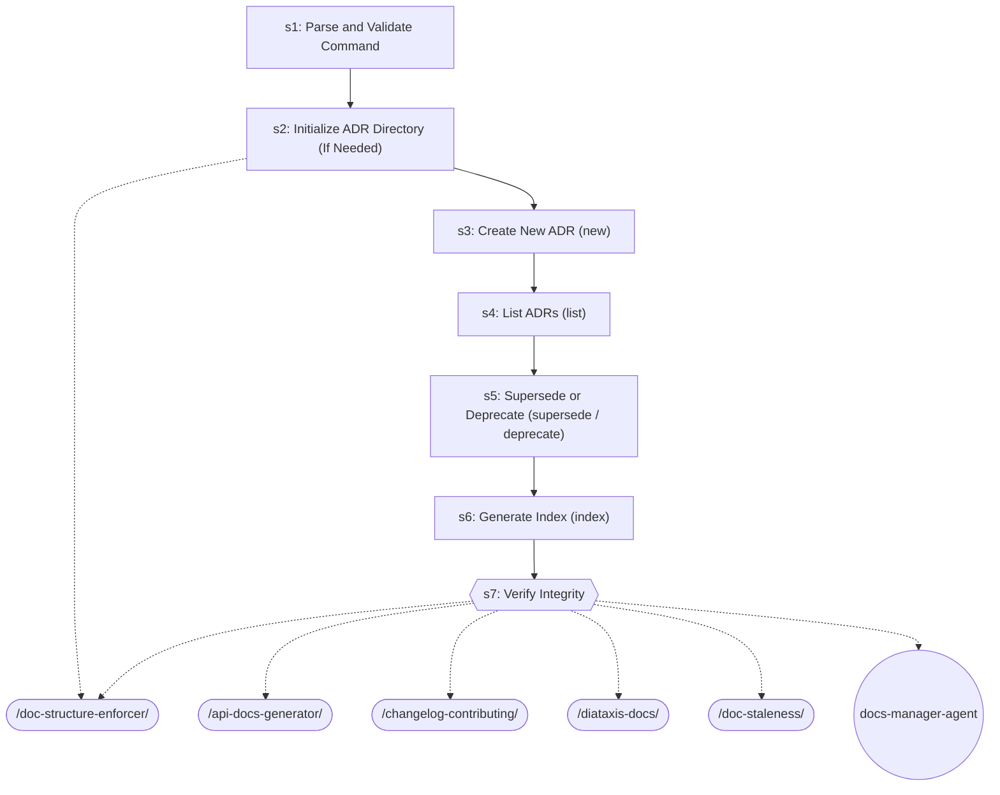

| Step | Title | Delegates To | Artifacts | Gates/Decisions |
|------|-------|-------------|-----------|----------------|
| 1 | Parse and Validate Command | — | — | decision |
| 2 | Initialize ADR Directory (If Needed) | `/doc-structure-enforcer` | — | decision |
| 3 | Create New ADR (new) | — | — | — |
| 4 | List ADRs (list) | — | — | — |
| 5 | Supersede or Deprecate (supersede / deprecate) | — | — | — |
| 6 | Generate Index (index) | — | — | — |
| 7 | Verify Integrity | `/api-docs-generator`, `/changelog-contributing`, `/diataxis-docs`, `/doc-staleness`, `/doc-structure-enforcer`, `docs-manager-agent` | — | gate |

### agent-evaluator

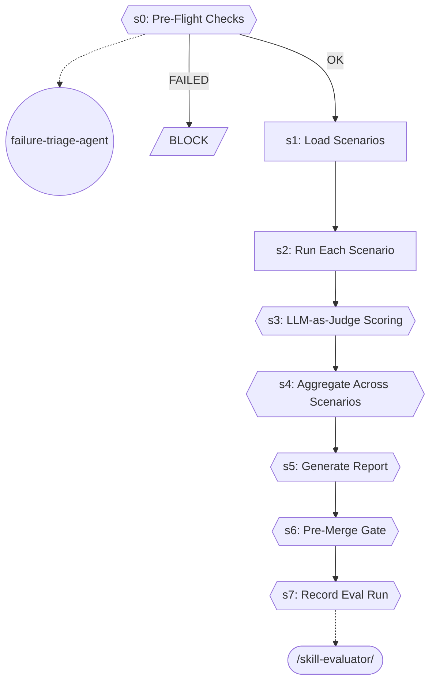

| Step | Title | Delegates To | Artifacts | Gates/Decisions |
|------|-------|-------------|-----------|----------------|
| 0 | Pre-Flight Checks | `failure-triage-agent` | — | gate, decision, BLOCK |
| 1 | Load Scenarios | — | — | decision |
| 2 | Run Each Scenario | — | — | — |
| 3 | LLM-as-Judge Scoring | — | — | gate |
| 4 | Aggregate Across Scenarios | — | — | gate, decision |
| 5 | Generate Report | — | — | gate |
| 6 | Pre-Merge Gate | — | — | gate, decision |
| 7 | Record Eval Run | `/skill-evaluator` | — | gate |

### analytics-setup

```mermaid
graph TD
    s1["s1: Detect the Stack and Injection Strategy"]
    s2["s2: Confirm the GA4 Property + Measurement ID"]
    s1 --> s2
    s3["s3: Inject the GTM Container (head + body)"]
    s2 --> s3
    s4{{s4: Wire Explicit CTA & Affiliate Events}}
    s3 --> s4
    s5{{s5: Configure Google Consent Mode v2 Defaults}}
    s4 --> s5
    s6{{s6: VERIFY a Real Hit (do NOT skip)}}
    s5 --> s6
    playwright_ext([/playwright/])
    s6 -.-> playwright_ext
    verify_screenshots_ext([/verify-screenshots/])
    s6 -.-> verify_screenshots_ext
    s7{{s7: Record in the Analytics Inventory}}
    s6 --> s7
```

| Step | Title | Delegates To | Artifacts | Gates/Decisions |
|------|-------|-------------|-----------|----------------|
| 1 | Detect the Stack and Injection Strategy | — | — | — |
| 2 | Confirm the GA4 Property + Measurement ID | — | — | decision |
| 3 | Inject the GTM Container (head + body) | — | — | — |
| 4 | Wire Explicit CTA & Affiliate Events | — | — | gate |
| 5 | Configure Google Consent Mode v2 Defaults | — | — | gate |
| 6 | VERIFY a Real Hit (do NOT skip) | `/playwright`, `/verify-screenshots` | — | gate, decision |
| 7 | Record in the Analytics Inventory | — | — | gate |

### android-run-tests

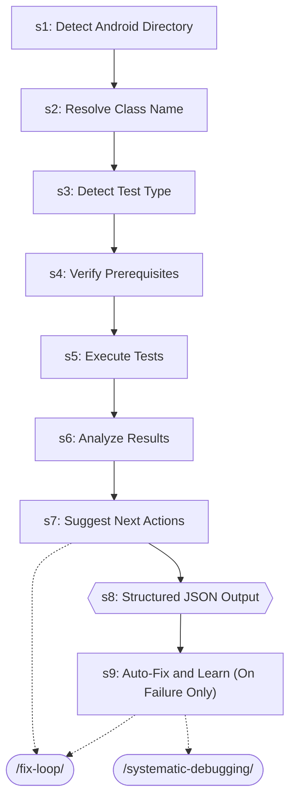

| Step | Title | Delegates To | Artifacts | Gates/Decisions |
|------|-------|-------------|-----------|----------------|
| 1 | Detect Android Directory | — | — | — |
| 2 | Resolve Class Name | — | — | — |
| 3 | Detect Test Type | — | — | — |
| 4 | Verify Prerequisites | — | — | — |
| 5 | Execute Tests | — | — | — |
| 6 | Analyze Results | — | — | — |
| 7 | Suggest Next Actions | `/fix-loop` | — | — |
| 8 | Structured JSON Output | — | → `test-results/android-run-tests.json` | gate, decision |
| 9 | Auto-Fix and Learn (On Failure Only) | `/fix-loop`, `/systematic-debugging` | — | decision |

### android-test-patterns

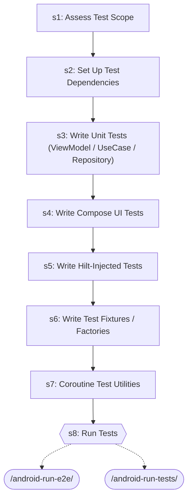

| Step | Title | Delegates To | Artifacts | Gates/Decisions |
|------|-------|-------------|-----------|----------------|
| 1 | Assess Test Scope | — | — | — |
| 2 | Set Up Test Dependencies | — | — | — |
| 3 | Write Unit Tests (ViewModel / UseCase / Repository) | — | — | — |
| 4 | Write Compose UI Tests | — | — | — |
| 5 | Write Hilt-Injected Tests | — | — | — |
| 6 | Write Test Fixtures / Factories | — | — | — |
| 7 | Coroutine Test Utilities | — | — | — |
| 8 | Run Tests | `/android-run-e2e`, `/android-run-tests` | — | gate |

### architecture-fitness

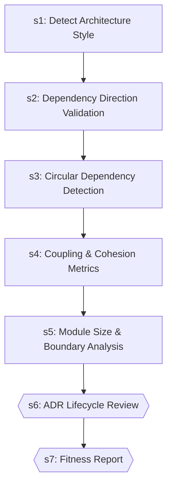

| Step | Title | Delegates To | Artifacts | Gates/Decisions |
|------|-------|-------------|-----------|----------------|
| 1 | Detect Architecture Style | — | — | — |
| 2 | Dependency Direction Validation | — | — | — |
| 3 | Circular Dependency Detection | — | — | — |
| 4 | Coupling & Cohesion Metrics | — | — | — |
| 5 | Module Size & Boundary Analysis | — | — | — |
| 6 | ADR Lifecycle Review | — | — | gate, decision |
| 7 | Fitness Report | — | — | gate, decision |

### auto-verify

```mermaid
graph TD
    s0{{s0: Gate Check — Read Upstream Results}}
    s0_block[/BLOCK/]
    s0 -->|FAILED| s0_block
    s1{{s1: Map Changes to Tests (via /regression-test)}}
    s0 -->|OK| s1
    development_loop_ext([/development-loop/])
    s1 -.-> development_loop_ext
    regression_test_ext([/regression-test/])
    s1 -.-> regression_test_ext
    tester_agent_ext((tester-agent))
    s1 -.-> tester_agent_ext
    s2{{s2: Execute Tests (via tester-agent)}}
    s1 --> s2
    tester_agent_ext((tester-agent))
    s2 -.-> tester_agent_ext
    s3{{s3: Evaluate Results}}
    s2 --> s3
    fix_loop_ext([/fix-loop/])
    s3 -.-> fix_loop_ext
    s4{{s4: Quality Gate (if tests pass)}}
    s3 --> s4
    code_quality_gate_ext([/code-quality-gate/])
    s4 -.-> code_quality_gate_ext
    s4A{{s4A: Contract Verification (if API changed)}}
    s4 --> s4A
    contract_test_ext([/contract-test/])
    s4A -.-> contract_test_ext
    s4B{{s4B: Performance Baseline (if perf-sensitive code changed)}}
    s4A --> s4B
    perf_test_ext([/perf-test/])
    s4B -.-> perf_test_ext
    s5{{s5: Report}}
    s4B --> s5
    s6{{s6: Structured Output}}
    s5 --> s6
    development_loop_ext([/development-loop/])
    s6 -.-> development_loop_ext
    fix_loop_ext([/fix-loop/])
    s6 -.-> fix_loop_ext
    regression_test_ext([/regression-test/])
    s6 -.-> regression_test_ext
    tester_agent_ext((tester-agent))
    s6 -.-> tester_agent_ext
```

| Step | Title | Delegates To | Artifacts | Gates/Decisions |
|------|-------|-------------|-----------|----------------|
| 0 | Gate Check — Read Upstream Results | — | → `test-results/fix-loop.json`, ← `test-results/fix-loop.json` | gate, decision, BLOCK, STEP 1 |
| 1 | Map Changes to Tests (via /regression-test) | `/development-loop`, `/regression-test`, `tester-agent` | → `test-results/regression-test.json`, ← `test-results/regression-test.json` | gate, decision |
| 2 | Execute Tests (via tester-agent) | `tester-agent` | → `test-evidence/{run_id}/manifest.json`, → `test-evidence/{run_id}/visual-review.json`, → `test-results/auto-verify.json` | gate, decision, STEP 3, STEP 2 |
| 3 | Evaluate Results | `/fix-loop` | — | gate, STEP 4 |
| 4 | Quality Gate (if tests pass) | `/code-quality-gate` | — | gate, decision |
| 4A | Contract Verification (if API changed) | `/contract-test` | — | gate, decision |
| 4B | Performance Baseline (if perf-sensitive code changed) | `/perf-test` | — | gate, decision |
| 5 | Report | — | — | gate |
| 6 | Structured Output | `/development-loop`, `/fix-loop`, `/regression-test`, `tester-agent` | → `test-results/auto-verify.json` | gate, decision |

### autonomous-contract

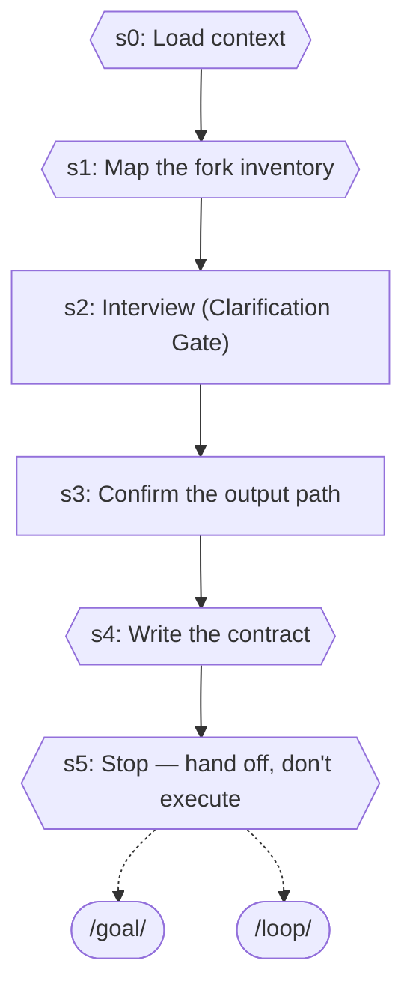

| Step | Title | Delegates To | Artifacts | Gates/Decisions |
|------|-------|-------------|-----------|----------------|
| 0 | Load context | — | — | gate |
| 1 | Map the fork inventory | — | — | gate |
| 2 | Interview (Clarification Gate) | — | — | — |
| 3 | Confirm the output path | — | — | — |
| 4 | Write the contract | — | — | gate, decision |
| 5 | Stop — hand off, don't execute | `/goal`, `/loop` | — | gate |

### brainstorm

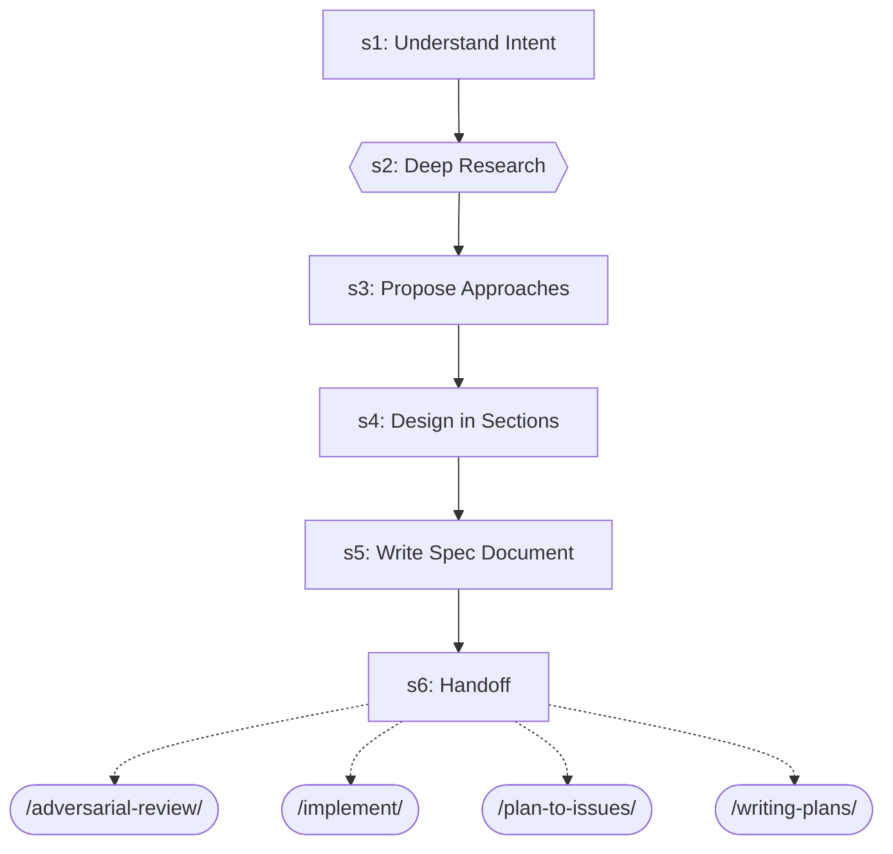

| Step | Title | Delegates To | Artifacts | Gates/Decisions |
|------|-------|-------------|-----------|----------------|
| 1 | Understand Intent | — | — | — |
| 2 | Deep Research | — | — | gate |
| 3 | Propose Approaches | — | — | — |
| 4 | Design in Sections | — | — | — |
| 5 | Write Spec Document | — | — | — |
| 6 | Handoff | `/adversarial-review`, `/implement`, `/plan-to-issues`, `/writing-plans` | — | — |

### branching

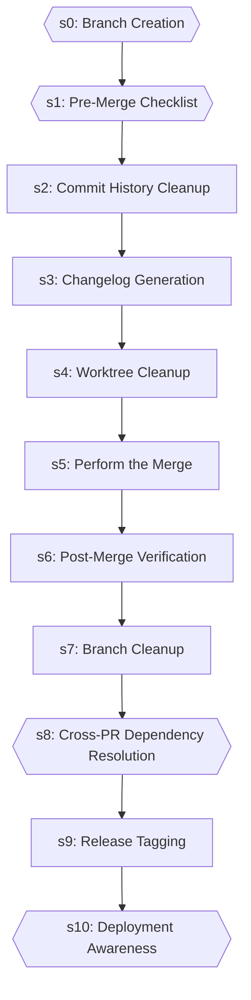

| Step | Title | Delegates To | Artifacts | Gates/Decisions |
|------|-------|-------------|-----------|----------------|
| 0 | Branch Creation | — | — | gate |
| 1 | Pre-Merge Checklist | — | — | gate, decision |
| 2 | Commit History Cleanup | — | — | — |
| 3 | Changelog Generation | — | — | — |
| 4 | Worktree Cleanup | — | — | — |
| 5 | Perform the Merge | — | — | — |
| 6 | Post-Merge Verification | — | — | — |
| 7 | Branch Cleanup | — | — | — |
| 8 | Cross-PR Dependency Resolution | — | — | gate |
| 9 | Release Tagging | — | — | — |
| 10 | Deployment Awareness | — | — | gate |

### change-risk-scoring

```mermaid
graph TD
    s1["s1: Identify Changed Files"]
    s2["s2: Compute Risk Factors"]
    s1 --> s2
    s3["s3: Calculate Composite Risk Score"]
    s2 --> s3
    s4["s4: Hotspot Analysis"]
    s3 --> s4
    s5["s5: Generate Risk Report"]
    s4 --> s5
    s6{{s6: JSON Output (Optional)}}
    s5 --> s6
```

| Step | Title | Delegates To | Artifacts | Gates/Decisions |
|------|-------|-------------|-----------|----------------|
| 1 | Identify Changed Files | — | — | — |
| 2 | Compute Risk Factors | — | — | decision |
| 3 | Calculate Composite Risk Score | — | — | — |
| 4 | Hotspot Analysis | — | — | — |
| 5 | Generate Risk Report | — | — | — |
| 6 | JSON Output (Optional) | — | — | gate, decision |

### chaos-resilience

```mermaid
graph TD
    s1["s1: Define Steady State"]
    s2["s2: Form Hypothesis"]
    s1 --> s2
    s3["s3: Inject Failure"]
    s2 --> s3
    s4["s4: Observe Behavior During Failure"]
    s3 --> s4
    s5["s5: Analyze Results"]
    s4 --> s5
    s6["s6: Document Findings"]
    s5 --> s6
    s7{{s7: Gameday Planning (Optional)}}
    s6 --> s7
```

| Step | Title | Delegates To | Artifacts | Gates/Decisions |
|------|-------|-------------|-----------|----------------|
| 1 | Define Steady State | — | — | — |
| 2 | Form Hypothesis | — | — | — |
| 3 | Inject Failure | — | — | — |
| 4 | Observe Behavior During Failure | — | — | — |
| 5 | Analyze Results | — | — | — |
| 6 | Document Findings | — | — | — |
| 7 | Gameday Planning (Optional) | — | — | gate, decision |

### ci-cd-setup

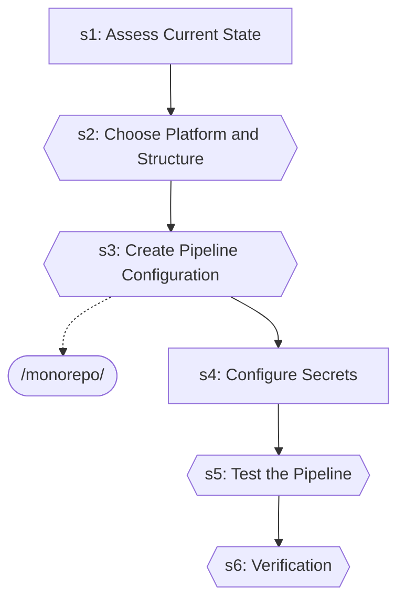

| Step | Title | Delegates To | Artifacts | Gates/Decisions |
|------|-------|-------------|-----------|----------------|
| 1 | Assess Current State | — | — | decision |
| 2 | Choose Platform and Structure | — | — | gate |
| 3 | Create Pipeline Configuration | `/monorepo` | — | gate |
| 4 | Configure Secrets | — | — | — |
| 5 | Test the Pipeline | — | — | gate |
| 6 | Verification | — | — | gate |

### code-quality-gate

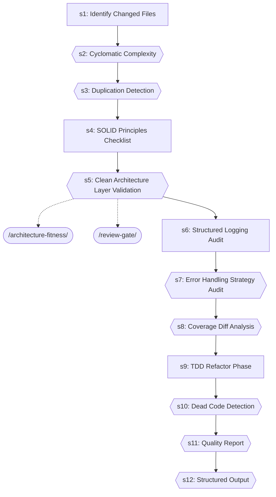

| Step | Title | Delegates To | Artifacts | Gates/Decisions |
|------|-------|-------------|-----------|----------------|
| 1 | Identify Changed Files | — | — | — |
| 2 | Cyclomatic Complexity | — | — | gate |
| 3 | Duplication Detection | — | — | gate |
| 4 | SOLID Principles Checklist | — | — | — |
| 5 | Clean Architecture Layer Validation | `/architecture-fitness`, `/review-gate` | — | gate |
| 6 | Structured Logging Audit | — | — | — |
| 7 | Error Handling Strategy Audit | — | — | gate |
| 8 | Coverage Diff Analysis | — | — | gate |
| 9 | TDD Refactor Phase | — | — | — |
| 10 | Dead Code Detection | — | — | gate |
| 11 | Quality Report | — | — | gate |
| 12 | Structured Output | — | → `test-results/code-quality-gate.json` | gate, decision |

### compose-ui

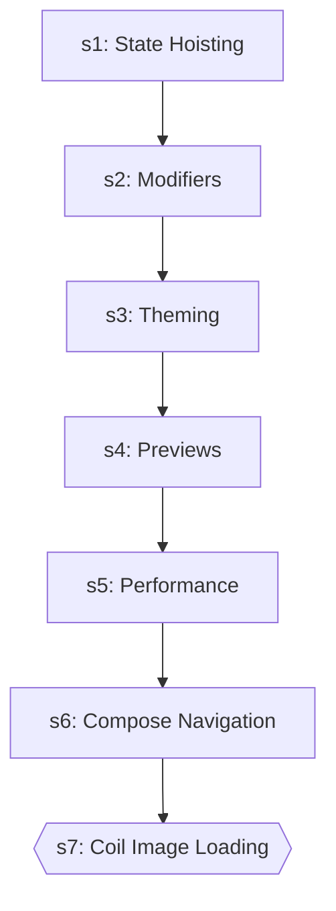

| Step | Title | Delegates To | Artifacts | Gates/Decisions |
|------|-------|-------------|-----------|----------------|
| 1 | State Hoisting | — | — | — |
| 2 | Modifiers | — | — | — |
| 3 | Theming | — | — | — |
| 4 | Previews | — | — | — |
| 5 | Performance | — | — | — |
| 6 | Compose Navigation | — | — | — |
| 7 | Coil Image Loading | — | — | gate |

### contract-test

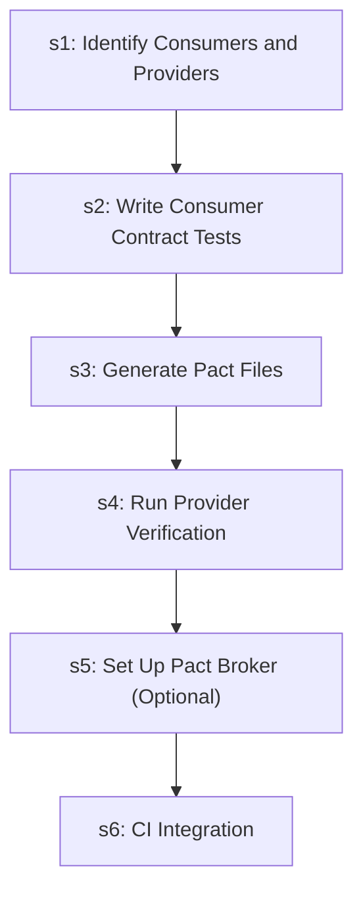

| Step | Title | Delegates To | Artifacts | Gates/Decisions |
|------|-------|-------------|-----------|----------------|
| 1 | Identify Consumers and Providers | — | — | — |
| 2 | Write Consumer Contract Tests | — | — | — |
| 3 | Generate Pact Files | — | — | — |
| 4 | Run Provider Verification | — | — | — |
| 5 | Set Up Pact Broker (Optional) | — | — | — |
| 6 | CI Integration | — | — | decision |

### coverage-analysis

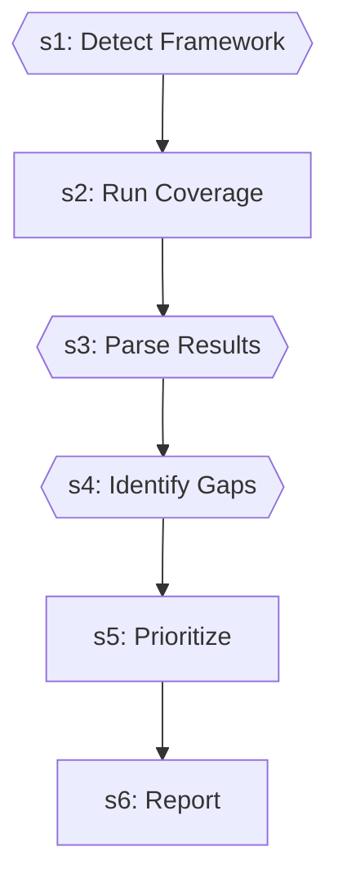

| Step | Title | Delegates To | Artifacts | Gates/Decisions |
|------|-------|-------------|-----------|----------------|
| 1 | Detect Framework | — | — | gate |
| 2 | Run Coverage | — | — | decision |
| 3 | Parse Results | — | — | gate |
| 4 | Identify Gaps | — | — | gate |
| 5 | Prioritize | — | — | — |
| 6 | Report | — | — | decision |

### create-github-issue

```mermaid
graph TD
    s0{{s0: Preflight (HARD FAIL)}}
    s1["s1: Parse Inputs"]
    s0 --> s1
    s2["s2: Compute Dedup Hash + Check for Existing Issue"]
    s1 --> s2
    s3["s3: Create New Issue"]
    s2 --> s3
    s4{{s4: Comment on Existing Issue (Dedup Hit)}}
    s3 --> s4
    test_pipeline_ext([/test-pipeline/])
    s4 -.-> test_pipeline_ext
    github_issue_manager_agent_ext((github-issue-manager-agent))
    s4 -.-> github_issue_manager_agent_ext
```

| Step | Title | Delegates To | Artifacts | Gates/Decisions |
|------|-------|-------------|-----------|----------------|
| 0 | Preflight (HARD FAIL) | — | — | gate |
| 1 | Parse Inputs | — | — | — |
| 2 | Compute Dedup Hash + Check for Existing Issue | — | — | decision, STEP 3 |
| 3 | Create New Issue | — | — | decision |
| 4 | Comment on Existing Issue (Dedup Hit) | `/test-pipeline`, `github-issue-manager-agent` | — | gate, decision |

### db-migrate

```mermaid
graph TD
    s1{{s1: Detect ORM / Migration Tool}}
    fastapi_db_migrate_ext([/fastapi-db-migrate/])
    s1 -.-> fastapi_db_migrate_ext
    s2["s2: Generate Migration"]
    s1 --> s2
    s3["s3: Verify UP + DOWN"]
    s2 --> s3
    s4["s4: Check Migration Status"]
    s3 --> s4
    s5["s5: Test Migration"]
    s4 --> s5
    s6{{s6: Document Migration}}
    s5 --> s6
    deploy_strategy_ext([/deploy-strategy/])
    s6 -.-> deploy_strategy_ext
    fastapi_db_migrate_ext([/fastapi-db-migrate/])
    s6 -.-> fastapi_db_migrate_ext
    schema_designer_ext([/schema-designer/])
    s6 -.-> schema_designer_ext
```

| Step | Title | Delegates To | Artifacts | Gates/Decisions |
|------|-------|-------------|-----------|----------------|
| 1 | Detect ORM / Migration Tool | `/fastapi-db-migrate` | — | gate |
| 2 | Generate Migration | — | — | decision |
| 3 | Verify UP + DOWN | — | — | decision |
| 4 | Check Migration Status | — | — | — |
| 5 | Test Migration | — | — | — |
| 6 | Document Migration | `/deploy-strategy`, `/fastapi-db-migrate`, `/schema-designer` | — | gate, decision |

### db-migrate-verify

```mermaid
graph TD
    s1["s1: Detect Migration Framework"]
    s2["s2: Pre-Migration State"]
    s1 --> s2
    s3["s3: Forward Migration"]
    s2 --> s3
    s4["s4: Schema Validation"]
    s3 --> s4
    s5["s5: Seed Data Test (if --seed-data)"]
    s4 --> s5
    s6["s6: Rollback Verification (if --rollback or always)"]
    s5 --> s6
    s7{{s7: Dangerous Operation Detection}}
    s6 --> s7
    s7A["s7A: Real Database Testing (Testcontainers + Respawn)"]
    s7 --> s7A
    s8["s8: Report"]
    s7A --> s8
```

| Step | Title | Delegates To | Artifacts | Gates/Decisions |
|------|-------|-------------|-----------|----------------|
| 1 | Detect Migration Framework | — | — | — |
| 2 | Pre-Migration State | — | — | — |
| 3 | Forward Migration | — | — | — |
| 4 | Schema Validation | — | — | — |
| 5 | Seed Data Test (if --seed-data) | — | — | — |
| 6 | Rollback Verification (if --rollback or always) | — | — | — |
| 7 | Dangerous Operation Detection | — | — | gate, decision |
| 7A | Real Database Testing (Testcontainers + Respawn) | — | — | — |
| 8 | Report | — | — | decision |

### debugging-loop

```mermaid
graph TD
    s1{{s1: INIT}}
    systematic_debugging_ext([/systematic-debugging/])
    s1 -.-> systematic_debugging_ext
    update_practices_ext([/update-practices/])
    s1 -.-> update_practices_ext
    debugger_agent_ext((debugger-agent))
    s1 -.-> debugger_agent_ext
    test_failure_analyzer_agent_ext((test-failure-analyzer-agent))
    s1 -.-> test_failure_analyzer_agent_ext
    s1_block[/BLOCK/]
    s1 -->|FAILED| s1_block
    s2{{s2: DIAGNOSE}}
    s1 -->|OK| s2
    systematic_debugging_ext([/systematic-debugging/])
    s2 -.-> systematic_debugging_ext
    s3{{s3: FIX}}
    s2 --> s3
    autofix_pr_ext([/autofix-pr/])
    s3 -.-> autofix_pr_ext
    fix_loop_ext([/fix-loop/])
    s3 -.-> fix_loop_ext
    s4{{s4: VERIFY}}
    s3 --> s4
    fix_loop_ext([/fix-loop/])
    s4 -.-> fix_loop_ext
    test_pipeline_ext([/test-pipeline/])
    s4 -.-> test_pipeline_ext
    s5{{s5: LEARN (mandatory)}}
    s4 --> s5
    learn_n_improve_ext([/learn-n-improve/])
    s5 -.-> learn_n_improve_ext
    s6{{s6: REPORT}}
    s5 --> s6
    debugger_agent_ext((debugger-agent))
    s6 -.-> debugger_agent_ext
    debugging_loop_master_agent_ext((debugging-loop-master-agent))
    s6 -.-> debugging_loop_master_agent_ext
```

| Step | Title | Delegates To | Artifacts | Gates/Decisions |
|------|-------|-------------|-----------|----------------|
| 1 | INIT | `/systematic-debugging`, `/update-practices`, `debugger-agent`, `test-failure-analyzer-agent` | — | gate, decision, BLOCK |
| 2 | DIAGNOSE | `/systematic-debugging` | — | gate, decision |
| 3 | FIX | `/autofix-pr`, `/fix-loop` | → `test-results/fix-loop.json` | gate, decision |
| 4 | VERIFY | `/fix-loop`, `/test-pipeline` | → `test-results/auto-verify.json`, ← `test-results/auto-verify.json` | gate, decision |
| 5 | LEARN (mandatory) | `/learn-n-improve` | — | gate |
| 6 | REPORT | `debugger-agent`, `debugging-loop-master-agent` | → `test-results/debugging-loop-verdict.json` | gate, decision |

### deploy-strategy

```mermaid
graph TD
    s1["s1: Assess Current State"]
    s2["s2: GitOps Setup"]
    s1 --> s2
    s3["s3: Progressive Delivery"]
    s2 --> s3
    s4["s4: Zero-Downtime Database Migrations"]
    s3 --> s4
    s5["s5: Production Readiness Review (PRR)"]
    s4 --> s5
    s6["s6: Deployment Runbook"]
    s5 --> s6
    s7["s7: Secret Rotation Strategy"]
    s6 --> s7
    s8["s8: CDN & Edge Caching Strategy"]
    s7 --> s8
    s9["s9: Mobile App Deployment"]
    s8 --> s9
```

| Step | Title | Delegates To | Artifacts | Gates/Decisions |
|------|-------|-------------|-----------|----------------|
| 1 | Assess Current State | — | — | — |
| 2 | GitOps Setup | — | — | — |
| 3 | Progressive Delivery | — | — | — |
| 4 | Zero-Downtime Database Migrations | — | — | — |
| 5 | Production Readiness Review (PRR) | — | — | — |
| 6 | Deployment Runbook | — | — | — |
| 7 | Secret Rotation Strategy | — | — | — |
| 8 | CDN & Edge Caching Strategy | — | — | — |
| 9 | Mobile App Deployment | — | — | — |

### development-loop

```mermaid
graph TD
    s1{{s1: INIT}}
    plan_executor_agent_ext((plan-executor-agent))
    s1 -.-> plan_executor_agent_ext
    planner_researcher_agent_ext((planner-researcher-agent))
    s1 -.-> planner_researcher_agent_ext
    s1_block[/BLOCK/]
    s1 -->|FAILED| s1_block
    s2{{s2: IDEATE (skip if complexity=Simple or Medium)}}
    s1 -->|OK| s2
    brainstorm_ext([/brainstorm/])
    s2 -.-> brainstorm_ext
    s3["s3: PLAN (skip if complexity=Simple)"]
    s2 --> s3
    writing_plans_ext([/writing-plans/])
    s3 -.-> writing_plans_ext
    s4{{s4: EXECUTE}}
    s3 --> s4
    s5{{s5: VERIFY}}
    s4 --> s5
    auto_verify_ext([/auto-verify/])
    s5 -.-> auto_verify_ext
    test_pipeline_ext([/test-pipeline/])
    s5 -.-> test_pipeline_ext
    s6{{s6: COMMIT}}
    s5 --> s6
    post_fix_pipeline_ext([/post-fix-pipeline/])
    s6 -.-> post_fix_pipeline_ext
    s7{{s7: REPORT}}
    s6 --> s7
    development_loop_master_agent_ext((development-loop-master-agent))
    s7 -.-> development_loop_master_agent_ext
```

| Step | Title | Delegates To | Artifacts | Gates/Decisions |
|------|-------|-------------|-----------|----------------|
| 1 | INIT | `plan-executor-agent`, `planner-researcher-agent` | → `test-results/development-loop-verdict.json` | gate, decision, BLOCK |
| 2 | IDEATE (skip if complexity=Simple or Medium) | `/brainstorm` | — | gate |
| 3 | PLAN (skip if complexity=Simple) | `/writing-plans` | — | — |
| 4 | EXECUTE | — | — | gate, decision |
| 5 | VERIFY | `/auto-verify`, `/test-pipeline` | → `test-results/auto-verify.json`, ← `test-results/auto-verify.json` | gate, decision |
| 6 | COMMIT | `/post-fix-pipeline` | — | gate, decision |
| 7 | REPORT | `development-loop-master-agent` | → `test-results/auto-verify.json`, → `test-results/development-loop-verdict.json` | gate, decision |

### disaster-recovery

```mermaid
graph TD
    s1{{s1: Extract RTO/RPO Targets from NFRs}}
    s2["s2: Inventory Critical Services"]
    s1 --> s2
    s3["s3: Define Backup Strategy"]
    s2 --> s3
    s4["s4: Create Restore Procedure"]
    s3 --> s4
    s5["s5: Design Failover Architecture (If Multi-Region)"]
    s4 --> s5
    s6["s6: Create DR Runbook"]
    s5 --> s6
    s7["s7: Schedule DR Drill"]
    s6 --> s7
    s7A["s7A: Backup Encryption & Key Management"]
    s7 --> s7A
    s7B{{s7B: Restore Verification Testing}}
    s7A --> s7B
```

| Step | Title | Delegates To | Artifacts | Gates/Decisions |
|------|-------|-------------|-----------|----------------|
| 1 | Extract RTO/RPO Targets from NFRs | — | — | gate |
| 2 | Inventory Critical Services | — | — | — |
| 3 | Define Backup Strategy | — | — | — |
| 4 | Create Restore Procedure | — | — | — |
| 5 | Design Failover Architecture (If Multi-Region) | — | — | — |
| 6 | Create DR Runbook | — | — | — |
| 7 | Schedule DR Drill | — | — | — |
| 7A | Backup Encryption & Key Management | — | — | — |
| 7B | Restore Verification Testing | — | — | gate |

### e2e-visual-run

```mermaid
graph TD
    s1{{s1: INIT}}
    test_pipeline_ext([/test-pipeline/])
    s1 -.-> test_pipeline_ext
    update_practices_ext([/update-practices/])
    s1 -.-> update_practices_ext
    test_healer_agent_ext((test-healer-agent))
    s1 -.-> test_healer_agent_ext
    test_scout_agent_ext((test-scout-agent))
    s1 -.-> test_scout_agent_ext
    tester_agent_ext((tester-agent))
    s1 -.-> tester_agent_ext
    visual_inspector_agent_ext((visual-inspector-agent))
    s1 -.-> visual_inspector_agent_ext
    s1_block[/BLOCK/]
    s1 -->|FAILED| s1_block
    s2{{s2: SCOUT (E2E-specific classification)}}
    s1 -->|OK| s2
    s3{{s3: Drain test_queue — Capture Runs}}
    s2 --> s3
    s4{{s4: Drain verify_queue — Dual-Signal Visual Verdict}}
    s3 --> s4
    s5{{s5: Drain fix_queue — Confidence-Gated Auto-Heal}}
    s4 --> s5
    s6["s6: (reserved — intentionally not numbered in prior versions)"]
    s5 --> s6
    s7["s7: First-Run Artifact Detection"]
    s6 --> s7
    s8{{s8: Report}}
    s7 --> s8
    e2e_conductor_agent_ext((e2e-conductor-agent))
    s8 -.-> e2e_conductor_agent_ext
```

| Step | Title | Delegates To | Artifacts | Gates/Decisions |
|------|-------|-------------|-----------|----------------|
| 1 | INIT | `/test-pipeline`, `/update-practices`, `test-healer-agent`, `test-scout-agent`, `tester-agent`, `visual-inspector-agent` | → `test-results/e2e-pipeline*.json` | gate, decision, BLOCK |
| 2 | SCOUT (E2E-specific classification) | — | — | gate, decision |
| 3 | Drain test_queue — Capture Runs | — | → `test-results/e2e-pipeline.json` | gate |
| 4 | Drain verify_queue — Dual-Signal Visual Verdict | — | — | gate, decision, STEP 8 |
| 5 | Drain fix_queue — Confidence-Gated Auto-Heal | — | — | gate |
| 6 | (reserved — intentionally not numbered in prior versions) | — | — | — |
| 7 | First-Run Artifact Detection | — | — | — |
| 8 | Report | `e2e-conductor-agent` | → `test-results/e2e-pipeline.json` | gate, decision |

### escalation-report

```mermaid
graph TD
    s0["s0: Read inputs"]
    s1["s1: Categorize Issues"]
    s0 --> s1
    s2["s2: Generate Markdown report"]
    s1 --> s2
    s3["s3: Optional notifications + reviewer auto-assign (REQ-C002, REQ-C004)"]
    s2 --> s3
    s4{{s4: Return contract}}
    s3 --> s4
```

| Step | Title | Delegates To | Artifacts | Gates/Decisions |
|------|-------|-------------|-----------|----------------|
| 0 | Read inputs | — | — | — |
| 1 | Categorize Issues | — | — | — |
| 2 | Generate Markdown report | — | — | decision |
| 3 | Optional notifications + reviewer auto-assign (REQ-C002, REQ-C004) | — | — | — |
| 4 | Return contract | — | — | gate |

### executing-plans

```mermaid
graph TD
    s1{{s1: Load and Validate the Plan}}
    s2["s2: Pre-Execution Setup"]
    s1 --> s2
    s3["s3: Execute Tasks"]
    s2 --> s3
    s4{{s4: Handle Failures}}
    s3 --> s4
    fix_loop_ext([/fix-loop/])
    s4 -.-> fix_loop_ext
    s5["s5: Resume Support"]
    s4 --> s5
    continue_ext([/continue/])
    s5 -.-> continue_ext
    s6["s6: Completion Summary"]
    s5 --> s6
    s7["s7: Edge Cases and Special Handling"]
    s6 --> s7
```

| Step | Title | Delegates To | Artifacts | Gates/Decisions |
|------|-------|-------------|-----------|----------------|
| 1 | Load and Validate the Plan | — | — | gate, decision |
| 2 | Pre-Execution Setup | — | — | — |
| 3 | Execute Tasks | — | — | — |
| 4 | Handle Failures | `/fix-loop` | — | gate, decision |
| 5 | Resume Support | `/continue` | — | decision |
| 6 | Completion Summary | — | — | — |
| 7 | Edge Cases and Special Handling | — | — | decision |

### fastapi-db-migrate

```mermaid
graph TD
    s1["s1: New Model Mode"]
    s2["s2: Check Mode"]
    s1 --> s2
    s3["s3: Status Mode"]
    s2 --> s3
    db_migrate_verify_ext([/db-migrate-verify/])
    s3 -.-> db_migrate_verify_ext
```

| Step | Title | Delegates To | Artifacts | Gates/Decisions |
|------|-------|-------------|-----------|----------------|
| 1 | New Model Mode | — | — | — |
| 2 | Check Mode | — | — | — |
| 3 | Status Mode | `/db-migrate-verify` | — | — |

### fastapi-run-backend-tests

```mermaid
graph TD
    s1["s1: Detect Backend Directory"]
    s2["s2: Resolve Test Path"]
    s1 --> s2
    s3["s3: Run Tests"]
    s2 --> s3
    s4["s4: Analyze Results"]
    s3 --> s4
    s5["s5: Suggest Next Actions"]
    s4 --> s5
    fix_loop_ext([/fix-loop/])
    s5 -.-> fix_loop_ext
    tdd_failing_test_generator_ext([/tdd-failing-test-generator/])
    s5 -.-> tdd_failing_test_generator_ext
    s6{{s6: Structured JSON Output}}
    s5 --> s6
    s7["s7: Auto-Fix and Learn (On Failure Only)"]
    s6 --> s7
    fix_loop_ext([/fix-loop/])
    s7 -.-> fix_loop_ext
    learn_n_improve_ext([/learn-n-improve/])
    s7 -.-> learn_n_improve_ext
    systematic_debugging_ext([/systematic-debugging/])
    s7 -.-> systematic_debugging_ext
```

| Step | Title | Delegates To | Artifacts | Gates/Decisions |
|------|-------|-------------|-----------|----------------|
| 1 | Detect Backend Directory | — | — | — |
| 2 | Resolve Test Path | — | — | — |
| 3 | Run Tests | — | — | — |
| 4 | Analyze Results | — | — | — |
| 5 | Suggest Next Actions | `/fix-loop`, `/tdd-failing-test-generator` | — | — |
| 6 | Structured JSON Output | — | → `test-results/fastapi-run-backend-tests.json` | gate, decision |
| 7 | Auto-Fix and Learn (On Failure Only) | `/fix-loop`, `/learn-n-improve`, `/systematic-debugging` | — | decision |

### fix-github-issue

```mermaid
graph TD
    s1["s1: Fetch and Parse Issue"]
    s2["s2: Explore and Diagnose"]
    s1 --> s2
    s3{{s3: Implement and Test}}
    s2 --> s3
    s4["s4: Finalize"]
    s3 --> s4
    fix_loop_ext([/fix-loop/])
    s4 -.-> fix_loop_ext
    post_fix_pipeline_ext([/post-fix-pipeline/])
    s4 -.-> post_fix_pipeline_ext
    serialize_fixes_ext([/serialize-fixes/])
    s4 -.-> serialize_fixes_ext
    test_pipeline_ext([/test-pipeline/])
    s4 -.-> test_pipeline_ext
    s5["s5: Summarize"]
    s4 --> s5
```

| Step | Title | Delegates To | Artifacts | Gates/Decisions |
|------|-------|-------------|-----------|----------------|
| 1 | Fetch and Parse Issue | — | — | — |
| 2 | Explore and Diagnose | — | — | — |
| 3 | Implement and Test | — | — | gate, decision |
| 4 | Finalize | `/fix-loop`, `/post-fix-pipeline`, `/serialize-fixes`, `/test-pipeline` | — | — |
| 5 | Summarize | — | — | decision |

### fix-loop

```mermaid
graph TD
    s1{{s1: Analyze Failure (via test-failure-analyzer-agent)}}
    test_failure_analyzer_agent_ext((test-failure-analyzer-agent))
    s1 -.-> test_failure_analyzer_agent_ext
    s1A["s1A: Flaky Test Detection"]
    s1 --> s1A
    s2["s2: Apply Fix"]
    s1A --> s2
    s3["s3: Retest (Full Loop mode only)"]
    s2 --> s3
    s4["s4: Report"]
    s3 --> s4
    s5{{s5: Structured Output}}
    s4 --> s5
```

| Step | Title | Delegates To | Artifacts | Gates/Decisions |
|------|-------|-------------|-----------|----------------|
| 1 | Analyze Failure (via test-failure-analyzer-agent) | `test-failure-analyzer-agent` | — | gate, decision |
| 1A | Flaky Test Detection | — | — | decision |
| 2 | Apply Fix | — | — | — |
| 3 | Retest (Full Loop mode only) | — | — | decision |
| 4 | Report | — | — | — |
| 5 | Structured Output | — | → `test-results/fix-loop.json` | gate, decision |

### flutter-e2e-test

```mermaid
graph TD
    s1["s1: Project Setup"]
    s2["s2: Writing E2E Tests"]
    s1 --> s2
    s3["s3: Test Patterns"]
    s2 --> s3
    s4["s4: Visual Regression Testing"]
    s3 --> s4
    s5["s5: Monkey / Fuzz Testing"]
    s4 --> s5
    s6["s6: Platform-Specific Execution"]
    s5 --> s6
    s7["s7: CI/CD Integration"]
    s6 --> s7
    s8{{s8: Structured JSON Output}}
    s7 --> s8
    s9["s9: Auto-Fix and Learn (On Failure Only)"]
    s8 --> s9
    fix_loop_ext([/fix-loop/])
    s9 -.-> fix_loop_ext
    systematic_debugging_ext([/systematic-debugging/])
    s9 -.-> systematic_debugging_ext
```

| Step | Title | Delegates To | Artifacts | Gates/Decisions |
|------|-------|-------------|-----------|----------------|
| 1 | Project Setup | — | — | — |
| 2 | Writing E2E Tests | — | — | — |
| 3 | Test Patterns | — | — | — |
| 4 | Visual Regression Testing | — | — | decision |
| 5 | Monkey / Fuzz Testing | — | — | — |
| 6 | Platform-Specific Execution | — | — | — |
| 7 | CI/CD Integration | — | — | — |
| 8 | Structured JSON Output | — | → `test-results/flutter-e2e-test.json` | gate, decision |
| 9 | Auto-Fix and Learn (On Failure Only) | `/fix-loop`, `/systematic-debugging` | — | decision |

### handover

```mermaid
graph TD
    s1["s1: Detect Handover Context"]
    s2["s2: Review the Session"]
    s1 --> s2
    s3["s3: Build the Decision Log"]
    s2 --> s3
    s4["s4: Document Pitfalls"]
    s3 --> s4
    s5["s5: Capture Current State Snapshot"]
    s4 --> s5
    s6["s6: Build Next Steps Queue"]
    s5 --> s6
    s7["s7: Integrate External Sources"]
    s6 --> s7
    s8{{s8: Generate the Handover Document}}
    s7 --> s8
    s9{{s9: Land the Plane}}
    s8 --> s9
    s10["s10: Handover Consumption (New Session Start)"]
    s9 --> s10
    s11["s11: Diff from Previous Handover"]
    s10 --> s11
```

| Step | Title | Delegates To | Artifacts | Gates/Decisions |
|------|-------|-------------|-----------|----------------|
| 1 | Detect Handover Context | — | — | decision |
| 2 | Review the Session | — | — | — |
| 3 | Build the Decision Log | — | — | — |
| 4 | Document Pitfalls | — | — | — |
| 5 | Capture Current State Snapshot | — | — | — |
| 6 | Build Next Steps Queue | — | — | — |
| 7 | Integrate External Sources | — | — | — |
| 8 | Generate the Handover Document | — | — | gate, decision |
| 9 | Land the Plane | — | — | gate, decision |
| 10 | Handover Consumption (New Session Start) | — | — | decision |
| 11 | Diff from Previous Handover | — | — | decision |

### implement

```mermaid
graph TD
    s1["s1: Analyze Requirements"]
    writing_plans_ext([/writing-plans/])
    s1 -.-> writing_plans_ext
    s2["s2: Create/Update Tests"]
    s1 --> s2
    s3["s3: Implement the Feature"]
    s2 --> s3
    s4["s4: Run Tests"]
    s3 --> s4
    s5{{s5: Fix Loop (if tests fail)}}
    s4 --> s5
    fix_loop_ext([/fix-loop/])
    s5 -.-> fix_loop_ext
    s6{{s6: Verification (Mandatory Gate)}}
    s5 --> s6
    post_fix_pipeline_ext([/post-fix-pipeline/])
    s6 -.-> post_fix_pipeline_ext
    s7["s7: Post-Implementation (Optional)"]
    s6 --> s7
    executing_plans_ext([/executing-plans/])
    s7 -.-> executing_plans_ext
    s8{{s8: Structured Output}}
    s7 --> s8
    fix_loop_ext([/fix-loop/])
    s8 -.-> fix_loop_ext
```

| Step | Title | Delegates To | Artifacts | Gates/Decisions |
|------|-------|-------------|-----------|----------------|
| 1 | Analyze Requirements | `/writing-plans` | — | — |
| 2 | Create/Update Tests | — | — | — |
| 3 | Implement the Feature | — | — | — |
| 4 | Run Tests | — | — | decision |
| 5 | Fix Loop (if tests fail) | `/fix-loop` | — | gate |
| 6 | Verification (Mandatory Gate) | `/post-fix-pipeline` | — | gate, decision |
| 7 | Post-Implementation (Optional) | `/executing-plans` | — | — |
| 8 | Structured Output | `/fix-loop` | → `test-results/implement.json` | gate, decision |

### improve-codebase-architecture

```mermaid
graph TD
    s1["s1: Explore"]
    grill_with_docs_ext([/grill-with-docs/])
    s1 -.-> grill_with_docs_ext
    s2["s2: Present Candidates as an HTML Report"]
    s1 --> s2
    tmp_ext([/tmp/])
    s2 -.-> tmp_ext
    s3["s3: Grilling Loop"]
    s2 --> s3
    adr_ext([/adr/])
    s3 -.-> adr_ext
    grill_me_ext([/grill-me/])
    s3 -.-> grill_me_ext
    grill_with_docs_ext([/grill-with-docs/])
    s3 -.-> grill_with_docs_ext
```

| Step | Title | Delegates To | Artifacts | Gates/Decisions |
|------|-------|-------------|-----------|----------------|
| 1 | Explore | `/grill-with-docs` | — | decision |
| 2 | Present Candidates as an HTML Report | `/tmp` | — | decision |
| 3 | Grilling Loop | `/adr`, `/grill-me`, `/grill-with-docs` | — | decision |

### learn-n-improve

```mermaid
graph TD
    s1{{s1: Gather Session Evidence}}
    s2["s2: Analyze Outcomes"]
    s1 --> s2
    s3{{s3: Build Error→Fix→Lesson Database}}
    s2 --> s3
    s4["s4: Update Memory Topics"]
    s3 --> s4
    s5{{s5: Pattern Detection (every 10th learning)}}
    s4 --> s5
    s6["s6: Report"]
    s5 --> s6
```

| Step | Title | Delegates To | Artifacts | Gates/Decisions |
|------|-------|-------------|-----------|----------------|
| 1 | Gather Session Evidence | — | → `test-results/*.json` | gate, decision |
| 2 | Analyze Outcomes | — | — | — |
| 3 | Build Error→Fix→Lesson Database | — | — | gate, decision |
| 4 | Update Memory Topics | — | — | — |
| 5 | Pattern Detection (every 10th learning) | — | — | gate |
| 6 | Report | — | — | — |

### merge-strategy

```mermaid
graph TD
    s1["s1: Detect Branch Type"]
    s2["s2: Recommend Merge Strategy"]
    s1 --> s2
    s3{{s3: Pre-Merge Checklist}}
    s2 --> s3
    s4["s4: Execute Merge"]
    s3 --> s4
    s5["s5: Post-Merge Smoke Tests"]
    s4 --> s5
    s6["s6: Branch Cleanup"]
    s5 --> s6
```

| Step | Title | Delegates To | Artifacts | Gates/Decisions |
|------|-------|-------------|-----------|----------------|
| 1 | Detect Branch Type | — | — | — |
| 2 | Recommend Merge Strategy | — | — | decision |
| 3 | Pre-Merge Checklist | — | — | gate, decision |
| 4 | Execute Merge | — | — | — |
| 5 | Post-Merge Smoke Tests | — | — | decision |
| 6 | Branch Cleanup | — | — | — |

### nextjs-dev

```mermaid
graph TD
    s1["s1: Project Setup"]
    s2["s2: Routing & Layouts"]
    s1 --> s2
    s3["s3: Server vs Client Components"]
    s2 --> s3
    s4["s4: Data Fetching & Caching"]
    s3 --> s4
    s5["s5: Middleware & Security"]
    s4 --> s5
    s6["s6: SEO & Metadata"]
    s5 --> s6
    s7["s7: UI Patterns"]
    s6 --> s7
    s8["s8: Testing"]
    s7 --> s8
    playwright_ext([/playwright/])
    s8 -.-> playwright_ext
    vitest_dev_ext([/vitest-dev/])
    s8 -.-> vitest_dev_ext
```

| Step | Title | Delegates To | Artifacts | Gates/Decisions |
|------|-------|-------------|-----------|----------------|
| 1 | Project Setup | — | — | — |
| 2 | Routing & Layouts | — | — | — |
| 3 | Server vs Client Components | — | — | — |
| 4 | Data Fetching & Caching | — | — | — |
| 5 | Middleware & Security | — | — | — |
| 6 | SEO & Metadata | — | — | — |
| 7 | UI Patterns | — | — | — |
| 8 | Testing | `/playwright`, `/vitest-dev` | — | — |

### perf-test

```mermaid
graph TD
    s1["s1: Extract NFR Thresholds from PRD"]
    s2["s2: Write k6 Scripts"]
    s1 --> s2
    s3["s3: Run k6 Load Tests"]
    s2 --> s3
    s4["s4: Run Lighthouse Audit"]
    s3 --> s4
    s5["s5: Analyze Bundle Size"]
    s4 --> s5
    s6["s6: Compare Against Baseline"]
    s5 --> s6
    s7["s7: CI Integration"]
    s6 --> s7
    s8{{s8: Structured Output}}
    s7 --> s8
```

| Step | Title | Delegates To | Artifacts | Gates/Decisions |
|------|-------|-------------|-----------|----------------|
| 1 | Extract NFR Thresholds from PRD | — | — | decision |
| 2 | Write k6 Scripts | — | — | — |
| 3 | Run k6 Load Tests | — | — | — |
| 4 | Run Lighthouse Audit | — | — | — |
| 5 | Analyze Bundle Size | — | — | — |
| 6 | Compare Against Baseline | — | — | — |
| 7 | CI Integration | — | — | — |
| 8 | Structured Output | — | → `test-results/perf-test.json` | gate |

### pipeline-fix-pr

```mermaid
graph TD
    s0{{s0: Preflight}}
    create_github_issue_ext([/create-github-issue/])
    s0 -.-> create_github_issue_ext
    s1{{s1: Parse arguments + capture context}}
    s0 --> s1
    s2["s2: Create fix branch"]
    s1 --> s2
    s3["s3: Apply diffs (delegate to /serialize-fixes)"]
    s2 --> s3
    serialize_fixes_ext([/serialize-fixes/])
    s3 -.-> serialize_fixes_ext
    s4["s4: Push branch + open PR (skipped if --no-push)"]
    s3 --> s4
    s5{{s5: Return to original branch + return contract}}
    s4 --> s5
    serialize_fixes_ext([/serialize-fixes/])
    s5 -.-> serialize_fixes_ext
```

| Step | Title | Delegates To | Artifacts | Gates/Decisions |
|------|-------|-------------|-----------|----------------|
| 0 | Preflight | `/create-github-issue` | — | gate |
| 1 | Parse arguments + capture context | — | — | gate |
| 2 | Create fix branch | — | — | — |
| 3 | Apply diffs (delegate to /serialize-fixes) | `/serialize-fixes` | — | — |
| 4 | Push branch + open PR (skipped if --no-push) | — | — | — |
| 5 | Return to original branch + return contract | `/serialize-fixes` | — | gate |

### pipeline-orchestrator

```mermaid
graph TD
    s1{{s1: Dispatch Pipeline Orchestrator Agent}}
    s2{{s2: Report Results}}
    s1 --> s2
    project_manager_agent_ext((project-manager-agent))
    s2 -.-> project_manager_agent_ext
```

| Step | Title | Delegates To | Artifacts | Gates/Decisions |
|------|-------|-------------|-----------|----------------|
| 1 | Dispatch Pipeline Orchestrator Agent | — | — | gate |
| 2 | Report Results | `project-manager-agent` | — | gate, decision |

### plan-to-issues

```mermaid
graph TD
    s1["s1: Parse Plan"]
    s2["s2: Check for Duplicates"]
    s1 --> s2
    s3["s3: Organize into Epics (if applicable)"]
    s2 --> s3
    s4["s4: Create Task Issues"]
    s3 --> s4
    s5["s5: Report"]
    s4 --> s5
```

| Step | Title | Delegates To | Artifacts | Gates/Decisions |
|------|-------|-------------|-----------|----------------|
| 1 | Parse Plan | — | — | — |
| 2 | Check for Duplicates | — | — | — |
| 3 | Organize into Epics (if applicable) | — | — | — |
| 4 | Create Task Issues | — | — | — |
| 5 | Report | — | — | — |

### playwright

```mermaid
graph TD
    s1["s1: Project Setup & Configuration"]
    s2["s2: Browser Automation Fundamentals"]
    s1 --> s2
    s3["s3: E2E Test Generation from User Flows"]
    s2 --> s3
    s4["s4: Page Object Model (POM)"]
    s3 --> s4
    s5["s5: API + UI Combined Testing"]
    s4 --> s5
    s6["s6: Flaky Test Prevention"]
    s5 --> s6
    s7["s7: Visual Regression Testing"]
    s6 --> s7
    s8["s8: Debugging — MCP Execution Debugger"]
    s7 --> s8
    s9["s9: Cross-Browser Testing"]
    s8 --> s9
    s10{{s10: Network Interception}}
    s9 --> s10
    s11["s11: Test Artifacts & Reporting"]
    s10 --> s11
    s12["s12: Common Patterns"]
    s11 --> s12
    s13["s13: Advanced Browser Capabilities"]
    s12 --> s13
```

| Step | Title | Delegates To | Artifacts | Gates/Decisions |
|------|-------|-------------|-----------|----------------|
| 1 | Project Setup & Configuration | — | — | — |
| 2 | Browser Automation Fundamentals | — | — | — |
| 3 | E2E Test Generation from User Flows | — | — | — |
| 4 | Page Object Model (POM) | — | — | — |
| 5 | API + UI Combined Testing | — | — | — |
| 6 | Flaky Test Prevention | — | — | — |
| 7 | Visual Regression Testing | — | — | — |
| 8 | Debugging — MCP Execution Debugger | — | — | — |
| 9 | Cross-Browser Testing | — | — | — |
| 10 | Network Interception | — | — | gate |
| 11 | Test Artifacts & Reporting | — | — | — |
| 12 | Common Patterns | — | — | — |
| 13 | Advanced Browser Capabilities | — | — | — |

### post-fix-pipeline

```mermaid
graph TD
    s0{{s0: Gate Check — Read Upstream Results}}
    s0_block[/BLOCK/]
    s0 -->|FAILED| s0_block
    s1{{s1: Documentation Updates}}
    s0 -->|OK| s1
    docs_manager_agent_ext((docs-manager-agent))
    s1 -.-> docs_manager_agent_ext
    s2{{s2: Git Commit}}
    s1 --> s2
    git_manager_agent_ext((git-manager-agent))
    s2 -.-> git_manager_agent_ext
    s3["s3: Learning Capture"]
    s2 --> s3
    s4{{s4: Structured JSON Output}}
    s3 --> s4
    learn_n_improve_ext([/learn-n-improve/])
    s4 -.-> learn_n_improve_ext
```

| Step | Title | Delegates To | Artifacts | Gates/Decisions |
|------|-------|-------------|-----------|----------------|
| 0 | Gate Check — Read Upstream Results | — | → `test-evidence/*/visual-review.json`, → `test-results/auto-verify.json`, ← `test-evidence/*/visual-review.json`, ← `test-results/auto-verify.json` | gate, decision, BLOCK |
| 1 | Documentation Updates | `docs-manager-agent` | — | gate |
| 2 | Git Commit | `git-manager-agent` | — | gate, decision |
| 3 | Learning Capture | — | — | — |
| 4 | Structured JSON Output | `/learn-n-improve` | → `test-results/post-fix-pipeline.json` | gate, decision |

### prd-parser

```mermaid
graph TD
    s1{{s1: Detect Format}}
    s2{{s2: Parse Sections}}
    s1 --> s2
    s3["s3: Normalize to Standard PRD Format"]
    s2 --> s3
    s4["s4: IEEE 830 Validation"]
    s3 --> s4
    s5{{s5: Gap Report}}
    s4 --> s5
    s6["s6: Output Normalized PRD"]
    s5 --> s6
    adversarial_review_ext([/adversarial-review/])
    s6 -.-> adversarial_review_ext
    brainstorm_ext([/brainstorm/])
    s6 -.-> brainstorm_ext
    plan_to_issues_ext([/plan-to-issues/])
    s6 -.-> plan_to_issues_ext
    writing_plans_ext([/writing-plans/])
    s6 -.-> writing_plans_ext
```

| Step | Title | Delegates To | Artifacts | Gates/Decisions |
|------|-------|-------------|-----------|----------------|
| 1 | Detect Format | — | — | gate |
| 2 | Parse Sections | — | — | gate |
| 3 | Normalize to Standard PRD Format | — | — | decision |
| 4 | IEEE 830 Validation | — | — | — |
| 5 | Gap Report | — | — | gate |
| 6 | Output Normalized PRD | `/adversarial-review`, `/brainstorm`, `/plan-to-issues`, `/writing-plans` | — | — |

### provenance-report

```mermaid
graph TD
    s1["s1: Harvest the real, on-disk data"]
    s2{{s2: Assemble the sections}}
    s1 --> s2
    s3["s3: Render self-contained HTML"]
    s2 --> s3
    s4["s4: Verify + report"]
    s3 --> s4
```

| Step | Title | Delegates To | Artifacts | Gates/Decisions |
|------|-------|-------------|-----------|----------------|
| 1 | Harvest the real, on-disk data | — | → `test-results/*.json` | — |
| 2 | Assemble the sections | — | — | gate |
| 3 | Render self-contained HTML | — | — | — |
| 4 | Verify + report | — | — | — |

### react-native-e2e

```mermaid
graph TD
    s1["s1: Detox Setup"]
    s2{{s2: Writing E2E Tests}}
    s1 --> s2
    s3["s3: Visual Regression with React Native Owl"]
    s2 --> s3
    s4["s4: CI Integration"]
    s3 --> s4
```

| Step | Title | Delegates To | Artifacts | Gates/Decisions |
|------|-------|-------------|-----------|----------------|
| 1 | Detox Setup | — | — | — |
| 2 | Writing E2E Tests | — | — | gate |
| 3 | Visual Regression with React Native Owl | — | — | — |
| 4 | CI Integration | — | — | — |

### react-test-patterns

```mermaid
graph TD
    s1["s1: Detect Test Framework and React Version"]
    s2["s2: React Testing Library Advanced Patterns"]
    s1 --> s2
    s3["s3: Server Component Testing (Next.js RSC)"]
    s2 --> s3
    s4["s4: Hook Testing with renderHook"]
    s3 --> s4
    s5["s5: Form Testing Patterns"]
    s4 --> s5
    s6["s6: State Management Testing"]
    s5 --> s6
    s7["s7: Accessibility Testing Integration"]
    s6 --> s7
    s8["s8: Run Tests and Collect Results"]
    s7 --> s8
    s9["s9: Write Structured JSON Output"]
    s8 --> s9
```

| Step | Title | Delegates To | Artifacts | Gates/Decisions |
|------|-------|-------------|-----------|----------------|
| 1 | Detect Test Framework and React Version | — | — | — |
| 2 | React Testing Library Advanced Patterns | — | — | — |
| 3 | Server Component Testing (Next.js RSC) | — | — | — |
| 4 | Hook Testing with renderHook | — | — | — |
| 5 | Form Testing Patterns | — | — | — |
| 6 | State Management Testing | — | — | — |
| 7 | Accessibility Testing Integration | — | — | — |
| 8 | Run Tests and Collect Results | — | → `test-results/react-test-patterns.json` | decision |
| 9 | Write Structured JSON Output | — | → `test-results/react-test-patterns.json` | — |

### regression-test

```mermaid
graph TD
    s1{{s1: Identify Changes}}
    s2["s2: Map Changes to Tests"]
    s1 --> s2
    s3["s3: Classify Risk"]
    s2 --> s3
    s4{{s4: Execute Targeted Tests}}
    s3 --> s4
    s5["s5: Expand to Full Suite"]
    s4 --> s5
    s6{{s6: Report}}
    s5 --> s6
    auto_verify_ext([/auto-verify/])
    s6 -.-> auto_verify_ext
```

| Step | Title | Delegates To | Artifacts | Gates/Decisions |
|------|-------|-------------|-----------|----------------|
| 1 | Identify Changes | — | → `test-results/regression-test.json` | gate |
| 2 | Map Changes to Tests | — | — | decision |
| 3 | Classify Risk | — | — | — |
| 4 | Execute Targeted Tests | — | → `test-results/regression-test.json` | gate |
| 5 | Expand to Full Suite | — | — | — |
| 6 | Report | `/auto-verify` | → `test-results/regression-test.json` | gate, decision |

### request-code-review

```mermaid
graph TD
    s1["s1: Assess the Change Set"]
    s2["s2: Classify Changes by Risk Level"]
    s1 --> s2
    s3["s3: Detect Breaking Changes"]
    s2 --> s3
    s4["s4: Annotate Diff with Intent"]
    s3 --> s4
    s5["s5: Generate Review Questions"]
    s4 --> s5
    s6["s6: Pre-Review Self-Check"]
    s5 --> s6
    s7["s7: Suggest Reviewers"]
    s6 --> s7
    s8["s8: Generate PR Description"]
    s7 --> s8
    s9["s9: Create the Pull Request"]
    s8 --> s9
    s10{{s10: Dependency and Impact Analysis}}
    s9 --> s10
```

| Step | Title | Delegates To | Artifacts | Gates/Decisions |
|------|-------|-------------|-----------|----------------|
| 1 | Assess the Change Set | — | — | — |
| 2 | Classify Changes by Risk Level | — | — | — |
| 3 | Detect Breaking Changes | — | — | — |
| 4 | Annotate Diff with Intent | — | — | — |
| 5 | Generate Review Questions | — | — | — |
| 6 | Pre-Review Self-Check | — | — | — |
| 7 | Suggest Reviewers | — | — | — |
| 8 | Generate PR Description | — | — | decision |
| 9 | Create the Pull Request | — | — | — |
| 10 | Dependency and Impact Analysis | — | — | gate |

### research-mode

```mermaid
graph TD
    s1["s1: Classify Input & Scope"]
    s2["s2: Gather Sources"]
    s1 --> s2
    s3{{s3: Extract Direct Quotes}}
    s2 --> s3
    s4["s4: Build Claims with Citations"]
    s3 --> s4
    s5{{s5: Produce Research Brief}}
    s4 --> s5
    s6["s6: Suggest Next Steps"]
    s5 --> s6
```

| Step | Title | Delegates To | Artifacts | Gates/Decisions |
|------|-------|-------------|-----------|----------------|
| 1 | Classify Input & Scope | — | — | — |
| 2 | Gather Sources | — | — | — |
| 3 | Extract Direct Quotes | — | — | gate |
| 4 | Build Claims with Citations | — | — | — |
| 5 | Produce Research Brief | — | — | gate |
| 6 | Suggest Next Steps | — | — | decision |

### review-gate

```mermaid
graph TD
    s0{{s0: Parse Arguments and Gather Context}}
    s1{{s1: Batch A — Code Quality + Architecture (Parallel)}}
    s0 --> s1
    fix_loop_ext([/fix-loop/])
    s1 -.-> fix_loop_ext
    s2{{s2: Batch B — Security + Risk Scoring (Parallel)}}
    s1 --> s2
    s3["s3: Batch C — Adversarial Review → PR Standards (Sequential)"]
    s2 --> s3
    s4{{s4: Fix Loop (Conditional)}}
    s3 --> s4
    s5{{s5: Generate Consolidated Review Report}}
    s4 --> s5
    s6{{s6: PR Creation (Conditional)}}
    s5 --> s6
    s7{{s7: Post-Review Feedback Loop (Conditional)}}
    s6 --> s7
    test_maintenance_ext([/test-maintenance/])
    s7 -.-> test_maintenance_ext
```

| Step | Title | Delegates To | Artifacts | Gates/Decisions |
|------|-------|-------------|-----------|----------------|
| 0 | Parse Arguments and Gather Context | — | — | gate |
| 1 | Batch A — Code Quality + Architecture (Parallel) | `/fix-loop` | — | gate |
| 2 | Batch B — Security + Risk Scoring (Parallel) | — | — | gate |
| 3 | Batch C — Adversarial Review → PR Standards (Sequential) | — | — | — |
| 4 | Fix Loop (Conditional) | — | — | gate |
| 5 | Generate Consolidated Review Report | — | → `test-results/review-gate.json` | gate, decision |
| 6 | PR Creation (Conditional) | — | → `test-results/review-gate.json` | gate |
| 7 | Post-Review Feedback Loop (Conditional) | `/test-maintenance` | → `test-results/review-gate.json` | gate, decision |

### schema-designer

```mermaid
graph TD
    s1["s1: Gather Requirements"]
    s2["s2: Entity-Relationship Design"]
    s1 --> s2
    s3{{s3: Index Design}}
    s2 --> s3
    pg_query_ext([/pg-query/])
    s3 -.-> pg_query_ext
    s4["s4: Evolution Strategy"]
    s3 --> s4
    s5["s5: API Contract Alignment"]
    s4 --> s5
    s6["s6: Multi-Tenancy Design"]
    s5 --> s6
    s6b["s6b: Multi-Database Considerations"]
    s6 --> s6b
    s7{{s7: Output Artifacts}}
    s6b --> s7
    fastapi_db_migrate_ext([/fastapi-db-migrate/])
    s7 -.-> fastapi_db_migrate_ext
    s8{{s8: Review Checklist}}
    s7 --> s8
    pg_query_ext([/pg-query/])
    s8 -.-> pg_query_ext
```

| Step | Title | Delegates To | Artifacts | Gates/Decisions |
|------|-------|-------------|-----------|----------------|
| 1 | Gather Requirements | — | — | decision |
| 2 | Entity-Relationship Design | — | — | — |
| 3 | Index Design | `/pg-query` | — | gate |
| 4 | Evolution Strategy | — | — | — |
| 5 | API Contract Alignment | — | — | — |
| 6 | Multi-Tenancy Design | — | — | — |
| 6b | Multi-Database Considerations | — | — | — |
| 7 | Output Artifacts | `/fastapi-db-migrate` | — | gate, decision |
| 8 | Review Checklist | `/pg-query` | — | gate |

### security-audit

```mermaid
graph TD
    s1["s1: Reconnaissance"]
    s2["s2: Static Analysis"]
    s1 --> s2
    s3["s3: Variant Analysis"]
    s2 --> s3
    s4["s4: Differential Security Review"]
    s3 --> s4
    s5["s5: Insecure Defaults Detection"]
    s4 --> s5
    s6{{s6: GitHub Actions Security}}
    s5 --> s6
    s7{{s7: False-Positive Gating}}
    s6 --> s7
    s8["s8: OWASP Top 10 Checklist"]
    s7 --> s8
    s9{{s9: Compliance Testing (GDPR / SOC2 / HIPAA)}}
    s8 --> s9
```

| Step | Title | Delegates To | Artifacts | Gates/Decisions |
|------|-------|-------------|-----------|----------------|
| 1 | Reconnaissance | — | — | — |
| 2 | Static Analysis | — | — | — |
| 3 | Variant Analysis | — | — | — |
| 4 | Differential Security Review | — | — | — |
| 5 | Insecure Defaults Detection | — | — | — |
| 6 | GitHub Actions Security | — | — | gate |
| 7 | False-Positive Gating | — | — | gate |
| 8 | OWASP Top 10 Checklist | — | — | — |
| 9 | Compliance Testing (GDPR / SOC2 / HIPAA) | — | — | gate |

### semgrep-rules

```mermaid
graph TD
    s1["s1: Analyze the Target Pattern"]
    s2["s2: Write Tests First"]
    s1 --> s2
    s3["s3: Examine AST Structure"]
    s2 --> s3
    s4["s4: Write the Rule"]
    s3 --> s4
    s5["s5: Iterate Until All Tests Pass"]
    s4 --> s5
    s6["s6: Optimize for Precision"]
    s5 --> s6
    s7["s7: Common Security Rule Patterns"]
    s6 --> s7
    s8["s8: Cross-Language Porting"]
    s7 --> s8
    s9{{s9: CI/CD Integration}}
    s8 --> s9
```

| Step | Title | Delegates To | Artifacts | Gates/Decisions |
|------|-------|-------------|-----------|----------------|
| 1 | Analyze the Target Pattern | — | — | — |
| 2 | Write Tests First | — | — | — |
| 3 | Examine AST Structure | — | — | — |
| 4 | Write the Rule | — | — | — |
| 5 | Iterate Until All Tests Pass | — | — | decision |
| 6 | Optimize for Precision | — | — | — |
| 7 | Common Security Rule Patterns | — | — | — |
| 8 | Cross-Language Porting | — | — | — |
| 9 | CI/CD Integration | — | — | gate |

### serialize-fixes

```mermaid
graph TD
    s0["s0: Resolve diff list"]
    s1["s1: Process each diff (three-phase atomic protocol)"]
    s0 --> s1
    s2{{s2: Return aggregated contract}}
    s1 --> s2
```

| Step | Title | Delegates To | Artifacts | Gates/Decisions |
|------|-------|-------------|-----------|----------------|
| 0 | Resolve diff list | — | — | decision |
| 1 | Process each diff (three-phase atomic protocol) | — | — | decision |
| 2 | Return aggregated contract | — | — | gate |

### skill-evaluator

```mermaid
graph TD
    s0{{s0: Pre-Flight Checks}}
    s1{{s1: Parse Mode and Load Skill}}
    s0 --> s1
    s2{{s2: Trigger Evaluation (modes: trigger, full)}}
    s1 --> s2
    s3{{s3: Output Evaluation (modes: output, full)}}
    s2 --> s3
    s4["s4: Conflicts Mode (mode: conflicts)"]
    s3 --> s4
    s5{{s5: Human Review (standalone only)}}
    s4 --> s5
    s6{{s6: Produce Evaluation Report}}
    s5 --> s6
    s7{{s7: Return Verdict}}
    s6 --> s7
```

| Step | Title | Delegates To | Artifacts | Gates/Decisions |
|------|-------|-------------|-----------|----------------|
| 0 | Pre-Flight Checks | — | — | gate, decision |
| 1 | Parse Mode and Load Skill | — | — | gate |
| 2 | Trigger Evaluation (modes: trigger, full) | — | — | gate, decision |
| 3 | Output Evaluation (modes: output, full) | — | — | gate, decision |
| 4 | Conflicts Mode (mode: conflicts) | — | — | — |
| 5 | Human Review (standalone only) | — | — | gate |
| 6 | Produce Evaluation Report | — | — | gate |
| 7 | Return Verdict | — | — | gate |

### solidity-audit

```mermaid
graph TD
    s0["s0: Private Key Safety Gate"]
    s1["s1: Detect Action"]
    s0 --> s1
    s2["s2: Project Setup"]
    s1 --> s2
    s3["s3: Development Patterns"]
    s2 --> s3
    s4["s4: Testing (Foundry)"]
    s3 --> s4
    s5["s5: Security Audit (Cyfrin Methodology)"]
    s4 --> s5
    s6["s6: Upgrade Patterns"]
    s5 --> s6
    s7["s7: Gas Optimization"]
    s6 --> s7
    s8["s8: Deployment"]
    s7 --> s8
    s9["s9: ERC Standards Reference"]
    s8 --> s9
    s10["s10: Verify & Report"]
    s9 --> s10
```

| Step | Title | Delegates To | Artifacts | Gates/Decisions |
|------|-------|-------------|-----------|----------------|
| 0 | Private Key Safety Gate | — | — | — |
| 1 | Detect Action | — | — | — |
| 2 | Project Setup | — | — | — |
| 3 | Development Patterns | — | — | — |
| 4 | Testing (Foundry) | — | — | — |
| 5 | Security Audit (Cyfrin Methodology) | — | — | — |
| 6 | Upgrade Patterns | — | — | — |
| 7 | Gas Optimization | — | — | — |
| 8 | Deployment | — | — | — |
| 9 | ERC Standards Reference | — | — | — |
| 10 | Verify & Report | — | — | — |

### strategic-architect

```mermaid
graph TD
    s1["s1: Diagnose Mode"]
    s2{{s2: Constraint Identification}}
    s1 --> s2
    s3["s3: Strategic Report"]
    s2 --> s3
    s4{{s4: Check-In Mode}}
    s3 --> s4
    s5["s5: Reassess Mode"]
    s4 --> s5
```

| Step | Title | Delegates To | Artifacts | Gates/Decisions |
|------|-------|-------------|-----------|----------------|
| 1 | Diagnose Mode | — | — | — |
| 2 | Constraint Identification | — | — | gate |
| 3 | Strategic Report | — | — | — |
| 4 | Check-In Mode | — | — | gate |
| 5 | Reassess Mode | — | — | — |

### supply-chain-audit

```mermaid
graph TD
    s1["s1: Dependency Inventory"]
    s2["s2: Vulnerability Scanning"]
    s1 --> s2
    s3["s3: Typosquatting Detection"]
    s2 --> s3
    s4["s4: Abandoned Package Detection"]
    s3 --> s4
    s5["s5: License Compliance"]
    s4 --> s5
    s6["s6: Lockfile Integrity Verification"]
    s5 --> s6
    s7["s7: Remediation"]
    s6 --> s7
```

| Step | Title | Delegates To | Artifacts | Gates/Decisions |
|------|-------|-------------|-----------|----------------|
| 1 | Dependency Inventory | — | — | — |
| 2 | Vulnerability Scanning | — | — | — |
| 3 | Typosquatting Detection | — | — | — |
| 4 | Abandoned Package Detection | — | — | — |
| 5 | License Compliance | — | — | — |
| 6 | Lockfile Integrity Verification | — | — | — |
| 7 | Remediation | — | — | — |

### systematic-debugging

```mermaid
graph TD
    s0["s0: Search Past Learnings"]
    s1["s1: Reproduce the Failure"]
    s0 --> s1
    s2["s2: Isolate the Failure"]
    s1 --> s2
    s3["s3: Form Hypotheses"]
    s2 --> s3
    s4{{s4: Gather Evidence}}
    s3 --> s4
    s5["s5: Root Cause Analysis"]
    s4 --> s5
    s6["s6: Apply a Targeted Fix"]
    s5 --> s6
    s7["s7: Verify the Fix"]
    s6 --> s7
    s8["s8: Prevent Recurrence"]
    s7 --> s8
    s9["s9: Auto-Record Learning (MANDATORY)"]
    s8 --> s9
```

| Step | Title | Delegates To | Artifacts | Gates/Decisions |
|------|-------|-------------|-----------|----------------|
| 0 | Search Past Learnings | — | — | decision |
| 1 | Reproduce the Failure | — | — | decision |
| 2 | Isolate the Failure | — | — | decision |
| 3 | Form Hypotheses | — | — | — |
| 4 | Gather Evidence | — | — | gate |
| 5 | Root Cause Analysis | — | — | — |
| 6 | Apply a Targeted Fix | — | — | — |
| 7 | Verify the Fix | — | — | decision |
| 8 | Prevent Recurrence | — | — | — |
| 9 | Auto-Record Learning (MANDATORY) | — | — | decision |

### tdd

```mermaid
graph TD
    s1{{s1: RED — Write a Failing Test}}
    s2["s2: GREEN — Minimal Implementation"]
    s1 --> s2
    s3{{s3: REFACTOR — Clean Up}}
    s2 --> s3
    implement_ext([/implement/])
    s3 -.-> implement_ext
```

| Step | Title | Delegates To | Artifacts | Gates/Decisions |
|------|-------|-------------|-----------|----------------|
| 1 | RED — Write a Failing Test | — | — | gate, decision |
| 2 | GREEN — Minimal Implementation | — | — | — |
| 3 | REFACTOR — Clean Up | `/implement` | — | gate, decision |

### tdd-failing-test-generator

```mermaid
graph TD
    s1["s1: Parse Sources"]
    coverage_analysis_ext([/coverage-analysis/])
    s1 -.-> coverage_analysis_ext
    s2["s2: Detect Test Framework"]
    s1 --> s2
    s3["s3: Generate Shared Test Infrastructure"]
    s2 --> s3
    s4["s4: Generate Unit Tests"]
    s3 --> s4
    s5["s5: Generate API Tests"]
    s4 --> s5
    s6["s6: Generate E2E Test Stubs"]
    s5 --> s6
    s7["s7: Generate BDD Scenarios"]
    s6 --> s7
    s8["s8: Property-Based Tests"]
    s7 --> s8
    s9["s9: Coverage Configuration"]
    s8 --> s9
    s10["s10: Mutation Testing Setup"]
    s9 --> s10
    s11["s11: Snapshot Test Stubs"]
    s10 --> s11
    s12["s12: Accessibility Test Stubs"]
    s11 --> s12
    s13{{s13: Red Phase Gate Verification}}
    s12 --> s13
    s14{{s14: Output Summary & Structured Results}}
    s13 --> s14
    tdd_ext([/tdd/])
    s14 -.-> tdd_ext
```

| Step | Title | Delegates To | Artifacts | Gates/Decisions |
|------|-------|-------------|-----------|----------------|
| 1 | Parse Sources | `/coverage-analysis` | — | — |
| 2 | Detect Test Framework | — | — | — |
| 3 | Generate Shared Test Infrastructure | — | — | — |
| 4 | Generate Unit Tests | — | — | — |
| 5 | Generate API Tests | — | — | — |
| 6 | Generate E2E Test Stubs | — | — | — |
| 7 | Generate BDD Scenarios | — | — | — |
| 8 | Property-Based Tests | — | — | — |
| 9 | Coverage Configuration | — | — | — |
| 10 | Mutation Testing Setup | — | — | — |
| 11 | Snapshot Test Stubs | — | — | — |
| 12 | Accessibility Test Stubs | — | — | — |
| 13 | Red Phase Gate Verification | — | — | gate, decision |
| 14 | Output Summary & Structured Results | `/tdd` | → `test-results/tdd-failing-test-generator.json` | gate |

### test-maintenance

```mermaid
graph TD
    s1["s1: Audit Test Suite"]
    s2["s2: Find Dead Tests"]
    s1 --> s2
    s3["s3: Detect Duplicates"]
    s2 --> s3
    s4["s4: Identify Slow Tests"]
    s3 --> s4
    s5["s5: Improve Readability"]
    s4 --> s5
    s6["s6: Optimize Execution"]
    s5 --> s6
    s7["s7: Report"]
    s6 --> s7
    s8{{s8: Quarantine Age Audit}}
    s7 --> s8
```

| Step | Title | Delegates To | Artifacts | Gates/Decisions |
|------|-------|-------------|-----------|----------------|
| 1 | Audit Test Suite | — | — | — |
| 2 | Find Dead Tests | — | — | decision |
| 3 | Detect Duplicates | — | — | — |
| 4 | Identify Slow Tests | — | — | — |
| 5 | Improve Readability | — | — | — |
| 6 | Optimize Execution | — | — | — |
| 7 | Report | — | — | — |
| 8 | Quarantine Age Audit | — | — | gate |

### test-pipeline

```mermaid
graph TD
    s1{{s1: INIT}}
    fastapi_api_tester_agent_ext((fastapi-api-tester-agent))
    s1 -.-> fastapi_api_tester_agent_ext
    github_issue_manager_agent_ext((github-issue-manager-agent))
    s1 -.-> github_issue_manager_agent_ext
    test_failure_analyzer_agent_ext((test-failure-analyzer-agent))
    s1 -.-> test_failure_analyzer_agent_ext
    test_scout_agent_ext((test-scout-agent))
    s1 -.-> test_scout_agent_ext
    tester_agent_ext((tester-agent))
    s1 -.-> tester_agent_ext
    visual_inspector_agent_ext((visual-inspector-agent))
    s1 -.-> visual_inspector_agent_ext
    s1_block[/BLOCK/]
    s1 -->|FAILED| s1_block
    s2{{s2: SCOUT}}
    s1 -->|OK| s2
    fastapi_run_backend_tests_ext([/fastapi-run-backend-tests/])
    s2 -.-> fastapi_run_backend_tests_ext
    jest_dev_ext([/jest-dev/])
    s2 -.-> jest_dev_ext
    pytest_dev_ext([/pytest-dev/])
    s2 -.-> pytest_dev_ext
    vitest_dev_ext([/vitest-dev/])
    s2 -.-> vitest_dev_ext
    s2_block[/BLOCK/]
    s2 -->|FAILED| s2_block
    s3{{s3: WAVE 1 — Functional + API + UI (parallel runners)}}
    s2 -->|OK| s3
    contract_test_ext([/contract-test/])
    s3 -.-> contract_test_ext
    integration_test_ext([/integration-test/])
    s3 -.-> integration_test_ext
    tester_agent_ext((tester-agent))
    s3 -.-> tester_agent_ext
    s4{{s4: WAVE 2 — UI Visual Verification}}
    s3 --> s4
    visual_inspector_agent_ext((visual-inspector-agent))
    s4 -.-> visual_inspector_agent_ext
    s5{{s5: JOIN + Manifest Reconciliation + Per-Test Report}}
    s4 --> s5
    s6{{s6: TRIAGE (Inline at T0)}}
    s5 --> s6
    android_fixer_agent_ext((android-fixer-agent))
    s6 -.-> android_fixer_agent_ext
    fastapi_fixer_agent_ext((fastapi-fixer-agent))
    s6 -.-> fastapi_fixer_agent_ext
    react_fixer_agent_ext((react-fixer-agent))
    s6 -.-> react_fixer_agent_ext
    s7{{s7: VERIFY-AFFECTED}}
    s6 --> s7
    s7_block[/BLOCK/]
    s7 -->|FAILED| s7_block
    s8{{s8: FINAL FULL-SUITE PASS}}
    s7 -->|OK| s8
    s9{{s9: COMMIT + REPORT}}
    s8 --> s9
    post_fix_pipeline_ext([/post-fix-pipeline/])
    s9 -.-> post_fix_pipeline_ext
    update_practices_ext([/update-practices/])
    s9 -.-> update_practices_ext
    failure_triage_agent_ext((failure-triage-agent))
    s9 -.-> failure_triage_agent_ext
    test_pipeline_agent_ext((test-pipeline-agent))
    s9 -.-> test_pipeline_agent_ext
    testing_pipeline_master_agent_ext((testing-pipeline-master-agent))
    s9 -.-> testing_pipeline_master_agent_ext
```

| Step | Title | Delegates To | Artifacts | Gates/Decisions |
|------|-------|-------------|-----------|----------------|
| 1 | INIT | `fastapi-api-tester-agent`, `github-issue-manager-agent`, `test-failure-analyzer-agent`, `test-scout-agent`, `tester-agent`, `visual-inspector-agent` | → `test-results/pipeline-verdict.json` | gate, decision, BLOCK |
| 2 | SCOUT | `/fastapi-run-backend-tests`, `/jest-dev`, `/pytest-dev`, `/vitest-dev` | → `test-results/manifest.json` | gate, decision, BLOCK |
| 3 | WAVE 1 — Functional + API + UI (parallel runners) | `/contract-test`, `/integration-test`, `tester-agent` | → `test-results/api.json`, → `test-results/functional.json`, → `test-results/manifest.json`, → `test-results/ui.json`, → `test-results/{lane}.json`, ← `test-results/functional.json` | gate |
| 4 | WAVE 2 — UI Visual Verification | `visual-inspector-agent` | → `test-results/ui-verification.json`, → `test-results/ui.json`, ← `test-results/ui-verification.json`, ← `test-results/ui.json` | gate |
| 5 | JOIN + Manifest Reconciliation + Per-Test Report | — | → `test-results/manifest.json`, → `test-results/pipeline-verdict.json`, → `test-results/{lane}.json`, ← `test-results/manifest.json` | gate, decision |
| 6 | TRIAGE (Inline at T0) | `android-fixer-agent`, `fastapi-fixer-agent`, `react-fixer-agent` | — | gate |
| 7 | VERIFY-AFFECTED | — | — | gate, decision, BLOCK, STEP 8 |
| 8 | FINAL FULL-SUITE PASS | — | — | gate, decision |
| 9 | COMMIT + REPORT | `/post-fix-pipeline`, `/update-practices`, `failure-triage-agent`, `test-pipeline-agent`, `testing-pipeline-master-agent` | → `test-results/pipeline-verdict.json` | gate, decision |

### to-prd

```mermaid
graph TD
    s1["s1: Explore the Repo"]
    s2["s2: Sketch the Modules"]
    s1 --> s2
    improve_codebase_architecture_ext([/improve-codebase-architecture/])
    s2 -.-> improve_codebase_architecture_ext
    s3["s3: Write the PRD"]
    s2 --> s3
    brainstorm_ext([/brainstorm/])
    s3 -.-> brainstorm_ext
    grill_with_docs_ext([/grill-with-docs/])
    s3 -.-> grill_with_docs_ext
    plan_to_issues_ext([/plan-to-issues/])
    s3 -.-> plan_to_issues_ext
    ready_for_agent_ext((ready-for-agent))
    s3 -.-> ready_for_agent_ext
```

| Step | Title | Delegates To | Artifacts | Gates/Decisions |
|------|-------|-------------|-----------|----------------|
| 1 | Explore the Repo | — | — | decision |
| 2 | Sketch the Modules | `/improve-codebase-architecture` | — | — |
| 3 | Write the PRD | `/brainstorm`, `/grill-with-docs`, `/plan-to-issues`, `ready-for-agent` | — | decision |

### trace-test

```mermaid
graph TD
    s1["s1: Setup"]
    s2["s2: Writing Trace Tests"]
    s1 --> s2
    s3["s3: Correlation ID Verification"]
    s2 --> s3
    s4["s4: Structured Log Assertions"]
    s3 --> s4
    s5["s5: Running Tests"]
    s4 --> s5
    s6["s6: Report"]
    s5 --> s6
```

| Step | Title | Delegates To | Artifacts | Gates/Decisions |
|------|-------|-------------|-----------|----------------|
| 1 | Setup | — | — | — |
| 2 | Writing Trace Tests | — | — | — |
| 3 | Correlation ID Verification | — | — | — |
| 4 | Structured Log Assertions | — | — | — |
| 5 | Running Tests | — | — | — |
| 6 | Report | — | — | — |

### ui-ux-pro-max

```mermaid
graph TD
    s1["s1: Analyze User Requirements"]
    s2["s2: Generate Design System (REQUIRED)"]
    s1 --> s2
    s2b["s2b: Persist Design System (Master + Overrides Pattern)"]
    s2 --> s2b
    s3["s3: Supplement with Detailed Searches (as needed)"]
    s2b --> s3
    s4["s4: Stack Guidelines"]
    s3 --> s4
```

| Step | Title | Delegates To | Artifacts | Gates/Decisions |
|------|-------|-------------|-----------|----------------|
| 1 | Analyze User Requirements | — | — | — |
| 2 | Generate Design System (REQUIRED) | — | — | — |
| 2b | Persist Design System (Master + Overrides Pattern) | — | — | decision |
| 3 | Supplement with Detailed Searches (as needed) | — | — | — |
| 4 | Stack Guidelines | — | — | — |

### update-practices

```mermaid
graph TD
    s1["s1: Read Sync Config"]
    s2["s2: Fetch Hub Registry + Hub Config Inventory"]
    s1 --> s2
    s3["s3: Compare — Patterns"]
    s2 --> s3
    s3b["s3b: Compare — Configs (NEW in v1.1.0)"]
    s3 --> s3b
    s4["s4: Show Diffs"]
    s3b --> s4
    s5{{s5: Apply Updates}}
    s4 --> s5
    s6["s6: Report"]
    s5 --> s6
```

| Step | Title | Delegates To | Artifacts | Gates/Decisions |
|------|-------|-------------|-----------|----------------|
| 1 | Read Sync Config | — | — | decision |
| 2 | Fetch Hub Registry + Hub Config Inventory | — | — | — |
| 3 | Compare — Patterns | — | — | decision |
| 3b | Compare — Configs (NEW in v1.1.0) | — | — | decision |
| 4 | Show Diffs | — | — | — |
| 5 | Apply Updates | — | — | gate, decision |
| 6 | Report | — | — | — |

### verify-screenshots

```mermaid
graph TD
    s1["s1: File Validation"]
    tester_agent_ext((tester-agent))
    s1 -.-> tester_agent_ext
    s2["s2: Content Analysis"]
    s1 --> s2
    s3["s3: Before/After Comparison (if applicable)"]
    s2 --> s3
    s4{{s4: Report}}
    s3 --> s4
```

| Step | Title | Delegates To | Artifacts | Gates/Decisions |
|------|-------|-------------|-----------|----------------|
| 1 | File Validation | `tester-agent` | — | decision |
| 2 | Content Analysis | — | — | — |
| 3 | Before/After Comparison (if applicable) | — | — | — |
| 4 | Report | — | — | gate, decision |

### vps-deploy

```mermaid
graph TD
    s0{{s0: Preflight (read-only — BLOCK on any miss)}}
    s1["s1: Backup the current release (reversible-by-default)"]
    s0 --> s1
    s2["s2: Sync artifacts"]
    s1 --> s2
    s3["s3: nginx vhost / PM2 reload — VALIDATE before activating"]
    s2 --> s3
    s4["s4: Post-deploy smoke (the proof — not optional)"]
    s3 --> s4
    s5["s5: Rollback on smoke-fail"]
    s4 --> s5
    s6{{s6: Report}}
    s5 --> s6
```

| Step | Title | Delegates To | Artifacts | Gates/Decisions |
|------|-------|-------------|-----------|----------------|
| 0 | Preflight (read-only — BLOCK on any miss) | — | — | gate, decision |
| 1 | Backup the current release (reversible-by-default) | — | — | — |
| 2 | Sync artifacts | — | — | — |
| 3 | nginx vhost / PM2 reload — VALIDATE before activating | — | — | decision |
| 4 | Post-deploy smoke (the proof — not optional) | — | — | — |
| 5 | Rollback on smoke-fail | — | — | decision |
| 6 | Report | — | → `test-results/vps-deploy.json` | gate |

### vue-dev

```mermaid
graph TD
    s1["s1: Setup"]
    s2["s2: Reactivity and Composition API"]
    s1 --> s2
    s3["s3: Component Patterns"]
    s2 --> s3
    s4["s4: Composables"]
    s3 --> s4
    s5{{s5: Vue Router}}
    s4 --> s5
    s6["s6: Reka UI Headless Components"]
    s5 --> s6
    s7["s7: Custom Directives"]
    s6 --> s7
    s8["s8: Testing"]
    s7 --> s8
```

| Step | Title | Delegates To | Artifacts | Gates/Decisions |
|------|-------|-------------|-----------|----------------|
| 1 | Setup | — | — | — |
| 2 | Reactivity and Composition API | — | — | — |
| 3 | Component Patterns | — | — | — |
| 4 | Composables | — | — | — |
| 5 | Vue Router | — | — | gate |
| 6 | Reka UI Headless Components | — | — | — |
| 7 | Custom Directives | — | — | — |
| 8 | Testing | — | — | — |

### vue-test

```mermaid
graph TD
    s1["s1: Detect Test Framework and Configuration"]
    s2["s2: Test Components with Vue Test Utils"]
    s1 --> s2
    s3["s3: Test Pinia Stores"]
    s2 --> s3
    s4["s4: Test Composables"]
    s3 --> s4
    s5{{s5: Mock Vue Router}}
    s4 --> s5
    s6["s6: Test Nuxt Server Routes (If Nuxt Detected)"]
    s5 --> s6
    s7["s7: Test Async Components (Suspense and Lazy Loading)"]
    s6 --> s7
    s8["s8: Run Tests and Collect Results"]
    s7 --> s8
    s9{{s9: Write Structured JSON Output}}
    s8 --> s9
```

| Step | Title | Delegates To | Artifacts | Gates/Decisions |
|------|-------|-------------|-----------|----------------|
| 1 | Detect Test Framework and Configuration | — | — | decision |
| 2 | Test Components with Vue Test Utils | — | — | — |
| 3 | Test Pinia Stores | — | — | — |
| 4 | Test Composables | — | — | — |
| 5 | Mock Vue Router | — | — | gate |
| 6 | Test Nuxt Server Routes (If Nuxt Detected) | — | — | — |
| 7 | Test Async Components (Suspense and Lazy Loading) | — | — | — |
| 8 | Run Tests and Collect Results | — | → `test-results/vue-raw.json` | decision |
| 9 | Write Structured JSON Output | — | → `test-results/vue-test.json` | gate |

### web-quality

```mermaid
graph TD
    s1["s1: Identify Audit Scope"]
    s2["s2: Core Web Vitals Audit"]
    s1 --> s2
    s3["s3: Accessibility Audit (WCAG 2.1 AA)"]
    s2 --> s3
    s4["s4: SEO Audit"]
    s3 --> s4
    s5["s5: Progressive Enhancement"]
    s4 --> s5
    s6["s6: Responsive Design Audit"]
    s5 --> s6
    s7["s7: Performance Budget Audit"]
    s6 --> s7
    s8{{s8: Run the Full Audit}}
    s7 --> s8
    s9{{s9: Generate Audit Report}}
    s8 --> s9
    s10{{s10: Common Anti-Patterns Reference}}
    s9 --> s10
```

| Step | Title | Delegates To | Artifacts | Gates/Decisions |
|------|-------|-------------|-----------|----------------|
| 1 | Identify Audit Scope | — | — | — |
| 2 | Core Web Vitals Audit | — | — | — |
| 3 | Accessibility Audit (WCAG 2.1 AA) | — | — | — |
| 4 | SEO Audit | — | — | — |
| 5 | Progressive Enhancement | — | — | — |
| 6 | Responsive Design Audit | — | — | — |
| 7 | Performance Budget Audit | — | — | — |
| 8 | Run the Full Audit | — | — | gate |
| 9 | Generate Audit Report | — | — | gate |
| 10 | Common Anti-Patterns Reference | — | — | gate |

### writing-plans

```mermaid
graph TD
    s1["s1: Understand Scope"]
    brainstorm_ext([/brainstorm/])
    s1 -.-> brainstorm_ext
    s2{{s2: Decompose into Tasks}}
    s1 --> s2
    s3["s3: Add Dependency Graph"]
    s2 --> s3
    s4["s4: Review Plan Quality"]
    s3 --> s4
    s5["s5: Present for Approval"]
    s4 --> s5
    s6{{s6: Save Plan and Companion Files}}
    s5 --> s6
    s7["s7: Suggest Next Steps"]
    s6 --> s7
    executing_plans_ext([/executing-plans/])
    s7 -.-> executing_plans_ext
    plan_to_issues_ext([/plan-to-issues/])
    s7 -.-> plan_to_issues_ext
```

| Step | Title | Delegates To | Artifacts | Gates/Decisions |
|------|-------|-------------|-----------|----------------|
| 1 | Understand Scope | `/brainstorm` | — | decision |
| 2 | Decompose into Tasks | — | — | gate, decision |
| 3 | Add Dependency Graph | — | — | — |
| 4 | Review Plan Quality | — | — | — |
| 5 | Present for Approval | — | — | — |
| 6 | Save Plan and Companion Files | — | — | gate |
| 7 | Suggest Next Steps | `/executing-plans`, `/plan-to-issues` | — | — |


## Agents

| Agent | Description | Dispatched By |
|-------|-------------|---------------|
| `android-build-fixer-agent` | Use proactively to diagnose and fix Android Gradle build failures. Spawn auto... | `/workflow-master-template` |
| `android-compose-agent` | Use this agent for Compose UI work — building screens, fixing UI bugs, implem... | — |
| `anthropic-multi-agent-reviewer-agent` | Review multi-agent orchestration systems against Anthropic's 8 research-backe... | — |
| `code-reviewer-agent` | Use proactively to review recently changed files for code quality, type safet... | `/anthropic-multi-agent-research-system-skill`, `/security-auditor-agent`, `/workflow-master-template` |
| `debugger-agent` | Use proactively to diagnose failures, analyze logs, investigate performance i... | `/debugging-loop` |
| `docs-manager-agent` | Use this agent for documentation updates — continuation prompts, requirement ... | `/adr`, `/post-fix-pipeline` |
| `fastapi-api-tester-agent` | Use this agent when you need to test FastAPI backend endpoints, validate API ... | `/test-pipeline`, `/workflow-master-template` |
| `flutter-dart-agent` | Use this agent for Flutter/Dart UI work — building screens, fixing widget bug... | — |
| `git-manager-agent` | Git Operations Specialist. Securely stages, commits, and pushes code changes ... | `/post-fix-pipeline` |
| `github-issue-manager-agent` | Use proactively to create consolidated GitHub Issues for test failures from t... | `/create-github-issue`, `/test-pipeline`, `/workflow-master-template` |
| `project-manager-agent` | DAG-based multi-stage pipeline orchestrator for PRD-to-Production delivery. U... | `/anthropic-multi-agent-research-system-skill`, `/pipeline-orchestrator` |
| `quality-gate-evaluator-agent` | Use proactively to evaluate code or content against quality criteria before m... | — |
| `security-auditor-agent` | Use proactively for security assessments — OWASP Top 10 scanning, threat mode... | — |
| `session-summarizer-agent` | Use proactively to auto-generate session summary updates at session end. Spaw... | `/workflow-master-template` |
| `test-failure-analyzer-agent` | Use proactively to diagnose test failures — reads test output, classifies by ... | `/debugging-loop`, `/fix-loop`, `/test-pipeline`, `/test-healer-agent`, `/workflow-master-template` |
| `test-healer-agent` | Use proactively to diagnose and fix Playwright E2E test failures from the fix... | `/e2e-visual-run`, `/test-failure-analyzer-agent` |
| `test-scout-agent` | Dual-mode worker agent (`dispatched_from: worker`). (1) `execute` mode: run P... | `/anthropic-multi-agent-research-system-skill`, `/e2e-visual-run`, `/test-pipeline` |
| `tester-agent` | Senior QA engineer specializing in comprehensive testing and quality assuranc... | `/android-run-e2e`, `/auto-verify`, `/e2e-visual-run`, `/test-pipeline`, `/verify-screenshots`, `/visual-inspector-agent`, `/workflow-master-template` |
| `visual-inspector-agent` | Use proactively to verify completed E2E test results using dual-signal analys... | `/e2e-visual-run`, `/test-pipeline`, `/test-healer-agent`, `/test-scout-agent` |
| `workflow-master-template` | Shared orchestration protocol reference for workflow orchestrators in core/.c... | — |

## Rules

| Rule | Description |
|------|-------------|
| `agent-orchestration` | Constraints for multi-agent orchestration patterns in agents and skills. |
| `bug-triage-discipline` |  |
| `configuration-ssot` |  |
| `e2e-persistence-verification` | E2E tests that create records MUST verify actual persistence (per iteration i... |
| `e2e-readiness-signal` | E2E tests MUST wait on an explicit app-emitted readiness signal after navigat... |
| `e2e-test-writing` | Nudges to e2e-best-practices skill when writing or modifying E2E tests. |
| `engineering-roles` |  |
| `hono-conventions` | Hono backend route conventions — instance setup, inline Zod validation, owner... |
| `prisma-conventions` | Prisma model and query conventions — cuid PKs, cascade ownership, findFirst o... |
| `security-baseline` |  |
| `tdd-rule` | Test-driven development workflow rules for red-green-refactor cycle. |
| `testing` | Testing conventions and best practices. |
| `vue-e2e` | Vuetify + Playwright E2E conventions — component animation timing, single-wor... |

## Cross-Workflow Connections

**Outgoing** (this workflow feeds into):
- `adversarial-review` (skill)
- `api-docs-generator` (skill)
- `changelog-contributing` (skill)
- `continue` (skill)
- `debugging-loop-master-agent` (agent)
- `development-loop-master-agent` (agent)
- `diataxis-docs` (skill)
- `doc-staleness` (skill)
- `doc-structure-enforcer` (skill)
- `grill-me` (skill)
- `grill-with-docs` (skill)
- `plan-executor-agent` (agent)
- `planner-researcher-agent` (agent)
- `skill-factory` (skill)
- `xml-to-compose` (skill)

**Incoming** (fed by):
- `adversarial-review` (skill)
- `anthropic-agent-orchestration-guide` (skill)
- `api-docs-generator` (skill)
- `apply-selections` (skill)
- `bun-elysia-test` (skill)
- `changelog-contributing` (skill)
- `claude-behavior` (rule)
- `code-review-master-agent` (agent)
- `code-review-workflow` (skill)
- `context-management` (rule)
- `continue` (skill)
- `debugging-loop-master-agent` (agent)
- `decision-authority` (rule)
- `diataxis-docs` (skill)
- `doc-staleness` (skill)
- `doc-structure-enforcer` (skill)
- `documentation-master-agent` (agent)
- `documentation-workflow` (skill)
- `fastapi-deploy` (skill)
- `firebase-test` (skill)
- `git-collaboration` (rule)
- `grill-with-docs` (skill)
- `learning-self-improvement` (skill)
- `learning-self-improvement-master-agent` (agent)
- `learnings-routing` (rule)
- `loop-engineering` (skill)
- `pattern-self-containment` (rule)
- `pattern-structure` (rule)
- `plan-before-coding` (rule)
- `pr-standards` (skill)
- `project-scaffold` (skill)
- `prompt-auto-enhance` (rule)
- `prompt-auto-enhance-rule` (rule)
- `save-session` (skill)
- `session-continuity` (skill)
- `session-continuity-master-agent` (agent)
- `skill-authoring-workflow` (skill)
- `skill-factory` (skill)
- `skill-master` (skill)
- `ssot-audit` (skill)
- `subagent-driven-dev` (skill)
- `supervisor-verification` (rule)
- `test-knowledge` (skill)
- `writing-skills` (skill)

<!-- MANUAL ANNOTATIONS -->
<!-- Add custom notes below this line. They are preserved on regeneration. -->
