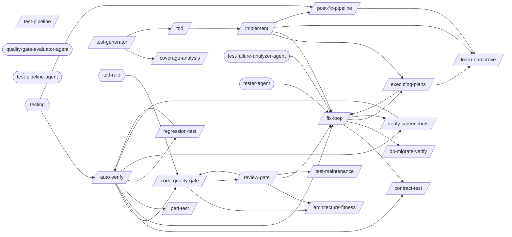

# Testing Pipeline

> Test execution, verification, quality enforcement, and the fix-verify-commit chain.

> Auto-generated by `scripts/generate_workflow_docs.py` | Last updated: 2026-03-21 11:56 UTC

## Flow Diagram

## Skills

| Skill | Version | Description | Calls | Called By |
|-------|---------|-------------|-------|----------|
| `/architecture-fitness` | 1.0.0 | Automated architecture conformance checks: dependency direction validation, c... | — | `/code-quality-gate`, `/review-gate` |
| `/auto-verify` | 2.0.0 | Unified verification pipeline: identifies changed files, maps to targeted tes... | `/code-quality-gate`, `/contract-test`, `/fix-loop`, `/perf-test`, `/regression-test`, `/verify-screenshots` | `/regression-test`, `/verify-screenshots` |
| `/code-quality-gate` | 1.2.0 | Post-implementation code quality enforcement: cyclomatic complexity, duplicat... | `/architecture-fitness`, `/review-gate` | `/auto-verify`, `/review-gate` |
| `/contract-test` | 1.1.0 | Implement consumer-driven contract testing with Pact. Write consumer contract... | — | `/auto-verify`, `/fix-loop` |
| `/coverage-analysis` | 1.0.0 | Analyze test coverage across a project, identify gaps in critical code paths,... | — | `/test-generator` |
| `/db-migrate-verify` | 1.0.0 | Verify database migrations: run forward, validate schema, run backward, valid... | — | `/fix-loop` |
| `/executing-plans` | 1.0.0 | Execute a pre-written implementation plan step by step. Parses tasks from a p... | `/fix-loop`, `/learn-n-improve` | `/fix-loop`, `/implement` |
| `/fix-loop` | 1.2.0 | Iterative fix cycle: analyze failures, apply minimal fixes, optionally retest... | `/contract-test`, `/db-migrate-verify`, `/executing-plans`, `/verify-screenshots` | `/auto-verify`, `/executing-plans`, `/implement`, `/review-gate`, `/test-failure-analyzer-agent`, `/tester-agent` |
| `/implement` | 1.0.0 | Implement a feature or fix following a structured workflow: requirements anal... | `/executing-plans`, `/fix-loop`, `/learn-n-improve`, `/post-fix-pipeline` | `/tdd` |
| `/learn-n-improve` | 2.0.0 | Learning system analysis and self-modification. Analyzes session outcomes, up... | — | `/executing-plans`, `/implement`, `/post-fix-pipeline` |
| `/perf-test` | 1.1.0 | Run performance tests using k6 load testing, Lighthouse web performance audit... | — | `/auto-verify` |
| `/post-fix-pipeline` | 2.0.0 | Post-fix completion pipeline: reads upstream auto-verify gate, updates docume... | `/learn-n-improve` | `/implement` |
| `/regression-test` | 1.1.0 | Run targeted regression tests based on code changes. Analyze git diffs to ide... | `/auto-verify` | `/auto-verify` |
| `/review-gate` | 2.3.0 | Stage 9 orchestrator: sequences all review sub-skills (code-quality-gate, arc... | `/architecture-fitness`, `/code-quality-gate`, `/fix-loop`, `/test-maintenance` | `/code-quality-gate` |
| `/tdd` | 1.0.1 | Execute strict Test-Driven Development using the red-green-refactor cycle. Wr... | `/implement` | `/test-generator` |
| `/test-generator` | 1.2.0 | Auto-generate test suites from PRD requirements, schema, or API specs. Produc... | `/coverage-analysis`, `/tdd` | — |
| `/test-maintenance` | 1.2.0 | Audit, clean up, and optimize a test suite. Identifies dead tests, duplicates... | — | `/review-gate` |
| `/test-pipeline` | 1.0.0 | Run the full test verification pipeline: fix failures, verify changes, review... | — | — |
| `/verify-screenshots` | 1.1.0 | Visual regression testing and screenshot verification. Validates files, uses ... | `/auto-verify` | `/auto-verify`, `/fix-loop` |

## Agents

| Agent | Description | Dispatched By |
|-------|-------------|---------------|
| `quality-gate-evaluator-agent` | Use this agent to evaluate code or content against a set of quality criteria.... | — |
| `test-failure-analyzer-agent` | Use this agent to diagnose test failures — reads test output, classifies by r... | — |
| `test-pipeline-agent` | Orchestrates the full test verification pipeline: cleanup, stage dispatch, ga... | — |
| `tester-agent` | Senior QA engineer specializing in comprehensive testing and quality assuranc... | — |

## Rules

| Rule | Description |
|------|-------------|
| `tdd-rule` | Test-driven development workflow rules for red-green-refactor cycle. |
| `testing` | Testing conventions and best practices. |

## Cross-Workflow Connections

**Outgoing** (this workflow feeds into):
- `continue` (skill)
- `security-audit` (skill)
- `writing-plans` (skill)
- `writing-skills` (skill)

**Incoming** (fed by):
- `adversarial-review` (skill)
- `android-run-e2e` (skill)
- `android-run-tests` (skill)
- `anthropic-agent-orchestration-guide` (skill)
- `brainstorm` (skill)
- `configuration-ssot` (rule)
- `fastapi-run-backend-tests` (skill)
- `fix-issue` (skill)
- `pattern-self-containment` (rule)
- `pr-standards` (skill)
- `project-manager-agent` (agent)
- `save-session` (skill)
- `skill-factory` (skill)
- `skill-master` (skill)
- `subagent-driven-dev` (skill)

<!-- MANUAL ANNOTATIONS -->
<!-- Add custom notes below this line. They are preserved on regeneration. -->

<!-- Add custom notes below this line. They are preserved on regeneration. -->
