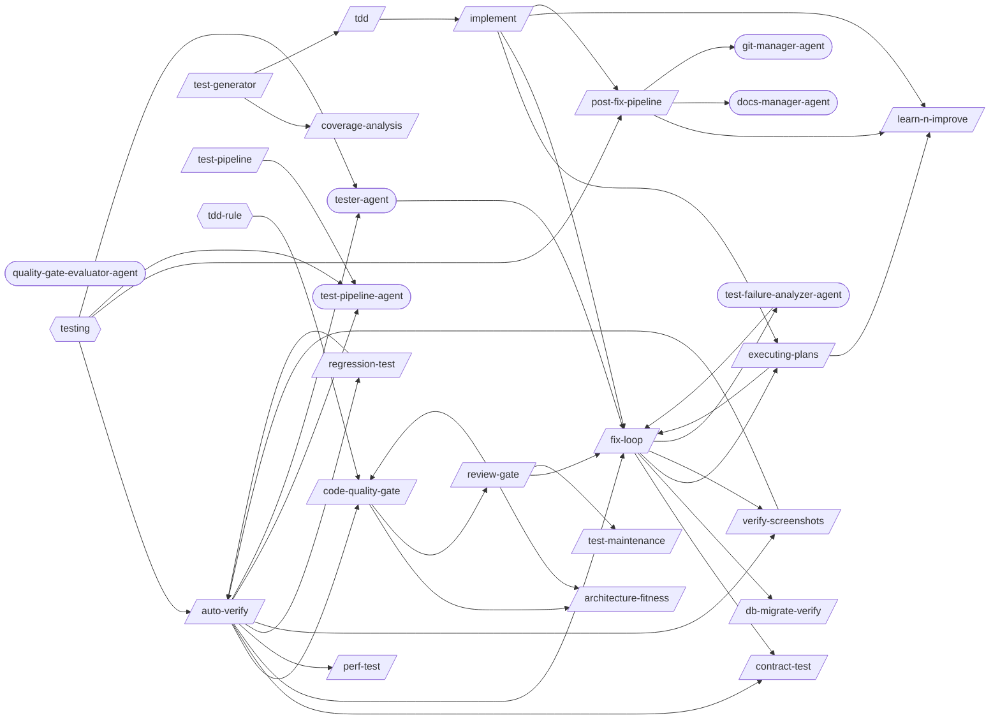

# Testing Pipeline

> Test execution, verification, quality enforcement, and the fix-verify-commit chain.

> Auto-generated by `scripts/generate_workflow_docs.py` | Last updated: 2026-03-24 07:11 UTC

## Overview



## Detailed Flow

Step-level flow showing gates (diamonds), delegations (dashed), and artifacts (cylinders).

```mermaid
graph TD
    subgraph architecture_fitness_sub["Architecture Fitness"]
        architecture_fitness_s1["Step 1: Detect Architecture Style"]
        architecture_fitness_s2["Step 2: Dependency Direction Validation"]
        architecture_fitness_s1 --> architecture_fitness_s2
        architecture_fitness_s3["Step 3: Circular Dependency Detection"]
        architecture_fitness_s2 --> architecture_fitness_s3
        architecture_fitness_s4["Step 4: Coupling & Cohesion Metrics"]
        architecture_fitness_s3 --> architecture_fitness_s4
        architecture_fitness_s5["Step 5: Module Size & Boundary Analysis"]
        architecture_fitness_s4 --> architecture_fitness_s5
        architecture_fitness_s6{{Step 6: ADR Lifecycle Review}}
        architecture_fitness_s5 --> architecture_fitness_s6
        architecture_fitness_s7{{Step 7: Fitness Report}}
        architecture_fitness_s6 --> architecture_fitness_s7
    end

    subgraph auto_verify_sub["Auto Verify"]
        auto_verify_s0{{Step 0: Gate Check — Read Upstream Results}}
        test_pipeline_agent_ext((test-pipeline-agent))
        auto_verify_s0 -.-> test_pipeline_agent_ext
        auto_verify_test_results_fix_loop_json[("test-results/fix-loop.json")]
        auto_verify_test_results_fix_loop_json -.->|reads| auto_verify_s0
        auto_verify_s0_block[/BLOCK/]
        auto_verify_s0 -->|FAILED| auto_verify_s0_block
        auto_verify_s1{{Step 1: Map Changes to Tests (via /regression-test)}}
        auto_verify_s0 -->|OK| auto_verify_s1
        regression_test_ext([/regression-test/])
        auto_verify_s1 -.-> regression_test_ext
        tester_agent_ext((tester-agent))
        auto_verify_s1 -.-> tester_agent_ext
        auto_verify_test_results_regression_test_json[("test-results/regression-test.json")]
        auto_verify_test_results_regression_test_json -.->|reads| auto_verify_s1
        auto_verify_s2{{Step 2: Execute Tests (via tester-agent)}}
        auto_verify_s1 --> auto_verify_s2
        verify_screenshots_ext([/verify-screenshots/])
        auto_verify_s2 -.-> verify_screenshots_ext
        auto_verify_s2 -.-> tester_agent_ext
        auto_verify_test_evidence_run_id_manifest_json[("test-evidence/{run_id}/manifest.json")]
        auto_verify_s2 -->|writes| auto_verify_test_evidence_run_id_manifest_json
        auto_verify_test_evidence_run_id_visual_review_json[("test-evidence/{run_id}/visual-review.json")]
        auto_verify_s2 -->|writes| auto_verify_test_evidence_run_id_visual_review_json
        auto_verify_s3{{Step 3: Evaluate Results}}
        auto_verify_s2 --> auto_verify_s3
        fix_loop_ext([/fix-loop/])
        auto_verify_s3 -.-> fix_loop_ext
        auto_verify_s4{{Step 4: Quality Gate (if tests pass)}}
        auto_verify_s3 --> auto_verify_s4
        code_quality_gate_ext([/code-quality-gate/])
        auto_verify_s4 -.-> code_quality_gate_ext
        auto_verify_s4A{{Step 4A: Contract Verification (if API changed)}}
        auto_verify_s4 --> auto_verify_s4A
        contract_test_ext([/contract-test/])
        auto_verify_s4A -.-> contract_test_ext
        auto_verify_s4B{{Step 4B: Performance Baseline (if perf-sensitive code changed)}}
        auto_verify_s4A --> auto_verify_s4B
        perf_test_ext([/perf-test/])
        auto_verify_s4B -.-> perf_test_ext
        auto_verify_s5{{Step 5: Report}}
        auto_verify_s4B --> auto_verify_s5
        auto_verify_s6{{Step 6: Structured Output}}
        auto_verify_s5 --> auto_verify_s6
        auto_verify_test_results_auto_verify_json[("test-results/auto-verify.json")]
        auto_verify_s6 -->|writes| auto_verify_test_results_auto_verify_json
    end

    subgraph code_quality_gate_sub["Code Quality Gate"]
        code_quality_gate_s1["Step 1: Identify Changed Files"]
        code_quality_gate_s2{{Step 2: Cyclomatic Complexity}}
        code_quality_gate_s1 --> code_quality_gate_s2
        code_quality_gate_s3{{Step 3: Duplication Detection}}
        code_quality_gate_s2 --> code_quality_gate_s3
        code_quality_gate_s4["Step 4: SOLID Principles Checklist"]
        code_quality_gate_s3 --> code_quality_gate_s4
        code_quality_gate_s5{{Step 5: Clean Architecture Layer Validation}}
        code_quality_gate_s4 --> code_quality_gate_s5
        architecture_fitness_ext([/architecture-fitness/])
        code_quality_gate_s5 -.-> architecture_fitness_ext
        review_gate_ext([/review-gate/])
        code_quality_gate_s5 -.-> review_gate_ext
        code_quality_gate_s6["Step 6: Structured Logging Audit"]
        code_quality_gate_s5 --> code_quality_gate_s6
        code_quality_gate_s7{{Step 7: Error Handling Strategy Audit}}
        code_quality_gate_s6 --> code_quality_gate_s7
        code_quality_gate_s8{{Step 8: Coverage Diff Analysis}}
        code_quality_gate_s7 --> code_quality_gate_s8
        code_quality_gate_s9["Step 9: TDD Refactor Phase"]
        code_quality_gate_s8 --> code_quality_gate_s9
        code_quality_gate_s10{{Step 10: Dead Code Detection}}
        code_quality_gate_s9 --> code_quality_gate_s10
        code_quality_gate_s11{{Step 11: Quality Report}}
        code_quality_gate_s10 --> code_quality_gate_s11
        code_quality_gate_s12{{Step 12: Structured Output}}
        code_quality_gate_s11 --> code_quality_gate_s12
        code_quality_gate_test_results_code_quality_gate_json[("test-results/code-quality-gate.json")]
        code_quality_gate_s12 -->|writes| code_quality_gate_test_results_code_quality_gate_json
    end

    subgraph contract_test_sub["Contract Test"]
        contract_test_s1["Step 1: Identify Consumers and Providers"]
        contract_test_s2["Step 2: Write Consumer Contract Tests"]
        contract_test_s1 --> contract_test_s2
        contract_test_s3["Step 3: Generate Pact Files"]
        contract_test_s2 --> contract_test_s3
        contract_test_s4["Step 4: Run Provider Verification"]
        contract_test_s3 --> contract_test_s4
        contract_test_s5["Step 5: Set Up Pact Broker (Optional)"]
        contract_test_s4 --> contract_test_s5
        contract_test_s6["Step 6: CI Integration"]
        contract_test_s5 --> contract_test_s6
    end

    subgraph coverage_analysis_sub["Coverage Analysis"]
        coverage_analysis_s1{{Step 1: Detect Framework}}
        coverage_analysis_s2["Step 2: Run Coverage"]
        coverage_analysis_s1 --> coverage_analysis_s2
        coverage_analysis_s3{{Step 3: Parse Results}}
        coverage_analysis_s2 --> coverage_analysis_s3
        coverage_analysis_s4{{Step 4: Identify Gaps}}
        coverage_analysis_s3 --> coverage_analysis_s4
        coverage_analysis_s5["Step 5: Prioritize"]
        coverage_analysis_s4 --> coverage_analysis_s5
        coverage_analysis_s6["Step 6: Report"]
        coverage_analysis_s5 --> coverage_analysis_s6
    end

    subgraph db_migrate_verify_sub["Db Migrate Verify"]
        db_migrate_verify_s1["Step 1: Detect Migration Framework"]
        db_migrate_verify_s2["Step 2: Pre-Migration State"]
        db_migrate_verify_s1 --> db_migrate_verify_s2
        db_migrate_verify_s3["Step 3: Forward Migration"]
        db_migrate_verify_s2 --> db_migrate_verify_s3
        db_migrate_verify_s4["Step 4: Schema Validation"]
        db_migrate_verify_s3 --> db_migrate_verify_s4
        db_migrate_verify_s5["Step 5: Seed Data Test (if --seed-data)"]
        db_migrate_verify_s4 --> db_migrate_verify_s5
        db_migrate_verify_s6["Step 6: Rollback Verification (if --rollback or always)"]
        db_migrate_verify_s5 --> db_migrate_verify_s6
        db_migrate_verify_s7{{Step 7: Dangerous Operation Detection}}
        db_migrate_verify_s6 --> db_migrate_verify_s7
        db_migrate_verify_s7A["Step 7A: Real Database Testing (Testcontainers + Respawn)"]
        db_migrate_verify_s7 --> db_migrate_verify_s7A
        db_migrate_verify_s8["Step 8: Report"]
        db_migrate_verify_s7A --> db_migrate_verify_s8
    end

    subgraph executing_plans_sub["Executing Plans"]
        executing_plans_s1{{Step 1: Load and Validate the Plan}}
        executing_plans_s2["Step 2: Pre-Execution Setup"]
        executing_plans_s1 --> executing_plans_s2
        executing_plans_s3{{Step 3: Execute Tasks}}
        executing_plans_s2 --> executing_plans_s3
        executing_plans_s4{{Step 4: Handle Failures}}
        executing_plans_s3 --> executing_plans_s4
        executing_plans_s4 -.-> fix_loop_ext
        executing_plans_s5["Step 5: Resume Support"]
        executing_plans_s4 --> executing_plans_s5
        continue_ext([/continue/])
        executing_plans_s5 -.-> continue_ext
        executing_plans_s6["Step 6: Completion Summary"]
        executing_plans_s5 --> executing_plans_s6
        learn_n_improve_ext([/learn-n-improve/])
        executing_plans_s6 -.-> learn_n_improve_ext
        executing_plans_s7["Step 7: Edge Cases and Special Handling"]
        executing_plans_s6 --> executing_plans_s7
    end

    subgraph fix_loop_sub["Fix Loop"]
        fix_loop_s1{{Step 1: Analyze Failure (via test-failure-analyzer-agent)}}
        test_failure_analyzer_agent_ext((test-failure-analyzer-agent))
        fix_loop_s1 -.-> test_failure_analyzer_agent_ext
        fix_loop_s1A["Step 1A: Flaky Test Detection"]
        fix_loop_s1 --> fix_loop_s1A
        fix_loop_s2["Step 2: Apply Fix"]
        fix_loop_s1A --> fix_loop_s2
        fix_loop_s3["Step 3: Retest (Full Loop mode only)"]
        fix_loop_s2 --> fix_loop_s3
        fix_loop_s4["Step 4: Report"]
        fix_loop_s3 --> fix_loop_s4
        fix_loop_s5{{Step 5: Structured Output}}
        fix_loop_s4 --> fix_loop_s5
        fix_loop_test_results_fix_loop_json[("test-results/fix-loop.json")]
        fix_loop_s5 -->|writes| fix_loop_test_results_fix_loop_json
    end

    subgraph implement_sub["Implement"]
        implement_s1["Step 1: Analyze Requirements"]
        writing_plans_ext([/writing-plans/])
        implement_s1 -.-> writing_plans_ext
        implement_s2["Step 2: Create/Update Tests"]
        implement_s1 --> implement_s2
        implement_s3["Step 3: Implement the Feature"]
        implement_s2 --> implement_s3
        implement_s4["Step 4: Run Tests"]
        implement_s3 --> implement_s4
        implement_s5{{Step 5: Fix Loop (if tests fail)}}
        implement_s4 --> implement_s5
        implement_s5 -.-> fix_loop_ext
        implement_s6{{Step 6: Verification (Mandatory Gate)}}
        implement_s5 --> implement_s6
        post_fix_pipeline_ext([/post-fix-pipeline/])
        implement_s6 -.-> post_fix_pipeline_ext
        implement_s7["Step 7: Post-Implementation (Optional)"]
        implement_s6 --> implement_s7
        executing_plans_ext([/executing-plans/])
        implement_s7 -.-> executing_plans_ext
        implement_s8{{Step 8: Structured Output}}
        implement_s7 --> implement_s8
        implement_test_results_implement_json[("test-results/implement.json")]
        implement_s8 -->|writes| implement_test_results_implement_json
    end

    subgraph learn_n_improve_sub["Learn N Improve"]
        learn_n_improve_s1["Step 1: Gather Session Evidence"]
        learn_n_improve_s2["Step 2: Analyze Outcomes"]
        learn_n_improve_s1 --> learn_n_improve_s2
        learn_n_improve_s3["Step 3: Build Error→Fix→Lesson Database"]
        learn_n_improve_s2 --> learn_n_improve_s3
        learn_n_improve_s4["Step 4: Update Memory Topics"]
        learn_n_improve_s3 --> learn_n_improve_s4
        learn_n_improve_s5["Step 5: Pattern Detection (every 10th learning)"]
        learn_n_improve_s4 --> learn_n_improve_s5
        learn_n_improve_s6["Step 6: Report"]
        learn_n_improve_s5 --> learn_n_improve_s6
    end

    subgraph perf_test_sub["Perf Test"]
        perf_test_s1["Step 1: Extract NFR Thresholds from PRD"]
        perf_test_s2["Step 2: Write k6 Scripts"]
        perf_test_s1 --> perf_test_s2
        perf_test_s3["Step 3: Run k6 Load Tests"]
        perf_test_s2 --> perf_test_s3
        perf_test_s4["Step 4: Run Lighthouse Audit"]
        perf_test_s3 --> perf_test_s4
        perf_test_s5["Step 5: Analyze Bundle Size"]
        perf_test_s4 --> perf_test_s5
        perf_test_s6["Step 6: Compare Against Baseline"]
        perf_test_s5 --> perf_test_s6
        perf_test_s7["Step 7: CI Integration"]
        perf_test_s6 --> perf_test_s7
        perf_test_s8{{Step 8: Structured Output}}
        perf_test_s7 --> perf_test_s8
        perf_test_test_results_perf_test_json[("test-results/perf-test.json")]
        perf_test_s8 -->|writes| perf_test_test_results_perf_test_json
    end

    subgraph post_fix_pipeline_sub["Post Fix Pipeline"]
        post_fix_pipeline_s0{{Step 0: Gate Check — Read Upstream Results}}
        post_fix_pipeline_test_evidence__visual_review_json[("test-evidence/*/visual-review.json")]
        post_fix_pipeline_test_evidence__visual_review_json -.->|reads| post_fix_pipeline_s0
        post_fix_pipeline_test_results_auto_verify_json[("test-results/auto-verify.json")]
        post_fix_pipeline_test_results_auto_verify_json -.->|reads| post_fix_pipeline_s0
        post_fix_pipeline_s0_block[/BLOCK/]
        post_fix_pipeline_s0 -->|FAILED| post_fix_pipeline_s0_block
        post_fix_pipeline_s1{{Step 1: Documentation Updates}}
        post_fix_pipeline_s0 -->|OK| post_fix_pipeline_s1
        docs_manager_agent_ext((docs-manager-agent))
        post_fix_pipeline_s1 -.-> docs_manager_agent_ext
        post_fix_pipeline_s2{{Step 2: Git Commit}}
        post_fix_pipeline_s1 --> post_fix_pipeline_s2
        git_manager_agent_ext((git-manager-agent))
        post_fix_pipeline_s2 -.-> git_manager_agent_ext
        post_fix_pipeline_s3["Step 3: Learning Capture"]
        post_fix_pipeline_s2 --> post_fix_pipeline_s3
        post_fix_pipeline_s4{{Step 4: Structured JSON Output}}
        post_fix_pipeline_s3 --> post_fix_pipeline_s4
        post_fix_pipeline_test_results_post_fix_pipeline_json[("test-results/post-fix-pipeline.json")]
        post_fix_pipeline_s4 -->|writes| post_fix_pipeline_test_results_post_fix_pipeline_json
    end

    subgraph regression_test_sub["Regression Test"]
        regression_test_s1["Step 1: Identify Changes"]
        regression_test_s2["Step 2: Map Changes to Tests"]
        regression_test_s1 --> regression_test_s2
        regression_test_s3["Step 3: Classify Risk"]
        regression_test_s2 --> regression_test_s3
        regression_test_s4["Step 4: Execute Targeted Tests"]
        regression_test_s3 --> regression_test_s4
        regression_test_s5["Step 5: Expand to Full Suite"]
        regression_test_s4 --> regression_test_s5
        regression_test_s6{{Step 6: Report}}
        regression_test_s5 --> regression_test_s6
        auto_verify_ext([/auto-verify/])
        regression_test_s6 -.-> auto_verify_ext
        regression_test_test_results_regression_test_json[("test-results/regression-test.json")]
        regression_test_s6 -->|writes| regression_test_test_results_regression_test_json
    end

    subgraph review_gate_sub["Review Gate"]
        review_gate_s0{{Step 0: Parse Arguments and Gather Context}}
        review_gate_s1{{Step 1: Batch A — Code Quality + Architecture (Parallel)}}
        review_gate_s0 --> review_gate_s1
        review_gate_s1 -.-> fix_loop_ext
        review_gate_s2{{Step 2: Batch B — Security + Risk Scoring (Parallel)}}
        review_gate_s1 --> review_gate_s2
        review_gate_s3["Step 3: Batch C — Adversarial Review → PR Standards (Sequential)"]
        review_gate_s2 --> review_gate_s3
        review_gate_s4{{Step 4: Fix Loop (Conditional)}}
        review_gate_s3 --> review_gate_s4
        review_gate_s5{{Step 5: Generate Consolidated Review Report}}
        review_gate_s4 --> review_gate_s5
        review_gate_test_results_review_gate_json[("test-results/review-gate.json")]
        review_gate_s5 -->|writes| review_gate_test_results_review_gate_json
        review_gate_s6{{Step 6: PR Creation (Conditional)}}
        review_gate_s5 --> review_gate_s6
        review_gate_s6 -->|writes| review_gate_test_results_review_gate_json
        review_gate_s7{{Step 7: Post-Review Feedback Loop (Conditional)}}
        review_gate_s6 --> review_gate_s7
        test_maintenance_ext([/test-maintenance/])
        review_gate_s7 -.-> test_maintenance_ext
        review_gate_s7 -->|writes| review_gate_test_results_review_gate_json
    end

    subgraph tdd_sub["Tdd"]
        tdd_s1["Step 1: RED — Write a Failing Test"]
        tdd_s2["Step 2: GREEN — Minimal Implementation"]
        tdd_s1 --> tdd_s2
        tdd_s3{{Step 3: REFACTOR — Clean Up}}
        tdd_s2 --> tdd_s3
        implement_ext([/implement/])
        tdd_s3 -.-> implement_ext
    end

    subgraph test_generator_sub["Test Generator"]
        test_generator_s1["Step 1: Parse Sources"]
        coverage_analysis_ext([/coverage-analysis/])
        test_generator_s1 -.-> coverage_analysis_ext
        test_generator_s2["Step 2: Detect Test Framework"]
        test_generator_s1 --> test_generator_s2
        test_generator_s3["Step 3: Generate Shared Test Infrastructure"]
        test_generator_s2 --> test_generator_s3
        test_generator_s4["Step 4: Generate Unit Tests"]
        test_generator_s3 --> test_generator_s4
        test_generator_s5["Step 5: Generate API Tests"]
        test_generator_s4 --> test_generator_s5
        test_generator_s6["Step 6: Generate E2E Test Stubs"]
        test_generator_s5 --> test_generator_s6
        test_generator_s7["Step 7: Generate BDD Scenarios"]
        test_generator_s6 --> test_generator_s7
        test_generator_s8["Step 8: Property-Based Tests"]
        test_generator_s7 --> test_generator_s8
        test_generator_s9["Step 9: Coverage Configuration"]
        test_generator_s8 --> test_generator_s9
        test_generator_s10["Step 10: Mutation Testing Setup"]
        test_generator_s9 --> test_generator_s10
        test_generator_s11["Step 11: Snapshot Test Stubs"]
        test_generator_s10 --> test_generator_s11
        test_generator_s12["Step 12: Accessibility Test Stubs"]
        test_generator_s11 --> test_generator_s12
        test_generator_s13{{Step 13: Red Phase Gate Verification}}
        test_generator_s12 --> test_generator_s13
        test_generator_s14{{Step 14: Output Summary & Structured Results}}
        test_generator_s13 --> test_generator_s14
        tdd_ext([/tdd/])
        test_generator_s14 -.-> tdd_ext
        test_generator_test_results_test_generator_json[("test-results/test-generator.json")]
        test_generator_s14 -->|writes| test_generator_test_results_test_generator_json
    end

    subgraph test_maintenance_sub["Test Maintenance"]
        test_maintenance_s1["Step 1: Audit Test Suite"]
        test_maintenance_s2["Step 2: Find Dead Tests"]
        test_maintenance_s1 --> test_maintenance_s2
        test_maintenance_s3["Step 3: Detect Duplicates"]
        test_maintenance_s2 --> test_maintenance_s3
        test_maintenance_s4["Step 4: Identify Slow Tests"]
        test_maintenance_s3 --> test_maintenance_s4
        test_maintenance_s5["Step 5: Improve Readability"]
        test_maintenance_s4 --> test_maintenance_s5
        test_maintenance_s6["Step 6: Optimize Execution"]
        test_maintenance_s5 --> test_maintenance_s6
        test_maintenance_s7["Step 7: Report"]
        test_maintenance_s6 --> test_maintenance_s7
        test_maintenance_s8{{Step 8: Quarantine Age Audit}}
        test_maintenance_s7 --> test_maintenance_s8
    end

    subgraph test_pipeline_sub["Test Pipeline"]
        test_pipeline_s1["Step 1: Determine Mode"]
        test_pipeline_s2["Step 2: Check Configuration"]
        test_pipeline_s1 --> test_pipeline_s2
        test_pipeline_s3{{Step 3: Dispatch Orchestrator}}
        test_pipeline_s2 --> test_pipeline_s3
        test_pipeline_s3 -.-> test_pipeline_agent_ext
        test_pipeline_s4{{Step 4: Report Results}}
        test_pipeline_s3 --> test_pipeline_s4
    end

    subgraph verify_screenshots_sub["Verify Screenshots"]
        verify_screenshots_s1["Step 1: File Validation"]
        verify_screenshots_s2["Step 2: Content Analysis"]
        verify_screenshots_s1 --> verify_screenshots_s2
        verify_screenshots_s3["Step 3: Before/After Comparison (if applicable)"]
        verify_screenshots_s2 --> verify_screenshots_s3
        verify_screenshots_s4{{Step 4: Report}}
        verify_screenshots_s3 --> verify_screenshots_s4
    end

    auto_verify_s4 ==> code_quality_gate_s1
    auto_verify_s4A ==> contract_test_s1
    auto_verify_s3 ==> fix_loop_s1
    auto_verify_s4B ==> perf_test_s1
    auto_verify_s1 ==> regression_test_s1
    auto_verify_s2 ==> verify_screenshots_s1
    code_quality_gate_s5 ==> architecture_fitness_s1
    code_quality_gate_s5 ==> review_gate_s0
    executing_plans_s4 ==> fix_loop_s1
    executing_plans_s6 ==> learn_n_improve_s1
    implement_s7 ==> executing_plans_s1
    implement_s5 ==> fix_loop_s1
    implement_s6 ==> post_fix_pipeline_s0
    regression_test_s6 ==> auto_verify_s0
    review_gate_s1 ==> fix_loop_s1
    review_gate_s7 ==> test_maintenance_s1
    tdd_s3 ==> implement_s1
    test_generator_s1 ==> coverage_analysis_s1
    test_generator_s14 ==> tdd_s1
```

## Skills

| Skill | Version | Description | Calls | Called By |
|-------|---------|-------------|-------|----------|
| `/architecture-fitness` | 1.0.0 | Validate architecture conformance including dependency direction, circular de... | — | `/code-quality-gate`, `/review-gate` |
| `/auto-verify` | 2.0.0 | Run a verification pipeline that identifies changed files, maps to targeted t... | `/code-quality-gate`, `/contract-test`, `/fix-loop`, `/perf-test`, `/regression-test`, `/verify-screenshots`, `/test-pipeline-agent`, `/tester-agent` | `/regression-test`, `/verify-screenshots` |
| `/code-quality-gate` | 1.2.0 | Enforce code quality standards including cyclomatic complexity, duplication d... | `/architecture-fitness`, `/review-gate` | `/auto-verify`, `/review-gate` |
| `/contract-test` | 1.1.0 | Implement consumer-driven contract testing with Pact. Write consumer contract... | — | `/auto-verify`, `/fix-loop` |
| `/coverage-analysis` | 1.0.0 | Analyze test coverage across a project, identify gaps in critical code paths,... | — | `/test-generator` |
| `/db-migrate-verify` | 1.0.0 | Verify database migrations: run forward, validate schema, run backward, valid... | — | `/fix-loop` |
| `/executing-plans` | 1.0.0 | Execute a pre-written implementation plan step by step. Parses tasks from a p... | `/fix-loop`, `/learn-n-improve` | `/fix-loop`, `/implement` |
| `/fix-loop` | 1.2.0 | Analyze failures and iteratively apply minimal fixes, optionally retesting un... | `/contract-test`, `/db-migrate-verify`, `/executing-plans`, `/verify-screenshots`, `/test-failure-analyzer-agent` | `/auto-verify`, `/executing-plans`, `/implement`, `/review-gate`, `/test-failure-analyzer-agent`, `/tester-agent` |
| `/implement` | 1.0.0 | Implement a feature or fix following a structured workflow: requirements anal... | `/executing-plans`, `/fix-loop`, `/learn-n-improve`, `/post-fix-pipeline` | `/tdd` |
| `/learn-n-improve` | 2.0.0 | Analyze session outcomes and update memory topics (testing-lessons, fix-patte... | — | `/executing-plans`, `/implement`, `/post-fix-pipeline` |
| `/perf-test` | 1.2.0 | Run performance tests using k6 load testing, Lighthouse web performance audit... | — | `/auto-verify` |
| `/post-fix-pipeline` | 2.0.0 | Finalize verified changes by reading the upstream auto-verify gate, updating ... | `/learn-n-improve`, `/docs-manager-agent`, `/git-manager-agent` | `/implement` |
| `/regression-test` | 1.1.0 | Run targeted regression tests based on code changes. Analyze git diffs to ide... | `/auto-verify` | `/auto-verify` |
| `/review-gate` | 2.3.0 | Orchestrate all review sub-skills (code-quality-gate, architecture-fitness, s... | `/architecture-fitness`, `/code-quality-gate`, `/fix-loop`, `/test-maintenance` | `/code-quality-gate` |
| `/tdd` | 1.0.1 | Execute strict Test-Driven Development using the red-green-refactor cycle. Wr... | `/implement` | `/test-generator` |
| `/test-generator` | 1.2.0 | Generate test suites from PRD requirements, schema, or API specs. Produces sh... | `/coverage-analysis`, `/tdd` | — |
| `/test-maintenance` | 1.2.0 | Audit and optimize test suites by identifying dead tests, duplicates, slow te... | — | `/review-gate` |
| `/test-pipeline` | 1.0.0 | Run the full test verification pipeline: fix failures, verify changes, review... | `/test-pipeline-agent` | — |
| `/verify-screenshots` | 1.1.0 | Validate screenshots against baselines using multimodal content analysis for ... | `/auto-verify` | `/auto-verify`, `/fix-loop` |

## Agents

| Agent | Description | Dispatched By |
|-------|-------------|---------------|
| `docs-manager-agent` | Use this agent for documentation updates — continuation prompts, requirement ... | `/post-fix-pipeline` |
| `git-manager-agent` | Git Operations Specialist. Securely stages, commits, and pushes code changes ... | `/post-fix-pipeline` |
| `quality-gate-evaluator-agent` | Use this agent to evaluate code or content against a set of quality criteria.... | — |
| `test-failure-analyzer-agent` | Use this agent to diagnose test failures — reads test output, classifies by r... | `/fix-loop` |
| `test-pipeline-agent` | Orchestrates the full test verification pipeline: cleanup, stage dispatch, ga... | `/auto-verify`, `/test-pipeline` |
| `tester-agent` | Senior QA engineer specializing in comprehensive testing and quality assuranc... | `/auto-verify` |

## Rules

| Rule | Description |
|------|-------------|
| `tdd-rule` | Test-driven development workflow rules for red-green-refactor cycle. |
| `testing` | Testing conventions and best practices. |

## Cross-Workflow Connections

**Outgoing** (this workflow feeds into):
- `adr` (skill)
- `api-docs-generator` (skill)
- `changelog-contributing` (skill)
- `continue` (skill)
- `diataxis-docs` (skill)
- `doc-staleness` (skill)
- `doc-structure-enforcer` (skill)
- `security-audit` (skill)
- `writing-plans` (skill)
- `writing-skills` (skill)

**Incoming** (fed by):
- `adr` (skill)
- `adversarial-review` (skill)
- `android-run-e2e` (skill)
- `android-run-tests` (skill)
- `anthropic-agent-orchestration-guide` (skill)
- `api-docs-generator` (skill)
- `apply-selections` (skill)
- `brainstorm` (skill)
- `bun-elysia-test` (skill)
- `changelog-contributing` (skill)
- `claude-behavior` (rule)
- `configuration-ssot` (rule)
- `diataxis-docs` (skill)
- `doc-staleness` (skill)
- `doc-structure-enforcer` (skill)
- `fastapi-run-backend-tests` (skill)
- `firebase-test` (skill)
- `fix-issue` (skill)
- `flutter-e2e-test` (skill)
- `pattern-self-containment` (rule)
- `pr-standards` (skill)
- `project-manager-agent` (agent)
- `save-session` (skill)
- `skill-factory` (skill)
- `skill-master` (skill)
- `subagent-driven-dev` (skill)

<!-- MANUAL ANNOTATIONS -->
<!-- Add custom notes below this line. They are preserved on regeneration. -->
